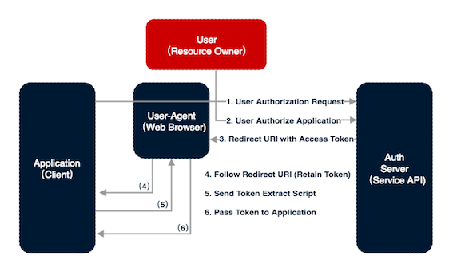
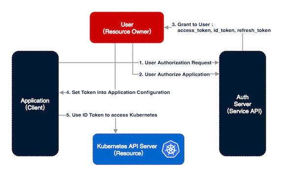
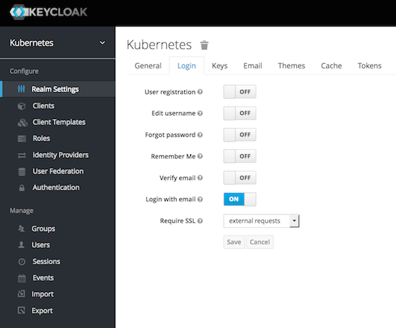
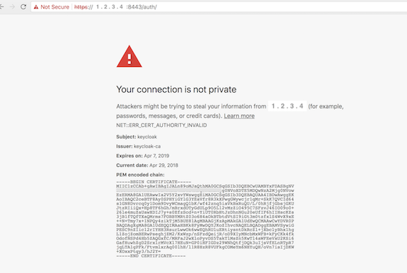

# 为 Kubernetes 搭建支持 OpenId Connect 的身份认证系统
Kubernetes 同外部认证服务进行集成的流程和配置技巧

**标签:** 云计算

[原文链接](https://developer.ibm.com/zh/articles/cl-lo-openid-connect-kubernetes-authentication/)

周 瓒

发布: 2018-10-17

* * *

## 前言

Kubernetes 本身几乎不提供任何用户身份管理和认证功能 (Authentication)。除了服务账户 (Service Account) 外，所有的用户信息都依赖外部的用户管理系统来存储，使用相应的认证插件来进行认证。外部的用户管理系统既可以是一个简单的用户信息文件，也可以是产品级的第三方 Id Provider（IdP）。认证服务是将 Kubernetes 投入生产环境的奠基石，对 Kubernetes 系统管理员、私有云平台搭建者来说，构建认证服务是一个必须掌握的技能。当今主流云服务提供商都会提供 IdP 服务，例如 IBM Cloud IAM，Azure Directory，Google Account 等。对于 [IBM Cloud Container Service](https://cloud.ibm.com/kubernetes/catalog/cluster?cm_sp=ibmdev-_-developer-articles-_-cloudreg)（Kubernetes 云服务） 的使用者来说，认证服务是平台提供的基础服务，已经屏蔽了背后的种种复杂性。但是，理解这部分原理依然能够帮助您更顺畅的使用 Kubernetes。

**免费试用 IBM Cloud**

利用 [IBM Cloud Lite](https://cocl.us/IBM_CLOUD_GCG) 快速轻松地构建您的下一个应用程序。您的免费帐户从不过期，而且您会获得 256 MB 的 Cloud Foundry 运行时内存和包含 Kubernetes 集群的 2 GB 存储空间。

本文详细介绍了如何在 Kubernetes 中使 OpenID Connect（OIDC）Token 进行身份认证、如何使用外部 IdP 实现用户管理、身份认证以及部分用户授权的基本工作原理和典型操作流程，并以较流行的 Keycloak 开源认证服务解决方案为例，搭建了一个示例系统，通过该系统详细介绍了 Kubernetes 同外部认证服务进行集成的流程和配置技巧。

## Kubernetes 身份认证

关于 Kubernetes 身份认证，您有必要先了解的一件有趣的事情，那就是，Kubernetes 本身并不维护任何 “用户账户” 信息，当然也就没法进行任何身份认证。听起来很奇怪，注意，这里说的是 “用户账户”。所有的 Kubernetes cluster 都有两种类型的账户 (account)：“用户账户” (User Account) 和 “服务账户” (Service Account)。

- User Account：是给用户来使用的，全局唯一的，并不受 Kubernetes namespace 限制。
- Service Account： 是给应用程序使用的，给那些运行在 Kubernetes cluster 中的程序访问 api-server 时使用。

Service Account 通过调用 API Call 创建，它和 namespace 绑定，并且在对应的 namespace 中创建了相应了 Secret，供所有该 namespace 中的 pods 访问 API Server 使用。本文不做详述，有兴趣可参考 Kubernetes 官方文档 [Managing Service Accounts](https://kubernetes.io/docs/reference/access-authn-authz/service-accounts-admin/) 。

对于普通用户使用的 User Account，Kubernetes 并不提供管理机制，而是通过选择信任某个独立的外部身份认证系统，来把身份认证“外包”给这个认证系统。由此可见，多数情况下 Kubernetes 的 User Account 认证是发生在 Kubernetes 系统之外的。Kubernetes 支持和各种类型外部用户管理和认证服务的集成。例如，一个可分发私钥的服务，一个用户管理服务（例如 Keystone 或 Google Accounts），甚至可以是一个存储了用户名密码列表的外部文件。 但是，不管外部系统怎么管理，Kubernetes 内部并没有存储任何代表普通用户的 object。也就是说，一个 Kubernetes 系统创建之初，在没有配置外部认证机制的情况下，没有任何用户账户存在，而且，您也无法创建任何用户。

因此，Kubernetes 的设计逻辑是，不能设置信任单个用户，而是设置信任某个第三方的用户管理系统。一旦选择信任某个系统，那该系统中所有的用户都将默认可访问 Kubernetes cluster，起码能通过认证但是，用户究竟能在系统内做什么事情，就是授权系统管理的事情了，而授权是由 Kubernetes 自身控制的。我们在本文中会少量涉及“授权”，更详细的信息可参见 Kubernetes 官方文档 [Authorization Overview](https://kubernetes.io/docs/reference/access-authn-authz/authorization/) 。

## OpenID Connect 简介

Kubernetes 的认证策略有很多种（请参考 Kubernetes Authentication Strategy），其中，通过一个不记名令牌 (Bear Token) 来识别用户是一种相对安全又被各种客户端广泛支持的认证策略。不记名令牌，代表着对某种资源，以某种身份访问的权利，无论是谁，任何获取该令牌的访问者，都被认为具有了相应的身份和访问权限。配合成熟的令牌授予机构，不记名令牌非常适于在生产环境中严肃使用。身份令牌（ID Token）就是一种形式的不记名令牌，它本身记录着一个权威认证机构对用户身份的认证声明，同时还可以包含对这个用户授予了哪些权限的声明，像极了古代官员佩戴的腰牌。Kubernetes 接受和识别的正是这种 ID Token。

由上可知，想得到 ID Token，首先要经过某个权威机构的一套身份认证流程，OpenID Connect 简称 OIDC 就是这样一套认证、授予 ID Token 的协议。OIDC 是 OAuth2 协议的一种扩展，目前在各大主流厂牌的云服务中都被广泛支持和使用，例如 IBM IAM Service、Google Accounts、Azure Active Directory 等。在介绍 OIDC 之前，我们先看一眼 OAuth2 的经典认证过程，来了解几个关键的概念。OAuth2 有多种授权模式 (grant type)，也就是认证流程，有兴趣的读者可以参考 OAuth2 Grant Type。这里我们只看一种相对简化的模式：Implicit Grant Type，其过程如下图 1 所示。

##### 图 1\. OAuth2 Implicit Grant Type 认证流程



让我们通过一个例子模拟一下上图中的各个步骤。假设有一个 web application，通过读取您在某社交平台上的关注和交互，来分析您的人际关系，那么这个 application 是如何获取您社交平台数据的呢？

1. 这个 web application 就是 Client，如果它想访问您在社交平台上的信息 (Resource)，那么首先它要通过这个社交平台认证服务器（Auth Server）的认证。
2. 但是 web application 本身并不知道您的社交平台密码，只有它的使用者，也是平台账户的所有者（Resource Owner），也就是您自己才知道，才有权访问这些信息。所以，web application 会通过它所驻留的浏览器（User-agent），跳转到社交平台的登录界面，并引导您进行登录。是不是所有的 web application 都可以这么干？当然不行，只有那些在该社交平台上注册过的 application 才被授权这么做，这些 application 在注册过程中，需要验明正身，并获得一个身份证： **Client identifier 。 这里面有两个关键的概念需要大家了解：**

    1. **Client Identifier** ：Client 注册需要在 application 发布前完成，注册过程中要提供应用基本信息，获得自己的 Client Id 以及对应的 Credential，这样 Client Application 把用户引导到社交平台进行身份验证的时候，可以向平台表明自己的身份，并证明它的认证请求是合法的。在注册信息中，要提供的最重要的一项信息是： **Redirect URI 。**
    2. **Redirect URI** ：为了防止某些 Client Id 被不法者冒用，在 Client 注册过程中，必须提交一个它的合法跳转地址。也就是说，在认证完成后，不管是成功还是失败，不管提交认证请求的 Client 是真是假，认证服务器只会把认证结果返还给指定的 Redirect URI，并让浏览器（User-Agent）跳转到这个地址继续执行。这样不法者就算盗用了 Client，仿冒了 Application 来诱骗用户进行认证，最终还是无法冒充官方 Redirect URI 来截获认证结果。
3. 一切顺利的情况下，您在社交平台认证页面输入了用户名密码，并通过认证。认证成功后，Auth Server 不会把 Access Token 直接交给 Web Application（因为 Application 可能是仿冒的，Client ID 被盗用了），而是返还给浏览器（User-Agent）。
4. 并指示浏览器跳转回 Client 注册时就约定好的 Redirect URI。
5. 部署在这个 URI 上的只能是正牌的 Web Application（如果没被非法入侵的话），它后续的认证处理逻辑会向浏览器索取寄存的认证结果，通常是 Access Token。
6. 拿到 Access Token 之后，Web Application 就可以用它，畅通无阻的获取您在社交平台上的相应信息（Resource）了。

OIDC 对 OAuth2 协议的主要扩展在于认证成功后，Auth Server 除了能授予 Access Token 之外，还能同时授予 ID Token。OIDC ID Token 是一种 JSON Web Token (JWT) ，这种 token 中包含一些预定义的域，例如：用户 UUID，用户分组等等… 这些信息非常重要，因为 Kubernetes 正是把这些信息作为 User Account Profile，来进行后续的授权（Authorization）操作的。

## Kubernetes 使用 OIDC Token 的认证流程

Kubernetes 使用 OIDC 进行身份认证的流程，比上面介绍的 OAuth2 授权流程要简单不少。在整个过程中， Kubernetes 既作为资源（Resource）服务器，又作为用户代理 User-Agent 存在，但它并不提供引导用户到 Auth Server 进行认证的功能，相反，它要求用户先自行获取 ID Token，然后在访问 Kubernetes API Server 的时候直接提供 ID Token。因此，整个过程中，Kubernetes 其实不需要真正和 Authentication Server 发生任何交互。整个认证流程如下图 2 所示：

##### 图 2\. Kubernetes OIDC 身份认证流程



1. 某个 Kubernetes Client 想访问 Kubernetes API。
2. 用户先自行向 Auth Server (例如 KeyCloak 或 Google Accounts) 认证自己。
3. 拿到 id\_token、refresh\_token。
4. 用户把 token 配置到需要访问 Kubernetes api 的 client application 中（如 kubectl 或 dashboard）。
5. Kubernetes Client 就可以使用 tokens 以用户的身份访问 Kubernetes API 了。

那么问题来了，如果 Kubernetes 不和 Auth Server 发生交互的话，它怎么鉴定这些 Token 是合法的用户 token 呢？这里我们可以参考一下 [Kubernetes Authentication OIDC Tokens](https://kubernetes.io/docs/reference/access-authn-authz/authentication/#openid-connect-tokens) 官方文档，其中它分 9 个步骤更详细描述了从获取 token 到在 kubectl 中使用它们进行访问的流程。其中绝大部分都被上图抽象概括，这里我们重点关注一下步骤 5：

_5.The API server will make sure the JWT signature is valid by checking against the certificate named in the configuration._

能够认证 token 的合法性的关键在于，所有 JWT token 都被其颁发 Auth Service 进行了数字签名，我们只需在 Kubernetes API Server 中配置上我们所信任的这个 Auth Server 的证书（Certificate），并用它来验证收到的 id\_token 中的签名是否合法，就可以验证 token 的真实性。使用这种基于 PKI 的验证机制，在配置完成后，认证过程中 Kubernetes 就无需和 Auth Server 有任何交互。

## 一个基于 Keycloak 的验证系统

为进一步详细说明 Kubernetes OIDC 认证流程，我们来亲手搭建一套验证系统。

首先需要搭建一个 Auth Server，它是用来提供用户身份标识，也就是 id\_token 的。Kubernetes 的语境下，我们也叫它 Identity Provider，简称 IdP。Kubernetes 对 IdP 有三个要求：

1. 支持 [OpenID Connection Discovery](https://openid.net/specs/openid-connect-discovery-1_0.html) 。并不是所有的 IdP 都支持。
2. 支持 TLS 通讯。Kubernetes (Api Server) 要求和 IdP 的通讯只能使用 TLS，并且只能使用 Kubernetes 支持的加密方式。
3. IdP 拥有一个 CA 签署的 Certificate（即便是您使用一个非商业 CA——比如您自己组织的私有 CA， 或者使用自签名的 Certificate）。

本文中我们选用 Keycloak ，它是一个成熟的开源项目，是 Red Hat Single Sign-On (RH-SSO) 的上游项目，用户友好，有很强的扩展性，是构建 SSO 和 Federated Identity Provider (IdP) 的理想选择。对我来说，更重要的是，它的文档比完善，相比较其它解决方案，如 UAA 来说。

### 第一步，安装并运行 Keycloak

您可以从 [Keycloak 官方下载](https://www.keycloak.org/downloads.html) 下载最新 Keycloak binary release。我安装的是 3.4.3 稳定版。服务器系统采用的是 Ubuntu 16.04.4 LTS，我的服务器没有公网域名，所有后续通讯都是用 IP 地址（假设是 1.2.3.4）进行的，但是网络环境必须和 Kubernetes API Server 相互连通。

解压缩后，可以通过下面的启动脚本运行单节点模式的 Keycloak Server。

```
<Install_Path>/keycloak-3.4.3.Final/bin/standalone.sh

```

Show moreShow more icon

Server 启动后，可以通过浏览器，在下面的地址从本地或远程访问 Keycloak 的管理界面。

```
Local: http://localhost:8080/auth">http://localhost:8080/auth
Remote: http://1.2.3.4:8080/auth">http://1.2.3.4:8080/auth

```

Show moreShow more icon

登录管理界面后，需要进行简单的初始化设置，创建管理员账户，然后我们再创建一个测试用 realm，命名为：”Kubernetes”。具体的过程不再赘述，请参考文档 [Keycloak Overview](https://www.keycloak.org/docs/latest/getting_started/index.html) 。

您会发现，在初始状态下，访问 Keycloak 服务使用的是非安全协议（http），但是正如前面提到过的 Kubernetes 要求和 Auth Server 之间的通讯必须使用 TLS，因此，我们需要在下图 3 所示的 Keycloak 配置页面，将 “Require SSL” 选项设置为 “external requests”。这样，所有外部请求（非来自本 Keycloak 服务器的请求）都被强制要求使用 SSL 连接进行通讯。那么，接下来要做的就是为服务器设置 SSL 所需的 Key 和 Certificate。

##### 图 3\. Keycloak 启动 SSL



### 第二步，创建私有 CA 和 Certificate

启动 Keycloak SSL/HTTPS 通讯的关键是设置正确的 Key 和 Certificate。相信很多人的测试环境中，或者内部使用环境中都会使用非商业 CA 签名的 Certificate 或是 Self-signed Certificate。我们选择使用的方式是：创建自己的私有 CA，然后用它签发自己的证书。整个过程可通过下面脚本自动完成，该脚本派生自 makessl.sh。

##### 清单 1\. 创建自己的私有 CA，并用它签发证书

```
|--|--------10--------20--------30--------40--------50--------60--------70--------80--------|
#!/bin/bash

mkdir -p ssl

cat << EOF > ssl/ca.cnf
[req]
req_extensions = v3_req
distinguished_name = req_distinguished_name

[req_distinguished_name]

[ v3_req ]
basicConstraints = CA:TRUE
EOF

cat << EOF > ssl/req.cnf
[req]
req_extensions = v3_req
distinguished_name = req_distinguished_name

[req_distinguished_name]

[ v3_req ]
basicConstraints = CA:FALSE
keyUsage = nonRepudiation, digitalSignature, keyEncipherment
subjectAltName = @alt_names

[alt_names]
IP.1 = 1.2.3.4
EOF

openssl genrsa -out ssl/ca-key.pem 2048
openssl req -x509 -new -nodes -key ssl/ca-key.pem -days 365 -out ssl/ca.pem -subj "/CN=keycloak-ca" -extensions v3_req -config ssl/ca.cnf

openssl genrsa -out ssl/keycloak.pem 2048
openssl req -new -key ssl/keycloak.pem -out ssl/keycloak-csr.pem -subj "/CN=keycloak" -config ssl/req.cnf
openssl x509 -req -in ssl/keycloak-csr.pem -CA ssl/ca.pem -CAkey ssl/ca-key.pem -CAcreateserial -out ssl/keycloak.crt -days 365 -extensions v3_req -extfile ssl/req.cnf

```

Show moreShow more icon

上面脚本大体流程如下：

1. 创建一个私钥。
2. 用它生成一个私有 CA。
3. 创建另一个私钥。
4. 用它生成一个 Certificate Sign Request 证书签名请求。
5. 用私有 CA 进行签名，生成自己的私有证书。

整个过程中有个关键点需要特别注意：

- 在创建私有 CA 时，一定要使用 x509 协议的扩展域来创建一个 CA 标志位是 TRUE 的 CA。不然 Kubernetes 不会将它识别为一个 CA。这是通过下面代码段来实现的

```
|--------10--------20--------30--------40--------50--------60--------70--------|
[ v3_req ]
basicConstraints = CA:TRUE

```

Show moreShow more icon

- 如果您的 IdP Server 像本示例一样没有一个固定的公网域名，仅仅只能通过 IP 地址访问，那么一定要在证书中配置 IP 类型的 SAN（Sub Alternative Name），不然证书无法被用于证明属于您这个 IP 地址。这是通过下面代码段来实现的：

```
|--------10--------20--------30--------40--------50--------60--------70--------|
[alt_names]
IP.1 = 1.2.3.4

```

Show moreShow more icon

脚本运行后生成的结果都在 ./SSL 目录下。生成文件清单如下：

##### 清单 2\. 脚本生成文件清单

```
ssl-/
|- ca-key.pem  : CA private key
|- ca.pem : CA certificate
|- keycloak.pem : IdP server private key
|- keycloak-csr.pem : IdP server certificate sign request
|- keycloak.crt : IdP server signed certificated

```

Show moreShow more icon

### 第三步，生成 keystore

Keycloak 是 Java based 的工程，它只接受 Java keystore (jks) 格式的秘钥对。我们可以用 JDK 中的 keytool 来生成 Keycloak 接受的 keystore，并把我们之前生成的 Private Key 和 Certificate 导入其中。这里需要注意的一点是，JDK keytool 并不支持直接导入 keypair，我们需要使用 PKCS12 格式做一个转换中介。具体生成 keystore 的脚本如下：

##### 清单 3\. 生成 keystore 并导入 keypair

```
|--------10--------20--------30--------40--------50--------60--------70--------80--------|
openssl pkcs12 -export -out keycloak.p12 -inkey keycloak.pem -in keycloak.crt -certfile ca.pem
keytool -importkeystore -deststorepass 'passw0rd' -destkeystore keycloak.jks -srckeystore keycloak.p12 -srcstoretype PKCS12

```

Show moreShow more icon

这样，我们就把之前生成的 Private Key 和 Certificate 这个 keypair，连同整个认证链上的 CA 都导入了 keystore，您可以通过下面的命令去检查一下新生成的 keystore ‘keycloak.jks’ 中是否包含我们的 keypair。

##### 清单 4\. 检查生成的 keystore

```
keytool -list -keystore keycloak.jks -v

Keystore type: JKS
Keystore provider: SUN

Your keystore contains 1 entry

Alias name: 1
Creation date: Apr 29, 2018
Entry type: PrivateKeyEntry
Certificate chain length: 2
Certificate[1]:
Owner: CN=keycloak
Issuer: CN=keycloak-ca
Serial number: b9fcf68309690b61
Valid from: Sat Apr 07 06:28:45 UTC 2018 until: Sun Apr 07 06:28:45 UTC 2019
C
...

```

Show moreShow more icon

好啦，现在证书有了，我们开始着手配置 Keycloak。

### 第四步，配置 Keycloak

对于 Keycloak 的详细配置方法，请参考 [Keycloak Server Installation and Configuration](https://www.keycloak.org/documentation.html) 文档。在我们的实例系统中，幸运的是我们可以保持大部分默认设置不变，启动一个单节点版本（standalone）的实例即可。我们唯一要修改的配置是 server 的 ssl 配置，让 Keycloak 使用我们刚刚生成的 keystore 来启动 ssl。Keycloak 单节点版本的配置文件和需要修改的 section 如下：

##### 清单 5\. Keycloak 配置文件修改

```
# Configuration Path
< Install_Path>/keycloak-3.4.3.Final/standalone/configuration/standalone.xml
|--------10--------20--------30--------40--------50--------60--------70--------80--------|
< management>
< management>
< security-realms>
< security-realm name="ApplicationRealm">
        < server-identities>
         < ssl>
            < keystore path="keycloak.jks" relative-to="jboss.server.config.dir" keystore-password="passw0rd" alias="keycloak" key-password="passw0rd" generate-self-signed-certificate-host="localhost"/>
          < /ssl>
        < /server-identities>
        ...
      < /security-realm>
      < security-realm name="UndertowRealm">
        < server-identities>
          < ssl>
            < keystore path="keycloak.jks" relative-to="jboss.server.config.dir" keystore-password="passw0rd" />
          < /ssl>
        < /server-identities>
      < /security-realm>

```

Show moreShow more icon

配置完成后，重启 Keycloak 实例。然后在另外一台测试机器上，用浏览器访问一下 Keycloak Admin Console 来验证一下新的证书是否生效，如果您看到如下图 4 所示的证书验证失败提示，那么恭喜您，您的配置成功了。因为我们使用的是私有 CA 签发的 Certificate，浏览器的错误提示是完全正常的。

到此为止，我们完成了 Identity Provider 的配置。现在我们已经有了一个正常运行的，启用 ssl 的 Keycloak server 运行在那里，下一步我们就要来看一下如何在 Kubernetes 中使用这个 IdP 来进行身份认证。这部分内容请阅读 “Kubernetes Authentication，第二部分：使用 OpenID Connect Token 进行 Kubernetes 身份认证和授权”。

##### 图 4\. Keycloak Admin Console 的证书验证失败信息



## 参考资源

- 参考 [Kubernetes Authenticating](https://kubernetes.io/docs/reference/access-authn-authz/authentication/) 官方文档，了解 Kubernetes 关于身份认证的技术细节。
- 参考 [Kubernetes Authroization Overview](https://kubernetes.io/docs/reference/access-authn-authz/authorization/) 官方文档，了解 Kubernetes 用户授权的相关技术细节。
- 参考 [Keycloak Documentation](https://www.keycloak.org/documentation.html)，了解 Keycloak 的安装、配置、管理等技术细节。
- 参考 [OAuth 2.0](https://oauth.net/2/) 官方文档和 [Digital Ocean An Introduction to OAuth2](https://www.digitalocean.com/community/tutorials/an-introduction-to-oauth-2)，了解更多 OAuth 2.0、OpenID Connect 协议细节。
- 参考 [Subject Alternative Name](https://en.wikipedia.org/wiki/Subject_Alternative_Name)，了解 Public Key Certification 标准 SAN 扩展的技术细节。