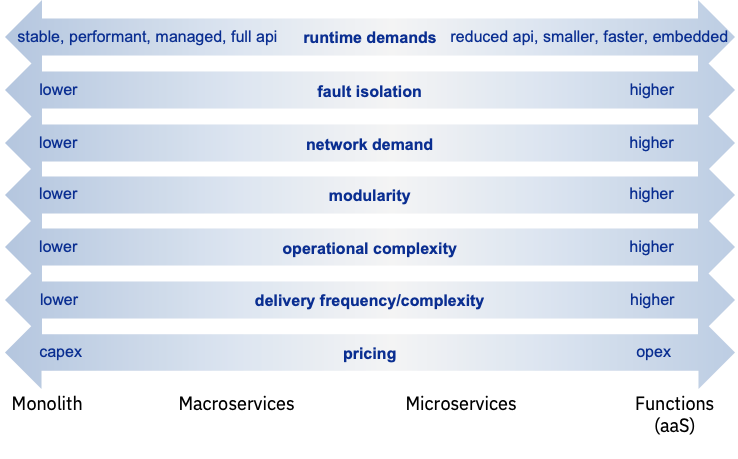
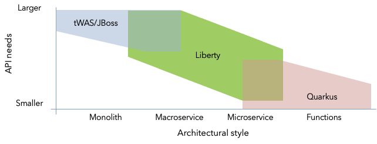

# 为作业选择正确的 Java 运行时
探索并了解运行时历史和架构样式特征以明智地选择运行时

**标签:** Eclipse MicroProfile,Java,Open Liberty,微服务

[原文链接](https://developer.ibm.com/zh/articles/choose-the-right-java-runtime-for-the-job/)

Graham Charters

发布: 2020-12-02

* * *

## 简介

IBM® 收购 Red Hat® 后，现在拥有更多的 Java 应用程序运行时，包括：

- [传统的 IBM WebSphere® Application Server](https://www.ibm.com/cn-zh/marketplace/java-ee-runtime)
- [JBoss® EAP](https://www.redhat.com/en/technologies/jboss-middleware/application-platform) / [WildFly](https://www.wildfly.org/)
- [WebSphere Liberty](https://www.ibm.com/cn-zh/cloud/websphere-liberty) / [Open Liberty](https://openliberty.io/)
- [Quarkus](https://quarkus.io/)

这样一来，客户不免会提出两个问题：

- 我应该选择哪个运行时？
- “运行时 A 和 B”何时得到合理化？

第二个问题的答案很简单 – 我们不计划移除或合并任何运行时。每个运行时都有大量忠实的客户群，他们需要所使用运行时的连续性。通过在开源项目（如 SmallRye 和 Apache CXF）中进行协作，已经实现了开发效率。

本文将解决第一个问题。答案并不像“使用运行时 X”那么简单，甚至比“对于微服务，请使用运行时 X”还要复杂。为了选择一个或多个运行时，了解以下三点很重要：

- 您现有的应用程序资源、业务需求以及这些应用程序的策略
- 每个运行时的应用程序架构样式的优势
- 您期望采用的应用程序架构样式

本文的后续各节详细介绍了后两点。本文还讨论了如何基于所有这三点来选择运行时。

## 运行时的演变

要了解每个运行时的特性以及如何应用它们，有必要回顾一下它们的历史，因为这会极大地影响它们最适合的应用程序类型。

### 传统企业应用程序

万维网的商业化和 Java 应用程序服务器技术的标准化导致不少供应商都在开发应用程序服务器产品。WebSphere Application Server 以及后来的 Wildfly 和 JBoss EAP 是在 20 世纪 90 年代末首次发布的。按照现在的标准，运行这些产品的硬件的计算能力相当普通：网络速度慢得多，尚未围绕以太网进行标准化，并且内存和磁盘容量受到限制（距离第一个 1TB 硬盘的发布还有 10 年时间）。Waterfall 和相关工程实践也主导了软件交付。这自然导致了整体式应用程序的开发和交付。当然，由于在当时没有其他类型，它们只被称为“应用程序”。值得一提的是，整体式应用程序并不差，糟糕的是难以维护的整体结构，并且可以使用任何架构样式来构建难以维护的系统。在 21 世纪初，VM 出现了，这是一种简化服务器部署的方法，但是集群是以特定于您所部署的每种运行时类型的方式完成的（例如，WebSphere ND Cell）。

约束、实践和长交付周期导致需要对 Enterprise Java 运行时进行优化才能实现长期、稳定、高性能的正常运行时间。一旦您部署了服务器和应用程序，您就希望它无论如何都可以继续运行。

### 业务敏捷性要求运行时敏捷性

在随后的几年中，对速度更快、扩展性更强的交付的日益增长的需要推动了基础架构和方法学的重大进步。处理器、网络和存储的速度和容量都在增长，并且软件交付包含了敏捷实践。加快上市时间的压力导致对轻量级运行时的需求不断增长，这有助于更快地交付应用程序。为响应这些要求，IBM 在 2012 年开发了 [WebSphere Liberty](https://www.ibm.com/cn-zh/cloud/websphere-liberty)。

Liberty 重新审视了如何满足应用程序快速开发和交付的需求：轻量级、易于配置、易于部署并支持新兴的最佳实践和工具。此时开发的应用程序仍然主要是整体式程序，但是在 Liberty 的帮助下，可以更轻松、更快地交付。Liberty 最初支持简单的 Web 应用程序，但是根据客户需求，不久便开始支持完整的 Java EE 功能。Liberty 能够安装和配置“刚好足够的运行时”，也就是仅限应用程序所需的功能，这意味着它不会出现通常与企业应用程序服务器相关的运行时膨胀问题。Liberty 还在容器和容器编排平台之前增加了企业所需的集群和健康管理功能（围绕 Liberty Collective）。

在接下来的五年中，开源已成为软件采用中越来越重要的方面。为了支持这一转变，Liberty 在 2017 年转变为开源优先的开发模型，具体措施是根据 Eclipse Public License 将 WebSphere Liberty 开源为 [Open Liberty](http://www.openliberty.io/)。

### 用于快速、灵活、可扩展部署的架构

这些年来，许多整体式应用程序不断增长，并且经常完全不考虑模块性，从而使其难以维护和扩展。一些企业寻求进一步减少交付时间并提高可伸缩性以应对大得多的工作负载需求，却发现自己受到了整体式架构固有的“全部部署、全部扩展”性质的束缚。为了获得更大的灵活性和可伸缩性，需要将这些应用程序重新想象为许多较小的单元，这些单元可以独立开发、部署和扩展，也就是所谓的微服务和函数（通常部署到为函数即服务 [FaaS] 环境中的云）。

从单个整体式应用程序到许多微服务或函数的这种转变推动了对既简化操作又降低基础架构成本的技术的需求。以 Red Hat OpenShift® 为代表的容器和基于 Kubernetes 的容器编排平台已迅速成为微服务的代名词。支持轻量级隔离部署的容器以及支持一致容器部署、管理和集群的 Kubernetes，不再需要以运行时为中心的集群方法（例如 ND Cell 和 Liberty Collective）。

微服务的普及导致对新 API 标准的需求，因此不少供应商和 Java 用户群体聚集在一起，创建了 [Eclipse MicroProfile](https://projects.eclipse.org/projects/technology.microprofile) 规范。MicroProfile 发展迅速，提供了一组完整的开放式微服务 API，并且还有不少提供支持的运行时，包括 Liberty、WildFly、JBoss EAP、Payara、TomEE 和 Quarkus。

对作为微服务或函数而部署的更细粒度组件的需求导致了对更轻便、更快速的运行时的日益增长的需求。在 2019 年，Red Hat 发布了 Quarkus，这是专门针对这些架构样式量身定制的运行时。这样，它就将 Quarkus 牢固地定位于新函数和微服务，仅支持原生编译所涵盖的 Java API 子集。

Liberty 和 Quarkus 都为微服务提供了基于 JVM 的出色运行时配置文件，可在一秒左右响应首批请求。另外，Quarkus 还提供了原生编译功能，提供了非常适合函数的执行配置文件，其中针对单一请求进行优化很重要。

## 各种架构样式

在过去的几年中，微服务架构的交付受到日益增长的关注。与任何新概念一样，该行业经历了发现过程，并最终学习了如何最好地加以应用。在达到这种开明状态之前，技术往往会被过度应用，导致不良的结果。Gartner 将此学习过程称为“ [Gartner Hype Cycle](https://en.wikipedia.org/wiki/Hype_cycle)”，目前将微服务定位为“幻觉破灭期”。这并不意味着微服务不好；只是表示我们才刚刚开始真正认识到微服务在哪些情况下适合，在哪些情况下不适合。

在互联网上快速搜索一下就可以发现越来越多的文章讨论了整体式、微服务和函数。也有一些示例使用诸如“宏服务”或“宏整体”之类的术语谈论整体与微服务之间的样式。在某些情况下，这是对过度分解为过于细粒度的微服务的一种反应，因为过度分解导致系统过于复杂，复杂性的坏处已经超过了收益。在其他情况下，则是直接尝试在每种架构样式的功能和非功能特性之间找到合适的平衡。公司随时间而改变架构样式的著名例子有 [Uber 团队目前在部署粗粒度宏服务](http://highscalability.com/blog/2020/4/8/one-team-at-uber-is-moving-from-microservices-to-macroservic.html) 以及微服务，还有 [Segment 从整体式切换到微服务，然后又切换回整体式](https://segment.com/blog/goodbye-microservices/)。

显而易见的是，大家日益了解不同架构样式的利弊，预计在未来几年中这种趋势会继续增长。我们不应假设所有应用程序都将是微服务，而是更好地了解应用程序需求、基础架构和团队功能，以明智地选择适当的架构样式。大家会越来越多地倾向于部署多种架构样式以及随着需求的发展而在不同架构样式之间发展。

## 架构样式的特征

在选择哪种架构样式可能适合时，了解它们的特征很重要。下面显示了一些关键特征以及它们在不同架构样式之间的变化。请务必了解，某些特征不会在您选择了架构样式之后就会自动实现；它们是潜在的利益，需要技术或组织投入才能获得这些利益。例如，如果您不投资自动化技术，就需要费力地更加频繁地交付微服务更新。

我们从最底层的特征开始，来更详细地了解这些特征：

- **定价：** 资本支出（一次性的前期获取成本）和运营支出（授权/使用的定期费用）各有利弊。函数即服务本质上是运营支出，并且具有所有模型中最细粒度的度量。整体式程序通常是资本支出，但是有一些方法可以将该成本更多地平滑转移到运营支出模型（例如，承诺期限许可）。

- **交付频率/复杂性和操作复杂性：** 这两者都与以下事实有关：随着我们从粗粒度架构样式过渡到更细粒度架构样式，我们将增加我们创建、部署、管理、调试和维护的工件数量。这会导致相关的成本，但也会带来益处。

- **模块性：** 整体式结构的一大缺点是难以使其模块化，并长久保持这种模块性。随着我们从粗粒度过渡到细粒度，我们将应用程序进一步分解为越来越小的部分，但同时也引入了过程和网络边界，以作为增强模块性的一种方式。这提高了创建更为松散耦合、更灵活的解决方案的机会。不过要小心，因为有些人发现创建分布式整体非常容易，但这是两头都不讨好的事情（没有什么好的代替架构）。

- **网络需求和故障隔离：** 这两个是齐头并进的。随着越来越多的组件的分发，对网络的使用和依赖性也越来越高。网络性能成为影响整体解决方案性能的关键限制因素。网络可靠性还会影响整体解决方案的可用性。增加隔离度有助于避免级联故障导致整个解决方案瘫痪，但是需要采用防御性容错技术（例如隔板、重试和回退）来利用隔离度。

- **运行时要求：** 不同的架构模式不仅有利于不同的运行时特征，而且也有利于以不同方法来采用运行时。对于粗粒度的应用程序，交付周期通常更长，因此偏好长时间的运行时稳定性。首要考虑事项是让运行时更长的在应用程序部署期间保持出色的性能。此外，您通常会直接管理和优化服务器，然后向其部署一个或多个应用程序。对于更细粒度的应用程序，由于交付周期更短，请求数量更少，实例数量多得多，因此重点在于运行时要轻量、启动速度快。还有一种倾向是从以服务器为中心的部署转变为以应用程序为中心的部署，在这种情况下，服务器与应用程序结合一起（例如，在较底层的容器映像层中）。

     在下一部分中，我们将探讨最后一点，也就是 API 需求与架构模式之间的关联。对于粗粒度的应用程序，您通常在单个应用程序中使用许多不同的 API，而对于更细粒度的应用程序，每个函数或微服务的 API 需求都更小。

## 选择运行时

我们了解了每个运行时的历史和演变如何极大地影响它们最适合的架构样式。我们了解了企业如何逐渐认识到不同架构样式的好处以及有多少企业能够灵活地使用这些架构。我们还了解了与每种架构样式相关的许多特征，以及如何使用这些特征来帮助确定使用哪些样式，并且很可能随着时间的推移来混合或更改样式。但是，这在运行时选择方面有什么意义呢？

根据每个运行时的历史和发展，下图显示了每个运行时适用的架构样式，并针对应用程序的“API 需求”进行了绘制（应用程序的 API 需求往往与应用程序的“规模”相关）。

这张图表明，无论选择哪种架构样式，IBM 和 Red Hat 都可以涵盖。通过仔细检查，我们发现整体式有三种选择（传统的 WebSphere Application Server、JBoss EAP 和 Liberty），微服务有两种选择（Liberty 和 Quarkus）。但是，与其讨论针对特定的架构风格哪种选择最适合，更重要的是考虑每个运行时的遗留特色、每个应用程序的策略以及您可能使用的架构风格。以下示例场景应该会有所帮助：

- 如果您目前采用的是整体式，并且希望以最小的工程投资来使其保持稳定运行，那么应将其保留在传统的 WebSphere Application Server 和 EAP 上。

- 如果您打算部署新的函数和新的微服务，那么 Quarkus 是个不错的选择，因为它具备针对性 API 和原生编译。Quarkus 的原生映像功能将为您提供非常适合函数的运行时特征。

- 如果您希望对现有的企业应用程序进行现代化改造，那么 Liberty 的轻量级完整 Java 运行时是一个不错的选择。这些应用程序通常是用 Java EE 编写的，因此从长远来看，选择具有完整 Java EE 功能的现代运行时对您有益。如果您要从传统的 WebSphere Application Server 进行现代化，那么 WebSphere Liberty 还提供了一些 API，旨在简化您的现代化之路。

- 如果您希望创建新的现代化整体式结构、新的微服务或介于这两者之间的任何结构，那么 Liberty 是个不错的选择，因为它具备合适的功能和灵活性。这是因为 Liberty 设计为用于整体式应用程序的现代化完整 Java 运行时，并且已针对轻量级高性能微服务进行了优化，从而使您可以灵活地选择架构样式并在这些架构样式之间切换。

## 结束语

本文介绍了行业对不同应用程序架构样式的认识如何演变为更细致的观点，也就是：要根据应用程序的业务需要以及技术和组织能力来选择架构样式。本文还讨论了 Java 运行时的历史如何强烈地影响其对不同架构样式的适用性。最后，通过利用少量场景，本文提供了一种方法来选择一种或多种合适的运行时，以适应您喜欢的一种或多种架构样式。我们希望以上内容对您有帮助。

本文翻译自： [Choose the right Java runtime for the job](https://developer.ibm.com/articles/choose-the-right-java-runtime-for-the-job/)（2020-11-07）