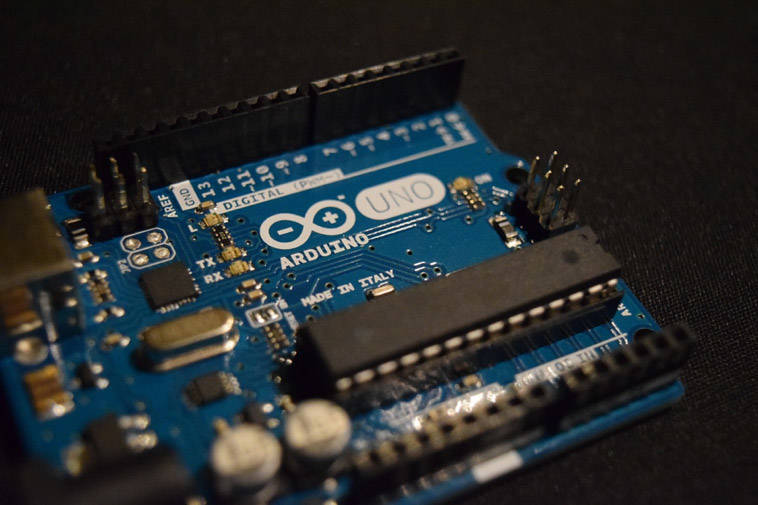
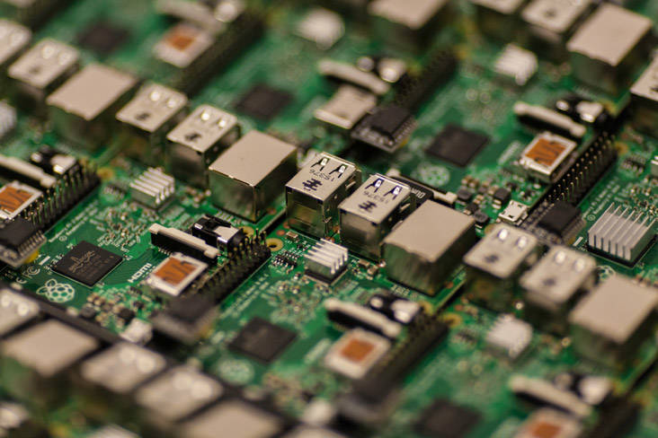

# 为您的下一个 IoT 项目选择最佳硬件
在开发 IoT 项目并为其设计原型时，可以使用本硬件指南确定要使用哪些硬件

**标签:** IoT

[原文链接](https://developer.ibm.com/zh/articles/iot-lp101-best-hardware-devices-iot-project/)

Anna Gerber, Jim Romeo

更新: 2020-05-27 \| 发布: 2017-05-05

* * *

##### 学习路径：IoT 开发入门

本文是是面向 IoT 开发者的快速入门指南“IoT 101”学习路径的一部分。

- [IoT 概念和技能](/zh/articles/iot-key-concepts-skills-get-started-iot)
- IoT 硬件指南（本文）
- [IoT 网络指南](/zh/articles/iot-lp101-connectivity-network-protocols/)
- [IoT 平台](/zh/articles/iot-lp101-why-use-iot-platform/)
- [教程：构建简单的家庭自动化系统](/zh/tutorials/iot-lp101-get-started-develop-iot-home-automation/)

互联设备是 IoT 的核心。设备会收集数据并监控参数。从工业设备、建筑物和汽车，到动物、货物运输、管道和人员，互联设备无处不在。

硬件和软件部分是通过标准设计协议为 IoT 应用程序设计的：规范开发、概念设计、原型、测试，以及集成到网络中的硬件和软件的部署。 一些平台，如 Arduino 和 Raspberry Pi，可以加快设计以及快速进行原型构建，而无需定制，从而缩短实施 IoT 配置的时间。

设计需要确定性能需求，实现这些要求所必需的硬件和软件，然后是组件的规格（商用现成 (COTS) 设计或定制设计），并适当考虑到运行环境及其内部使用的应用。

在我们谈到 IoT 时，设备是指任何获取信息和传输信息的物件。例如，管道内的压力传感器，冷藏轨道车内的温度传感器，或分布在母牛皮肤下的微小芯片，这些都是设备。设备可能独立运行，也可能与其他设备同步工作。

在本文中，我将回顾一些现成的硬件选项，以及在选择这些硬件开发下一个 IoT 项目时需要考虑的一些因素。

## IoT 设备特征

随着 IoT 的发展，将引入新的设备和平台。 IoT 设备共有一些关键特性，这些特性为选择硬件和软件、配置新的 IoT 网络或开发和扩展现有的 IoT 网络提供了比较的基础。

IoT 设备可能具有以下功能：

- 数据获取和控制
- 数据处理和存储
- 连接性
- 电源管理

### 数据获取和控制

_数据获取_( [DAQ](https://en.wikipedia.org/wiki/Data_acquisition))是指按照固定的时间间隔（数据采样率）收集模拟信息，并将其作为数字信号发送到远程输出设备以进行数字读出。DAQ 可以包括信号调节和模数转换器，前者用来操作和缩放原始传感器读数，后者用于来将模拟传感器读数转换成数字值，以便进行处理和分析。

_传感器_ 是测量物理变量并将其转换为电信号（电压）的组件。市场上提供各种现成商用传感器，特定用于测量一系列变量，包括：温度、湿度、压力、烟雾、气体、光、声音、震动、气流、水流、速度、加速度、距离、GPS 位置、海拔和许多其他变量。

传感器的功能各不相同，可用于测量各种参数。例如，本体感受传感器可以监控设备的内部状态。诸如按钮、滑动控制或触摸屏等传感器可以直接与设备交互（人机界面）。

每种类型的传感器都有多种选择。制造商及其传感器产品规格各不相同。传感器的准确性、精度和所需的操作条件可能因产品目录而异，也可能因制造商而异。传感器可以在水下的发动机中使用，植入人体或动物体内，甚至可以在太空中使用。不同环境要求不同的传感器特性，并相应地为不同的用途而设计。

传感器组件的一个重要特征是分辨率。传感器的分辨率表示传感器能可靠地读取的最小变化量，它与用于表示原始传感器读数的数值大小相关。例如，一个具有 10 位分辨率的模拟温度传感器，使用 0 到 1023 之间的数值表示温度读数。位是二进制数字，所以 10 位总共提供了 2 的 10 次方或 1024 个可能值。但实际上，传感器会受电子噪声影响，导致实际的分辨率降低。

传感器将温度等物理变量转换为电信号，而输出设备正好相反：它们将电信号转换为物理变量。输出设备包括 LED、扬声器和屏幕。 这可能需要电机、继电器和螺线管等 _驱动器_。驱动器在工业 IoT 应用中很常见。例如，制造中广泛采用气动线性驱动器在组装过程中移动和抓住产品。校车车轴上的执行器可以在检测到不良运动时进行车辆制动。当温度升高到某个不可接受的水平时，存放着产品的冷冻货柜内的高温可能会触发警报。

### 数据处理和存储

IoT 设备需要特定的数据处理和存储能力。这有助于实现数据聚合、传输和分析。一些 IoT 设备可直接处理数据，而另一些设备则可以将这些数据传输到其他设备、网关设备或云应用来进行进一步的聚合和分析。

边缘分析在网络边缘（而不是集中位置）执行数据分析。可以在设备自身上实时分析数据，也可以在连接到 IoT 设备的附近网关设备（如路由器）上进行分析，而不必让设备将大量数据传输到上游的云服务器或数据中心来进行进一步分析。如果在边缘处理数据，则在收集数据时对数据进行聚合和过滤，只向上游发送最重要的数据。边缘分析减少了上游处理和存储需求，减轻了网络负载。

IoT 应用使用的处理能力和存储取决于使用数据的服务或应用所需的处理。可用的内存和处理器规格、时钟速度和内核数，所有这些因素决定了设备后续的数据处理速率。在将数据传输到上游之前，可以使用非易失性闪存存储器来保存数据，该存储器的容量决定了可在设备上存储的数据量。与仅执行诸如验证、标准化、缩放或转换读数之类的基本数据处理的设备相比，执行边缘分析的设备需要的处理能力要高得多。

### 连接性

网络连接是任何 IoT 设备的定义性特征。设备在本地与其他设备通信。然后，它们通过基于云的服务推送数据。一些设备使用 802.11 (Wi-Fi)、蓝牙、RFID、蜂窝网络，或者诸如 LoRa、SigFox 或 NB-IoT 之类的低功耗广域网 (LPWAN) 技术来进行无线通信。有线通信适用于固定设备。例如，这些设备可以安装在智能建筑、家庭自动化和工业控制应用程序中，并与以太网连接，或通过电源在以太网上进行改造。串行通信是设备间的一种有线连接形式，它使用 _通用异步收发两用机_(UART) 或起源于汽车行业的 _控制器区域网_ (CAN) 协议等标准协议。

### 电源管理

对于依赖无线电源（例如电池或光伏电池（太阳能））的便携式和可穿戴 IoT 设备，电源管理是至关重要的因素。根据使用模式和附加的传感器、执行器或集成电路 (IC) 的功率需求，设备可以周期性地进入休眠模式或低功耗模式以节省电能。

例如，像 Raspberry Pi 4 这样的单板计算机需要 700mA 到 1000mA 的电流才能正常工作。如果利用 WiFi 不断传输数据，或者在负载很重的设备上进行大量的数据处理，那么耗电量会增加，但是当设备空闲时，耗电量会降低。如果连接了相机模块，在使用相机时，所需的电流会增加大约 250mA。另外，传感器通常需要电源才能工作；Raspberry Pi 上的 GPIO 引脚提供 3.3V 或 5V，所有引脚上最多50 mA 的电流。连接到引脚的组件数量越多，设备的功耗就会随之增加。

## 用于为 IoT 项目设计原型的现有硬件类型

开发 IoT 应用程序变得更容易了，这得益于越来越多现有的低成本、商业性硬件开发板、平台和原型设计工具包。模块化的硬件设计使得开发 IoT 应用程序更加灵活。随着零部件选择的增多，设计师可以更换不同规格的新传感器。或者，您可以独立地升级设备的网络、数据处理或存储模块，以满足不断变化的需求。

包括微控制器和单板计算机在内的许多现有的商业性硬件设备，都是围绕单芯片系统 (SoC) 集成电路而设计。SoC 将数据处理、存储和联网等功能集成到一个芯片上。这种配置意味着，您会牺牲一些灵活性来换取便捷性，但幸运的是，有大量具有一系列配置的商业性设备可供选择。例如，表 1 列出了选择用于 IoT 项目原型设计的微控制器的技术规格，并对 3 种常见的单板计算机 (SBC) 进行了比较。

### 微控制器开发板

微控制器是一种提供数据处理和存储功能的 SoC。微控制器包括一个（或多个）处理器内核、内存 (RAM)，以及用于存储在微控制器上运行的自定义程序的可擦除可编程只读存储器 (EPROM)。微控制器开发板属于 PCB，但增加了额外的电路来支持微控制器，使对芯片进行原型设计和编程变得更方便。

传感器和执行器通过数字或模拟通用输入/输出 (GPIO) 引脚或通过硬件总线连接到微控制器。 [I2C](https://en.wikipedia.org/wiki/I%C2%B2C) 和 [SPI]( [https://en.wikipedia.org/wiki/Serial\_Peripheral\_Interface\_Bus）等标准通信协议用于与总线上连接的组件进行设备内通信。通过采用各种标准，可以更容易地添加或替换与总线连接的组件。](https://en.wikipedia.org/wiki/Serial_Peripheral_Interface_Bus）等标准通信协议用于与总线上连接的组件进行设备内通信。通过采用各种标准，可以更容易地添加或替换与总线连接的组件。)

Arduino ( [http://arduino.cc/en/Main/](http://arduino.cc/en/Main/)) 是一个开源设备平台，其制造兼容开发板和工具的社区十分活跃。不同官方 Arduino 型号 ( [https://www.arduino.cc/en/Products/Compare)](https://www.arduino.cc/en/Products/Compare)) 的设备功能不同，数十种第三方兼容电路板的设备功能也有差异。表 1 中的设备都是兼容 Arduino 的微控制器，包括无处不在的 Arduino Uno、Particle 的 Electron（其中集成了一个蜂窝式调制解调器），以及 Espressif Systems 的 ( [https://espressif.com/en/products/hardware/esp8266ex/overview](https://espressif.com/en/products/hardware/esp8266ex/overview))集成了 WiFi 的低成本、低功耗微控制器 ESP8266-01。

##### Figure 1. Arduino 微控制器开发板

像 Arduino 一样，ESP8266 拥有一个活跃的采用者社区。基于 ESP8266 的著名开发板包括 [NodeMCU](http://www.nodemcu.com/index_en.html)、 [WeMos D1](https://docs.wemos.cc/en/latest/d1/index.html) 以及 AdaFruit 的 Feather Huzzah ( [https://learn.adafruit.com/adafruit-feather-huzzah-esp8266/overview](https://learn.adafruit.com/adafruit-feather-huzzah-esp8266/overview))。开源和制造者社区已为基于 ESP8266 的开发板开发了许多备选固件，使 IoT 开发者能使用 Lua、Python 和 JavaScript 为这些开发板编程，并支持无线 (OTA) 更新。

##### Table 1. Arduino Uno、Particle Electron 和 Espressif Systems ESP8266-01 微控制器技术规格

特征  功能  Arduino Uno  Particle Electron  Espressif Systems ESP8266-01 **_数据采集与控制_****GPIO 引脚** 6 个模拟输入引脚

14 个数字引脚 – 6 PWM  12 个模拟输入引脚

2 个模拟输出引脚

30 个数字引脚 – 13 PWM

2 个数字引脚

1 个模拟引脚 **逻辑电平电压** 5V  3.3V  3.3V **_数据处理和存储_****处理器** ATMega328P  32 位 STM32F205

ARM Cortex M3  32 位 Tensilica L106 **处理器速度** 16 KHz  120 MHz  80 MHz **内存** 32 kB 闪存

1 kB EEPROM  1 Mb 闪存

128 kB RAM  1 Mb **_连接_****网络接口** 默认情况下没有连接。可通过孔壁添加。  集成蜂窝调制解调器 (2G / 3G)  集成 WiFi **_电源_****建议的电源** 9-12V DC 0.5 – 2A 孔壁或 5V 500mA USB，或通过 VIN 引脚提供 9 到 12V 电压 5V micro USB 或通过 VIN 引脚提供 3.9V-12VDC 电压 通过 VCC 引脚提供稳定的 3.3V 300mA 电源**_其他_****尺寸** 2.7 英寸 x 2.1 英寸  2.05 英寸 x 0.8 英寸  1.4 英寸 x 1 英寸 **典型成本** 20 美元 39 到 59 美元 10 美元

要开发在兼容 Arduino 的微控制器上运行的软件，标准方法是使用 C 或 C++ 和 Arduino IDE，但是也有一些社区开发的语言绑定和可视编程工具。具有相同引脚布局且兼容 Arduino 的开发板能使用可选的第三方孔壁进行扩展，例如为了向 Arduino Uno 添加以太网端口或蓝牙。Arduino 是采用最广泛的业余爱好者微控制器开发环境，但像 Tessel ( [https://tessel.io/](https://tessel.io/)) ( [和 Particle.io]]([https://www.particle.io]) 这样的开发环境原生支持 JavaScript，而 MicroPython 的 PyBoard ( [http://micropython.org](http://micropython.org)) 和 WeIO ( [http://we-io.net/hardware/](http://we-io.net/hardware/)) 等开发板则支持 Python。

选择兼容 Arduino 的微控制器，更容易将使用跨平台 Arduino 库和 Arduino IDE 开发的程序移植到其他兼容 Arduino 的设备上运行。仍然需要仔细斟酌并体会细微差异。

例如，Arduino Uno 使用数字 I/O 引脚上的 5V 逻辑电压（其中 0V 等于 LOW 或 OFF，5V 等于 HIGH 或 ON），但 ESP8266 和 Particle 开发板使用 3.3V 逻辑电压（3.3V 表示 HIGH）。这可能影响您对传感器或执行器组件的选择，因为一些组件仅适用于某一种开发板。将针对 5V 逻辑电压设计的传感器替换为 3.3V 逻辑电压的传感器可能会导致意外结果，也可能损坏经受不住更高电压的引脚，所以您需要添加一个逻辑电平转换器才能使移植奏效。在实现低电平硬件功能时，比如启用深度睡眠模式或使用特定协议从连接的传感器读取数据，可能需要依靠特定于设备或组件的库，这些库会导致代码更不容易移植。

### 单板计算机

_单板计算机_(SBC) 比微控制器更进一步。它们允许连接键盘、鼠标和屏幕等外围设备，并提供了更多内存和更强的处理能力（例如，表 2 提供了 1.2 GHz 32 位 ARM 微处理器，而表 1 仅提供了 8 位 16KHz 微控制器）。

表 2 列出了以下三个 SBC 的技术规格：Raspberry Pi 4 ( [https://www.raspberrypi.org/](https://www.raspberrypi.org/))、BeagleBone Black ( [http://beagleboard.org/black](http://beagleboard.org/black)) 和 DragonBoard 410c ( [https://developer.qualcomm.com/hardware/dragonboard-410c](https://developer.qualcomm.com/hardware/dragonboard-410c))。

##### Figure 2. Raspberry Pi 单板计算机

微控制器与单板计算机之间的区别没有固定标准。一些设备介于二者之间，比如 Onion Omega 2 ( [https://docs.onion.io/omega2-docs/omega2.html#omega2](https://docs.onion.io/omega2-docs/omega2.html#omega2)) 的板载内存和处理能力与低端 SBC 相当。还有一些混合设备，比如 UDOO Quad ( [http://www.udoo.org/docs/Introduction/Introduction.html](http://www.udoo.org/docs/Introduction/Introduction.html))，它将基于 ARM 的 Linux 系统与兼容 Arduino 的微控制器相集成。

##### Table 2. Raspberry Pi 4、BeagleBone Black 和 DragonBoard 3 种 SBC 的技术规格

特征  功能  Raspberry Pi 4  BeagleBone Black  Qualcomm DragonBoard 410c **_数据获取和控制_****GPIO 引脚** 40 个 I/O 引脚，包括 29 数字引脚  65 个数字引脚 – 8 PWM

7 个模拟输入  12 个数字引脚 **逻辑电平电压** 3.3V  5V  1.8V **_数据处理和存储_****处理器** ARM Cortex A72  AM335X ARM Cortex A8  ARM Cortex A53 **处理器速度** 1.5GHz  1 GHz  1.2 GHz **内存** 1-4 Gb  512 Mb RAM，4 Gb 闪存  1Gb，8Gb 闪存 **_连接_****网络接口** Wifi、以太网、蓝牙  以太网

USB 端口支持外部 Wifi/蓝牙适配器  Wifi、蓝牙、GPS **_电源_****推荐的电源** 5V 3A USB Type C  5V 1.2A – 2A 孔壁  6.5 – 18V 2A 孔壁 **_其他_****尺寸** 3.5 英寸 x 2.3 英寸  3.4 x 2.1 英寸  3.3 英寸 x 2.1 英寸 **典型成本** 35 美元  55 美元  75 美元

与微控制器一样，SBC 设备功能也可通过增加可堆叠的开发板来扩展，这些开发板在 Raspberry Pi 上被称为 _hat_，在 BeagleBone Black 上被称为 _cape_，还可以通过增加电动机控制器或模数转换器等外部模块来扩展开发板，减轻设备内置功能的限制。

许多 SBC 设备更像一台微型 PC，而且运行着嵌入式操作系统（通常是简化的 Linux 发行版）。因此，与微控制器开发板相比，对于这些设备上连接的传感器和执行器，要开发用于它们的嵌入式应用程序，有更多开发工具和语言可供选择。但是，SBC 的设置更复杂、更大、能耗更高，而且更容易出现一些问题，比如存储应用程序的 SD 卡或闪存损坏。

### 在微控制器开发板与单板计算机之间进行选择

尽管现有的微控制器开发板和单板计算机可能只能在 IoT 解决方案中发挥部分作用，但它们是初始开发的理想选择。

一种入门方式是根据应用程序的需求来考虑关键的 IoT 设备特征，然后制定以下设计决策：

- 确定您需要的外围传感器和输出组件的类型和数量，如有必要，还需要确定这些组件的设计电路
- 选择一个微控制器或单板设备来协同控制外围组件并从中读取数据
- 确定您用于设备内通信的数据通信协议（例如，对微控制器与任何附加传感器之间的通信使用 I2C）
- 选择需要用来与云服务和应用程序进行通信的网络硬件和协议

例如，要在预算内设置一个家庭自动化系统，您可以选择 Raspberry Pi Zero W，因为它是一个成本非常低的小巧的 SBC 设备，而且拥有充足的处理能力和内存（1GHz ARM6 处理器和 512 MB RAM）来在设备上执行数据处理和分析。它支持采用最高 64GB 的 microSD 闪存扩展卡来存储程序和数据。而且像 Raspberry Pi 4 一样，它配备了一个完整的 40 引脚 GPIO 端板，允许连接多个传感器，同时还支持 SPI 和 I2C 协议。它拥有板载 WiFi，可用于连接家庭网络，而且可以通过 micro-USB 从移动电源或墙插式电源供电。

随着您在 IoT 架构设计方面的深入，您可以停下来，将您的预期性能与设计意图进行比较。进行设备设计和原型设计，选择嵌入式软件，选择上游服务和应用程序，然后停下来对其进行评估。您可以根据功能需求和非功能需求（包括性能、可靠性和安全性）定期评估原型，并在必要时重新考虑这些选择。

## 部署 IoT 项目的 IoT 硬件需求

IoT 设备是高度专业化的，而且是为在非常特定的上下文和环境中运行而设计的。所以 IoT 项目的硬件千差万别。虽然可以通过通用的现成硬件进行原型设计，但最终您可以根据 IoT 解决方案的要求着手设计和开发定制 PCB 和组件。作为此过程的一部分，您需要考虑以下几种硬件需求：

- 安全需求
- 易开发性
- 数据获取、处理和存储需求
- 连接需求
- 电源需求
- 物理设备设计
- 成本需求

### 安全需求

安全是 IoT 的关键要素。在设计和开发的所有阶段都必须考虑到这一点。即使是在原型设计期间，也必须保证设备捕获的数据的完整性和安全性。安全需求适用于 IoT 设备本身、网络以及云、移动和 Web 服务应用。

相关安全需求包括：

- 确保每个设备拥有足够的处理能力和内存，以便能以发送和接收数据和消息的速率对它们进行加密和解密
- 确保嵌入式软件开发库支持在向上游服务和应用程序执行验证时使用的授权和访问控制机制
- 选择采用现有的设备来实现设备管理协议，以便在将新设备添加到网络时，安全地注册这些设备以免发生欺诈；此外，选择包含固件功能的现有设备，可用无线方式安全地更新安全补丁

### 易开发性

在原型设计期间，易开发性是另一个要优先考虑的需求，满足该需求才能快速轻松地让您的 IoT 设备正常运行，捕获数据，并与其他设备和云进行通信。

考虑 API 文档、开发工具，以及硬件制造商或开发社区所提供的支持的可访问性、可用性和质量。选择的设备要能快速轻松地编程和刷新，而且在部署时只需较少的接触，不需要配置或只需针对每个设备进行极少的配置，以便在开发 IoT 应用程序时少走弯路并节省时间。

### 数据获取、处理和存储需求

连接的传感器数量、捕获的数据的分辨率，以及数据采样速率，这些都决定了要处理的数据量，还会影响数据处理和存储需求。

需要保留在设备上的数据量，取决于连接设备向上游传输数据的频率。安装在智慧建筑中的始终通过电缆连接的设备，会直接向一个高度可用的服务器传输少量的原始数据，与需要处理大量突然传入的数据相比，这种设备需要的处理能力和存储空间相对较少。为了省电而每隔几小时进行连接的设备需要更大的存储空间，在连电期间将数据记录到本地。

### 连接需求

无线网络的连接需求包括操作范围，或者信号的传输距离，以及预计要传输的数据量和传输速率。考虑设备的容错能力，以及在断开连接后重连并重新尝试发送数据的能力。

您的硬件可能拥有集成式网络连接，比如蓝牙或 WiFi，或者可能需要通过扩展板或模块来添加此能力。可升级的外部模块能提供更高的灵活性，因为您可以选择试用不同模块来评估它们的范围和功耗。

### 电源需求

其他许多需求也会对设备的电源需求产生影响，这些需求包括需要的传感器数量和网络传输速率。考虑您的设备是连接电源，还是需要需要电池或超级电容之类的移动电源。如果需要便携式电源（如电池），那么您需要了解电池的大小、重量和容量需求，以及电池是否可以重复充电、更换，或者在电池耗尽后是否应丢弃。如果设备可再充电，应多久充一次，通过什么方式充电？

### 物理设备设计需求

物理设备设计需求包括设备的外观和大小。

还需要考虑设备将安装到哪些环境条件下，例如它是否需要防水或有坚固的外壳？例如，作为车队监控应用的一部分，安装在卡车底部的设备需要得到妥善保护，以确保它们在恶劣条件下能够继续运行；它需要防水、耐脏和抗震。

### 成本需求

硬件的成本包括硬件和关联组件（比如任何传感器）的初始费用，以及它们的持续操作成本，比如电源成本和更换磨损部件或缺陷组件的维护成本。还要考虑某些组件或设备驱动程序的版权费。购买商用的现成开发板或 SBC 可能比制造定制板更经济。如果您通过许多设备扩展 IoT 网络，那么专用硬件设备可能是更明智的选择。

## 结束语

每种应用和情况各有不同。在为 IoT 项目选择硬件时，没有万全之策。采用基于标准的商业性硬件，比如微控制器或单板计算机，可以在开发的早期阶段节省时间和开支，而不会牺牲灵活性。您在原型设计阶段学到的知识，能帮助您在之后部署 IoT 解决方案时制定关键的硬件设计决策。

本文翻译自： [Choosing the best hardware for your next IoT project](https://developer.ibm.com/articles/iot-lp101-best-hardware-devices-iot-project/)（2020-01-30）