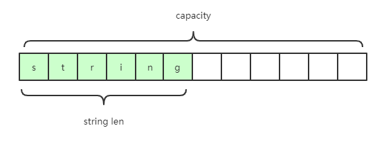
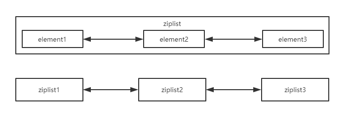
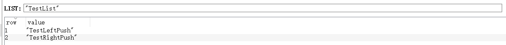
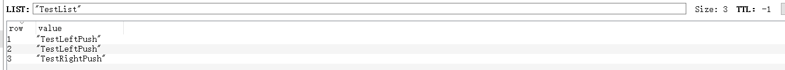
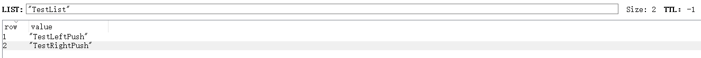

# 了解 Redis 并在 Spring Boot 项目中使用 Redis
从数据结构开始了解 Redis

**标签:** Java,Spring,数据库

[原文链接](https://developer.ibm.com/zh/articles/know-redis-and-use-it-in-springboot-projects/)

甘朝阳

发布: 2019-11-06

* * *

在实际的开发过程中，多多少少都会涉及到缓存，而 Redis 通常来说是我们分布式缓存的最佳选择。Redis 也是我们熟知的 NoSQL（非关系性数据库）之一，虽然其不能完全的替代关系性数据库，但它可作为其良好的补充。本文就和大家一起了解一下 Redis，并实战在 Spring Boot 项目使用它。

## Redis 简介

Redis 是一个开源（BSD 许可）、内存存储的数据结构服务器，可用作数据库，高速缓存和消息队列代理。它支持字符串、哈希表、列表、集合、有序集合等数据类型。内置复制、Lua 脚本、LRU 收回、事务以及不同级别磁盘持久化功能，同时通过 Redis Sentinel 提供高可用，通过 Redis Cluster 提供自动分区。

### Redis 使用场景

微服务以及分布式被广泛使用后，Redis 的使用场景就越来越多了，这里我罗列了主要的几种场景。

1. **分布式缓存**：在分布式的系统架构中，将缓存存储在内存中显然不当，因为缓存需要与其他机器共享，这时 Redis 便挺身而出了，缓存也是 Redis 使用最多的场景。
2. **分布式锁**：在高并发的情况下，我们需要一个锁来防止并发带来的脏数据，Java 自带的锁机制显然对进程间的并发并不好使，此时可以利用 Redis 单线程的特性来实现我们的分布式锁，如何实现，可以 [参考这篇文章](https://www.ibm.com/developerworks/cn/java/j-spring-boot-aop-web-log-processing-and-distributed-locking/index.html)。
3. **Session 存储/共享**：Redis 可以将 Session 持久化到存储中，这样可以避免由于机器宕机而丢失用户会话信息。
4. **发布/订阅**：Redis 还有一个发布/订阅的功能，您可以设定对某一个 key 值进行消息发布及消息订阅，当一个 key 值上进行了消息发布后，所有订阅它的客户端都会收到相应的消息。这一功能最明显的用法就是用作实时消息系统。
5. **任务队列**：Redis 的 `lpush+brpop` 命令组合即可实现阻塞队列，生产者客户端使用 `lrpush` 从列表左侧插入元素，多个消费者客户端使用 `brpop` 命令阻塞式的”抢”列表尾部的元素，多个客户端保证了消费的负载均衡和高可用性。
6. **限速，接口访问频率限制**：比如发送短信验证码的接口，通常为了防止别人恶意频刷，会限制用户每分钟获取验证码的频率，例如一分钟不能超过 5 次。

当然 Redis 的使用场景并不仅仅只有这么多，还有很多未列出的场景，如计数、排行榜等，可见 Redis 的强大。不过 Redis 说到底还是一个数据库（非关系型），那么我们还是有必要了解一下它支持存储的数据结构。

### Redis 数据类型

前面也提到过，Redis 支持字符串、哈希表、列表、集合、有序集合五种数据类型的存储。了解这五种数据结构非常重要，可以说如果吃透了这五种数据结构，你就掌握了 Redis 应用知识的三分之一，下面我们就来逐一解析。

#### 字符串（string）

string 这种数据结构应该是我们最为常用的。在 Redis 中 string 表示的是一个可变的字节数组，我们初始化字符串的内容、可以拿到字符串的长度，可以获取 string 的子串，可以覆盖 string 的子串内容，可以追加子串。

**图 1\. Redis 的 string 类型数据结构**



如上图所示，在 Redis 中我们初始化一个字符串时，会采用预分配冗余空间的方式来减少内存的频繁分配，如图 1 所示，实际分配的空间 capacity 一般要高于实际字符串长度 len。如果您看过 Java 的 ArrayList 的源码相信会对此种模式很熟悉。

#### 列表（list）

在 Redis 中列表 list 采用的存储结构是双向链表，由此可见其随机定位性能较差，比较适合首位插入删除。像 Java 中的数组一样，Redis 中的列表支持通过下标访问，不同的是 Redis 还为列表提供了一种负下标，`-1` 表示倒数一个元素，`-2` 表示倒数第二个数，依此类推。综合列表首尾增删性能优异的特点，通常我们使用 `rpush/rpop/lpush/lpop` 四条指令将列表作为队列来使用。

**图 2\. List 类型数据结构**



如上图所示，在列表元素较少的情况下会使用一块连续的内存存储，这个结构是 ziplist，也即是压缩列表。它将所有的元素紧挨着一起存储，分配的是一块连续的内存。当数据量比较多的时候才会改成 quicklist。因为普通的链表需要的附加指针空间太大，会比较浪费空间。比如这个列表里存的只是 int 类型的数据，结构上还需要两个额外的指针 prev 和 next。所以 Redis 将链表和 ziplist 结合起来组成了 quicklist。也就是将多个 ziplist 使用双向指针串起来使用。这样既满足了快速的插入删除性能，又不会出现太大的空间冗余。

#### 哈希表（hash）

hash 与 Java 中的 HashMap 差不多，实现上采用二维结构，第一维是数组，第二维是链表。hash 的 key 与 value 都存储在链表中，而数组中存储的则是各个链表的表头。在检索时，首先计算 key 的 hashcode，然后通过 hashcode 定位到链表的表头，再遍历链表得到 value 值。可能您比较好奇为啥要用链表来存储 key 和 value，直接用 key 和 value 一对一存储不就可以了吗？其实是因为有些时候我们无法保证 hashcode 值的唯一，若两个不同的 key 产生了相同的 hashcode，我们需要一个链表在存储两对键值对，这就是所谓的 hash 碰撞。

#### 集合（set）

熟悉 Java 的同学应该知道 HashSet 的内部实现使用的是 HashMap，只不过所有的 value 都指向同一个对象。Redis 的 Set 结构也是一样，它的内部也使用 Hash 结构，所有的 value 都指向同一个内部值。

#### 有序集合（sorted set）

有时也被称作 ZSet，是 Redis 中一个比较特别的数据结构，在有序集合中我们会给每个元素赋予一个权重，其内部元素会按照权重进行排序，我们可以通过命令查询某个范围权重内的元素，这个特性在我们做一个排行榜的功能时可以说非常实用了。其底层的实现使用了两个数据结构， hash 和跳跃列表，hash 的作用就是关联元素 value 和权重 score，保障元素 value 的唯一性，可以通过元素 value 找到相应的 score 值。跳跃列表的目的在于给元素 value 排序，根据 score 的范围获取元素列表。

## 在 Spring Boot 项目中使用 Redis

### 准备工作

开始在 Spring Boot 项目中使用 Redis 之前，我们还需要一些准备工作。

1. 一台安装了 Redis 的机器或者虚拟机。
2. 一个创建好的 Spring Boot 项目。

### 添加 Redis 依赖

Spring Boot 官方已经为我们提供好了集成 Redis 的 Starter，我们只需要简单地在 `pom.xml`文件中添加如下代码即可。Spring Boot 的 Starter 给我们在项目依赖管理上提供了诸多便利，如果您想了解更多 Starter 的内容，可以访问 [这篇文章](https://itweknow.cn/blog-site/posts/1756392238.html)。

**清单 1\. 添加 Redis 依赖**

```
<!--SpringBoot 的 Redis 支持-->
<dependency>
     <groupId>org.springframework.boot</groupId>
     <artifactId>spring-boot-starter-data-redis</artifactId>
</dependency>

```

Show moreShow more icon

添加完依赖之后，我们还需要配置 Redis 的地址等信息才能使用，在 `application.properties` 中添加如下配置即可。

**清单 2\. Spring Boot 中配置 Redis**

```
spring.redis.host=192.168.142.132
spring.redis.port=6379
# Redis 数据库索引（默认为 0）
spring.redis.database=0
# Redis 服务器连接端口
# Redis 服务器连接密码（默认为空）
spring.redis.password=
#连接池最大连接数（使用负值表示没有限制）
spring.redis.jedis.pool.max-active=8
# 连接池最大阻塞等待时间（使用负值表示没有限制）
spring.redis.jedis.pool.max-wait=-1
# 连接池中的最大空闲连接
spring.redis.jedis.pool.max-idle=8
# 连接池中的最小空闲连接
spring.redis.jedis.pool.min-idle=0
# 连接超时时间（毫秒）
spring.redis.timeout=0

```

Show moreShow more icon

Spring Boot 的 `spring-boot-starter-data-redis` 为 Redis 的相关操作提供了一个高度封装的 RedisTemplate 类，而且对每种类型的数据结构都进行了归类，将同一类型操作封装为 operation 接口。`RedisTemplate` 对五种数据结构分别定义了操作，如下所示：

- 操作字符串：`redisTemplate.opsForValue()`
- 操作 Hash：`redisTemplate.opsForHash()`
- 操作 List：`redisTemplate.opsForList()`
- 操作 Set：`redisTemplate.opsForSet()`
- 操作 ZSet：`redisTemplate.opsForZSet()`

但是对于 string 类型的数据，Spring Boot 还专门提供了 `StringRedisTemplate` 类，而且官方也建议使用该类来操作 String 类型的数据。那么它和 `RedisTemplate` 又有啥区别呢？

1. `RedisTemplate` 是一个泛型类，而 `StringRedisTemplate` 不是，后者只能对键和值都为 String 类型的数据进行操作，而前者则可以操作任何类型。
2. 两者的数据是不共通的，`StringRedisTemplate` 只能管理 `StringRedisTemplate` 里面的数据，`RedisTemplate` 只能管理 `RedisTemplate` 中 的数据。

### RedisTemplate 的配置

一个 Spring Boot 项目中，我们只需要维护一个 `RedisTemplate` 对象和一个 `StringRedisTemplate` 对象就可以了。所以我们需要通过一个 `Configuration` 类来初始化这两个对象并且交由的 `BeanFactory` 管理。我们在 `cn.itweknow.sbredis.config` 包下面新建了一个 `RedisConfig` 类，其内容如下所示：

**清单 3\. RedisTemplate 和 StringRedisTemplate 的配置**

```
@Configuration
public class RedisConfig {

    @Bean
    @ConditionalOnMissingBean(name = "redisTemplate")
    public RedisTemplate<String, Object> redisTemplate(
            RedisConnectionFactory redisConnectionFactory) {

        Jackson2JsonRedisSerializer<Object> jackson2JsonRedisSerializer = new Jackson2JsonRedisSerializer<Object>(Object.class);
        ObjectMapper om = new ObjectMapper();
        om.setVisibility(PropertyAccessor.ALL, JsonAutoDetect.Visibility.ANY);
        om.enableDefaultTyping(ObjectMapper.DefaultTyping.NON_FINAL);
        jackson2JsonRedisSerializer.setObjectMapper(om);

        RedisTemplate<String, Object> template = new RedisTemplate<String, Object>();
        template.setConnectionFactory(redisConnectionFactory);
        template.setKeySerializer(jackson2JsonRedisSerializer);
        template.setValueSerializer(jackson2JsonRedisSerializer);
        template.setHashKeySerializer(jackson2JsonRedisSerializer);
        template.setHashValueSerializer(jackson2JsonRedisSerializer);
        template.afterPropertiesSet();
        return template;
    }

    @Bean
    @ConditionalOnMissingBean(StringRedisTemplate.class)
    public StringRedisTemplate stringRedisTemplate(
            RedisConnectionFactory redisConnectionFactory) {
        StringRedisTemplate template = new StringRedisTemplate();
        template.setConnectionFactory(redisConnectionFactory);
        return template;
    }
}

```

Show moreShow more icon

### 操作字符串

`StringRedisTempalte` 在上面已经初始化好了，我们只需要在需要用到的地方通过 `@AutoWired` 注解注入就行。

1. 设置值，对于设置值，我们可以使用 `opsForValue().void set(K var1, V var2)`;


    ```
    @Test
    public void testSet() {
            stringRedisTemplate.opsForValue().set("test-string-value", "Hello Redis");
    }

    ```


    Show moreShow more icon

2. 获取值，与 set 方法相对于 StringRedisTemplate 还提供了 `.opsForValue().get(Object var1)` 方法来获取指定 key 对应的 value 值。


    ```
    @Test
    public void testGet() {
        String value = stringRedisTemplate.opsForValue().get("test-string-value");
        System.out.println(value);
    }

    ```


    Show moreShow more icon

3. 设置值的时候设置过期时间。在设置缓存的时候，我们通常都会给他设置一个过期时间，让其能够达到定时刷新的效果。`StringRedisTemplate` 提供了 `void set(K var1, V var2, long var3, TimeUnit var5)` 方法来达到设置过期时间的目的，其中 `var3` 这个参数就是过期时间的数值，而 `TimeUnit` 是个枚举类型，我们用它来设置过期时间的单位，是小时或是秒等等。


    ```
    @Test
    public void testSetTimeOut() {
            stringRedisTemplate.opsForValue().set("test-string-key-time-out", "Hello Redis", 3, TimeUnit.HOURS);
    }

    ```


    Show moreShow more icon

    如上面代码所示，我们保存了一个 key 为 test-string-key-time-out 的 String 类型的数据，而这条数据将会在 3 个小时之后被自动删除（失效）。

4. 删除数据，我们同样可以通过 StringRedisTmeplate 来删除数据， Boolean delete(K key)方法提供了这个功能。


    ```
    @Test
    public void testDeleted() {
            stringRedisTemplate.delete("test-string-value");
    }

    ```


    Show moreShow more icon


### 操作数组

在 Redis 数据类型小节中，我们提到过我们经常使用 Redis 的 lpush/rpush/lpop/rpop 四条指令来实现一个队列。那么这四条指令在 RedisTemplate 中也有相应的实现。

1. leftPush(K key, V value)，往 List 左侧插入一个元素，如 从左边往数组中 push 元素：


    ```
    @Test
    public void testLeftPush() {
            redisTemplate.opsForList().leftPush("TestList", "TestLeftPush");
    }

    ```


    Show moreShow more icon

2. rightPush(K key, V value)，往 List 右侧插入一个元素， 如从右边往数组中 push 元素：


    ```
    @Test
    public void testRightPush() {
            redisTemplate.opsForList().rightPush("TestList", "TestRightPush");
    }

    ```


    Show moreShow more icon

    执行完上面两个 Test 之后，我们可以使用 Redis 客户端工具 RedisDesktopManager 来查看 TestList 中的内容，如下图 （Push 之后 TestList 中的内容）所示：

    

    此时我们再一次执行 leftPush 方法，TestList 的内容就会变成下图（第二次执行 leftPush 之后的内容）所示：

    

    可以看到 `leftPush` 实际上是往数组的头部新增一个元素，那么 `rightPush` 就是往数组尾部插入一个元素。

3. `leftPop(K key)`，从 List 左侧取出第一个元素，并移除， 如从数组头部获取并移除值：


    ```
    @Test
    public void testLeftPop() {
            Object leftFirstElement = redisTemplate.opsForList().leftPop("TestList");
            System.out.println(leftFirstElement);
    }

    ```


    Show moreShow more icon

    执行上面的代码之后，您会看到控制台会打印出 `TestLeftPush`，然后再去 `RedisDesktopManager` 中查看 TestList 的内容，如下图 （同数组顶端移除一个元素后）所示。您会发现数组中的第一个元素已经被移除了。

    

4. `rightPop(K key)`，从 List 右侧取出第一个元素，并移除， 如从数组尾部获取并移除值：


    ```
    @Test
    public void testRightPop() {
            Object rightFirstElement = redisTemplate.opsForList().rightPop("TestList");
            System.out.println(rightFirstElement);
    }

    ```


    Show moreShow more icon


### 操作 Hash

Redis 中的 Hash 数据结构实际上与 Java 中的 HashMap 是非常类似的，提供的 API 也很类似。下面我们就一起来看下 `RedisTemplate` 为 Hash 提供了哪些 API。

1. Hash 中新增元素。


    ```
    @Test
    public void testPut() {
            redisTemplate.opsForHash().put("TestHash", "FirstElement", "Hello,Redis hash.");
            Assert.assertTrue(redisTemplate.opsForHash().hasKey("TestHash", "FirstElement"));
    }

    ```


    Show moreShow more icon

2. 判断指定 key 对应的 Hash 中是否存在指定的 map 键，使用用法可以见上方代码所示。

3. 获取指定 key 对应的 Hash 中指定键的值。


    ```
    @Test
    public void testGet() {
            Object element = redisTemplate.opsForHash().get("TestHash", "FirstElement");
            Assert.assertEquals("Hello,Redis hash.", element);
    }

    ```


    Show moreShow more icon

4. 删除指定 key 对应 Hash 中指定键的键值对。


    ```
    @Test
    public void testDel() {
            redisTemplate.opsForHash().delete("TestHash", "FirstElement");
            Assert.assertFalse(redisTemplate.opsForHash().hasKey("TestHash", "FirstElement"));
    }

    ```


    Show moreShow more icon


### 操作集合

集合很类似于 Java 中的 Set，RedisTemplate 也为其提供了丰富的 API。

1. 向集合中添加元素。


    ```
    @Test
    public void testAdd() {
            redisTemplate.opsForSet().add("TestSet", "e1", "e2", "e3");
            long size = redisTemplate.opsForSet().size("TestSet");
            Assert.assertEquals(3L, size);
    }

    ```


    Show moreShow more icon

2. 获取集合中的元素。


    ```
    @Test
    public void testGet() {
            Set<String> testSet = redisTemplate.opsForSet().members("TestSet");
            System.out.println(testSet);
    }

    ```


    Show moreShow more icon

    执行上面的代码后，控制台输出的是[e1, e3, e2]，当然您可能会看到其他结果，因为 Set 是无序的，并不是按照我们添加的顺序来排序的。

3. 获取集合的长度，在像集合中添加元素的示例代码中展示了如何获取集合长度。

4. 移除集合中的元素。


    ```
    @Test
    public void testRemove() {
            redisTemplate.opsForSet().remove("TestSet", "e1", "e2");
            Set testSet = redisTemplate.opsForSet().members("TestSet");
            Assert.assertEquals("e3", testSet.toArray()[0]);
    }

    ```


    Show moreShow more icon


### 操作有序集合

与 Set 不一样的地方是，ZSet 对于集合中的每个元素都维护了一个权重值，那么 RedisTemplate 提供了不少与这个权重值相关的 API。

**API****描述**`add(K key, V value, double score)`添加元素到变量中同时指定元素的分值。`range(K key, long start, long end)`获取变量指定区间的元素。`rangeByLex(K key, RedisZSetCommands.Range range)`用于获取满足非 `score` 的排序取值。这个排序只有在有相同分数的情况下才能使用，如果有不同的分数则返回值不确定。`angeByLex(K key, RedisZSetCommands.Range range, RedisZSetCommands.Limit limit)`用于获取满足非 `score` 的设置下标开始的长度排序取值。`add(K key, Set<ZSetOperations.TypedTuple<V>> tuples)`通过 `TypedTuple` 方式新增数据。`rangeByScore(K key, double min, double max)`根据设置的 `score` 获取区间值。`rangeByScore(K key, double min, double max,long offset, long count)`根据设置的 `score` 获取区间值从给定下标和给定长度获取最终值。`rangeWithScores(K key, long start, long end)`获取 `RedisZSetCommands.Tuples` 的区间值。

以上只是简单的介绍了一些最常用的 API，`RedisTemplate` 针对字符串、数组、Hash、集合以及有序集合还提供了很多 API,具体有哪些 API，大家可以参考 [RedisTemplate 提供的 API 列表](https://blog.csdn.net/sinat_27629035/article/details/102652185) 这篇文章。

## 实现分布式锁

上面基本列出了 `RedisTemplate` 和 `StringRedisTemplate` 两个类所提供的对 Redis 操作的相关 API，但是有些时候这些 API 并不能完成我们所有的需求，这个时候我们其实还可以在 Spring Boot 项目中直接与 Redis 交互来完成操作。比如，我们在实现分布式锁的时候其实就是使用了 `RedisTemplate` 的 `execute` 方法来执行 Lua 脚本来获取和释放锁的。

**清单 4\. 获取锁**

```
Boolean lockStat = stringRedisTemplate.execute((RedisCallback<Boolean>)connection ->
                    connection.set(key.getBytes(Charset.forName("UTF-8")), value.getBytes(Charset.forName("UTF-8")),
                            Expiration.from(timeout, timeUnit), RedisStringCommands.SetOption.SET_IF_ABSENT));

```

Show moreShow more icon

**清单 5\. 释放锁**

```
String script = "if redis.call('get', KEYS[1]) == ARGV[1] then return redis.call('del', KEYS[1]) else return 0 end";
            boolean unLockStat = stringRedisTemplate.execute((RedisCallback<Boolean>)connection ->
                    connection.eval(script.getBytes(), ReturnType.BOOLEAN, 1,
                            key.getBytes(Charset.forName("UTF-8")), value.getBytes(Charset.forName("UTF-8"))));

```

Show moreShow more icon

## 关于 Redis 的几个经典问题

最近几年 Redis 一直都是面试的热点话题，在面试的过程中相信大家都会被问到缓存与数据库一致性问题、缓存击穿、缓存雪崩以及缓存并发等问题。那么在文章的最后部分我们就一起来了解一下这几个问题。

### 缓存与数据库一致性问题

对于既有数据库操作又有缓存操作的接口，一般分为两种执行顺序。

1. 先操作数据库，再操作缓存。这种情况下如果数据库操作成功，缓存操作失败就会导致缓存和数据库不一致。
2. 第二种情况就是先操作缓存再操作数据库，这种情况下如果缓存操作成功，数据库操作失败也会导致数据库和缓存不一致。

大部分情况下，我们的缓存理论上都是需要可以从数据库恢复出来的，所以基本上采取第一种顺序都是不会有问题的。针对那些必须保证数据库和缓存一致的情况，通常是不建议使用缓存的。

### 缓存击穿问题

缓存击穿表示恶意用户频繁的模拟请求缓存中不存在的数据，以致这些请求短时间内直接落在了数据库上，导致数据库性能急剧下降，最终影响服务整体的性能。这个在实际项目很容易遇到，如抢购活动、秒杀活动的接口 API 被大量的恶意用户刷，导致短时间内数据库宕机。对于缓存击穿的问题，有以下几种解决方案，这里只做简要说明。

1. 使用互斥锁排队。当从缓存中获取数据失败时，给当前接口加上锁，从数据库中加载完数据并写入后再释放锁。若其它线程获取锁失败，则等待一段时间后重试。
2. 使用布隆过滤器。将所有可能存在的数据缓存放到布隆过滤器中，当黑客访问不存在的缓存时迅速返回避免缓存及 DB 挂掉。

### 缓存雪崩问题

在短时间内有大量缓存失效，如果这期间有大量的请求发生同样也有可能导致数据库发生宕机。在 Redis 机群的数据分布算法上如果使用的是传统的 hash 取模算法，在增加或者移除 Redis 节点的时候就会出现大量的缓存临时失效的情形。

1. 像解决缓存穿透一样加锁排队。
2. 建立备份缓存，缓存 A 和缓存 B，A 设置超时时间，B 不设值超时时间，先从 A 读缓存，A 没有读 B，并且更新 A 缓存和 B 缓存。
3. 计算数据缓存节点的时候采用一致性 hash 算法，这样在节点数量发生改变时不会存在大量的缓存数据需要迁移的情况发生。

### 缓存并发问题

这里的并发指的是多个 Redis 的客户端同时 set 值引起的并发问题。比较有效的解决方案就是把 set 操作放在队列中使其串行化，必须得一个一个执行。

## 结束语

在这篇文章中，我们了解了 Redis 的使用场景、Redis 的五种数据结构，以及如何在 Spring Boot 中使用 Redis，文章的最后还列举了几个面试过程中经常被问到的关于 Redis 的问题以及其解决方案。您可以在 GitHub 上找到本文中所涉及到的源代码，如果您想对本教程有所补充，欢迎给我发邮件（gancy.programmer@gmail.com）交流。