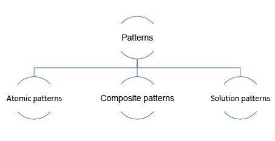
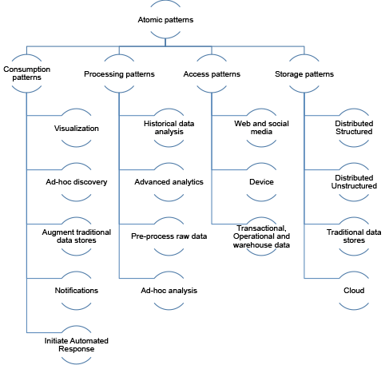
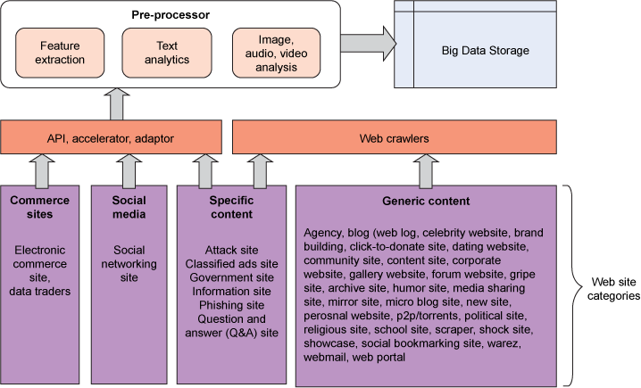
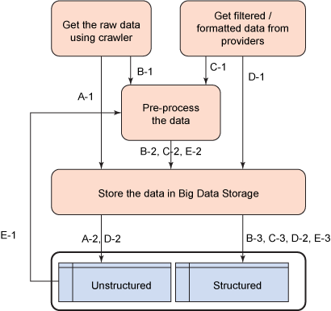
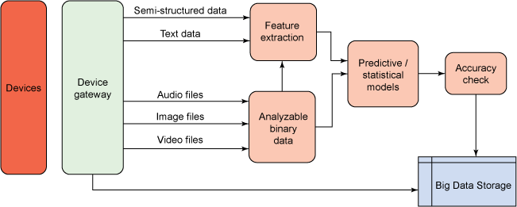
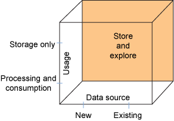
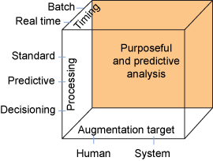
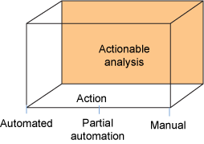
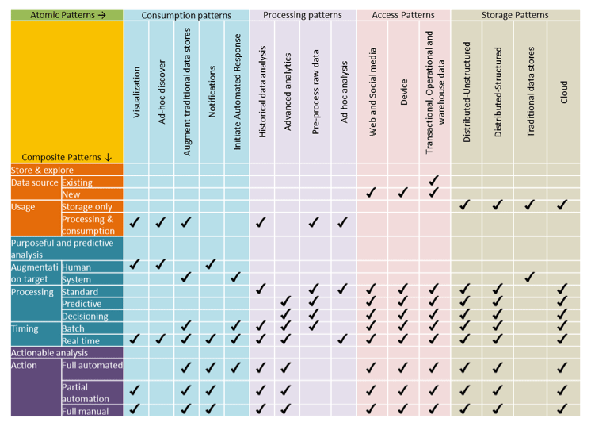
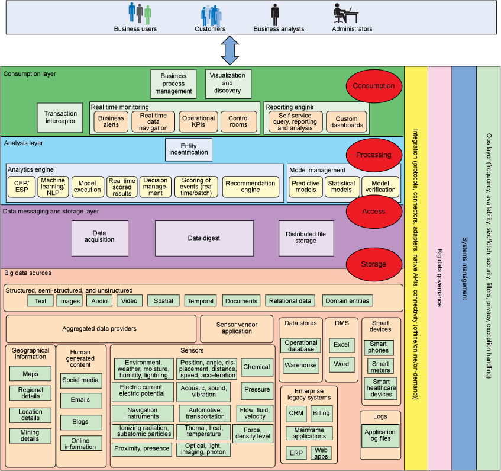

# 了解用于大数据解决方案的原子模式和复合模式
探索大数据解决方案的逻辑层

**标签:** 分析

[原文链接](https://developer.ibm.com/zh/articles/bd-archpatterns4/)

Divakar Mysore, Shrikant Khupat, Shweta Jain

发布: 2014-09-25

* * *

## 简介

本系列的 [第 3 部分](http://www.ibm.com/developerworks/cn/data/library/bd-archpatterns3/index.html) 介绍了大数据解决方案的逻辑层。这些层定义了各种组件，并对它们进行分类，这些组件必须处理某个给定业务用例的功能性和非功能性需求。本文基于层和组件的概念，介绍了解决方案中所用的典型原子模式和复合模式。通过将所提出的解决方案映射到此处提供的模式，让用户了解需要如何设计组件，以及从功能角度考虑，应该将它们放置在何处。模式有助于定义大数据解决方案的架构。利用原子模式和复合模式可以帮助进一步完善大数据解决方案的每个组件的角色和责任。

本文介绍原子模式和复合模式。本系列的最后一篇文章将介绍解决方案模式。

##### 图 1：模式的类别

## 原子模式

对于大数据上下文中经常出现的问题， _原子模式_ 有助于识别数据如何是被使用、处理、存储和访问的。它们还有助于识别所需的组件。访问、存储和处理来自不同数据源的多种数据需要不同的方法。每种模式都用于满足特定的需求：例如，可视化、历史数据分析、社交媒体数据和非结构化数据的存储。可以将多种原子模式结合使用，组成一个复合模式。这些原子模式没有进行分层或排序。例如，可视化模式可以与社交媒体的数据访问模式直接交互，可视化模式还可以与高级分析处理模式进行交互。

##### 图 2：用于数据使用、处理、数据访问和存储的原子模式的示例

### 数据使用模式

这种类型的模式处理使用数据分析结果的各种方式。本节包括的数据使用模式可以满足几个需求。

#### 可视化模式

可视化数据的传统方式以图表、仪表板和摘要报告为基础。这些传统的方法并不总是用来可视化数据的最佳方式。

大数据可视化的典型需求（包括新出现的需求）如下所示：

- 执行流数据的实时分析和显示
- 基于上下文，以交互方式挖掘数据
- 执行高级搜索，并获得建议
- 并行可视化信息
- 获得先进的硬件，支持未来的可视化需求

正在进行研究，以确定人类和机器如何使用大数据洞察。这些挑战包括所涉及的数据量，并且需要将数据与上下文相关联。必须在适当的上下文中显示洞察。

可视化数据的目的是为了更容易、更直观地使用数据，因此报告和仪表板可能提供全高清的观看效果和 3-D 互动视频，并且可以为用户提供使用应用程序控制业务活动和结果的能力。

#### 即席发现模式

创建满足所有业务需求的标准报告往往是不可行的，因为企业的业务数据查询会有不同的需求。用户在查找特定信息时，可能需要获得根据问题的上下文执行即席查询的能力。

即席分析可以帮助数据科学家和关键业务用户了解业务数据的行为。即席处理中涉及的复杂性来自多种因素：

- 多个数据源可用于相同的域。
- 单一的查询可以有多个结果。
- 输出可以是静态的，并具有多种格式（视频、音频、图形和文本）。
- 输出可以是动态和交互式的。

#### 加强传统的数据存储

在大数据的初步探索中，许多企业选择使用现有的分析平台来降低成本，并依赖于现有的技能。加强现有的数据存储有助于拓宽可用于现有分析的数据的范围，包括驻留在组织边界内外的数据，比如社交媒体数据，它可以丰富主数据。通过拓宽数据范围，使之包含现有存储中的新事实表、维度和主数据，并从社交媒体获取客户数据，组织可以获得更深入的客户洞察。

但要牢记的是，新的数据集通常比较大，而现有的提取、转换和加载工具可能不足以处理它。您可能需要使用具有大规模并行处理能力的高级工具来解决数据的数量、多样性、真实性和速度特征。

#### 通知模式

大数据洞察使人类、企业和机器可以通过使用事件通知而立即采取行动。通知平台必须能够处理及时发送出去的预计数量的通知。这些通知与大量邮件或群发短信不同，因为内容一般是特定于使用者的。例如，推荐引擎可以提供有关世界各地的庞大客户群的洞察，而且可以将通知发送给这样的客户。

#### 启动一个自动响应模式

从大数据获得的业务洞察，可用于触发或启动其他业务流程或事务。

### 处理模式

无论数据是处于静止状态还是在运动中，都可以处理大数据。具体情况取决于分析的复杂性，有可能不需要对数据进行实时处理。这种模式解决了对大数据进行实时、近实时或批量处理的方式。

以下高级的大数据处理类别适用于大多数分析。这些类别通常也适用于基于 RDBMS 的传统系统。惟一的区别是庞大规模的数据、多样性和速度。在处理大数据时，要使用机器学习、复杂事件处理、事件流处理、决策管理和统计模型管理等技术。

#### 历史数据分析模式

传统的历史数据分析仅限于预定义的数据时间段，这通常取决于数据保留策略。由于处理和存储的限制，超出此时间段的数据通常会被归档或清除。基于 Hadoop 的系统和其他等效的系统可以克服这些限制，因为它们具有丰富的存储以及分布式大规模并行处理能力。运营、业务和数据仓库的数据被移动到大数据存储，您通过使用大数据平台功能对它们进行处理。

历史分析包括分析给定时间段、季节组合和产品的历史趋势，并与最新的可用数据进行比较。为了能够存储和处理如此庞大的数据，您可以使用 HDFS、NoSQL、SPSS® 和 InfoSphere® BigInsights™ 。

#### 高级分析模式

大数据提供了很多实现创意洞察的机会。不同的数据集可以在多种上下文中存在关联。发现这些关系需要创新的复杂算法和技术。

高级分析包括预测、决策、推理过程、模拟、上下文信息标识和实体解析。高级分析的应用包括生物统计数据分析（例如，DNA 分析）、空间分析、基于位置的分析、科学分析、研究，等等。高级分析要求大量的计算来管理大量的数据。

数据科学家可以指导您识别合适的技术、算法和数据集，以及在给定上下文中解决问题所需的数据源。比如 SPSS、InfoSphere Streams 和 InfoSphere BigInsights 等工具提供了这类功能。这些工具访问存储在大数据存储系统（比如 BigTable、HBase，等等）中的非结构化数据和结构化数据（例如，JSON 数据）。

#### 预处理原始数据模式

大数据解决方案主要由基于 MapReduce 的 Hadoop 系统和技术组成，MapReduce 是开箱即用的分布式存储和处理解决方案。然而，从非结构化数据提取数据（例如，图像、音频、视频、二进制提要，甚至是文本）是一项复杂的任务，需要具有机器学习能力并掌握自然语言处理等技术。另一个主要挑战是如何验证这些技术和算法的输出的准确度和正确性。

要对任何数据执行分析，数据都必须是某种结构化格式。从多个数据源访问的非结构化数据可以按原样存储，然后被转化成结构化数据（例如 JSON），并被再次存储到大数据存储系统中。非结构化文本可以转换成半结构化或结构化数据。同样，图像、音频和视频数据需要转换成可用于分析的格式。此外，使用预测和统计算法的高级分析的准确性和正确性取决于用来训练其模型的数据和算法的数量。

下面的列表显示了将非结构化数据转换成结构化数据所需的算法和活动：

- 文档和文本分类
- 特征提取
- 图像和文本分割
- 关联特征、变量和时间，然后提取包含时间的值
- 输出的准确度检查使用了混淆矩阵（confusion matrix）等技术和其他手动活动

数据科学家可以帮助用户选择合适的技术和算法。

#### 即席分析模式

处理大数据的即席查询所带来的挑战不同于对结构化数据执行即席查询时所面临的挑战，由于数据源和数据格式不是固定的，所以需要使用不同的机制来检索和处理数据。

虽然大数据供应商可以处理简单的即席查询，但在大多数情况下，查询是复杂的，因为必须在运行时动态地发现数据、算法、格式和实体解析。所以需要利用数据科学家和业务用户的专业知识来定义下列任务所需的分析：

- 识别并发现计算和算法
- 识别并发现数据源
- 定义所需的可以由计算使用的格式
- 对数据执行并行计算

### 访问模式

在大数据解决方案中，有许多数据源，还有很多访问数据的方式，本节将介绍最常见的几种。

#### Web 和社交媒体访问模式

Internet 是提供许多目前可以获得的洞察的数据源。在几乎所有分析中，都会用到 Web 和社交媒体，但获得这种数据需要不同的访问机制。

在所有数据源中，因为 Web 和社交媒体的多样性、速度和数量，所以 Web 和社交媒体是最为复杂的。网站大约有 40-50 个类别，每一个类别都需要使用不同的方式来访问数据。本节将列出这些类别，并介绍一些访问机制。从大数据的角度讲，高级的类别是商业站点、社交媒体站点，以及具有特定和通用组件的站点。有关的访问机制见图 3。如果需要的话，在完成预处理后，可将所访问的数据存储在数据存储中。

##### 图 3：Web 和社交媒体访问

需要执行以下步骤来访问 Web 媒体信息。

##### 图 4：大数据访问步骤

#### 非结构化数据存储中的 Web 媒体访问

1. 步骤 A-1. 爬网程序读取原始数据。
2. 步骤 A-2. 数据被存储在非结构化存储中。

#### Web 媒体访问为结构化存储预处理数据

1. 步骤 B-1. 爬网程序读取原始数据。
2. 步骤 B-2. 对数据进行预处理。
3. 步骤 B-3. 数据被存储在结构化存储中。

#### Web 媒体访问预处理非结构化数据

1. 步骤 C-1. 在极少数情况下，来自供应商的数据可以是非结构化数据。
2. 步骤 C-2. 对数据进行预处理。
3. 步骤 C-3. 数据被存储在结构化存储中。

#### 非结构化或结构化数据的 Web 媒体访问

1. 步骤 D-1. 数据供应商提供结构化或非结构化数据。
2. 步骤 D-2. 数据被存储在结构化或非结构化存储中。

#### Web 媒体访问预处理非结构化数据

1. 步骤 E-1. 不能使用在存储时未经过预处理的非结构化数据，除非它是结构化格式的数据。
2. 步骤 E-2. 对数据进行预处理。
3. 步骤 E-3. 经过预处理的结构化数据被存储在结构化存储中。

如图所示，数据可以直接存储在存储器中，或者可以对它们进行预处理，并将它们转换成一个中间格式或标准格式，然后再存储它们。

在可以分析数据之前，数据格式必须可用于实体解析或用于查询所需数据。这种经过预处理的数据可以存储在一个存储系统中。

虽然预处理通常被认为是微不足道的，但这项处理可能非常复杂和耗时。

### 设备生成的数据模式

设备生成的内容包括来自传感器的数据数据是从天气信息、电气仪表和污染数据等数据来源检测到的，并且由传感器捕获。这些数据可以是照片、视频、文本和其他二进制格式。

下图说明了处理机器生成的数据的典型过程。

##### 图 5：设备生成的数据访问

图 5 说明了访问来自传感器的数据的过程。由传感器捕获的数据可以发送到设备网关，设备网关会对数据执行一些初始预处理，并缓冲高速数据。机器生成的数据大多为二进制格式（音频、视频和传感器读数）或文本格式。这样的数据最初可以存储在存储系统中，也可以对它们进行预处理，然后再存储它们。对于分析来说，要求执行预处理。

#### 事务、运营和仓库数据模式

可以存储现有的事务、运营和仓库数据，避免清除或归档数据（因为存储和处理的限制），或减少在数据被其他使用者访问时对传统存储的负载。

对于大多数企业而言，事务、运营、主数据和仓库信息都是所有分析的核心。如果用在 Internet 上，或者通过传感器和智能设备提供的非结构化数据以及外部数据来增强此数据，那么可以帮助组织获得准确的洞察，并执行高级分析。

使用由多个数据库厂商提供的标准连接器，事务和仓库数据可以被推入存储。预处理事务性数据要容易得多，因为数据大多是结构化的。可以使用简单的提取、转换和加载流程将事务数据移动到存储中。事务数据可以很容易地转换成 JSON 和 CSV 等格式。使用 Sqoop 等工具可以更容易将事务数据推入存储系统，如 HBase 和 HDFS。

##### 数据访问模式的特殊变化：生物特征数据访问

此信息的数据访问与对机器生成的数据的访问非常相似。生物特征数据被归类为生理和行为数据，可以通过许多方式对大量数据进行分析。

有些数据可通过传感器来获取，有些数据则需要身体样品（血液、尿液等）。处理生物特征数据（如 DNA 数据）需要更长的时间。

生理数据包括指纹、掌纹、气味和香味的信息，以及面部、声音、视网膜和虹膜特征。行为数据包括打字模式、打字节奏、说话、走路、签名匹配和步态。

### 存储模式

存储模式有助于确定适当的存储各种数据的类型和格式。数据可以按原样存储，根据键值对存储，或者以预定义的格式存储。

分布式文件系统（如 GFS 和 HDFS）都能够存储任何类型的数据。但是，高效地检索或查询数据的能力会影响性能。技术的选择很重要。

#### 分布式非结构化数据的存储模式

大部分大数据是非结构化数据，而且可以通过不同的方式针对不同的上下文提取它所拥有的信息。大多数时候，非结构化数据必须按原样并以其原始格式进行存储。

这样的数据可以存储在分布式文件系统（如 HDFS）和 NoSQL 文档存储（如 MongoDB）中。这些系统提供了检索非结构化数据的有效方法。

#### 分布式结构化数据的存储模式

结构化数据包括从数据源到达的已经是结构化格式的数据，以及经过预处理，被转换为 JSON 数据等格式的非结构化数据。必须存储已经过转换的数据，避免从原始数据到结构化数据的频繁数据转换。

可以使用 Google 的 BigTable 等技术来存储结构化数据。BigTable 是一个大规模容错式自我管理系统，包括 TB 级的内存和 PB 级的存储。

Hadoop 中的 HBase 可媲美 BigTable。它使用了 HDFS 作为底层存储。

#### 传统数据存储的存储模式

对于存储大数据而言，传统的数据存储并不是最佳选择，但在企业执行初步数据探索的情况下，企业可能会选择使用现有的数据仓库、RDBMS 系统和其他内容存储。这些现有的存​​储系统可用来存储使用大数据平台消化和过滤的数据。不要认为传统的数据存储系统适用于大数据。

#### 云存储的存储模式

许多云计算基础架构供应商都有分布式结构化、非结构化的存储能力。从传统的配置、维护、系统管理、编程和建模角度讲，大数据技术有点不同。此外，实现大数据解决方案所需的技能既罕见又昂贵。探索大数据技术的企业可以使用云解决方案来提供大数据的存储、维护和系统管理。

要存储的数据往往是敏感数据，这些数据包括医疗记录和生物特征数据。您需要考虑数据安全性、数据共享、数据治理，以及有关数据的其他政策，在考虑将云作为大数据存储库的时候尤其如此。传输大量数据的能力也是云存储的另一个重要考虑因素。

## 复合模式

_原子模式_ 侧重于提供执行各项功能所需的能力。但是， **_复合模式_** 是基于端到端的解决方案进行分类的。每个复合模式都要考虑一个或多个维度。在将复合模式应用到每个模式时，会有许多变化。可以将复合模式映射到一个或多个原子模式，以解决某个给定的业务问题。本文所述的复合模式列表是基于经常发生的典型业务问题，但这不是复合模式的完整列表。

### 存储和探索模式

如果业务问题需要存储大量新数据和现有数据，而且先前由于缺乏足够的存储和分析能力而一直未使用这些数据，那么这种模式就非常有用。该模式旨在缓解对现有数据存储的负载。所存储的数据可用于初始勘探和即席发现。用户可以推演报告，通过进一步的处理来分析数据的质量和价值。您可以使用 ETL 工具来预处理和净化原始数据，然后再进行任何类型的分析。

##### 图 6：存储和探索复合模式

图 6 说明了这种模式的多个维度。数据的使用目的可能只是存储它，或处理和使用它。

仅存储的示例是，数据的获取和存储只是为了将来能够满足合规性或法律的要求。在处理和使用的情况下，分析的结果可以被处理和使用。可以从最近发现的来源或从现有的数据存储访问数据。

### 专用和可预测的分析复合模式

使用此模式的情况是，使用多种处理技术执行分析，因此，可以用新洞察丰富现有数据，或创建可由各种用户使用的输出。该分析可以在事件发生的同时实时发生，或使用批量模式，根据收集到的数据获得洞察。作为可以分析的静态数据的示例，某电信公司可能构建客户流失模型，包括分析呼叫数据记录、社交数据和事务数据。作为分析运动数据的示例，预测某个给定事务正在经历欺诈的需求必须实时或近实时地发生。

##### 图 7：专用和预测分析复合模式

图 7 说明了这种模式的多个维度。所执行的处理可以是标准的或预测性的，并且可以包括决策。

此外，可以将通知发送给与特定任务或消息有关的系统或用户。该通知可以使用可视化功能。该处理可实时发生或以批量模式发生。

### 可操作的分析模式

大数据解决方案的最高级形式是，对数据集执行分析，并且基于可重复的过去的行动或行动矩阵来暗示行动。该操作可以是手动、半自动或全自动的。基础分析需要高度准确。行动是预定义的，分析的结果被映射到行动。可操作分析中所涉及的典型步骤是：

- 分析数据以获得洞察。
- 制定决策。
- 激活相应的渠道，对正确的使用者采取行动。

##### 图 8：可操作的分析复合模式

图 8 说明该分析可以是手动、半自动或全自动的。如图中的说明所示，它使用了原子模式。

_手动操作_ 意味着系统基于分析的结果来提供建议操作，并由人类决定和执行操作。 _半自动_ 意味着，分析建议操作，但不需要通过人类干预来启动操作，或从一组建议的操作中进行选择。 _全自动_ 表示在决策之后，系统立即执行操作。例如，在设备被预测会发生故障之后，系统可以自动创建一个工作订单。

下面的矩阵显示了如何将原子模式映射到复合模式，复合模式是原子模式的组合。每个复合模式都被设计为针对具有一组特定特征的数据在特定情况下使用。矩阵显示了模式的典型组合。必须对模式进行调整，以满足特定的情况和需求。在矩阵中，按照从最简单到最复杂的顺序列出了复合模式。”store and explore（存储和探索）”模式是最简单的。

##### 图 9：复合模式对原子模式的映射

## 结束语

采用基于模式的方法可以帮助业务团队和技术团队在解决方案的首要目标上达成一致意见。技术团队可以使用模式定义架构性原则，并制定一些关键架构决策。技术团队可以将这些模式应用到架构层，并导出实现解决方案所需的组件集。通常情况下，解决方案从有限的范围开始，然后企业会变得越来越有信心，相信解决方案会带来价值。随着演变的发生，与解决方案一致的复合模式与原子模式将会得到细化。在初始阶段，可以使用模式来定义一个基于模式的架构，并映射出在该架构中如何逐步设计组件。

##### 图 10：将原子模式映射到架构层

在本系列的 [第 2 部分](http://www.ibm.com/developerworks/cn/data/library/bd-archpatterns2/index.html) 中，我们描述了与大数据有关的复杂性，以及如何确定是否应实现或更新您的大数据解决方案。在本文中，我们讨论了原子模式和复合模式，并解释了一个解决方案可以由多种模式组成。给定一个特定的上下文，您可能会发现某些模式是比其他模式更合适。我们建议您采用端到端的解决方案视图，并考虑所涉及的模式，然后定义大数据解决方案的架构。

对于架构师和设计师，映射到模式可以支持对架构中各组件的责任进一步细化。对于业务用户而言，它通常有助于更好地理解大数据问题的业务范围，从而获得有价值的洞察，让解决方案满足所期望的结果。

此外，解决方案模式有助于定义最优的组件集，根据业务问题是否需要使用数据发现和探索功能、专用和可预测的分析或者可操作的分析。请记住，在实现一个解决方案时，并没有建议的原子、复合或解决方案模式的顺序或次序。在本系列的下一篇文章中，将针对此用途介绍解决方案模式。

本文翻译自： [Understanding atomic and composite patterns for big data solutions](https://developer.ibm.com/articles/bd-archpatterns4/)（2014-09-25）