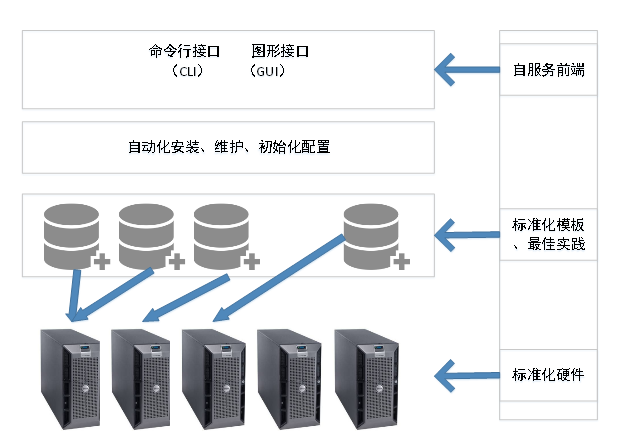
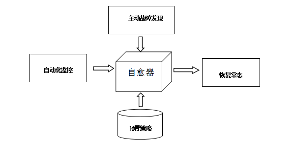

# 云数据库时代的 Db2 自愈系统
了解 Db2 应用实践

**标签:** 分析,金融

[原文链接](https://developer.ibm.com/zh/articles/ba-lo-cloud-database-db2-selfhealing-system/)

王 飞鹏

发布: 2018-09-12

* * *

## 概述

笔者于 2005 年加入 IBM 中国开发实验室，从事 Db2 研发工作 8 年，在 2014 年又加入中信银行。8 年的 IBM 原厂工作经验和 4 年多的银行工作经历让我有幸见证了 Db2 的发展路线图以及在中信银行的运用。中信银行的核心数据库运行在 IBM AS400 之上，在开放平台的数据库主要以 Db2 为主，同时也在积极引入开源数据库 MySQL。

随着金融科技（Fintech）快速发展，数据库从传统的集中式走向了分布式，从单机部署走向了云平台部署。中信银行与时俱进，引入了云数据库、分布式数据库等创新技术，实现了业务上的高速发展。目前，中信银行在开放平台积极引入基于 IBM Db2 和 MySQL 的云数据库平台；核心系统将下移到中信自己研发的分布式数据库 GoldenDB，旨在打造金融行业最顶级的分布式数据库产品，为金融业务带来最快、最好的竞争优势。需要强调的是，中信银行引入的任何创新技术都紧紧围绕着客户需求，为客户创造更大的价值，以及更便捷、更快速和更贴心的服务。

在本文中，笔者主要以 IBM Db2 为例，介绍 Db2 云数据库的两种部署方式，即 DBaaS（数据库即服务）部署和 Docker 容器部署。随后基于 Db2 云数据库部署，本文深入阐述了 Db2 自愈系统设计，说明如何在云部署环境下实现自愈，最后给出自愈运维的最佳实践。希望能帮助读者对云数据库的自愈设计有一个全面认识。

## Db2 数据库云部署

**免费试用 IBM Cloud**

利用 [IBM Cloud Lite](https://console.bluemix.net/) 快速轻松地构建您的下一个应用程序。您的免费帐户从不过期，而且您会获得 256 MB 的 Cloud Foundry 运行时内存和包含 Kubernetes 集群的 2 GB 存储空间。

Db2 要想在银行真正实现云部署，首先对基础设施提出了较高要求。这几年，中信银行基础设施获得了高速发展。从朝阳门生产机房到顺义新生产机房、从酒仙桥同城灾备中心到通州汇天灾备中心、从西安异地灾备中心再到合肥异地灾备中心，基础设施的升级和扩容满足了中信银行云数据库不断增长的部署需求。

在写本文以前，笔者一直在思考，如何在云时代更好的部署数据库？实际上，中信银行制定了严格的技术规范和架构标准，例如分库、双活、多活、读写分离等，并建立了云数据库的落地实施能力。随着云数据库架构的逐步推广，中信银行的数据库管理工作逐渐从以前那种”严防死守”——就是一出问题必须要解决，否则业务就不能恢复，发展到现在的多数情况下即使出了问题也不影响业务或者少影响业务。中信银行取得的工作成果是在非常严格的监管以及为客户负责的前提下完成的，是在考虑了可用性、安全性和客户体验的前提下实现的。

现在中信银行在云数据库时代的实施能力丝毫不逊色于互联网企业，开发和运维工作结合日益紧密，DevOps 文化深入人心，将来中信银行的数据库运维将从 DBA 人工运维转换为云数据库时代的平台化运维。

### DBaaS 部署

为了节省数据库部署和维护时间，DBaaS 模型借鉴自云计算自助服务概念，它使得用户可以轻松从云环境中根据需要获取数据库。使用 DBaaS 模型，最大优势是可以动态请求和配置数据库运行所需资源。通过 DBaaS 自动化创建数据库实例，将不需要 DBA 花数周时间搭建，它通过云环境上的 DBaaS 即时提供。

实现 Db2 数据库的 DBaaS 部署，DBA 只需要考虑如下因素：数据库基础架构、数据库部署最佳实践以及将数据库服务无缝提供给最终用户的接口。

##### 图 1\. 银行业 DBaaS 云部署平台



银行业在实现 DBaaS 部署时，通常会搭建并管理一个专用的企业数据云平台环境，这个云平台环境由服务器、存储、网络、虚拟机、数据库等组成，并提供服务接口供最终用户使用。DBaaS 云部署平台见图 1，主要规划下述内容：

1. 规划云平台环境。

    主要考虑计算资源、存储资源和网络资源。计算资源主要涉及所采用的服务器，要确保硬件平台尽可能标准化，要考虑服务器高可用性、灾难恢复和自主性等属性；存储资源主要涉及存储设备，要考虑硬件基础架构的整体存储容量和性能；网络资源要考虑交易业务对网络的要求、灾备系统对网络的要求以及数据库备份对网络的要求。

2. 设计模板和最佳实践。

    从实际工作出发，确定业务环境中发生的常见工作负载和关键流程，设计成模板并整理成最佳实践，使用此模板和最佳实践可轻松克隆以供未来通过 DBaaS 配置的数据库实例，这是自动化和通过 DBaaS 交付的必选内容，也是成功部署的关键。

3. 最终交付。

    根据最终用户的需求，通过图形用户界面或者命令行界面提供数据服务接口。


### 容器部署

目前，使用 Docker 容器部署数据库在银行业很流行，Docker 是一个开源的应用容器引擎，它可以让开发者打包他们的应用以及依赖包到一个可移植的容器中，然后发布到任何流行的目标机器上。容器完全使用沙箱机制，相互之间不会有任何接口。

Db2 数据库支持 Docker 容器部署，从目前银行同业运用现状来看，主要有两种部署方式。

第一种，IBM 厂商提供的部署方案，即 IBM dashDB 和 IBM dashDB Local。

1. IBM dashDB 是 IBM 针对公有云数据仓库解决方案，它提供受管的公有云服务，完全由 IBM 负责运维管理，用户只需要专注自己的分析数据及应用即可；
2. IBM dashDB Local 是 IBM 针对私有云数据仓库解决方案，它采用目前流行的 Docker 容器技术，数据库部署、升级等耗时运维操作快速简单。它适合需要云的简单灵活，但由于隐私和监管要求，需要银行自己管理数据的场景。

第二种，银行自己定制的部署方式。本文将重点探讨这种定制方式，在这种部署方式 下，Db2 就象普通软件一样在 Docker 容器部署即可，但有以下注意事项：

1. 选择特权模式部署

    Docker 容器可以在特权模式或者非特权模式创建。如果容器是在特权模式下创建的，那么 Docker 支持访问主机上的所有设备。默认情况下，所有 Docker 容器都是在非特权模式下创建的。建议 Db2 采用特权模式进行部署，这样不需要额外的配置，比较方便。

2. 做好存储规划

    默认情况下，所有 Docker 镜像和容器持久化数据都保存在 Docker 主目录（通常为 /var/lib/Docker）的子目录中。根据 Docker 最佳实践，应该将容器创建为临时性容器，以确保打包在 Docker 中的软件可以轻松升级。但由于 Db2 数据文件通常都很大，而且对存储的读写性能有极高要求，所以使用 Db2 构建容器时，建议挂载一个外部数据卷来存储需要持久化的 Db2 数据文件，例如 Db2 实例主目录、容器文件、活动日志和归档日志。

3. 做好内存规划

    为了实现更有效的主机资源使用，同时不影响其他应用程序，Docker 支持在容器上执行处理器和内存资源限制。建议为 Db2 配置足够大的内存资源，以满足运行需要。当然，也可以通过设置 INSTANCE\_MEMORY 配置参数，限制 Db2 可以使用的内存量。这可以确保 Db2 不会尝试使用超过容器受限可用量的内存。

    注意：如果在一个主机上部署多个 Docker 容器, 这多个 Docker 容器的内存之和不要超过主机物理内存的限制。笔者曾遇到一个客户在 8GB 内存的测试系统创建多个容器，因为内存达到上限，部署 docker 容器不成功的情况。

4. 容器主机名要和 Db2 配置匹配

    当 Db2 部署在 Docker 容器中时，Db2 nodes.cfg 文件和 DB2 SYSTEM 注册表变量中的主机名必须始终与容器的当前主机名匹配。


## Db2 数据库自愈系统设计

Db2 本身提供的自调整能力是实现自愈能力的基础。Db2 自调整内存管理器（STMM）动态调整 DB2 系统中数据库内存总量，这样缓冲池、锁列表、排序堆和包缓存等都实现了自动调整，无需 DBA 调优；Db2 提供了统计信息自动收集功能，可以确保优化器获取最新统计信息；Db2 提供了表空间的自动存储管理，可以实现表空间自动扩展。

随着数据库自动化运维的快速发展，将来的云数据库应具备更强的自愈能力。这种具有自愈能力的云数据库需要提供自动驱动、自动调整、自动恢复、自动扩展和自动保护管理。这种自愈能力通过各级内置自动化功能来执行维护任务，将最大可能消除数据库运维复杂性、人为错误和人工管理，例如可以将 AI 技术应用于数据库，使用 AI 技术调优数据库的性能、AI 技术优化 SQL 语句、AI 技术自动创建学习型索引（Learned Index）等。

总之，在云数据库环境下，除了数据库自身提供的自动化调整能力外，我们还迫切需要数据库具备处理故障的自愈能力。接下来以中信银行 Db2 数据库自愈实践为例，说明如何设计数据库自愈系统。

### 云数据库自愈实践

中信银行在云数据库部署方面走在了银行同业前列。在 DBaaS 领域，已经完成了相关技术验证，开始进入实施阶段，将来中信银行大部分数据库部署和运维将通过 DBaaS 实现；在 Db2 容器化部署方面，已经完成相关技术验证工作，即将在测试环境试运行。

中信银行在引入云数据库后，由于部署规模增大和运维事件相应增多，大胆引入了 Db2 自愈这一先进理念。如图 2 所示，Db2 自愈架构，通过自动化监控，相关数据库故障事件会传递给自愈器，或者自愈器主动发现故障；自愈器收到故障事件后，根据预置策略，对故障事件进行处理，实现自愈，最终恢复常态。

这个架构带来了 3 个方面的好处：

1. 降低了成本，包括软硬件成本、人员成本和维护成本；
2. 提高了 IT 人员的体验，包括降低开发和运维管理的工作量；
3. 提升了硬件资源的利用率和单位硬件下的产出率，从而支持更大量的业务。

##### 图 2\. Db2 自愈架构



接下来，笔者将以参数设置不当、CPU 利用率高和数据库坏页这三种场景为例，说明如何设计和实现数据库自愈。

### 场景1：参数级自愈场景

所谓参数级自愈，就是当数据库负载突然增大或者新应用上线，导致数据库当前参数无法满足要求而引起生产事故，这时候就需要通过自愈器来调整数据库参数来解决。

这里就以 2018 年 6 月发生的生产应急为例，当时新上线了 Java 应用。由于 Db2 实例参数 JAVA\_HEAP\_SZ 设置偏小，引起数据库无法成功加载 Java 类对象，业务无法进行。这里的 JAVA\_HEAP\_SZ 参数属于实例级，它的默认值为 512，即 512 个 4K 页，它决定执行 Java 存储过程时 Java 解释器所能使用的堆最大尺寸。

下面讲述数据库如何实现自愈的。

### 故障发现

在 2018 年 6 月 27 日晚 23 点左右新上了 Java 应用，应用中也包含一些 Java 存储过程。问题出现在 2018 年 6 月 28 日凌晨 0 点左右，当业务上来后，自动化监控发现在 Db2 诊断日志中频繁出现清单 1 中的”Class loader loadClass failed”报错：

#### 清单 1\. db2diag.log 诊断日志报错

```
2018-06-28-00.01.15.122094+480 I23534978A460 LEVEL: Warning
PID : 1515998 TID : 22361 PROC : db2fmp (Java) 0
INSTANCE: dbinst NODE : 000
EDUID : 22361 EDUNAME: db2fmp (Java) 0
FUNCTION: DB2 UDB, BSU Java support, sqlejCallJavaRoutine_dll, probe:81
MESSAGE : Class loader loadClass failed. class:
DATA #1 : Hexdump, 11 bytes
0x0000000118450FCE : 6765 7442 6974 4279 4964 78
2018-06-28-00.01.17.014419+480 I23535439A370 LEVEL: Warning
PID : 1515998 TID : 1 PROC : db2fmp (Java) 0
INSTANCE: dbinst NODE : 000
EDUID : 1 EDUNAME: db2fmp (Java) 0
FUNCTION: DB2 UDB, routine_infrastructure, sqlerMasterThreadListener,
     probe:300
MESSAGE : Java heap is nearly full; no thread created

```

Show moreShow more icon

### 自愈实现

针对这个问题，自愈器检查了 Db2 实例参数 JAVA\_HEAP\_SZ 的当前设置，发现其值配置为一个很小的默认设置（512），见清单 2：

#### 清单 2\. 当前参数值配置过小

```
Db2 get dbm cfg
Database Manager Configuration
Node type = Enterprise Server Edition with local and remote clients
...
Database monitor heap size (4KB) (MON_HEAP_SZ) = 66
Java Virtual Machine heap size (4KB) (JAVA_HEAP_SZ) = 512

```

Show moreShow more icon

数据库自愈器根据策略，将 JAVA\_HEAP\_SZ 立即调整为 10240，最后重启数据库生效（见清单 3），最终实现了自愈。

#### 清单 3\. 自愈器调大参数值

```
db2 update dbm cfg using JAVA_HEAP_SZ 10240
DB2 0000I The UPDATE DATABASE MANAGER CONFIGURATION command completed
successfully.
db2stop force
06/28/2018 00:02:16 0 0 SQL1064N DB2 STOP processing was successful.
SQL1064N DB2 STOP processing was successful.
db2start
06/28/2018 00:02:36 0 0 SQL1063N DB2 START processing was successful.
SQL1063N DB2 START processing was successful.

```

Show moreShow more icon

### 场景 2：高 CPU 利用率典型场景

在日常运维中，有一种极为常见的数据库性能问题：由于突发负载导致服务器 CPU 利用率突增，这会使得业务响应时间增加为平时的几倍几十倍，严重的时候会导致数据库完全不可用。

针对这种问题，传统运维方法都是依赖 DBA 手工调优：即通过快照抓取高耗 CPU 的 SQL 语句，然后优化 SQL 语句解决。很显然这种方法属于”人肉运维”，对一般的数据库还能收到效果，但在大规模云数据库环境下，由于部署的数据库达到了上千套，出现这种性能问题概率很高，完全依靠手工办法就爱莫能助了。

下面重点以 2018 年 8 月 24 日发生的生产应急为例，在云数据库环境下，自愈器如何结合监控实现自愈的。

### 故障发现

首先，自动化监控发现数据库服务器的 CPU 利用率达到阈值时（例如 80%），会将生产事件上报给自愈器。接下来，自愈器通过清单 4 中的脚本第一时间收集数据库快照信息。整个收集过程分为两步：

第一步，通过 “db2pd -act” 命令收集正在执行的 anchID（锚 ID），这些 anchID 和某个应用的 SQL 语句相关联；

第二部，针对这些 anchID 把相关联的 SQL 语句输出到 /tmp/dyn\_sql.txt 文件中。

#### 清单 4\. 获取占用高用户态 cpu 的 sql 语句

```
db2pd -d <db_name> -act |grep -v -e "Database Partition" -e "Active
    Statement"|sort -nk 6 >/tmp/db2pd_act.log 2>&1
cat /tmp/db2pd_act.log|grep -v "^$"|awk '{print $6}'|uniq -c
    >/tmp/AncdID_group.log 2>&1
cat /tmp/AncdID_group.log|grep -v "AnchID"|awk '{print $2}'
    >/tmp/AnchID.log 2>&1
cat /tmp/AnchID.log|while read line;
do
AppHandl=`grep -w "$line" /tmp/db2pd_act.log|awk '{print $2}'|head -1`
Db2 get snapshot for application agentid $AppHandl > /tmp/app.snap
    2>&1
echo "//Applid:$AppHandl;AnchID:$line" >> /tmp/dyn_sql.txt
    2>&1
level=`uname`
if [ "$level" == "AIX" ] ;then
grep -p "Dynamic SQL statement text" /tmp/app.snap|tail -2|grep -v "^$"
    >> /tmp/dyn_sql.txt 2>&1
else
grep -A 1 "Dynamic SQL statement text:" /tmp/app.snap|tail -1 >>
    /tmp/dyn_sql.txt 2>&1
fi
done

```

Show moreShow more icon

2018 年 8 月 24 日，当时运行关键业务的数据库服务器突发性出现了 CPU 利用率增高到 90% 以上，这时自愈器收到自动化监控的上报后，立即执行清单 4 中的脚本，收集正在执行的 anchID 以及 SQL 语句。详细步骤如下：

- 收集正在执行的 anchID：见清单 5 的输出，当前 CPU 繁忙时，锚 ID 为 673 和 885 多次出现。

#### 清单 5\. 收集正在执行的 anchID

```
[appmon@ebankdb2 /snap]$ db2pd -d bankdb -act |grep -v -e "Database
    Partition" -e "Active Statement"|sort -nk 6 >/tmp/Db2 pd_act.log
    2>&1
Database Partition 0 -- Database BANKDB -- Active -- Up 341 days 10:50:00
    -- Date 2018-08-24-11.14.25.326512
Active Statement List:
Address AppHandl [nod-index] UOW-ID StmtID AnchID StmtUID EffISO
    EffLockTOut EffDegree EntryTime StartTime LastRefTime
0x0700002824F2F3A0 16296 [000-16296] 46 1 673 1 1 25 0 Fri Aug 24 11:14:23
    Fri Aug 24 11:14:23 Fri Aug 24 11:14:23
0x0700002826F17C20 18921 [000-18921] 49929 1 885 1 3 25 0 Fri Aug 24
    11:14:24 Fri Aug 24 11:14:24 Fri Aug 24 11:14:24
0x0700002827BD2680 52796 [000-52796] 63823 1 673 1 1 25 0 Fri Aug 24
    11:14:22 Fri Aug 24 11:14:22 Fri Aug 24 11:14:22
0x07000028249F4C20 38046 [000-38046] 33 1 673 1 1 25 0 Fri Aug 24 11:14:23
    Fri Aug 24 11:14:23 Fri Aug 24 11:14:23
0x070000284D11C600 7046 [000-07046] 18568 1 885 1 3 25 0 Fri Aug 24
    11:14:23 Fri Aug 24 11:14:23 Fri Aug 24 11:14:23
0x070000284E9B62A0 61671 [000-61671] 63696 1 885 1 3 25 0 Fri Aug 24
    11:14:23 Fri Aug 24 11:14:23 Fri Aug 24 11:14:23
0x070000282878C820 16842 [000-16842] 11 1 673 1 1 25 0 Fri Aug 24 11:14:24
    Fri Aug 24 11:14:24 Fri Aug 24 11:14:24
0x070000285BFE9E20 38717 [000-38717] 15465 1 885 1 3 25 0 Fri Aug 24
    11:14:24 Fri Aug 24 11:14:24 Fri Aug 24 11:14:24
0x07000028281B4200 25342 [000-25342] 21 1 673 1 1 25 0 Fri Aug 24 11:14:24
    Fri Aug 24 11:14:24 Fri Aug 24 11:14:24
0x0700002827601CE0 40342 [000-40342] 201096 1 673 1 1 25 0 Fri Aug 24
    11:14:22 Fri Aug 24 11:14:22 Fri Aug 24 11:14:22
0x070000282494D6A0 46967 [000-46967] 47 1 673 1 1 25 0 Fri Aug 24 11:14:23
    Fri Aug 24 11:14:23 Fri Aug 24 11:14:23
0x070000282D897320 54967 [000-54967] 9 1 673 1 1 25 0 Fri Aug 24 11:14:24
    Fri Aug 24 11:14:24 Fri Aug 24 11:14:24
0x070000284C712620 36967 [000-36967] 17898 1 885 1 3 25 0 Fri Aug 24
    11:14:24 Fri Aug 24 11:14:24 Fri Aug 24 11:14:24
0x0700002828666780 31888 [000-31888] 1 1 885 1 3 25 0 Fri Aug 24 11:14:24
    Fri Aug 24 11:14:24 Fri Aug 24 11:14:24
...

```

Show moreShow more icon

- 列出不同锚 ID 的值：见清单 5 的输出，由于锚 ID 673 和 885 多次出现，在输出文件中仅输出 1 次即可，所有输出的锚 ID 见清单 6：

#### 清单 6\. 输出唯一的 anchID

```
[appmon@ebankdb2 /snap]$ cat /tmp/db2pd_act.log|grep -v "^$"|awk '{print
    $6}'|uniq -c >/tmp/AncdID_group.log 2>&1
[appmon@ebankdb2 /snap]$cat /tmp/AncdID_group.log|grep -v "AnchID"|awk
    '{print $2}' >/tmp/AnchID.log 2>&1
673
885

```

Show moreShow more icon

- 针对不同锚 ID 输出正在执行的 SQL 语句：见清单 7 的输出，锚 ID 673 对应的 application agentid 为16296；锚 ID 885 对应的 application agentid 为 18921。例如，通过 “get snapshot” 快照命令取得 application agentid 为 16296 正在执行的 SQL 语句，“select pbo.pbo\_flowid as FLOWID from pl\_bsn\_opr pbo,pl\_cst\_bsn pcb where pbo.pbo\_flowid = pcb.pcb\_flowid”。

#### 清单 7\. 获得正在执行的 SQL 语句

```
[appmon@ebankdb2 /snap]$ db2 get snapshot for application agentid 16296
    > /tmp/app.snap 2>&1
Database Partition 0 -- Database BANKDB -- Active -- Up 341 days 10:50:00
    -- Date 2018-08-24-11.14.25.326512
Application Snapshot
Application handle = 16296
Application status = UOW Executing
Status change time = 08/24/2018 11:14:22.716353
Application code page = 1208
Application country/region code = 0
DUOW correlation token = C0A80640.D899.180824012002
Application name = CashManage
Application ID = C0A80640.D899.180824012002
Sequence number = 04997
TP Monitor client user ID = bankdb
TP Monitor client workstation name = BPApp2
TP Monitor client application name =
TP Monitor client accounting string =
...
Blocking cursor = YES
Dynamic SQL statement text:
select pbo.pbo_flowid as FLOWID from pl_bsn_opr pbo,pl_cst_bsn pcb where
    pbo.pbo_flowid = pcb.pcb_flowid

```

Show moreShow more icon

### 自愈实现

确定正在执行的 SQL 语句后，自愈器可以将 AI 技术应用于优化 SQL 语句，甚至使用 AI 技术自动创建学习型索引（Learned Index）。在本文中，自愈器将调用 db2expln 和 db2advis 命令对 SQL 语句进行优化，具体自愈步骤如下：

- 首先，自愈器捕获高耗 CPU 的 SQL 语句后，接下来使用 db2expln 命令生成这些语句的访问计划（Access Plan）。例如语句 “select pbo.pbo\_flowid as FLOWID from pl\_bsn\_opr pbo,pl\_cst\_bsn pcb where pbo.pbo\_flowid = pcb.pcb\_flowid” 的访问计划见清单 8 所示：

#### 清单 8.查看语句的访问计划

```
Estimated Cost = 2115.473010
...
Optimizer Plan:
^HSJOIN
( 18)
197403
110792
/-----+------\
332906 6083.32
TBSCAN TBSCAN
( 19) ( 20)
80566.9 116790
45160 65632
| |
8665811 6849703
TABLE: DB2 ADMIN TABLE: DB2 ADMIN
PL_BSN_OPR PL_CST_BSN

```

Show moreShow more icon

- 接下来，自愈器使用 db2advis 命令生成这些语句优化建议，给出的优化建议如清单 9 所示，即建议在两个表上分别创建索引。

#### 清单 9\. 生产 SQL 语句的优化建议

```
--
--
-- LIST OF RECOMMENDED INDEXES
-- ===========================
-- index[1], 309MB
CREATE INDEX "DB2ADMIN "."IDX1305140908520" ON "DB2ADMIN
    "."PL_BSN_OPR"
("PBO_FLOWID" ASC) ALLOW REVERSE
SCANS COLLECT SAMPLED DETAILED STATISTICS;
COMMIT WORK ;
-- index[1], 210MB
CREATE INDEX "DB2ADMIN "."IDX1305140908521" ON "DB2ADMIN
    "."PL_CST_BSN"
("PCB_FLOWID" ASC) ALLOW REVERSE
SCANS COLLECT SAMPLED DETAILED STATISTICS;
COMMIT WORK ;

```

Show moreShow more icon

- 最后，自愈器针对 db2advis 命令输出，根据预置策略，采取立即实施或者窗口时间实施，通过创建索引解决了生产问题。

### 场景 3：数据库坏页

数据库坏页是云数据库运维最棘手的问题，虽然遇到的概率不高，但由于出现坏页后不能及时发现，导致问题更加严重。

这里就以某系统大容量数据库发生的一次数据库坏页为例来说明。当时存储出现故障的时间为 5 月 22 日，这也是数据库出现坏页的时间，但直到 5 月 24 日才在 db2diag.log 中逐渐开始报错，见清单 10，出现了 “A bad page was encountered” 的报错信息。最终在 5 月 26 日完成统计是 20 多张表出现了坏页。这些坏表中最大表的记录数已达到 80 亿。

#### 清单 10\. db2diag.log 报错信息

```
2018-05-24-17.15.28.871902+480 I352972A3980 LEVEL: Severe
PID : 11469020 TID : 17688 PROC : db2sysc 9
INSTANCE: db2inst1 NODE : 009 DB : BIGDB
APPHDL : 9-29700 APPID: 10.2.3.1.59170.180522085943
AUTHID : PUSR1
EDUID : 17688 EDUNAME: Db2 agntp (ODSDB) 9
FUNCTION: DB2 UDB, buffer pool services, sqlb_verify_page, probe:2
MESSAGE : ZRC=0x86020001=-2046689279=SQLB_BADP "page is bad"
DIA8400C A bad page was encountered.
DATA #1 : String, 64 bytes
Error encountered trying to read a page - information follows :
DATA #2 : String, 23 bytes
Page verification error
DATA #3 : Page ID, PD_TYPE_SQLB_PAGE_ID, 4 bytes
2376128
DATA #4 : Object descriptor, PD_TYPE_SQLB_OBJECT_DESC, 88 bytes
Obj: {pool:5;obj:5461;type:64} Parent={5;5461}
lifeLSN: 00003D7C9EEE09D9
tid: 0 0 0
extentAnchor: 2376128
initEmpPages: 0
poolPage0: 0
poolflags: 2122
objectState: 25
lastSMP: 0
pageSize: 32768
extentSize: 32
bufferPoolID: 3
partialHash: 1431633925
bufferPool: 0x0700000030c37700
pdef: 0x070000018992a7e0

```

Show moreShow more icon

为什么发生坏页第一时间没有发现呢？这是由于当这 20 多张表出现坏页时，没有应用立即访问它们，所以在 db2diag.log 中就报不出来，直到有应用访问时，才陆续报错出来。

### 故障发现

针对这个故障，需要自愈器主动去发现数据库中存在坏页的坏表，而不是等到 db2diag.log 出现告警才被自动化监控上报。

实现脚本见清单 11：首先，使用 “inspect check table name” 命令对重点业务表进行坏页检查；随后，使用 grep 命令对生成的检查结果通过判断是否存在 Error 进行过滤；最后，所有坏表名字将被输出到 errorcheck.out 文件中。

注意：自愈器可以定期定时调用这个脚本，例如每隔 1 个小时调用 1 次，或者每天晚上调用 1 次。

#### 清单 11\. 主动发现坏表脚本

```
#usage : sh db2_inspect_table.sh <db_name>
DB=$1
DUMP=`db2 get dbm cfg | grep -i dump | awk '{print $7}'`
db2 connect to $DB;
db2 -x "select 'inspect check table name '||trim(tabname)||' schema
    '||trim(tabschema)||' results keep '||trim(tabname)||'.inf on all
    DbPartitionNums;' from syscat.tables where tabschema not like 'SYS%'" >
    $DIR1/inspecttablename.sql;
db2 -tvf $DIR1/inspecttablename.sql >/tmp/inspect.out
cd $DUMP
for x in `ls -lrt *.inf | awk '{print $9}'`
do
db2inspf $x /tmp/$x.out
done
cd /tmp
for x in `ls -lrt *.out | awk '{print $9}'`
do
y=`echo $x|cut -d'.' -f1`
echo "check table $y">>/tmp/errorcheck.out
grep Error $x >>/tmp/errorcheck.out
echo "check table $y" done>>/tmp/errorcheck.out
done
db2 terminate 2>&1

```

Show moreShow more icon

### 自愈实现

针对发现的坏表，需要制定好恢复策略，自愈器针对恢复策略进行恢复：

- 需要立即恢复表但不需要恢复数据：立即删除坏表重建新表即可；
- 需要立即恢复表且需要恢复数据：立即删除坏表重建新表，从备份系统或者其他上游系统抽数重新装载；
- 需要延时恢复表但不需要恢复数据：延时到停机窗口删除坏表重建新表即可；
- 需要延时恢复表且需要恢复数据：延时到停机窗口删除坏表重建新表，从备份系统或者其他上游系统抽数重新装载。

### 小结

在云数据库环境下，本节讲述了参数值配置偏小、CPU 利用率高和数据库坏页三个场景下，自愈器如何实现数据库自愈的。

这三个场景的自愈方式对比见下表 1：

##### 表 1\. 文中涉及 3 种自愈场景对比

**场景 1： 参数调整****场景 2： 高 CPU 利用率****场景 3： 数据库坏页**发现方式监控监控主动自愈方案参数调整自动优化 SQL 语句重建表加载数据调度策略立即立即取决策略方案应用自动化自动化自动化

## 云数据库自愈运维的最佳实践

在写本文之前，我和银行同业以及 IBM 原厂的一些资深 DBA 有过深入交流，大家普遍认为云数据库要想实现自愈运维，本质上需要 Db2 数据库产品和银行数据库同仁共同努力，才能真正实现自愈。

上面的话说出了本质，按照这个思路，本章讲述了让 Db2 发挥自愈处理能力的方方面面，包括云部署平台选型、存储设计、自愈器等。为了进一步方便读者，笔者列出了自愈运维设计的最佳实践。

1. 云平台选择。本文提到了 DBaaS 和容器两种部署模型，其中 DBaaS 适合大规模云化部署，例如实例和数据库数量可达上千个；Docker 容器部署可作为一种必要补充，其中容器化的 IBM dashDB 适合数据仓库部署环境，企业定制的 Docker 容器部署适合 DevOps 环境下快速部署和业务验证。
2. 计算资源标准化。所谓计算资源，主要是指服务器资源。要确保服务器平台尽可能标准化，要考虑高可用性、灾难恢复和自主性等属性。
3. 存储资源标准化。所谓存储资源，主要指外部存储，在控制总体拥有成本（TCO）的前提下，要确保存储资源标准化。
4. 使用更快速的网络。目前很多银行网络还是千兆网，这种网络吞吐量低、时延大，需要尽快改造为万兆网络，以满足云数据库对交易、容灾和备份的带宽和时延需求。
5. 设计标准化的数据库负载模板。确定业务环境中发生的常见工作负载和关键流程，并整理最佳实践，以及可轻松克隆以供未来通过 DBaaS 配置的数据库实例。
6. 发挥数据库本身的自调整能力。尽量发挥 Db2 数据库本身提供的自调整能力，包括 Db2 的自调整内存管理器（STMM）、统计信息自动收集、表空间的自动存储管理等。
7. 大胆引入新技术，不断提升自愈器的能力。例如，可以将 AI 技术应用于数据库，使用 AI 技术调优数据库的性能、AI 技术优化 SQL、AI 技术自动创建学习型索引（Learned Index）等。
8. DBA 不会失业，但挑战越来越大。以后的 DBA 将不会人工直接维护数据库，而是转换为依赖云数据库平台间接运维，对 DBA 的要求更高了，挑战更大了。

## 结束语

本文深入浅出介绍了 Db2 数据库云部署的方式，接着以云数据库自愈实践为例，通过结合典型场景阐述了 Db2 数据库自愈系统设计，最后给出了云数据库运维最佳实践。当然，要想完全掌握云数据库的自愈技能，不可能一蹴而就，要先理解基本概念和原理，然后通过不断实践，最后才能融会贯通。 希望本文能够真正帮助读者在实际工作中做好云数据库的建设和维护工作。

## 参考资源

- 马上注册 [IBM Cloud](https://cocl.us/IBM_CLOUD_GCG) ，试用 Db2 云产品。