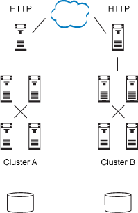
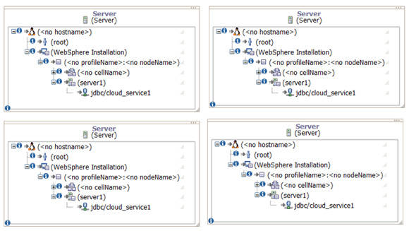
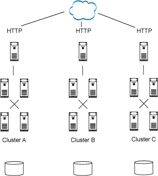

# 云计算多租户最佳实践
构建可伸缩的、可用的云计算多租户架构

**标签:** 云计算

[原文链接](https://developer.ibm.com/zh/articles/cl-multitenantcloud/)

IBM Developer Staff

发布: 2011-09-05

* * *

云计算多租户几乎用于所有软件即服务 (Software as a Service, SaaS) 应用程序，因为计算资源是可伸缩的，而且这些资源的分配由实际使用决定。话虽如此，用户可以通过 Internet 访问多种类型的 SaaS 应用程序，从小的基于 Internet 的小部件到大型企业软件应用程序。根据存储在企业网络之外的软件供应商的基础架构上的数据不同，安全需求也在不断增长。应用程序需要多租户是有许多原因的，其中最明显的原因就是成本：在大多数情况下，为每个客户增加几个服务器和一个数据库是远远不够的，尽管在安全要求很高的情况下这么做有点用处。

本文是一篇概述性文章，调查并描述了可用的多租户的类型，并提供了实现用例。

## 多租户概念

多租户的概念包含三层用户集成：

- 数据中心层
- 基础架构层
- 应用程序层

云计算技术设计中的重要内容是多租户的基础架构和应用程序层集成。此集成经过特别的调整，可节约成本和开发具有高度可伸缩性的 SaaS 应用程序，而这是以牺牲安全性和客户隔离需求 (segregation requirement) 为代价。很多情况下，这样的设计都是有效的，尽管可能不太适用于金融应用程序。

在数据中心租用空间并提供服务器、路由器和线缆以支持多个客户软件，这项功能自从硅谷创立初期就已经存在，因此用户对于数据中心层多租户应该并不陌生。如果正确实现此配置，则该配置能够提供最高级别的安全需求，它用防火墙和访问控制来满足业务需求，还定义了对提供 SasS 的基础架构的物理位置的安全控制。大多数情况下，可以将数据中心层多租户用作服务供应商，向公司提供场地来安置硬件、网络以及软件。

基础架构层的多租户是最简单软件栈概念，一个栈专用于一个特定客户。与数据中心层多租户相比，此配置更节约成本，因为栈是根据实际的客户账户部署的。在这种情况下，可以根据实际的服务使用来增加硬件需求。另外，基础架构层的每个用户都可以选择高可用性。每个客户都知道栈，所以软件和硬件最佳实践提供了一些实现选项。

应用程序层多租户需要在软件层和基础架构层基础上进行架构实现。需要修改现有软件架构，包括应用程序层的多租户模式。例如，多租户应用程序需要一些应用程序方法和数据表来访问和存储不同用户账户的数据，这会牺牲安全性。但如果正确实现此操作，就可以节省成本。对于小部件和简单的 Web 应用程序，应用程序层多租户是一个可行的解决方案，因为单个开发人员可以更快地开发软件，也负担得起调整规模的费用。不足之处在于更复杂的应用程序架构和实现；与基础架构处理多租户不同的是，如果基础架构发生变化，应用程序团队需要保持编程模式的可伸缩性和可靠性，而且在未来可用。

## 服务

多租户服务指定从在软件应用程序中构建并直接访问的 HTTP RESTful 接口或 WSDL Web 服务终端访问。这些服务是建立多租户模式的面向服务的应用程序的关键，因为它们可重用于多种事务类型。例如，多租户应用程序层服务的客户可以通过调用 URL 来调用服务，它的返回结果会产生 XML 作为响应码：

```
https://visa.com/services/paymentOverview?account=OnlineShoesInc&pass=1234⦥=1_month

<Response >
      < Report >
       <Title >Online Shoes Inc Report</Title>
      <Data><x>01/01/2011</x><y>20.11</y></Data>
<Data><x>02/01/2011</x><y>22.24</y></Data>
<Data><x>03/01/2011</x><y>20.21</y></Data>
</Report>
</Response>

```

Show moreShow more icon

多租户的最关键部分是在 URL 中设置账户参数，让基础架构知道哪个客户在请求访问数据。这是服务层的多租户的路由机制。

## 应用服务器

应用服务器是应用程序和基础架构层多租户的关键部件，因为多租户会影响安装、配置和应用程序代码。对于基础架构层，应用服务器的多租户意味着调整更快、更广，它配置了额外的服务器，其中包括应用服务器安装、配置和应用程序代码。多租户层不需要更改代码（除非应用程序设置了特别的需求），调整也很简单，一般由 IT 运营机构完成，而不是由开发人员重新设计应用程序源代码。通常，如果添加了新客户，则需要添加一个相同配置的栈，以便更轻松地满足安全需求。

以一个栈为例，假设该栈具有预先配置好的 Web 层（HTTP 服务器）、应用程序层（应用服务器）和数据库层（数据库服务器），这些层既可以部署到物理硬件，也可以部署到操作系统的虚拟实例。这是对基于 Web 的应用程序增长进行规划的一种典型方法，因为用户对应用程序的需求可能是今天高、明天低的。可以在容量小的时候调低这些实例，然后再根据需要增加实例。在基础架构的预防维修过程中（从需求收集的增加到运行实际的客户事务），在大多数情况下，几乎可以立即完成调整，因为这些栈是预先配置而且自动部署。

在应用程序层，应用服务器的多租户需要更改应用程序代码，因为多个客户会共享相同的应用服务器。无论用户是运行一项事务还是同时运行一千项事务，响应时间都会受到影响，因为其他的客户不仅是在同一个服务器硬件上运行，而且在相同的逻辑系统内存中运行。根据应用程序的不同，可能会有额外的安全需求。

## 事务

多租户基础架构和应用程序需要用事务来验证每个客户提交的请求。此过程有助于验证和授权用户可以访问的事务资源类型。

从应用程序层提取认证和授权服务有助于提高多租户事务的可伸缩性、可维护性和重用性。大多数添加到基础架构的应用程序服务都需要授权，而专门用于授权的独立子网、云或应用服务器集群可以满足可伸缩性、可维护性和重用性需求。授权服务也是一样，因为可以在云中或子网中根据事务增长来重用和调整此架构。

## 数据库

作为很多应用程序的核心部件，数据库对于多租户的可伸缩性是至关重要的。由于可伸缩性数据库需要对基础架构和应用程序层进一步规划，因此您需要了解应用程序的需求，以及可伸缩数据库基础架构的最佳实践。如果基础架构对每个客户账户都有一个单独的数据库，那么实现可伸缩性就会很简单，因为已经存在针对单个数据库的故障转移的最佳实践。还要考虑成本，因为大多数商用数据库在每次增加客户账户时都要进行授权，所以成本会呈指数级增长。

如果多租户架构是应用程序层实现，那么您必须足够了解应用程序，然后才能进行数据库规划。应用于多租户架构的数据库模式可能会有不同，因此必须进行相应的规划。在单个许可上节约成本和调整大小的一个常见应用设计方法是将客户账户放入表名称中，例如，`customer123_payment`，其中的 _customer123_ 是用户账户的唯一标识符。在为每个客户添加数据库实例时，或者在每个表中创建一个数据列以验证客户是否访问合适的数据时，这种设计会大大增加表的数量。

## 构建多租户服务

构建多租户服务的要求包括：

- 定义基于 RESTful 或 WSDL 的服务。
- 定义响应时间和性能目标。
- 确定可伸缩性和高可用性需求。
- 定义每个事务需要的服务。
- 根据事务客户确定服务的负载量。
- 为服务创建部署和网络拓扑。
- 为实现配置和安装而创建部署自动化脚本。
- 为实现开发而创建 Unified Modeling Language (UML) 序列图。

### 规划网络拓扑

[图 1](#图-1-多租户服务的网络拓扑设计) 所示的网络拓扑描述了如何通过网络使用云调节的资源来部署和访问服务。也可以将其他服务添加到应用程序层，并且根据需要运行服务。图 1 中，集群 A 和集群 B 实际是一样的，分布在两个数据中心或云服务供应商那里。每个集群在所有节点上都部署了相同的服务，以获得高可用性和可伸缩性。

##### 图 1\. 多租户服务的网络拓扑设计



### 规划部署拓扑

部署拓扑用于确认硬件和操作系统所需的资源服务。由于每个服务可能都需要 JDBC、引用库、系统用户和消息传递功能，所以要将这些需求添加到部署拓扑中。云的基础架构有可能变得很大，因此最好提前做好准备。例如，如果一个服务调用某个特定的数据源或数据库，那么应将此数据源添加到部署拓扑中，如 [图 2](#图-2-多租户服务的部署拓扑设计) 所示。在此图中， _cloud\_server1_ 是在部署拓扑示例中定义的数据源。

##### 图 2\. 多租户服务的部署拓扑设计



### 挑战

如果多个客户访问同一个硬件、应用服务器和数据库，则会影响其他客户的响应时间和性能，尤其在使用应用程序层多租户时，资源在每个基础架构层共享，这可能带来相应的安全和性能方面的问题，您必须对此进行规划。例如，多个服务同时请求资源会增加等待时间，但不一定会增加 CPU 时间，或是消耗 HTTP 连接数，服务必须一直等待，直到有可用的连接，在最坏的情况下，则可能放弃服务请求。

## 构建多租户应用服务器

构建多租户应用服务器的要求包括：

- 确定要实现的应用服务器。
- 定义响应时间和性能目标。
- 确定可伸缩性和高可用性需求。
- 定义服务和应用程序部署拓扑。
- 根据事务客户确定服务的负载量。
- 为服务创建部署和网络拓扑。
- 为实现配置和安装而创建部署自动化脚本。
- 为实现开发而创建 UML 序列图。

### 规划网络拓扑

与服务的网络拓扑类似，多租户应用服务器的网络拓扑描述了如何在多个事务客户之间共享应用程序。本例中，可通过添加事务路径和集群来调整网络拓扑。所有事务，无论使用者是谁，都分布在集群 A、B 和 C 上。

### 挑战

由于企业基础架构的很多应用服务器部署需要进行复杂的安装和配置，因此该过程的自动化至关重要。可伸缩性和新客户的介入取决于配置应用服务器资源，以及所担保的基础架构栈和应用程序层基础架构的复制。例如，需要用应用服务器自动化安装的操作系统脚本，从而减少部署新账户以及向基础架构添加服务的平均时间。

这些应用服务器配置会非常复杂，很多情况下，它们会与开发时创建的资源相互配合（例如，数据连接源和其他 Java™ Naming and Directory Interface [JNDI] 资源名称）。如果开发人员需要提交的资源已提前定义，那么实现扩展的自动化就会很简单。

## 构建多租户事务

构建多租户事务的要求包括：

- 确定要实现的事务协议。
- 定义响应时间和性能目标。
- 确定可伸缩性和高可用性需求。
- 定义服务和应用程序部署拓扑。
- 根据事务客户确定服务的负载量。
- 为服务创建部署和网络拓扑。
- 为是吸纳配置和安装而创建部署自动化脚本。
- 为实现开发而创建 UML 序列图。

### 规划网络拓扑

与应用服务器多租户类似，可以对事务多租户进行配置和编程，从而可以利用一些非独立和独立的方法。如 [图 3](#图-3-多租户事务的网络拓扑) 所示，如果使用了正确的负载平衡基础架构，则可以配置集群 A、B 和 C 来处理每个客户和所有客户的事务。还有，如果需要，还要为多租户编写应用程序代码来处理所有事务。例如，可以配置集群 A 来处理一个客户，然后用同样方式配置 B 和 C，或根据规划配置编写程序来处理多个客户。配置可能还取决于服务协议中定义的服务级别。

##### 图 3\. 多租户事务的网络拓扑



### 挑战

由于客户发送的事务中包含多个创建端到端事务的服务，所以这里就会有一些挑战。如果这些事务是调整得不正确的单个事务，则会影响所有事务的性能和响应时间。例如，在考虑使用欺诈服务的事务和未使用欺诈服务的事务时：如果调整不正确，则很难提前确定该服务是否满足需求。验证服务的指数层利用会出现问题，尤其是多次使用每个事务时。每个事务服务的利用率上限可以确保能够适当调整并提供重用方法，从而实现能力规划。

## 构建多租户数据库

构建多租户数据库的要求包括：

- 确定要实现的数据库模型。
- 定义响应时间和性能目标。
- 确定可伸缩性和高可用性需求。
- 确定事务客户的负载量。
- 为服务创建部署和网络拓扑。
- 为实现配置和安装而创建部署自动化脚本。
- 为实现开发而创建 UML 序列图。

### 挑战

多租户数据库会在应用程序层带来多种新的挑战，他会为每个客户添加许多表，以在单个数据库许可的基础上进行扩展。表数量的增加会影响分配给每个表的磁盘空间，即所谓的 _表空间_。由于客户使用的数据量各不相同而且大小不定，所以表空间变化很大，会影响数据大小调整和规划方面的考虑。

记住，可以对表空间使用自动调整选项以及详细的监控配置，如果某个表空间已满并需要调整大小，系统会及时通知您。防止这些问题的最佳实践是根据您希望用户存储数据的平均大小来调整表空间大小，然后添加一个缓冲区，确保在意外情况下仍然能处理事务和服务，直到修改后的表空间能够支持特定客户的增长。

## 结束语

对于小型的新兴公司或单个开发人员来说，如果想以负担得起的成本价格快速开发应用程序，并创建概念验证以及 Web 应用程序的小部件，那么云计算多租户非常合适，随着时代的发展，这已成为一种不可避免的趋势。对小部件和 Web 应用程序用户来说，可伸缩性和上市时间有很高的优先级。例如，用于移动设备或个人用途的应用程序，甚至是安全要求较低的小企业应用程序，它们的使用都是基于创新、响应时间和易用性，而不是安全性和高可用性。

而对于大型企业应用程序，必须采取额外的措施来确保安全性和高可用性得到良好的解决和实现，而所有这些都会影响上市时间和创新性。最后，如果云多租户应用程序更加安全，并能改善响应时间，那么这些组织就能交付大型企业解决方案，并满足这些组织的需求。例如，如果使用本文描述的步骤来创建多租户并将它集成到企业组织中，则需要使用隔离来解决每种类型服务可用性的安全问题，以防止拒绝服务问题和特定的服务需求。多租户可防止服务在受到端对端事务攻击时失效，这在以后肯能会用到，但我们在本文中不打算介绍这方面的内容。

本文翻译自： [Best practices for cloud computing multi-tenancy](https://developer.ibm.com/articles/cl-multitenantcloud/)（2011-07-04）