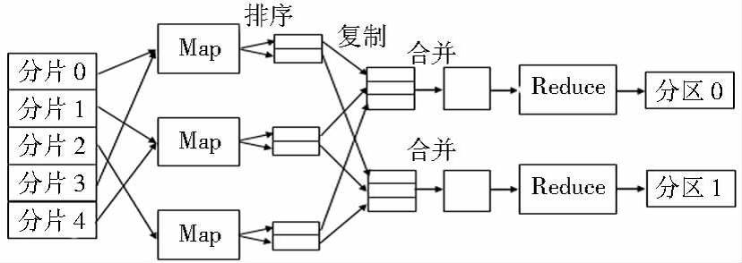
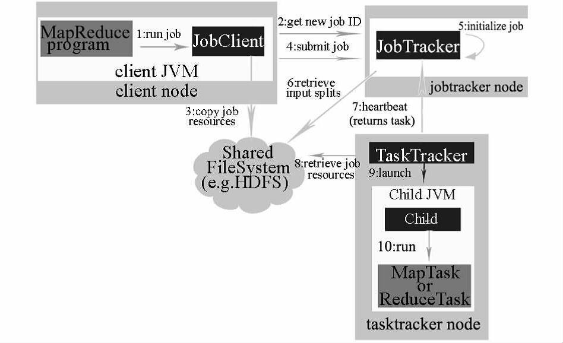
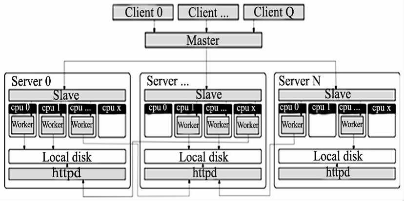
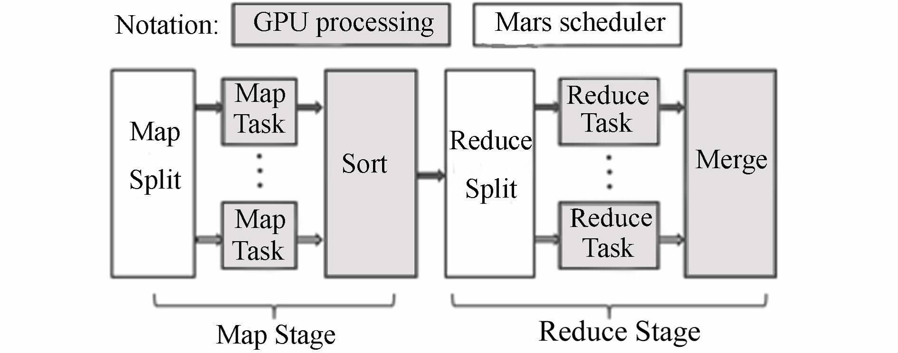
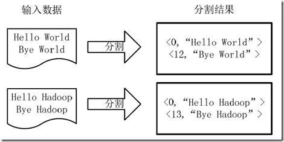
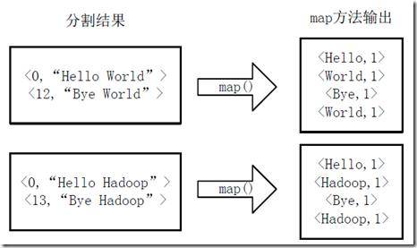
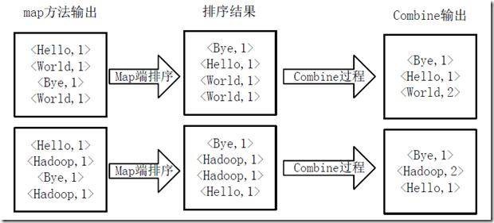
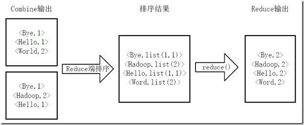
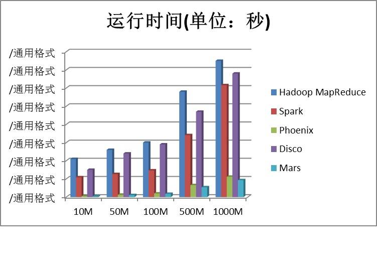
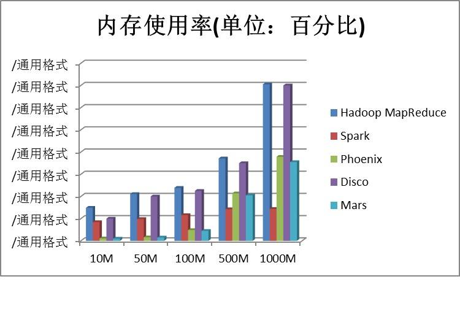

# 五种基于 MapReduce 的并行计算框架介绍及性能测试
了解 MapReduce

**标签:** 分析

[原文链接](https://developer.ibm.com/zh/articles/ba-1507-mapreducefiveframes/)

周 明耀

发布: 2015-07-16

* * *

## 并行计算模型和框架

目前开源社区有许多并行计算模型和框架可供选择，按照实现方式、运行机制、依附的产品生态圈等可以被划分为几个类型，每个类型各有优缺点，如果能够对各类型的并行计算框架都进行深入研究及适当的缺点修复，就可以为不同硬件环境下的海量数据分析需求提供不同的软件层面的解决方案。

- 并行计算框架

并行计算或称平行计算是相对于串行计算来说的。它是一种一次可执行多个指令的算法，目的是提高计算速度，以及通过扩大问题求解规模，解决大型而复杂的计算问题。所谓并行计算可分为时间上的并行和空间上的并行。时间上的并行就是指流水线技术，而空间上的并行则是指用多个处理器并发的执行计算。并行计算（Parallel Computing）是指同时使用多种计算资源解决计算问题的过程，是提高计算机系统计算速度和处理能力的一种有效手段。它的基本思想是用多个处理器来协同求解同一问题，即将被求解的问题分解成若干个部分，各部分均由一个独立的处理机来并行计算。并行计算系统既可以是专门设计的、含有多个处理器的超级计算机，也可以是以某种方式互连的若干台的独立计算机构成的集群。通过并行计算集群完成数据的处理，再将处理的结果返回给用户。

- 国内外研究

欧美发达国家对于并行计算技术的研究要远远早于我国，从最初的并行计算逐渐过渡到网格计算，随着 Internet 网络资源的迅速膨胀，因特网容纳了海量的各种类型的数据和信息。海量数据的处理对服务器 CPU、IO 的吞吐都是严峻的考验，不论是处理速度、存储空间、容错性，还是在访问速度等方面，传统的技术架构和仅靠单台计算机基于串行的方式越来越不适应当前海量数据处理的要求。国内外学者提出很多海量数据处理方法，以改善海量数据处理存在的诸多问题。

目前已有的海量数据处理方法在概念上较容易理解，然而由于数据量巨大，要在可接受的时间内完成相应的处理，只有将这些计算进行并行化处理，通过提取出处理过程中存在的可并行工作的分量，用分布式模型来实现这些并行分量的并行执行过程。随着技术的发展，单机的性能有了突飞猛进的发展变化，尤其是内存和处理器等硬件技术，但是硬件技术的发展在理论上总是有限度的，如果说硬件的发展在纵向上提高了系统的性能，那么并行技术的发展就是从横向上拓展了处理的方式。

2003 年美国 Google 公司对外发布了 MapReduce、GFS、BigData 三篇论文，至此正式将并行计算框架落地为 MapReduce 框架。

我国的并行和分布式计算技术研究起源于 60 年代末，按照国防科技大学周兴铭院士提出的观点，到目前为止已经三个阶段了。第一阶段，自 60 年代末至 70 年代末，主要从事大型机内的并行处理技术研究；第二阶段，自 70 年代末至 90 年代初，主要从事向量机和并行多处理器系统研究；第三阶段，自 80 年代末至今，主要从事 MPP(Massively Parallel Processor) 系统研究。

尽管我国在并行计算方面开展的研究和应用较早，目前也拥有很多的并行计算资源，但研究和应用的成效相对美国还存在较大的差距，有待进一步的提高和发展。

## MapReduce

MapReduce 是由谷歌推出的一个编程模型，是一个能处理和生成超大数据集的算法模型，该架构能够在大量普通配置的计算机上实现并行化处理。MapReduce 编程模型结合用户实现的 Map 和 Reduce 函数。用户自定义的 Map 函数处理一个输入的基于 key/value pair 的集合，输出中间基于 key/value pair 的集合，MapReduce 库把中间所有具有相同 key 值的 value 值集合在一起后传递给 Reduce 函数，用户自定义的 Reduce 函数合并所有具有相同 key 值的 value 值，形成一个较小 value 值的集合。一般地，一个典型的 MapReduce 程序的执行流程如图 1 所示。

##### 图 1 .MapReduce 程序执行流程图



MapReduce 执行过程主要包括：

1. 将输入的海量数据切片分给不同的机器处理；
2. 执行 Map 任务的 Worker 将输入数据解析成 key/value pair，用户定义的 Map 函数把输入的 key/value pair 转成中间形式的 key/value pair；
3. 按照 key 值对中间形式的 key/value 进行排序、聚合；
4. 把不同的 key 值和相应的 value 集分配给不同的机器，完成 Reduce 运算；
5. 输出 Reduce 结果。

任务成功完成后，MapReduce 的输出存放在 R 个输出文件中，一般情况下，这 R 个输出文件不需要合并成一个文件，而是作为另外一个 MapReduce 的输入，或者在另一个可处理多个分割文件的分布式应用中使用。

受 Google MapReduce 启发，许多研究者在不同的实验平台上实现了 MapReduce 框架，本文将对 Apache Hadoop MapReduce、Apache、Spark、斯坦福大学的 Phoenix，Nokia 研发的 Disco，以及香港科技大学的 Mars 等 5 个 MapReduce 实现框架进行逐一介绍和各方面对比。

- Hadoop MapReduce

Hadoop 的设计思路来源于 Google 的 GFS 和 MapReduce。它是一个开源软件框架，通过在集群计算机中使用简单的编程模型，可编写和运行分布式应用程序处理大规模数据。Hadoop 包含三个子项目：Hadoop Common、Hadoop Distributed File System(HDFS) 和 Hadoop MapReduce。

第一代 Hadoop MapReduce 是一个在计算机集群上分布式处理海量数据集的软件框架，包括一个 JobTracker 和一定数量的 TaskTracker。运行流程图如图 2 所示。

##### 图 2 .Hadoop MapReduce 系统架构图



在最上层有 4 个独立的实体，即客户端、JobTracker、TaskTracker 和分布式文件系统。客户端提交 MapReduce 作业；JobTracker 协调作业的运行；JobTracker 是一个 Java 应用程序，它的主类是 JobTracker；TaskTracker 运行作业划分后的任务，TaskTracker 也是一个 Java 应用程序，它的主类是 TaskTracker。Hadoop 运行 MapReduce 作业的步骤主要包括提交作业、初始化作业、分配任务、执行任务、更新进度和状态、完成作业等 6 个步骤。

- Spark MapReduce

Spark 是一个基于内存计算的开源的集群计算系统，目的是让数据分析更加快速。Spark 非常小巧玲珑，由加州伯克利大学 AMP 实验室的 Matei 为主的小团队所开发。使用的语言是 Scala，项目的核心部分的代码只有 63 个 Scala 文件，非常短小精悍。Spark 启用了内存分布数据集，除了能够提供交互式查询外，它还可以优化迭代工作负载。Spark 提供了基于内存的计算集群，在分析数据时将数据导入内存以实现快速查询，”速度比”基于磁盘的系统，如比 Hadoop 快很多。Spark 最初是为了处理迭代算法，如机器学习、图挖掘算法等，以及交互式数据挖掘算法而开发的。在这两种场景下，Spark 的运行速度可以达到 Hadoop 的几百倍。

- Disco

Disco 是由 Nokia 研究中心开发的，基于 MapReduce 的分布式数据处理框架，核心部分由 Erlang 语言开发，外部编程接口为 Python 语言。Disco 是一个开放源代码的大规模数据分析平台，支持大数据集的并行计算，能运行在不可靠的集群计算机上。Disco 可部署在集群和多核计算机上，还可部署在 Amazon EC2 上。Disco 基于主/从架构 (Master/Slave)，图 3 总体设计架构图展示了通过一台主节点 (Master) 服务器控制多台从节点 (Slave) 服务器的总体设计架构。

##### 图 3 .Disco 总体架构图



Disco 运行 MapReduce 步骤如下：

1. Disco 用户使用 Python 脚本开始 Disco 作业；
2. 作业请求通过 HTTP 发送到主机；
3. 主机是一个 Erlang 进程，通过 HTTP 接收作业请求；
4. 主机通过 SSH 启动每个节点处的从机；
5. 从机在 Worker 进程中运行 Disco 任务。

6. Phoenix


Phoenix 作为斯坦福大学 EE382a 课程的一类项目，由斯坦福大学计算机系统实验室开发。Phoenix 对 MapReduce 的实现原则和最初由 Google 实现的 MapReduce 基本相同。不同的是，它在集群中以实现共享内存系统为目的，共享内存能最小化由任务派生和数据间的通信所造成的间接成本。Phoenix 可编程多核芯片或共享内存多核处理器 (SMPs 和 ccNUMAs)，用于数据密集型任务处理。

- Mars

Mars 是香港科技大学与微软、新浪合作开发的基于 GPU 的 MapReduce 框架。目前已经包含字符串匹配、矩阵乘法、倒排索引、字词统计、网页访问排名、网页访问计数、相似性评估和 K 均值等 8 项应用，能够在 32 位与 64 位的 Linux 平台上运行。Mars 框架实现方式和基于 CPU 的 MapReduce 框架非常类似，也由 Map 和 Reduce 两个阶段组成，它的基本工作流程图如图 4 所示。

##### 图 4 .Mars 基本工作流程图



在开始每个阶段之前，Mars 初始化线程配置，包括 GPU 上线程组的数量和每个线程组中线程的数量。Mars 在 GPU 内使用大量的线程，在运行时阶段会均匀分配任务给线程，每个线程负责一个 Map 或 Reduce 任务，以小数量的 key/value 对作为输入，并通过一种无锁的方案来管理 MapReduce 框架中的并发写入。

Mars 的工作流程主要有 7 个操作步骤：

1. 在主存储器中输入 key/value 对，并将它们存储到数组；
2. 初始化运行时的配置参数；
3. 复制主存储器中的输入数组到 GPU 设备内存；
4. 启动 GPU 上的 Map 阶段，并将中间的 key/value 对存储到数组；
5. 如果 mSort 选择 F，即需要排序阶段，则对中间结果进行排序；
6. 如果 noReduce 是 F，即需要 Reduce 阶段，则启动 GPU 上的 Reduce 阶段，并输出最终结果，否则中间结果就是最终结果；
7. 复制 GPU 设备存储器中的结果到主存储器。

上述步骤的 1，2，3，7 这四个步骤的操作由调度器来完成，调度器负责准备数据输入，在 GPU 上调用 Map 和 Reduce 阶段，并将结果返回给用户。

**五种框架的优缺点比较**

##### 表 1\. 五种框架优缺点比较

Hadoop MapReduceSparkPhoenixDiscoMars编程语言Java 为主ScalaCErlangC++构建平台需要首先架构基于 Hadoop 的集群系统，通过 HDFS 完成运算的数据存储工作可以的单独运行，也可以与 Hadoop 框架完整结合独立运行，不需要提前部署集群，运行时系统的实现是建立在 PThread 之上的，也可方便地移植到其他共享内存线程库上整个 Disco 平台由分布式存储系统 DDFS 和 MapReduce 框架组成，DDFS 与计算框架高度耦合，通过监控各个节点上的磁盘使用情况进行负载均衡运行时为 Map 或 Reduce 任务初始化大量的 GPU 线程，并为每个线程自动分配少量的 key/value 对来运行任务功能特点计算能力非常强，适合超大数据集的应用程序，但是由于系统开销等原因，处理小规模数据的速度不一定比串行程序快，并且本身集群的稳定性不高在保证容错的前提下，用内存来承载工作集，内存的存取速度快于磁盘多个数量级，从而可以极大提升性能利用共享内存缓冲区实现通信，从而避免了因数据复制产生的开销，但 Phoenix 也存在不能自动执行迭代计算、没有高效的错误发现机制等不足由一个 Master 服务器和一系列 Worker 节点组成，Master 和 Worker 之间采用基于轮询的通信机制，通过 HTTP 的方式传输数据。轮询的时间间隔不好确定，若时间间隔设置不当，会显著降低程序的执行性能由于 GPU 线程不支持运行时动态调度，所以给每个 GPU 线程分配的任务是固定的，若输入数据划分布均匀，将导致 Map 或 Reduce 阶段的负载不均衡，使得整个系统性能急剧降低。同时由于 GPU 不支持运行时在设备内存中分配空间，需要预先在设备内存中分配好输入数据和输出数据的存放空间，但是 Map 和 Reduce 阶段输出数据大小是未知的，并且当多个 GPU 线程同时向共享输出区域中写数据时，易造成写冲突

## WordCount 实验

- 基本原理

单词计数 (WordCount) 是最简单也是最能体现 MapReduce 思想的程序之一，可以称为 MapReduce 版”Hello World”。单词计数主要完成功能是：统计一系列文本文件中每个单词出现的次数。

- 本次实验步骤

本次实验的硬件资源基于 x86 服务器 1 台，配置为内存 32GB DDR3、E5 CPU/12 核、GPU，实验数据样本为 10M/50M/100M/500M/1000M 的文本文件五个，我们使用 Hadoop MapReduce、Spark、Phoenix、Disco、Mars 等 MapReduce 框架分别运行文本分析程序，基于结果一致的前提下统计出运行时间、运行时 CPU 占有率、运行时内存占有率等数据，并采用这些数据绘制成柱状图。

### Hadoop MapReduce

首先需要将文件拆分成 splits，由于测试用的文件较小，所以每个文件为一个 split，并将文件按行分割形成<key,value>对，图 12 分割过程图所示。这一步由 MapReduce 框架自动完成，其中偏移量（即 key 值）包括了回车所占的字符数（Windows 和 Linux 环境会不同）。

##### 图 5 . 分割过程图



将分割好的<key,value>对交给用户定义的 map 方法进行处理，生成新的<key,value>对，图 6 执行 map 方法所示。

##### 图 6 . 执行 Map 方法过程图



得到 map 方法输出的<key,value>对后，Mapper 会将它们按照 key 值进行排序，并执行 Combine 过程，将 key 相同的 value 值累加，得到 Mapper 的最终输出结果。图 7Map 端排序及 Combine 过程所示。

##### 图 7 . Map 端排序及 Combine 过程



Reducer 先对从 Mapper 接收的数据进行排序，再交由用户自定义的 reduce 方法进行处理，得到新的<key,value>对，并作为 WordCount 的输出结果，图 15Reduce 端排序及输出结果所示。

##### 图 8 . Reduce 端排序及输出结果流程图



##### 清单 1 . 第一代 Hadoop MapReduce WordCount 示例代码

```
import java.io.IOException;
import java.util.StringTokenizer;
import org.apache.hadoop.conf.Configuration;
import org.apache.hadoop.fs.Path;
import org.apache.hadoop.io.IntWritable;
import org.apache.hadoop.io.Text;
import org.apache.hadoop.mapreduce.Job;
import org.apache.hadoop.mapreduce.Mapper;
import org.apache.hadoop.mapreduce.Reducer;
import org.apache.hadoop.mapreduce.lib.input.FileInputFormat;
import org.apache.hadoop.mapreduce.lib.output.FileOutputFormat;
import org.apache.hadoop.util.GenericOptionsParser;
public class WordCount {
public static class TokenizerMapper
extends Mapper<Object, Text, Text, IntWritable>{
private final static IntWritable one = new IntWritable(1);
private Text word = new Text();
// 开始 Map 过程
public void map(Object key, Text value, Context context)
throws IOException, InterruptedException {
StringTokenizer itr = new StringTokenizer(value.toString());
//遍历 Map 里面的字符串
while (itr.hasMoreTokens()) {
word.set(itr.nextToken());
context.write(word, one);
}
}
}
public static class IntSumReducer
extends Reducer<Text,IntWritable,Text,IntWritable> {
private IntWritable result = new IntWritable();
//开始 Reduce 过程
public void reduce(Text key, Iterable<IntWritable> values,Context context)
throws IOException, InterruptedException {
int sum = 0;
for (IntWritable val : values) {
sum += val.get();
}
result.set(sum);
context.write(key, result);
}
}
public static void main(String[] args) throws Exception {
Configuration conf = new Configuration();
String[] otherArgs = new GenericOptionsParser(conf, args).getRemainingArgs();
if (otherArgs.length != 2) {
System.err.println("Usage: wordcount <in> <out>");
System.exit(2);
}
Job job = new Job(conf, "word count");
job.setJarByClass(WordCount.class);
job.setMapperClass(TokenizerMapper.class);
job.setCombinerClass(IntSumReducer.class);
job.setReducerClass(IntSumReducer.class);
job.setOutputKeyClass(Text.class);
job.setOutputValueClass(IntWritable.class);
FileInputFormat.addInputPath(job, new Path(otherArgs[0]));
FileOutputFormat.setOutputPath(job, new Path(otherArgs[1]));
System.exit(job.waitForCompletion(true) ? 0 : 1);
}
}

```

Show moreShow more icon

### Spark WordCount 实验

Spark 与 Hadoop MapReduce 的最大区别是它把所有数据保存在内存中，Hadoop MapReduce 需要从外部存储介质里把数据读入到内存，Spark 不需要这一步骤。它的实现原理与 Hadoop MapReduce 没有太大区别，这里不再重复原理，完整的运行代码如清单 2 所示。

##### 清单 2 . Spark WordCount 示例代码

```
SparkConf sparkConf = new SparkConf().setAppName("JavaWordCount");
JavaSparkContext ctx = new JavaSparkContext(sparkConf);
JavaRDD<String> lines = ctx.textFile(args[0], Integer.parseInt(args[1]));
JavaRDD<String> words = lines.flatMap(new FlatMapFunction<String, String>() {
@Override
public Iterable<String> call(String s) {
return Arrays.asList(SPACE.split(s));
}
});
//定义 RDD ones
JavaPairRDD<String, Integer> ones = words.mapToPair(new PairFunction<String, String, Integer>() {
@Override
public Tuple2<String, Integer> call(String s) {
return new Tuple2<String, Integer>(s, 1);
}
});
//ones.reduceByKey(func, numPartitions)
JavaPairRDD<String, Integer> counts = ones.reduceByKey(new Function2<Integer, Integer, Integer>() {
@Override
public Integer call(Integer i1, Integer i2) {
return i1 + i2;
}
},10);
//输出 List
List<Tuple2<String, Integer>> output = counts.collect();
Collections.sort(output, new Comparator<Tuple2<String, Integer>>() {
@Override
public int compare(Tuple2<String, Integer> t1,
Tuple2<String, Integer> t2) {
if(t1._2 > t2._2) {
return -1;
} else if(t1._2 < t2._2) {
return 1;
}
return 0;
}
});

```

Show moreShow more icon

### Disco WordCount 实验

MapReduce 框架由于 Disco 有分布式文件系统存在，所以一般情况下都不会单独使用，都是从分布式文件系统内取数据后读入内存，然后再切分数据、进入 MapReduce 阶段。首先需要调用 ddfs 的 chunk 命令把文件上传到 DDFS，然后开始编写 MapReduce 程序，Disco 外层应用程序采用 Python 编写。Map 程序实例如清单 3 所示，Reduce 程序示例如清单 4 所示。

##### 清单 3 . Map 程序段

```
def fun_map(line, params):
for word in line.split():
yield word, 1

```

Show moreShow more icon

##### 清单 4 . Reduce 程序段

```
def fun_reduce(iter, params):
from disco.util import kvgroup
for word, counts in kvgroup(sorted(iter)):
yield word, sum(counts)

```

Show moreShow more icon

##### 清单 5 . Map/Reduce 任务

```
from disco.core import Job, result_iterator
def map(line, params):
for word in line.split():
yield word, 1
def reduce(iter, params):
from disco.util import kvgroup
for word, counts in kvgroup(sorted(iter)):
yield word, sum(counts)
if __name__ == '__main__':
job = Job().run(input=["http://discoproject.org/media/text/chekhov.txt"],
map=map,
reduce=reduce)
for word, count in result_iterator(job.wait(show=True)):
print(word, count)
Note

```

Show moreShow more icon

### Phoenix WordCount 实验

Phoenix 是基于 CPU 的 MapReduce 框架，所以它也是采用将数据分割后读入内存，然后开始 MapReduce 处理阶段这样的传统方式。Phoenix 并不由用户决定切分每个 Map 分配到的数据块的大小，它是根据集群系统的实际 Cache 大小来切分的，这样可以避免出现分配到 Map 的数据块过大或者过小的情况出现。过大的数据快会导致 Map 执行较慢，过小的数据快会导致 Map 资源浪费，因为每次启动 Map 线程都需要消耗一定的系统资源。Map 阶段切分好的文本被多个 Map 并行执行，Phoenix 支持 100 个左右的 Map 并行执行，一个工作节点下可以有若干个 Map 并行执行。只有当一个工作节点上所有的 Map 任务都结束后才开始 Reduce 阶段。Reduce 阶段继续沿用了动态任务调度机制，同时允许用户自定义数据分区规则。

##### 清单 6 . Phoenix 的 wordCount 程序段

```
#include <stdio.h>
#include <strings.h>
#include <string.h>
#include <stddef.h>
#include <stdlib.h>
#include <unistd.h>
#include <assert.h>
#include <sys/mman.h>
#include <sys/stat.h>
#include <sys/time.h>
#include <fcntl.h>
#include <ctype.h>
#include <inttypes.h>
#include "map_reduce.h"
#include "stddefines.h"
#include "sort.h"
#define DEFAULT_DISP_NUM 10
typedef struct {
int fpos;
off_t flen;
char *fdata;
int unit_size;
} wc_data_t;
enum {
IN_WORD,
NOT_IN_WORD
};
struct timeval begin, end;
#ifdef TIMING
unsigned int library_time = 0;
#endif
/** mystrcmp()
* Comparison function to compare 2 words
*/
int mystrcmp(const void *s1, const void *s2)
{
return strcmp((const char *)s1, (const char *) s2);
}
/** mykeyvalcmp()
* Comparison function to compare 2 ints
*/
int mykeyvalcmp(const void *v1, const void *v2)
{
keyval_t* kv1 = (keyval_t*)v1;
keyval_t* kv2 = (keyval_t*)v2;
intptr_t *i1 = kv1->val;
intptr_t *i2 = kv2->val;
if (i1 < i2) return 1;
else if (i1 > i2) return -1;
else {
return strcmp((char *)kv1->key, (char *)kv2->key);
//return 0;
}
}
/** wordcount_分割器 ()
* 内存里面进行 Map 计算
*/
int wordcount_splitter(void *data_in, int req_units, map_args_t *out)
{
wc_data_t * data = (wc_data_t *)data_in;
assert(data_in);
assert(out);
assert(data->flen >= 0);
assert(data->fdata);
assert(req_units);
assert(data->fpos >= 0);
// End of file reached, return FALSE for no more data
if (data->fpos >= data->flen) return 0;
// Set the start of the next data
out->data = (void *)&data->fdata[data->fpos];
// Determine the nominal length
out->length = req_units * data->unit_size;
if (data->fpos + out->length > data->flen)
out->length = data->flen - data->fpos;
// Set the length to end at a space
for (data->fpos += (long)out->length;
data->fpos < data->flen &&
data->fdata[data->fpos] != ' ' && data->fdata[data->fpos] != '\t' &&
data->fdata[data->fpos] != '\r' && data->fdata[data->fpos] != '\n';
data->fpos++, out->length++);
return 1;
}
/** wordcount_locator()
* Return the memory address where this map task would heavily access.
*/
void *wordcount_locator (map_args_t *task)
{
assert (task);
return task->data;
}
/** wordcount_map()
* 对文本进行计数
*/
void wordcount_map(map_args_t *args)
{
char *curr_start, curr_ltr;
int state = NOT_IN_WORD;
int i;
assert(args);
char *data = (char *)args->data;
assert(data);
curr_start = data;
for (i = 0; i < args->length; i++)
{
curr_ltr = toupper(data[i]);
switch (state)
{
case IN_WORD:
data[i] = curr_ltr;
if ((curr_ltr < 'A' || curr_ltr > 'Z') && curr_ltr != '\'')
{
data[i] = 0;
emit_intermediate(curr_start, (void *)1, &data[i] - curr_start + 1);
state = NOT_IN_WORD;
}
break;
default:
case NOT_IN_WORD:
if (curr_ltr >= 'A' && curr_ltr <= 'Z')
{
curr_start = &data[i];
data[i] = curr_ltr;
state = IN_WORD;
}
break;
}
}
// Add the last word
if (state == IN_WORD)
{
data[args->length] = 0;
emit_intermediate(curr_start, (void *)1, &data[i] - curr_start + 1);
}
}
/** wordcount_reduce()
* 计算字符
*/
void wordcount_reduce(void *key_in, iterator_t *itr)
{
char *key = (char *)key_in;
void *val;
intptr_t sum = 0;
assert(key);
assert(itr);
while (iter_next (itr, &val))
{
sum += (intptr_t)val;
}
emit(key, (void *)sum);
}
void *wordcount_combiner (iterator_t *itr)
{
void *val;
intptr_t sum = 0;
assert(itr);
while (iter_next (itr, &val))
{
sum += (intptr_t)val;
}
return (void *)sum;
}
int main(int argc, char *argv[])
{
final_data_t wc_vals;
int i;
int fd;
char * fdata;
int disp_num;
struct stat finfo;
char * fname, * disp_num_str;
struct timeval starttime,endtime;
get_time (&begin);
// 确保文件名
if (argv[1] == NULL)
{
printf("USAGE: %s <filename> [Top # of results to display]\n", argv[0]);
exit(1);
}
fname = argv[1];
disp_num_str = argv[2];
printf("Wordcount: Running...\n");
// 读取文件
CHECK_ERROR((fd = open(fname, O_RDONLY)) < 0);
// Get the file info (for file length)
CHECK_ERROR(fstat(fd, &finfo) < 0);
#ifndef NO_MMAP
// 内存里面开始调用 map
CHECK_ERROR((fdata = mmap(0, finfo.st_size + 1,
PROT_READ | PROT_WRITE, MAP_PRIVATE, fd, 0)) == NULL);
#else
int ret;
fdata = (char *)malloc (finfo.st_size);
CHECK_ERROR (fdata == NULL);
ret = read (fd, fdata, finfo.st_size);
CHECK_ERROR (ret != finfo.st_size);
#endif
CHECK_ERROR((disp_num = (disp_num_str == NULL) ?
DEFAULT_DISP_NUM : atoi(disp_num_str)) <= 0);
wc_data_t wc_data;
wc_data.unit_size = 5; // approx 5 bytes per word
wc_data.fpos = 0;
wc_data.flen = finfo.st_size;
wc_data.fdata = fdata;
CHECK_ERROR (map_reduce_init ());
map_reduce_args_t map_reduce_args;
memset(&map_reduce_args, 0, sizeof(map_reduce_args_t));
map_reduce_args.task_data = &wc_data;
map_reduce_args.map = wordcount_map;
map_reduce_args.reduce = wordcount_reduce;
map_reduce_args.combiner = wordcount_combiner;
map_reduce_args.splitter = wordcount_splitter;
map_reduce_args.locator = wordcount_locator;
map_reduce_args.key_cmp = mystrcmp;
map_reduce_args.unit_size = wc_data.unit_size;
map_reduce_args.partition = NULL; // use default
map_reduce_args.result = &wc_vals;
map_reduce_args.data_size = finfo.st_size;
map_reduce_args.L1_cache_size = atoi(GETENV("MR_L1CACHESIZE"));//1024 * 1024 * 2;
map_reduce_args.num_map_threads = atoi(GETENV("MR_NUMTHREADS"));//8;
map_reduce_args.num_reduce_threads = atoi(GETENV("MR_NUMTHREADS"));//16;
map_reduce_args.num_merge_threads = atoi(GETENV("MR_NUMTHREADS"));//8;
map_reduce_args.num_procs = atoi(GETENV("MR_NUMPROCS"));//16;
map_reduce_args.key_match_factor = (float)atof(GETENV("MR_KEYMATCHFACTOR"));//2;
printf("Wordcount: Calling MapReduce Scheduler Wordcount\n");
gettimeofday(&starttime,0);
get_time (&end);
#ifdef TIMING
fprintf (stderr, "initialize: %u\n", time_diff (&end, &begin));
#endif
get_time (&begin);
CHECK_ERROR(map_reduce (&map_reduce_args) < 0);
get_time (&end);
#ifdef TIMING
library_time += time_diff (&end, &begin);
#endif
get_time (&begin);
gettimeofday(&endtime,0);
printf("Wordcount: Completed %ld\n",(endtime.tv_sec - starttime.tv_sec));
printf("Wordcount: MapReduce Completed\n");
printf("Wordcount: Calling MapReduce Scheduler Sort\n");
mapreduce_sort(wc_vals.data, wc_vals.length, sizeof(keyval_t), mykeyvalcmp);
CHECK_ERROR (map_reduce_finalize ());
printf("Wordcount: MapReduce Completed\n");
dprintf("\nWordcount: Results (TOP %d):\n", disp_num);
for (i = 0; i < disp_num && i < wc_vals.length; i++)
{
keyval_t * curr = &((keyval_t *)wc_vals.data)[i];
dprintf("%15s - %" PRIdPTR "\n", (char *)curr->key, (intptr_t)curr->val);
}
free(wc_vals.data);
#ifndef NO_MMAP
CHECK_ERROR(munmap(fdata, finfo.st_size + 1) < 0);
#else
free (fdata);
#endif
CHECK_ERROR(close(fd) < 0);
get_time (&end);
#ifdef TIMING
fprintf (stderr, "finalize: %u\n", time_diff (&end, &begin));
#endif
return 0;
}

```

Show moreShow more icon

### Mars MapReduce

Mars 框架中，Map 和 Reduce 的处理阶段都在 GPU 内进行，Map 和 Reduce 的分割数据阶段都在 CPU 内进行，这是与其他基于 CPU 的 MapReduce 框架的最大不同。Mars 更多的是利用 CPU、GPU 缓存来替代内存，执行数据分割、处理过程。

具体的 Word count 的流程如下所示：

1. 准备 key/value 键值对，将这些键值对存储在数组里面；
2. 初始化 MapReduce 上下文，设置参数 (根据不同的 GPU 需要根据 CUDA 核心数目设置并发线程数)；
3. 数据预处理，首先打开文件，将文件所有内容读入内存，然后申请一块同文件大小的显存，将文件内容中小写字符转为大写 (这样的影响 word,Word 算通一个单词)。
4. 开始 MapReduce 阶段。根据并发线程数和文件大写切换内存中的文件，每块切分后的任务记录下该任务在内存中的偏移位置和长度视为 value, 显存的指针地址视为 key，将任务添加的任务池。将处理后的内存内容复制到刚刚申请的显存中。接着开始 Map 流程，将内存中的任务池复制到显存，申请显存块用于存放 Map 产生的数据，开启多线程并发执行用户定义的 map 流程 MAP\_COUNT\_FUNC，这个是 Mars 由于 GPU 程序的特殊性而设计的，用于记录 map 产生的 key 和 value 的长度 (sizeof)。调用 MAP\_FUNC 方法，输入任务记录，输出单词以及单词所在的位置；
5. 如果 noSort 是 F，对结果排序；
6. 如果 noReduce 是 F，GPU 开始 reduce 阶段，生成最终的结果集。否则，立即输出最后的结果集；
7. 结果输出，从 GPU 设备拷贝最终的结果集到内存，然后输出到屏幕。

通过上述的 7 个步骤，WordCount 的计算过程全部完成并且输出结果集。

##### 清单 7 . Mars 的 Map 程序段

```
#ifndef __MAP_CU__
#define __MAP_CU__
#include "MarsInc.h"
#include "global.h"
__device__ int hash_func(char* str, int len)
{
int hash, i;
for (i = 0, hash=len; i < len; i++)
hash = (hash<<4)^(hash>>28)^str[i];
return hash;
}
__device__ void MAP_COUNT_FUNC//(void *key, void *val, size_t keySize, size_t valSize)
{
WC_KEY_T* pKey = (WC_KEY_T*)key;
WC_VAL_T* pVal = (WC_VAL_T*)val;
char* ptrBuf = pKey->file + pVal->line_offset;
int line_size = pVal->line_size;
char* p = ptrBuf;
int lsize = 0;
int wsize = 0;
char* start = ptrBuf;
while(1)
{
for (; *p >= 'A' && *p <= 'Z'; p++, lsize++);
*p = '\0';
++p;
++lsize;
wsize = (int)(p - start);
if (wsize > 6)
{
//printf("%s, wsize:%d\n", start, wsize);
EMIT_INTER_COUNT_FUNC(wsize, sizeof(int));
}
for (; (lsize < line_size) && (*p < 'A' || *p > 'Z'); p++, lsize++);
if (lsize >= line_size) break;
start = p;
}
}
__device__ void MAP_FUNC//(void *key, void val, size_t keySize, size_t valSize)
{
WC_KEY_T* pKey = (WC_KEY_T*)key;
WC_VAL_T* pVal = (WC_VAL_T*)val;
char* filebuf = pKey->file;
char* ptrBuf = filebuf + pVal->line_offset;
int line_size = pVal->line_size;
char* p = ptrBuf;
char* start = ptrBuf;
int lsize = 0;
int wsize = 0;
while(1)
{
for (; *p >= 'A' && *p <= 'Z'; p++, lsize++);
*p = '\0';
++p;
++lsize;
wsize = (int)(p - start);
int* o_val = (int*)GET_OUTPUT_BUF(0);
*o_val = wsize;
if (wsize > 6)
{
//printf("%s, %d\n", start, wsize);
EMIT_INTERMEDIATE_FUNC(start, o_val, wsize, sizeof(int));
}
for (; (lsize < line_size) && (*p < 'A' || *p > 'Z'); p++, lsize++);
if (lsize >= line_size) break;
start = p;
}
}
#endif //__MAP_CU__

```

Show moreShow more icon

##### 清单 8 . Mars 的 Reduce 程序段

```
#ifndef __REDUCE_CU__
#define __REDUCE_CU__
#include "MarsInc.h"
__device__ void REDUCE_COUNT_FUNC//(void* key, void* vals, size_t keySize, size_t valCount)
{
}
__device__ void REDUCE_FUNC//(void* key, void* vals, size_t keySize, size_t valCount)
{
}
#endif //__REDUCE_CU__

```

Show moreShow more icon

## 五种框架 WordCount 实验性能对比

##### 图 9 . 实验运行时间比较图



图 9 实验运行时间比较图是分析不同大小的文本文件所消耗的时间对比图。从上图可以看出，Hadoop MapReduce 的运行时间最长，原因是 Hadoop 生态环境包含内容过多，所以每次任务启动时首先需要加载所需资源包，然后缓慢地发起任务，并且由于本身是用性能较差的 Java 语言编写的，所以导致整体计算时间长、性能差。Phoenix 由于采用汇编和 C 语言编写，内核很小，运行时所用资源很少，所以整个测试过程耗时也较少。Spark 框架在 WordCount 实验中消耗的时长较 Disco 稍少，但是比 Phoenix、Mars 耗时太多。耗时最短的两个框架是 Mars 和 Phoenix。需要时长从高到低分别是 Hadoop MapReduce、Disco、Spark、Phoenix、Mars。

##### 图 10 .CPU 使用率对比图


图 10-CPU 使用率比较图是分析任务执行过程当中 CPU 使用率情况图。从上图可以看出，Hadoop MapReduce、Disco 这两个框架需要占用的 CPU 资源在 1000M 文本处理时基本到达最大饱和度 (大于 90%)，Apache Spark 的 CPU 使用率没有完全伴随着文本文件增大而大幅上涨，Phoenix 和 Mars 基本控制在对 CPU 使用率较低的范围内。

##### 图 11 . 内存使用率对比图



图 11 内存使用率比较图是分析任务执行过程中内存使用情况对比。从图中可以看出，Mars 和 Phoenix 这两款框架所使用的内存在文本数据较小时是最少的，随着文本数据的增大，Apache Spark 随着数据量增大而内存大幅增加，Mars 和 Phoenix 有一定幅度的内存使用增加趋势。当数据量达到本次测试最大的 1000M 文本时，Spark 框架对内存的消耗是最小的，Hadoop MapReduce 和 Disco 需要占用较多的内存。

从上面的测试结果我们得出，如果用户只需要处理海量的文本文件，不需要考虑存储、二次数据挖掘等，采用 Phoenix 或者 Mars 是最大性价比的选择，但是由于 Mars 必须在 GPU 上运行，本身 GPU 由于价格因素，导致不太可能在实际应用场景里推广，所以综合来看 Phoenix 是性价比最高的框架。如果应用程序需要处理的数据量非常大，并且客户希望计算出的数据可以被存储和二次计算或数据挖掘，那 Hadoop MapReduce 较好，因为整个 Hadoop 生态圈庞大，支持性很好。Apache Spark 由于架构层面设计不同，所以对于 CPU、内存的使用率一直保持较低状态，它未来可以用于海量数据分析用途。

## 结束语

现实世界很多实例都可用 MapReduce 编程模型来表示，MapReduce 作为一个通用可扩展的、高容错性的并行处理模型，可有效地处理海量数据，不断地从中分析挖掘出有价值的信息。MapReduce 封装了并行处理、负载均衡、容错、数据本地化等技术难点细节。通过本文测试用例可以证明 MapReduce 适用于海量文本分析的应用场景，可以为处理大数据提供技术支撑。