# 人工智能、机器学习和认知计算入门指南
探索 AI 及其子领域的一些重要方面

**标签:** 人工智能,数据科学,机器学习,深度学习

[原文链接](https://developer.ibm.com/zh/articles/cc-beginner-guide-machine-learning-ai-cognitive/)

M. Tim Jones

发布: 2017-07-11

* * *

几千年来，人们就已经有了思考如何构建智能机器的想法。从那时开始，人工智能 (AI) 经历了起起落落，这证明了它的成功以及还未实现的潜能。如今，随时都能听到应用机器学习算法来解决新问题的新闻。从癌症检测和预测到图像理解和总结以及自然语言处理，AI 正在增强人们的能力和改变我们的世界。

现代 AI 的历史包含一部伟大的戏剧应具有的所有要素。上世纪 50 年代，随着对思维机器及阿兰·图灵和约翰·冯·诺依曼等著名人物的关注，AI 开始崭露头角。尽管随后经历了数十年的繁荣与萧条，并被寄予了难以实现的厚望，但 AI 和它的先驱们仍然一直在努力前行。如今，AI 展现出了它的真正潜力，专注于应用并提供深度学习和认知计算等技术。

本文将探索 AI 的一些重要方面和它的子领域。我们首先会分析 AI 的时间线，然后深入介绍每种要素。

## 现代 AI 的时间线

从上世纪 50 年代开始，现代 AI 开始专注于所谓的强 AI，强 AI 指的是能普遍执行人类所能执行的任何智能任务的 AI。强 AI 的进展乏力，最终导致了所谓的弱 AI，或者将 AI 技术应用于更小范围的问题。直到上世纪 80 年代，AI 研究被拆分为这两种范式。但在 1980 年左右，机器学习成为了一个突出的研究领域，它的目标是让计算机能学习并构建模型，以便能够执行一些活动，比如特定领域中的预测。

##### 现代人工智能的时间线

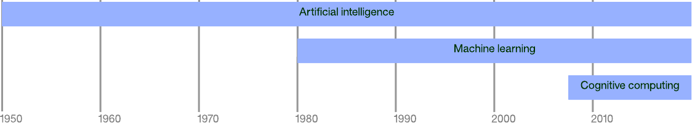

深度学习于 2000 年左右出现，建立在 AI 和机器学习的研究成果之上。计算机科学家通过新的拓扑结构和学习方法，在许多层中使用神经网络。神经网络的这次演变成功解决了各种不同领域的复杂问题。

在过去 10 年中，认知计算兴起，它的目标是构建能学习并自然地与人交流的系统。IBM Watson 通过在 _Jeopardy_ 比赛上成功击败世界级对手，证明了认知计算的能力。

在本教程中，我将探索每个领域，解释一些促使认知计算取得成功的重要算法。

## 基础 AI

1950 年前的研究中提出了大脑由电脉冲网络组成的理念，这些脉冲触发并以某种方式精心组织形成思想和意识。阿兰·图灵表明任何计算都能以数字方式实现，那时，距离实现构建一台能模仿人脑的机器的想法也就不远了。

许多早期研究都重点关注过这个强 AI 方面，但这一时期也引入了一些基础概念，如今的所有机器学习和深度学习都是在这些概念基础上建立起来的。

##### 1980 年前的人工智能方法的时间线

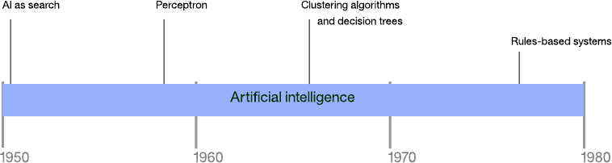

### AI 即搜索

AI 中的许多问题都可以通过暴力搜索（比如深度或广度优先搜索）来解决。但是，考虑到普通问题的搜索空间，基本搜索很快就会招架不住。AI 即搜索的最早示例之一是一个下棋程序的开发。Arthur Samuel 在 IBM 701 Electronic Data Processing Machine 上构建了第一个这样的程序，对搜索树执行一种名为 _α-β 剪枝技术（alpha-beta pruning）_ 的优化。他的程序还会记录特定某步棋的回报，允许应用程序学习每一场比赛（使它成为了第一个自主学习的程序）。为了提高程序的学习速度，Samuel 将它设计为能够自己跟自己下棋，提高了它的下棋和学习能力。

尽管可以成功地应用对许多简单问题的搜索，但随着选择数量的增加，该方法很快就会行不通。以简单的井字棋游戏为例。在游戏开始时，有 9 种可能的棋着。每步棋着会导致 8 种可能的对抗棋着，以此类推。井字棋完整的棋着树（未进行旋转优化来删除重复棋着）有 362,880 个节点。如果您将同样的思维试验推广到象棋或围棋，很快就会看到搜索的缺点。

### 感知器

感知器是一种用于单层神经网络的早期的监督式学习算法。给定一个输入特征矢量，感知器算法就能学习将输入划分到特定类别。通过使用训练集，可以更新线性分类的网络的权值和阀值。感知器最初是针对 IBM 704 实现的，随后被用在定制硬件上，用于图像识别。

##### 感知器和线性分类

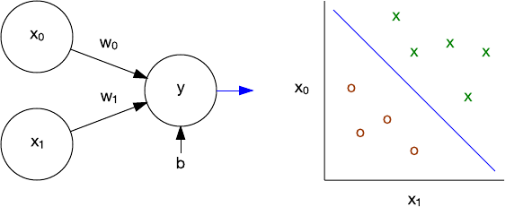

作为线性分类器，感知器能线性地分离问题。感知器的局限性的重要示例是，它无法学习一个异 `或` (`XOR`) 函数。多层感知器解决了这一问题，为更复杂的算法、网络拓扑结构和深度学习铺平了道路。

### 集群算法

对于感知器，学习方法是监督式的。用户提供数据来训练网络，然后针对新数据来测试网络。集群算法采用了一种不同的学习方法，叫做无监督学习。在此模型中，算法基于数据的一个或多个属性，将一组特征矢量组织到集群中。

##### 二维特征空间中的集群

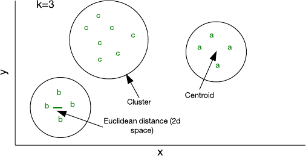

可通过少量代码实现的最简单的算法之一称为 k 均值。在此算法中， _k_ 表示您可向其中分配样本的集群数量。您可以使用一个随机特征矢量初始化一个集群，然后将其他所有样本添加到离它们最近的集群（前提是每个样本表示一个特征矢量，而且使用了一种欧几里德距离来标识 “距离”）。随着您将样本添加到集群中，它的质心 — 即集群的中心 — 会被重新计算。然后该算法会再次检查样本，确保它们存在于最近的集群中，并在没有样本改变集群成员关系时停止运行。

尽管 k 均值的效率相对较高，但您必须提前指定 _k_。根据所用的数据，其他方法可能更高效，比如分层或基于分布的集群方法 。

### 决策树

与集群紧密相关的是决策树。决策树是一种预测模型，对可得出某个结论的观察值进行预测。树上的树叶代表结论，而节点是观察值分叉时所在的决策点。决策树是利用决策树学习算法来构建的，它们根据属性值测试将数据集拆分为子集（通过一个称为递归分区的流程）。

考虑下图中的示例。在这个数据集中，我可以根据 3 个因素来观察某个人何时的生产力较高。使用决策树学习算法时，我可以使用一个指标来识别属性（比如信息增益）。在这个示例中，情绪是生产力的主要因素，所以我依据 “good mood” 是 Yes 还是 No 来拆分数据集。No 分支很简单：它始终导致生产力低下。但是，Yes 分支需要根据其他两个属性来再次拆分数据集。我给数据集涂上颜色，以演示何处的观察值通向我的叶节点。

##### 一个简单的数据集和得到的决策树

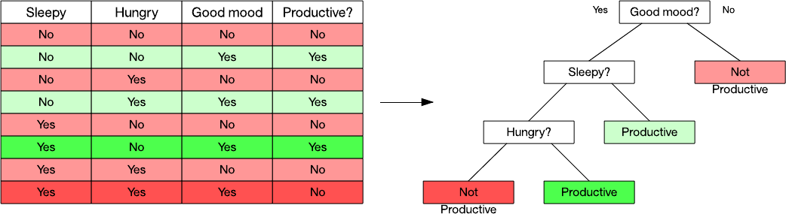

决策树的一个有用方面是它们的内在组织，您能轻松且图形化地解释您是如何分类一个数据项的。流行的决策树学习算法包括 C4.5 和分类回归树。

### 基于规则的系统

第一个根据规则和推断来构建的系统称为 Dendral，是 1965 年开发出来的，但直到上世纪 70 年代，这些所谓的 “专家系统” 才得到大力发展。基于规则的系统可以存储知识和规则，并使用一个推理系统来得出结论。

基于规则的系统通常包含一个规则集、一个知识库、一个推理引擎（使用前向或后向规则链），以及一个用户界面。在下图中，我使用一段信息（”苏格拉底是一个凡人”）、一条规则（”凡人终有一死”）和一次关于谁会死的交互。

##### 一个基于规则的系统

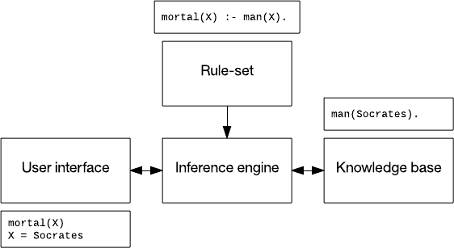

基于规则的系统已应用于语音识别，规划和控制，以及疾病识别。上世纪 90 年代开发的一个监视和诊断坝体稳定性的系统 Kaleidos 至今仍在运营。

## 机器学习

机器学习是 AI 和计算机科学的一个子领域，起源于统计学和数学优化。机器学习涵盖应用于预测、分析和数据挖掘的监督式和非监督式学习技术。它并不仅限于深度学习，在本节中，我将探讨一些实现这种效率奇高的方法的算法。

##### 机器学习方法的时间线

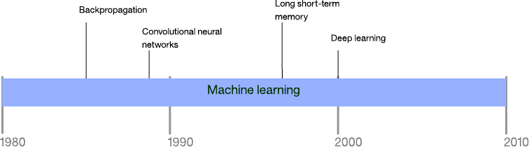

### 反向传播算法（Backpropagation）

神经网络的真正威力在于它们的多层变形。训练单层感知器很简单，但得到的网络不是很强大。那么问题就变成了如何训练有多个层的网络？这时就会用到反向传播算法。

反向传播是一种训练有许多层的神经网络的算法。它分两个阶段执行。第一阶段是通过一个神经网络将输入传播到最后一层（称为前馈）。在第二阶段，算法计算一个错误，然后将此错误从最后一层反向传播（调节权值）到第一层。

##### 反向传播简图

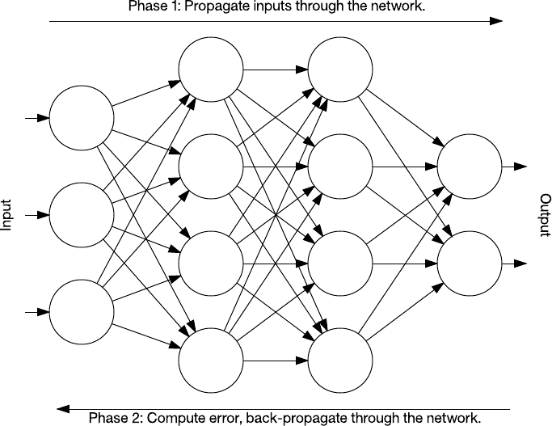

在训练期间，网络的中间层自行进行组织，以便将输入空间的各部分映射到输出空间。通过监督式学习，反向传播识别输入-输出映射中的错误，然后相应地（以一定的学习速率）调整权值来更正此错误。反向传播一直是神经网络学习的一个重要方面。随着计算资源消耗得更快和变得更廉价，反向传播会继续被应用于更大更密集的网络。

### 卷积神经网络（Convolutional neural networks）

卷积神经网络 (CNN) 是受动物视觉皮质启发的多层神经网络。该架构在各种应用中都很有用，包括图像处理。第一个 CNN 是 Yann LeCun 创建的，当时，该架构专注于手写字符识别任务，比如读取邮政编码。

LeNet CNN 架构包含多层，这些层实现了特征提取，然后实现了分类。图像被分成多个接受区，注入可从输入图像中提取特征的卷积层。下一步是池化，它可以（通过下采样）降低提取特征的维度，同时（通常通过最大池化）保留最重要的信息。然后该算法执行另一个卷积和池化步骤，注入一个完全连通的多层感知器。此网络的最终输出层是一组节点，这些节点标识了图像的特征（在本例中，每个节点对应一个识别出的数字）。用户可以通过反向传播训练该网络。

##### LeNet 卷积神经网络架构

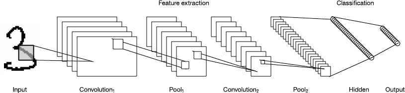

深层处理、卷积、池化和一个完全连通的分类层的使用，为神经网络的各种新应用开启了一扇门。除了图像处理之外，CNN 还被成功应用到许多视频识别和自然语言处理的任务中。CNN 也已在 GPU 中获得高效实现，显著提高了它们的性能。

### 长短期记忆

回想一下，在反向传播的讨论中曾提到过，该网络是用前馈方式进行训练的。在这个架构中，用户将输入注入网络中，通过隐藏层将它们前向传播到输出层。但是，还有许多其他神经网络拓扑结构。此处分析的拓扑结构允许在节点之间建立连接，以便形成一个定向循环。这些网络被称为递归神经网络，它们能反向馈送到前几层或它们的层中的后续节点。该属性使这些网络成为处理时序数据的理想选择。

1997 年，人们创建了一种名为长短期记忆 (LSTM) 的特殊回归网络。LSTM 由记忆细胞组成，网络中的这些细胞会短期或长期记住一些值。

##### 长短期记忆网络和记忆细胞

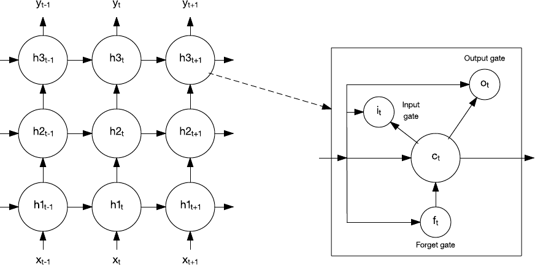

记忆细胞包含控制信息如何流进或流出细胞的闸门。输入门控制新信息何时能流入记忆中。遗忘门控制一段现有信息保留的时长。最后，输出门控制细胞中包含的信息何时用在来自该细胞的输出中。记忆细胞还包含控制每个门的权值。训练算法通常沿时间反向传播（反向传播的一种变体），可以根据得到的错误来优化这些权值。

LSTM 已被应用于语音识别、手写体识别、文本到语音合成、图像字幕和其他各种任务。我很快会再介绍 LSTM。

### 深度学习

深度学习是一组相对较新的方法，它们正从根本上改变机器学习。深度学习本身不是一种算法，而是一系列通过无监督学习来实现深度网络的算法。这些网络非常深，以至于（除了计算节点集群外）需要采用新计算方法（比如 GPU）来构建它们。

本文目前为止探讨了两种深度学习算法：CNNs 和 LSTMs。这些算法的组合已用于实现多种非常智能的任务。如下图所示，CNN 和 LSTM 已用于识别，以及使用自然语言描述照片或视频。

##### 组合使用卷积神经网络和长短期记忆网络来描述图片

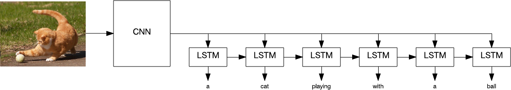

深度学习算法也应用于面部识别，能以 96% 的准确度识别肺结核，自动驾驶汽车，以及其他许多复杂的问题。

但是，尽管应用深度学习算法取得了这些成果，但是仍有一些亟待我们解决的问题。最近，深度学习在皮肤癌检测上的应用发现，该算法比获得职业认证的皮肤科医生更准确。但是，皮肤科医生能列举促使他们得出诊断结果的因素，而深度学习程序无法识别其在分类时使用了哪些因素。这就是所谓的深度学习黑盒问题。

另一种应用称为 Deep Patient，能根据患者的医疗记录成功地预测疾病。事实证明，该应用预测疾病的能力比医生好得多 — 甚至是众所周知难以预测的精神分裂症。所以，尽管这些模型很有效，但没有人能真正弄清楚庞大的神经网络行之有效的原因。

## 认知计算

AI 和机器学习都有许多生物灵感方面的示例。早期 AI 专注于构建模仿人脑的机器的宏伟目标，而认知计算也致力于实现此目标。

认知计算是根据神经网络和深度学习来构建的，正在应用来自认知科学的知识来构建模拟人类思维过程的系统。但是，认知计算没有专注于单组技术，而是涵盖多个学科，包括机器学习、自然语言处理、视觉和人机交互。

IBM Watson 就是认知计算的一个示例，在 _Jeopardy_ 上，IBM Watson 证实了它最先进的问答交互能力，但自那时起，IBM 已通过一系列 [Web 服务](https://cloud.ibm.com/catalog?category=ai&cm_sp=ibmdev-_-developer-articles-_-cloudreg) 扩展了该能力。这些服务公开的应用编程接口可用于视觉识别、语音到文本和文本到语音转换功能，语言理解和翻译，以及对话引擎，以构建强大的虚拟代理。

## 结束语

本文仅介绍了 AI 发展史以及最新的神经网络和深度学习方法的一小部分。尽管 AI 和机器学习的发展跌宕起伏，但深度学习和认知计算等新方法仍大大提高了这些学科的标准。有意识的机器可能仍无法实现，但帮助改善人类生活的系统目前已存在。

有关使用深度学习为开发认知 IoT 解决方案检测异常的更多信息，请参阅 [深度学习和长短期记忆网络简介](https://www.ibm.com/developerworks/library/iot-deep-learning-anomaly-detection-1/)。

本文翻译自： [A beginner’s guide to artificial intelligence, machine learning, and cognitive computing](https://developer.ibm.com/articles/cc-beginner-guide-machine-learning-ai-cognitive/)（2017-06-01）