# 人工智能在邮件领域的应用
基于 IBM 人工智能平台，介绍“语音识别”和“自然语言理解”服务

**标签:** 人工智能

[原文链接](https://developer.ibm.com/zh/articles/cl-lo-application-of-artificial-intelligence-in-mail/)

陈 乒

发布: 2019-03-13

* * *

## 前言

人工智能是目前火得不能再火的话题。无论什么系统，与 AI 扯上关系就是”最先进的”生产力。笔者主要从事协作领域的工作，协作领域有很多 AI 的应用场景，例如智能会议系统可以自动做会议纪要（不只是语音识别哦）。在本文中，笔者考虑把 AI 集成到邮件系统中，做一个智能的语音邮件查询功能。主要应用场景是在用户不方便输入文字时，对邮件进行快速查询。

**免费试用 IBM Cloud**

利用 [IBM Cloud Lite](https://cocl.us/IBM_CLOUD_GCG) 快速轻松地构建您的下一个应用程序。您的免费帐户从不过期，而且您会获得 256 MB 的 Cloud Foundry 运行时内存和包含 Kubernetes 集群的 2 GB 存储空间。 [了解所有细节](https://developer.ibm.com/dwblog/2017/building-with-ibm-watson/) 并确定如何开始。

要实现语音查询，我们需做到以下几点：

- 语音录音与上传。笔者利用 H5 的语音能力进行录音和语音上传。
- 语音识别。无论是小冰、智能音箱还是 IBM 的辩论机器人，都是以语音交互的。
- 自然语言理解。光有语音识别是不够的，人类的语言随意性很强，当用户换一种说法的时候，AI 也应该理解用户表达的意思。自然语言理解的难度其实挺大的，这个服务的能力强不强，直接影响系统对人类思想的理解。各 AI 平台对本服务的处理方法，以及能力差别还挺大的。
- 邮件查询与展现。这些是比较基本的能力。笔者用到的是 Domino 服务器的邮件和 REST 服务

整体流程图：

##### 图 1\. 整体流程图

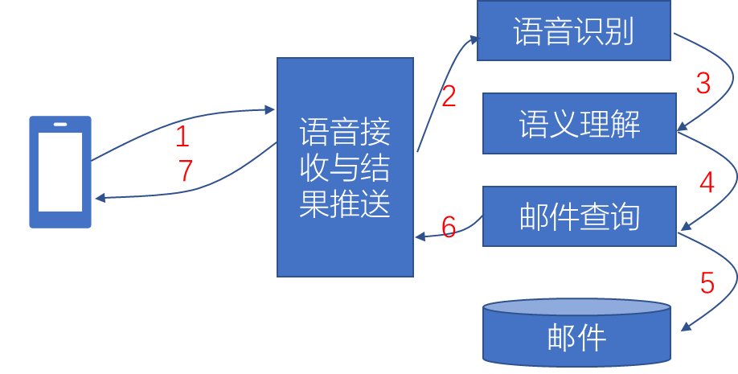

Domino V10 现已支持 NodeJS 开发，笔者开发本系统也采用了 NodeJS。

## 语音录音与上传

为了方便将这个系统集成到其它 APP 中，笔者使用的是 H5 的多媒体处理能力。

这似乎应该很简单，毕竟太多的移动应用使用了语音。但是当笔者真的想去找个现成的 NodeJS 例子时，还真花了点时间。最后还是 GitHub 比较给力。请参考 [https://github.com/muaz-khan/RecordRTC/blob/master/RecordRTC-to-Nodejs/server.js](https://github.com/muaz-khan/RecordRTC/blob/master/RecordRTC-to-Nodejs/server.js) ，拿它做起点，可以节省不少时间。这个例子支持 Windows 和 Linux。但是这个例子是视频上传，我们需要把其中视频的部分改成音频。

例如：视频控件 `<video></video>` 应该改成音频控件 `<audio></audio>`。还有：

##### 清单 1\. 修改文件

```
var fileName = generateRandomString() + '.wav';
var file = new File([blob], fileName, {
                type: 'audio/wav'
                });

录音参数要根据语音识别平台的要求，通常需要单声道，16000 采样率：
captureUserMedia(function(stream) {
mediaStream = stream;
    recorder = RecordRTC(stream, {
                      recorderType: StereoAudioRecorder,
                      mimeType: 'audio/wav',
                      desiredSampRate: 16000,
                      numberOfAudioChannels: 1
                    });

```

Show moreShow more icon

利用这个修改后的样例，用户可以利用浏览器录音并上传，在服务器端生成 wav 文件。

### 语音识别

语音识别相对比较简单，可以使用 IBM 的 “Speech to Text” 语音识别服务。

首先，需要注册一个 IBM ID，在 [IBM Cloud 站点](https://cloud.ibm.com/registration?cm_sp=ibmdev-_-developer-articles-_-cloudreg) 即可免费使用 IBM Cloud 服务。

在 IBM Cloud 服务中，找到 AI 类别下的 “ [Speech to Text](https://cloud.ibm.com/docs/services/speech-to-text?topic=speech-to-text-gettingStarted#gettingStarted)” 服务，很快就能建立一个语音识别的服务。

##### 图 2\. 语音转换服务

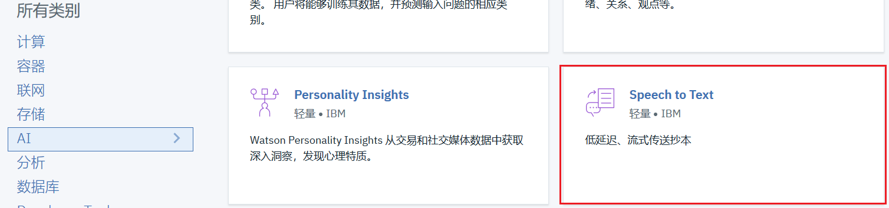

Watson 的语音识别服务提供了 Node.JS 的 API。安装 watson-developer-cloud 包，可以让我们方便地使用 Node.JS 编程：

```
npm install --save watson-developer-cloud

```

Show moreShow more icon

详细信息请参考 [文档](https://cloud.ibm.com/apidocs/speech-to-text#data-handling) ，样例如下：

##### 清单 2\. 调用语音转换服务

```
var params = {
objectMode: true,
content_type: 'audio/wav',
model: 'en-US_BroadbandModel',
keywords: ['mail'],
keywords_threshold: 0.5,
max_alternatives: 3
};

// Create the stream.
var recognizeStream = speechToText.recognizeUsingWebSocket(params);

......

```

Show moreShow more icon

将我们上传的录音发送到 watson 服务即可获得识别文本:

```
// Pipe in the audio.
fs.createReadStream(fileName).pipe(recognizeStream);

```

Show moreShow more icon

## 自然语言理解

自然语言理解是本文的重点。IBM 大名鼎鼎的”沃森”可以参加辩论赛，自然语言理解的能力应该相当了得。

### 自然语言理解服务

登录到 IBM Cloud 的控制台，先在 AI 服务类别找到 “Natural Language Understanding”，以下简称（NLU）。

##### 图 3\. 自然语言理解服务

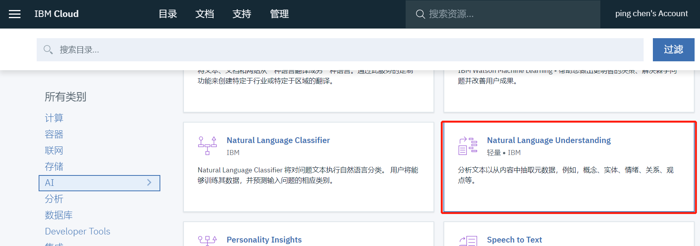

进入 NLU 服务以后，就可以新建服务了。为了利于理解，给自己的服务起一个合适的名字吧。笔者的名字为：Natural Language Understanding-MailQuery。

##### 图 4\. 创建服务

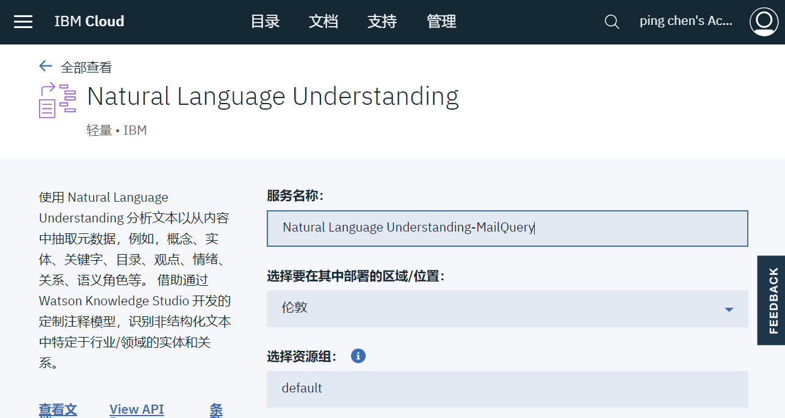

在下方的”价格套餐”中，缺省选中的是免费套餐。注意，最后的黑体字说：”轻量套餐服务处于不活动状态达到 30 天后将被删除。” 为了防止被删，时不时还得用着点。吐个槽，30 天的时间短了点。

##### 图 5\. 套餐选择

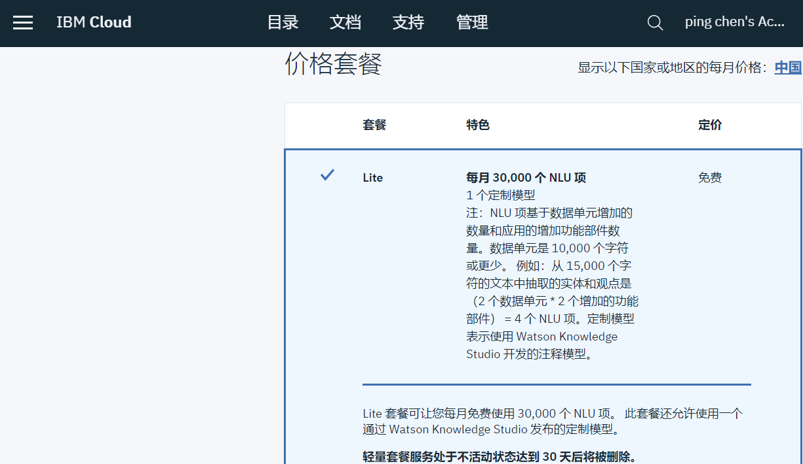

最后点下方 “创建” 按钮。

创建以后，您看到的不是一个服务，而是一个”入门”文档。

##### 图 6\. 入门文档

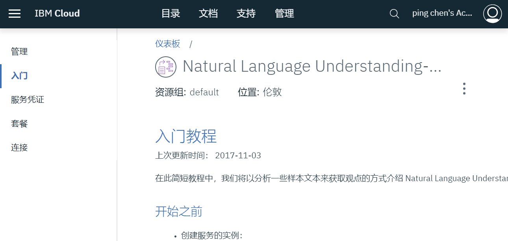

入门文档中的步骤其实我们都做过了，不要被绕晕了，直接点”入门”上方的”管理”链接。

管理页面中，首先您可以看到访问本服务的”凭证”和 URL：

##### 图 7\. 凭证和 URL

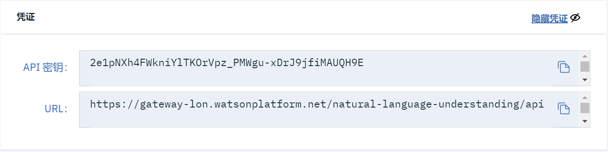

使用 curl 调用服务的代码也帮您写好了，代码中的凭证是根据当前服务客户化好的，这一点值得表扬。

##### 图 8\. Curl 代码

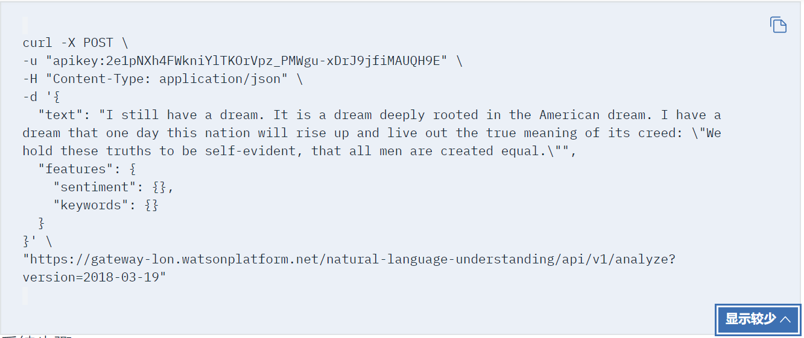

笔者习惯用 Firefox 的 RESTClient，所以顺便也介绍下怎么用 RESTClient 调用服务。调用界面如下：

##### 图 9\. RESTClient

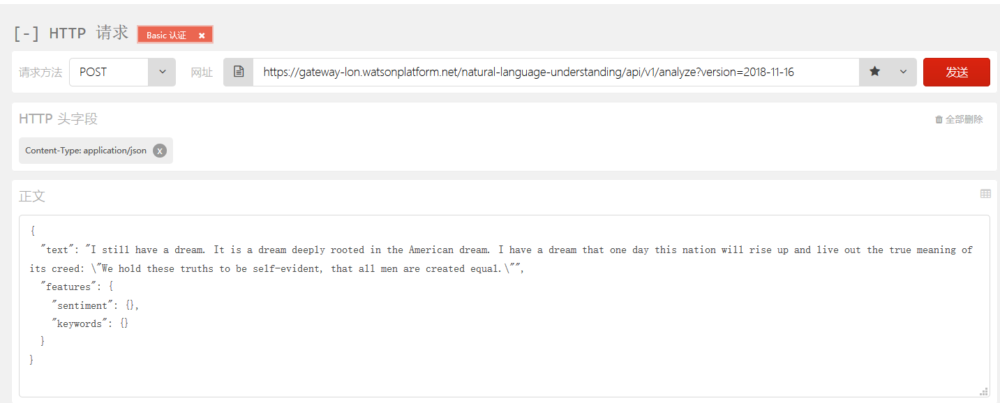

要注意的是 2 点：

- 要添加 Basic 认证。”用户名”是固定值 “apikey”；密码就是 API 密钥值。
- HTTP 头需要添加 Content-Type:Application/json

HTTP 响应和 Demo 是一样的。

##### 图 10\. HTTP 响应

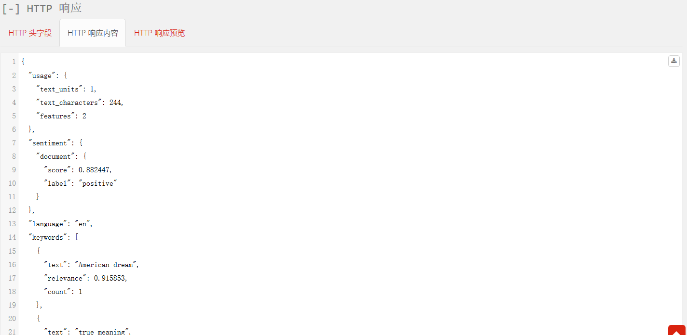

其中有情感分析和关键词分析。

### Knowledge Studio

然后呢？在 NLU 里面，已经没有然后了。用过其它平台自然语言分析的同学一定一头雾水，怎么没有其它定制方法了？IBM 就是 IBM，比较强调功能的分离度，我们需要为此建立一个 “Knowledge Studio” 服务，然后”部署”到刚才新建的 NLU 上来。

点上方的 “目录”，在 AI 分类中找到 “Knowledge Studio”。

##### 图 11\. Knowledge Studio

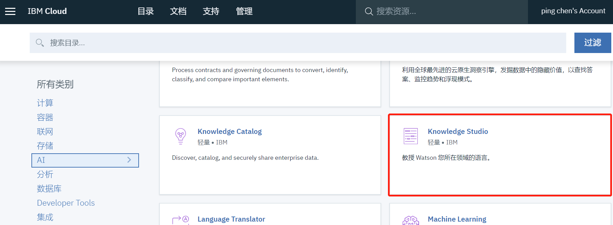

进入 “Knowledge Studio”。

##### 图 12\. 创建 Knowledge Studio 服务

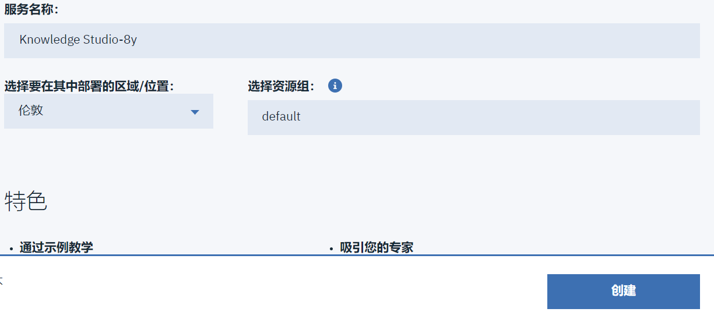

点下方”创建”按钮建立一个服务。

创建好以后点”启动工具”。

##### 图 13\. 启动工具

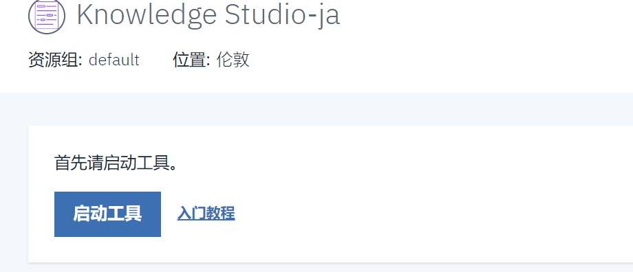

在上方点 “Create Workspace”。

##### 图 14\. 创建 Workspace


每一个 Workspace 相当于一个语言分析环境配置。

##### 图 15\. Workspace 参数

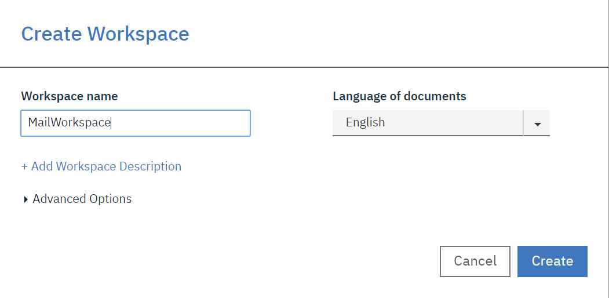

注意：语言如果选”中文”的话，部分功能不可用，我们就使用英文吧。

Workspace 创建好后会自动进入其配置界面。这下，终于有点感觉了吧？

##### 图 16\. Workspace 界面

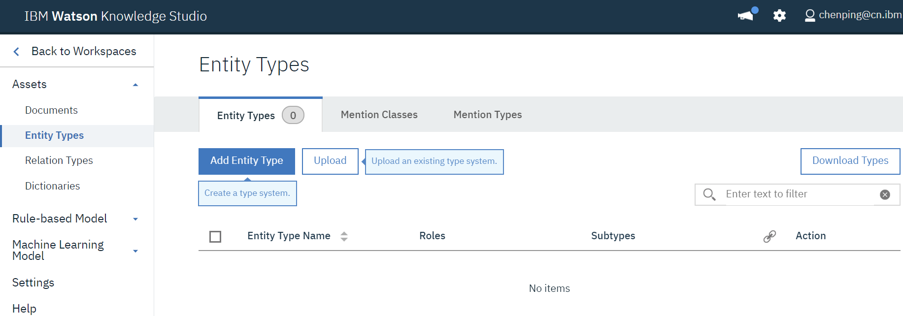

这里先介绍一些概念：

- Documents：用于训练服务的文档，文档里面应该是很多典型例句。
- Entity Types：实体类别。比如我们的语言和邮件相关，那么实体类别应该有发件人、发送时间、关键词等。在本例中，Entity Type 是最重要的。
- Relation Type：关系类别。定义实体类别之间的关系。在本例中，其实关系类别并不重要，所以另外举例，”我喜欢踢足球”。”我”和”踢”之间，以及”踢”和”足球”之间就分别构成一个 Relation Type。我们可以给这些关系随意命名，经过训练，服务就应该知道用户的语言中是否有这下关系，并可以标识出来。例如，经过训练，用户说”我喜欢打排球”，服务也应该理解语句中存在同样的 Rational Type。
- Dictionary：字典。我们分析的语句中，有的 Entity Type 是可以穷举的，最典型的例子是在订票服务中，起点和终点是一些城市的名称。

我们先来定义 Entity Type。

##### 图 17\. Entity Type

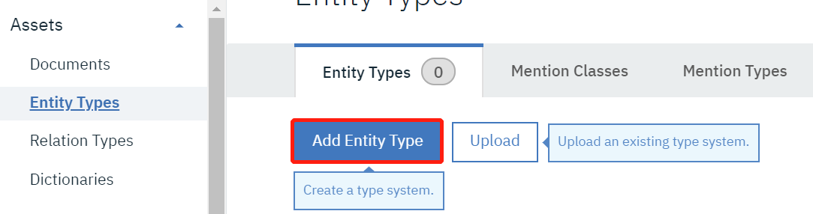

点 “Add Entity Type”。添加一个 “theSender” Entity Type。保存。

##### 图 18\. 添加 Entity Type

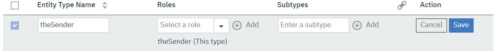

接下来再添加 2 个：

##### 图 19\. 添加更多 Entity Type

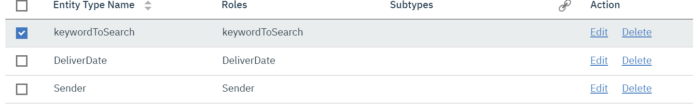

这 3 个 Entity Type 顾名思义，分别表示发件人、发送时间和关键词。其中关键词用于全文检索。

我们知道 Relation Type 是 Entity Type 之间的关系，为了测试 Relation Type，我们再定义一个 “mailKeyword” Entity Type，它不是 mail 单词就是 mails 单词。mail 或 mails 应该出现在问句中。

##### 图 20\. 定义 mailKeyword

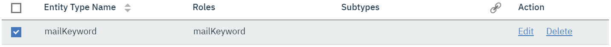

下一步，我们定义 Dictionary。

##### 图 21\. 创建字典

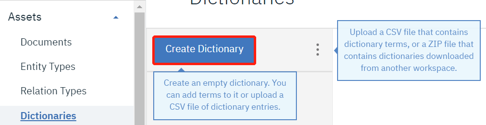

点 “Create Dictionary”。取名 “mailDic”。我们想给 mailKeyword 定字典值。所以 Entity Type 选 “mailKeyword”。

##### 图 22\. 添加 mailKeyword 字典值

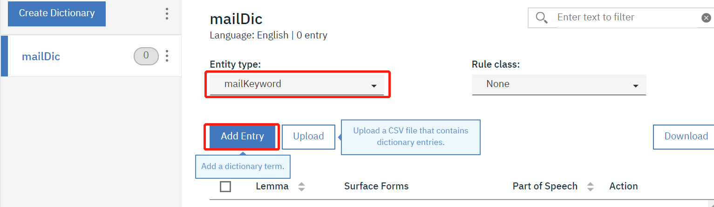

点 Add Entry。Surface Forms 写 mail，Part of Speech 选 Noun（名词）。

##### 图 23\. 设定 mailKeyword 字典值 1

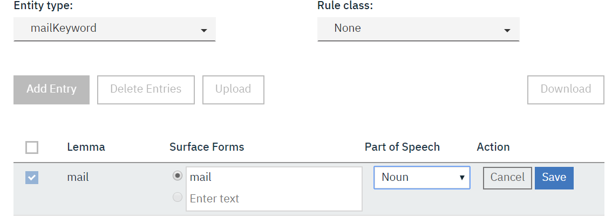

再添加一个值 mails。

##### 图 24\. 设定 mailKeyword 字典值 2

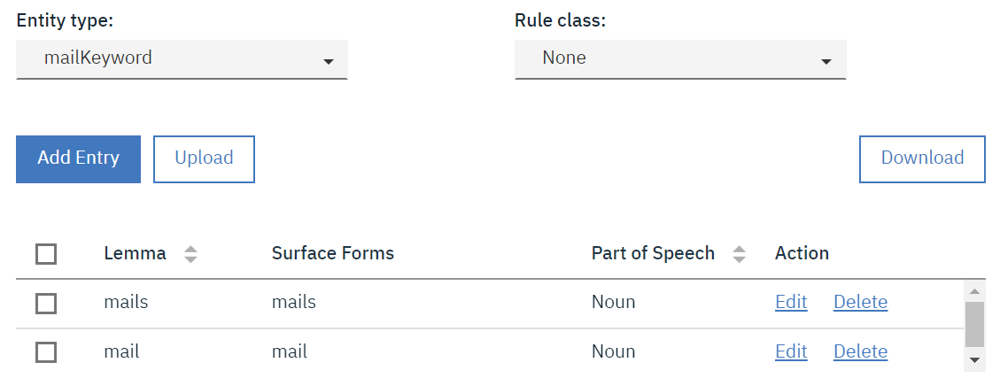

当查询语句中出现 mail 或者 mails 时，服务会认定为 mailKeyword。

接下来，该提供分析样本了。可以使用 Excel 编辑一个 CSV 文件。样例如下：

##### 图 25\. 样本列表

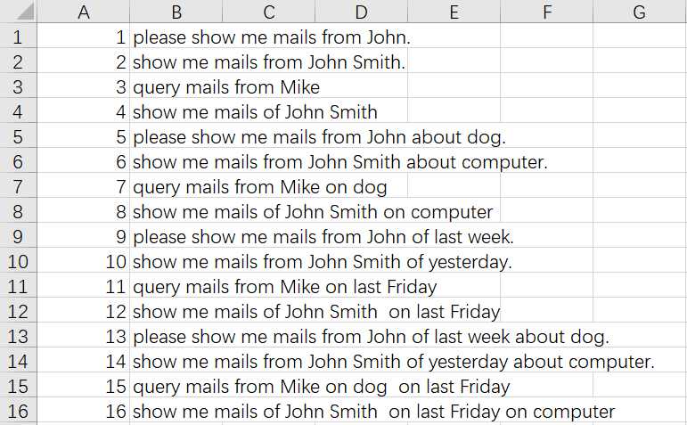

第一列是样本语句编号（随意编号，不一定是数字）。第二列是样例语句。

在 Document 页面，点 “Upload Document Sets”。

##### 图 26\. 上传文档集

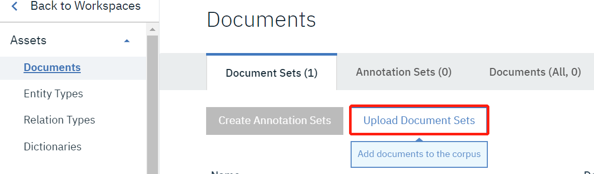

选中 CSV 文件并上传。

##### 图 27\. 开始上传

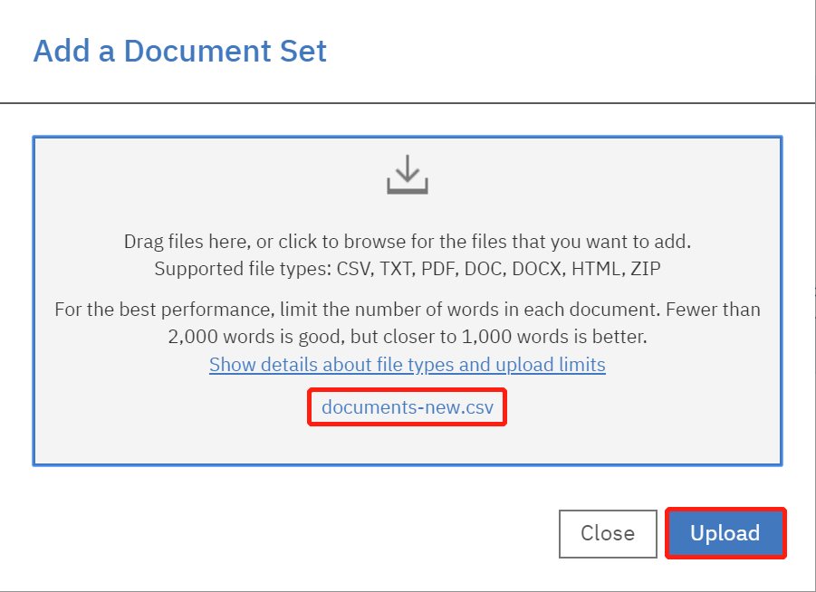

上传以后会发现有 2 个 Document Sets，其实我们只上传了 1 个文件，另一个 “All” 是系统自带的。您会发现有一个 “Create Annotation Sets”。

Annotation 是”标记”的意思，机器现在还是个白痴，您要先告诉它这些样例中的句子如何分析（标记），然后让它学。

那为啥还要创建 “Annotation Sets” 呢，因为实际生产中，一个文件中的样例可能会很多，您可以分给很多人来完成标记任务。

##### 图 28\. 文档集与 Annotation Sets

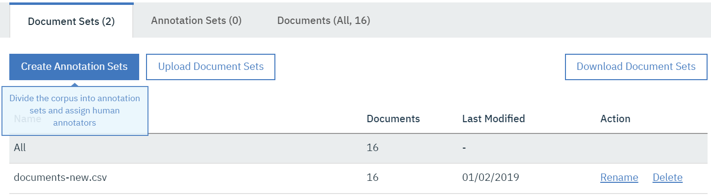

点 “Create Annotation Sets”。

##### 图 29\. 创建 Annotation Sets

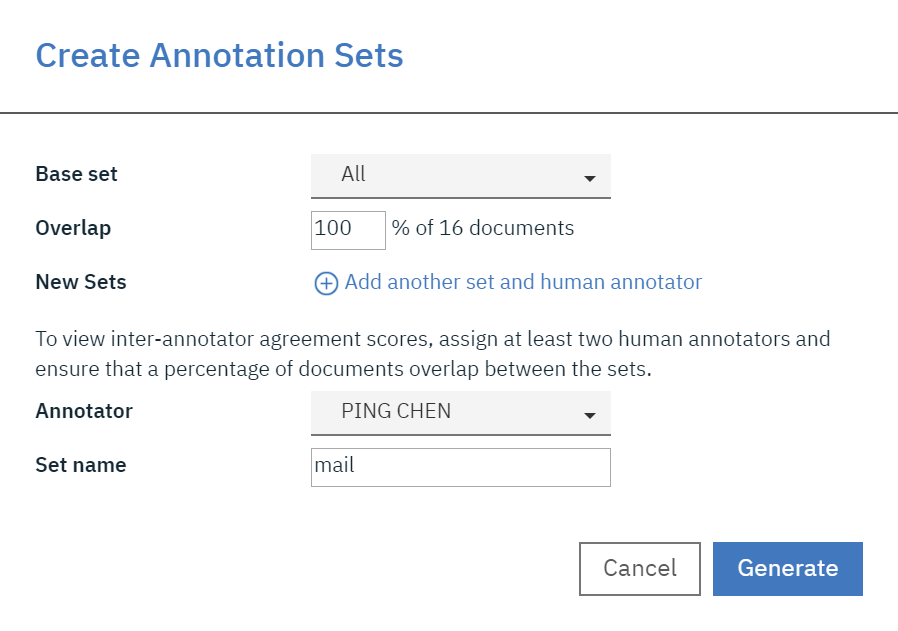

如果没有人帮忙或者样本很少，就可以选 100% 样本作为 1 个 set。需要选择一个 Annotator，就选自己好了。还要给这个 set 一个名字，我们叫 mail。以后训练的时候需要用到这个名字。

点 “Generate” 按钮。Annotation Set 就建好了。

##### 图 30\. Annotation Sets

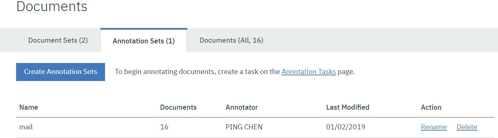

建好 set 了，在标记之前，我们先建一下 Relation Types。

进入 Relation Types 页面。

##### 图 31\. 创建 Relation Type

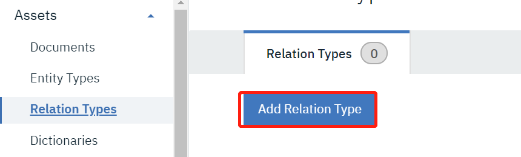

点 “Add Relation Type” 按钮。

我们把第一个 relation type 叫 “rSender”。这个关系定义为 mailKeyword 和 Sender 的关系。

##### 图 32\. 定义 rSender Relation Type

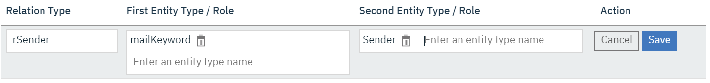

类似地，我们一共定义好 3 个关系：

##### 图 33\. 定义其它 Relation Type

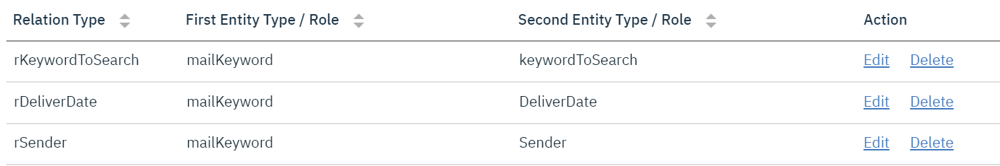

下一步我们要开始标记了。

进入 Annotation Tasks 页面。

##### 图 34\. Annotation 任务

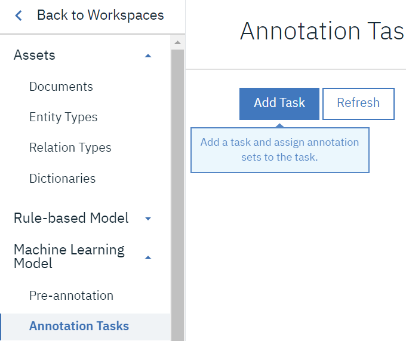

点 “Add Task” 按钮。进入以下界面。系统告诉您：任务是建好了，但还没把 Annotation Set 放进来呢。

##### 图 35\. 添加 Annotation 到任务

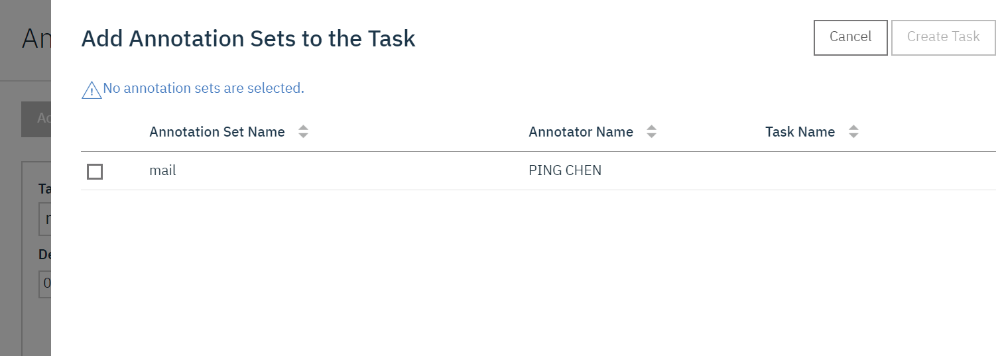

选中 mail。点 “Create Task” 按钮（这个按钮变成可用状态比较慢，您要慢点）。

##### 图 36\. 创建 Annotation 任务

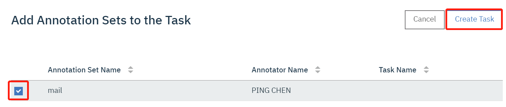

现在，Task 建好了：

##### 图 37\. Annotation 任务已添加

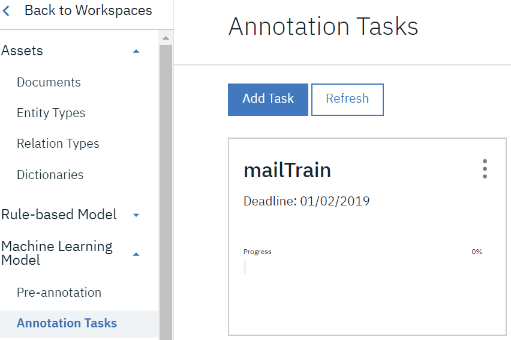

笔者一开始不熟悉的时候，等这个 Progress 好一会儿，但是进度一直是 0%。最后发现应该”自己的事情自己做”。哈哈。

点击这个任务：

##### 图 38\. 任务列表

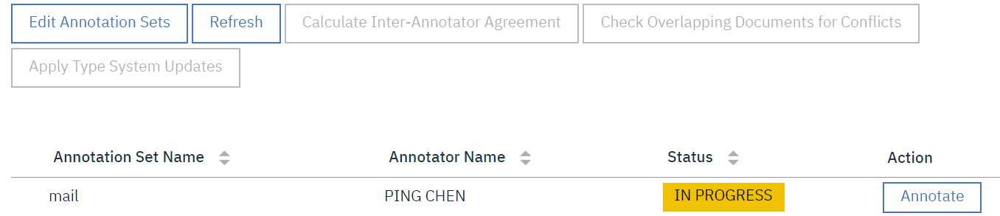

点 “Annotation” 按钮。

##### 图 39\. 需要标记的列表

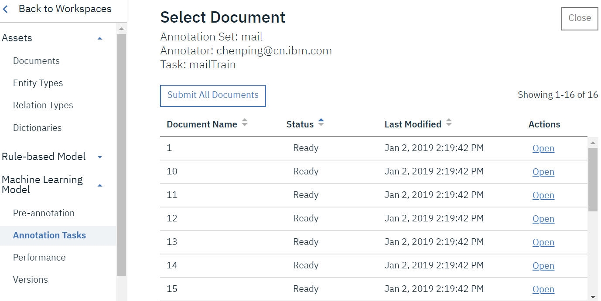

对每一个样例语句，点后方的 “Open” 链接来标记。

先选择语句中的一个或几个单词，然后选右侧 Entity Type。例如：

##### 图 40\. 标记 Entity 1

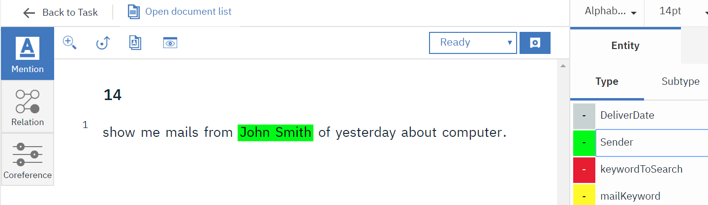

直到完全标记：

##### 图 41\. 标记 Entity 2

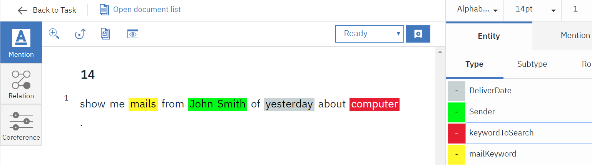

注意：如果语句中的单词点错了，可以点上面的小眼睛来消除，重复点单词是消除不了的，这一点 IBM 是不是需要改进呢？

选中 “Relation” 附签。

##### 图 42\. 标记 Relation 1

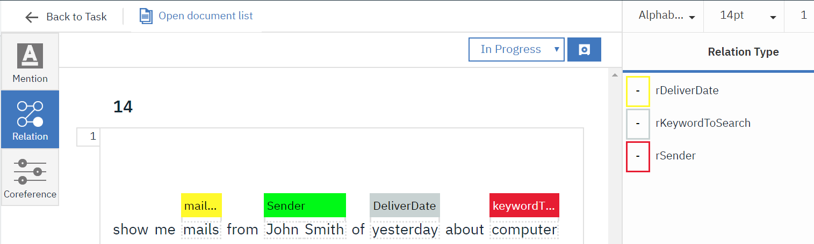

选择 mail（黄色）和 Sender（绿色）。

##### 图 43\. 标记 Relation 2

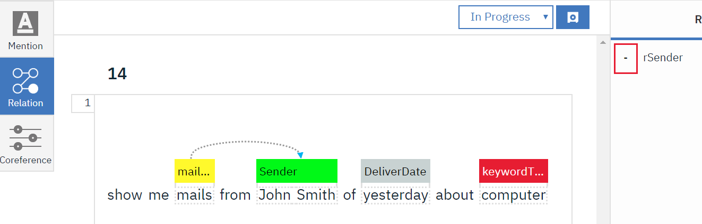

右侧选择 rSender 关系。

##### 图 44\. 标记 Relation 3

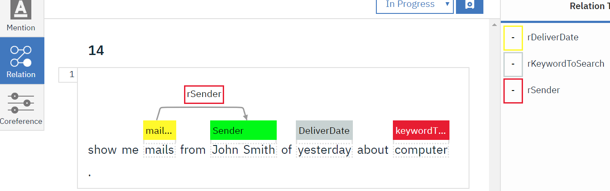

类似地，定义其它关系。

##### 图 45\. 标记 Relation 4

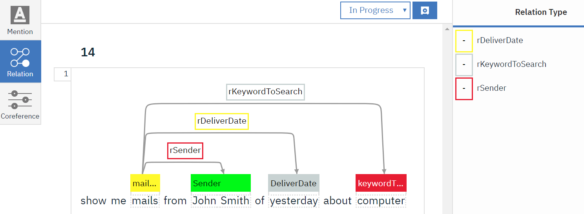

Entity Type 和 Relation Type 标记完成后，点 “Save” 按钮。

##### 图 46\. 保存标记工作


这个按钮比较隐蔽。

保存完成后点 “Open document list” 按钮回到样例列表，继续标记，直到标记完成。

所有语句都标记完成后，界面如下：

##### 图 47\. 全部标记完成

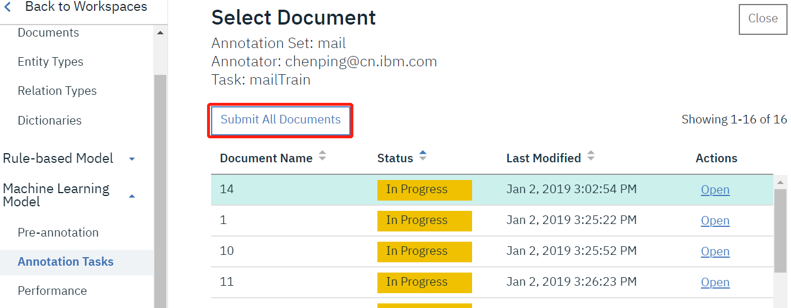

点 “Submit All Documents”，提交给服务训练。

##### 图 48\. 提交标记文档 1

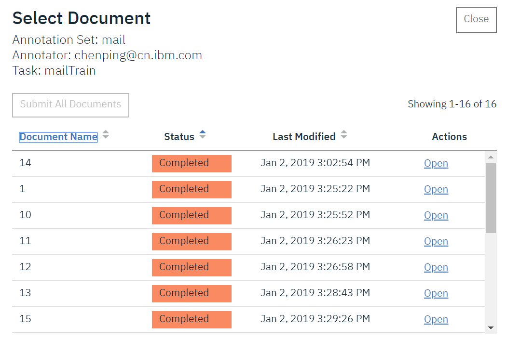

其实，还没有提交。需要回到 Annotation Task 界面。

##### 图 49\. 提交标记文档 2

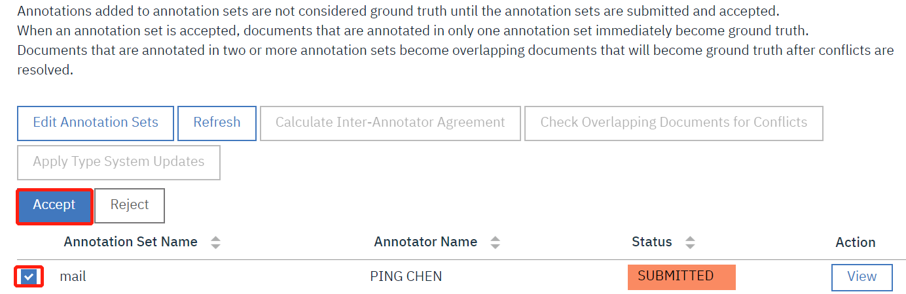

选中刚才标记过的 mail，点 “Accept” 按钮。才真的提交了。提交完成的界面是这样的：

##### 图 50\. 标记完成 1

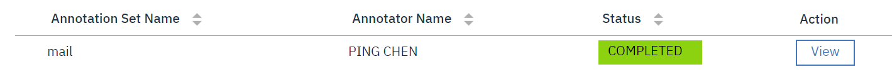

回到 Annotation Task 界面：

##### 图 51\. 标记完成 2

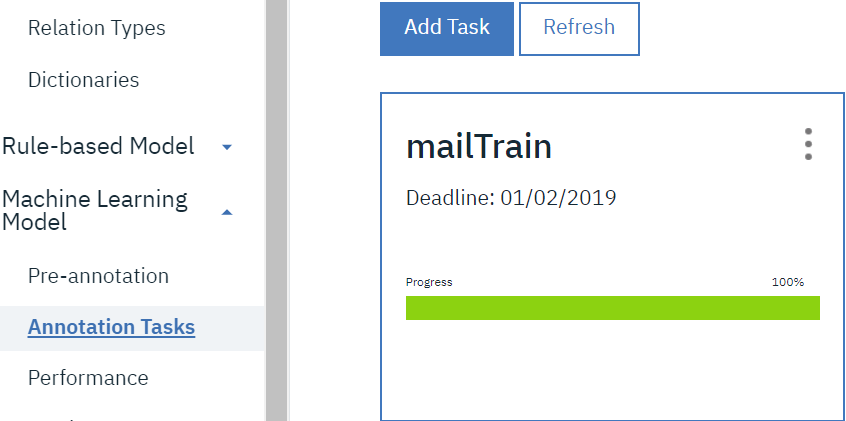

人工花了一大堆，该机器做点事情了。

来到 Performance 页面。

##### 图 52\. 训练界面

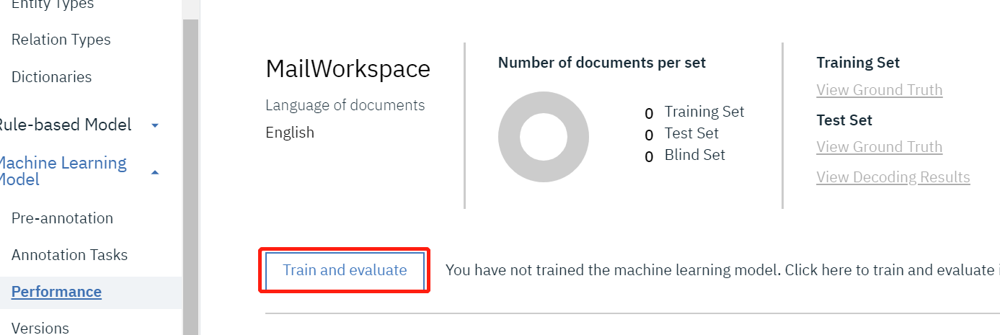

点 “Train end evaluate” 按钮。

##### 图 53\. 选择训练文档

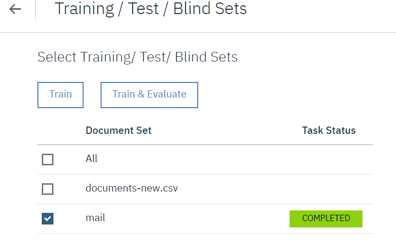

选中 “mail”，然后点 “Train” 按钮。

##### 图 54\. 开始训练

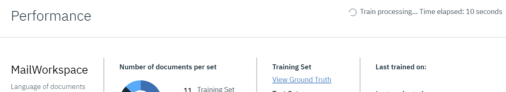

接下来可以泡杯茶，休息 20 分钟，等待训练结束。看起来慢了些，但是和婴儿学说话比起来，还是算很快了。

结束后会显示：

##### 图 55\. 训练完成


实际上，系统会选大部分数据做训练，少量数据做自我测试。

##### 图 56\. 训练结果

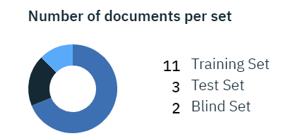

因为是样例，所以一般都很准。如果是实际收集的生产数据就不一定了。

接下来，我们进入 Versions 页面。

##### 图 57\. 创建训练结果的版本 1

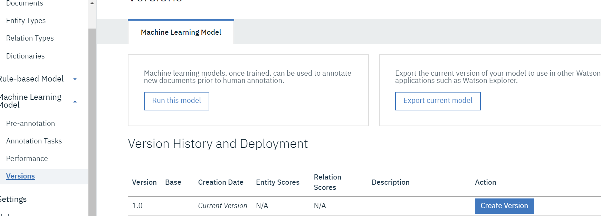

其中 “Run this model” 可以将训练结果用于新样本的机器识别标注，机器识别标注后，再人工标注。现在没有新样本，我们不点 “Run this model”。

“Export current model”可以导出，但是免费版不让用的。

“Create Version”现在才是最重要的。我点这个按钮。生成一个版本。

##### 图 58\. 创建训练结果的版本 2

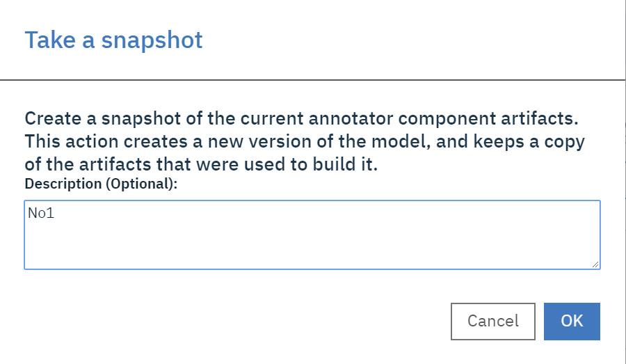

新生成的版本如下：

##### 图 59\. 版本已生成

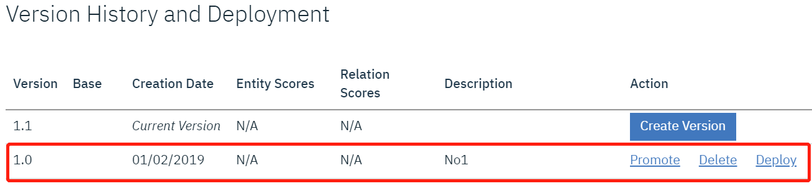

接下来，敲黑板。我们要把这个训练好的服务，部署到 NLU 了。

点 “Deploy” 按钮：

##### 图 60\. 部署到 NLU 1

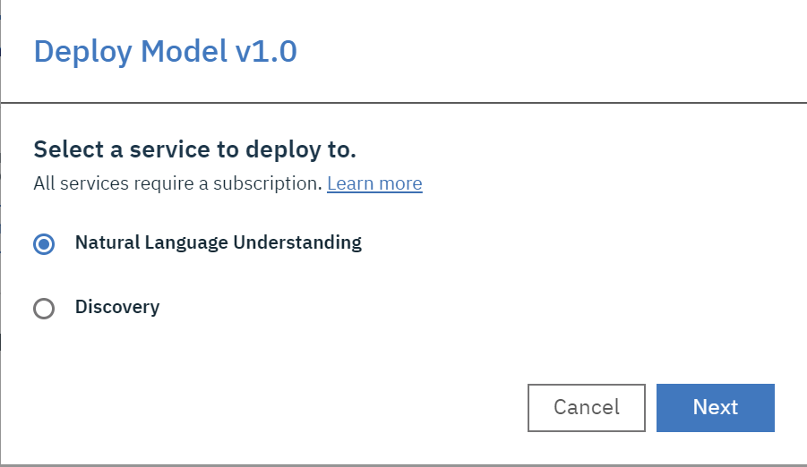

选中 “Natural Language Understanding”。点 “Next”。

##### 图 61\. 部署到 NLU 2

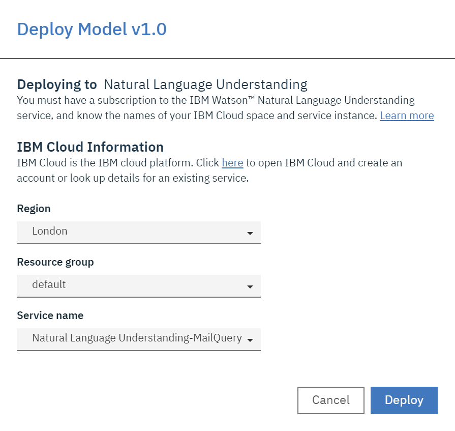

选中我们建立的 NLU，点 Deploy。出来一个界面，告诉您已经在部署中。记录这个 Model ID。要 Model ID 做什么？原因是，一个 NLU 可以使用很多个 Model。您使用 NLU 的时候，需要告诉 NLU 用哪个 Model 来分析语言。

##### 图 62\. 部署到 NLU 3

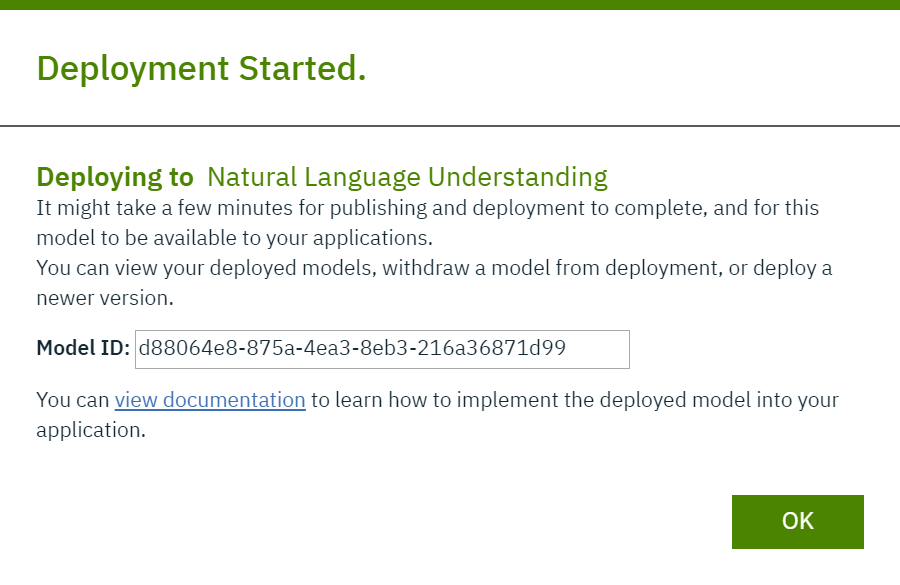

好了。让我们回到 NLU。

我们把 RESTClient 中的请求改为：

##### 清单 3\. 添加分析模型的参数

```
{
"text": "show me mails from John Smith of last week about cats please.",
"features": {
    "entities": {
      "model": "d88064e8-875a-4ea3-8eb3-216a36871d99",
      "sentiment": true,
      "limit": 1
    }
}
}

```

Show moreShow more icon

注意其中的 model 参数。NLU 分析的结果就会有我们的 Entity Type：

##### 清单 4\. 分析 Entity 的结果

```
{
      "type": "Sender",
      "text": "John Smith",
      "sentiment": {
        "score": 0.0,
        "label": "neutral"
      },
      "disambiguation": {
        "subtype": [
          "NONE"
        ]
      },
      "count": 1
    },
    {
      "type": "DeliverDate",
      "text": "last week",
      "sentiment": {
        "score": 0.0,
        "label": "neutral"
      },
      "disambiguation": {
        "subtype": [
          "NONE"
        ]
      },
      "count": 1
    },
    {
      "type": "keywordToSearch",
      "text": "cats",
      "sentiment": {
        "score": 0.0,
        "label": "neutral"
      },
      "disambiguation": {
        "subtype": [
          "NONE"
        ]
      },
      "count": 1
    }

```

Show moreShow more icon

我们把请求中的 “Entities” 换成 “Relations” 就可以得到句子成分的关系分析，例如：

##### 清单 5\. 分析 Relation 的结果

```
{
     "type": "rDeliverDate",
     "sentence": "show me mails from John Smith of last week about cats please.",
     "score": 0.973118,
     "arguments": [
       {
         "text": "mails",
         "location": [
           8,
           13
         ],
         "entities": [
           {
             "type": "mailKeyword",
             "text": "mails",
             "disambiguation": {
               "subtype": [
                 "NONE"
               ]
             }
           }...

```

Show moreShow more icon

我们把被分析的语句修改为 “I need mails from John Smith of last week about cats.”，得到的分析结果也相同。

回到 NodeJS 编程。Watson 为我们准备好了 NodeJS 的开发包 (watson-developer-cloud)。您可点击查看开发包的 [说明文档](https://cloud.ibm.com/apidocs/natural-language-understanding) 。根据需求，我们着重参考其中 Entities 分析的部分。

根据文档，调用 NLU 的代码：

##### 清单 6\. 调用 NLU 服务

```
var NaturalLanguageUnderstandingV1 = require('watson-developer-cloud/natural-language-understanding/v1.js');
var natural_language_understanding = new NaturalLanguageUnderstandingV1({
'version': '2018-11-16',
'iam_apikey': '2e1pNXh......H9E',
'url': 'https://api.eu-gb.natural-language-understanding.watson.cloud.ibm.com/api'
});

var parameters = {
'text': queryString,
'features': {
    'entities': {
      'model': 'd88064e8-875a-4ea3-8eb3-216a36871d99',
      'emotion': true,
      'sentiment': true,
      'limit': 2
    },
    'keywords': {
      'emotion': true,
      'sentiment': true,
      'limit': 2
    }
}
}

```

Show moreShow more icon

其中 queryString 是我们要分析的语句；”model” 是我们训练出来的分析模型。就像我们在 Firefox 中看到的，NLU 服务返回一个分析结果，以 JSON 形式。我们从中提取出查询的关键信息：发件人、发件时间和关键词。注意，关键词可能不止 1 个。

## 邮件查询与展现

本来笔者希望用 Domino 的 DQL 来查询邮件，但是 DQL 支持中文还需要大约 2-3 个月的时间，所以笔者开发了一个 Domino 的 REST 服务来实现邮件的查询。

Domino 很早就支持 REST 服务了，且缺省无需编程就可以使用。但是我们希望这个 REST 服务是定制的，那么就可以使用 XPages 的 REST 控件。

我们新建一个用于查询的 XPages，在 XPages 上添加 REST 控件：

##### 图 63\. REST 服务

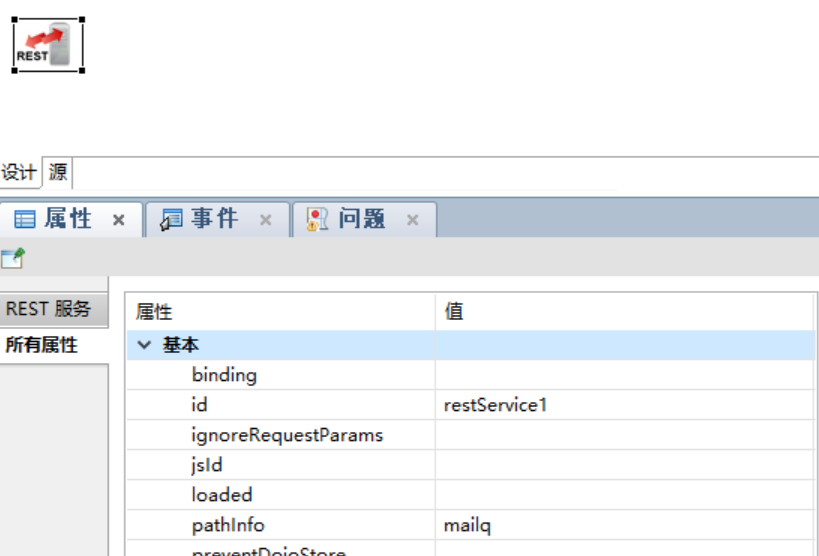

其中 mailq 是 REST 服务的名字，NodeJS 程序需要调用 /….nsf/….xsp/mailq 来查询邮件。

在 REST 控件的 service 属性中，添加一个 customRestService。并且在 doPost 中编码，对查询参数进行分析并构建 Domino 查询语句，查询邮件。

##### 图 64\. REST 服务设置

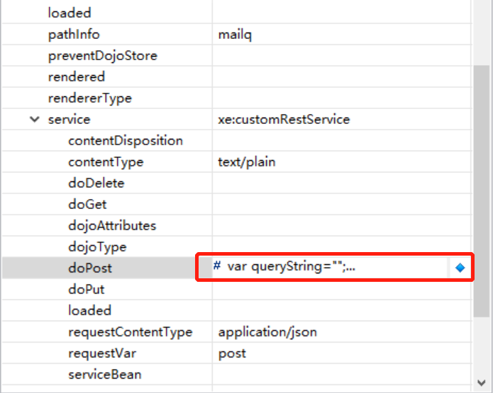

最后将查询结果返回给 NodeJS。

##### 清单 7\. 邮件搜索

```
var dc = db.FTSearch(ftSearchStr);
......
while (doc != null) {
    var docUrl =  doc.getHttpURL();
    list = list + "< a href=\"" + docUrl + "\" target=\"_blank\">" + doc.getItemValueString("Subject") +"< /a>< hr />";
    var tmpdoc = dc.getNextDocument();
    doc.recycle();
    doc = tmpdoc;
}
return list

```

Show moreShow more icon

效果测试，笔者没有在 UI 设计上花精力，就试试功能吧。

笔者说 “Show me mails from John Smith of last week” 可以搜索到 John Smith 上周的邮件。

##### 图 65\. 测试效果 1

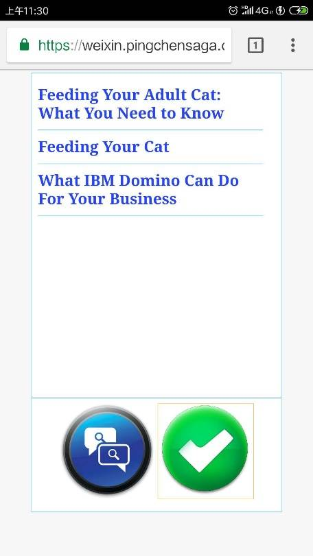

加上限定词，变成 “Show me mails from John Smith of last week about cat.” 就剩下和 cat 相关的了。

##### 图 66\. 测试效果 2

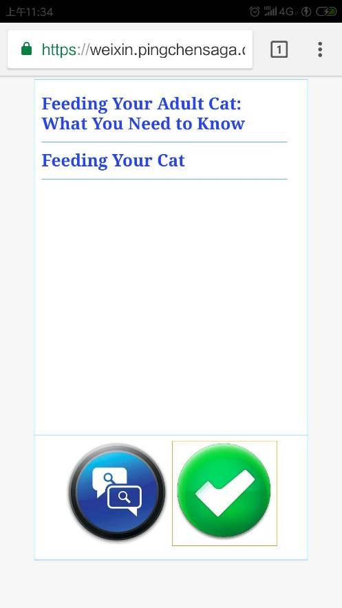

关于 UI 操作，这个版本的方式是用户点蓝色按钮，然后开始说话，说完了按绿色按钮。也可以做成只有 1 个按钮，按下说话，抬起识别。

## 结束语

人工智能会在各个专业领域蓬勃发展，不同领域的人工智能技术也有很大差异。笔者看来，在协作领域，人工智能一方面需要”人性化”地了解人类的自然语言；另一方面，需要集成专业系统，为用户提供业务上的帮助。希望本文能起到抛砖引玉的作用，激发读者更深刻的思考。

## 参考资源

- [IBM Cloud Docs](https://cloud.ibm.com/docs)，了解 IBM Cloud 的能力以及入门方法。
- [IBM 人工智能服务](https://cloud.ibm.com/catalog?category=ai&cm_sp=ibmdev-_-developer-articles-_-cloudreg)，查看 IBM 人工智能方面的服务列表。
- [IBM 语音转换服务文档。](https://cloud.ibm.com/catalog/services/language-translator?cm_sp=ibmdev-_-developer-articles-_-cloudreg)
- [IBM 自然语言理解服务文档。](https://cloud.ibm.com/catalog/services/natural-language-understanding?cm_sp=ibmdev-_-developer-articles-_-cloudreg)