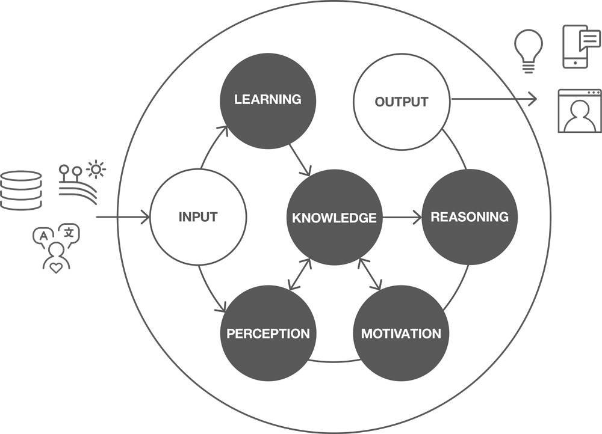
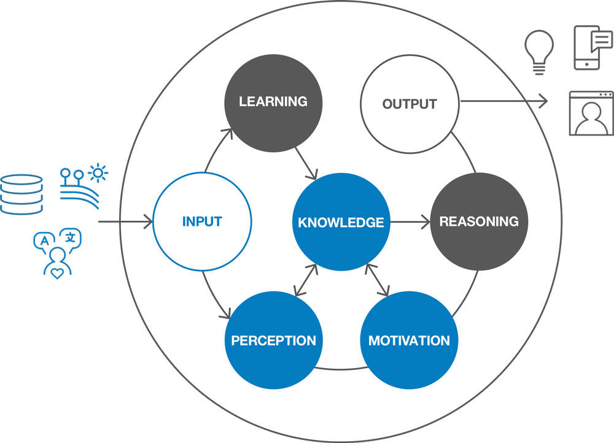
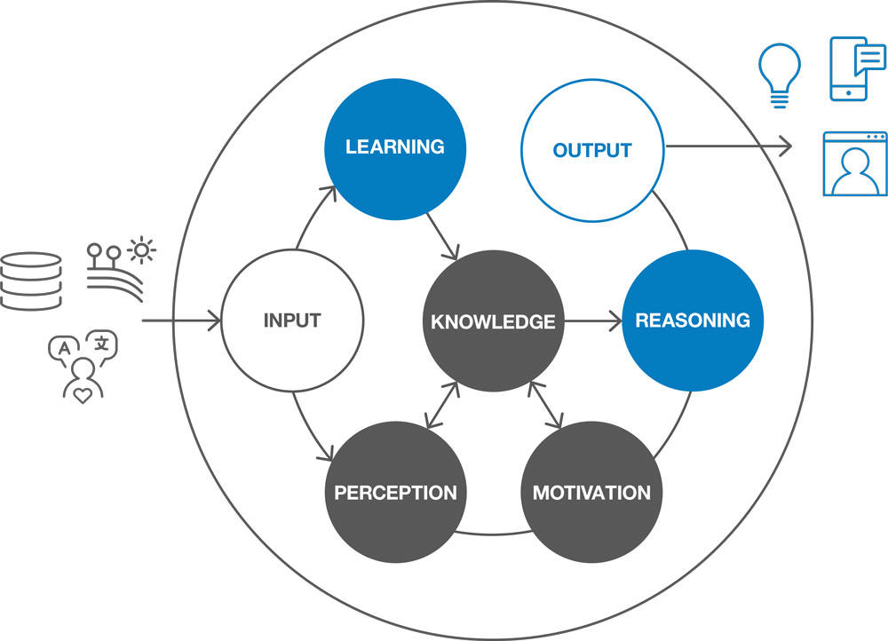

# 人机通信模型
探索认知系统必须能够识别、理解、分析、模拟人类思考和沟通的 5 个元素

**标签:** 人工智能,零售

[原文链接](https://developer.ibm.com/zh/articles/cc-design-cognitive-models-machine-learning/)

Jennifer Sukis, Leah Lawrence

发布: 2018-03-21

* * *

所以您不仅希望构建一个认知应用程序，还希望它很优秀。您希望它非常有用、令人兴奋且鼓舞人心 — 实质上，就是创建一种真正的认知体验。您可能想知道认知体验是什么？我设计的应用程序应该具有认知吗？如果它应该有认知，我能否衡量它的认知水平？

_认知_ 是通过思维、体验和感觉来获取知识和理解的心理活动或流程。认知描述了人类如何处理思维来相互沟通。对于计算机，认知描述的是一个系统，该系统使用旨在增强人类认知能力的算法模型来模拟这种人类思维过程。认知计算机的目标是用一种我们觉得自然的方式与人类交互 — 从而增强我们自己的人类认知能力。

这反过来引出了一个基本问题：认知系统如何模拟人类认知过程？答案是它必须刺激我们的感觉（视觉、听觉、触觉等），它必须创建一种生动有趣的体验，还必须激发我们的思维过程 — 所有这些旨在帮助我们获取知识和形成理解。我们称之为 _存在感 (presence)_。最有吸引力的认知解决方案会在我们的生活中创造一种存在感，并通过这种存在感增强我们自己的认知能力。

与非认知系统相比，认知应用程序超越了我们如今在事务性应用程序中的体验（比如按下按钮、获得明确的响应）。IBM 将它们区分为能够理解、推理、学习和自然交互的系统。为了实现此目标，认知系统将会分析大量数据来与用户建立富含洞察、知晓背景、不断改进的关系。这些系统掌握的关于用户需求、目标和价值的知识越来越多，就使得它们能够提供个体化的响应，建议相关的洞察，并揭示与背景相关的重大发现。

为了理解、推理、学习和自然交互，认知系统必须能够识别、理解、分析、模拟人类思考和沟通的 5 个元素：

- 感知
- 动机
- 推理
- 学习
- 知识

##### 人机通信模型

根据应用程序的自主能力，存在不同的认知功能水平。低级认知应用程序要求用户或程序员提供大量的帮助，而更高级应用程序更多的时候是独自行动的。一个全新的应用程序最初可能仅具有低级认知功能，因为程序员必须训练知识和行为，直到应用程序能以可靠方式进行响应。随着时间的推移，应用程序将拥有更高级的认知功能。为了更快地获得更高级的功能， [IBM Watson](https://www.ibm.com/watson/developer/) ™ 提供了一个基本框架作为构建基础。根据程序员或用户干预程度，每种认知能力也会有不同的功能水平。

用户与认知应用程序之间的交互可能不需要所有这些能力，但应用程序本身需要利用每种能力来完善整体认知体验 — 这是展现在用户面前的东西。

人机通信模型将认知系统的必要组件嵌入到一种创建认知体验的方法中。它的目标是指导和启发有目的的创新，提供一种基于人类需求、价值和期望来制定可靠设计决策的结构。

## 输入：理解世界

##### 输入模型

### 知识

人类与技术（一个锤子、微波炉或量子计算机）交互的动力，与该技术改善人类生活、扩大我们的优势或接触范围的能力直接相关。对于认知计算，促使我们与它交互的改进之处在于，它能够处理和合成海量数据，增强我们的思维，使我们能制定更有效的决策，能够比人类更快地获得新发现。正是这非常独特的能力，可以帮助医生花更少的时间做研究，花更多的时间关怀患者，帮助针对每位学生的独特需求来创建针对性的课程计划，帮助公司同时、当面、主动地为数百万客户提供服务。

知识是认知系统知晓的所有信息的汇总 — 从最初用来训练它的事实数据到它从经历的每次交互中掌握的信息。如果给定一个针对某个领域的模型，可以针对任何主题来训练认知系统。它们特别擅长阅读、识别和记住海量非结构化信息，人类思维无法处理如此多的信息。它们可以分析数千页内容并归纳要点，或者倾听数小时音乐，然后创作自己的歌曲，或者浏览数 TB 图像来揭示以前不相关的研究之间的关系和模式。它们通过添加到其知识库的每段新数据，不断改进为我们提供个性化响应、相关洞察和新发现的能力。

_知识_ 是应用程序的事实数据，以及不断扩充的专家经验和技能集：

- **良好** — 应用程序拥有主题专家知识，这使它成为一个解决问题的熟练工具。
- **更好** — 应用程序允许用户或程序员通过经过训练的数据或实时数据来更新知识库。
- **最好** — 应用程序独自使用实时来源更新其知识库。

### 感知和动机

为了响应来自外部世界的输入，认知应用程序需要了解相关背景（一个事件、一段陈述或一个想法的周围环境），这样系统才能充分理解某种用户意图在交互时的含义，并提供富有洞察的、及时的、自然的响应。

例如，通过识别一篇传入文章的日期、作者、信息质量和来源有效性，认知系统可以确定为新信息分配何种优先级。类似地，交互时世界的状态也为理解用户的需求提供了重要背景信息。如果出现针对公司产品的负面新闻，CFO 也许希望立刻开始分析对股票价格可能造成的影响。认知系统可以将新闻警报与重要的洞察和股票分析联系起来，并知道这是 CFO 的优先注意事项。

提供背景信息的来源会影响系统向用户提供智能响应的能力，应该从与人类思维过程对应的两个视角进行考虑。

#### 感知

“嘿，电脑，Jones 在哪里？”

如果认知系统知道用户在家里而不是在他的车里，它可能会推断出用户问的是他的宠物狗 Jones，而不是 Jones 大街。此外，如果系统知道兽医建议每两个小时领着 Jones 到户外溜达一次，因为 Tom 在他的电子邮箱中收到了指令，而且系统知道遵守兽医指令在过去对 Tom 很重要，因为他使用兽医的上一封电子邮件设置了用药提醒，系统由此可以推断出，它必须在 Jones 需要外出时提醒 Tom，告知 Jones 位于家中何处，而不是等待 Tom 的询问。

感知是应用程序对用户的物理和数字信息、当前和历史情景进行使用、组织和分类的能力。感知数据包括位置、日期、时间、情绪、表情、环境、生理反应、连接的应用程序、网络和附近设备等。认知系统使用 API 传输有关这个世界的信息，包括天气、交通拥堵、延误、事件和社交媒体。认知系统可以收集的围绕感知的数据越多（无论是过去的数据还是当前数据），它的响应就越富有洞察和越自然。

_感知_ 是应用程序对用户的物理和数字背景信息进行使用、组织和分类的能力。

- **好** — 应用程序根据之前的训练对信息进行分类和组织。
- **更好** — 应用程序能对来自实时来源的新信息和它了解的事物的新信息进行分类和组织。
- **最好** — 应用程序根据其他信息来推断信息。例如，如果 Mary 在医院，她的医生告诉她要多喝水，认知系统可以看到她有一个用来喝水的玻璃杯，因而可以告知医生她保持着足够的水分。

#### 动机

了解动机会为认知应用程序提供用户偏好、目标和价值的知识，使认知系统可以自定义一个富含洞察的响应来满足用户与该系统交互的期望。可以通过用户的设置历史、偏好、响应、表情和交互来不断获得定义用户动机的数据。随着用户的交互历史记录的增多，系统对用户需求和行为的理解也会加深，每次交互都会改进这一知识。

动机使系统能够理解并优先处理用户的行为和个人信息，然后可以利用这一推断创建有价值的响应。为此，它通过评估用户过去在类似情况（定义了当时的需求和价值的情况）下的响应是否成功，来创建有价值的响应。例如，认知系统可以决定不因为工作通知打断一通电话，因为在过去，用户在与其母亲通话时没有接受类似通知。它可以选择提醒用户有一个他未订阅的新闻提要，因为用户最近在工作时关注过这个新主题。或者，它可以倾听一场会议，决定向团队发送改进站立会议的举行方式和会议时间的反馈，而且知道他们的经理的目标是改进敏捷实践。

认知系统还必须考虑为什么用户会询问针对这个特定系统的问题。与一个由运动服饰品牌构建的系统交互，对比与一个由乐评品牌构建的系统交互，用户有何期望？如果用户询问每个系统在星期六晚上做什么，他肯定想要根据这个系统所代表的品牌的价值，对一系列的答案进行正确预测。认知系统拥有其创建者定义的目标和价值，他们需要在响应中进行解释和表达，以满足用户的期望。

应该将感知和动机视为让用户感到被理解的核心组件。系统应反映出它在无人指导下理解用户、记住过去的交互和预测需求的方式。它应该减少冲突，减少完成任务所需的步骤数。如果做得好，认知系统应该让您感到它真的了解您并了解您的需求。

_动机_ 是应用程序理解用户的意图、优先级、目标和价值的能力：

- **良好** — 应用程序了解用户的人口因素和业务重点，并相应地对信息进行表面处理。
- **更好** — 应用程序识别个人和他们的特定行为。它能识别用户的情绪并以最适当的情绪作为响应。
- **最好** — 应用程序基于用户可能的响应方式主动与用户进行交互。例如，一位助理知道他在帮助谁并提前计划如何满足他们的需求。

## 输出：自然地响应

##### 自然地响应

### 推理

只需提供存储在用户知识库中的事实信息，应用程序就能与用户智能地交互。但是，通过使用学到的有关用户背景信息的知识，认知应用程序可以超越字面翻译，提供更有价值、重点突出的答案。

_推理_ 是应用程序经过分析利用感知、动机和知识所获得的所有信息，获得认知交互的能力。虽然通过单独一个可靠的知识库就能生成智能响应，但如果应用程序没有以某种方式为这个用户服务并考虑用户的背景信息，也不会让人 _感觉_ 到认知。

通过基于情景发现和以前的交互为潜在答案应用置信度评分，系统可以推断如何组合出个性化的、预测性的响应。一次交互可能并不总是同时使用了所有能力，但认知应用程序可以根据它目前学到的知识来组成它的响应，然后力图在未来根据用户对该响应的反应来改进该响应。

在第一次使用时，认知应用程序没有关于用户或背景的足够信息，无法形成与它们相关的响应。这时，应用程序就需要根据关于用户的假设来提供一组默认的信息。例如，如果 John 是 IBM 的一位新销售经理，他正在浏览网页寻找商机，那么应用程序仅知道 John 通常是一位男性的名字，知道 John 的基于角色的目标，还知道 IBM 作为一家公司的价值。应用程序将提供销售经理在统计上喜欢的建议内容，并以一种与 IBM 的价值一致的语气来提供指导。在 John 单击选项时，应用程序会开始了解他的行为和偏好。感知和动机能力会收集 John 的背景信息，使应用程序能通过推理来提供个性化的、智能的交互。

推理的用途是针对个人的需求和情形来智能调节大量信息。某个智能响应可能仅来自应用程序的知识库，但为了让人感到它真正理解用户，该响应需要考虑和应用它了解的关于用户的背景和历史交互信息。

_推理_ 是应用程序根据用户的背景信息和历史知识来执行智能交互的能力：

- **良好** — 应用程序将生成预先确定的特定于该领域或目标问题空间的响应。它在形成响应时不一定会使用感知或动机能力，但会高度依赖于预先训练的知识。
- **更好** — 应用程序生成有创意的响应，并根据感知、动机和知识能力来形成响应。
- **最好** — 应用程序预测用户的需求，直接响应用户，并提供有益于他的特定需求和没有明确说明的背景的建议。

### 学习

在每次交互中，认知应用程序都会根据用户的响应来更新它们关于用户、新数据和世界的知识。用户可能会立即单击系统建议的链接，或者可能会驳回该建议而不读取任何内容。学习是应用程序不断改进交互的能力，它会更新用户的信息、背景信息，以及应用程序的专家经验和技能集所构成的矩阵。认知系统会根据它们从个人和集体历史经验中获得的发现，不断更新它们与人交互的方式。它们记住过去的交互并根据这些知识来调节响应，方法是调节矩阵中的内容的置信度评分。

考虑一个意图充当孩子从小学到高中的学习过程中的教学伴侣的认知系统。当孩子开始更快地制定决策或吸收更复杂的内容时，该系统就会认识到孩子的交互能力得到了提高。该系统能够通过调整来响应孩子不断演变的需求，方法是改变它的语气，提供更有挑战的问题，并利用它关于儿童发展需求的知识库来提供支持孩子的学习目标的定制练习。

通过不断的交互和用户反馈，认知应用程序会学着针对某个特定用户来训练自己，提高系统的准确率和价值。

通过不断学习来改进认知系统，这类似于人类的成长方式。在首次启动时，系统会学习和吸收大量新信息，但它的知识还不够渊博，无法实现个性化、富含洞察或预测性。随着不断获得更多交互和反馈，系统会不断改进，在感知和预测用户的需求和价值上变得愈加智能和熟练。随着系统的不断成长，它会继续变得更加老练和知识渊博。

_学习_ 是应用程序能够解释用户的响应，并应用该知识来不断改进交互的能力：

- **良好** — 应用程序允许用户在接口或代码中训练预先打包的信息。它不一定会训练感知或动机能力，而且它的目标是创建经过更多训练的知识。
- **更好** — 应用程序通过用户交互、行为和显式反馈进行学习。它训练感知和动机能力。
- **最好** — 应用程序更新或训练它自己的信息，无需用户干预。

## 结束语

对于设计认知型人机体验的我们而言，新兴发展的速度和规模很容易让我们感到不知所措 — 量子计算、非语言沟通算法、拟人化的具体体现；更别提大量围绕好和坏的可能性和后果的推测。

我们如今正经历的技术革命可能让我们在开始寻找应用的机会时感到头晕目眩。舆论和宣传越多，匆忙创建一个使用我们想法中新特性的产品的压力就越大。这些时机所带来的优势最终表现为快速失败，发现我们不知道的知识，重新发现在未来数年持续适用的知识。

随着 AI 的黎明的到来，对于与机器（可以进行对话、解释我们的情绪、预测我们的需求、以及利用全人类的知识的机器）的认知关系可能和应该具有的形式，我们需要一个最佳实践指南。当我们发现自己处于这种不熟悉的领域时，最佳开始方式是提醒自己任何技术创新的目的：改善人类生活质量。

朝正确的方向踏出第一步的关键是 — 不要问它 _能_ 做什么，而要问它 _应该_ 做什么。对于 AI，我们拥有关于人类思维过程和沟通的数十年数据和研究成果来制作蓝图。为了模拟人类的关系，我们首先应该观察并更好地了解我们自己。

我们发起研究的方式是展望未来 — 设想我们想要的人机关系是什么样的。我们花时间与机器人在一起，观察它们诱发的思维、感觉和期望。我们认识到，计算机的形象越像人，人们就越希望它能够像真人一样响应。缺少任何部分都会令人失望。

同时，我们在这项工作中首先回望了过去，获取了过去几十年的研究刊物，以便重新发现科学能够自信地表达人类认知性质的哪些方面。我们发现了思维过程和沟通的核心元素，计算机需要模拟这些元素才能发展与人的认知关系。我们将这些元素演变为人机通信模型的组件，以期定义一个根据人类需求和价值的已知事实来战略性地设计和衡量认知交互的流程，为我们进入技术、人际关系和可能性的新时代后改善人类生活质量的全球努力做出贡献。

本文翻译自： [The human-to-machine communication model](https://developer.ibm.com/articles/cc-design-cognitive-models-machine-learning/)（2018-02-29）