# 从想法到代码:利用 IBM Cloud ToolChain 服务进行项目管理
Issues、Git 和 Eclipse Orion Web IDE

**标签:** DevOps

[原文链接](https://developer.ibm.com/zh/articles/from-idea-to-code-project-ma-using-the-ibm-cloud-tool-chain-service/)

赵斐, 卢江

发布: 2018-02-06

* * *

项目的 scrum master 往往都是精于计算的人。用最低的成本追求最大的产能，在满足客户需求的情况下还要兼顾开发团队的士气，这些事情听着就让人头疼。 “小步快跑，快速迭代，积极反馈，不断验错”的开发方法书本里写得很清楚。但在实践过程中应用，不但需要好的管理，还需要合适的工具给予支持。IBM IBM Cloud Toolchain 提供的一系列工具便试图解决这个问题。在此文章中，我们将逐一介绍 ToolChain 的三个工具”issues”，”git” 和 “Eclipse Orion Web IDE”，并结合场景演示其使用方法。

利用 ToolChain，产品可以作为 Cloud Foundry Application 部署到 IBM Cloud 上，也可以生成一个 Docker image 部署到 IBM Cloud 的 Kubernetes 服务上。Cloud Foundry 的形式相对简单，部署完成后可以使用 IBM Cloud DevOps 组中的 Availability Monitoring 服务进行监控和情景回放，以保证服务的可用性。以 Docker image 的形式部署到 Kubernetes 服务上可以利用 Kubernetes 的监控和延展特性，保证应用的有效。但某些功能只有付费用户才能使用。为了演示方便，此篇文章中不对付费功能进行介绍。

## Issues

开发成本高昂有的时候因为沟通上出现了问题。客户需要在树上架设一个秋千，销售团队承诺能交付一个游乐场，而最终交付客户的只是一根绑在树干上的绳子。这也许不止是个笑话，而是某些开发团队遇到过的窘境。作为 scrum master 首先要做的就是避免这种事情的发生。 [Issues](https://guides.github.com/features/issues/) §是 GitHub 旗下的一款项目管理工具，团队可以利用它跟踪开发任务，改进代码，分析错误，分享经验和讨论结果。读者可以参考下面的链接对其进行了解。

## Git

Git 是一个已经被广泛使用的版本工具。团队可以利用 Git 软件开过程中对源代码进行追踪和管理，我们在这里不做详细介绍。

## Eclipse Orion Web IDE

作为一名 scrum master 最不喜欢听的一句话恐怕就是”我在搭环境”。在一个不断变化的团队中，搭环境所消耗的成本有的时候比功能实现上的还要多。开发团队为了开始编码，需要搭建一套适用于开发的环境，其花费的时间是团队人数的总和。测试团队也需搭建相应的环境，虽然数量上没有那么多，但存在开发与测试环境不一致的风险。环境的不一致，会使得开发环境中运行良好的功能在测试环境中无法通过。定位问题，分析原因，核实需求，改进流程，修正错误，这一套组合拳打下来，又要花费大量的开发成本。由此可见，提供一个统一的开发环境，在编码阶段是十分重要的。”Eclipse Orion Web IDE”所提供的就是这个问题的解决方案。它是一个网页版的轻量级 Eclipse IDE， 参与开发的团队成员不需要在本地搭建环境，登录 IBM Cloud 便可以直接进行开发。代码的调试与编译都在 IBM Cloud 中进行，开发完成后代码直接进入 GIT 并持续集成或部署。

## 应用场景

为了方便演示，我们将调用世界银行提供的世界各国均收入水平数据，并将其展示在地图上。世界银行的 REST API 文档可以通过以下地址中访问，请读者参阅相关 [文档](https://datahelpdesk.worldbank.org/knowledgebase/articles/889386-developer-information-overview) 自行学习。

### 使用 Eclipse Orion Web IDE 进行代码编写

Eclipse Orion Web IDE 是一款基于浏览器的 web 开发工具。用户不需要安装任何工具，也无须在本地安装任何软件，登录 IBM Cloud 就可以对相应代码进行编写。

### 如何得到 Eclipse Orion Web IDE

在 IBM Cloud 中，可以通过生成一个 toolchain 来获得 Eclipse Orion Web IDE。在一条 toolchain 中可以添加多个工具。各个工具以输出，输入的形式首尾相接，以形成一条完整的从开发到部署的链条。

下图是 toolchain 的示意图，点击 Eclipse Orion Web IDE 可以进入主页面。

##### 图 1\. ToolChain 部署结果

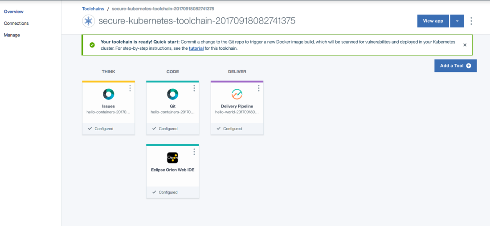

### 用 Eclipse Orion Web IDE 快速开发一个 node js 应用

首先，点击图标进入 Web IDE 的界面，速浏览一下当前的目录结构。

##### 图 2\. Web IDE 的界面

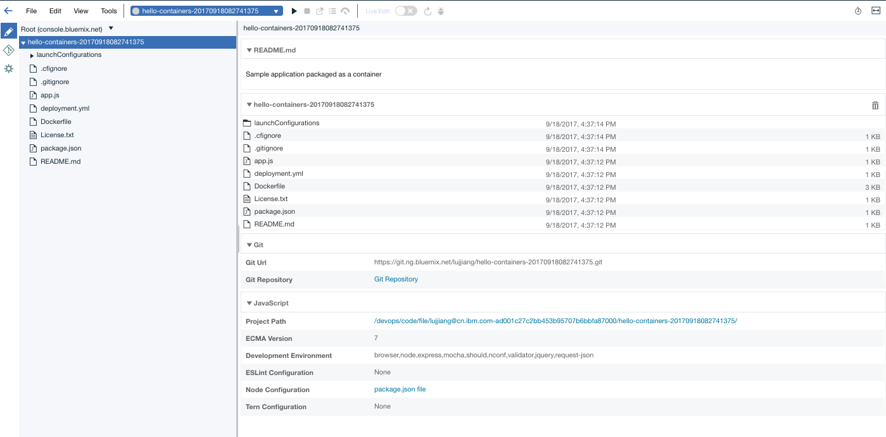

值得注意的是，这个目录结构中包含了一个入口文件 app.js， 以及一个部署文件 Dockerfile。部署文件会在之后用到，在这里不做过多的说明。

##### 图 3\. 快速部署界面


状态栏中”三角形”的运行图标是灰色的，这表明此工程尚未进行部署。点击运行图标就可将工程从当前的工作空间部署到 IBM Cloud 云端。需要注意的是，如果项目最终要被部署到 Kubernetes 上， 那么 ToolChain，Kubernetes cluster 和 Delivery Pipline 应位于同一 Organization 和 space 下，否则部署有可能不成功。另外需要注意的一点，在 launchConfigurations 目录下的\*.launch 文件是部署时候需要用到的配置文件，必要的时候需要做适当的修改。

##### 图 4\. launchConfigurations 文件示意图

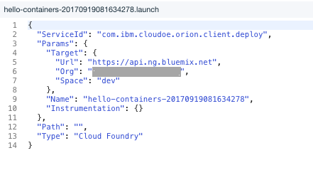

上述的配置文件表示，把工程作为 Cloud Foundry 应用部署在指定的目标环境中。如果最终以 Cloud Foundry 的方式进行部署，那么配置文件不用做任何修改。当然为了测试需要，也可以先用这种方式进行部署，之后通过改变配置文件的方法，修改部署位置。此处还需要注意，package.json 文件里应该包含 scripts 片段，为避免部署会失败，如果缺少请读者手动添加。如下示意图。

##### 图 5\. package.json 文件示意图

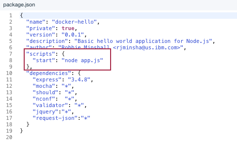

app.js 默认开启的监听端口为 80，但如果以 cloud foundry 应用形式部署，此处无需指定端口。请将 app.js 程序进行改写，具体代码如下所示：

##### 图 6\. cloud foundry 配置示意图

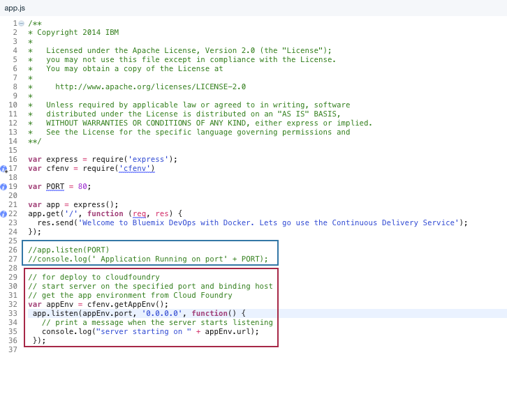

#### 清单 1\. Node.js 代码样例

```
var appEnv = cfenv.getAppEnv();
app.listen(appEnv.port, '0.0.0.0', function() {
// print a message when the server starts listening
console.log("server starting on " + appEnv.url);
});

```

Show moreShow more icon

Node.js 支持 live edit 功能，将其开启能在 IBM Cloud 上快速更新应用实例。

##### 图 7\. 快速更新应用实例

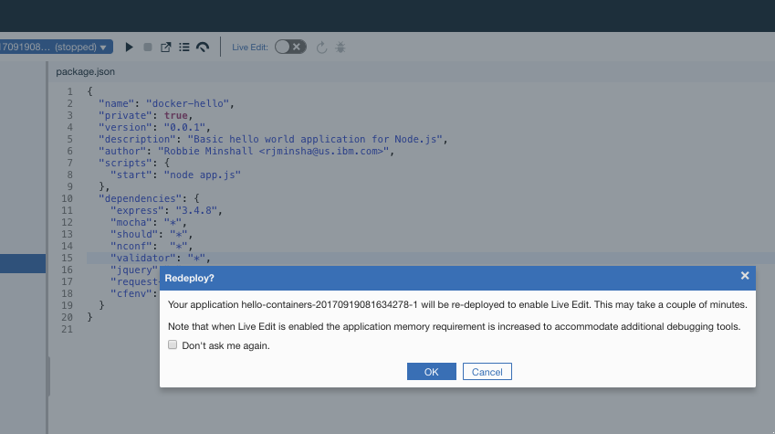

若部署成功则结果如下图所示。

##### 图 8\. 快速部署成功


#### 扩展代码，完成案例需求

### 调用 RESTFUL API 的简单实现

**清单 2\. RESTFUL API 数据调用方法**

```
var options = {
"url": "http://api.worldbank.org/incomeLevel?format=json",
"method": "GET",
"headers":
{ "accept":"application/json" }
};
app.get('/incomeLevels', function (req, res){
request(options, function (error, response, body) {
if (error) return console.error('Failed: %s', error.message);
console.log('Success: ', body);
res.send(body);
});
})
app.get('/countries', function (req, res){
var level = req.query.level; // {String} Country Code
var page = req.query.page;
var per_page = req.query.per_page;
if (!per_page)
per_page = 50;
if (!page)
page = 1;
if (!level) {
options.url="http://api.worldbank.org/incomeLevel?format=json";
}else{
options.url="http://api.worldbank.org/countries?incomeLevel="+level+"&per_page="+per_page+"&page="+page+"&format=json"
}
request(options, function (error, response, body) {
if (error) return console.error('Failed: %s', error.message);
console.log('Success: ', JSON.parse(body)[1]);
res.render('map',{title:"about map", countries:body});
});
})

```

Show moreShow more icon

利用/incomeLevels 返回所有收入水平的代码

运行后，我们在 url 中输入：https:///incomeLevels，返回 json 列表如下：

##### 清单 3\. Json 返回值示例

```

[
    {
    "page": "1",
    "pages": "1",
    "per_page": "50",
    "total": "7"
    },
    [
        {
        "id": "HIC",
        "value": "High income"
        },
        {
        "id": "INX",
        "value": "Not classified"
        },
        {
        "id": "LIC",
        "value": "Low income"
        },
        {
        "id": "LMC",
        "value": "Lower middle income"
        },
        {
        "id": "LMY",
        "value": "Low & middle income"
        },
        {
        "id": "MIC",
        "value": "Middle income"
        },
        {
        "id": "UMC",
        "value": "Upper middle income"
        ｝
    ]
]

```

Show moreShow more icon

同时上例代码还实现了返回收入水平为查询参数的城市列表/countries?level=&per\_page=&page=

per\_page 和 page 是选填的，如果不指定，则默认显示 50 条数据。

在浏览器中输入https:///countries?level=HIC, 结果片段如下：

##### 图 9\. 收入水平返回结果示意图

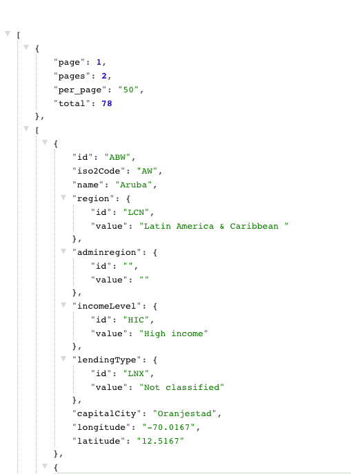

到此，RESTFUL API 代码读取部分就介绍完了。下面将利用 D3 工具包，在地图上展示数据结果。

### 可视化数据

D3 的开发应用不在本文的讨论范围。（文档）

为了实现数据动态加载，需要使用模版引擎。首先在 app.js 文件里面定义模版引擎，选择 handlebars.js 并在 app.js 里增加代码：

var hbs = require(‘hbs’);

app.set(‘view engine’,’html);

app.engine(‘html’, hbs.\_\_express);

接下来，需要添加视图目录。这里采用的方式是添加一个 view 文件夹在目录结构中。view 文件夹下建立 map.html 文件以及世界地图的 GeoJSON 对象。世界地图的 GeoJSON 对象可以从获得。.

##### 图 10\. 可视化配置示意图

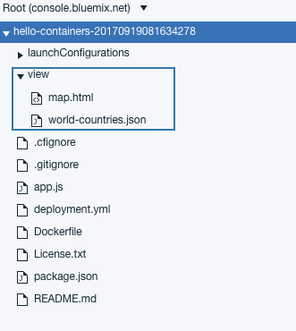

在 map.html 文件，调用 d3 库来绘制地图，并且让数据显示在地图中。

##### 清单 4\. 可视化实现代码示例

```
array.forEach(function(element) {
    var location = xy([element.longitude,element.latitude]);
    svg.append('circle')
    .attr("cx", function(d){return projection([element.longitude,
    element.latitude])[0];})
    .attr("cy", function(d){return projection([element.longitude,
    element.latitude])[1];})
    .attr("r",3)
    .attr("fill", '#29FF57')
    svg.append('svg:text')
    .text(function(d){return element.name;})
    .attr("x", function(d){return projection([element.longitude,
    element.latitude])[0];})
    .attr("y", function(d){return projection([element.longitude,
    element.latitude])[1];})
    .attr("fill", '#000')
    .attr('font-size','9px')
}, this);

```

Show moreShow more icon

运行结果如下图所示：

##### 图 11 . 100 个 HIC 国家分布图

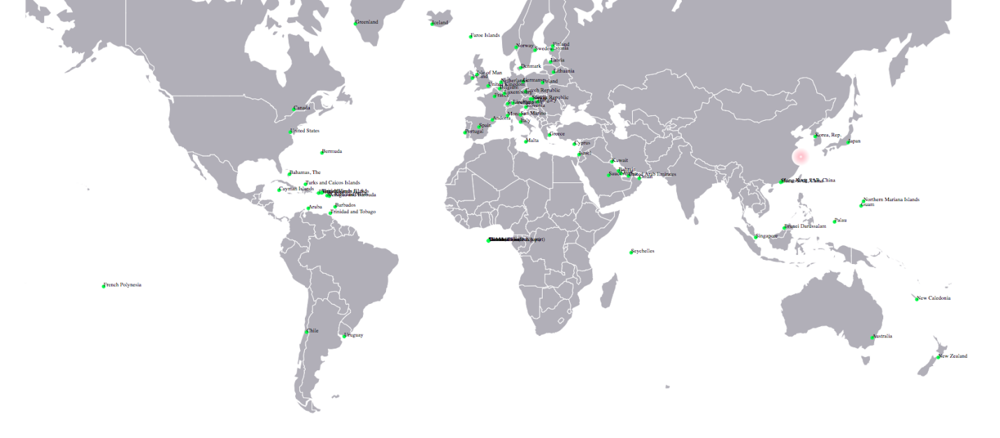

100 个 MIC 国家分布图

##### 图 12\. 中等收入国家示意图

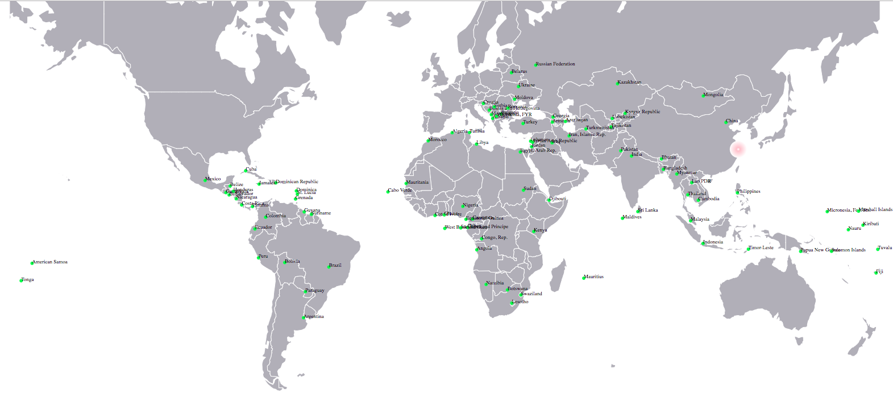

## 制作 docker image

到现在为止，在 Web IDE 上进行开发并自动部署到 Blumix 成为 cloudfoundry 应用的演示已经完成了。如果要将工程部署到生产环境 Kubernetes 中，首先需要制作 docker image。

Web IDE 目前不支持自动部署到 Kubernete 中。所以，需要先将代码同步到 GIT 上。点击 Git 图标，选择需要同步的代码，填写 comment 并且提交。

##### 图 13\. GIT 同步示意图

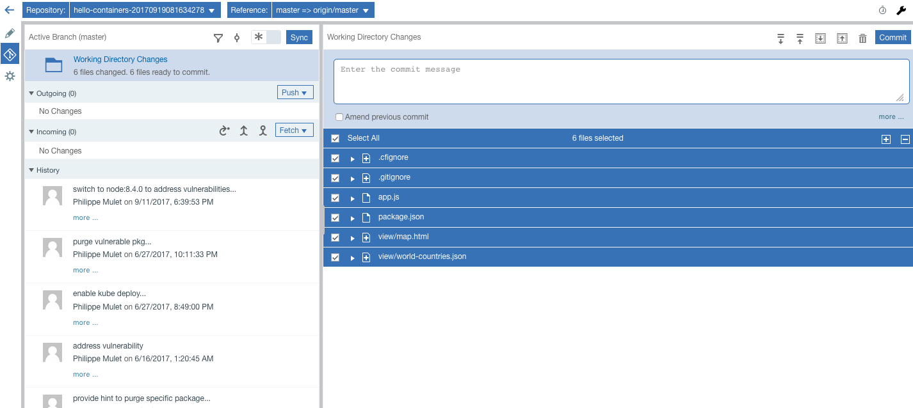

提交后需要完成代码推送。

##### 图 14\. 代码提交示意图


接下来回到 toolchain 的界面，点击 Git 图标。

##### 图 15\. 从 ToolChain 进入 GIT

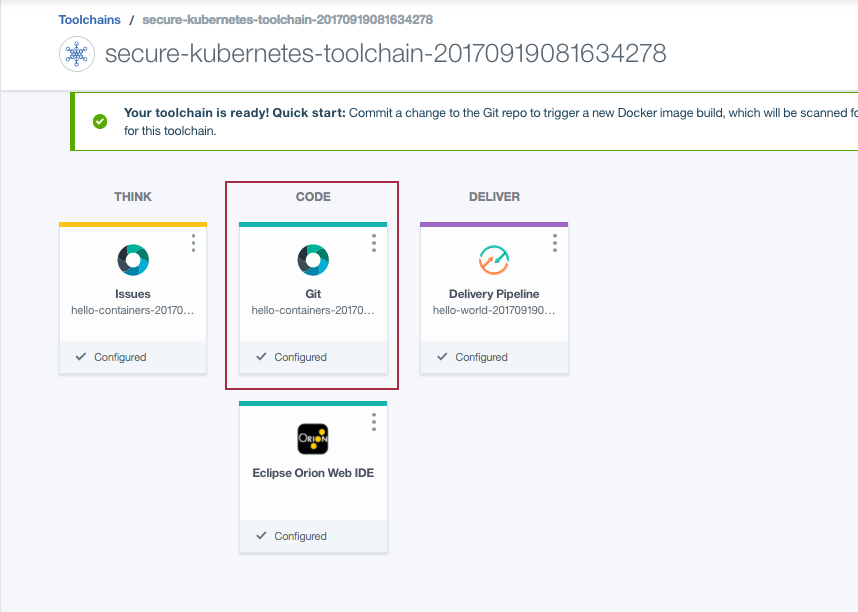

利用 Toolchain 可以自动部署工作到 Kubernetes 上，此处为了便于理解对制作 image 的方法进行简单的讲解。首先，将代码 pull 到本地制作 docker 镜像，并且进行测试。

默认的 dockerfile 将代码部分全部放到 app 目录下。在这里需要做适当修改，将 view 目录也放入 app 目录下。

**清单 5\. Docker file 命令示例**

```
ADD package.json /app/package.json
RUN cd /app && npm install
ADD app.js /app/app.js
ADD ./view /app/view
ENV WEB_PORT 80
EXPOSE 80

```

Show moreShow more icon

Dockerfile 指定 expose 的端口为 80。 在 Web IDE 上开发时，由于 IDE 自动部署为 cloud foundry 应用，不可以使用指定 80 端口，所以对代码进行了修改。此处，需要在 Node.js 中重新设置监听端口。经过本地测试，docker image 可以在本地正常使用。

## 结束语

利用 Toolchain 自动部署工程到 Kubernetes 的方法将在之后的文章中进行介绍。