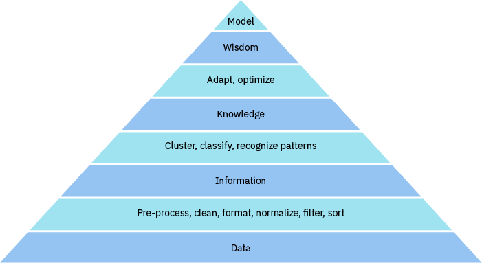

# 从数据到知识
了解信息科学是如何取得重大飞跃的

**标签:** 分析,金融

[原文链接](https://developer.ibm.com/zh/articles/ba-data-becomes-knowledge-1/)

Vinay Rao

发布: 2018-04-04

* * *

过去几年，信息科学取得了重大进展。随着本地服务器给云服务让道，SQL 数据库和数据表开始朝 NoSQL 和键值对数据存储迁移。随后，为了处理大量的、品种繁多的、快速生成的数据，大数据和相关的扩展技术应运而生。

**DIKW 模型**

- **数据：** _数据_ 是事实、信号或符号的集合。在这种形式下，数据可能是原始、不一致或杂乱的。因此，这种数据没有用。
- **信息：** _信息_ 是按一致的方式整理和排序的数据集合。信息形式的数据变得更有用，因为它很容易存储和检索。
- **知识：** _知识_ 是信息及其相关上下文的集合。上下文表现为不断收集的信息集之间的关系。知识是处理一些信息的经验结果。
- **智慧：** _智慧_ 是根据知识来选择达到目标结果的最佳方式的能力。智慧是对达到某个成功结果的早期尝试的经验结果或知识。

硬件和软件的重大进步使这一切成为可能。数据存储并不昂贵；因此，可以很便宜地存储大量数据。

数据分析理解所有这些数据并从中生成信息。根据此信息，您可以制定决策并采取行动。结果是数据分析领域得到了相应的发展。诸如机器学习和深度学习之类的认知处理，现在增强了分析能力。

分析师需要清理输入数据并检查其有效性，然后才能将数据用于分析。结构化数据可以轻松进行检索，所以在开始执行数据分析之前，必须准备好原始数据并将其格式化。数据-信息-知识-智慧 (DIKW) 模型有助于理解如何将原始数据变成为有用的信息，然后变成为知识，最后变成为智慧。

## 关于本系列

“数据如何转化为知识”系列包含三篇文章：

- **从数据到知识**：这篇文章探索了从原始数据到存储的知识的路径。它识别了各种数据源，以及结构化数据与非结构化数据之间的区别。然后，它识别了在将 DIKW 模型应用于数据科学之前，是什么让数据具有价值。

- **[数据湖和数据沼泽](https://www.ibm.com/developerworks/cn/analytics/library/ba-data-becomes-knowledge-2/index.html)**：这篇文章介绍了围绕数据湖和数据仓库的术语，探索了数据湖的革新和优势，并解释了机器学习的出现如何成为向数据湖架构转型的令人信服的理由。通过将数据加以结构化并编目来对数据进行管理，使其更实用且更有价值。了解并且能够信任数据源和数据是确保高质量数据的关键因素。数据治理在这方面可以提供帮助。

- **[提取暗数据](https://www.ibm.com/developerworks/cn/analytics/library/ba-data-becomes-knowledge-3/index.html)**：本系列中的这篇文章探讨了导致创建暗数据的因素，为了更有效地综合处理和管理数据而采取的步骤，以及在这之后可用来提取和使用暗数据的方法。在所有数据中，90% 的数据属于非结构化数据，这导致难以进行有效查询。机器学习可帮助实现数据结构化，从而提升暗数据的查询效率。关系数据更有价值，原因在于它可以生成更实用的洞察。

## 数据源

原始数据来自各种不同的来源。传统的关系数据库一直都是一个重要的数据来源。另一个主要的数据来源是机器生成的实时数据，比如来自物联网 (IoT) 设备的数据。数据挖掘工具爬取网站或社交媒体并生成数据。机器还会生成事务或日志文件形式的数据。

人类在数字媒体上的互动生成了文本、电子邮件、图像和视频形式的数据。人脑善于从这些各种各样的媒体格式中提取信息。相比之下，读取这类数据对计算机而言是一大挑战。机器倾向于生成结构化数据，而人类倾向于生成非结构化数据。

### 结构化和非结构化数据

结构化数据具有严格的组织结构，这使它可以轻松地存储在关系数据库中。简单的查询和搜索算法可以高效地检索此数据，这使计算机能够轻松高效地处理结构化数据。

相反，非结构化数据缺乏一种机器可读的结构。人类目前能比机器更好更高效地读取和提取这些数据，但这项工作既耗时间又耗精力。以人类为中心的流程也很容易出错。那么，是什么使得数据具有价值，您又如何应用 DIKW 模型呢？

## 是什么使得数据具有价值？

数据通常是一堆原始事实，用户需要对它进行筛选，才能准确地解释和组织数据。直到那时，数据才变得有用。数据也有多种格式。例如，图像和视频可能包含大量数据，需要解释这些数据才能从中提取信息。审查数据并从中过滤出相关事实的过程需要花费大量的时间和资源。此过程也是主观、不一致且容易出错的。

相较而言，信息是一个采用一致方式进行组织的结构化事实的集合。用户花费更少的时间和精力就能找到相关事实。他们可以轻松地在信息中找到相关的或重要的类别。所有这些让信息变得比原始数据更有价值。

知识来源于如何应用信息来回答或解决问题。换言之，具有上下文或含义的信息就是知识。之前的成功成果充当着将此上下文分配给信息的基础。因此，知识依赖于对成功结果的记忆（或学习），所以将信息转换为知识的过程是决定性的。同样地，此过程需要花费大量的时间和资源；因此，知识比简单信息更有价值。

在经过数据分析后，数据会变得更相关、更有用和更有价值。实际问题没有简单的解决方案：要解决问题，必须应用来自多种上下文的信息。通过组合数据源，有助于提供在解决实际问题和制定决策时很有用的各种上下文。简言之，数据在满足以下条件时就具有价值：

- 可以迅速获得。
- 简洁、经过很好的组织，而且是相关的。
- 具有基于经验的含义和上下文。
- 是多个数据源的一种聚合。

当数据能够减少解决问题所需的时间、精力和资源，帮助用户制定合理决策时，数据就是一种有价值的商品。

## DIKW 模型变体

DIKW 模型存在许多变体。一种变体是 Milan Zeleny 在 1987 年提出的 DIKWE，它添加了一个顶点层来表示 _启发_ 。另一种变体是 Russell Ackoff 在 1989 年提出的 DIKUW，它添加了一个中间层来表示 _理解_ 。一些专家将此变体建模为 _DIKIW_ ，其中第二个 _I_ 代表 _洞察_ 或 _情报_ 。

DIKW 模型有助于我们描述解决问题或制定决策的方法。尽管该模型是在机器学习出现之前开发的，但它仍对数据科学和机器学习中使用的许多概念进行了建模。

知识是数据中最有价值的精华，尽管知识提供了解决问题的途径，但它不一定会告诉你最好的问题解决方式。挑选达到目标结果的最佳方式的能力，源于从对实现成功解决方案的早期尝试中获得的经验。

智慧是为了获得某种成功结果选择最佳实现方式的能力。人类通过经验和知识来获取智慧，一些智慧来自：

- 培养对问题解决方法的理解
- 通过分析给定上下文的数据和信息来开发洞察
- 从解决相同问题的其他人那里收集情报

DIKW 模型的许多变体现在都开始变得有意义。

### 在数据科学和机器学习中的应用

您已看到，在人们执行重复性任务时，这些任务是容易出错、不一致和主观的。您还注意到，机器无法很好地处理非结构化数据。人类善于解释非结构化数据，评估选项和风险，并在分秒内决定一连串操作。

运行传统算法的机器很难实时完成相同任务，主要是因为编程变得越来越复杂。按顺序评估许多选项和导航决策树非常耗时。并行算法是一种替代方案，但它们需要很高的处理能力。不过，即使提高了这项能力，这些算法也无法轻松地适应和应对实际问题的不确定性，尤其是在数据是非结构化数据时。

根据人脑细胞建立的神经网络几十年前就已出现，但缺乏合适的计算机处理器架构来发挥它们的效力。面向通用计算的图形处理单元架构的发展，使神经网络得以盛行。这一发展导致使用机器学习来处理非结构化数据的案例的激增，而且取得了巨大的成功。

[应用于数据科学的 DIKW 模型](#应用于数据科学的-dikw-模型) 展示了如何针对数据科学来调节 DIKW 模型。浅色层显示了传统的 DIKW 模型；深色层显示了将数据提炼到上一层的流程。

##### 图 1.应用于数据科学的 DIKW 模型

传统数据科学方法能处理第一个流程层：将原始数据转换为信息。机器学习现在能帮助用户从信息中提取知识。机器学习算法通过识别模式、对信息进行分组或分类，从信息中寻找上下文。数据科学家创建机器学习模型的方式是：使用手动优化和调节来实现最佳结果，并选择最适合特定任务的模型。但是，深度学习的出现意味着机器也可以自主执行这些任务。

### 深度学习

深度学习是机器学习中的一个专门的子集，灵感来源于神经科学和人脑的工作原理。深度学习算法不同于其他机器学习算法，因为它们使用了许多层的多种类型的神经网络。这些层形成一个结构化分层，就像人脑一样，将前一层的输出传递给下一层。

各层的这种级联方式，使得深度学习网络能学习抽象概念，执行比简单的、单任务的模式识别和分类更复杂的任务。深度学习算法可以同时使用监督学习和无监督学习，通常会混合使用这些学习方法，这使得它们在用于实际应用中时具有自适应能力。

用于实时语音、图像和视频处理应用时，深度学习算法可以处理通常由嘈杂的环境因素导致的不确定或不完整输入。因此，它们具有的准确率比简单的机器学习算法要高得多。

## 结束语

当数据能够能减少解决问题所需的时间、精力和资源，帮助我们制定合理决策时 — 它就是一种具有价值的商品。机器可以高效地处理结构化数据，但在所有数据中，90% 的数据是非结构化数据，包括文本、电子邮件、图像和视频。

人类比机器更适合处理非结构化数据，但人类在执行重复性任务时容易出错、不一致且具有主观性，这些重复性任务包括从非结构化数据中提取信息和将它存储为结构化数据。此过程也需要消耗大量的时间、资源和精力。

DIKW 模型可以帮助我们理解将数据转换为信息和知识的背后流程。机器学习技术有助于更轻松地提取知识，甚至通过调节和优化成功结果来自主提取知识。因此，深度学习使增强数据分析成为可能，显著减少了解决问题所需的时间、精力和资源，还能帮助我们制定合理决策。本系列的第 2 部分将展示数据湖如何允许存储大量多格式数据，从而帮助加速数据摄入和降低摄入成本。

本文翻译自： [From data to knowledge](https://www.ibm.com/developerworks/library/ba-data-becomes-knowledge-1/)（2018-04-04）