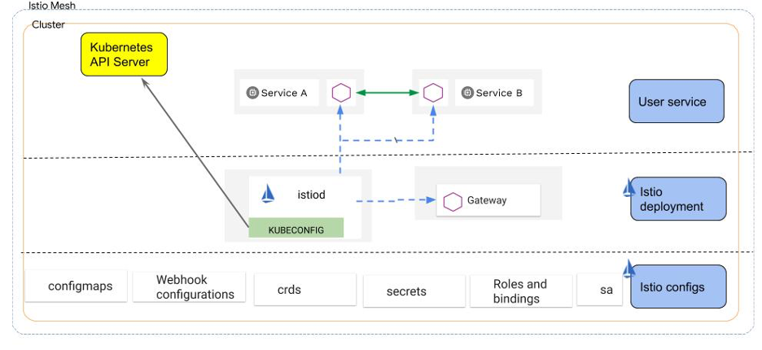
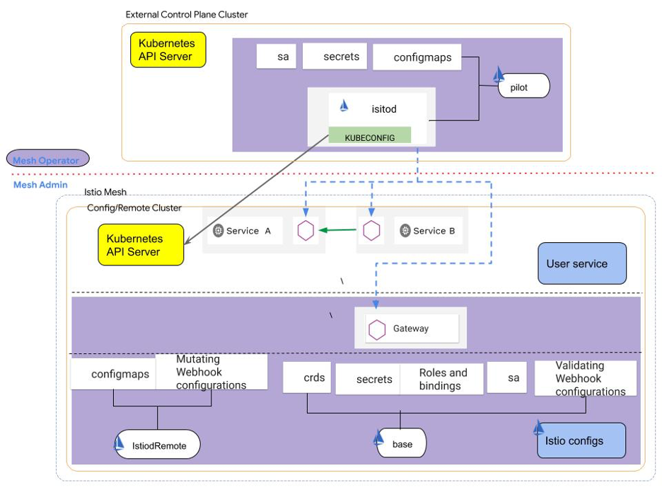
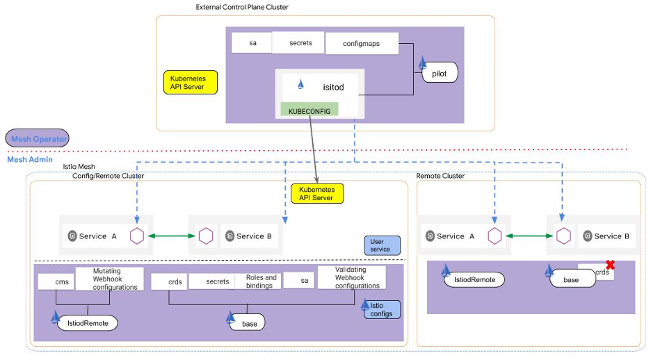
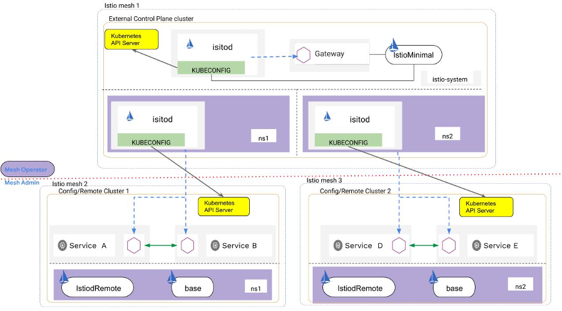

# 仔细了解 Istio 安装工件和外部控制平面
探索 Istio 安装中实际包含的组件

**标签:** Istio,容器

[原文链接](https://developer.ibm.com/zh/articles/take-a-closer-look-at-istio-install-artifacts-and-the-external-control-plane/)

Lin Sun, Iris Ding

发布: 2020-09-24

* * *

[Istio](https://istio.io/) 是一种开源服务网格平台，它可以控制微服务之间的交互方式。如果您听说过 Istio 或者已经安装了 Istio，则您可能会熟悉 Istio [单集群图](https://istio.io/latest/docs/concepts/what-is-istio/#why-use-istio)。

您是否曾想过，在通过 istioctl install 命令安装默认配置文件时到底安装了哪些组件？ 在这篇博客文章中，我们将查看 Istio 安装工件，并讨论如何将这些工件与默认 Istio 安装配置文件以及 Istio 1.7 中新增加的 [外部控制平面模型](https://istio.io/latest/blog/2020/new-deployment-model/#external-control-plane-deployment-model) 一起使用。

## 默认 Istio 安装中包含的组件

下图显示了在完成 Istio 的 [默认安装](https://istio.io/latest/docs/setup/install/istioctl/#install-istio-using-the-default-profile) 后如何在集群中部署资源：



我们来仔细了解这些层中包含的具体内容：

### 部署和服务工件

- [Istiod](https://istio.io/latest/blog/2020/istiod/)：Istiod 是 Istio 控制平面的核心，它提供了一个认证中心 (CA) 服务器、一个 Envoy [xDS](https://www.envoyproxy.io/docs/envoy/latest/api-docs/xds_protocol) 服务器和两个 Webhook 服务器。同时还提供了多种 Istio 配置（例如下面列出的配置），这些配置可确保 Istiod 被正确启动，并能够安全地与网格中的 Sidecar 代理进行通信。
- 网关：Istio [入口网关](https://istio.io/latest/docs/concepts/traffic-management/#gateways) 可控制网格的入站流量。

### Config

- **自定义资源定义 (CRD)**：各种 Istio CRD（例如，网关、虚拟服务、目标规则等）。
- **ConfigMap**：提供了两个主要 ConfigMap，它们分别用于存储有关网格和注入模板配置的信息。如果您需要 [更改默认网格运行时配置](https://istio.io/latest/docs/reference/config/istio.mesh.v1alpha1/) 或者需要使用自己的 [注入模板](https://istio.io/latest/docs/setup/additional-setup/sidecar-injection/)，则可以编辑这两个 ConfigMap。
- **[Admission Webhook 配置](https://kubernetes.io/docs/reference/access-authn-authz/extensible-admission-controllers/#what-are-admission-webhooks)**：两个 Istio Webhook（即，验证 Webhook 和 Sidecar 注入器 Webhook）配置。其中包括触发规则、failurePolicy、Webhook 服务器地址以及 CA bundles 等。（这些配置可以确保 webhook client 能正确的跟运行在 Istiod 服务上的 webhook server 通信）。
- **服务帐户和服务角色绑定等**：这可确保 Istiod 对不同种类的资源（例如，名称空间、服务、自定义资源、配置映射等）具有正确的访问权限。
- **Secret**：存储与服务帐户或 Istiod 相关的密钥、证书和凭证。如果未插入任何外部证书，则 Istiod 会将其根证书保存到 `Istio-ca-secret` 中。用户也可以在 `cacerts` Secret 下插入自己已有的根证书，Istiod 也会在内部使用根证书；例如，使用根证书来修补 Webhook 配置的 CA bundle。

Istiod 会从这些 Istio 配置中读取信息以完成其启动过程，然后启动 CA、xDS 和 Webhook 服务器。一旦网格中的 Sidecar 代理连接到 Istiod，Istiod 就会开始将配置推送到 Sidecar 代理。

网格管理员可以通过 ConfigMap 或者通过 Istio 网格级资源（例如 [身份验证策略](https://istio.io/latest/docs/tasks/security/authentication/authn-policy/)）或边缘配置（例如 [网关](https://istio.io/latest/docs/reference/config/networking/gateway/) 资源）来与 Istio 进行交互。服务所有者可以通过名称空间或服务级配置（例如，虚拟服务、目标规则或名称空间/服务级身份验证策略）来与 Istio 进行交互。

## 外部控制平面部署模型

Istio 1.7 为网格操作员和网格管理员引入了外部控制平面部署模型。在此模型中，Istiod 是在外部集群上运行的，如下图所示。要深入了解我们为何引入此模型以及如何为网格管理员提供简化的体验，可阅读 [在网格外部部署 Istio 控制平面](https://istio.io/latest/blog/2020/new-deployment-model/) 博客文章。



我们来仔细看看这个部署模型。在此设置中，网格操作员应首先使用 `istiodRemote` 和 `base` 组件来设置 `Config/Remote Cluster`。然后，网格操作员应在外部控制平面集群上安装 Istiod，并通过 `istio-kubeconfig` Secret 将其 KUBECONFIG 配置为 `Config/Remote Cluster`。`Config/Remote Cluster` 不仅充当 `config cluster`（因为 istiod 会从集群中读取配置），还充当 `remote cluster`（因为它也运行用户的服务）。

下面是网格操作员在 Config/Remote 集群上安装轻量级 Istio 时可使用的样本代码片段：

```
apiVersion: install.istio.io/v1alpha1
kind: IstioOperator
spec:
addonComponents:
    prometheus:
      enabled: false
components:
    base:
      enabled: true
    ingressGateways:
    - enabled: true
    istiodRemote:
      enabled: true
    pilot:
      enabled: false

```

Show moreShow more icon

当网格操作员使用 `istioctl` 部署上面的样本代码片段时，该命令实质上会指示 istioctl 在集群上安装基础组件和 `istiodRemote` 组件。注意，pilot 处于禁用状态，这主要是为了将 Istio 安装程序配置为不在集群上安装 Istiod。

下面是网格操作员在外部控制平面集群上安装 Istiod 时可以参考的样本代码片段。在外部控制平面集群上不会安装 CRD 和 Webhook 配置，因此无需在该集群上安装 `base` 组件。

```
apiVersion: install.istio.io/v1alpha1
kind: IstioOperator
spec:
components:
    base:
      enabled: false
    ingressGateways:
    - enabled: false
    pilot:
      enabled: true
values:
global:
    operatorManageWebhooks: true

```

Show moreShow more icon

当网格操作员使用 istioctl 将上面的样本代码片段部署到外部控制平面集群时，系统会指示 istioctl 在该集群中安装 Istiod 控制平面（pilot 组件），而不必安装基础配置或任何 Webhook 配置。对于想要进一步了解这方面信息的网格操作员，可以按照外部 istiod 单集群 [分步指南](https://github.com/istio/istio/wiki/External-Istiod-single-cluster-steps) 来试验。

上图显示了作为 Istio 网格数据平面的单个集群。网格管理员可以将远程集群扩展到多个集群，所有这些集群都由运行在“外部控制平面集群”中的同一个 Istiod 来管理。

注意，其中一个远程集群也充当配置集群，并且网格管理员只需在网格范围内对配置集群进行配置即可。同样，网格管理员和用户只需将 Istio 资源部署到配置集群即可。外部 istiod 从配置集群中读取配置，并将其推送到配置集群和远程集群中的所有 Sidecar 代理。与配置集群不同，远程集群没有安装 CRD。下图显示了此配置：



网格操作员可以进一步扩展此部署模型，以便从运行多个 Istiod 的外部控制平面集群中管理多个 Istio 网格，如下图所示



网格操作员可以在外部控制平面集群上托管多个 Istiod，并且每个 Istiod 负责管理自己的配置/远程集群。网格操作员可以在外部控制平面集群中安装自己的 Istio 网格（例如，最小配置文件或默认配置文件），并配置其 Istio 入口网关，以将配置/远程集群之间的流量路由到匹配的 istiod 部署。

入口网关可以在 Istiod 所需的端口上执行 TLS 直通（目前，xDS 服务器使用 15012，而 Webhook 服务器使用 15017），因此可以通过相互 TLS 来持续保护从配置/远程集群中的 Sidecar 代理到其 isidod 的通信。网格操作员可以参考 [这些步骤](https://github.com/istio/istio/wiki/External-Istiod-single-cluster-steps#deploy-istio-mesh-on-external-control-plane-cluster-to-manage-traffic-to-istiod-deployments)，以了解有关如何配置其 Istio 入口网关的更多信息。

## 结束语

我们很高兴在 Istio 1.7 中引入了这个外部控制平面模型。这样，IBM 等供应商便可以向 Istio 网格管理员提供“Istio 即服务”，而网格管理员不必考虑如何运行和管理 Istio 控制平面。这进一步简化了网格管理员的操作，让网格管理员可以集中精力与服务所有者一起用网格整合服务，并利用 Istio 来满足其业务需求。

本文翻译自： [Take a closer look at Istio install artifacts and the external control plane](https://developer.ibm.com/articles/take-a-closer-look-at-istio-install-artifacts-and-the-external-control-plane/)（2020-09-09）