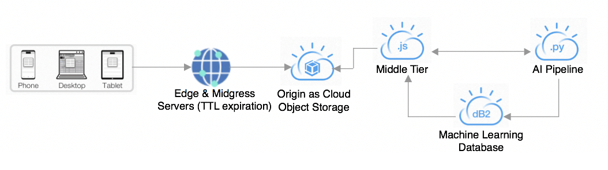
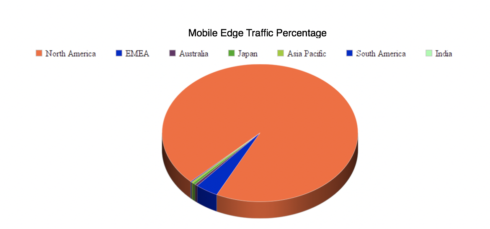

# 代码的背后：AI Fantasy Football 洞察的移动化
无论您在世界何处，都可以选择最佳的球员

**标签:** IBM Cloud,云计算,人工智能,对象存储,游戏,自然语言处理

[原文链接](https://developer.ibm.com/zh/articles/watson-behind-the-code-fantasy-football-2018-part5/)

Aaron K. Baughman, Micah Forster

发布: 2018-11-27

* * *

**免费试用 IBM Cloud**

利用 [IBM Cloud Lite](https://cocl.us/IBM_CLOUD_GCG)
快速轻松地构建您的下一个应用程序。您的免费帐户从不过期，而且您会获得 256 MB 的 Cloud Foundry 运行时内存和包含
Kubernetes 集群的 2 GB 存储空间。 [了解所有细节](https://www.ibm.com/cloud/blog/announcements/introducing-ibm-cloud-lite-account-2) 并确定如何开始。

ESPN 和 IBM 携手合作，为 Fantasy Football 球队所有者带来了全新的洞察：Watson AI。#FantasyFootballFace。Watson 基于一个企业级的机器学习管道来读取、理解和领悟有关 Fantasy Football 的数百万份文档和多媒体来源。ESPN Fantasy Football with Watson 系统是一个包含许多组件的庞大系统。

此文章 [系列](https://developer.ibm.com/zh/series/watson-behind-the-code-fantasy-football-2018/) 分 8 部分，本文是第 5 部分，将带您了解每个组件，展示我们如何使用 Watson 构建世界级的 AI 解决方案。

## AI Fantasy Football 洞察的移动化

无论您去哪儿，无论您身在世界何处，Watson 都能提供 Fantasy Football 洞察，让您选择最好的球员。如果您在度假、因公出差或在旅途中，Watson 会提供清晰的交互式体验，使您能够及时制定 Fantasy Football 决策。在比赛开始前几分钟，可以通过大多数移动设备检查某位存在问题的球员的状态。任何影响预测或模拟的最新突发新闻，都会实时反映出来并可供访问。您可以在世界任何地方借助 AI 优势来经营 Fantasy Football，从而避免输掉比赛。

该移动应用程序可在 iOS、Android 和桌面环境中使用。该应用程序中使用的每个 JavaScript 库，比如 AppMeasurement、Axios、D3、Promise、Fuzzy 集合、jQuery、Lodash 和时区，都存储在 IBM [内容交付网络](https://www.ibm.com/cloud/cdn) (CDN) 中。此外，级联样式表 (CSS)、字体和图像也可以通过 CDN 从 Object Storage 来源中获取。数十亿的用户请求都不会访问来源（命中率 95.95%）。只有在数据被清除、有效期 (TTL) 过期或边缘与来源上的内容之间发生变化时，流量才会传到来源处。Object Storage 中的每个存储桶都是一个针对特定内容类型的容器。口碑、深度学习输出、证据、伤病报告、球员信息、得分分布、情绪、关键词、交易信息和容量统计，这些都保存在按区域分隔的不同的桶中。分散在美国各处的共计 39 个存储桶被映射为 CDN 来源。



例如，Object Storage 中的 dallasbuzz 桶被映射为路径 /dallas/buzz。打开相应的端口来启用每个移动客户端的访问。为边缘服务器上的有效期部分选择一个通用的 TTL 设置。可以通过 IBM CDN 控制台或通过应用程序编程接口 (API) 执行手动清除。关闭基于浏览器的缓存以避免数据过时。

可以使用 IBM Cloud DNS 等域名服务 (DNS) 来将域名解析为 IP 地址。对于 Fantasy Football，已设置了一个 CNAME 或规范名，以便多个名称可以引用原始 DNS 名称。在设置时，CDN 提供了一个已添加到我们的 DNS 中的额外 CNAME，以便可以找到该服务。达拉斯、伦敦和德国地区的内容均由 Python 应用程序写入。在 Object Storage 来源内，该地区的一个状态桶指示了更新该内容的最新时间。包含最新信息的地区是通过移动应用程序进行选择的。

在 30 天的时间内，该移动应用程序执行超过 450 亿次点击，并使用超过 5.93 PB 的 AI 洞察。大部分流量都来自北美。包括欧洲、中东和非洲在内的地区远远地排在第二位。



移动应用程序代码是使用 VueJS JavaScript 框架编写的，该框架支持单页应用程序 (SPA) 体验。VueJS 使应用程序能够分解为可重用的组件，这些组件通过使用发布-订阅模式来相互通信。以下代码演示了 VueJS 组件的分配。

```
Vue.component('news-analytics', NewsAnalytics);
Vue.component('projections', Projections);
Vue.component('SelectedPlayersDetails', SelectedPlayersDetails);

```

Show moreShow more icon

VueJS 组件的调用或装载由 VueJS 的路由器插件所解释的 URL 决定。在 Fantasy Football 应用程序中，路由器会解析该 URL 来获得所需的字段，与该路径有关联的组件会使用 Axios 库从 CDN 异步抓取数据。这使您能够基于 URL 参数动态查看球员信息。

```
const router = new VueRouter({
            routes: [
            {
                path: '/',
                component: Home,
                children: [
                    {
                        path: 'playerCard/:playerid/leagueId/:leagueid/teamId/:teamid'
                    }
                ]
            }
            ]
        });

```

Show moreShow more icon

如先前所述，与该路径有关联的组件将负责获取已解析的值，并抓取合适的数据。在本例中，由 Home 组件负责完成此工作。从 API 调用异步返回 JSON 数据后，Home 组件会向监听此特定事件的每个子组件发出消息。

```
//player API method declaration
getPlayer1APIData: function(player1Data) {
        return axios.all([getSentiment(player1Data), getPlayerInfo(player1Data), getPlayers(),
                                     getPlayerEvidence(player1Data), getPlayerVolume(player1Data),
                                    getPlayerProjection(player1Data), getPlayerLikelihood(player1Data),
                                    getInjuryStatus(player1Data)])
                    .catch(function(err) {
               console.error(err);
       });

//player API method invocation
_this.getPlayer1APIData(_this.player1Id)
        .then(axios.spread(function(projection, likelihood, keywords, injuryStatus) {

//publish message to children components
Event.$emit('injuryStats’, injuryStatus);
Event.$emit('likelihood’, likelihood);
Event.$emit('projections’, projection);
Event.$emit('keywords’, keywords);
        }));

```

Show moreShow more icon

Axios 库提供了一种同时发出多个 Asynchronous JavaScript and XML (Ajax) 请求的便捷方法，那就是在函数声明中使用 `all` API 来允许返回多个响应值。使用 `spread` API 可以解析来自原始 `all` 请求的数据，以便按照在函数的参数签名中声明 API 请求的顺序来赋值。

VueJS 为开发人员公开了 lifecycle API 挂钩（hook），以控制他们各自的组件中的数据流。一些常用的挂钩包括 `mounted`、`updated`、`created` 和 `watch`。在某些情况下，子组件会通过其父组件模板中的声明式属性来继承数据。有时，由于某个 API 调用尚未解析，此数据在装载子组件后才可用。在此情况下，调用 watch 挂钩很有用。当父组件从 API 调用返回数据时，依赖于此数据的子组件会监听对此属性的更改，并进行相应更新，以便稍后在视图中反映出来。

```
//Home (Parent Component)
let Home = {
        ….
        template: ‘…
                <AutoComplete :items=”player_array”></AutoComplete>
...
                          ‘,
        ….
}

//Autocomplete watch hook
watch: {
             items: function(value, oldValue) {
                  if(value !== oldValue) {
                      //update dependent value
                 this.isLoading = false;
                  }
             }
          },

```

Show moreShow more icon

每次我们更改 SPA 代码，都会通过 curl 将内容上传到 Object Storage 来源。上传过程分为两步。第一个 curl 将 HTML 文件作为 HTML 内容进行上传。第二个 curl 更新用于公开访问的标头信息。

```
curl -X "PUT" "https://<host>/<context>/index.html" \
 -H "Authorization: Bearer <token>" \
 -H "Content-Type: text/html"  \
 --data-binary "@<file>"

```

Show moreShow more icon

```
curl -X PUT "https://<hostname>/<context>/<file>.html?acl" -H "Authorization: Bearer <token>" -H "x-amz-acl: public-read"

```

Show moreShow more icon

上传 SPA 后，Watson 可以将 AI 洞察提供给连接互联网的任何在旅途中的人。通过 Watson 扩展 ESPN Fantasy Football 的覆盖范围，可以帮助您从全球任何角落（理论上讲，包括外太空）筛选基于证据的洞察。#WinWithWatson

下次当我讨论证据与 AI 管道的结合使用时，可以回顾一下这里的内容。要了解更多信息，请在 Twitter 上关注 Aaron Baughman：@BaughmanAaron。

ESPN Fantasy Football 徽标是 ESPN, Inc. 的商标。经 ESPN, Inc. 许可使用。

本文翻译自: [Behind the code: AI Fantasy Football insights go mobile](https://developer.ibm.com/articles/watson-behind-the-code-fantasy-football-2018-part5/)（2018-11-27）