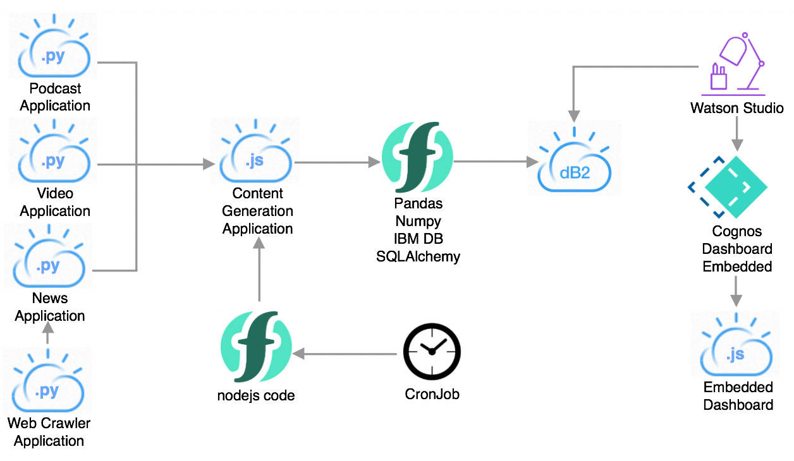
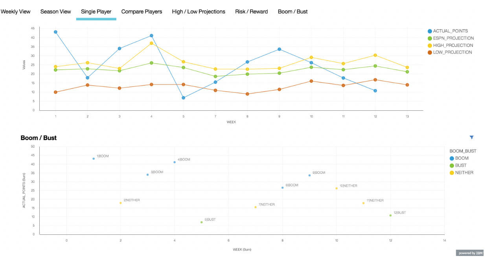
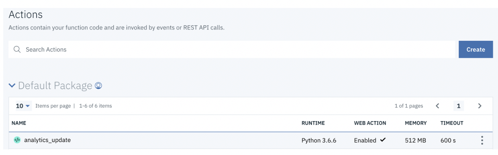

# 代码的背后：AI Fantasy Football 深度可视化
可视的证据基础可以在您选择球队人员时提供全面意见

**标签:** IBM Cloud,云计算,人工智能,对象存储,游戏

[原文链接](https://developer.ibm.com/zh/articles/watson-behind-the-code-fantasy-football-2018-part7/)

Aaron K. Baughman, Gray Cannon

发布: 2018-12-05

* * *

ESPN 和 IBM 携手合作，将数百万篇新闻文章与传统的足球统计数据联系起来，为 Fantasy Football 球队所有者带来了全新的洞察。Watson 基于一个企业级的机器学习管道来读取、理解和领悟有关 Fantasy Football 的数百万份文档和多媒体来源。ESPN Fantasy Football with Watson 系统是一个包含许多组件的庞大系统。

此文章 [系列](https://developer.ibm.com/zh/series/watson-behind-the-code-fantasy-football-2018/) 分 8 部分，本文是第 7 部分，将带您了解每个组件，展示我们如何使用 Watson 构建世界级的 AI 解决方案。

## AI Fantasy Football 深度可视化

**免费试用 IBM Cloud**

利用 [IBM Cloud Lite](https://cocl.us/IBM_CLOUD_GCG)
快速轻松地构建您的下一个应用程序。您的免费帐户从不过期，而且您会获得 256 MB 的 Cloud Foundry 运行时内存和包含
Kubernetes 集群的 2 GB 存储空间。 [了解所有细节](https://www.ibm.com/cloud/blog/announcements/introducing-ibm-cloud-lite-account-2) 并确定如何开始。

ESPN 的 Fantasy Football 分析师、编辑和制作者使用深度可视化来创建内容，为您提供球队洞察。人类的聪明才智与 Watson 的机器 AI 相结合，在 Fantasy Football 中为您提供了前所未有的成功优势。Watson 提供的可视化功能可以显示每位球员每周的表现优劣和排名顺序。证据是从数百万篇新闻、博客和视频的上下文中获得的。可以在 ESPN.com、ESPN Fantasy App 和 Fantasy Show with Matthew Berry 上的各种内容中找到 IBM Watson 洞察。可视的证据基础可以在您选择球队人员时提供全面意见。#WinWithWatson.

Watson 机器学习管道每天会读取、理解并领悟超过 200 万篇新闻文章、视频和播客。在足球赛季的前 9 周，Fantasy Football with Watson 为数百万 ESPN Fantasy 玩家提供了超过 122 亿的洞察。这些海量且多样化的数据由 3 个 Python 应用程序进行处理，这些应用程序作为 Cloud Foundry 应用程序部署在 IBM Cloud 上。每个 Python 应用程序处理一种特定的内容形式，比如新闻。生成的洞察被插入到 IBM Cloud 上的一个高度可用的 Db2 数据库中。在一个 Node.js 应用程序上调用 Representational State Transfer (REST) 服务，以便开始为可视化创建数据的过程。



当运行一个 Python 作业来更新球员的证据时，就会调用 Node.js 应用程序。此外，一个 `cron` 作业会运行另一个 IBM Cloud Function，调用 Node.js 内容生成应用程序来更新仪表板数据。该内容生成应用程序通过一个 `get` 请求来执行 IBM Cloud Function。分析更新操作是一个 IBM Cloud Function，它使用 pandas 和 NumPy 执行 Python 逻辑，从而将 AI 洞察聚合到一个可查看的 Db2 表中。该 Db2 表是 Cognos 仪表板中显示的可视化功能的数据源。Cognos 仪表板实时连接到其数据源，以便为用户提供及时数据。

ESPN Fantasy Football with Watson 仪表板是通过 Watson Studio 设计的。我们对可视显示进行了自定义，以包含风险与回报、升级与降级、高低趋势、赛季总结，以及来自 ESPN 的每周排名前 350 名球员的比较信息。该数据源和 Cognos Dashboard Embedded 服务器与每个新的可视化页面相关联。每个页面都包含在 Node.js 应用程序上的一个 iframe 中。对可视化页面的访问是通过 IBM 内部和外部联合身份管理进行控制的。

在整周内，ESPN 分析师和编辑人员都会使用可视化功能来创建案例。例如，有一篇名为“ [通过 Watson 获得 Fantasy Football 第 12 周洞察](http://www.espn.com/fantasy/football/story/_/page/insights112318/fantasy-football-fantasy-insights-watson-week-12)”的文章。这篇文章既提供了防守决策概要，也提供了最可能升级和最不可能降级的球员。来自 ESPN 分析师的领域知识与来自 ESPN Fantasy Football with Watson 的洞察相结合，为每次量化预测提供了更多证据。



IBM Cloud 上的每个功能即服务 (FaaS) 都会执行代码中写入的函数，以响应传入的事件。计算从 AI 洞察获得的信息的函数需要花 1.11 分钟才能完成执行。这个轻量级的 Node.js 函数的激活时间为 439 毫秒。在 32 小时内，该函数被调用了 100 次。每天需要花费 6 小时时间来更新每位球员第二天的信息，在此期间，所有函数调用都会阻塞。

要使用 IBM Cloud 命令行接口 (CLI) 创建分析函数，首先要创建一个操作。

```
bx wsk action create analytics_update Archive.zip --kind python-jessie:3

```

Show moreShow more icon

可以在 IBM Cloud 上的函数控制台中看到该操作。



接下来，可以创建一个触发器来按计划运行特定函数。我们创建了一个每小时运行一次的 `cron` 作业。

```
bx wsk trigger create hourly --feed /whisk.system/alarms/alarm --param cron "0 * * * *"

```

Show moreShow more icon

触发器和操作是通过一条规则联系起来的。该规则会指示触发器按计划运行哪个操作（如果有）。

```
bx wsk rule create hourly_copy hourly analytics_update

```

Show moreShow more icon

Node.js 内容生成应用程序有一个名为 `analyticsUpdate` 的 RESTful 端点。服务是从 3 个处理新闻和多媒体的 Python 应用程序调用的。此外，在 Node.js 中编写的 IBM Cloud Function 会调用 Node.js 内容生成应用程序。

```
app.get("/analyticsUpdate", auth, function(req, res) {
callAnalyticsWsk(req, res,sendRespsonseCallback);
});

```

Show moreShow more icon

然后，`analyticsUpdate` 路径调用一个 `function` 来确保我们仅执行 IBM Cloud Function 一次，以避免任何数据锁。带有授权凭证的 `get` 请求可以保护我们的 `function` 免受攻击。

```
function callAnalyticsWsk(req,res,callback){
const authHeader = req.get('authorization');
const options = {
      method: 'GET',
      url: "<url>",
      headers: {
          'authorization': <auth>,
          'env': <env>
      }
};
if (storedprocedure_running == 0) {
    storedprocedure_running = 1;
    request(options, (error, response, body) => {
      if (error) {
          console.error('Error sending request to analytics_update wsk:', error);
          switchoffSQLprocessflag();
      } else {
          console.log('analytics_update wsk response body', body);
          if (JSON.parse(body).error == 'Response not yet ready.'){

        setTimeout(() => switchoffSQLprocessflag(), 300000);
          } else switchoffSQLprocessflag();
      }
    });
    const attemptMsg = process.env.NODE_ENV + " - Attempted request to analytics_update wsk";
    console.log(attemptMsg);
    sendRespsonseCallback(res,{'msg':attemptMsg},"complete");
} else {
    const runningMsg =  process.env.NODE_ENV + " - analytics_update wsk already running";
    console.log(runningMsg);
    sendRespsonseCallback(res,{'msg':runningMsg},"complete");
}
}

```

Show moreShow more icon

在 Node.js 中编写的 IBM Cloud Function 是一个利用计时器使用事件驱动函数的简单示例。该函数代码决定了 Python 函数应在哪个环境中执行。可以向 Node.js 内容生成应用程序发送一个请求，以更新可视化 AI 洞察数据。

```
function main(params) {
    if (envs['dev']) {
        envsArr.push('dev');
        request(options_dev, (error, response, body) => {
            if (error) {
                console.log(error);
            } else {
                console.log(body);
            }
        });
    }

    if (envs['prod']) {
        envsArr.push('prod');
        request(options_prod, (error, response, body) => {
            if (error) {
                console.log(error);
            } else {
                console.log(body);
            }
        });
    }

```

Show moreShow more icon

Node.js 嵌入式仪表板使用 pug 模板引擎来包含一个用于可视化的 iframe。首先，设置 Node.js 服务器来使用 pug 引擎，然后转到 pug 文件的 views 目录。该应用程序使用 dashboards.js 文件将请求路由到适当的仪表板。

```
var app = express();

// view engine setup
app.set('views', path.join(__dirname, '../', 'views'));
app.set('view engine', 'pug');

var dashboards = require(`./routes/dashboards.js`);
app.use('/dashboards', dashboards);

```

Show moreShow more icon

用户流量被发送到 dashboard.js 文件内的 fantasy-football 路径。在呈现器中设置 Watson 可视化的 URL。

```
router.get('/fantasy-football', authSetup.ensureAuthenticated, authSetup.checkUserAccess, track, function(req, res, next) {
res.render('dashboards', { title: 'Fantasy Dashboards',
                             dashboard_url: <url>' });
});

```

Show moreShow more icon

将 dashboards.pug 文件解析到 views 目录。该模板接受参数，并为 ESPN Fantasy Football 创建一个包含 dashboard\_url 的 HTML 文件。

```
doctype html
html(style={margin: 0, padding: 0, height: '100%', overflow: 'hidden'})
head
    title #{title}
body(style={margin: 0, padding: 0, height: '100%', overflow: 'hidden'})
    iframe(width='100%' height='100%' frameborder=0 src=dashboard_url)

```

Show moreShow more icon

本博客介绍了 ESPN Fantasy Football with Watson 如何为 ESPN 播报员和编辑提供深入的可视化。球员预测指标和分数分布非常精确，使您每周都能选择您的最佳阵容。#WinWithWatson

下次当我讨论 ESPN Fantasy Football with Watson 的实际使用时，可以回顾一下这里的内容。要了解更多信息，请在 Twitter 上关注 Aaron Baughman：@BaughmanAaron。

ESPN Fantasy Football 徽标是 ESPN, Inc. 的商标。经 ESPN, Inc. 许可使用。

本文翻译自： [Behind the code: AI Fantasy Football deep visualization](https://developer.ibm.com/articles/watson-behind-the-code-fantasy-football-2018-part7/)（2018-12-05）