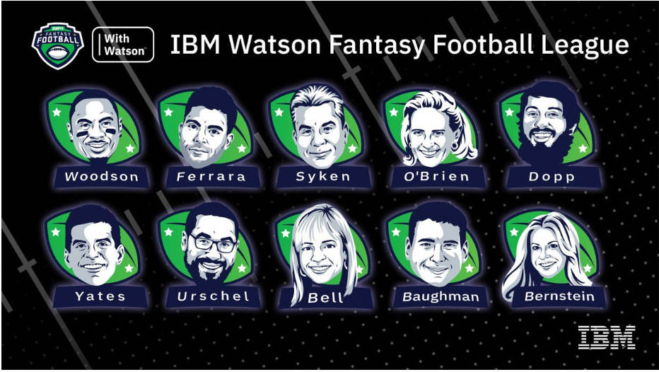

# 代码的背后：Fantasy Football 洞察实战
从非结构化数据中获取的深入洞察与 ESPN 传统球员统计数据和分析相辅相成

**标签:** IBM Cloud,云计算,人工智能,对象存储,游戏

[原文链接](https://developer.ibm.com/zh/articles/watson-behind-the-code-fantasy-football-2018-part8/)

Aaron K. Baughman, Chris Jason

发布: 2019-03-06

* * *

_作者 Chris Jason 担任 ESPN Fantasy 产品高级总监_

ESPN 和 IBM 携手合作，为 Fantasy Football 球队所有者带来全新的洞察，将数百万篇新闻与传统足球统计数据相结合。Watson 基于企业级机器学习管道而构建，旨在阅读、理解并领会有关 Fantasy Football 的数百万份文档和多媒体信息来源。ESPN Fantasy Football with Watson 系统是一个包含许多组件的庞大系统。

此文章 [系列](https://developer.ibm.com/zh/series/watson-behind-the-code-fantasy-football-2018/) 分 8 部分，本文是第 8 部分，将带您了解每个组件，展示我们如何使用 Watson 构建世界一流的 AI 解决方案。

## AI Fantasy Football 实战

在整个 2018 年美国国家橄榄球联盟 (National Football League, NFL) 赛季，数百万的球迷通过 ESPN Fantasy Football 游戏进行了正面交锋。每周，Fantasy Football 球队所有者都可选择使用 Watson 来安排球队阵容。这个过程通过多个不同论坛向球迷展示（最值得关注的就是 ESPN Fantasy 应用中的球员界面），同时还会通过电视和数字内容中播出的片段来展示。在 Watson 的支持下，根据经验制定决策有助于最大程度降低您因对某一名球员所属球队的偏爱或者对该球员本身的偏爱而选择其首发的可能性。仅在 9 月份，就已经为访问 ESPN Fantasy 应用的 980 万用户生成了 55 亿项洞察，Watson 还补充了相关证据，表明球迷当月在该应用中花费了 24 亿分钟。源自非结构化数据的这种前所未有的深度洞察与 ESPN 的传统球员统计数据和分析有机结合，为每名球员都提供了全面而详细的分析。Watson 以其中部分内容为依据来解释深刻的洞察。

**免费试用 IBM Cloud**

利用 [IBM Cloud Lite](https://cocl.us/IBM_CLOUD_GCG)
快速轻松地构建您的下一个应用程序。您的免费帐户从不过期，而且您会获得 256 MB 的 Cloud Foundry 运行时内存和包含
Kubernetes 集群的 2 GB 存储空间。 [了解所有细节](https://www.ibm.com/cloud/blog/announcements/introducing-ibm-cloud-lite-account-2) 并确定如何开始。

临近 2018 年 ESPN Fantasy Football 赛季末时，1000 余名玩家参与了一项调研，衡量 Watson AI 系统的作用和影响。在主动参与调研的受访者中，80% 以上使用过该功能的用户称，Watson AI 洞察帮助他们更尽情地享受 Fantasy Football。球迷关注 NFL 越多，使用 Watson 的可能性也就越高。

这其中有一些反馈值得注意，包括需要围绕模型提供一致的指标、明确定义升/降级（Boom/Bust)、简化得分可能性、升级累积出现次数以及提升透明度。另外，还有些用户希望能够对特定球员名单中包含或不包含的更多球员加以比较。在我们持续改进体验的过程中，所有这些事项都将纳入考量范围。

在整个 2018 年 ESPN Fantasy Football 赛季，一些前 NFL 球员、ESPN 名人、IBM 员工和一名电影明星共同参与了争夺令人向往的 IBM Watson Fantasy Football League 奖杯的竞争。为他们提供 Watson 相关培训的过程并不容易，但最终还是顺利完成。选拔球员后，每位球队经理都使用了 Watson 来选择其球员首发阵容。

在整个赛季过程中，AI 洞察的价值变得无法估量。Field Yates 使用了这些洞察比较了跑卫得分分布与获胜的关联度。Bonnie Bernstein 通过使用 Watson 来挑选四分卫，避免了她偏爱自己最喜欢的球员。Stephania Bell 通过查看媒体有关球员的评论，在理智与情感之间作出了妥协。Charles Woodson 使用升级指标决定从让渡名单中选择哪个球员。John Urschel 根据预测曲线选择了首发外接手。到赛季末，Jerry Ferrara 称他在整个赛季中领悟到的三个要点分别是：

1. 不要因为害怕降级而忽略升级的可能性
2. 让 Watson 来处理让渡名单
3. 跑卫是赛季取得成功的关键

祝贺 Stephania Bell 赢得奖杯，但请记住，Watson 已经在为下一个赛季的到来开始了训练历程。

在 Stephania Bell 的获奖感言中，她表示自己最看重的三大 Watson 功能如下：

1. 能够使用升降级预测来量化风险与回报对比
2. 可直观显示球员的球员比较工具
3. 机器智能增强当自己的团队经理的乐趣

从个人角度而言，能够遇到使用我的 AI 系统的 Fantasy Football 玩家令我感到非常高兴。在 2019 年的新年前夕活动中，我遇到了一位来自密苏里州的新朋友，他告诉我自己正在使用一个新工具来选择球队阵容。这个工具就是 Watson！他非常重视升/降级指标，并且很喜欢使用分布曲线来比较球员。他说道，只要查看球员得分分布形状，就可以轻松发现球员之间的差异。

在另一个示例中，从未玩过 Fantasy Football 的 IBM 产品经理 Raphael Sacks 将 Fantasy Insights 与 Watson 相结合，以 9 胜 4 负赢得了联赛的常规赛季，最终止步于联赛半决赛，赢得了季军。

他每周都使用 Watson 的升/降级预测来选择首发，并挑选自由球员。尤其是，Raphael 发现升/降级功能非常适用于选择 Flex 首发，因为经常有多名外接手和跑卫的 ESPN 得分预测非常接近。为准备周详，他经常将排名最靠前的几位自由球员添加到升降级可视化功能中，并在赛季后期选择持续数周保持良好状态的踢球手。如果升/降级功能比较结果非常接近，他就使用 Buzz 分析。该功能尤其适用于决定四分卫首发人员，因为他的球员名单上有两位排名前 15 的四分卫。使用 Buzz 时，他选择了在 16 周内有 13 周都表现更出色的四分卫。

这篇博客展示了在整个 2018 年 Fantasy Football 赛季中，数以百万计的用户如何将 ESPN Fantasy Football 与 Watson 结合使用。Watson 将原本艰难的决策转变为立足证据做出的选择。准备好利用 Watson 出征下一个 ESPN Fantasy Football 赛季吧！#WinWithWatson

ESPN Fantasy Football 徽标是 ESPN, Inc. 的商标。经 ESPN, Inc. 许可使用。

本文翻译自： [Behind the code: Fantasy Football insights in practice](https://developer.ibm.com/articles/watson-behind-the-code-fantasy-football-2018-part8/)（2019-02-06）