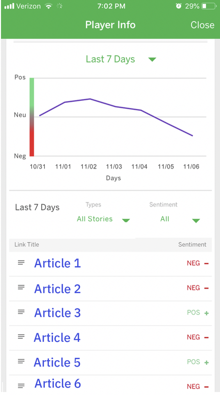
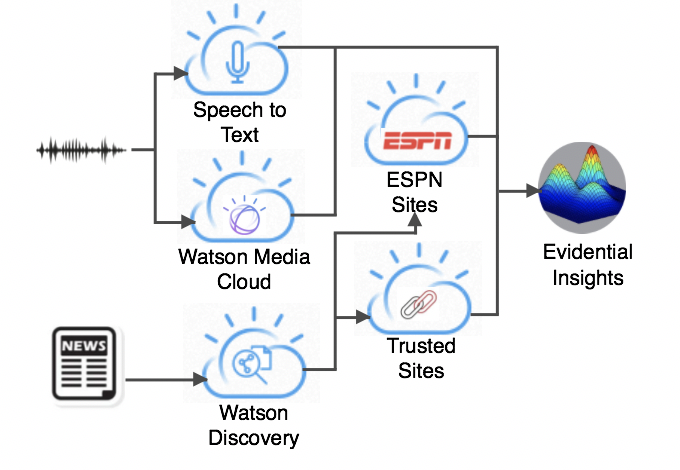

# 代码的背后：Fantasy Football 洞察的支持证据
获得 Fantasy Football 球队的全新洞察

**标签:** Cloud Foundry,IBM Cloud,Watson Discovery,云计算,人工智能,对象存储,游戏,自然语言处理,语音与共情

[原文链接](https://developer.ibm.com/zh/articles/watson-behind-the-code-fantasy-football-2018-part3/)

Aaron K. Baughman, Micah Forster

更新: 2018-11-10 \| 发布: 2018-11-09

* * *

ESPN 和 IBM 携手合作，为 Fantasy Football 球队所有者带来全新的洞察：Watson AI。#FantasyFootballFace。Watson 对来自数千个可信来源的数百万文档、视频和播客进行分析。ESPN Fantasy Football with Watson 系统是一个包含许多组件的庞大系统。

此文章系列分 8 [部分](https://developer.ibm.com/zh/series/watson-behind-the-code-fantasy-football-2018/)，本文是第 3 部分，将带您了解每个组件，展示我们如何使用 Watson 构建世界级的 AI 解决方案。

## 为 Fantasy Football 洞察创建支持证据

多媒体和文本证据可以加强对来自 ESPN Fantasy Football with Watson 的关键 Fantasy Football 预测的信任。这次开放 AI 学习之旅通过回答“为什么”的问题，展示高度复杂的算法如何获得输出。该系统的用户可以深入了解更深层次的证据，以判断 Watson 系统的准确性，从而建立一种注重信任的长期关系。就像《神探夏洛克》中的夏洛克向华生求教一样，Fantasy Football 球员可以向他们信任的顾问 ESPN Fantasy Football with Watson 进行咨询。

在每个球员信息卡上，“Buzz”选项卡都显示了支持或反驳 Watson 预测的最相关的信息源链接。来自互联网上 50,000 个来源的新闻文章，以及 ESPN 视频和播客，会通过自然语言处理 (NLP) 算法得到分析，比如使用 Python 编写的 Watson Discovery 和深度学习算法。来自多媒体来源的声音会通过 Watson Media Cloud 和 Watson Speech to Text 服务进行转录，以创建文本信息来供机器读取。最可信的来源可作为提升权重的候选来源，用来提高它们在输入到文档 2 矢量神经网络中时的影响力。如果无法从提升权重的来源获得所需的最少量证据，则会提供更多中性来源。如果内容与我们的规则匹配，或者 ESPN 足球编辑人员和 IBM Fantasy Football 职员一致认为某个网站具有高度准确的数据，那么该来源就是可信的。加入黑名单的来源（比如讽刺性网站）会被删除。



搜索作为预测依据而包含的新闻来源以进行其他审查。相关性度量是通过以下规则来计算的：

- 球员的姓名是否出现在标题中
- 球员的姓名在文档中出现的次数
- 文章中第一次出现球员姓名的位置
- 球员的名字与姓氏之间的单词数

还应该对证据应用一个额外的文章新颖性指标，以便用户很容易从球员信息卡上获得最相关和最及时的数据。如果相关性分数低于我们的准确性阈值，则会筛除该文章或文本。我们高度注重该阈值，以便在整个 Fantasy Football 赛季中保持信任。



为了实现基于证据的洞察，在 IBM Cloud 中运行的 Cloud Foundry Python 应用程序会找到高度准确的证据。包含球员全名、球队、单词“NFL”和“Fantasy Football”的查询都是针对 Watson Discovery 中的新闻来源发布的。如果结果集小于根据经验确定的 50 篇文章，查询会慢慢转换为不断撤销的格式，直到查询中只剩下球员的全名。对于最准确的站点，会遵循准确的召回范围，直到需要下一层中性来源满足不会影响整个机器学习管道准确性的最少来源数量。

对于文字新闻、mp3 播客和 mp4 视频，会运行不同的 Cloud Foundry 应用程序。使用来自 Waston Discovery 的 NLP 算法对转录后的播客和视频进行分析，以度量相关性和及时性。多媒体证据标题和资源 URL 存储在一种多媒体 Db2 on Cloud 模式中。非结构化新闻具有与多媒体相似的流程。文章的完整文本和转录的声音不会存储在 Character Large Object (CLOB) 字段中，因此可以节省数 PB 的磁盘空间。

Cloud Foundry Node.js 应用程序同时查询文字和多媒体模式，以创建 Java Simple Object Notation (JSON) 文件。每位球员的每个文件都是异步生成的，并上传到一个对象存储起源中。JSON 资源没有针对浏览器或客户端的任何缓存标头，所以用户的请求会转至 IBM Cloud Content Data Network (CDN) 中的边缘服务器。JSON 数据也设置为可供公共客户端公开读取。例如，在 JavaScript 中，在一个字典中指定访问控制列表 (ACL)。

```
let params = {Bucket: this.containerName, Key: objectName, ACL: 'public-read', ContentType: 'text/json'};

```

Show moreShow more icon

在命令行，还可以使用以下命令来更新 JSON 文件：

```
curl -X PUT "https://s3-api.us-geo.objectstorage.softlayer.net/devsimulation/Offset7.json?acl" -H "Authorization: Bearer <your token>" -H "x-amz-acl: public-read"

```

Show moreShow more icon

尽管信任很难建立且很容易破坏，但 Watson 已赢得并保持着数百万 Fantasy Football 用户的信任。在执行不确定的推理时，证据可以提供某种透明度。#WinWithWatson

敬请期待我下一次讨论机器学习管道。

ESPN Fantasy Football 徽标是 ESPN, Inc. 的商标。经 ESPN, Inc. 许可使用。

本文翻译自： [Behind the code: Supporting evidence for Fantasy Football insights](https://developer.ibm.com/articles/watson-behind-the-code-fantasy-football-2018-part3/)（2018-11-10）