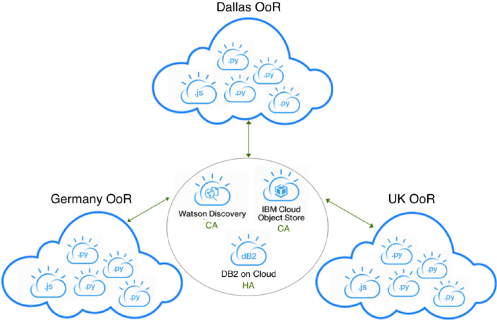
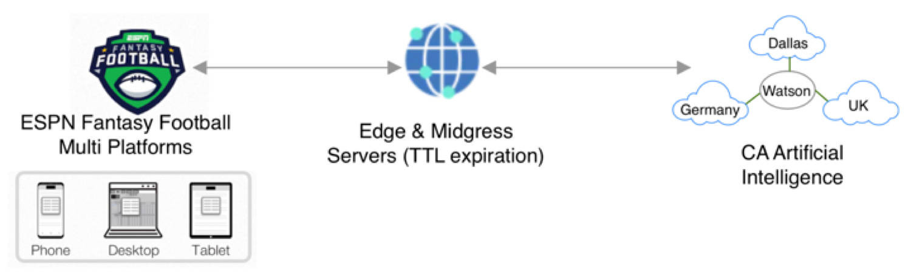
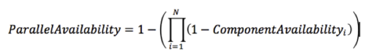

# 代码的背后：持续可用的足球分析
当您晚上因考虑 ESPN Fantasy Football 阵容选择而夜不能寐时，IBM Watson AI 可以为您提供支持。

**标签:** Cloud Foundry,IBM Cloud,云计算,人工智能,对象存储,平台即服务,游戏

[原文链接](https://developer.ibm.com/zh/articles/watson-behind-the-code-fantasy-football-2018-part2/)

Aaron K. Baughman

更新: 2018-09-23 \| 发布: 2018-09-22

* * *

当您因考虑 ESPN Fantasy Football 的阵容选择而夜不能寐时，IBM Watson 人工智能 (AI) 可以为您提供支持。#FantasyFootballFace。ESPN Fantasy Football with Watson 旨在持续不断地读取、理解和领悟多媒体和文本数据。我们的 Fantasy Football 洞察能够近实时地持续更新 Fantasy Football 球员洞察，实现不停机的目标。IBM Watson 24/7 持续不断地执行 Fantasy Football 分析，使您成为更优秀的参与者，即便在您休息时它也不会停止分析。

AI 系统采用了一种持续可用性 (CA) 架构，实现了至少 99.999% 的正常运行时间，或者每年仅 5 分钟的计划和计划外宕机。生成 Fantasy Football 预测、证据和趋势的后端组件在 IBM Cloud 上的 3 个不同的区外 (Out of Region, OoR) 中心并行运行。为了避免特定地区发生宕机，这些中心分布在世界各地，比如达拉斯、德国和英国。每个 OoR 云都共享 Watson Discovery、Cloud Object Storage 和 DB2 on Cloud 等 Watson 组件，这些组件拥有自己的可用性服务级别协议 (SLA)。DB2 on Cloud 在高可用性灾难恢复 (HADR) 架构上运行，以防止数据丢失。IBM Cloud Object Storage 采用了传统的 3 个活跃站点来实现持续可用性 (CA)，而 Watson Discovery 将其流量分布在多个服务器上来实现持续可用性。

总体上讲，来自移动设备、桌面或平板电脑的客户端流量将发送到 IBM Cloud 边缘服务器。数百台边缘服务器合并为一个内容传送网络 (CDN)，以加速 Fantasy Football 洞察的交付。CDN 还会为持续可用的人工智能洞察提供保护。Word-2-Vector、深度学习、多项式回归、决策树和模拟算法按计划运行，并在更新球员信息时运行。数百万用户和数万亿的洞察请求不会影响 AI 可用性或性能。

每个并行持续可用性人工智能系统都是无状态和独立的。每个系统的输出都作为数据起源写入到一个单独的对象存储中。用户客户端可以访问包含最新数据的起源。AI OoR 并行系统的可用性是通过每个组件的可用性相乘来计算的，如下图所示。

IBM Cloud Availability Monitoring 服务会不断确定所有 Python 和 Node.js 应用程序的可用性。但是，Python 应用程序会按顺序使用许多不同的 Watson 服务。每个 Watson 服务都有一个可用性 SLA，在 Python 机器学习管道中按顺序使用它们时，可以将这些可用性相乘。下面的等式展示了如何确定 AI 管道的串行可用性。

尽管 Node.js 应用程序依赖于对象存储和 IBM Cloud CDN，但每个调用都是异步调用。因此，可以使用并行可用性来确定 Node.js 组件可用性。并行和串行可用性方程式的嵌套，提供了一种优化 ESPN Fantasy Football with Watson 系统的性能和可用性的方法。

即使在睡觉时，您也在使用 Watson 更精明地经营 ESPN Fantasy Football。#WinWithWatson

敬请期待我下次通过证据来揭开深度学习的神秘面纱。

_ESPN Fantasy Football 徽标是 ESPN, Inc. 的商标。经 ESPN, Inc. 许可使用。_

本文翻译自： [Behind the code: Continuously available football analysis](https://developer.ibm.com/articles/watson-behind-the-code-fantasy-football-2018-part2/)（2018-09-23）