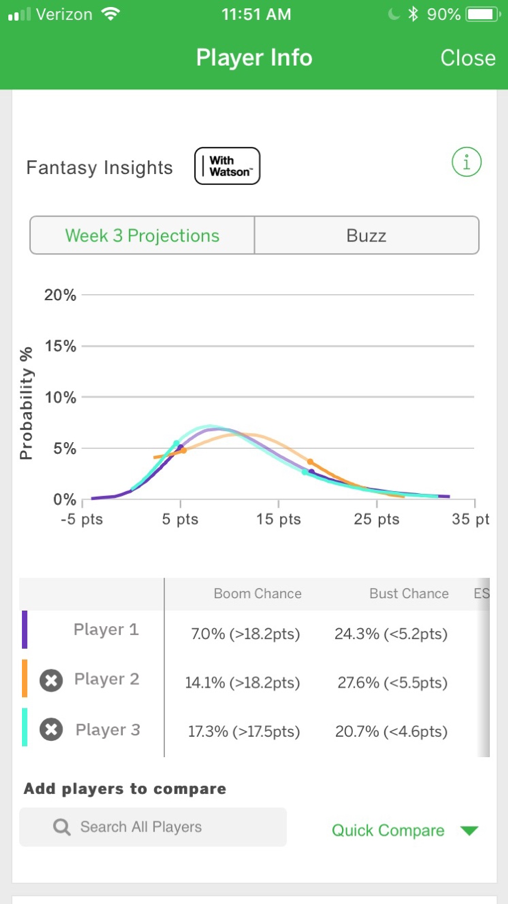
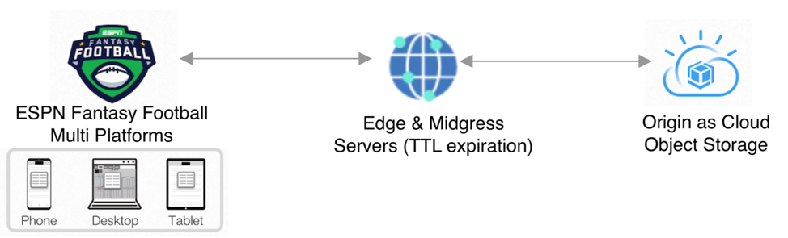
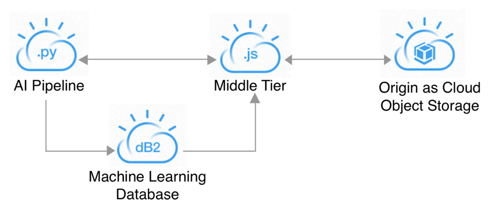

# 代码的背后：数十亿次的精准 Fantasy Football 预测
了解 ESPN Fantasy Football with Watson 系统中的每个组件

**标签:** Cloud Foundry,IBM Cloud,云计算,人工智能,对象存储,平台即服务,游戏

[原文链接](https://developer.ibm.com/zh/articles/watson-behind-the-code-fantasy-football-2018-part1/)

Aaron K. Baughman, Micah Forster

更新: 2018-09-23 \| 发布: 2018-09-22

* * *

推理。情绪。矛盾心态。信息过载。许多困难的决策会给 #FantasyFootballFace 带来不适和不和谐。但是，ESPN 和 IBM 携手合作，为 Fantasy Football 球队所有者带来了全新的洞察：Watson AI。Watson 将对来自数千个足球信息源的数百万文档、视频和播客进行分析，帮助您计算风险和回报，消除个人偏见，并将更多证据纳入决策中。

ESPN Fantasy Football with Watson 系统是一个包含许多组件的庞大系统。此文章系列分 8 部分，本文是第 1 部分，将带您了解每个组件，展示我们如何使用 Watson 构建世界级的 AI 解决方案。

## 我们如何借助 Watson 做出数十亿次的精准 Fantasy Football 预测

就规模和准确性而言，ESPN Fantasy Football 的人工智能 (AI) 为全球数百万用户提供了准确预测。每天数百万用户和通过 IBM Cloud 执行的数亿次资源检索所产生的原始流量，要求在整体系统架构中有一个 Web 加速层。Web 加速层保护 Watson 中的机器学习管道免受流量的冲击，避免资源争用和不确定的结果。运行 AI 管道的原始机器通过内容传送网络 (CDN) 来支持一系列的高速缓存。中间层通过精确的升级、降级、球员口碑、证据和预测趋势来更新原始内容。现在，您可以在整个足球赛季中使用 ESPN Fantasy Football 来访问企业级 AI！

每天，数百万计的用户通过球员信息卡访问我们的预测信息。球员信息卡上提供了许多不同的球员视图，比如对比球员特性。在这里，可以比较多个球员，对比分数分布、升级和降级洞察。丰富的用户体验需要 IBM Cloud 上的密集数据。

IBM Cloud 上的资源需求量令人感到震惊。在 3 周内，IBM CDN 获得了 9,284,216,526 次点击，命中率达 83.06%（由 CDN 提供服务），并使用了 830.72 TB 带宽。IBM Cloud CDN 为来自数百万的 ESPN Fantasy Football 用户的需求提供支持。要使此系统工作，需要并行运行一系列组件。

加载某个球员时，会通过 IBM Cloud CDN 和一个 Object Storage Origin 检索动态 Java Simple Object Notation (JSON) 数据。总体上讲，只要内容的存活时间 (TTL) 值未过期，就会从边缘服务器提取 13 个不同的 JSON 文件（从视频证据到分数分布）。如果内容已过期，那么数据块的流量将会经由中间服务器传输到 Cloud Object Storage。然后，通过 CDN 发回内容并将其缓存，以供其他请求使用。

此外，球员信息卡框架被缓存在 CDN 中。超文本标记语言 (HTML)、图像、级联样式表 (CSS) 和 JavaScript 库等工件都通过 CDN 进行检索。在浏览器端，没有指定缓存标头，所以会从 CDN 检索最新内容。

一些使用 Python 编写的 Cloud Foundry 应用程序会连接到多个 Watson 服务（比如 Watson Discovery），并运行 AI 管道。结合深度学习、回归、决策树和文档 2 矢量模型来生成 Fantasy Football 洞察和证据。超过 3,000 个新闻源为 Watson 提供了数百万篇文章，供 Watson 阅读和理解。不仅如此，Watson 还会观看足球视频，收听 Fantasy Football 播客，为 AI 管道提供更多的预测变量。

AI 管道将数据写入 20 多个 Db2 表中。该数据包括将在球员信息卡上提供的统计洞察和证据。完成对某位球员的分析后，AI 管道会向 Node.js 应用程序发送 RESTful GET 请求。Node.js 应用程序获取球员信息和活动信息，以便从 IBM Cloud 上的 Db2 获取洞察。Node.js 应用程序通过一系列异步调用生成 JSON 文件并提交到 Cloud Object Store (COS)。在标头中，访问权限 x-amz-acl 被设置为 public-read，以便任何球员信息卡都能读取这些 JSON 文件。在每部分内容的 TTL 过期或管理员完成手动清除后，就可以获得最新的洞察。

CDN 内容中还包含其他球员信息，比如受伤、轮空、停赛、交换位置和受伤替补状态。

Watson 会读取、收听和观看数百万个工件来提炼证据和洞察。与此同时，Watson 还会响应数百万个不睡觉的用户！因此，Watson 绝不会休息。保持企业 AI 系统持续可用既艰巨又必要。#WinWithWatson

敬请期待我下一次讨论持续可用的足球分析。

_ESPN Fantasy Football 徽标是 ESPN, Inc. 的商标。经 ESPN, Inc. 许可使用。_

本文翻译自： [Behind the code: Billions of precise fantasy football predictions](https://developer.ibm.com/articles/watson-behind-the-code-fantasy-football-2018-part1/)（2018-09-23）