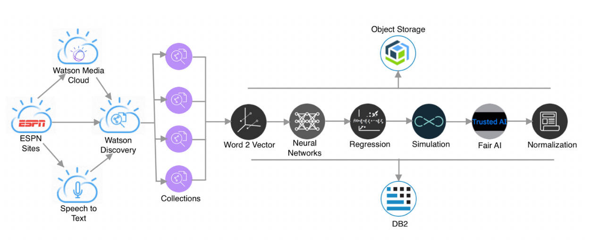
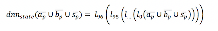
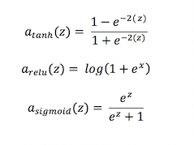
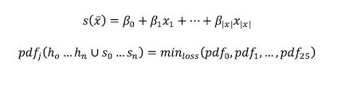
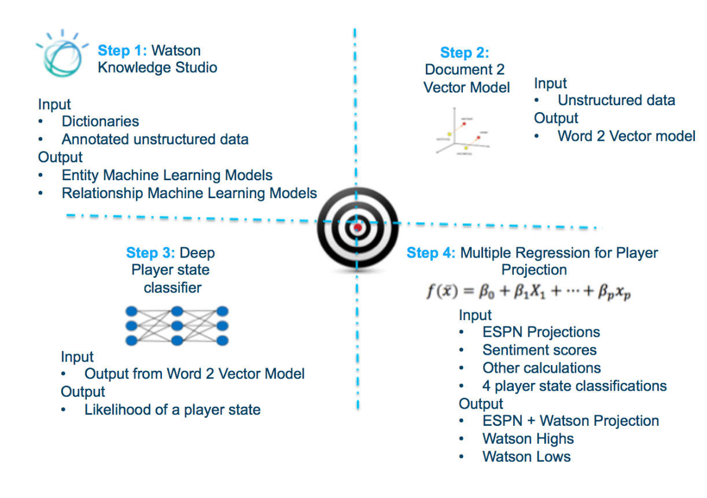
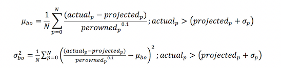
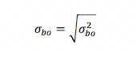
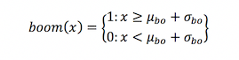
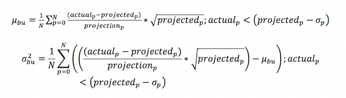
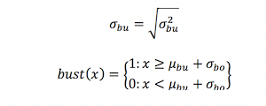

# 代码的背后：用于获取 Fantasy Football 洞察的机器学习管道
了解训练和评估机器学习管道这一科学流程如何做出高度准确的预测

**标签:** IBM Cloud,云计算,人工智能,对象存储,游戏,自然语言处理

[原文链接](https://developer.ibm.com/zh/articles/watson-behind-the-code-fantasy-football-2018-part4/)

Aaron K. Baughman

发布: 2018-11-19

* * *

**免费试用 IBM Cloud**

利用 [IBM Cloud Lite](https://cocl.us/IBM_CLOUD_GCG)
快速轻松地构建您的下一个应用程序。您的免费帐户从不过期，而且您会获得 256 MB 的 Cloud Foundry 运行时内存和包含
Kubernetes 集群的 2 GB 存储空间。 [了解所有细节](https://www.ibm.com/cloud/blog/announcements/introducing-ibm-cloud-lite-account-2) 并确定如何开始。

ESPN 和 IBM 携手合作，为 Fantasy Football 球队所有者带来了全新的洞察：Watson AI。#FantasyFootballFace。Watson 基于一个企业级的机器学习管道来读取、理解和领悟有关 Fantasy Football 的数百万份文档和多媒体来源。ESPN Fantasy Football with Watson 系统是一个包含许多组件的庞大系统。

此文章 [系列](https://developer.ibm.com/zh/series/watson-behind-the-code-fantasy-football-2018/) 分 8 部分，本文是第 4 部分，将带您了解每个组件，展示我们如何使用 Watson 构建世界级的 AI 解决方案。

## 通过机器学习管道获取 AI Fantasy Football 洞察

Watson 深入分析数据，使您能够精心挑选您的 Fantasy Football 阵容。球队经理可以挑选可能会升级的球员，避免选择会降级的球员。但是，可能降级的高风险球员有可能具有更高的上升空间。ESPN Fantasy Football with Watson 提供了 AI 洞察，以便您能“全垒打”。高风险可能意味着高回报。或者，您可以打安全牌，用场上得分潜力换取上升概率。机器学习管道利用大量数据进行推理，以配合您每周的战略转变。

该系统的机器学习架构由多个应用程序、几十个模型，以及数千个数据源和数据科学环境组成。首先，该系统必须学会读取 Fantasy Football 内容。语言模型是通过自定义实体和关系来设计的，以适应人们用来描述 Fantasy Football 领域中的球员和球队的独特语言。为了读取内容进行领悟，我们定义了 13 种实体类型的本体，涵盖了以球员为中心的理解。这些实体包括身体部位、教练、球迷、装备、伤病、位置、球员、球员状态、治疗、积极语气、消极语气、球队和表现指标。1,200 个文档创造了一种均匀的文档分布，包含来自 5,568,714 篇文章的每种实体类型。

3 位人工注释员组成的团队使用了一个名为 [Watson Knowledge Studio](https://www.ibm.com/watson/developer/) 的工具将文本标注为 13 种实体类型中的一种。通过在 10 个字典中搜索单词并自动创建注解，预先对这些文档进行了注解。注释员添加缺少的注解的同时也一边更正预先注解。每一天，该团队都会开会讨论彼此为每种实体类型给出的 kappa 或协议分数。在 3 周内，该团队生成了一个统计实体模型，该模型的准确率为 79%，召回率为 73%，F1 分数为 76%。即使所有文档的实体单词密度只有 14%，注释员的整体协议分数也达到了 70%，大部分差异都表现为短语中缺少一些单词。

我们训练了一个检测器并将其部署到名为 Watson Discovery 的系统中，该检测器不断从 50,000 多个来源摄入数据。Watson Discovery 系统能根据我们训练的统计实体模型，从不断更新的语料库中发现 Fantasy Football 实体、关键词和概念。

接着，该系统使用一个文档矢量化模型来了解查询中的自然语言文本。如 [第 3 部分](https://developer.ibm.com/zh/articles/watson-behind-the-code-fantasy-football-2018-part3/) 所述，我们最初向 Watson Discovery 信任的来源发出了一个非常具体的查询，比如 “Tom Brady and Patriots and NFL and Football”。如果查询没有返回至少 50 个经过实验确定的文档，那么该查询就会被扩展，直到它只有 “Tom Brady and NFL”。如果仍未得到至少 50 条证据，则会按从精确到宽泛的顺序向 Watson Discovery 中性来源发出查询。从查询结果中，将每个文档的实体、关键词和概念组成的列表转换为数值特征矢量。对每个特征矢量组（即实体、概念和关键词）求平均值，以表示该内容的语义摘要。将来自每个文档的所有特征矢量组平均分配到每个文档中。

使用两种不同类型的语义含义来测试文本矢量模型。首先，对该模型执行一次类比测试。如果提供给模型的 Travis Kelce 与队长的关系与 Coby Fleener 与 X 的关系相同，那么正确答案将会是 Saints。在球员到球队的类比测试中，正确答案始终在前 1% 的数据中。球队到位置类比的准确率稍低一点，为 93.48%，因为自然查询的关注点不在球队上。第二个测试为模型提供了一组关键词，并期望获得一个相关的单词。例如，如果将 Coby Fleener 输入模型中，我们期望将 Saints 视为输出。该模型在球员关键词测试中实现了 80% 的准确率，而正确答案在前 0.1% 的数据中。球队和位置关键词测试的执行情况上述测试类似，具有 74% 的准确率，其中正确答案在前 1% 的数据中。

接着，将 3 个特征矢量和球员生物信息图一起输入到管道的深度学习部分。

深度学习管道包含 4 个深度超过 98 层的模型。神经网络中的节点组合使用了直线、双曲正切和 S 形激活函数。这些模型是每个球员的分类器，用于确定升级、降级、带伤上场的概率或上场分钟数。概率分数提供了球员状态的置信度级别，以便球队所有者可以决定自己的风险容忍度。

降级比赛分类器的准确率为 83%，具有适度的类别分离，而升级分类器的准确率非常低，只有 39%。有很高概率突围的球员的得分远远超出平均预测分数。遗漏和标记错误的升级球员非常接近于 0.5 的二值化阈值。此外，升级模型的负面预测值准确率为 85.5％，而且它生成的升级球员的现实比例为 12％。过度预测升级可能比高准确率更糟糕。与负面预测值和预计将升级的球员比例相比，准确率数值不是一个有意义的评估指标。

带伤上场分类器的准确率为 67%，正面预测值为 68.1%。正面预测值对此分类器非常重要，它使我们能够知道球员是否会积极面对伤病或隐性伤病。上场分钟数模型提供的准确率为 61.7%。每个深度学习模型都为球员状态提供了宝贵的自然语言文本摘要。

最后，将深度学习球员数据和结构化 ESPN 数据输入到由多个回归模型组成的集合中。多次回归集合基于球员位置为每个球员提供了一个预测分数。深度学习球员状态数据和 ESPN 统计数据的线性组合生成了 6.78 分的最佳 RMSE 分数。平均而言，每个预计在所有位置上具有显著高分的球员，都将获得一个与真实值相差 6.78 分的预测分数。

为了生成概率分布函数 (PDF)，机器学习管道的末端将 25 个不同的 PDF 与球员的历史表现相拟合。一些示例分布包括 alpha、anglit、beta、bradford、chi、wald、vonmises、person、normal、Rayleigh 等。如果球员没有足够多的历史数据，则会检索类似的球员数据。在为每个球员创建一个 PDF 后，在一次模拟中对该分布进行 10,000 个点的采样，以便提供用于在用户界面上绘制曲线形状的离散点。

通过结合使用自然语言证据与传统统计，生成每位球员的预测分数。平均而言，结构化和非结构化数据的组合产生了比单独采用两种数据更好的 RMSE。我们在 Jupyter Notebooks 和 IBM SPSS 软件中进行了大量的数据探索。通过试验，我们为项目选择了一些模型超参数和算法。

在 Watson 能够通过核心机器学习管道读取、理解和领悟数据后，将一组后处理器应用于输出。通过使用 IBM Fair 360 库，我们开发了一个后处理器，以确保每个球队都得到公平对待。例如，根据预测，New England Patriots 的球员的升级频率比不同球队的其他球员更高。实际上，每次升级的球员数量之间的差异非常小。我们使用回归输出和事实库数据构建了一个公平的后处理器模型。这个公平的后处理器的输出更正了 50,000 个来源对特定球队的总体偏差。

第二个后处理器修改了深度学习方程的置信度值。用于分类的每个深度学习阈值各不相同。为了使升级、降级、带伤上场或上场分钟数据具有可比性，每个值都被标准化。现在，每个置信度值都以 0.5 为中心，以便采用相同的标准。

## 训练 Fantasy Football 机器学习管道

在整个项目中，我们使用了 Fantasy Football 2015 和 2016 赛季中与球员相关的历史新闻文章、博客等。一个名为 Webhose 的第三方来源提供了大量内容。我们使用自定义实体模型将总计超过 100 GB 的数据摄入到 Watson Discovery 中。我们将这些文章日期与来自 ESPN 的结构化球员数据相关联，以生成带标签的数据。ESPN 球员数据包含多项统计数据，其中包括每周结果、预测值、实际值、拥有百分比等。

将从星期二到星期一的一周时间跨度与每个球员的状态相关联，以便可以运行时间范围查询来检索相关的新闻文章。升级标签是通过分析实际分数和预测分数，以及拥有球员的球队经理比例来确定的。如果球员的实际分数比球员 _p_ 的预测分数高 1 个标准偏差以上，则使用实际分数与预测分数之差除以征用百分比 _perownedp0.1_，再计算加权平均值，来确定升级标准偏差。但是，在所有联盟中，球员必须拥有至少 10% 的征用百分比。

升级的标准偏差 _σbo_ 通过对升级方差 _σbo2_ 求平方根来确定。

如果球员的实际分数 _x_ 比球员的升级均值高 1 个升级标准偏差以上，则对球员应用升级标签。

降级标签是通过以下等式来计算的。平均降级分数 _μbu_ 是通过以下方式来确定的：将实际分数与预测分数之差除以同一个球员的预测分数，再计算加权平均值。但是，采样集合中仅使用了比预测分数低 1 个标准偏差 _σp_ 的实际分数。

降级方差 _σbu2_ 的平方根提供标准差阈值，以便用分数 _x_ 为球员添加标签。

当球员实际分数超过预测分数的 15%，而且他们在伤病报告中显示为“存在问题（50% 退场可能性）”或“可能带伤（25% 退场可能性）”时，才会生成“带伤上场”标签。当球员分数超过其预测分数的 15%，而且球员为“可能带伤”或不出现在伤病报告中时，才会生成“上场分钟数”标签。在 Fantasy Football 2015 和 2016 赛季中，每周会为每位球员生成全部 4 种标签。

Watson 为全球的 Fantasy Football 经理提供了公平且专业的 AI 洞察。训练和评估机器学习管道的科学流程可以创造高度准确的预测，从而帮您取得成功。#WinWithWatson

下次当我讨论如何通过移动体验来提供 AI 洞察时，可以回顾一下这里的内容。要了解更多信息，请在 Twitter 上关注 Aaron Baughman：@BaughmanAaron。

ESPN Fantasy Football 徽标是 ESPN, Inc. 的商标。经 ESPN, Inc. 许可使用。

本文翻译自: [Behind the code: Machine learning pipeline for Fantasy Football insights](https://developer.ibm.com/articles/watson-behind-the-code-fantasy-football-2018-part4/)（2018-11-19）