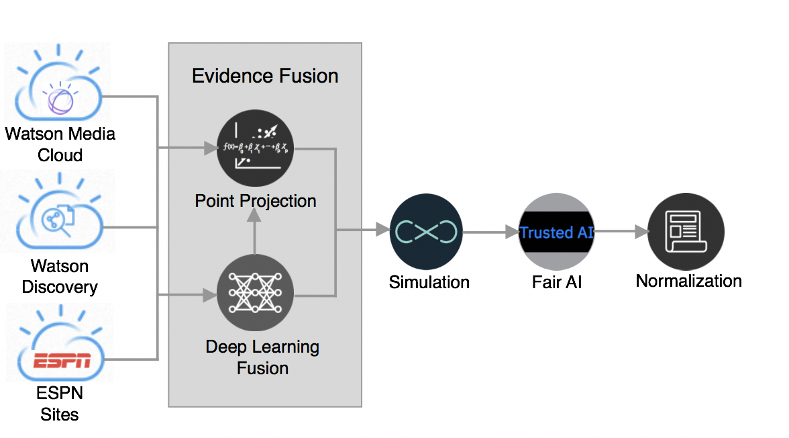

# 代码的背后：融合的 Fantasy Football 洞察
使用融合的 AI 洞察进行精确、有针对性的球员预测和分数预测。

**标签:** IBM Cloud,云计算,人工智能,对象存储,游戏,自然语言处理

[原文链接](https://developer.ibm.com/zh/articles/watson-behind-the-code-fantasy-football-2018-part6/)

Aaron K. Baughman

发布: 2018-11-27

* * *

ESPN 和 IBM 携手合作，为 Fantasy Football 球队所有者带来了全新的洞察，将数百万篇新闻文章与传统的足球统计数据联系起来。Watson 基于一个企业级的机器学习管道来读取、理解和领悟有关 Fantasy Football 的数百万份文档和多媒体来源。ESPN Fantasy Football with Watson 系统是一个包含许多组件的庞大系统。

此文章 [系列](https://developer.ibm.com/zh/series/watson-behind-the-code-fantasy-football-2018/) 分 8 部分，本文是第 6 部分，将带您了解此系统的每个组件，展示我们如何使用 Watson 构建世界级的 AI 解决方案。

## AI Fantasy Football 证据融合

Watson 通过观看视频，收听播客，并阅读数百万篇新闻文章，来生成对 Fantasy Football 球员的评价。您可以让 Watson 发现非结构化的多模数据与传统统计信息之间的相关性。无须阅读、观看和绘制统计数据链接，Fantasy Football 经理就可以使用融合的 AI 洞察进行精确、有针对性的球员预测和分数预测。Watson 将最新的突发新闻内容融合至足球统计数据中，使得未来数据趋势能够为阵容决策提供信息。您可以基于受最近新闻影响的历史足球统计数据，创建一个首发阵容。#WinWithWatson

统计、履历、情绪和非结构化数据都在系统中整合为两个要点。首先，为每位球员聚合来自 Watson Discovery、ESPN 和 Watson Media 的证据。生成整体文档情绪等派生预测指标，并输入到每个经过训练的深度球员分类器中。此外，对有关概念、关键词和实体的特征进行分离或分层，以便整个神经网络的各个部分都会收到相应的输入。球员分类器是一种神经网络，可以确定某个球员将会升级、降级、带隐性伤病上场，还是会进行有意义的击球。接着，神经网络、履历数据和情绪数据的输出被矢量化，作为一个基于足球位置的多元回归函数的输入。融合 46 个变量来计算分数预测的值。在模拟中使用该分数预测值来创建一个概率密度函数，以描述球员获得一定范围内的分数的概率。对分类器的输出应用一个公平的后处理器，以确保模型是公平的，不会偏向任何一组球队。最后，将分类器标准化，使得每个神经网络输出都具有可比性。



更具体地讲，调用深度学习融合功能的 Python 代码将多个证据源合并到一个神经网络中。对象 `MergedPlayerClassifier` 将深度学习合并和 `activation` 函数封装在一起，以便在每个证据维度上使用。`instance` 变量描述了应如何实例化对象，还描述了深度学习拓扑结构的超参数。来自机器学习管道的 document-2-vector 输出将概念、关键词和实体输入到深度学习网络中。其他来源，比如情绪、履历信息和球员 Fantasy Football 统计信息也会一起使用。

```
class MergedPlayerClassifier(object):
    '''
    The class represents a deep learning model
    '''

    TANH = "tanh"
    RELU = "relu"

    def __init__(self, use_object_storage,activation_function,model_threshold,model_type,model_file,weight_file,unique_labels,total_dimensionality,total_input_nodes,object_storage_container,sentiment_content_class_name,sentiment_content_size,bio_content_size,player_stat_size,epochs=100,batch_size=20,train_file=None,test_file=None,**kwargs):

        self._activation_function = activation_function
        self._model_threshold = model_threshold
        self._model_type = model_type
        self._epochs=epochs
        self._batch_size=batch_size
        self._unique_labels=unique_labels
        self._total_dimensionality=total_dimensionality
        self._total_input_nodes=total_input_nodes
        self._model_file=model_file
        self._weight_file=weight_file
        self._use_object_storage = use_object_storage
        self._sentiment_content_class_name = sentiment_content_class_name
        self._sentiment_content_size = sentiment_content_size
        self._bio_content_size = bio_content_size
        self._player_stat_size = player_stat_size

```

Show moreShow more icon

情绪特征矢量的长度为 28。这些属性包括我们通过 Watson Knowledge Studio 训练 Watson 来学习的 13 种实体中每个实体的情绪平均值和计数值。平均文档情绪和实体情绪包含在特征矢量中，因为它们提供了预测能力。

```
sentiment_contents = self._discovery_store.get_machine_learning_results(playerid,event_name,event_year,model_name,self._model_type,self._sentiment_content_class_name,data_timestamp=data_timestamp)
social_content_vector = sentiment_content.generateVector()

```

Show moreShow more icon

检索每位球员的履历信息并包含到一个球员内容特征矢量中。履历信息包含 5 个属性，比如年龄、经验年数、位置、身高和体重。通过数据探索，这些属性对升级、降级、带伤上场和有意义触碰等球员分类最具信息性和贡献性。

```
player_contents = self._discovery_store.get_player_features(playerid, event_name, event_year, 'Player')
bio_vector = player_contents.generate_feature_vector()

```

Show moreShow more icon

对于进入机器学习管道的每个球员，我们会检索球员统计数据。这些统计数据包括 Fantasy Football 数据，比如拥有该球员的联盟百分比，拥有该球员的周数，球员是否可能上场，球员是否受伤。`Get_deep_learning_stats` 会检索当前周和上一周的统计数据。因此，该特征矢量包含上一周与当前周之间的变化率。例如，可以将当前周和上一周的球员拥有百分比之差除以持续时间。

```
player_stats = self._discovery_store.get_deep_learning_stats("PlayerStats",event_name,event_year,playerid)
player_stats_obj = PlayerStatistics(player_stats)
player_stats_vector = player_stats_obj.compute_feature_vector(self._player_stat_size)

```

Show moreShow more icon

将所有特征矢量都输入到一个预测方法中。输入的总维数为 237。`feature_vector` 对新闻文章中所有与球员相关的关键词和概念的平均数值表示进行编码。神经网络的拓扑结构嵌套在一个名为 `create_topology` 的内部 `create_model` 方法中。激活函数是基于经验试验进行选择的。

创建一组代表各个神经网络的并行路径，以便理解履历数据、社交内容、球员统计数据和非结构化信息。在 Keras API 内，并行路径是顺序对象。将不同类型的层，比如丢失、密集和批量标准化层，链接到一个前馈图中。将每个神经网络的输出输入到一个合并节点中，该节点还有另外 25 层。使用随机梯度下降进行反向传播，并结合使用一个二元交叉熵损失函数，将特征矢量融合在一起，以便在整个神经网络中寻找额外的预测指标。使用一个 S 形激活函数对深度神经网络的输出进行处理，以得到一个 0% 到 100% 之间的值。

```
prediction = self.predict(social_content_vector,feature_vector,bio_vector_np,player_stats_vector)

def create_topology():
            """The method defines and creates the topology of the neural network..

            Returns:
                a compiled model
            """
    if MergedPlayerClassifier.RELU == self._activation_function:
        activation=MergedPlayerClassifier.RELU
    elif MergedPlayerClassifier.TANH ==    self._activation_function:
         activation=MergedPlayerClassifier.TANH
    else:
         activation=MergedPlayerClassifier.RELU

model_bio_content = Sequential()      model_bio_content.add(Dropout(0.2,input_shape=(self._bio_content_size,)))
model_bio_content.add(Dense(self._bio_content_size*2,use_bias=True,activation=activation))
.
.
.

model_social_content = Sequential()            model_social_content.add(Dropout(0.2,input_shape=(self._sentiment_content_size,)))
model_social_content.add(Dense(self._sentiment_content_size*2,use_bias=True,activation=activation))
.
.
.

step_size = int(self._total_dimensionality / self._total_input_nodes)
model_entities = Sequential()            model_entities.add(Dropout(0.2,input_shape=(step_size,)))
model_entities.add(Dense(step_size*2,use_bias=True,activation=activation))
.
.
.

model_keywords = Sequential()
model_keywords.add(Dropout(0.2,input_shape=(step_size,)))
model_keywords.add(Dense(step_size*2,use_bias=True,activation=activation))
.
.
.

model_concepts = Sequential()
model_concepts.add(Dropout(0.2,input_shape=(step_size,)))
model_concepts.add(Dense(step_size*2,use_bias=True,activation=activation))
.
.
.

model_player_stats = Sequential()
model_player_stats.add(Dropout(0.2,input_shape=(self._player_stat_size,)))
model_player_stats.add(Dense(self._player_stat_size*2,use_bias=True,activation=activation))
.
.
.

model_total = Sequential()
model_total.add(Merge([model_bio_content,model_social_content,model_entities,model_keywords,model_concepts,model_player_stats],mode = 'concat'))            model_total.add(Dense(80*2,use_bias=True,activation=activation))

model_total.compile(optimizer='sgd',loss='binary_crossentropy',metrics=['accuracy'],)

```

Show moreShow more icon

接下来，一个多元回归函数将合并其他 46 个预测指标。针对外接手（wide receiver）、四分卫（quarterback）、跑卫（running back）、近端锋（tight end）、踢球员（kicker）、防守组（defenses）对多元回归函数进行训练。使用球员履历数据作为轴心点，选择将应用于球员的特征矢量的模型。调用一个自定义概率分布算法，确定 25 种可能的选择中的最佳概率分布函数。

```
def predict(self,model_name,feature_vector):
        try:
            accuracy = self._model_group[model_name].predict(feature_vector)
            return accuracy
        except Exception as e:
            logger.error("Problem running a prediction with "+model_name+" "+str(e))
            raise e

spread_tuple = self._simulation.calculate_point_and_probability_spread(prediction,outside_projection=outside_projection)

```

Show moreShow more icon

借助本博客中的一些详细介绍，Watson 能够利用各种各样的数据源来提供 AI 洞察。球员预测指标和分数分布非常精确，使您每周都能选择您的最佳阵容。#WinWithWatson

下次当我讨论 Fantasy Football 深度洞察可视化时，可以回顾一下这里的内容。要了解更多信息，请在 Twitter 上关注 Aaron Baughman：@BaughmanAaron。

ESPN Fantasy Football 徽标是 ESPN, Inc. 的商标。经 ESPN, Inc. 许可使用。

本文翻译自： [Behind the code: Fused Fantasy Football insights](https://developer.ibm.com/articles/watson-behind-the-code-fantasy-football-2018-part6/)（2018-11-27）