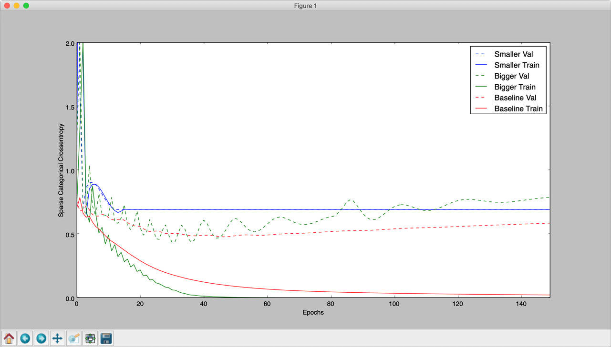
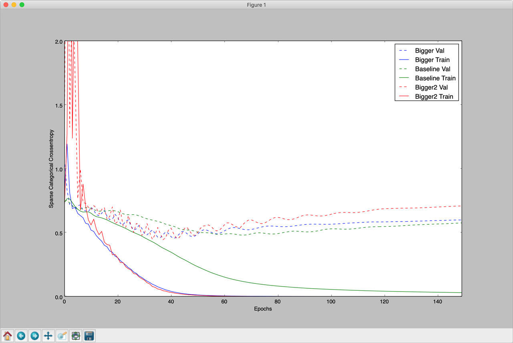
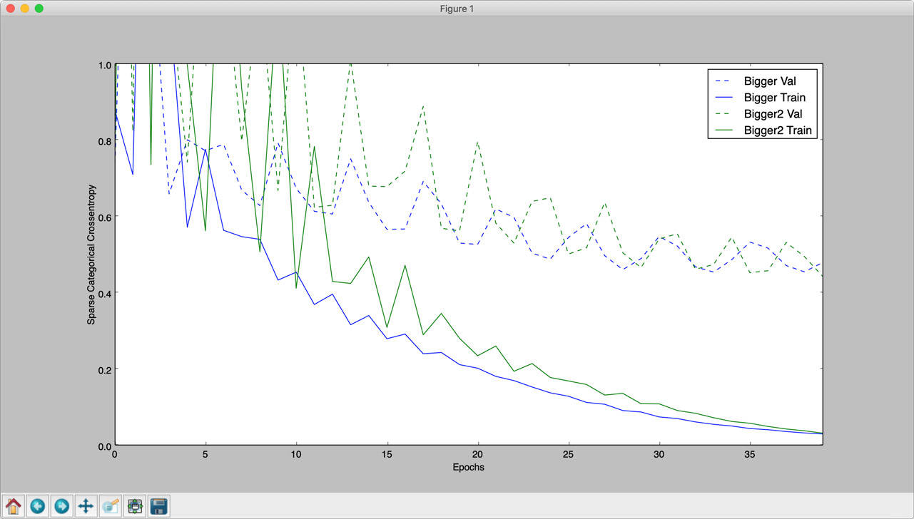
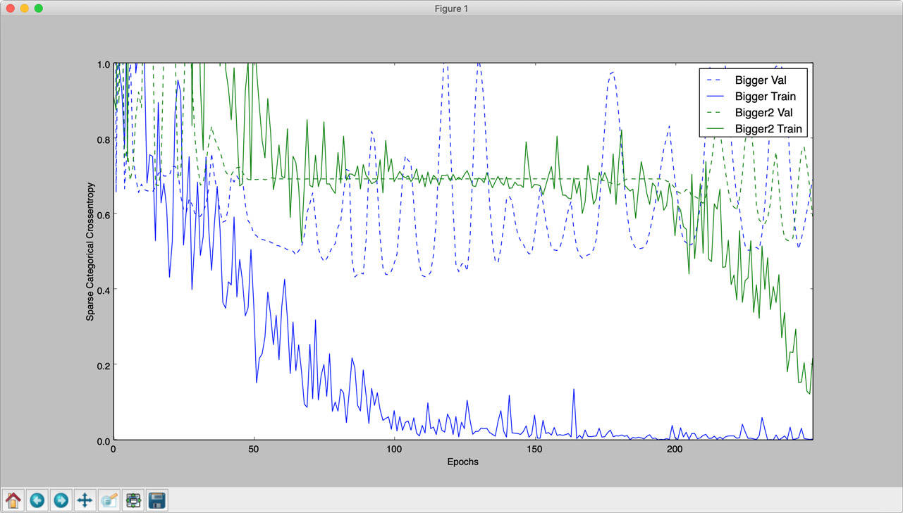
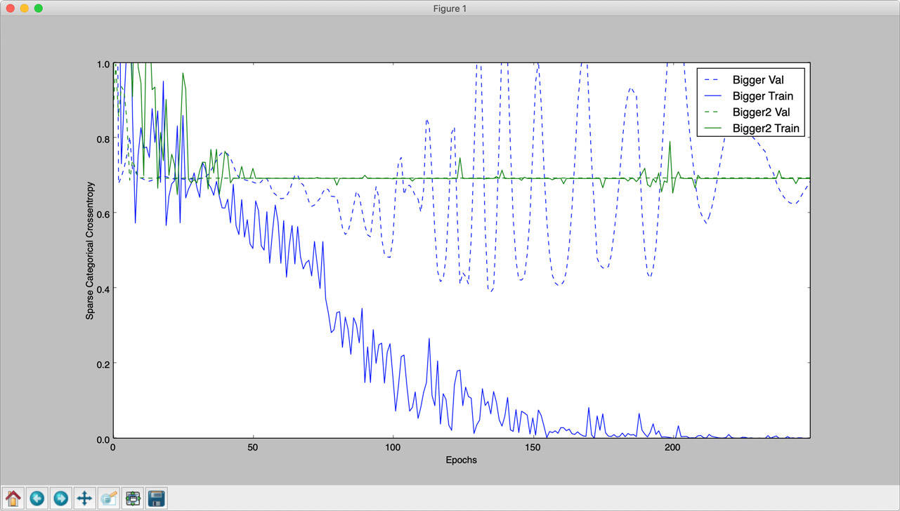
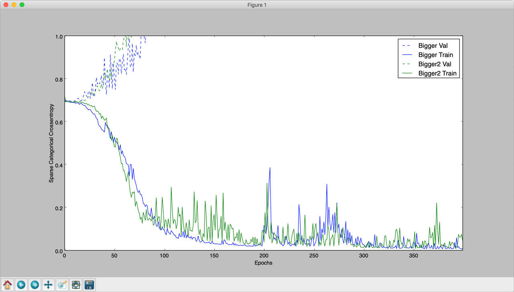
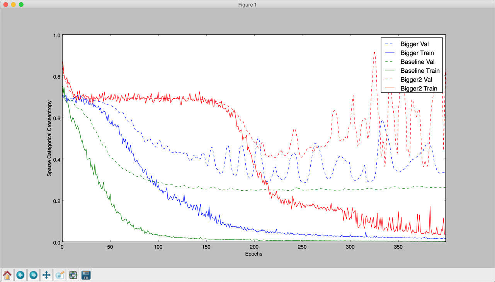
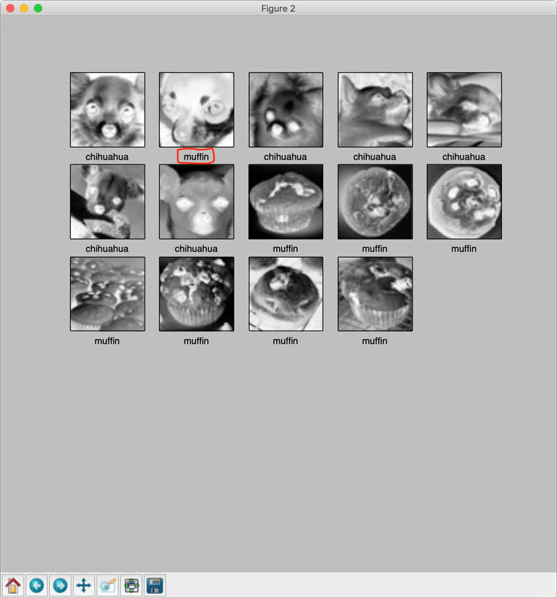

# 优化深度学习模型
使用一些众所周知的机器学习技术改进神经网络模型

**标签:** Keras,TensorFlow,人工智能,数据科学,机器学习,深度学习,视觉识别

[原文链接](https://developer.ibm.com/zh/articles/image-recognition-challenge-with-tensorflow-and-keras-pt2/)

[Prashant Sharma](https://developer.ibm.com/zh/profiles/prashsh1)

更新: 2019-02-19 \| 发布: 2019-02-12

* * *

在我自己的学习过程中，我将会根据 [第 1 部分](https://www.ibm.com/developerworks/cn/cognitive/library/image-recognition-challenge-with-tensorflow-and-keras-pt1/index.html) 继续深入，尝试改进神经网络模型，这里将会使用 [TensorFlow](https://www.tensorflow.org/tutorials/keras/) 上提到的一些众所周知的机器学习技术。

在上一篇文章中，我们看到了训练存在的某些问题。在这篇文章中，我们将解决这些问题，看看结果是否会随着我们的不断处理而改善。

## 在先前的解决方案中观察到的问题

### 过拟合

当模型在训练数据（用于训练模型的数据）上非常准确地执行时，模型被认为是过拟合，但是当根据测试或看不见的数据集进行评估时，模型的表现相当差。发生这种情况是因为模型已经过度拟合数据。

训练准确性高于测试准确性，就是此现象的明确指标。值得庆幸的是，可以采用一些技术解决这个问题。

#### 模型大小

首先，查看一下模型大小，即单位数。如果使用的模型远远大于手头上的问题，那么很有可能会学习与问题无关的特征/模式，因而过拟合训练数据。较大的模型无法很好地概括，而较小的模型将会欠拟合数据。

以上一篇文章中的模型为基准，我们将评估缩小和增加模型大小对模型性能产生的影响。尝试并比较了以下模型：

```

baseline_model = keras.models.Sequential([
        keras.layers.Flatten(input_shape = ( maxsize_w, maxsize_h , 1)),
                keras.layers.Dense(128, activation=tf.nn.sigmoid),
                keras.layers.Dense(16, activation=tf.nn.sigmoid),
        keras.layers.Dense(2, activation=tf.nn.softmax)
        ])

bigger_model2 = keras.models.Sequential([
                keras.layers.Flatten(input_shape = ( maxsize_w, maxsize_h , 1)),
                keras.layers.Dense(1024, activation=tf.nn.relu),
                keras.layers.Dense(512, activation=tf.nn.relu),
                keras.layers.Dense(64, activation=tf.nn.relu),
                keras.layers.Dense(16, activation=tf.nn.relu),
        keras.layers.Dense(2, activation=tf.nn.softmax)
        ])

bigger_model1 = keras.models.Sequential([
        keras.layers.Flatten(input_shape = ( maxsize_w, maxsize_h , 1)),
                keras.layers.Dense(512, activation=tf.nn.relu),
                keras.layers.Dense(128, activation=tf.nn.relu),
                keras.layers.Dense(16, activation=tf.nn.relu),
        keras.layers.Dense(2, activation=tf.nn.softmax)
        ])

smaller_model1 = keras.models.Sequential([
        keras.layers.Flatten(input_shape = ( maxsize_w, maxsize_h , 1)),
                keras.layers.Dense(64, activation=tf.nn.relu),
        keras.layers.Dense(2, activation=tf.nn.softmax)
        ])

```

Show moreShow more icon

为了确定理想的模型，我们将根据训练回合数绘制验证数据的损失函数。

1. Smaller、Bigger 和 Baseline 模型的比较。

    

2. Bigger、Bigger2 和 Baseline 模型的比较。

    


在这些图中，我们看到 `bigger` 和 `bigger2` 模型的验证损失 (`sparse_categorical_crossentropy`) 几乎相似，优于 `smaller` 和 `baseline` 模型。因此，我们接下来选择这些模型而不是 `baseline` 模型，以进一步调优。

#### 训练回合数

训练回合数在避免过拟合和提高整体模型性能方面起着重要作用。在上面绘制的比较图中，我们观察到验证数据的损失函数达到最小值，并且在进一步训练时再次增加，而训练数据的损失函数则进一步减小。这正是过拟合的意思；模型学习特定于数据集的模式，而不能很好地概括，因此处理训练数据时的性能比处理验证数据更佳。我们必须在模型过拟合数据之前停止。因此，在上述情况下，`epoch` 的值为 `40` 比较理想。

#### L1 和 L2 正则化

应用 L2 正则化的效果是向层添加一些随机噪声。下图显示了将此应用于模型的效果。



#### 使用 Dropout

Keras 库提供 dropout 层， _Dropout：一种防止神经网络过拟合的简单方法 (JMLR 2014)_ 中介绍了此概念。添加 dropout 层的结果是训练时间增加，如果 dropout 较高，则会欠拟合。

应用 dropout 层后的模型：

```
bigger_model1 = keras.models.Sequential([
                keras.layers.Flatten(input_shape = ( maxsize_w, maxsize_h , 1)),
                keras.layers.Dense(512, activation=tf.nn.relu),
                keras.layers.Dropout(0.5),
                keras.layers.Dense(128, activation=tf.nn.relu),
                keras.layers.Dense(16, activation=tf.nn.relu),
        keras.layers.Dense(2, activation=tf.nn.softmax)
        ])

bigger_model2 = keras.models.Sequential([
                keras.layers.Flatten(input_shape = ( maxsize_w, maxsize_h , 1)),
                keras.layers.Dense(1024, activation=tf.nn.relu),
                keras.layers.Dropout(0.5),
                keras.layers.Dense(512, activation=tf.nn.relu),
                keras.layers.Dropout(0.5),
                keras.layers.Dense(64, activation=tf.nn.relu),
                keras.layers.Dense(16, activation=tf.nn.relu),
        keras.layers.Dense(2, activation=tf.nn.softmax)
        ])

```

Show moreShow more icon

下图显示了应用 dropout 正则化的效果。



在一次运行期间，Bigger 模型根本没有收敛，即使在 250 个训练回合之后也仍然如此。这是应用 dropout 正则化的副作用之一。



### 缺乏训练数据

由于只有 26 个左右的训练示例，我们做得相当不错。但对于图像处理，通过对原始图像应用一些变形并生成更多数据，存在几种数据增强技术。例如，对于每个输入图像，我们可以将反转颜色图像添加到数据集中。为实现此目的，第 1 部分中的 `load_image_dataset` 函数修改如下（也可以为每个原始图像添加随机旋转的图像）：

```
# invert_image if true, also stores an invert color version of each image in the training set.
def load_image_dataset(path_dir, maxsize, reshape_size, invert_image=False):
        images = []
        labels = []
        os.chdir(path_dir)
        for file in glob.glob("*.jpg"):
                img = jpeg_to_8_bit_greyscale(file, maxsize)
                inv_image = 255 - img # Generate a invert color image of the original.

                if re.match('chihuahua.*', file):
                        images.append(img.reshape(reshape_size))
                        labels.append(0)
                        if invert_image:
                                labels.append(0)
                                images.append(inv_image.reshape(reshape_size))
                elif re.match('muffin.*', file):
                        images.append(img.reshape(reshape_size))
                        labels.append(1)
                        if invert_image:
                                images.append(inv_image.reshape(reshape_size))
        return (np.asarray(images), np.asarray(labels))

```

Show moreShow more icon

添加反转颜色图像和随机旋转图像对使用 dropout 的训练会产生以下影响。数据集的大小增加了 3 倍。



结果表明这加剧了数据的过拟合。

_注意：对于数据增强，Keras 提供了一个内置实用程序 `keras.preprocessing.image.ImageDataGenerator`，此处不作介绍。_

克服最小训练数据问题的另一种方法是使用预训练模型，并使用新的训练示例对其进行扩充。此方法被称为迁移学习。由于 TensorFlow 和 Keras 提供了一种保存和加载模型的良好机制，因此可以很容易地实现，这并不在本文讨论范围之内。

## 结束语

在使用不同模型和激活函数进一步测试时，通过在 Baseline 模型中使用 sigmoid 作为激活函数和 dropout 层观察到了最佳结果。使用 relu 激活函数观察到类似的性能，但对于 sigmoid，曲线更平滑。由于图像尺寸减小到 50×50，因此缩短了训练时间，而不影响模型的性能。

除此之外，我还测试了 VGG 风格多层 CNN 模型和 CNN 模型的多种变体，但不知何故，结果相当差。

下图显示了所有三种模型的结果图。



使用了 Baseline 模型：

```
baseline_model = keras.models.Sequential([
        keras.layers.Flatten(input_shape = ( maxsize_w, maxsize_h , 1)),
                keras.layers.Dense(128, activation=tf.nn.sigmoid),
                keras.layers.Dropout(0.25),
                keras.layers.Dense(16, activation=tf.nn.sigmoid),
        keras.layers.Dense(2, activation=tf.nn.softmax)
        ])

baseline_model.compile(optimizer=keras.optimizers.Adam(lr=0.001),
        loss='sparse_categorical_crossentropy',
        metrics=['accuracy','sparse_categorical_crossentropy'])

```

Show moreShow more icon

输出：

```
- 0s - loss: 0.0217 - acc: 1.0000 - sparse_categorical_crossentropy: 0.0217 - val_loss: 0.2712 - val_acc: 0.9286 - val_sparse_categorical_crossentropy: 0.2712
Epoch 119/400
 - 0s - loss: 0.0224 - acc: 1.0000 - sparse_categorical_crossentropy: 0.0224 - val_loss: 0.2690 - val_acc: 0.9286 - val_sparse_categorical_crossentropy: 0.2690
Epoch 120/400

```

Show moreShow more icon

结果：



接下来，我想加深自己对 CNN 和 VGG 风格的图像识别网络的理解，甚至能够以更高级的方式使用神经网络。

本文翻译自： [Refine your deep learning model](https://developer.ibm.com/articles/image-recognition-challenge-with-tensorflow-and-keras-pt2/)（2019-02-19）