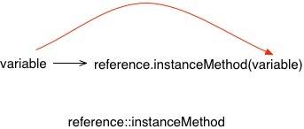
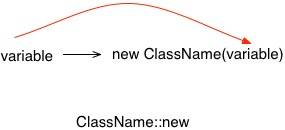
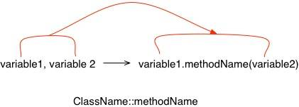

# 传递表达式（pass-through lambdas）的替代方案
学习如何识别 Java 代码中的传递 lambda 表达式（pass-through lambdas）并替换为方法引用

**标签:** Java,Java 平台

[原文链接](https://developer.ibm.com/zh/articles/j-java8idioms5/)

Venkat Subramaniam

发布: 2017-08-02

* * *

**关于本系列**

Java 8 是自 Java 语言诞生以来进行的一次最重大更新  包含了非常丰富的新功能，您可能想知道从何处开始着手了解它。在 [本系列](/zh/series/java-8-idioms/) 中，作者兼教师 Venkat Subramaniam 提供了一种惯用的 Java 8 编程方法：这些简短的探索会激发您反思您认为理所当然的 Java 约定，同时逐步将新方法和语法集成到您的程序中。

Lambda 表达式被广泛用在函数式编程中，但它们很难阅读和理解。在许多情况下，lambda 表达式的存在 _只是_ 为了传递一个或多个形参，最好将它替换为方法引用。在本文中，您将学习如何识别代码中的传递 lambda 表达式，以及如何将它们替换为相应的方法引用。尽管方法引用的使用需要学习，但长期收益很快会超过您最初的付出。

## 传递 lambda 表达式是什么？

在函数式编程中，常常传递 lambda 表达式作为匿名函数，使用 lambda 作为更高阶函数的实参。例如，在清单 1 中，我们将一个 lambda 表达式传递给 `filter` 方法：

##### 一个传递 lambda 表达式

```
List<Integer> numbers = Arrays.asList(1, 2, 3, 4, 5, 6, 7, 8, 9, 10);

numbers.stream()
.filter(e -> e % 2 == 0)
.forEach(e -> System.out.println(e));

```

Show moreShow more icon

请注意，在此代码中，我们还将一个 lambda 表达式传递给了 `forEach` 方法。尽管这两个 lambda 表达式明显具有不同作用，但它们之间还有另一个重要的细微区别：第一个 lambda 表达式实际执行一些工作，而第二个没有。

传递给 `forEach` 方法的 lambda 表达式就是我们所称的 _传递 lambda 表达式_ 。表达式 `e -> System.out.println(e)`将它的形参\_ 作为实参传递给 `PrintStream` 类的 `println` 方法，该方法是 `System.out` 实例。

尽管清单 1 中的第二个 lambda 表达式没有任何错误，但它的语法对于当前这个任务而言过于复杂。为了理解 `(parameters) -> body` 的用途，我们需要进入 _body_ （在 `->` 的右侧）来查看该形参发生了什么。如果该 lambda 表达式没有对该形参执行任何实际操作，则付出的努力就白费了。

在此情况下，将传递 lambda 表达式替换为方法引用会比较有益。不同于方法调用，方法引用指的是我们传递形参的方法。使用方法引用也会带来各种各样的形参传递方式。

尝试像这样重写前面的代码：

##### 通过方法引用传递形参

```
numbers.stream()
.filter(e -> e % 2 == 0)
.forEach(System.out::println);

```

Show moreShow more icon

使用方法引用会减少理解代码的工作。尽管最初的好处可能看起来较小，但随着我们编写和阅读更多代码，好处会倍增。

## 传递形参作为实参

在接下来的几节中，我们将探讨传递 lambda 表达式的变形。我将介绍如何将每种表达式替换为方法引用。

### 实例方法的实参

lambda 表达式将其形参作为实参传递给实例方法，这非常常见。您在清单 1 中已看到，形参 `e` 作为实参传递给 `println` 方法，该方法本身是 `System.out` 的一个实例方法。

在清单 2 中，我们使用以下格式将此 lambda 表达式替换为方法引用 `System.out::println` ： _referenceToInstance::methodName_ 。

在图 1 中可以看到这种替换，图中展示了一个 lambda 表达式的结构，形参作为实参传递给一个实例方法：

##### 从形参到实例方法的实参



如果不熟悉方法引用，查看这样的 lambda 表达式能帮助您理解它的结构和形参传递到何处。要将 lambda 表达式更改为方法引用，只需删除通用的部分（形参和实参），并在方法调用上将点替换为冒号。

#### `this` 上的一个方法的实参

前面的传递表达式的一种特殊情况是，在当前方法的 _context_ 实例上调用实例方法。

假设我们有一个名为 `Example` 的类，其中包含一个实例方法 `increment` ：

##### 一个包含实例方法的类

```
public class Example {
public int increment(int number) {
    return number + 1;
}

//...
}

```

Show moreShow more icon

现在假设我们有另一个实例方法，我们在其中创建了一个 lambda 表达式并将它传递给 `Stream` 的 `map` 方法，如下所示：

##### 一个将形参传递给实例方法的 lambda 表达式

```
.map(e -> increment(e))

```

Show moreShow more icon

可能不那么显而易见，但此代码在结构上非常类似于上一个示例 — 在两种情况下，我们都将形参作为实参传递给实例方法。稍微重写此代码，以让此相似性更加明显：

##### 传递表达式揭秘

```
.map(e -> this.increment(e))

```

Show moreShow more icon

引入冗余的 `this` 作为对 `increment` 的调用的目标，以让传递表达式的结构变得清晰。现在我们可以通过方法引用轻松地解决冗余问题：

##### 方法引用解决冗余问题

```
.map(this::increment)

```

Show moreShow more icon

与将 `e -> System.out.println(e)` 替换为 `System.out::println` 非常相似的是，可以将 lambda 表达式 `e -> increment(e)` （或更准确地讲 `e -> this.increment(e)` ）替换为 `this::increment` 。在两种情况下，代码都更加清晰。

### 静态方法的实参

在前面两个示例中，我们替换的 lambda 表达式将一个形参作为实参传递给实例方法。也可以替换将形参传递给静态方法的 lambda 表达式。

##### 将形参传递给静态方法

```
.map(e -> Integer.valueOf(e))

```

Show moreShow more icon

这里，lambda 表达式将形参作为实参传递给 `Integer` 类的 `valueOf` 方法。该代码的结构与图 1 中所示的结构相同。唯一的区别在于，在这个例子中，被调用的方法是 _静态方法_ 而不是实例方法。就像前两个示例一样，我们将此 lambda 表达式替换为方法引用。我们未将方法引用放在实例上，而将它放在一个类上，如清单 8 所示。

##### 对静态方法的方法引用

```
.map(Integer::valueOf)

```

Show moreShow more icon

总结一下：如果 lambda 表达式的目的仅是将一个形参传递给实例方法，那么可以将它替换为实例上的方法引用。如果传递表达式要传递给静态方法，可以将它替换为类上的方法引用。

## 将形参传递给目标

您可能在两种不同的场景中使用 _ClassName::methodName_ 格式。您刚才已看到第一种场景，其中的形参作为实参传递给静态方法。现在让我们考虑一种变形：形参是方法调用的目标。

##### 使用形参作为目标

```
.map(e -> e.doubleValue())

```

Show moreShow more icon

在这个示例中，形参 `e` （我们假设其推断类型为 `Integer` ）是对 `doubleValue` 方法的调用的目标。图 2 中给出了这种传递 lambda 表达式的结构。

##### 从形参到目标


尽管前两个 lambda 表达式中的形参以不同方式传递 — 一个作为实参传递给静态方法，另一个作为实例方法调用的目标 — 但方法引用的格式完全相同： _ClassName::methodName_ 。

#### 模糊性与方法引用

查看方法引用，不容易确定形参传递给了静态方法还是用作了目标。要了解区别，我们需要知道方法是静态方法还是实例方法。从代码可读性角度讲，这不那么重要，但知道该区别对成功编译至关重要。

如果一个类的一个静态方法和一个兼容的实例方法同名，而且我们使用了方法引用，则编译器将认为该调用模糊不清。所以，举例而言，我们不能将 lambda 表达式 `(Integer e) -> e.toString()` 替换为方法引用 `Integer::toString` ，因为 `Integer` 类同时包含静态方法 `public static String toString(int i)` 和实例方法 `public String toString()` 。

您或您的 IDE 可能建议使用 `Object::toString` 解决这个特定的问题，因为 `Object` 中没有 `static toString` 方法。尽管该解决方案可以编译，但这种小聪明通常没什么帮助。您必须能够确认方法引用正在调用想要的方法。在存在疑问时，最好使用 lambda 表达式，以避免任何混淆或可能的错误。

## 传递构造函数调用

除了静态和实例方法，也可以使用方法引用来表示对构造函数的调用。考虑一个从 `Supplier` 中发出的构造函数调用，Supplier 作为实参提供给 `toCollection` 方法，如下所示。

##### 一个构造函数调用

```
.collect(toCollection(() -> new LinkedList<Double>()));

```

Show moreShow more icon

清单 10 中代码的目的是获取一个数据 `Stream` ，将它精减或收集到一个 `LinkedList` 中。 `toCollection` 方法接受一个 `Supplier` 作为其实参。Supplier 不接受任何形参，因此 `()` 为空。它返回一个 `Collection` 实例，该实例在本例中是 `LinkedList` 。

尽管参数列表是空的，但代码的一般结构如下：

##### 从形参到构造函数实参



收到的形参（可能是空的）被作为实参传递给构造函数。在此示例中，我们可以将 lambda 表达式替换为对 `new` 的方法引用。做法如下：

##### 将构造函数调用替换为方法引用

```
.collect(toCollection(LinkedList::new));

```

Show moreShow more icon

包含方法引用的代码比包含 lambda 表达式的原始代码简洁得多，因此更容易阅读和理解。

## 传递多个实参

目前您已看到了单一形参和传递空形参的例子。但方法引用不仅限于 0 或 1 个形参，它们也适用于多个实参。考虑下面这个 `reduce` 运算：

##### 对 lambda 表达式执行 reduce()

```
.reduce(0, (total, e) -> Integer.sum(total, e)));

```

Show moreShow more icon

在 `Stream<Integer>` 上调用 `reduce` 方法，并使用 `Integer` 的 `sum` 方法对流中的值求和。这个例子中的 lambda 表达式接受两个形参，它们作为实参（按完全相同的顺序）传递给 `sum` 方法。图 4 显示了这个 lambda 表达式的结构。

##### 传递两个形参作为实参


我们可以将这个 lambda 表达式替换为方法引用，如下所示：

##### 替换一个接受两个形参的 lambda 表达式

```
.reduce(0, Integer::sum));

```

Show moreShow more icon

如果 `static` 方法调用接受提供给 lambda 表达式的形参作为实参（与它们在形参列表中出现的顺序完全相同），则可以将 lambda 表达式替换为指向 `static` 方法的方法引用。

#### 作为目标和实参传递

无需将所有形参作为实参传递给 `static` 方法，lambda 表达式可以使用一个形参作为实例方法调用的目标。如果第一个形参用作目标，则可以将 lambda 表达式替换为方法引用。考虑清单 14。

##### 对使用形参作为目标的 lambda 表达式执行 reduce()

```
.reduce("", (result, letter) -> result.concat(letter)));

```

Show moreShow more icon

在这个例子中，在 `Stream<String>` 上调用 `reduce` 方法。该 lambda 表达式使用 `String` 的 `concat` 实例方法串联字符串。这个 lambda 表达式中的传递结构不同于您在上一个 `reduce` 示例中看到的结构：

##### 第一个形参作为调用的目标而传递



lambda 表达式的第一个形参用作实例方法调用的目标。第二个形参用作该方法的实参。根据此顺序，可以将该 lambda 表达式替换为方法引用，如清单 15 所示：

##### 使用第一个形参作为目标的方法引用

```
.reduce("", String::concat));

```

Show moreShow more icon

请注意，尽管该 lambda 表达式调用了一个实例方法，但您再次使用了类名称。换句话说，无论您调用静态方法还是将第一个形参作为目标来调用实例方法，方法引用看起来都是一样的。只要不存在模糊性，就没有问题。

## 最好使用方法引用

要掌握传递 lambda 表达式的变形和结构，以及取代它们的方法引用，需要花一定的时间和精力。我花了两周时间才完全理解这些概念和语法。在这之后，就开始感觉使用方法引用取代传递表达式变得更加自然。

比 lambda 表达式更好的是，方法引用还使您的代码变得非常简洁和富于表达，这可以大大减少阅读代码的工作。要进一步理解这一点，可以考虑最后一个示例。

##### 使用 lambda 表达式的示例

```
List<String> nonNullNamesInUpperCase =
    names.stream()
      .filter(name -> Objects.nonNull(name))
      .map(name -> name.toUpperCase())
      .collect(collectingAndThen(toList(), list -> Collections.unmodifiableList(list)));

```

Show moreShow more icon

给定一个 `List<String> names` ，上面的代码删除列表中的所有 `null` 值，将每个名称转换为大写，并将结果收集到一个无法修改的列表中。

现在让我们使用方法引用重写上述代码。在本例中，每个 lambda 表达式都是一个传递表达式，无论是传递给静态方法还是实例方法。因此，我们将每个 lambda 表达式替换为一个方法引用：

##### 使用方法引用

```

List<String> nonNullNamesInUpperCase =
    names.stream()
      .filter(Objects::nonNull)
      .map(String::toUpperCase)
      .collect(collectingAndThen(toList(), Collections::unmodifiableList));

```

Show moreShow more icon

比较这两个清单，很容易看到使用方法引用的代码更加流畅且更容易阅读。它的意思很简单： _给定名称，过滤非 null 值，映射到大写形式，然后收集到一个不可修改的列表中_ 。

## 结束语

只要看到一个 lambda 表达式的唯一目的是将形参传递给一个或多个其他函数，就需要考虑将该 lambda 表达式替换为方法引用是否更好。决定因素在于，lambda 表达式内没有完成任何实际工作。在这种情况下，lambda 表达式就是一个 _传递_ 表达式，而且它的语法对于当前这个任务而言可能过于复杂了。

对于大部分开发人员，需要花一些精力才能了解如何使用方法引用。但是，一旦熟悉了，您就会发现与使用 lambda 表达式的代码相比，使用方法引用会让同样的代码更流畅且富于表达。