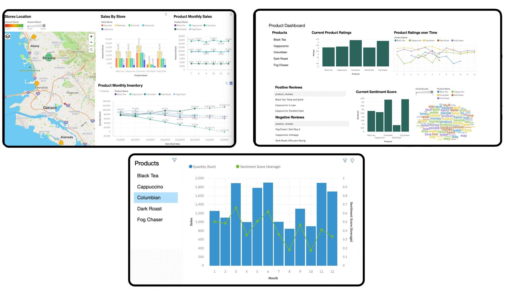
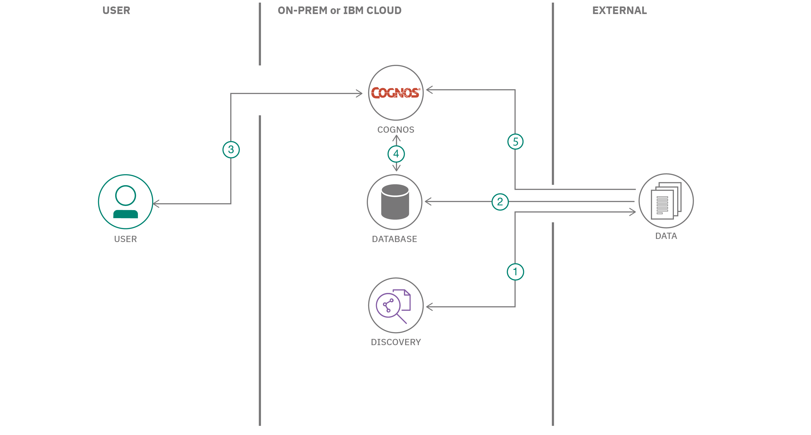
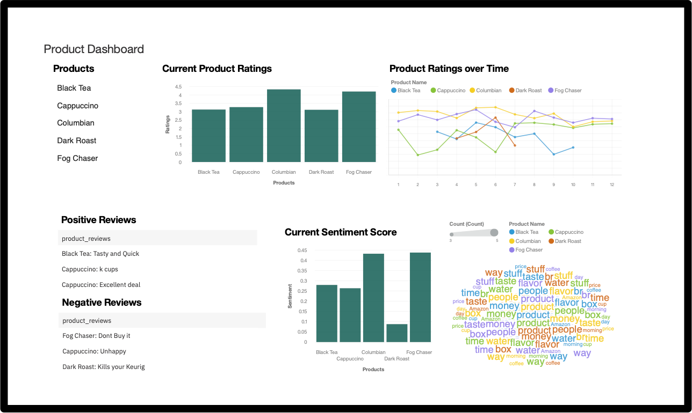
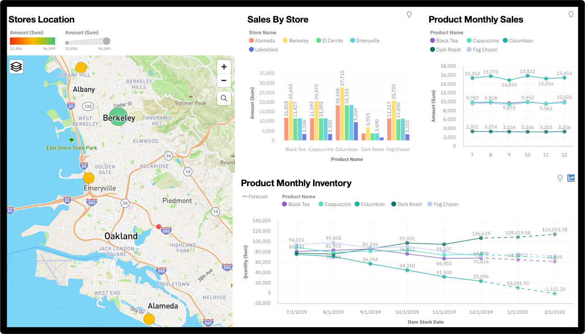

# 使用 AI 分析非结构化数据以便分析产品绩效
在 Watson Discovery 中使用客户反馈在 IBM Cognos Analytics 中显示业务成果

**标签:** IBM Db2 Warehouse,Watson Discovery,人工智能,分析

[原文链接](https://developer.ibm.com/zh/articles/leverage-the-voice-of-the-customer-using-watson-discovery-to-show-business-results-in-cognos-analytics/)

[Richard Hagarty](https://developer.ibm.com/zh/profiles/rich.hagarty), [Sanjeev Ghimire](https://developer.ibm.com/zh/profiles/sanjeev.ghimire), Tom Recchia

更新: 2020-08-19 \| 发布: 2020-07-28

* * *

## 摘要

为了利用客户反馈来推动业务成果，公司需要使用人工智能 (AI) 从客户反馈中涉及到的情感、情绪、概念和关键字中获得可行的洞察。客户想要共享的许多重要数据都有迹可寻。此类数据存在于公共论坛、博客、社交媒体帖子以及与客户代表的聊天记录中。在过去，由于这些数据都是非结构化数据，因此难以使用这些数据。为了解决这个问题，IBM 提供了 AI 解决方案（例如 IBM® Watson™ Discovery 之类的服务），这种解决方案在经过训练后可以汇总、扩充和帮助呈现关键的客户洞察。

在此解决方案的 Code Pattern 中，已将包含产品评论和客户调查的非结构化数据从 Watson Discovery 导入到 Cognos Analytics 中。

## 概览

Cognos Analytics 是一个商业智能解决方案，它为用户提供融合 AI 的自助服务功能，可加速数据准备、分析和报告创建过程。Watson Discovery 是一种洞察引擎和 AI 搜索技术，它可瓦解开放的数据孤岛，并在分析客户服务数据中存在的趋势和关系时检索问题的特定答案。Watson Discovery 应用了机器学习方面的最新技术进展（包括自然语言处理功能），并且可以轻松地接受领域语言的训练。在此解决方案中，已将包含产品评论和客户调查的非结构化数据从 Watson Discovery 导入到 Cognos Analytics 中，并且 Watson Discovery 可以识别出对所调查产品的看法。然后，可以在 Cognos Analytics 仪表板上显示这些数据以及相应的销售收入和产品库存数据。通过结合使用 Cognos Analytics 与 Watson Discovery，您可以：

- 根据客户反馈来获取趋势的预警
- 通过早期干预来识别并处理不断升级的客户互动
- 了解客户偏好，采取适当的营销手段为适当的产品找到合适的客户
- 了解推动增长的因素以及业务投资方向，以提高收入和客户采用率
- 在热门产品流行之前尽早发现产品库存问题
- 找出导致客户流失的根本原因
- 确定可提高净推荐值或其他客户满意度指标的措施

下图提供了在这些 Code Pattern 中创建的可视化类型的示例。

## 架构流程

1. 将产品评论数据加载到 Watson Discovery 中以扩充数据。结果包含情感分析和关键字发现。
2. （可选）将产品和业务数据加载到许多不同的数据库中，如 IBM Db2、Netezza Performance Server、Mongo Db、MySQL等。
3. 用户运行 Cognos Analytics。
4. Cognos Analytics 可以链接到许多不同的数据库，比如 IBM Db2®、Netezza®Performance Server、Mongo Db、MySQL 或直接加载到 Cognos Analytics 中数据文件。

这些 Code Pattern 的主题是基于一家在本地市场出售产品的小型咖啡制造商的数据构建的。数据包括不同咖啡口味的评论和评分，以及相关的销售数据和库存数据。

我们将介绍如何整合来自多个源的数据，以及如何在 Cognos Analytics 中创建可视化来以最佳方式表示数据。

该解决方案中的 Code Pattern 演示了如何结合使用 Cognos Analytics 与 Watson Discovery 来获得客户反馈趋势的预警，以及如何在 Cognos Analytics 中呈现店铺信息、销售数据和库存水平等业务数据，以便分析产品绩效。

## 在 Cognos Analytics 仪表板中呈现来自 Watson Discovery 的非结构化数据

通过 [在 Cognos Analytics 仪表板中呈现来自 Watson Discovery 的非结构化数据](https://developer.ibm.com/zh/patterns/visualize-unstructured-data-from-watson-discovery-in-the-cognos-analytics-dashboard/) Code Pattern，您将学会以下操作步骤：

- 收集产品评论数据
- 将数据上传到 Watson Discovery 中以扩充和分析数据
- 查询 Watson Discovery 以捕获关键字和观点
- 将数据上传到 Cognos Analytics 中以创建数据模块和仪表板可视化

## 利用业务数据可视化客户洞察以便分析产品绩效

[使用业务数据呈现客户洞察以便分析产品绩效](https://developer.ibm.com/zh/patterns/visualize-customer-insights-with-business-data-for-product-performance-analysis/) Code Pattern 基于第一个 Code Pattern，其构建方式如下：

- 添加销售、店铺和库存数据以扩充咖啡公司的产品数据
- 将所有产品和业务数据上传到许多不同的数据库中，比如 IBM Db2、Netezza Performance Server、Mongo Db、MySQL。
- 将 Db2 Warehouse 连接到 Cognos Analytics
- 创建其他 Cognos Analytics 仪表板来呈现业务数据

本文翻译自： [Analyze unstructured data with AI to gain product performance analysis](https://developer.ibm.com/articles/leverage-the-voice-of-the-customer-using-watson-discovery-to-show-business-results-in-cognos-analytics/)（2020-06-05）