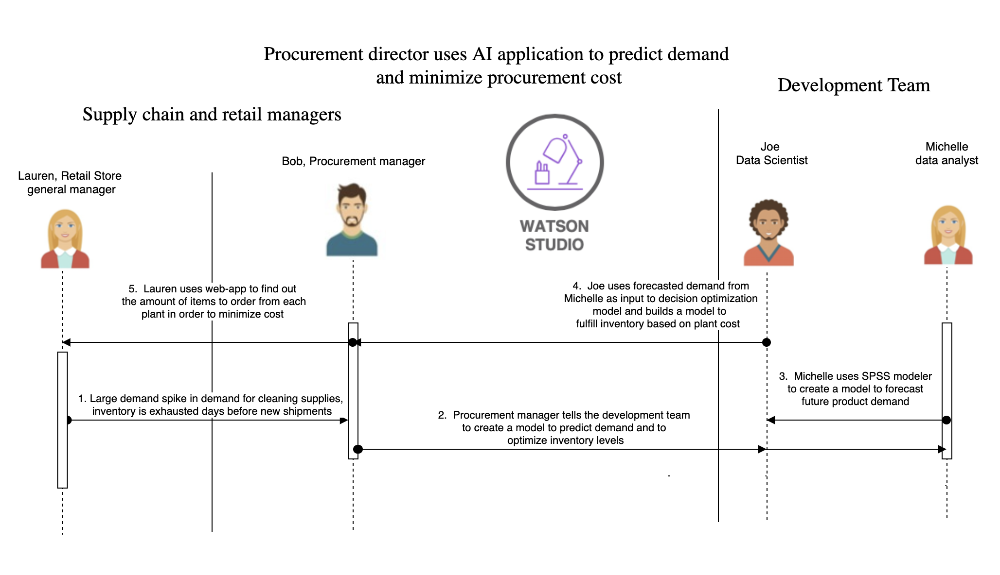
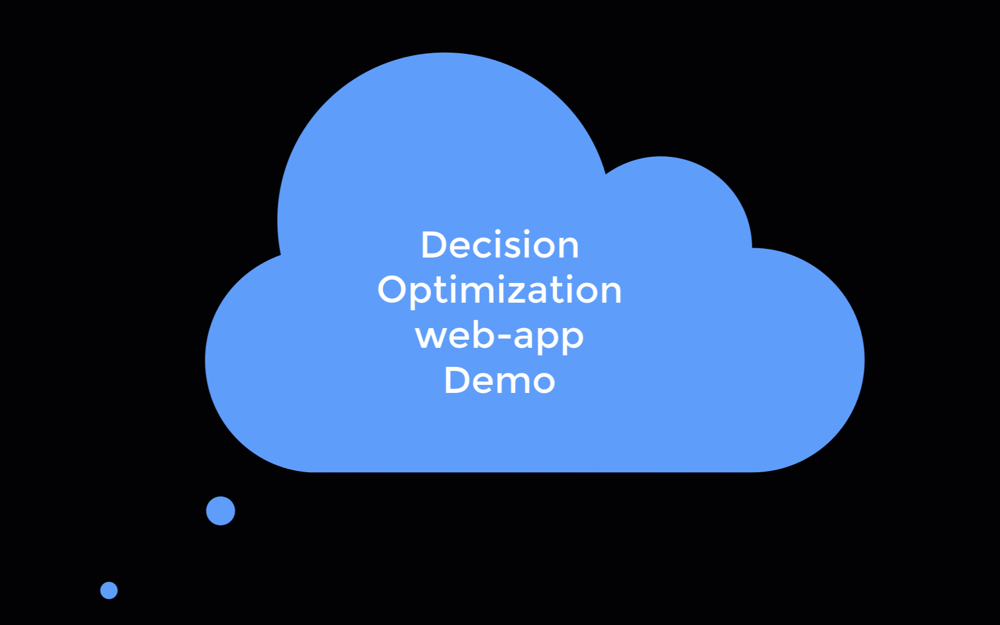

# 使用 AI 制定明智的库存和采购战略
获得库存和采购战略的概述，了解开发团队如何使用机器学习工具和技术来预测需求并控制成本

**标签:** IBM Cloud Pak for Data,IBM SPSS Modeler,Watson Studio,人工智能,机器学习

[原文链接](https://developer.ibm.com/zh/articles/develop-an-intelligent-inventory-and-distribution-strategy-using-ai/)

[Horea Porutiu](https://developer.ibm.com/zh/profiles/horea.porutiu), Nerav Doshi

发布: 2021-01-08

* * *

如今，零售店最重要的工作内容之一就是优化库存。如果库存过多，您将因未售出的商品而蒙受损失。如果库存不足，您将失去从客户身上盈利的机会并丧失客户对您的信任。通过预测需求完美地平衡库存，是机器学习可以帮助您解决的问题。

想象一下，清洁用品需求的激增会导致新增批次商品尚未到货，库存即已卖光。机器可以从这种情况中学习。通过使用这一数据来训练机器学习模型，您可以更准确地预测某些商品的未来需求，并确保客户能够买到想要的东西。

我们将使用此情景作为这一案例研究的基础，假设您是采购经理 Bob。零售店经理 Lauren 通知 Bob，某些清洁用品的库存已经提前几天卖光了。Bob 为开发团队分配任务，要求他们获取过去的需求数据，并训练机器学习模型来预测未来需求。该模型可以预测需求，进而优化库存并最小化采购成本。在完成需求预测之后，用该需求作为优化问题的输入。优化问题解决了从哪个工厂订购商品，从而能够最大程度地降低成本的问题。本文概述了用例，并演示了开发团队将如何使用机器学习工具和技术来解决这些问题。

## 使用 IBM SPSS Modeler 预测未来需求

数据分析师 Michelle 承担了使用 IBM SPSS® Modeler on IBM Cloud® 构建机器学习模型的任务，它是 IBM Cloud上 的 IBM Watson Studio 和 IBM Cloud Pak for Data 的 IBM Watson Studio Premium 的一部分。构建模型后，她使用该模型来预测零售店中特定产品的未来需求。Michelle 将该需求可视化，并将输出发送给数据科学家 Joe，以用作决策优化模型的输入。

阅读 [使用 SPSS Modeler 预测未来产品需求](https://developer.ibm.com/zh/tutorials/predict-future-demand-using-spss-modeler/) 教程，了解使用基于流程的编辑器构建机器学习模型的详细步骤。

## 创建机器学习模型以根据成本优化工厂选择

Joe 收到 Michelle 预测的需求后，将其用作决策优化问题的输入，同时还结合使用了生产需要补货商品的工厂成本和产能。借助 IBM Decision Optimization 引擎，Joe 可以找到最佳的仓库组合以最小化采购成本，同时仍根据预估需求的建议补充库存。决策优化功能是 IBM Cloud 上的 IBM Watson Studio 和 IBM Cloud Pak for Data 的 IBM Watson Studio Premium 的一部分，后者支持多云环境。

阅读 [通过决策优化基于成本和产能优化工厂选择](https://developer.ibm.com/zh/tutorials/optimize-inventory-based-on-demand-with-decision-optimization/) 教程，查看使用基于 UI 的建模助手来构建并部署决策优化模型的详细步骤。

## 为采购经理创建一个 Web 应用程序

既然决策优化模型可以使用，Joe 将创建一个 Web 应用程序。决策优化模型的输入是从 SPSS 模型生成的需求，并且 SPSS 模型会定期运行以获取最新的预测需求。用户可以输入其需求、工厂成本和产能，并从应用程序中获取结果。而这个结果就是为满足需求并最小化成本而从每个工厂订购的商品数量。

使用 [创建一个 Web 应用程序以根据成本和产能优化工厂选择](https://developer.ibm.com/zh/patterns/leverage-decision-optimization-models-in-procurement-app-for-store-managers) Code Pattern，了解如何构建可通过 API 访问已部署的决策优化模型并显示结果以供管理者使用的 Web 应用程序。

## 结束语

在本案例研究中，您将了解开发团队如何通过构建机器学习模型来预测未来需求并制定最佳采购战略，为采购经理提供帮助。通过使用由机器学习模型支持的 Web 应用，管理者能够在几秒钟之内做出由数据驱动的决策。管理者可以确信自己正在利用现有的数据做出最可行的决策，并且公司能够很好地为客户服务且增加利润。随着需求的变化，机器学习模型中会添加新数据，这时就需要重新训练该模型以确保准确性。

本文翻译自： [Develop an intelligent inventory and procurement strategy using AI](https://developer.ibm.com/articles/develop-an-intelligent-inventory-and-distribution-strategy-using-ai/)（2020-11-30）