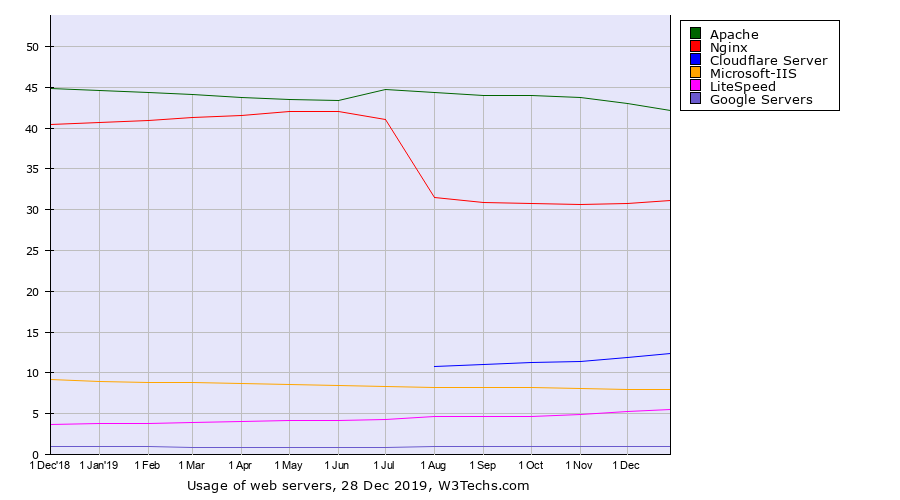
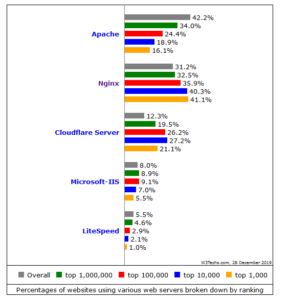

# 使用 AJP 方式配置反向代理
Apache 与 Nginx 配置 AJP

**标签:** DevOps,Web 开发

[原文链接](https://developer.ibm.com/zh/articles/wa-configure-reverse-proxy-with-ajp/)

刘 刚

发布: 2020-02-11

* * *

## 前言

目前，随着公有云的出现，一些大型的服务提供商将很多的基础服务以公有云的形式发布出来，而企业则可以使用这些基础服务，构建其自身特点的业务功能，并将这些功能以服务的形式发布在互联网之上。无论是使用公有云还是私有云服务，这些对外暴露的服务都会面临服务的高性能、与高可用问题。

如何提高服务的高性能？除了增加硬件投入，在软件方面可以优化的地方其实也很多，比如使用高效的通讯协议，就是一种事半功倍的方法。这里我们着重介绍代理服务器中经常使用的 AJP（Apache JServ Protocol）协议。

学习 AJP 协议以及其配置过程，不仅能够使我们更加清楚的了解服务器的执行过程，动静分离的重要性，也更清楚的认识到反向代理在业务中的作用。保证线上服务器的高性能、高可用，已经逐渐成为每个开发者所必须掌握的技能，这也是反向代理所关注和解决的重点。而本文其实是关注于服务器的高性能问题，使用 AJP 协议来快速提高线上服务器的访问性能，缩短请求时间。

### 正向代理和反向代理

正向代理是位于客户端和原始服务器（origin server） 之间的服务器，为了从原始服务器取得内容，客户端向代理发送一个请求并指定目标（原始服务器），然后代理向原始服务器转交请求并将获得的内容返回给客户端。正向代理的典型用途是为在防火墙内的局域网客户端提供访问 Internet 的途径。

反向代理正好相反，对于客户端而言它就像是原始服务器，并且客户端不需要进行任何特别的设置。客户端向反向代理的发送请求，反向代理将判断向何处 (原始服务器) 转交请求，并将获得的内容返回给客户端。反向代理的典型用途是将防火墙后面的服务器提供给 Internet 用户访问。反向代理还可以为后端的多台服务器提供负载平衡，或为后端较慢的服务器提供缓冲服务。

本文关注的重点是反向代理，以及如何使用 AJP 来配置此服务。

### 反向代理与 AJP 协议

AJP 是 Apache 提供的完成与其它服务器通讯的一种二进制协议。在 Apache 中通过 `mod_proxy_ajp` 模块发送 AJP 数据，另一端服务器需要实现 AJP 协议，并能够接受 `mod_proxy_ajp` 模块发送的 AJP 协议数据，在完成对 AJP 协议数据的处理后，将处理结果以 AJP 协议约定的方式返回给 `mod_proxy_ajp` 模块。

AJP 的连接方式比 HTTP 具备更好的性能，同时它具有 HTTP 相同的功能。由于 AJP 协议使用二进制传输方式，因此它比 HTTP 的文本传输方式更有效率。Apache 使用 `mod_proxy` 或者 `mod_proxy_ajp` 来支持 AJP，而对应的后台服务器例如 Tomcat 则需要开启 AJP 服务。

使用 AJP 的优点可以总结如下：

1. AJP 与 Tomcat 之间的通讯属于长链接，能够减少频繁请求带来的消耗。
2. AJP 协议比 HTTP 协议用到的报文更小，请求和应答效率因此会更高。
3. AJP 协议将解析的过程放在 HTTP 服务器中进行。对于 parameter、attribute 还有 http 头，以及一些其他的内容解析都由 Apache 或 Nginx 这样的 HTTP 服务器完成的。使用 C 语言处理报文的解析，效率的提升也是很明显的。

另外，关于 AJP 协议的版本，有必要在这里说明一下，目前支持的协议有 ajp12，ajp13，以及 ajp14。ajp12 协议目前由于版本太老，已经不再被使用，而 ajp14 还属于实验阶段，因此目前被广泛接受和支持的协议是 ajp13，很多时候我们也将 ajp13 协议称之为 AJP1.3 或者 AJP13。

关于 AJP 协议的详细介绍，可以参考 [这里](http://tomcat.apache.org/connectors-doc/ajp/ajpv13a.html)。

## 通过 Apache 配置反向代理

在众多的代理服务器中，最具有代表性的就是 Apache、和 Nginx，它们都是目前使用度最高的代理服务器。关于使用 HTTP 协议来配置代理服务，网上有很多的文章可以参考。但由于我们关注的是服务器的高性能问题，因此如何使 Apache、Nginx 代理服务器支持 AJP 协议，以及如何正确的配置 AJP 模块，才是我们接下来要重点介绍的。

首先，我们来看通过 Apache 配置反向代理服务，这里我们可以使用 `mod_jk` 模块或 `mod_proxy_ajp` 模块来进行配置。

### Apache 配置 mod\_jk

`mod_jk` 作为 Apache 中 AJP 协议的实现，完成 Apache 与 Tomcat 之间的通讯。Tomcat 默认会监听 AJP 连接器的 8009 端口，来接受 AJP 的连接请求，一般来说这些请求都来自前端的 HTTP 服务器（例如 Apache）。

下面我们以 Ubuntu 14.04 作为测试机器，来安装和配置 `mod_jk`。一般来说，在 Ubuntu 上安装软件可以采用 apt 或者源代码编译的方式，这里我们使用简单的 apt 方式来安装和配置 Apache。

#### 安装 Apache HTTP 服务器

```
apt-get instlal apache2

```

Show moreShow more icon

#### 安装 mod\_jk

在 Ubuntu 14 里这个模块被称为 `libapache2-mod-jk`。

```
apt-get install libapache2-mod-jk

```

Show moreShow more icon

安装完后，使用 `dbkp` 检查版本信息：

```
root@ubuntu:/etc/apache2# dpkg -l | grep apache2
ii apache2 2.4.7-1ubuntu4.13 amd64 Apache HTTP Server
ii apache2-bin 2.4.7-1ubuntu4.13 amd64 Apache HTTP Server (binary files and modules)
ii apache2-data 2.4.7-1ubuntu4.13 all Apache HTTP Server (common files)
ii libapache2-mod-jk 1:1.2.37-3 amd64 Apache 2 connector for the Tomcat Java servlet engine

```

Show moreShow more icon

运行 `apache2ctl -M` 检查 `mod_jk` 模块是否安装成功：

```
root@ubuntu:/etc/apache2# apache2ctl -M
... ...
jk_module (shared)
mime_module (shared)
mpm_event_module (shared)
negotiation_module (shared)
setenvif_module (shared)
status_module (shared)

```

Show moreShow more icon

#### 配置 Apache

如果 80 端口被占用，需要修改 `ports.conf` 文件。例如这里修改端口为 8088。

```
root@ubuntu:/etc/apache2# cat ports.conf
# If you just change the port or add more ports here, you will likely also
# have to change the VirtualHost statement in
# /etc/apache2/sites-enabled/000-default.conf

Listen 8088
<IfModule ssl_module>
Listen 443
</IfModule>

<IfModule mod_gnutls.c>
Listen 443
</IfModule>

```

Show moreShow more icon

#### 配置 mod\_jk

默认情况下，`mod_jk` 被安装在 `/etc/libapache2-mod-jk`。

```
root@ubuntu:/etc/libapache2-mod-jk# ll
total 12
drwxr-xr-x 2 root root 4096 12 月 8 14:47 ./
drwxr-xr-x 113 root root 4096 12 月 8 14:54 ../
lrwxrwxrwx 1 root root 33 10 月 22 2013 httpd-jk.conf -> ../apache2/mods-available/jk.conf
-rw-r--r-- 1 root root 2934 12 月 8 14:47 workers.properties

```

Show moreShow more icon

修改 `workers.properties` 文件，配置 `worker list`。本例并不涉及负载均衡服务，因此只有一个 `worker: ajp13_worker`。

```
#
#
# The workers that your plugins should create and work with
#
worker.list=ajp13_worker

#
# Defining a worker named ajp13_worker and of type ajp13
# Note that the name and the type do not have to match.
#
worker.ajp13_worker.port=8009
worker.ajp13_worker.host=192.168.17.93
worker.ajp13_worker.type=ajp13

```

Show moreShow more icon

`worker.ajp13_worker.host` 是 Tomcat 的运行地址，而 `worker.ajp13_worker.port` 是 Tomcat 中 ajp 的对外接口（这部分配置信息，需要对比 Tomcat 中的 `server.xml` 文件）。

### 配置 Apache 的 virtual host

现在需要给 Apache 配置 virtual host，此文件在 `/etc/apache2/sites-enabled` 目录下。

```
root@ubuntu:/etc/apache2/sites-enabled# ll
total 8
drwxr-xr-x 2 root root 4096 12 月 8 15:05 ./
drwxr-xr-x 8 root root 4096 12 月 8 15:23 ../
lrwxrwxrwx 1 root root 35 12 月 6 14:21 000-default.conf -> ../sites-available/000-default.conf

```

Show moreShow more icon

这里我们需要用到 `JkMount` 命令，详细配置如下：

```
<VirtualHost *:8088>
... ...
JkMount /manager/* ajp13_worker
JkMount /manager ajp13_worker
JkMount /examples/* ajp13_worker
JkMount /examples ajp13_worker
</VirtualHost>

```

Show moreShow more icon

这里我们以 Tomcat 下的 `/manager`, `/examples` 应用为例，并将对应用的请求都转发给 `ajp13_worker` 来处理。

#### http 访问

打开浏览器，在地址栏输入 `http://127.0.0.1:8080/examples` 就能够正常访问到 Tomcat 下的 `/examples` 应用了，而不同于 http 的是，现在访问所使用的协议是 ajp。

#### Apache 配置 `mod_proxy_ajp`

除了使用 `mod_jk` 模块来配置外，Apache 还可以使用 `mod_proxy_ajp` 模块来配置反向代理，这里我们仅列出安装的步骤和一些注意事项以及需要区分的概念。

#### 安装 `mod_proxy_ajp`

如果在 Ubuntu 下，可以使用 `a2enmod` / `a2dismod` 脚本来管理 Apache 模块。例如我们希望使用 `proxy_ajp` 模块，可以这样：

```
root@ubuntu:/etc/apache2/mods-available# a2enmod proxy_ajp
Considering dependency proxy for proxy_ajp:
Module proxy already enabled
Enabling module proxy_ajp.
To activate the new configuration, you need to run:
service apache2 restart

```

Show moreShow more icon

如果应用不再需要使用 `proxy_ajp` 模块，可以使用 `a2dismod` 命令：

```
root@ubuntu:/etc/apache2/mods-available# a2dismod proxy_ajp
Module proxy_ajp disabled.
To activate the new configuration, you need to run:
service apache2 restart

```

Show moreShow more icon

查看应用中正在使用的模块列表，可以使用 `apache2ctl -M`。

#### 配置 `mod_proxy_ajp`

配置 `mod_proxy_ajp`，只需要修改 virtual host 部分（由于我们只配置反向代理，因此不需要修改 `proxy.conf` 文件）。

```
root@ubuntu:/etc/apache2/sites-enabled# cat proxy-default.conf
<VirtualHost *:8088>
... ...
ProxyPass /examples/ ajp://192.168.17.93:8009/examples/
ProxyPassReverse /examples/ ajp://192.168.17.93:8009/examples/
</VirtualHost>

```

Show moreShow more icon

如果要使用 HTTP 协议，则需要使用 `a2enmod` 命令，打开 `mod_proxy_http` 模块，并在上面的配置文件中将 `ajp` 修改成 `http`（端口也是需要一并修改的）。

在配置的过程中，我们会经常遇到 `ProxyPass`、`ProxyPassMatch`、`ProxyPassReverse` 这些命令，这里也一并解释一下。

**`ProxyPass`**

其主要用作 URL 前缀匹配，但不能有正则表达式，它里面配置的 PATH 实际上是一个虚拟的路径，在反向代理到后端的 URL 后，路径是不会带过去的。

用法一：不转发请求

`ProxyPass / images/ !`

表示 `/images/` 的请求，不会被转发。

用法二：路径解析

`ProxyPass /mirror/foo/ http://backend.example.com/`

如果请求 `http://example.com/mirror/foo/bar`，转发到目标地址会被替换成 `http://backend.example.com/bar`。

需要注意，在配置文件中应该先配置不被转发的请求，再配置需要被转发的请求。

**`ProxyPassMatch`**

URL 正则匹配，它不是简单的前缀匹配，匹配上的 regex 部分是会带到后端的 URL 的，这个是与 `ProxyPass` 不同的。

用法一：不转发请求

`ProxyPassMatch ^/images !`

表示对 `/images` 的请求，不会被转发。

用法二：转发请求

`ProxyPassMatch ^(/.*.gif) http://backend.example.com`

表示对所有 GIF 图片的请求，都被会转到后端。

注意，如果请求 `http://example.com/foo/bar.gif`，转发到目标地址时会被替换成 `http://backend.example.com/foo/bar.gif`。

**`ProxyPassReverse`**

一般和 `ProxyPass` 指令配合使用，此指令使 Apache 调整 HTTP 重定向应答中 `Location`, `Content-Location`, URI 头里的 `URL`，这样可以避免在 Apache 作为反向代理使用时。后端服务器的 HTTP 重定向造成的绕过反向代理的问题。例如：

```
ProxyPass /example http://www.example.com/
ProxyPassReverse /example http://www.example.com/

```

Show moreShow more icon

如果没有加 `ProxyPassReverse` 作为反向代理设置，在访问 `http://www.test.com/example/a` 时，如果服务器对请求进行了跳转至 `http://www.example.com/b`，那么，客户端就会绕过反向代理，进而访问 `http://www.test.com/example/b`。

而如果设置了反向代理，则会在转交 HTTP 重定向应答到客户端之前调整它为 `http://www.test.com/example/a/b`，即是在原请求之后追加上了跳转的路径。

## 通过 Nginx 配置反向代理

Nginx 是一款轻量级的 Web 服务器/反向代理服务器及电子邮件（IMAP/POP3）代理服务器。在 Java 的 Web 架构中，通常使用 Tomcat 和 Nginx 进行配合，Nginx 作为反向代理服务器，可以对后台的 Tomcat 服务器负载均衡，也可以让 Nginx 处理静态页面的请求、Tomcat 处理 JSP 页面请求达到动静分离的目的。

Nginx 是由 Igor Sysoev 为俄罗斯访问量第二的 Rambler.ru 站点开发的。其特点是占有内存少，并发能力强，事实上 Nginx 的并发能力确实在同类型的网页服务器中表现较好。根据 W3Techs.com 上数据显示， 截止到 2019 年 12 月, Nginx 仅次于 Apache 成为第二大 Web 服务器软件（如图 1 所示），而在全球最忙碌 Top10,000 网站中使用比例更是高达 40.3%（如图 2 所示）。其发展速度和流行程度已经远远超过其它同类软件, 成为大型网站和高并发网站的首选。

**图 1\. W3Techs.com 上各个 Web 服务器的使用情况**



**图 2\. W3techs.com 上全球 Top 网站 Web 服务器的使用情况**



默认情况下 Nginx 并没有提供对 AJP 的支持，需要使用到第三方模块。具体安装步骤如下。

### 安装 Nginx

```
mkdir -p /usr/src/nginx && cd /usr/src/nginx
apt-get install unzip

wget http://www.openssl.org/source/openssl-1.0.1j.tar.gz
tar zxvf openssl-1.0.1j.tar.gz

wget http://www.zlib.net/zlib-1.2.11.tar.gz
tar zxvf zlib-1.2.11.tar.gz

wget https://ftp.pcre.org/pub/pcre/pcre-8.42.zip
unzip pcre-8.42.zip

wget http://nginx.org/download/nginx-1.4.4.tar.gz
tar nginx-1.4.4.tar.gz

```

Show moreShow more icon

### 安装 AJP 模块

```
wget https://codeload.github.com/yaoweibin/nginx_ajp_module/zip/master -O nginx_ajp_module-master.zip
unzip nginx_ajp_module-master.zip

```

Show moreShow more icon

### 编译 Nginx + AJP 模块

```
./configure --prefix=/usr/local/nginx --sbin-path=/usr/local/nginx/sbin/nginx --conf-path=/usr/local/nginx/conf/nginx.conf --error-log-path=/usr/local/nginx/logs/error/error.log --pid-path=/usr/local/nginx/logs/nginx.pid --user=nginx --group=nginx --http-log-path=/usr/local/nginx/logs/httpd.log --http-client-body-temp-path=/usr/local/nginx/temp/http-client-body-temp --http-proxy-temp-path=/usr/local/nginx/temp/http-proxy-temp --without-http_fastcgi_module --http-uwsgi-temp-path=/usr/local/nginx/temp/http-uwsgi-temp --http-scgi-temp-path=/usr/local/nginx/temp/http-scgi-temp --with-pcre=/usr/src/nginx/pcre-8.42 --with-zlib=/usr/src/nginx/zlib-1.2.11/ --add-module=/usr/src/nginx/nginx_ajp_module-0.3.0/ --with-openssl=/usr/src/nginx/openssl-1.0.1j/ --with-http_ssl_module

make
make install

```

Show moreShow more icon

如果编译时遇到问题报错 `-getpwnam("nginx") failed`，应该是由于没有安装 Nginx 用户导致启动失败，执行如下命令，增加 Nginx 用户。

```
useradd -s /sbin/nologin -M nginx
id nginx

```

Show moreShow more icon

### Nginx + AJP 简单配置

```
http {
upstream tomcats {
      server 127.0.0.1:8009;
      keepalive 10;
}

server {
      listen 80;
      location / {
          ajp_connect_timeout 120s;
          ajp_keep_conn on;
          ajp_pass tomcats;
      }
}
}

```

Show moreShow more icon

关于 Nginx AJP 模块的详细介绍，可以参考 [这里](https://github.com/yaoweibin/nginx_ajp_module)。

## 结束语

本文详细介绍了正向代理、反向代理、以及 AJP 协议的相关概念，并重点介绍目前主流的 HTTP 服务器 Apache、和 Nginx 对于 AJP 的支持以及详细的配置步骤，尤其是 Nginx 部分，由于目前 Nginx 本身并不支持 AJP，需要手动编译源代码。本文关注的是服务器的高性能问题，关于服务器的高可用，您可以继续学习负载均衡方面的内容。