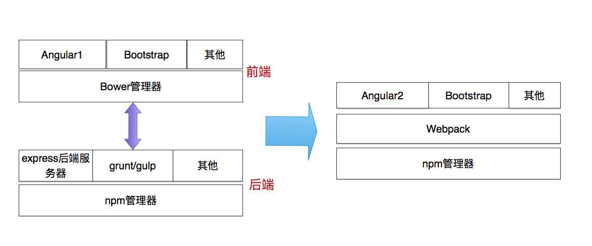
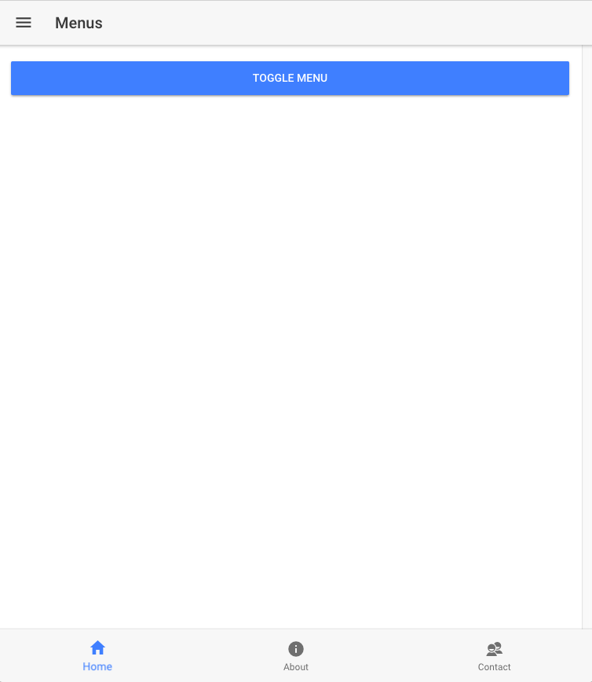
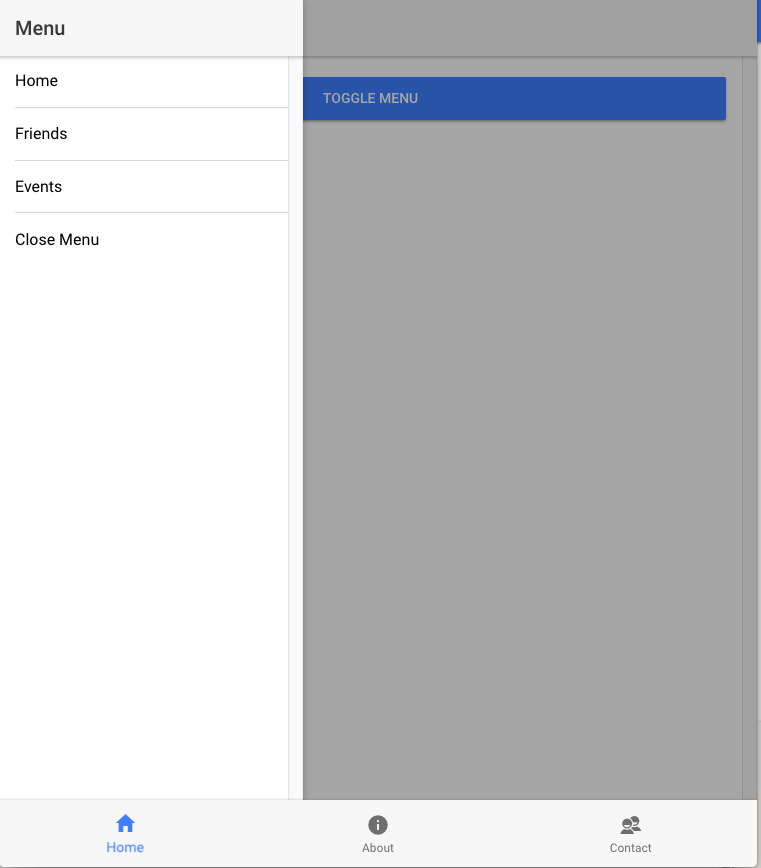
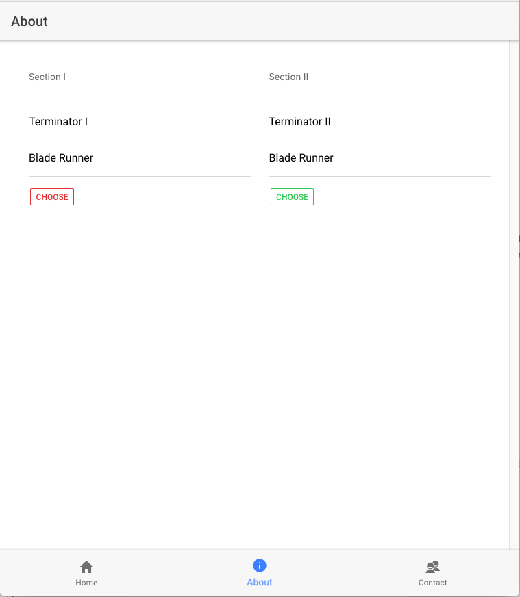
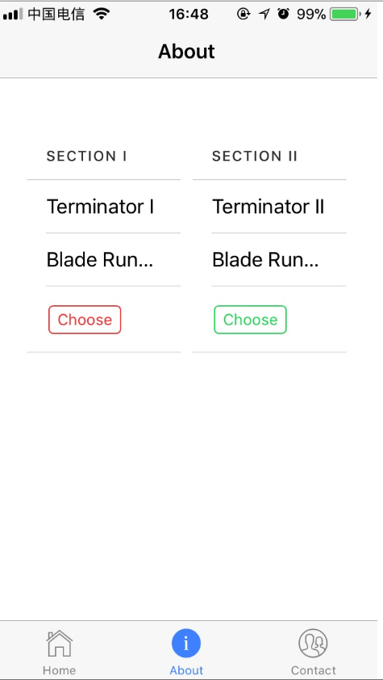

# 使用 Angular2 和 Ionic3 开发 iOS 应用
了解如何快速搭建环境、使用组件、进行真机测试

**标签:** Android,Apache Cordova,Web 开发,移动开发

[原文链接](https://developer.ibm.com/zh/articles/wa-use-angular2-and-ionic3-develop-ios/)

虞里杉

发布: 2018-01-10

* * *

## 从 Angular1 到 Angular2

Angular2 作为著名前端 MVVM 架构 Angular1 的继承者，从一定程度上说，引领了新一代 Web 前端开发技术的革新。从最新版的 ember.js, react.js, vue.js 中，可以看到这几种技术相互借鉴，取长补短，最终向一种技术方向演进。

### 组件化技术的崛起

Angular1 也有组件，叫另外一个名字：指令。在 Angular1 中，指令是 DOM 元素紧密结合的一段包含控制逻辑、数据管理的代码。在指令中，我们可以清楚的看到 Angular1 对于 Jquery/DOM 技术的使用，以及手动对 Angular 组件进行生命周期的管理。要知道，这些在一般的 Angular 控制器/页面模板的开发中，是不用被关心的。

Angular2 把组件扩大化，使这种类似于指令化的开发应用到页面开发中。这样有什么好处呢？

- 增加了开发人员页面开发的灵活性
- 使用新的文件引用技术，这点我们在 Webpack 的革新中具体阐述
- css 的分离化管理

如果了解其他的开发技术，可以发现组件化渐渐的统治了前端开发领域。从 ember.js，vue.js，到 React.js，组件化技术都被广泛应用。

### 从 grunt/gulp 到 Webpack 的技术革新

Task runner, 从最早的 grunt，到 gulp，是服务于应用程序的一些控制程序。有帮助开发人员进行开发、运行单元集成测试、帮助产品发布等等一系列功能，一般我们依赖于第三方的程序来实现，例如 gulp。但是 npm 本身就有 task runner 的功能，如清单 1，scripts 中包含了可以运行的 ionic 任务。使用类似 npm run clean 就可以运行任务，不需要其他依赖。

##### 清单 1\. Npm 配置提供 task runner 功能

```
        {
         //package.json
         "name": "iamsaying",
         "version": "0.0.1",
         "author": "Ionic Framework",
         "homepage": "http://ionicframework.com/",
         "private": true,
"scripts": {// 可运行的任务
         "clean": "ionic-app-scripts clean",
         "build": "ionic-app-scripts build",
         "lint": "ionic-app-scripts lint",
         "ionic:build": "ionic-app-scripts build",
         "ionic:serve": "ionic-app-scripts serve"
         }
         //更多
        }

```

Show moreShow more icon

这就有一个问题了，为什么有 npm task runner，还要使用三方的 gulp 来完成此项功能呢？因为 npm task runner 太简单了，从字面上看，只是一条 shell 命令。但是 gulp 能做什么呢？如清单 2 是一段用 gulp 向 index.html 中注入相应的 bower\_components 的任务。可以看出，gulp 任务复杂，需要写代码。

##### 清单 2\. Gulp 配置注入 index.html 相关的 js 文件

```
//gulpfile.babel.js
gulp.task('bower', function () {
return gulp.src(paths.views.main)
.pipe(wiredep({
directory: yeoman.app + '/bower_components'
}))
.pipe(gulp.dest(yeoman.app));
});

```

Show moreShow more icon

Webpack 代替了 grunt/gulp。为什么这么说？因为，Webpack 通过插件提供的能力，可以完成打包、扰码、开发、调试及 css 处理等任务。这块和 grunt/gulp 的功能重复了。事实上，也可以使用 gulp 来运行 Webpack，但是这种设计冗余了，gulp 的存在完全没有必要。

此外，Webpack 还有一项重要的功能，它改变了代码之间依赖的表示方法。上面的 gulp task 中 wiredep 用来在 index.html 中注入项目中所有的 bower 依赖，如清单 3。可以看出，通过浏览器的支持，js 之间可以相互引用，相互依赖。

##### 清单 3\. Wiredep 注入引用的 js 文件

```
<!-- build:js(.) scripts/vendor.js -->
<!-- bower:js -->
<script
    src="bower_components/jquery/dist/jquery.js"></script>
<script
    src="bower_components/jquery-ui/jquery-ui.js"></script>
<script src="bower_components/angular/angular.js"></script>
<script
    src="bower_components/bootstrap/dist/js/bootstrap.js"></script>
<!-- endbower -->
<!-- endbuild -->
<!-- build:js(app) scripts/scripts.js -->
<!-- 3rd party packages should lay before scripts in projects-->
<script src="build-scripts/app.js"></script>
<script src="build-scripts/controllers/main.js"></script>
<script
    src="build-scripts/controllers/task/management.js"></script>
<script
    src="build-scripts/controllers/label/management.js"></script>
<script
    src="build-scripts/controllers/system/management.js"></script>
<!-- endbuild -->

```

Show moreShow more icon

Webpack 是怎么做的呢？如清单 4，这个代码是放在控制器中，显示的是声明依赖，这里使用了 ES6 的语法 import。相比较 wiredep 中的放在全局、使用相互引用的方式，Webpack 引用更加清晰，按需所取。这样一来，bower 管理器也没有必要存在了，因为 bower 作为服务于浏览器的包管理器，使用方式类似于 wiredep 这种互相引用方式，但是这种互相引用的方式在 Webpack 的声明依赖的模式中，并不适用。

##### 清单 4\. Angular2 中的 JS 相互引用

```
import { AboutPage } from '../pages/about/about';
import { ContactPage } from '../pages/contact/contact';
import { HomePage } from '../pages/home/home';
import { TabsPage } from '../pages/tabs/tabs';

```

Show moreShow more icon

所以，最后架构变成了什么样子？ 从 npm 管理后端、控制程序依赖、bower 管理前端 JS 依赖的架构演化成 npm 来管理所有依赖、Webpack 完成打包、测试功能的架构。如图 1。

##### 图 1\. 从 Angular1 到 Angular2 的技术演进



### ES6 成为规范

js 框架的发展可谓是百花齐放，但是有一项技术在业界普遍达成共识，那就是 ES6。作为新一代的 js 语法规范，不但在浏览器端得到了广泛实现，而且应用于 Node 引擎端。

ES 对 JS 语言进行了扩充，使之更像是一门规范的面向对象语言。而 TS（typescript）在此基础之上，增加了类型定义及其检查的功能。例如清单 5 的 ionic 初始化程序段，用到了 Platform, StatusBar 的自定义数据类型。

##### 清单 5\. Typescript 使用强类型声明变量

```
export class MyApp {
rootPage:any = TabsPage;
constructor(platform: Platform, statusBar: StatusBar, splashScreen:
    SplashScreen) {
platform.ready().then(() => {
// Okay, so the platform is ready and our plugins are available.
// Here you can do any higher level native things you might need.
statusBar.styleDefault();
splashScreen.hide();
});
}
}

```

Show moreShow more icon

### Angular-cli

最后要说一下 Angular-cli 项目，现在各个框架提供者都会在框架之外提供一个 CLI 工具，包括 ember-cli, vue-cli 等等，帮助生成框架的脚手架。

##### 清单 6\. 使用 Angular-cli 初始化项目

```
> npm install -g @angular/cli
> ng new project
> cd project
> ng serve

```

Show moreShow more icon

现在的 Web 开发技术，大多使用了组件化的模块组织结构，采用 npm/Webpack 等工具统一管理模块依赖。

## Ionic3 开发

ionic 是移动端混合开发技术的代表技术，基于 Angular。移动混合开发技术，既使用 Web 开发技术，同时可以生成 iOS 和 Android native 的代码。通过 cordova，支持调用移动设备特有的 API，包括照相机，麦克风等等。随着 Angular 升级到 2，ionic 也支持了 Angular2 和 TS 的语法。

### Ionic-cli

Ionic 提供的 CLI 工具，类似于 Angular-cli。我们使用它初始化一个项目。如清单 7。

##### 清单 7\. 使用 Ionic-cli 初始化项目

```
> npm install -g ionic cordova
> ionic start test tabs
> cd test
> ionic serve

```

Show moreShow more icon

### 全局导航方式

这里可以看到运行 ionic start 创建脚手架的时候可以指定一个模板。如清单 7 中的 tabs。这里的模板分为两种，代表了 ionic 默认提供的两种全局导航方式，tabs 和 menu。

tabs 布局提供了 app 下方的导航。如图 2 的 home，about 的几个选项；menu 布局提供了左边的滑动菜单，点击按钮，会出现滑动选项，如图 3。

##### 图 2\. 底部的 tabs 布局方式



##### 图 3\. 侧边栏的 menu 布局方式



这里提供实现 menu 逻辑布局的代码，如清单 8，需要在控制器中注入 MenuController。

##### 清单 8\. Menu 布局的控制器逻辑样例

```
import { Component } from '@angular/core';
import {MenuController, NavController} from 'ionic-angular';
@Component({
selector: 'page-home',
templateUrl: 'home.html'
})
export class HomePage {
constructor(public navCtrl: NavController, menu: MenuController) {
menu.enable(true);
}
}

```

Show moreShow more icon

##### 清单 9\. Menu 布局的前端显示样例

```
<ion-header>
<ion-navbar>
<button ion-button menuToggle icon-only>
<ion-icon name='menu'></ion-icon>
</button>
<ion-title>
Menus
</ion-title>
</ion-navbar>
</ion-header>
<ion-content padding>
<button ion-button block menuToggle>Toggle Menu</button>
</ion-content>
<ion-menu [content]="content">
<ion-header>
<ion-toolbar>
<ion-title>Menu</ion-title>
</ion-toolbar>
</ion-header>
<ion-content>
<ion-list>
<button ion-item (click)="openPage(homePage)">
Home
</button>
<button ion-item (click)="openPage(friendsPage)">
Friends
</button>
<button ion-item (click)="openPage(eventsPage)">
Events
</button>
<button ion-item (click)="closeMenu()">
Close Menu
</button>
</ion-list>
</ion-content>
</ion-menu>
<ion-nav id="nav" #content></ion-nav>

```

Show moreShow more icon

### 页面布局元素

回到单个的页面布局，ionic 提供 header 和 content 两块。每块都可能包含多个元素，并且支持 grid 布局。Grid 类似于 bootstrap 前端布局的方式，它会把页面分为 12 格，可以使用 col-x 标明一个元素在页面中占格的区域。这里给出一个 List 元素在 grid 布局下的应用代码。如清单 10，采用了两个 col-6 把页面分为两列，它生成的样式如图 4。

##### 清单 10\. List 元素在 grid 布局下的样例代码

```
<ion-header>
<ion-navbar>
<ion-title>
About
</ion-title>
</ion-navbar>
</ion-header>
<ion-content padding>
<ion-grid>
<ion-row>
<ion-col col-6>
<ion-list>
<ion-list-header>
Section I
</ion-list-header>
<ion-item>Terminator I</ion-item>
<ion-item>Blade Runner</ion-item>
<ion-item>
<button ion-button color="danger" outline>Choose</button>
</ion-item>
</ion-list>
</ion-col>
<ion-col col-6>
<ion-list>
<ion-list-header>
Section II
</ion-list-header>
<ion-item>Terminator II</ion-item>
<ion-item>Blade Runner</ion-item>
<ion-item>
<button ion-button color="secondary"
    outline>Choose</button>
</ion-item>
</ion-list>
</ion-col>
</ion-row>
</ion-grid>
</ion-content>

```

Show moreShow more icon

##### 图 4\. 使用 grid 分割页面布局



在一个 grid 控制的区域中，可以使用嵌套页面的方式布局元素，例如图 4 中的 list 元素。从大体上，这里的页面布局元素分为两大类。

- 列式元素，包括 List/Card 等
- 多页面元素，占据整个页，通过点击实现页面跳转和返回，包括 Modal/Segment/Slide 等

### 其他元素

当然，还有一些页面必须元素，例如按钮、输入框等用于页面交互的元素；另外，也有提示框，脚标等等提示元素。这块和 Web 开发很相似。

相比于 Web 开发，ionic 同样使用了 grid 的 12 列布局模式。在整体的风格方面，受限于移动端的显示大小，提供的页面分割元素相对简单。在页面交互中，ionic 提供 List，Card，Segment 等页面控制风格，我们可以根据需求选择。

## 真机测试

最后一段，我们来说一下真机测试。运行添加 iOS 平台命令来初始化 iOS 工作区。完成后，会在项目的 platforms 文件夹下有 ios 目录，这里有生成供 Xcode 调用的代码。如清单 11。

##### 清单 11\. Ionic 初始化 ios 和 android 平台

```
> ionic cordova platform add ios
> ionic cordova platform add android

```

Show moreShow more icon

使用 xcode 打开 plaforms/ios/test.xcworkspace 工作区。在设备里面，可以选择模拟器例如 iphone6，iphone7，也可以选择连接到 Mac 的真机。由于 iOS 开发是要收费的，所以我们需要配置一个临时测试环境。

1. 打开 Xcode->Preferences->Accounts->Manage Certificates，新增一个 iOS Development 的证书。
2. 修改 Resources 目录下的.plist 文件的 Bundle identifier，给自己的项目填写一个开发组。
3. 最后，在手机上打开通用->设备管理，选择信任开发的 iOS 程序。

如图 5，结果在真机上显示。

##### 图 5\. 真机测试



最后，祝大家早日学会用 ionic3/Angular2 开发出自己的移动端程序。