# 使用 Ansible 实现数据中心自动化管理
Ansible 核心组件的使用场景展示

**标签:** DevOps,Python,容器

[原文链接](https://developer.ibm.com/zh/articles/os-using-ansible-for-data-center-it-automation/)

魏 新宇

发布: 2019-03-14

* * *

长久以来，IT 运维在企业内部一直是个耗人耗力的事情。随着虚拟化的大量应用、私有云、容器的不断普及，数据中心内部的压力愈发增加。传统的自动化工具，往往是面向于数据中心特定的一类对象，例如操作系统、虚拟化、网络设备的自动化运维工具往往是不同的。那么，有没有一种数据中心级别的统一的自动化运维工具呢？

答案就是 [Ansible](https://www.ansible.com/) 。和传统的自动化工具 （如 Puppet）相比，Ansible 尤其明显的优势：

- 简单，是一种高级的脚本类语言，而非标准语言。
- 不需要安装 agent，分为管理节点和远程被管节点通过 SSH 认证。
- 纳管范围广泛，不仅仅是操作系统，还包括各种虚拟化、公有云，甚至网络设备。

接下来，本文将针对 Ansible 这一开源 IT 自动化运维工具进行介绍，并通过实验场景让您了解 Ansible 的实际作用。

## Ansible 简介

Ansible 是一个简便的 IT 自动化引擎。近期，Ansible 在 [Github](https://github.com/ansible/ansible) 上是一个非常热门的开源项目，可以参见下图该项目的 Star、Fork 和 commits 数量。

##### 图 1\. Github 上 Ansible Repo

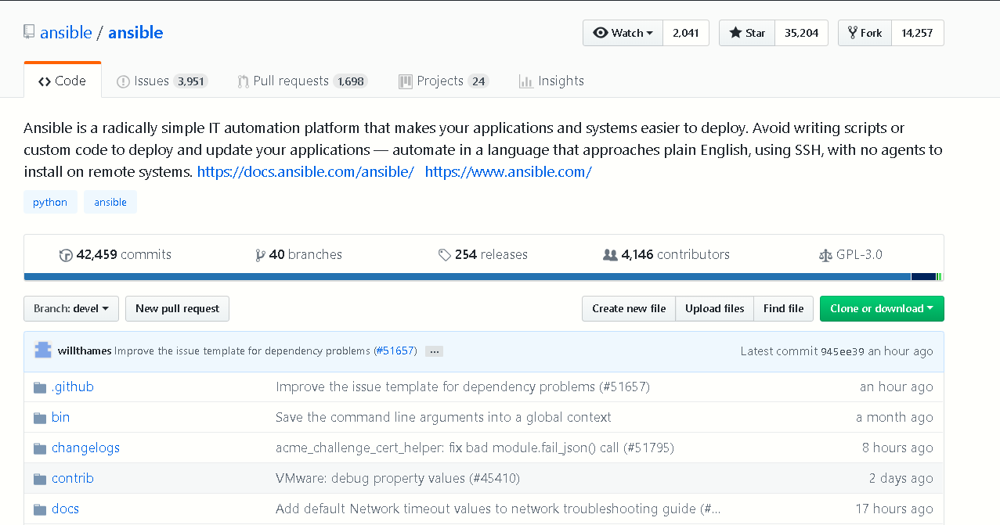

那么，Ansible 能够纳管（管理）哪些数据中心对象呢？通过查看 [Ansible 的模块](https://docs.ansible.com/ansible/latest/dev_guide/platforms/openstack_guidelines.html) （Modules，后文将具体介绍）可知，它几乎支持数据中心的一切自动化，包括（不限于）：

- 操作系统层面：从 Linux（物理机、虚拟机、云环境）, Unix,到 Windows。
- 虚拟化平台：VMware、Docker、Cloudstack、LXC、Openstack 等。
- 商业化硬件：F5、ASA、Citrix、Eos 以及各种服务器设备的管理。
- 系统应用层：Apache、Zabbix、RabbitMQ、SVN、GIT 等。
- 红帽解决方案：Openshift、Ceph、GlusterFS 等，支持几乎所有红帽解决方案的一键部署和配置。
- 云平台： [IBM Cloud](https://developer.ibm.com/recipes/tutorials/ansible-application-deployment-on-ibm-cloud-iaas/?mhq=Ansible&mhsrc=ibmsearch_a) 、AWS、Azure、Cloudflare、Red Hat CloudForms、Google、Linode、Digital Ocean 等。

接下来，我们来了解一下 Ansible 的相关组件，看它如何纳管数据中心的对象。

### Ansible 的组件

Ansible 的核心组件包括：Modules、Inventory、Playbook、Roles 和 Plugins。

**Modules**

我们在 Linux 上书写 Shell，需要调用 Linux 操作系统命令，如 `ls、mv、chmod` 等；在书写 POJO 时，需要调用 Java 相关 Pattern。Linux 系统命令对 Shell 而言和 Java Pattern 对于 POJO 而言，都是被调用的模块。Modules 就是使用 Ansible 进行自动化任务时调用的模块。在工作方时，Ansible 首先连接（默认通过 SSH）被管理节点（可能是服务器、公有云或、网络设备等），然后向这些节点推送 Modules、执行这些 Modules，并在完成后删除 Modules。

Modules 是 Ansible 的核心资产，有了 Modules，我们才能调用这些 Modules 来完成我们想要执行的自动化任务。举个例子：selinux – Change policy and state of SELinux。这个 Module 对的作用是配置配置 SELinux 模式和策略。我们可以通过调用这个 Module，来配置 RHEL/CentOS 的 SELinux 模式(eforcing、permissive 或 disabled)。目前 [社区中 Modules](https://docs.ansible.com/ansible/latest/dev_guide/platforms/openstack_guidelines.html) 数量非常多、涵盖范围非常广，并且以较快的速度进行增长。

**Inventory**

Inventory 是 Ansible 要管理对象的清单。在清单中，还可以配置分组信息等。举例如下：

##### 清单 1\. Inventory 示例

```
[webservers]
www1.example.com
www2.example.com

[dbservers]
db0.example.com
db1.example.com

```

Show moreShow more icon

如果说 Modules 是我们使用 Ansible 进行自动化任务时调用的模块。那么 Playbook 就是 Ansible 自动化任务的脚本（YAML 格式）。

**Roles**

Roles 是将 Playbook 分成多个文件的主要机制。这简化了编写复杂的 Playbook，并使其更易于重用。通过 Roles 可以将 Playbook 分解为可重用的组件。

**Plugins**

[Plugins](https://docs.ansible.com/ansible/latest/plugins/plugins.html) 是增强 Ansible 核心功能的代码。Ansible 附带了许多方便的插件，如果这些插件不够，我们可以编写自己的插件。Ansible 自带的 Plugins 如下图所示：

##### 图 2\. Ansible Plugins

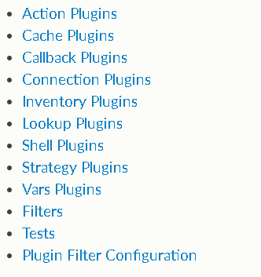

Plugins 与 Modules 一起执行 Playbook 任务所需的自动化任务的动作。当我们使用 Modules 的时候如果需要调用 Plugins，Action Plugins 默认会被自动执行。

以上文提到的 Selinux Module 举例。在书写 Playbook 是要调用 Selinux Modules，完成对 RHEL/CentOS 的 SElinux 模式的配置，这就是一个 Action。这需要 Selinux Modules 调用 Action Plugins 一起完成。

Plugins 的作用有很多，例如 Cache Plugins 的作用是实现后端缓存机制，允许 Ansible 存储收集到的 inventory 源数据。

## Ansible 基本使用场景

在本章中，我们将介绍 Ansible 的基本使用场景，展示如果通过调用 Ansible Modules 执安装 HTTP 并启动 HTTP 服务。此外，我们还会介绍如何调用 Ansible Roles 来执行自动化任务。

### 调用 Ansible Modules 执行自动化任务

在本案例中，我们调用两个 Modules，yum 和 service，它们的作用如下：

- [yum](https://docs.ansible.com/ansible/latest/modules/yum_module.html#yum-module) ：用于执行自动化任务，为 RHEL/CentOS 操作系统安装 Apache HTTP。
- [service](https://docs.ansible.com/ansible/latest/modules/service_module.html#service-module) ：用于配置 RHEL/CentOS 中 HTTP 服务的状态。

在 Linux 系统中查看 Ansible 的版本，版本号为 2.5.3：

##### 图 3\. 查看 Ansible 版本

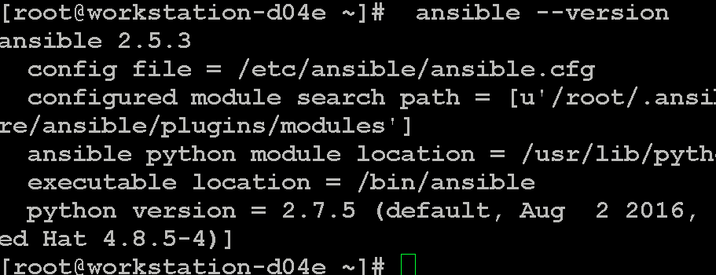

在 Ansible 主机上配置 Inventory。配置两个 Group：web 和 sql，分别包含一台 Linux 被管系统。

##### 清单 2\. Inventory 内容

```
[root@workstation-d04e ~]# cat /etc/ansible/hosts
[web]
servera.example.com
[sql]
serverb.example.com

```

Show moreShow more icon

配置 Ansible 主机到两台被管主机之间的无密码 SSH 互信，之后，Ansible 可以与两台被管主机正常通讯：

##### 图 4\. 查看 Ansible 与被管节点之间的通讯

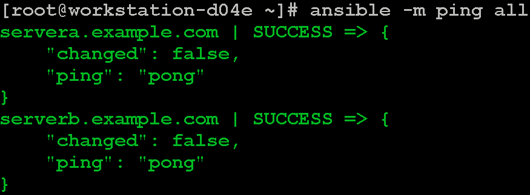

通过 Ansible 调用 yum Modules，为 Inventory 中的 Web Group 主机安装 httpd：

##### 图 5\. 执行 Ansible Modules

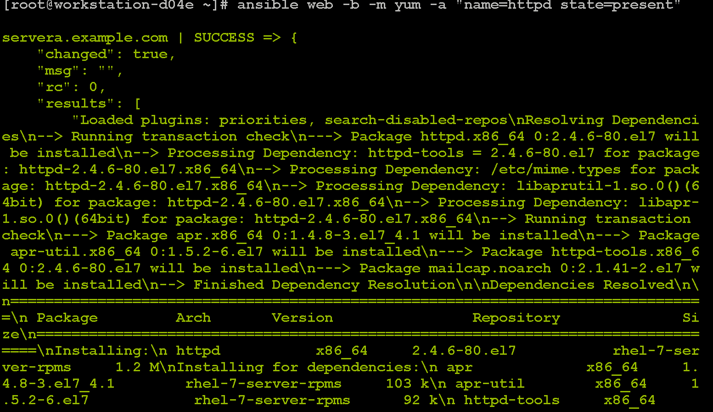

手工确认 HTTP 成功安装：

##### 图 6\. 确认 HTTP 安装成功

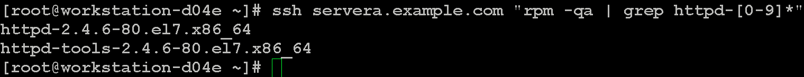

Ansible 调用 service Module，启动 httpd：

##### 图 7\. 执行 Ansible Modules

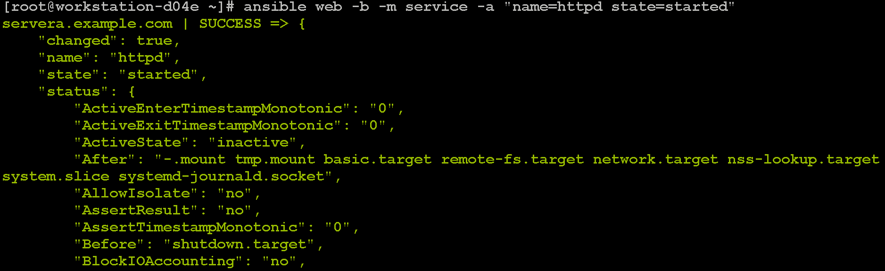

检查服务是否启动：

##### 图 8\. 确认 HTTP 启动成功

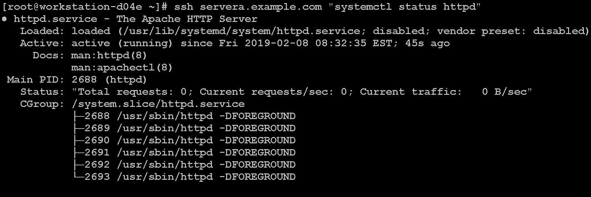

通过本案例，我们了解了 Modules 和 Inventory 的功能。接下来，我将展示 Roles 的功能。

### 调用 Ansible Galaxy Roles 执行自动化任务

Roles 可以自行书写，也可以使用 [Ansible Galaxy 官网](https://galaxy.ansible.com/home) 上大量已经书写好的 Roles。本案例将通过书写 Playbook 调用 Roles，完成数据库的安装和配置。

登录 Ansible Galaxy 网站，搜索并挑选一个质量评分高的 mysql Roles。

##### 图 9\. 查看 mysql Roles

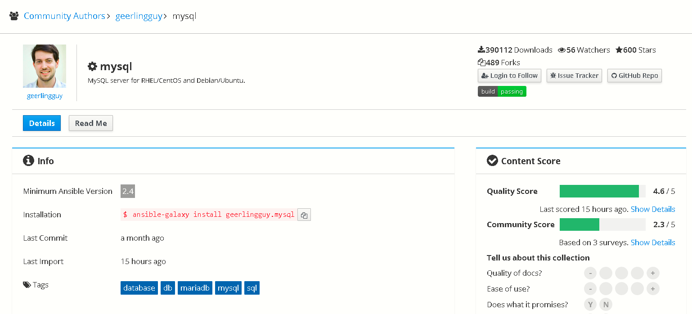

在 Ansible 主机上安装 mysql Roles：

##### 图 10\. 安装 Ansible mysql Roles

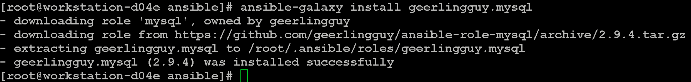

接下来，书写一个 Playbook，调用 mysql Role，为 Inventory 中定义的 Web 主机安装 mysql。

##### 清单 3\. 书写安装 mysql 的 Playbook

```
[root@workstation-d04e ansible]# cat install-database.yml
- hosts: sql
name: Install the database server from an Ansible Galaxy role
roles:
- geerlingguy.mysql

```

Show moreShow more icon

执行 Playbook。至此，通过书写 Playbook 调用 Roles，完成了数据库的安装和配置。

##### 图 11\. 查看 Playbook 执行结果

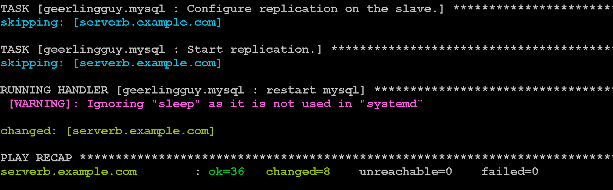

### 使用 Ansible Playbook 执行自动化任务

在本小节中，我们将书写 Playbook，完成如下任务：

- 在 Web 主机上安装 Web Server（httpd 和 mod\_wsgi 这两个组件）并启动它。
- 将书写好的 jinja2 配置加载到 Web Sever 中。关于 [jinja2](http://jinja.pocoo.org/docs/2.10/) 的配置，不是本文介绍的重点。

首先创建 templates 目录，在目录中添加 httpd.conf.j2 模板:

##### 清单 4\. 创建 httpd.conf.j2 模板

```
[root@workstation-d04e ansible]#  mkdir templates
[root@workstation-d04e ansible]# cat  httpd.conf.j2
ServerRoot "/etc/httpd"
Listen 80
Include conf.modules.d/*.conf
User apache
Group apache
ServerAdmin root@localhost
<Directory />
    AllowOverride none
    Require all denied
</Directory>
DocumentRoot "/var/www/html"
<Directory "/var/www">
    AllowOverride None
    Require all granted
</Directory>
<Directory "/var/www/html">
    Options Indexes FollowSymLinks
    AllowOverride None
    Require all granted
</Directory>
<IfModule dir_module>
    DirectoryIndex index.html
</IfModule>
<Files ".ht*">
    Require all denied
</Files>
ErrorLog "logs/error_log"
MaxKeepAliveRequests {{ apache_max_keep_alive_requests }}
LogLevel warn
<IfModule log_config_module>
    LogFormat "%h %l %u %t \"%r\" %>s %b \"%{Referer}i\" \"%{User-Agent}i\"" combined
    LogFormat "%h %l %u %t \"%r\" %>s %b" common
    <IfModule logio_module>
      LogFormat "%h %l %u %t \"%r\" %>s %b \"%{Referer}i\" \"%{User-Agent}i\" %I %O" combinedio
    </IfModule>
    CustomLog "logs/access_log" combined
</IfModule>
<IfModule alias_module>
    ScriptAlias /cgi-bin/ "/var/www/cgi-bin/"
</IfModule>
<Directory "/var/www/cgi-bin">
    AllowOverride None
    Options None
    Require all granted
</Directory>
<IfModule mime_module>
    TypesConfig /etc/mime.types
    AddType application/x-compress .Z
    AddType application/x-gzip .gz .tgz
    AddType text/html .shtml
    AddOutputFilter INCLUDES .shtml
</IfModule>
AddDefaultCharset UTF-8
<IfModule mime_magic_module>
    MIMEMagicFile conf/magic
</IfModule>
EnableSendfile on
IncludeOptional conf.d/*.conf

```

Show moreShow more icon

然后，在目录中添加 index.html.j2 模板：

##### 清单 5\. 创建 index.html.j2 模板

```
[root@workstation-d04e templates]# cat index.html.j2
{{ apache_test_message }} {{ ansible_distribution }} {{ ansible_distribution_version }}
Current Host: {{ ansible_hostname }}
Server list:

{{ host }}


```

Show moreShow more icon

书写 Playbook 如下：

##### 清单 6\. Playbook 内容

```
[root@workstation-d04e ansible]# cat site.yml
---
- hosts: web
name: Install the web server and start it
become: yes
vars:
    httpd_packages:
      - httpd
      - mod_wsgi
    apache_test_message: This is a test message
    apache_max_keep_alive_requests: 115

tasks:
    - name: Install the apache web server
      yum:
        name: "{{ item }}"
        state: present
      with_items: "{{ httpd_packages }}"
      notify: restart apache service

    - name: Generate apache's configuration file from jinga2 template
      template:
        src: templates/httpd.conf.j2
        dest: /etc/httpd/conf/httpd.conf
      notify: restart apache service

    - name: Generate a basic homepage from jinga2 template
      template:
        src: templates/index.html.j2
        dest: /var/www/html/index.html

    - name: Start the apache web server
      service:
        name: httpd
        state: started
        enabled: yes

handlers:
    - name: restart apache service
      service:
        name: httpd
        state: restarted
        enabled: yes

```

Show moreShow more icon

我们对 Playbook 做简单的分析：

- 第一段（3-11 行）：定义了 httpd\_packages 变量，并进行赋值：httpd 和 mod\_wsgi。
- 第二段（13-19 行）：调用 yum 模块，安装 httpd 和 mod\_wsgi。
- 第三段（21-25 行）和第四段（27-30 行）：根据事先定义好的模板，生成 Apache 配置文件和 Homepage。
- 第五段（32-36 行）：调用 Modules service，启动 httpd。

在上面的 Playbook 中，还用到了 Handlers 语法，以在变更时运行操作。Playbooks 有一个可用于响应变化的事件系统。当任务执行结束，notify（在 Playbook 中的每个任务块结束时以事件的方式通知 Handlers，从而触发 handler 中定义的任务。）会触发名字为 restart apache service 的 Handlers。在 Ansible 中，即使多个任务都有 notify 的定义，但一个 Playbook 中，handler 只被触发一次。这个 handler 的作用是调用 Module service 重启 httpd 服务。

接下来，执行写好的 Playbook，并观察执行过程。输出如下：

##### 清单 7\. 执行 Playbook

```
[root@workstation-d04e ansible]# ansible-playbook site.yml
PLAY [Install the web server and start it] ********************************************************

TASK [Gathering Facts] ****************************************************************************
ok: [servera.example.com]

TASK [Install the apache web server] **************************************************************
changed: [servera.example.com] => (item=[u'httpd', u'mod_wsgi'])

TASK [Generate apache's configuration file from jinga2 template] **********************************
changed: [servera.example.com]

TASK [Generate a basic homepage from jinga2 template] *********************************************
changed: [servera.example.com]

TASK [Start the apache web server] ****************************************************************
changed: [servera.example.com]

RUNNING HANDLER [restart apache service] **********************************************************
changed: [servera.example.com]

PLAY RECAP ****************************************************************************************
servera.example.com        : ok=6    changed=5    unreachable=0    failed=0

```

Show moreShow more icon

Playbook 执行成功以后，通过 curl 验证 Apache 的配置。

##### 图 12\. 验证 Apache 的配置

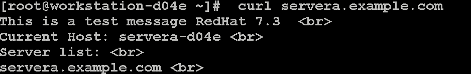

通过本章，相信您已经了解了如何通过 Modules、Roles 来执行简单的自动化任务。接下来，我们将介绍如何通过 Ansible 执行较为复杂的自动化任务。

## 使用 Ansible 部署三层架构应用

在自动化的场景中，我们通常会遇到较为复杂的场景，而不是简单在一个系统上部署或配置一个服务组件。接下来，我们通过 Ansible 执行一个较为复杂的自动化任务——部署一个三层应用，其中包括：一个前端（HAproxy）、两个 app 服务器（Tomcat）、一个数据库（Postgresql）。架构图如下：

##### 图 13\. 三层应用架构图

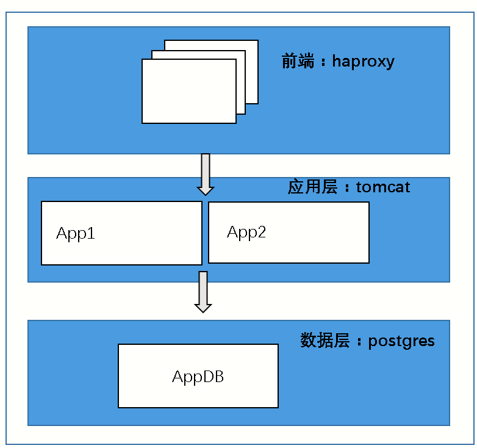

### 第一步，编写 Playbook

由于本案例较为复杂，为了增加 Playbook 的可读性、可重复利用性，我用三个 Roles 完成安装配置 HAproxy、Tomcat 和 Postgres，然后用一个主 Playbook 调用这个三个 Roles。

清单 8 中，我们先定义整个自动化任务的主 playbook：main.yml：

##### 清单 8\. 书写主 Playbook

```
[root@bastion 3tier-good]# cat main.yml
---
# Setup front-end load balancer tier

- name: setup load-balancer tier
hosts: frontends
become: yes
roles:
    - {name: base-config, tags: base-config}
    - {name: lb-tier, tags: [lbs, haproxy]}

# Setup application servers tier

- name: setup app tier
hosts: apps
become: yes
gather_facts: false
roles:
    - {name: base-config, tags: base-config}
    - {name: app-tier, tags: [apps, tomcat]}

# Setup database tier

- name: setup database tier
become: yes
hosts: appdbs
roles:
    - {name: base-config, tags: base-config}
    - {name: geerlingguy.postgresql, tags: [dbs, postgres]}

```

Show moreShow more icon

接下来，书写三个 Roles。由于篇幅有限，仅以配置 load-balancer tier Roles 为例进行分析。

在 frontends group 的主机上，执行两个 Roles：base-config 和 lb-tier。我们可以查看这两个 Roles 的具体内容。先查看 base-config 的目录结构：

##### 图 14\. base-config 的目录结构

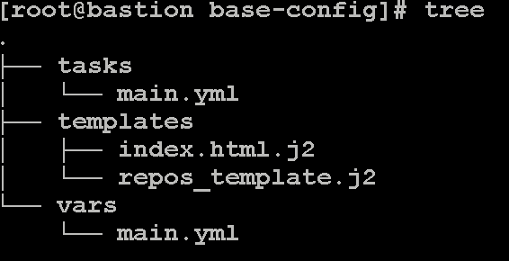

查看 tasks 下的 main.yaml:

##### 清单 9\. 查看 base-config 的 main.yml

```
---
    # Initial, common, system setup steps

    - name: enable sudo without tty for some ansible commands
    replace:
    path: /etc/sudoers
    regexp: '^Defaults\s*requiretty'
    replace: 'Defaults  !requiretty'
    backup: yes

    - name: enable repos
    template:
    src: repos_template.j2
    dest: /etc/yum.repos.d/open_three-tier-app.repo
    mode: 0644

    #- name: setup hostname
    #  hostname:
    #    name: "{{ inventory_hostname }}"

    - name: install base tools and packages
    yum:
    name: "{{ item }}"
    state: latest
    with_items:
    - httpie
    - python-pip

```

Show moreShow more icon

上面 Playbook 执行的操作如下：

- 替换文件内容：将 /etc/sudoers 文件中的 `^Defaults\s*requiretty` 替换为 `Defaults !requiretty` 。
- enable repos：将./templates/repos\_template.j2 文件拷贝到 /etc/yum.repos.d/open\_three-tier-app.repo。
- 设置主机名：将主机名设置成 `inventory_hostname` 变量的赋值。
- 安装 HTTP 和 python-pip。

接下来，我们查看 lb-tier 的目录结构：

##### 图 15\. lb-tier 的目录结构


查看 tasks 目录下的 main.yml:

##### 清单 10\. 查看 lb-tier 的 main.yml

```
---

- name: install {{ payload }}
yum:
    name: "{{ payload }}"
    state: latest

- name: enable {{ payload }} at boot
service:
    name: "{{ payload }}"
    enabled: yes

- name: configure haproxy to load balance over app servers
template:
    src: haproxy.cfg.j2
    dest: /etc/haproxy/haproxy.cfg
    mode: 0644

- name: start {{ payload }}
service:
    name: "{{ payload }}"
state: restarted

```

Show moreShow more icon

上面的 Playbook 完成的任务：

- 安装、配置、设置开机启动一个变量 `{{ payload }}` 定义的服务。
- 通过将 ./templates/haproxy.cfg.j2 拷贝到 /etc/haproxy/haproxy.cfg，配置 HAproxy 以便两个 app 服务器可以实现负载均衡。
- 重启变量 `{{ payload }}` 定义的服务

查看 `./vars/main.yml` 的内容，可以看到变量 `{{ payload }}` 的赋值为 `haproxy` 。

##### 清单 11\. 查看 lb-tier 的环境变量

```
[root@bastion vars]# cat main.yml
payload: haproxy

```

Show moreShow more icon

所以，lb-tier Roles 执行的任务就是安装、配置、启动 HAproxy 服务。

### 第二步，执行 Playbook

接下来，我们执行 Playbook，首先确认相关节点可以和 Ansible 正常通信：

##### 图 16\. 确认 Ansible 与被管节点之间正常通信

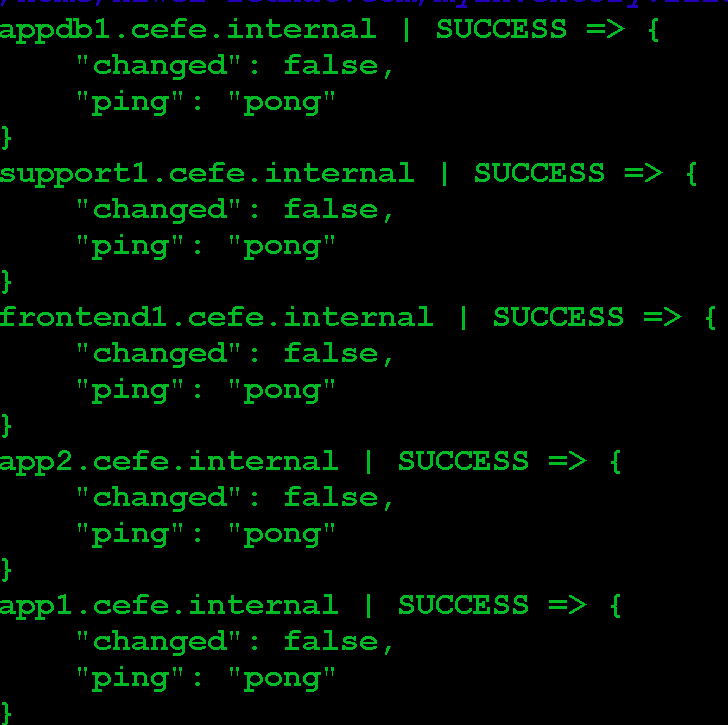

接下来，执行 Playbook，由于篇幅有限我们只列出前端配置部分的关键日志：

##### 清单 12\. 执行主 Playbook

```
[root@bastion 3tier-good]# ansible-playbook -i /etc/ansible/hosts main.yml

PLAY [setup load-balancer tier] ************************************************

TASK [Gathering Facts] *********************************************************
ok: [frontend1.cefe.internal]

TASK [base-config : enable sudo without tty for some ansible commands] *********
ok: [frontend1.cefe.internal]

TASK [base-config : enable repos] **********************************************
changed: [frontend1.cefe.internal]

TASK [base-config : install base tools and packages] ***************************
[DEPRECATION WARNING]: Invoking "yum" only once while using a loop via
squash_actions is deprecated. Instead of using a loop to supply multiple items
and specifying `name: "{{ item }}"`, please use `name: ['httpie', 'python-
pip']` and remove the loop. This feature will be removed in version 2.11.
Deprecation warnings can be disabled by setting deprecation_warnings=False in
ansible.cfg.
changed: [frontend1.cefe.internal] => (item=[u'httpie', u'python-pip'])

PLAY RECAP *********************************************************************
app1.cefe.internal         : ok=8    changed=7    unreachable=0    failed=0
app2.cefe.internal         : ok=8    changed=7    unreachable=0    failed=0
appdb1.cefe.internal       : ok=26   changed=13   unreachable=0    failed=0
frontend1.cefe.internal    : ok=8    changed=6    unreachable=0    failed=0

```

Show moreShow more icon

可以看到任务的执行逻辑与我们前文介绍的内容是一致的。

接下来，验证部署的应用。通过 [RESTClient](moz-extension://3cbd1f48-462a-4914-a7d8-6cdf40043046/) 向前端发起 POST 请求，可以看到负载均衡的效果。

第一次请求，响应返回为 Tomcat app1：

##### 图 17\. 客户端发起请求

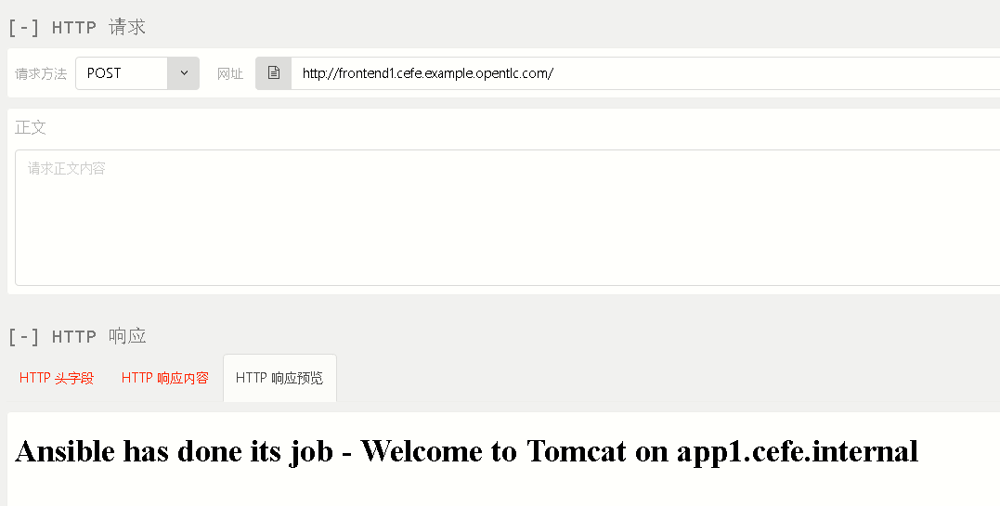

第二次请求，响应返回为 Tomcat app2：

##### 图 18\. 客户端发起请求

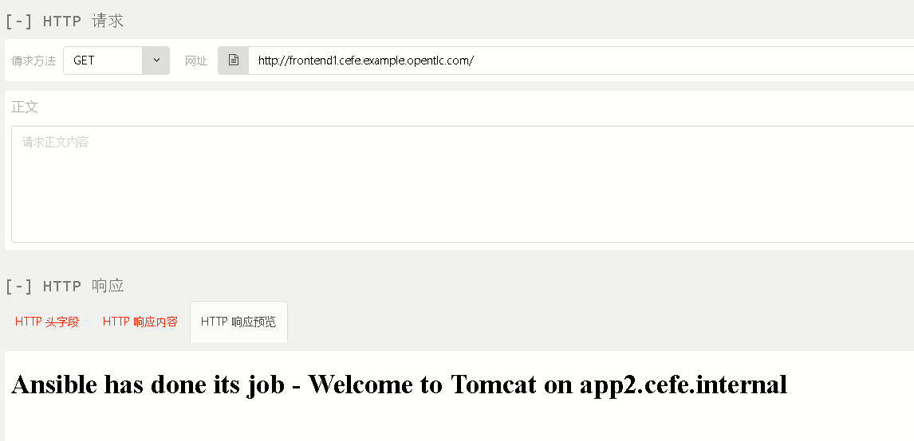

至此，我们实现了通过 Ansible 部署一个三层应用的工作。

## 结束语

通过本文，相信您对 Ansible 及其核心组件的使用有了一些了解。随着 Ansible 社区越来越受重视、 Modules 数量的迅速增加，Ansible 对整个数据中心的自动化管理能力越来越强。