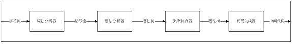
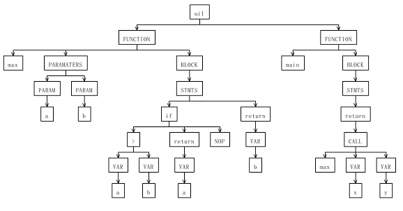
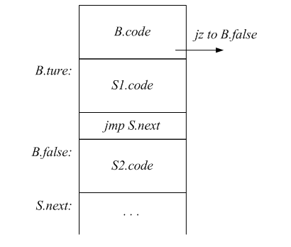
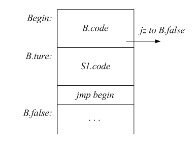
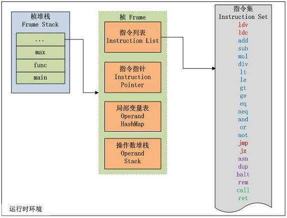

# 使用 Antlr 开发领域语言 – 开发一个完整的应用
分享构建领域语言的一些方法和思想

**标签:** Java

[原文链接](https://developer.ibm.com/zh/articles/j-lo-antlr-fullapp/)

高尚, 郑德署

发布: 2011-11-02

* * *

## 一个完整的应用

在使用 Antlr 开发领域语言的 [前一篇文章](http://www.ibm.com/developerworks/cn/java/j-lo-antlr/) 中，简要介绍了 Antlr 的一些特性，用算术表达式作为例子说明了 Antlr 在词法分析、语法分析、解释和编译等方面的用法。本文中我们将一起来开发一个更为复杂的领域语言。在确定语言的运算能力之后，首先使用 Antlr 定义语言的文法，实现词法分析和语法分析，并生成对应的抽象语法树；之后基于树分析器开发一个类型检查器，检查语言的类型是否合法；然后基于树分析器开发一个代码生成器，将语言编译为一种中间代码。图 1 详细描述了这一工作过程。

##### 图 1\. 工作流程（ [查看大图](image003-large.jpg) ）



上述四个步骤和 Antlr 是紧密结合的，每一步都用到了 Antlr 的相关技术。在完成中间代码的生成后，工作并没有结束，最后我们将实现一个虚拟机，该虚拟机使用堆栈来操纵数据，对之前产生的中间代码解释执行，完成最终的运算，我们把虚拟机命名为抽象堆栈机。

## 语言定义

首先，我们需要确定领域语言应该具备哪些运算能力。 清单 1 和清单 2 给出了两个目标语言的例子。

##### 清单 1\. 领域语言示例一

```
max(a, b){
     if(a>b) return a ;
     return b;
}

main(){
return  max(x, y);
}

```

Show moreShow more icon

##### 清单 2\. 领域语言示例二

```
sum(a) {
sum = 0 ;
while(a>0) {
sum = sum + a;
a = a - 1;
}
return sum ;
}

main(){
return sum(x)/x;
}

```

Show moreShow more icon

示例中的语言是我在日常工作中的一个真实应用，主要用于对财务金额数据的加工处理，这里需要对语言的 IO 做一个简单的说明。在真实应用中，main 函数中变量的初始值都是从数据库中根据变量的名字查询得到的，main 函数的返回值（计算结果）被存储于数据库中；在本文中为了方便演示，给 main 函数中的变量都赋予随机数，计算结果直接输出到控制台。

我们的领域语言支持用户自定义函数，函数又由多条语句构成，语句包括条件语句、循环语句、赋值语句、表达式运算语句和函数调用语句等。表达式中目前主要支持 13 类运算，分别为 4 类算术运算（+、-、\*、/）、6 类关系运算（>、>=、<、<=、==、!=）和 3 类逻辑运算（\|\|、&&、!）。支持的数据类型有整数型、实数型和布尔型三种。目前有以下 7 个关键字：if、else、unless、do、for、while、return。

对语言的细节不做过多的说明，下一节通过文法定义对语言做进一步描述。

### 文法基础

**LL 文法**

任何一个 LL 文法识别器都不支持左递归文法，无论是直接左递归还是间接左递归，Antlr 也不例外。如果定义了非 LL 文法，必须对其改写。消除左递归是 LL 文法处理常用的技术，下面是一个消除左递归的例子：

A->Aa \|b; （1）

式中大写字母表示文法规则，小写字母表示词法符号。规则 A 的产生式有两个，分别是 Aa 和 b。第一个产生式 Aa，最左端包含了 A，这是一个直接左递归，必须对其改写。改写之后， A 产生 bB，而 B 产生 aB 和空集。

A->bB; （2）

B->aB \| ; （3）

式子（3）B 产生 aB 是一个尾递归，可以把这个尾递归进一步改写。改写之后，B 产生 0 个或多个 a。

B->(a)\*; （4）

将（4）代入（2），最终原文法（1）被改写成如下形式：

A->b (a)\*; （5）

**算符的结合性**

在定义语言时，有些算符是左结合的，比如算术运算符 +，a + b + c 等价于 (a + b) +c；有些算符是右结合的，比如赋值运算符 =，a = b = c 等价于 a = (b = c) 。在 LL 识别器中，左结合算符通过指定重复匹配进行定义，如清单 3 所示：

##### 清单 3\. 左结合算符的文法

```
expr   :  atom (('+' |'-' ) atom )* ;

```

Show moreShow more icon

右结合文法通过尾递归文法定义，如清单 4 所示：

##### 清单 4\. 右结合算符的文法

```
expr   :  id '=' expr;

```

Show moreShow more icon

**算符的优先级**

在 LL 文法识别器中，算符的优先级要通过文法的嵌套定义来体现。优先级低的算符要优先声明，相同优先级的算符可以在同一个规则中描述。比如加减运算的优先级比乘除运算的优先级低，加减法要先于乘除法定义，文法定义方式如清单 5 所示：

##### 清单 5\. 考虑算符优先级的文法

```
additiveExpr :   multExpr (('+' |'-' ) multExpr )* ;
multExpr : atom (('*' |'/' ) atom)* ;

```

Show moreShow more icon

### 文法定义

使用 Anltr 定义文法时，综合考虑前面提到的三种因素，左递归、算符结合性和算符优先级，我们把领域语言的文法最终定义成清单 6 所示的形式。

##### 清单 6\. 语法定义

```
// 为体现文法支持函数调用，将文法命名为 Function。.
grammar Function;

//prog 是文法的入口， 一个 prog 有一个或多个函数定义组成。
prog: funDecl+;

// 函数定义， 有函数名 ID、 参数列表和语句块构成。
funDecl  :ID '(' paramDeclList ')' block;

// 参数列表有 0 个或多个参数定义。
paramDeclList
     :      (paramDecl (',' paramDecl)*)?;

// 参数定义对应一个词法符号 ID
paramDecl
     :      ID
;

// 语句块由花括号和语句列表组成。
block
     :     '{' stmtList '}';

// 语句列表由 0 个或多个语句组成。
stmtList:stmt*    ;

// 语句有返回语句、条件语句、三类循环语句、语句块和表达式语句组成。
stmt    options{
backtrack=true;
}         :
         RETURN expr ';'
         | ifStmt
         | WHILE '(' expr ')' stmt
         | 'do' stmt WHILE '(' expr ')'
         | 'for' '(' expr ';' expr ';' expr ')'
         | block
         | expr ';'
;

// 条件语句有 4 种形式 . if...、 if... else...、 unless...、 unless... else...。
ifStmt
options{
     backtrack=true;
}
:
      IF '(' expr ')' stmt 'else' stmt
     | 'unless' '(' expr ')' stmt 'else' stmt
     | IF '(' expr ')' stmt
| 'unless' '(' expr ')' stmt
     ;

// 表达式包含赋值表达式和逻辑或表达式。其中赋值表达式中 = 是右结合算符，使用尾递归定义文法。
expr
options{
     backtrack=true;
}
:
         ID '=' expr

         | orExpr
;
// 从逻辑或表达式开始，依据算符的优先级，依次定义了逻辑或表达式、逻辑与表达式、关系表达式、算术表达式、
// 逻辑非表达式和取反表达式。
orExpr:andExpr ('||' andExpr)*
;

andExpr:equalityExpr ('&&' equalityExpr)*
;

equalityExpr
     :      comparisonExpr (('=='|'!=') comparisonExpr)*
;

comparisonExpr
     :      additiveExpr (('>'|'<'|'<='|'>=') additiveExpr)*
;

additiveExpr
     :      multExpr (('+' |'-' ) multExpr )*
;

multExpr
     :   notExpr (('*' |'/' ) notExpr )*
;

notExpr
     :      ('!')? negationExpr
;

negationExpr
     :      ('-')? primary
;

// 基本项有原子项和用于改变运算优先级的括号加表达式构成。
primary
     :   atom
     |  '(' orExpr ')';

// 原子项有常数、函数调用和变量组成。
atom
options{
     backtrack=true;
}      :
NUMBER
| ID '(' exprList ')'
| ID
;

// 函数调用实参列表，包含 0 个或多个表达式
exprList:      (orExpr (',' orExpr)*)?;

```

Show moreShow more icon

从上述文法定义中，可以看出整个语言由若干函数定义组成。每个函数定义包括函数名、参数列表和函数体。函数体由若干语句构成，包括返回语句、条件语句、循环语句、赋值语句和表达式运算语句等。表达式定义了语言支持的若干运算，语言中的运算能力主要由表达式定义来体现。

### 词法定义

语言的词法定义包括文法定义用到的 3 个关键字记号：IF、WHILE 和 RETURN，以及其他 4 个记号：变量 ID、数字 NUMBER、换行符 NEWLINE 和空白字符 WS。其中换行符 NEWLINE 和空白字符 WS 不需要作为词法记号向语法分析器传递，使用 skip() 方法将其跳过。清单 7 给出了详细定义。

##### 清单 7\. 词法定义

```
IF      :     'if'
     ;
WHILE      :     'while'
     ;
RETURN  :     'return'
     ;
BREAK      :     'break'
    ;
ID : ('a'..'z' |'A'..'Z' )('a'..'z' |'A'..'Z'|'0'..'9')* ;
NUMBER : ('0'..'9')+ ('.' ('0'..'9')+)? ;
NEWLINE:'\r' ? '\n' ;
WS : (' ' |'\t' |'\n' |'\r' )+ {skip();} ;

```

Show moreShow more icon

### 抽象语法树基础

抽象语法树是语言的结构化表示形式，它的每个节点代表源程序中的某种构造。抽象语法树往往忽略语言中的某些细节， 比如括号（）。当括号用于表示计算的优先级时，树形结构已经拥有了优先级信息，可以去掉；当括号用于表示分隔符时，比如函数声明和函数调用，分隔符在抽象语法树中不需要存在，可以去掉。抽象语法树不同于语法分析树，后者代表语法分析器分析的完整过程， 而抽象语法树往往使用最少的信息来表示语言本身的结构。

可以在定义文法的同时，使用 Anltr 树构造语法来建立抽象语法树，我们语言中的抽象语法树节点主要有以下几类：

- 使用占位符作为根节点建立树节点。占位符的作用只是一个特定符号，用于区分不同的树节点。清单 7 给出了一个示例，参数定义用 PARAM 作为占位符，区别于其他节点。

##### 清单 8\. 用占位符作为根节点

```
paramDecl
:      ID -> ^(PARAM ID)
;

```

Show moreShow more icon

- 使用算符作为根节点建树节点。清单 8 中，逻辑与算符（\|\|）、加法算符（+）和减法算符（-）分别作为树的根节点去创建语法树。

##### 清单 9\. 用算符作为根节点

```
orExpr:andExpr ('||'^ andExpr)* ;

additiveExpr :multExpr (('+' |'-' )^ multExpr )* ;

```

Show moreShow more icon

- 依据语义规则条件的不同，建立不同的树节点。在清单 9 中，依据一元算符逻辑非（!）是否存在创建了两个不同的树节点。

##### 清单 10\. 依据语义规则创建不同的树节点

```
notExpr      :
(op='!')? negationExpr     -> {$op != null}? ^(NOT negationExpr)
                          -> negationExpr

```

Show moreShow more icon

- 通过文法规则重写建立树节点，去掉相关的分隔符号。清单 10 中，我们在 primary 和 ifStmt 规则的语法树构造中，去掉了括号。

##### 清单 11\. 改写文法规则建立树节点

```
primary :     '(' expr ')' -> expr  ;

ifStmt:  IF '(' e1=expr ',' e2=expr ',' e3=expr ')'  -> ^(IF $e1 $e2 $e3);

```

Show moreShow more icon

### 抽象语法树定义

完整的抽象语法树定义如清单 11 所示，用到了前面讲到的 4 种建树方法：

##### 清单 12\. 抽象语法树定义

```
grammar Function;

options{
     output = AST;
     ASTLabelType = CommonTree;
}

//tokens 列表定义了若干符号，用于区别语法树的节点。
tokens{
FUNCTION; PARAMATERS; PARAM; BLOCK; STMTS; ASSIGN; NOP; EXPR;
NUM; VAR; NOT; NEGATE; CALL;}

//prog 语法树规则和文法规则相同， 无需指定。
prog: funDecl+;

// 函数定义的语法树，以 FUNCTION 为根节点，函数名，参数列表和语句块为子节点；其中参数列表的语法树又以
//PARAMATERS 为根节点， 参数列表自身为子节点。
funDecl
    : name=ID '(' paramDeclList ')' act=block -> ^(\
    FUNCTION $name ^(PARAMATERS paramDeclList)? $act)
;

// 参数列表的语法树，通过规则改写指定，去掉逗号分隔符。
paramDeclList
     :      (paramDecl (',' paramDecl)*)? -> paramDecl*
;

// 参数的语法树指定 PARAM 为根，ID 为叶子。
paramDecl
     :      ID -> ^(PARAM ID)
;

// 语句块的语法树指定了两个根节点，分别是 BOLCK 和 STMTS, 语句列表作为子节点。
block
     :     '{' stmts=stmtList '}' -> ^(BLOCK ^(STMTS $stmts))
;

// 语句列表的语法树规则和文法规则相同， 无需指定。
stmtList:      stmt*
;

// 返回语句指定 RETURN 为根节点，表达式为子节点
//3 类循环语句在创建语法树时，根据其语义规则，被统一为一种树结构，根节点都是 WHILE, 子节点是条件判断表
// 达式和循环体语句。通过这种改写屏蔽了语法的差异，把不同的语法用语义相同的抽象语法树表示，没有改变语
// 言的语义，简化了后续处理。
stmt
options{
     backtrack=true;
}         :
         RETURN expr ';' -> ^(RETURN expr)
         | ifStmt
         | WHILE '(' expr ')' stmt -> ^(WHILE expr stmt)
| 'do' stmt WHILE '(' expr ')'  -> stmt ^(WHILE expr stmt)
         | 'for' '(' ini=expr ';' tes=expr ';' inc=expr ')'  \
           stmt -> $ini ^(WHILE $tes ^(BLOCK ^(STMTS stmt $inc)))
         | block
         | expr ';' -> expr
;

// 条件语句的语法树创建和循环语句有着类似之处。我们将 4 不同的语法形式统一到一个相同的树节点上来。用
//IF 作为根节点，条件判断表达式和两个语句作为子节点。如果 IF 语句缺少 else，则第二个语句用占位符号
//NOP 代替。unless 表示 if not，所以它的语法树创建使用和 IF 一样的树节点，颠倒两个语句的次序，就保证了
// 原有的语义。

ifStmt
options{
     backtrack=true;
}
:
      IF '(' expr ')' c1=stmt 'else' c2=stmt -> ^(IF expr $c1 $c2)
| 'unless' '(' expr ')' c1=stmt 'else' c2=stmt -> ^(IF expr $c2 $c1)
     | IF '(' expr ')' c1=stmt -> ^(IF expr $c1 NOP)
     | 'unless' '(' expr ')' c1=stmt -> ^(IF expr NOP $c1)
     ;

// 赋值表达式指定了用 ASSIGN 作为根节点，ID 和表达式分别为子节点。
expr
options{
     backtrack=true;
}
:
         ID a='=' expr -> ^(ASSIGN ID expr)

         | orExpr
;

// 用算符 || 作为根节点
orExpr:andExpr ('||'^ andExpr)*
;

// 用算符 && 作为根节点
andExpr:equalityExpr ('&&'^ equalityExpr)*
;

// 用算符 ('=='|'!=') 作为根节点
equalityExpr
     :      comparisonExpr (('=='|'!=')^ comparisonExpr)*
;

// 用算符 ('>'|'<'|'<='|'>=') 作为根节点
comparisonExpr
     :      additiveExpr (('>'|'<'|'<='|'>=')^ additiveExpr)*
;

// 用算符 ('+' |'-' ) 作为根节点
additiveExpr
     :      multExpr (('+' |'-' )^ multExpr )*
;

// 用算符 ('*' |'/' ) 作为根节点
multExpr
     :   notExpr (('*' |'/' )^ notExpr )*
;

// 依据逻辑非算符的存在性，创建不同的树节点
notExpr
:(op='!')? negationExpr -> {$op != null}? ^(NOT negationExpr)
                                -> negationExpr
;

// 依据取反算符的存在性，创建不同的树节点
negationExpr
     :      (op='-')? primary      -> {$op != null}? ^(NEGATE primary)
                     -> primary
;

// 用于改变运算优先级的括号在创建语法树时应该去掉。
primary
:   atom
     |  '(' orExpr ')' -> orExpr
;

// 原子项分别指定了常数、函数调用和变量的树节点形式。
atom
options{
     backtrack=true;
}      :
NUMBER  -> ^(NUM NUMBER)
     | ID '(' exprList ')' -> ^(CALL ID exprList)
     | ID -> ^(VAR ID)
;

// 参数调用列表的语法树，通过规则改写指定，去掉逗号分隔符。
exprList:(expr (',' expr)*)? ->  expr*
;

```

Show moreShow more icon

使用上述定义的抽象语法树文法，当输入语言为清单 1 中的领域语言时，可以得到如下的抽象语法树。如图 2 所示。

##### 图 2\. 示例语言对应的抽象语法树



## 类型检查

为了减少运行时错误，需要对语言进行静态类型检查。静态类型检查基于抽象语法树，通过在抽象语法树中为各个树节点添加类型属性来完成最终的类型检查。在 Antlr 中通过构造 Tree Parser，为语法树中的每一个节点指定附加动作，由这些动作完成属性收集和类型检查。Tree Parser 的工作原理是深度优先遍历抽象语法树，当访问到树的叶子节点时，为叶子节点添加类型属性值；当访问到非叶子节点时，执行类型检查，并且为非叶子节点赋类型值，用于后续的检查。

在我们的应用中，为了类型检查的需要，为抽象语法树的部分节点定义了类型属性，类型属性通过节点的返回值体现。在我们的领域语言中定义了两个类型值，分别是 number 和 bool 用于表示数值型和布尔型。

### 变量和常量的类型

对于抽象语法树中的叶子节点，直接定义其类型属性。为叶子节点定义属性 clazz，用于记录其类型值，我们规定变量和常量的类型为 `number` 类型。参见清单 13：

##### 清单 13\. 变量和常量的类型

```
atom returns[String clazz] :
^(NUM n=NUMBER)   {$clazz = number;}
| ^(VAR v=ID){$clazz = number;}

```

Show moreShow more icon

### 表达式的类型检查

对于表达式运算节点，必须先检查其子节点的属性是否为特定属性，然后再定义表达式运算节点自身的类型属性，其类型属性是和运算符号相关的。比如算术运算节点的左右两个子节点的类型必须为 number, 其自身类型属性仍然是 number 类型。而关系运算节点的左右两个子节点的类型必须为 number, 其自身类型属性却是 bool 类型。逻辑运算节点的左右两个子节点的类型必须为 bool, 其自身类型属性仍然是 bool 类型。如清单 13 所示：

##### 清单 14\. 表达式的类型检查

```
expr returns[String type]:
^(t=('||'|'&&')e1=expr e2=expr) {
checkType(bool, e1.type, $text);
checkType(bool, e2.type, $text);
$type = bool;}
| ^(t=('=='|'!='|'>'|'<'|'<='|'>=') e1=expr e2=expr) {
checkType(number, e1.type, $text);
checkType(number, e2.type, $text);
$type = bool;}
| ^(t=('+'|'-'|'*'|'/') e1=expr e2=expr) {
checkType(number, e1.type, $text);
checkType(number, e2.type, $text);
$type = number;}

```

Show moreShow more icon

checkType 函数的第一个参数为期望的类型，第二个参数为子节点的实际类型，当两者不符时，就会抛出类型错误异常。第三个参数是当前上下文，当抛出异常时用于指定错误发生的位置。

### 语句的类型检查

循环语句 whileStmt，需要检查 while 语句的条件判断表达式 expr 的类型为 bool，如其类型不为 bool，抛出类型错误异常。条件语句 ifStmt 的检查项和 whileStmt 类似。如清单 15 所示：

##### 清单 15\. 语句的类型检查

```
whileStmt
:
^(WHILE e=expr { checkType(bool, e.type, $text); }
      stmt)
;
ifStmt
:
       ^(IF e=expr { checkType(bool, e.type, $text); }
        (stmt)
        (stmt|NOP))
;

```

Show moreShow more icon

使用该类型检查器，可以发现如同 a<b&&(c-d)， a>b>c， if(a+b){} 这样的静态类型错误。其中 a<b&&(c-d) 违反了逻辑与算符右侧必须为布尔值的检查；a>b>c 第 2 个大于操作违反了左操作数必须为数值型的检查；if(a+b){} 违反了 if 语句中的判断表达式必须为布尔值的检查。

## 代码生成

这一节我们基于树分析器开发一个代码生成器，其作用是在遍历抽象语法树的过程中，根据不同的树节点，输出不同的中间代码。狭义上的编译器主要工作就是代码生成，在本节中代码生成器和编译器表示同一个概念。

为了深入了解代码生成器的工作原理，在开始介绍生成器之前，先来熟悉一下我们的中间代码指令集。目前一共定义了 23 种指令，其对应的语义如表 1 所示。在下一节里，我们会用 Java 实现一个虚拟机来解释执行这些指令，到时将会更好的理解每一条指令的语义。

##### 表 1\. 虚拟机的指令集

**指令****名称****操作数个数****语义****指令类型**ldv取变量 load variable一个操作数（ 变量名称）从 IO 取数、入栈 指令指针加 1取数指令ldc取常量 load constant一个操作数（常量值）常数入栈 指令指针加 1取数指令halt停机指令0 个操作数栈顶元素出栈，并输出 置指令指针为无穷大停机指令call函数调用指令2 个操作数指令指针加 1 动态链接被调用函数，创建新的虚拟机帧 (Frame) 同时把参数从上一帧传递到当前帧函数调用指令ret函数调用返回 return0 个操作数栈顶元素赋给上一帧 当前帧出栈函数调用指令add加法0 个操作数从栈中出栈两个元素，加法运算结果入栈 指令指针加 1算术运算指令sub减法0 个操作数从栈中出栈两个元素，减法运算结果入栈 指令指针加 1算术运算指令mul乘法0 个操作数从栈中出栈两个元素，乘法运算结果入栈 指令指针加 1算术运算指令div除法0 个操作数从栈中出栈两个元素，除法运算结果入栈 指令指针加 1算术运算指令gt大于0 个操作数从栈中出栈两个元素，大于运算结果入栈 指令指针加 1关系运算指令ge大于等于0 个操作数从栈中出栈两个元素，大于等于运算结果入栈 指令指针加 1关系运算指令lt小于0 个操作数从栈中出栈两个元素，小于运算结果入栈 指令指针加 1关系运算指令le小于等于0 个操作数从栈中出栈两个元素，小于等于运算结果入栈 指令指针加 1关系运算指令eq等于0 个操作数从栈中出栈两个元素，等于运算结果入栈 指令指针加 1关系运算指令neq不等于0 个操作数从栈中出栈两个元素，不等于运算结果入栈 指令指针加 1关系运算指令and逻辑与0 个操作数从栈中出栈两个元素，与运算结果入栈 指令指针加 1逻辑运算指令or逻辑或0 个操作数从栈中出栈两个元素，或运算后结果入栈 指令指针加 1逻辑运算指令not逻辑非0 个操作数从栈中出栈一个元素，求非结果入栈 指令指针加 1逻辑运算指令rem注释 remark 用于生成代码的跟踪验证0 个操作数指令指针加 1辅助指令jmp无条件跳转 jump一个操作数（指令行数）指令指针跳转到指定指令行数跳转指令jzjump if zero一个操作数（指令行数）栈顶元素出栈 如果栈顶元素的值非零，指令指针加 1 否则指令指针跳转到指定指令行数跳转指令asn赋值 assign一个操作数栈顶元素出栈，存储于数据存储器中 指令指针加 1赋值指令dup复制栈顶元素0 个操作数栈顶元素再次入栈 指令指针加 1栈操作类指令

清单 1 所示的领域语言，最终将被编译成如清单 16 所示的形式。在开始介绍代码生成器之前，先来看一个 java 类 Instruction，用于表示一条虚拟机指令。一个 Instruction 有指令序号、指令名称和若干操作数组成。清单 15 中示例的指令中，最左边是当前指令的序号，之后是指令名称，再之后是若干操作数。语言中每一个函数的编译都是独立进行的。在编译过程使用了一个整型实例变量 seqNum，用于记录当前指令的序号，seqNum 的值在遇到函数定义时被重置为 0。

##### 清单 16\. 示例语言对应的中间代码

```
max
0 rem beginIf
1 ldv t0
2 ldv t1
3 gt
4 jz 9
5 ldv t0
6 ret
7 jmp 9
8 rem endIf
9 ldv t1
10 ret

main
0 ldv t0
1 ldv t1
2 call max 2
3 halt

```

Show moreShow more icon

### 常量和变量的编译

常量可以直接作为运算数；变量值需要依据变量的名称，从 IO 中取得对应的值，作为运算数 `。` 在编译时给常量和变量指定了不同的指令，便于解释执行时互相区分。如清单 17 所示：

##### 清单 17\. 编译为取数指令

```
atom:
^( NUM n=NUMBER)  {
    new Instruction(seqNum++, "ldc", n.getText());}
| ^(VAR v=ID)  {
new Instruction(seqNum++, "ldv", v.getText());}

```

Show moreShow more icon

### 表达式的编译

表达式中主要涉及到运算符的编译，二元算符和一元算符的编译规则是一致的，只需将算符转换为对应的运算指令即可。只有取反算符略有不同，用当前表达式和 -1 相乘，达到取反的目的。清单 18 给出了具体实现。

##### 清单 18\. 编译为运算指令

```
expr:
             ^('+' expr expr) {new Instruction(seqNum++, "add");}
| ^('-' expr expr) {new Instruction(seqNum++, "sub");}
| ^('*' expr expr) {new Instruction(seqNum++, "mul");}
| ^('/' expr expr) {new Instruction(seqNum++, "div");}
| ^('>' expr expr) {new Instruction(seqNum++, "gt");}
| ^('>=' expr expr) {new Instruction(seqNum++, "ge");}
| ^('<' expr expr) {new Instruction(seqNum++, "lt");}
| ^('<=' expr expr) {new Instruction(seqNum++, "le");}
| ^('==' expr expr) {new Instruction(seqNum++, "eq");}
| ^('!=' expr expr) {new Instruction(seqNum++, "neq");}
| ^('||' expr expr) {new Instruction(seqNum++, "or");}
| ^('&&' expr expr) {new Instruction(seqNum++, "and");}
| ^(NOT e=expr) {new Instruction(seqNum++, "not");}
| ^(NEGATE e=expr) { new Instruction(seqNum++, "ldc", "-1");
new Instruction(seqNum++, "mul");}

```

Show moreShow more icon

### if 语句的编译

if 语句的编译不像前面的编译那样简单，只把生成指令的动作插入在语法树节点的末尾，其编译过程中用到了控制指令，需要在深度优先遍历子树的过程中，根据语义的变化插入不同的语义动作。

在 if 语句开始之前，定义了两个指令。其中 insrtcut1 用来表示 jz 条件跳转指令，用于跳过语句 s1 直接执行语句 s2，它在遍历完判断表达式 expr 之后加入指令列表，但是其要跳转的目标指令行，在 if 语句的第一个语句 s1 遍历完之后才能确定，遍历完语句 s1 时，当前指令行就是跳过语句 s1 的指令行；insrtcut2 表示 jmp 无条件跳转指令，用于语句 s1 执行完毕后直接跳过语句 s2，它在 if 语句的第一个语句树 s1 遍历完之后，加入指令列表，但其要跳转的目标指令行在整个 if 语句遍历完成之后才能确定，遍历完整个 if 语句时，当前指令行就是跳过语句 s2 的指令行。

一图胜千言，图 3 if 语句的编译用图形描述了上述过程。清单 19 给出了具体实现。

##### 图 3\. if 语句的编译



##### 清单 19\. if 语句的编译

```
ifStmt
:
    {Instruction instruct1 = null, instruct2 = null; }
^(IF expr{instruct1 =new Instruction(seqNum++, "jz"); insList.add(instruct1);}
    s1=stmt{instruct2 =new Instruction(seqNum++, "jmp");insList.add(instruct2);}
       {int seq = seqNum;instruct1.oprand1=seq;}
    s2=stmt){int seq2=seqNum;instruct2.oprand1=seq2; }
     ;

```

Show moreShow more icon

### while 语句的编译

循环语句 whileStmt 的编译其实和 if 语句非常类似，也需要两次跳转，一次条件跳转发生在判断表达式之后，如判断结果非真，则跳出循环。另一次无条件跳转发生在循环体内的语句执行完之后，要跳向 while 语句的开始，接着执行条件判断，决定是否继续循环。整个原理和 ifStmt 的编译一模一样，只是跳转指令的目标地址的指定时机不同而已。图 4 和清单 20 分别用不同的方式，对 while 语句的编译过程做了描述。

##### 图 4\. while 语句的编译



##### 清单 20\. while 语句的编译

```
whileStmt
:
{Instruction instruct1 = null, instruct2 = null; int whileTestLine = seqNum;}
^(WHILE expr {instruct1 =new Instruction(seqNum++, "jz"); insList.add(instruct1);}
stmt) {instruct2 =new Instruction(seqNum++, "jmp",
             whileTestLine);insList.add(instruct2);}
        {int seq = seqNum;instruct1.oprand1=seq;}
;

```

Show moreShow more icon

### 函数调用语句的编译

当抽象语法的树节点为函数调用时，需要用到 call 指令去编译该节点。使用 call 指令时，除了要指定被调用的函数名之外，还必须统计出调用函数时传递的实际参数的个数。比如 max(a, b) 的调用最终编译出来的指令为：call max 2，表示要用 2 个参数去调用 max 函数。

##### 清单 21\. 函数调用语句的编译

```
atom
:
     ^(CALL v=ID el=exprList) {new Instruction(seqNum++, "call", \
      v.getText(), $el.paramNum); }

exprList returns[Integer paramNum]
@init {
$paramNum =0;
}
:      (vars+=expr)* {$paramNum =$vars.size();}
;

```

Show moreShow more icon

此外函数调用返回时，遇到 return 语句，我们使用 ret 指令去编译。如果当前的函数是 main 函数，用 halt 指令去替代 ret；其他任何函数调用都被编译成 ret。指令 ret 表示函数调用的返回；而指令 halt 表示整个计算的结束。

## 虚拟机实现

### 虚拟机结构

虚拟机的实现，本身和 Antlr 没有太多关系，实现虚拟机的目的是为了解释执行之前生成的指令，完成运算任务。虚拟机主要基于堆栈来完成所有的相关计算，为此给虚拟机命名为抽象堆栈机。

为了便于理解，先不考虑函数调用。在 [表 1\. 虚拟机的指令集](#表-1-虚拟机的指令集) 所示的指令集中，暂不考虑 call 和 ret 的实现。对于其他 21 条指令，我们考虑使用如下方式实现。引入 4 个数据结构，第 1 个是指令数组，这是一个只读结构，用于存放编译得到的指令列表，在 Java 中使用 List 来实现；第 2 个是指令指针，用于标识当前执行的指令行数，用一个整型变量来表示；第 3 个是局部变量表，在 Java 中使用 Map 来实现，key 是变量的名字，value 为变量的值；第 4 个是操作数堆栈（运算堆栈），所有的计算都围绕堆栈展开，在 Java 中用 Stack 类即可，抽象堆栈机的得名正是因为运算堆栈的存在。

有了上述数据结构之后，虚拟机的原型已经非常明了。当遇到 ldv 取变量指令时，我们先从局部变量表中取值，如在表中不存在，则从 IO 中取值（示例代码中，简单起见，用一个随机数为其赋值），最终把变量的值入栈即可。遇到 ldc 取常数指令时，把常数直接入栈。

13 类运算指令（4 个算术指令、6 个关系指令和 3 个逻辑指令）的实现方式非常类似，除了逻辑非（not）指令外，其他 12 个指令对应的都是二元算符，有两个操作数，所以从栈中出栈两个元素，做对应的运算，计算结果入栈；逻辑非（not）指令只有一个操作数，所以从栈中出栈一个元素，求非后结果入栈。

两个跳转指令，jmp 根据目标指令行直接修改指令指针的值；jz 根据栈顶元素的值判断决定指令指针的值，如为真，指令指针加一，指令继续顺序执行，否则跳转到指定的指令行去。

赋值指令 asn 将一个栈顶元素出栈，放入局部变量表中，局部变量表是一个 Map 结构，变量的名字为 key，出栈的元素本身为 value。复制栈顶元素指令 dup，得到操作数栈顶元素，再次入栈，指令指针加一。停机指令 halt，将栈顶元素作为计算的最终结果返回，然后修改指令指针为无穷大，停止虚拟机的计算。指令 rem 是一个注释，在解释执行时，它没有任何的含义，通过将指令指针加一，直接跳过该指令即可。

##### 图 5\. 运行时环境



当加入 call 和 ret 指令后，对虚拟机略做扩充。引入一个数据结构帧 Frame。之前我们定义的四个数据结构，都属于帧。一个帧代表一个函数的运行时环境，而整个虚拟机是由帧构成的堆栈组成。当开始计算时，虚拟机先用 main 函数的指令列表初始化一个帧，当遇到 call 指令时，动态加载被调用函数的指令列表，初始化出新的帧；当函数调用返回（遇到 ret 指令）时，被调用函数代表的当前帧出栈，返回到前一个调用函数中，继续执行后续指令。图 5 给出了虚拟机运行时刻的一个图形化描述。

### 指令解析举例

虚拟机的初始化从 main 函数编译后指令列表开始，我们定义了抽象堆栈机类 AbstractMachine，它的构造函数如清单 22 所示。参数 functionMap 是用户自定义函数编译结果，key 为函数名，比如 main，max 等，value 为函数编译后的指令列表。我们用 main 函数的指令列表构造虚拟机帧并入栈，至此虚拟机已经做好准备，可以开始解析执行各种指令。

##### 清单 22\. 虚拟机的构造函数

```
public AbstractMachine(Map<String, List<Instruction>> functionMap) {
         super();
         List<Instruction> insList = functionMap.get("main");
         Frame mainFrame = new Frame("main");
         mainFrame.setInslist(insList);
         stack.push(mainFrame);
         this.functionMap = functionMap;
     }

```

Show moreShow more icon

ldv 指令从局部变量表中取值，或者用随机数赋值，然后值入栈，指令指针加一。这里 ActiveOperand 是自定义的一个类，它对放入运算堆栈的元素做了包装，防止运行时类型错误。ldv 指令的实现如清单 23 所示。ldc 和 ldv 非常类似，用字面量常数构造 ActiveOperand 入栈即可。

##### 清单 23\. ldv 指令的解析

```
private void ldv(Instruction ins) {
String s = ins.getOprand1();
         ActiveOperand ao = currentFrame().getActiveOperand(s);
         if(null == ao){
             Random rand = new Random();
             ao = new ActiveOperand(Integer.class,  rand.nextInt(10));
             System.out.println("rand value :" +s + " "+ao.getValue());
             currentFrame().putActiveOperand(s, ao);
         }
         currentFrame().pushActiveOperand(ao);
         currentFrame().incIr();
     }

```

Show moreShow more icon

13 类运算指令，不用再做过多的解释，用其中一个指令 add 来说明。add 对应的二元运算符 +，所以从栈中连续出栈两个元素，分别作为加法运算的右操作数和左操作数参与计算，计算结果入栈，指令指针加一。参见清单 24。

##### 清单 24\. add 指令的解析

```
private void add(Instruction ins) {
         ActiveOperand ao1 = currentFrame().popActiveOperand();
         ActiveOperand ao2 = currentFrame().popActiveOperand();
         ActiveOperand ao = null;

if(ao1.getClazz() == Integer.class && ao2.getClazz() == Integer.class) {
ao = new ActiveOperand(Integer.class, (Integer)ao2.getValue()+(Integer)ao1.getValue());
         }else {
    ao = new ActiveOperand(Double.class, Double.parseDouble(ao2.getValue().toString())\
    + Double.parseDouble(ao1.getValue().toString()));
        }
         currentFrame().pushActiveOperand(ao);
         currentFrame().incIr();
     }

```

Show moreShow more icon

条件跳转指令 jz 的实现如清单 25 所示，需要根据当前栈顶元素判断后续指令的位置。如栈顶元素为布尔值 true，则指令顺序执行，无需跳转，否则需要跳转到指令中指定的位置。jmp 的实现和 jz 比起来更加简单，直接修改指令指针的值，跳转到指定位置即可。

##### 清单 25\. jz 指令的解析

```
private void jz(Instruction ins) {
String s = ins.getOprand1();
         if ((Boolean)currentFrame().popActiveOperand().getValue()) {
             currentFrame().incIr();
} else {
             currentFrame().setIr(Integer.parseInt(s));
}
     }

```

Show moreShow more icon

函数调用指令 call 做的工作较多一点，首先它需要动态加载被调用函数的指令列表，构造新的虚拟机帧；其次根据指令的第二个参数，得到要传递的参数个数，由于在编译时，所有函数的局部变量都被编译成形如 t0，t1 这样的临时变量，所以通过强制命名的方法完成参数的传递。参见清单 26。

##### 清单 26\. call 指令的解析

```
private void call(Instruction ins) {
         currentFrame().incIr();

String fun = ins.getOprand1();
         List<Instruction> insList = functionMap.get(fun);

         Frame frame = new Frame(fun);
         frame.setInslist(insList);

String paramNum = ins.getOprand2();
for(int i= Integer.parseInt(paramNum)-1; i>=0 ; i--) {
             ActiveOperand ao = currentFrame().popActiveOperand();
             frame.putActiveOperand("t"+i, ao);
         }
         stack.push(frame);
     }

```

Show moreShow more icon

函数调用返回指令 ret 把当前帧中栈顶的元素作为函数的返回值，压入了前一帧的运算栈中，这样就完成了函数返回值的传递。如清单 27 所示。

##### 清单 27\. ret 指令的解析

```
private void ret(Instruction ins) {
         ActiveOperand ao = currentFrame().popActiveOperand();
         stack.pop();
         currentFrame().pushActiveOperand(ao);
     }

```

Show moreShow more icon

最后，停机指令 halt 的作用就是，输出当前运算堆栈中栈顶元素的值，简单起见，直接输出到控制台，然后置指令指针为无穷大，结束运算。如清单 28 所示。

##### 清单 28\. halt 指令的解析

```
private Object halt(Instruction ins) {
         ActiveOperand ao = currentFrame().popActiveOperand();
         System.out.println("compute result : " + ao.getValue());
         currentFrame().setIr(Integer.MAX_VALUE);
         return ao.getValue();
     }

```

Show moreShow more icon

至此虚拟机的实现全部完成，更全面的实现请参考附件示例代码中 AbstractMachine、Frame 和 ActiveOperand 这三个 Java 类。

虚拟机完成计算的完整过程体现在 TestMachine.java 中，至此我们把之前做的所有工作都串了起来，首先使用词法分析器完成词法记号的分离，接着使用语法分析器完成语法分析和创建抽象语法树，然后使用类型检查器检查类型是否合法，之后使用代码生成器生成中间代码，最终使用虚拟机解释执行中间代码完成计算。词法分析、语法分析、抽象语法树创建、类型检查、中间代码生成和虚拟机解释执行这 6 个步骤，构成了一个整体，各自发挥作用，共同完成了领域语言的计算。详细的实现请参考示例代码中的 TestMachine.java。

## 结束语

本文中我们结合 Antlr 完成了语言定义、类型检查和代码生成，将语言编译为一种中间代码，并实现了一个基于堆栈的虚拟机，解释中间代码，完成运算。整个工作一方面展示了 Antlr 在领域语言处理方面的强大能力和使用技巧；另一方面，我们的工作也提供了一种实现领域语言的思路。将语言的实现分为前端和后端，前端完成语言定义、类型检查和中间代码生成，后端完成中间代码的解释执行。在整个流程中，中间代码是前端和后端的纽带，后端相对稳定，一次实现后可以反复使用；而面对复杂多变的业务规则，前端的领域语言可能千变万化，将这些多变的语言编译为统一的中间代码，势必减少领域语言的开发工作量，提高开发效率和质量。

## Download

[antlr\_app.zip](http://www.ibm.com/developerworks/cn/java/j-lo-antlr-fullapp/antlr_app.zip): 示例代码

## 相关主题

- [使用 Antlr 开发领域语言](https://www.ibm.com/developerworks/cn/java/j-lo-antlr/)
- [Antlr 全球站点](https://www.antlr.org/)
- [The Definitive ANTLR Reference](https://www.pragprog.com/titles/tpantlr/the-definitive-antlr-reference)
- [The JavaTM Virtual Machine Specification Second Edition](https://java.sun.com/docs/books/jvms/second_edition/html/VMSpecTOC.doc.html)
- [Domain Specific Languages](https://my.safaribooksonline.com/9780132107549)