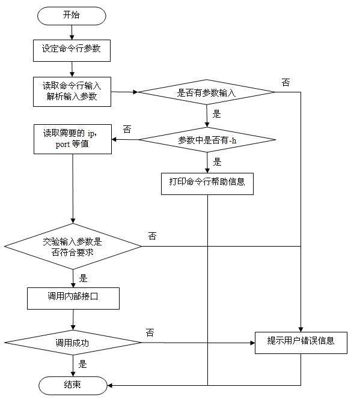

# 使用 Apache Commons CLI 开发命令行工具
通过一个完整的例子展示如何准备、开发、测试一个命令行工具

**标签:** Java

[原文链接](https://developer.ibm.com/zh/articles/j-lo-commonscli/)

杨晖, 罗文刚

发布: 2011-12-15

* * *

## 基于 Apache Commons CLI 的命令行设计

通常情况下命令行处理有三个步骤：定义，解析和询问阶段。本章节将依次解释这三个步骤，并将结合实例来讨论如何通过 Apache Commons CLI 来实现它们。由于本文作者一直从事和存储相关的工作，所以我们将设计一个如何向 Server 中添加 / 删除存储数据源的 CLI。

以下是具体应用场景，用户可以通过以下方式来添加/删除通过 CIM (Common Information Model) Server 管理的存储数据源：

1. 添加通过 CIM Server 管理的存储，例如添加 IBM DS Series，命令行设计如下：


    ```
    mkdatasource [-h | -? | --help]
    mkdatasource [-t string] [-i string] [-p string] [-u string] [-w string] [-n string]
     -h
    Lists short help
     -t
    Sets the HTTP communication protocol for CIM connection
     -i
         Sets the IPv4 address of the device
     -p
    Sets the HTTP communication port for CIM connection
     -u
         Specifies the user ID for the data source connection
     -w
         Specifies the password for the data source connection
     -n
         Identifies the namespace of the CIM connection

    Examples:
    Add CIM Storage Subsystem
    mkdatasource –t http –i 9.3.194.11 –p 5988 –u admin –w admin –n root/lsiarray13

    ```


    Show moreShow more icon

2. 删除通过 CIM Server 管理的存储，例如删除 IBM DS Series，命令行设计如下：


    ```
    rmdatasource [-h | -? | --help]
    rmdatasource [-t string] [-i string] [-p string]

     -h
    Lists short help
     -t
    Sets the HTTP communication protocol for CIM connection
     -i
    Sets the IPv4 address of the device
     -p
    Sets the HTTP communication port for CIM connection

    Examples:
    Remove CIM Storage Subsystem
    rmdatasource –t http –i 9.3.194.11 –p 5988

    ```


    Show moreShow more icon


### CLI 定义阶段

每一条命令行都必须定义一组参数，它们被用来定义应用程序的接口。Apache Commons CLI 使用 Options 这个类来定义和设置参数，它是所有 Option 实例的容器。在 CLI 中，目前有两种方式来创建 Options，一种是通过构造函数，这是最普通也是最为大家所熟知的一种方式；另外一种方法是通过 Options 中定义的工厂方式来实现。

CLI 定义阶段的目标结果就是创建 Options 实例。

根据上面给出的具体命令行设计，我们可以用如下代码片段为添加数据源操作定义 Options：

##### 清单 1\. 定义 Options 代码片段

```
// 创建 Options 对象
Options options = new Options();

// 添加 -h 参数
options.addOption("h", false, "Lists short help");

// 添加 -t 参数
options.addOption("t", true, "Sets the HTTP communication protocol for CIM connection");

```

Show moreShow more icon

其中 addOption() 方法有三个参数，第一个参数设定这个 option 的单字符名字，第二个参数指明这个 option 是否需要输入数值，第三个参数是对这个 option 的简要描述。在这个代码片段中，第一个参数只是列出帮助文件，不需要用户输入任何值，而第二个参数则是需要用户输入 HTTP 的通信协议，所以这两个 option 的第二个参数分别为 false 和 true，完整的代码及注释请参考第二章节的命令行开发部分。

### CLI 解析阶段

在解析阶段中，通过命令行传入应用程序的文本来进行处理。处理过程将根据在解析器的实现过程中定义的规则来进行。在 CommandLineParser 类中定义的 parse 方法将用 CLI 定义阶段中产生的 Options 实例和一组字符串作为输入，并返回解析后生成的 CommandLine。

CLI 解析阶段的目标结果就是创建 CommandLine 实例。

根据上面给出的具体命令行设计，我们可以用如下代码片段为添加数据源操作解析 Options：

##### 清单 2\. 解析 Options 代码片段

```
CommandLineParser parser = new PosixParser();
CommandLine cmd = parser.parse(options, args);

if(cmd.hasOption("h")) {
    // 这里显示简短的帮助信息
}

```

Show moreShow more icon

我们需要判断命令行中是不是有 h 参数，如果有，就需要应用程序列出简短的帮助信息，完整的代码及注释请参考第二章节的命令行开发部分。

### CLI 询问阶段

在询问阶段中，应用程序通过查询 CommandLine，并通过其中的布尔参数和提供给应用程序的参数值来决定需要执行哪些程序分支。这个阶段在用户的代码中实现，CommandLine 中的访问方法为用户代码提供了 CLI 的询问能力。

CLI 询问阶段的目标结果就是将所有通过命令行以及处理参数过程中得到的文本信息传递给用户的代码。

根据上面给出的具体命令行设计，我们可以用如下代码片段为添加数据源操作询问 Options：

##### 清单 3\. 询问 Options 代码片段

```
// 获取 -t 参数值
String protocol = cmd.getOptionValue("t");

if(protocol == null) {
    // 设置默认的 HTTP 传输协议
} else {
// 设置用户自定义的 HTTP 传输协议
}

```

Show moreShow more icon

如果用户设置了 t 参数，getOptionValue() 方法将获取用户设定的数值，如果没有指定该参数，getOptionValue() 方法将返回 null，应用程序会根据返回的数值来决定代码的运行，完整的代码及注释请参考第二章节的命令行开发部分。

## 基于 Apache Commons CLI 的命令行开发

### Apache Commons CLI 简介

Apache Commons CLI 是 Apache 下面的一个解析命令行输入的工具包，该工具包还提供了自动生成输出帮助文档的功能。

Apache Commons CLI 支持多种输入参数格式，主要支持的格式有以下几种：

1. POSIX（Portable Operating System Interface of Unix）中的参数形式，例如 tar -zxvf foo.tar.gz
2. GNU 中的长参数形式，例如 du –human-readable –max-depth=1
3. Java 命令中的参数形式，例如 java -Djava.net.useSystemProxies=true Foo
4. 短杠参数带参数值的参数形式，例如 gcc -O2 foo.c
5. 长杠参数不带参数值的形式，例如 ant – projecthelp

### CLI 命令代码实现

命令行程序处理流程相对比较简单，主要流程为设定命令行参数 -> 解析输入参数 -\> 使用输入的数据进行逻辑处理。下图是以 rmdatasource 为例的运行流程图，图中加入了实际实现过程中的部分逻辑。

##### 图 1\. 命令行运行流程图



清单 5 是 rmdatasource 的实现代码片段，主要逻辑在 simpleTest 函数里面。在里面我们首先载入了 ResourceBundle 用于程序的多语言支持，将运行中的输出信息预先定义在配置文件中（如 xml 或 property 文件），然后用 ResourceBundle 读取，这样在运行时可以根据运行环境的 locale 来决定输出信息语言，也可以让用户指定输出信息的语言。

然后程序使用 Options 定义命令行的参数，由于参数形式比较简单，所以使用了 Options 的 addOption 来创建一个参数设定（即 option），如果有复杂参数形式，可以使用 OptionBuilder 来生成 Option，示例如下：

##### 清单 4\. 使用 OptionBuilder 生成 Options 代码片段

```
Option help = new Option("h", "the command help");
Option user = OptionBuilder.withArgName("type").hasArg().withDescription(
"target the search type").create("t");

    // 此处定义参数类似于 java 命令中的 -D<name>=<value>
Option property = OptionBuilder.withArgName("property=value")
             .hasArgs(2).withValueSeparator().withDescription(
"search the objects which have the target property and value").create("D");
Options opts = new Options();
opts.addOption(help);
opts.addOption(user);
opts.addOption(property);

```

Show moreShow more icon

在参数设定好后，程序使用 BasicParser 类来解析用户输入的参数，当参数中包含 –h 时程序打印命令行的帮助信息（利用 Apache Commons CLI 的 HelpFormatter 自动生成），如果不包含 –h 时，程序将读取需要的 ip、port 等参数并进行校验，校验通过后则调用内部接口进行 rmdatasource 的操作。

##### 清单 5\. rmdatasource 代码片段

```
public class RMDataSource {

     /**
* @param args 输入参数
     */
public static void main(String[] args) {
         simpleTest(args);
     }

public static void simpleTest(String[] args) {
         ResourceBundle resourceBundle = ResourceBundle.getBundle("message",
                 Locale.getDefault());
         Options opts = new Options();
         opts.addOption("h", false, resourceBundle.getString("HELP_DESCRIPTION"));
         opts.addOption("i", true, resourceBundle.getString("HELP_IPADDRESS"));
         opts.addOption("p", true, resourceBundle.getString("HELP_PORT"));
         opts.addOption("t", true, resourceBundle.getString("HELP_PROTOCOL"));
         BasicParser parser = new BasicParser();
         CommandLine cl;
         try {
             cl = parser.parse(opts, args);
             if (cl.getOptions().length > 0) {
                 if (cl.hasOption('h')) {
                     HelpFormatter hf = new HelpFormatter();
                     hf.printHelp("Options", opts);
                 } else {
                     String ip = cl.getOptionValue("i");
                     String port = cl.getOptionValue("p");
                     String protocol = cl.getOptionValue("t");
                     if(!CIMServiceFactory.getinstance().isIPValid(ip))
                     {
                         System.err.println(resourceBundle.getString("INVALID_IP"));
                         System.exit(1);
                     }
                     try {
                         int rc = CIMServiceFactory.getinstance().rmdatasource(
                                 ip, port, protocol);
                         if (rc == 0) {
                             System.out.println(resourceBundle
                               .getString("RMDATASOURCE_SUCCEEDED"));
                         } else {
                             System.err.println(resourceBundle
                               .getString("RMDATASOURCE_FAILED"));
                         }
                     } catch (Exception e) {
                         System.err.println(resourceBundle
                               .getString("RMDATASOURCE_FAILED"));
                         e.printStackTrace();
                     }
                 }
             } else {
                System.err.println(resourceBundle.getString("ERROR_NOARGS"));
             }
         } catch (ParseException e) {
             e.printStackTrace();
         }
     }
}

```

Show moreShow more icon

## 基于 Apache Commons CLI 的命令行测试

CLI 的测试可以分为两种情况，内部逻辑的测试可以用 JUnit 来实现，方便、简洁、快速；CLI 的运行可以用脚本（在 Windows 里用 bat 脚本，Linux 上用 shell 脚本）来验证 CLI 的运行结果。

### JUnit 的运行与测试

在代码清单 5 中，我们可以看到 CLI 接收的参数来源于它的一个 String 输入数组，因此我们可以在 JUnit 的 TestCase 中创建一个 String 数组来模拟输入，以下清单 6 是对 rmdatsource 的 help 有无参数情况的单元测试的代码，仅测试了方法的返回值。

##### 清单 6\. JUnit 测试代码片段

```
// 测试带有 –h 参数的代码功能
public void testHelp() {
     String args[]={"-h"};
     assertEquals(0, RMDataSource.simpleTest(args));
}

// 测试没有带 –h 参数的代码功能
public void testNoArgs() {
     String args[] = new String[0];
     assertEquals(1, RMDataSource.simpleTest(args));
}

// 测试输入所有正确参数的代码功能
public void testRMDataSource() {
/**
    * 此字符串参数等同于在命令行窗口输入命令 java rmdatasource -i 192.168.0.2 -p 5988 -t http
     */
     String args[] = new String[]{"-i","192.168.0.2","-p","5988","-t","http"};
     assertEquals(0, RMDataSource.simpleTest(args));
}

```

Show moreShow more icon

### CLI 的运行与测试

开发完成后，将项目编译成 jar 包即可运行 CLI 了，假定我们的 jar 包名字是 rmdatasource.jar， 则在 jar 包所在目录运行 java –jar rmdatasource.jar –h 即可得到该 CLI 的帮助信息。同样，也可以用脚本来运行所开发的命令行工具，对命令的返回值和输出进行校验，如下图清单 7 即为一段 shell 脚本获取命令的返回值和输出信息的代码。

##### 清单 7\. CLI 测试代码片段

```
/opt/ibm/java-i386-60/bin/java -jar /tmp/test/rmdatasource.jar -h > /tmp/test/result

echo "cli return code is $?"

if [ $? -eq 0 ]
then
while read line
do
    echo $line

done < /tmp/test/result
fi

```

Show moreShow more icon

## 结束语

随着科学计算可视化及多媒体技术的飞速发展，人机交互技术不断更新，但是最传统的命令行模式依然被广泛的应用于多个领域，因为命令行界面要较图形用户界面节约更多的计算机系统资源。在熟记命令的前提下，使用命令行界面往往要较使用图形用户界面的操作速度要快。同时，命令行模式也更加有利于客户进行二次开发，方便应用程序的整合。Apache Commons CLI 提供了很多实用的工具和类实现，进一步方便了我们对命令行工具的开发，本文介绍了一个完整的实例，希望能对相关读者在以后的工作有所帮助。