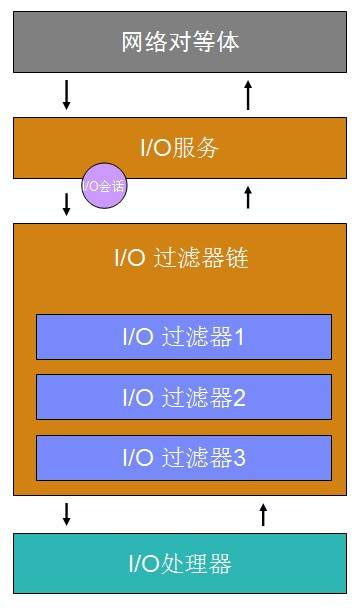
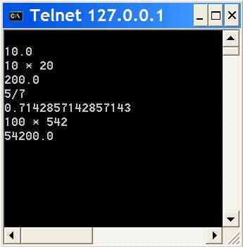
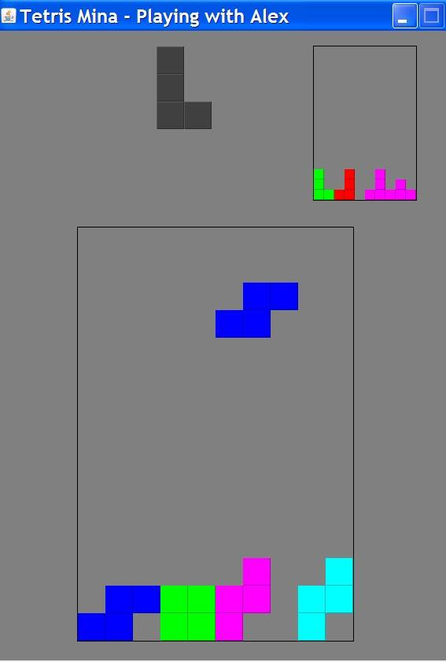
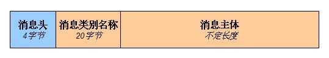
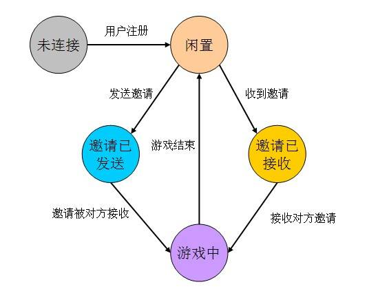
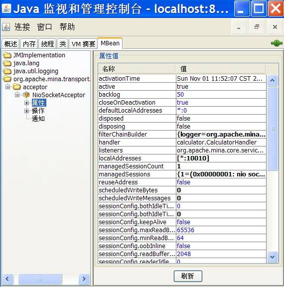

# 使用 Apache MINA 2 开发网络应用
两个简单的计算器服务和复杂的联机游戏示例应用

**标签:** Java,游戏

[原文链接](https://developer.ibm.com/zh/articles/j-lo-mina2/)

成富

发布: 2009-12-03

* * *

Apache MINA 2 是一个开发高性能和高可伸缩性网络应用程序的网络应用框架。它提供了一个抽象的事件驱动的异步 API，可以使用 TCP/IP、UDP/IP、串口和虚拟机内部的管道等传输方式。Apache MINA 2 可以作为开发网络应用程序的一个良好基础。下面将首先简单介绍一下 Apache MINA 2。

## Apache MINA 2 介绍

Apache MINA 是 Apache 基金会的一个开源项目，目前最新的版本是 2.0.0-RC1。本文中使用的版本是 2.0.0-M6。从 参考资料 中可以找到相关的下载信息。下面首先介绍基于 Apache MINA 的网络应用的一般架构。

### 基于 Apache MINA 的网络应用的架构

基于 Apache MINA 开发的网络应用，有着相似的架构。 [图 1\. 基于 Apache MINA 的网络应用的架构](#图-1-基于-apache-mina-的网络应用的架构) 中给出了架构的示意图。

##### 图 1\. 基于 Apache MINA 的网络应用的架构



如 [图 1\. 基于 Apache MINA 的网络应用的架构](#图-1-基于-apache-mina-的网络应用的架构) 所示，基于 Apache MINA 的网络应用有三个层次，分别是 I/O 服务、I/O 过滤器和 I/O 处理器：

- I/O 服务：I/O 服务用来执行实际的 I/O 操作。Apache MINA 已经提供了一系列支持不同协议的 I/O 服务，如 TCP/IP、UDP/IP、串口和虚拟机内部的管道等。开发人员也可以实现自己的 I/O 服务。
- I/O 过滤器：I/O 服务能够传输的是字节流，而上层应用需要的是特定的对象与数据结构。I/O 过滤器用来完成这两者之间的转换。I/O 过滤器的另外一个重要作用是对输入输出的数据进行处理，满足横切的需求。多个 I/O 过滤器串联起来，形成 I/O 过滤器链。
- I/O 处理器：I/O 处理器用来执行具体的业务逻辑。对接收到的消息执行特定的处理。

创建一个完整的基于 Apache MINA 的网络应用，需要分别构建这三个层次。Apache MINA 已经为 I/O 服务和 I/O 过滤器提供了不少的实现，因此这两个层次在大多数情况下可以使用已有的实现。I/O 处理器由于是与具体的业务相关的，一般来说都是需要自己来实现的。

### 事件驱动的 API

Apache MINA 提供的是事件驱动的 API。它把与网络相关的各种活动抽象成事件。网络应用只需要对其感兴趣的事件进行处理即可。事件驱动的 API 使得基于 Apache MINA 开发网络应用变得比较简单。应用不需要考虑与底层传输相关的具体细节，而只需要处理抽象的 I/O 事件。比如在实现一个服务端应用的时候，如果有新的连接进来，I/O 服务会产生 `sessionOpened` 这样一个事件。如果该应用需要在有连接打开的时候，执行某些特定的操作，只需要在 I/O 处理器中此事件处理方法 `sessionOpened` 中添加相应的代码即可。

在介绍 Apache MINA 中的基本概念的细节之前，首先通过一个简单的应用来熟悉上面提到的三个层次的具体职责。

## 从简单应用开始

在使用 Apache MINA 开发复杂的应用之前，首先将介绍一个简单的应用。通过此应用可以熟悉上面提到的三个层次，即 I/O 服务、I/O 过滤器和 I/O 处理器。该应用是一个简单的计算器服务，客户端发送要计算的表达式给服务器，服务器返回计算结果。比如客户端发送 `2+2` ，服务器返回 `4.0` 作为结果。

在实现此计算器的时候，首先需要考虑的是 I/O 服务。该计算器使用 TCP/IP 协议，需要在指定端口监听，接受客户端的连接。Apache MINA 提供了基于 Java NIO 的套接字实现，可以直接使用。其次要考虑的是 I/O 过滤器。I/O 过滤器过滤所有的 I/O 事件和请求，可以用来处理横切的需求，如记录日志、压缩等。最后就是 I/O 处理器。I/O 处理器用来处理业务逻辑。具体到该应用来说，就是在接收到消息之后，把该消息作为一个表达式来执行，并把结果发送回去。I/O 处理器需要实现 `org.apache.mina.core.service.IoHandler` 接口或者继承自 `org.apache.mina.core.service.IoHandlerAdapter` 。该应用的 I/O 处理器的实现如 [清单 1\. 计算器服务的 I/O 处理器 `CalculatorHandler`](#清单-1-计算器服务的-i-o-处理器-code-calculatorhandler-code) 所示。

##### 清单 1\. 计算器服务的 I/O 处理器 `CalculatorHandler`

```
public class CalculatorHandler extends IoHandlerAdapter {
    private static final Logger LOGGER = LoggerFactory
        .getLogger(CalculatorHandler.class);

    private ScriptEngine jsEngine = null;

    public CalculatorHandler() {
        ScriptEngineManager sfm = new ScriptEngineManager();
        jsEngine = sfm.getEngineByName("JavaScript");
        if (jsEngine == null) {
            throw new RuntimeException("找不到 JavaScript 引擎。");
        }
    }

    public void exceptionCaught(IoSession session, Throwable cause)
        throws Exception {
        LOGGER.warn(cause.getMessage(), cause);
    }

    public void messageReceived(IoSession session, Object message)
        throws Exception {
        String expression = message.toString();
        if ("quit".equalsIgnoreCase(expression.trim())) {
            session.close(true);
            return;
        }
        try {
            Object result = jsEngine.eval(expression);
            session.write(result.toString());
        } catch (ScriptException e) {
            LOGGER.warn(e.getMessage(), e);
            session.write("Wrong expression, try again.");
        }
    }
}

```

Show moreShow more icon

在 [清单 1\. 计算器服务的 I/O 处理器 `CalculatorHandler`](#清单-1-计算器服务的-i-o-处理器-code-calculatorhandler-code) 中， `messageReceived` 由 `IoHandler` 接口声明。当接收到新的消息的时候，该方法就会被调用。此处的逻辑是如果传入了”quit”，则通过 `session.close` 关闭当前连接；如果不是的话，就执行该表达式并把结果通过 `session.write` 发送回去。此处执行表达式用的是 JDK 6 中提供的 JavaScript 脚本引擎。此处使用到了 I/O 会话相关的方法，会在下面进行说明。

接下来只需要把 I/O 处理器和 I/O 过滤器配置到 I/O 服务上就可以了。具体的实现如 [清单 2\. 计算器服务主程序 CalculatorServer](#清单-2-计算器服务主程序-calculatorserver) 所示。

##### 清单 2\. 计算器服务主程序 CalculatorServer

```
public class CalculatorServer {
    private static final int PORT = 10010;

    private static final Logger LOGGER = LoggerFactory
        .getLogger(CalculatorServer.class);

    public static void main(String[] args) throws IOException {
        IoAcceptor acceptor = new NioSocketAcceptor();

        acceptor.getFilterChain().addLast("logger", new LoggingFilter());
        acceptor.getFilterChain().addLast(
            "codec",
            new ProtocolCodecFilter(new TextLineCodecFactory(Charset
                .forName("UTF-8"))));

        acceptor.setHandler(new CalculatorHandler());
        acceptor.bind(new InetSocketAddress(PORT));

        LOGGER.info("计算器服务已启动，端口是" + PORT);
    }
}

```

Show moreShow more icon

[清单 2\. 计算器服务主程序 CalculatorServer](#清单-2-计算器服务主程序-calculatorserver) 中，首先创建一个 `org.apache.mina.transport.socket.nio.NioSocketAcceptor` 的实例，由它提供 I/O 服务；接着获得该 I/O 服务的过滤器链，并添加两个新的过滤器，一个用来记录相关日志，另外一个用来在字节流和文本之间进行转换；最后配置 I/O 处理器。完成这些之后，通过 `bind` 方法来在特定的端口进行监听，接收连接。服务器启动之后，可以通过操作系统自带的 Telnet 工具来进行测试，如 [图 2\. 使用 Telnet 工具测试计算器服务](#图-2-使用-telnet-工具测试计算器服务) 所示。在输入表达式之后，计算结果会出现在下面一行。

##### 图 2\. 使用 Telnet 工具测试计算器服务



在介绍了简单的计算器服务这个应用之后，下面说明本文中会使用的复杂的联机游戏应用。

## 联机游戏示例说明

上一节中给出了一个简单的基于 Apache MINA 的网络应用的实现，可以用来熟悉基本的架构。而在实际开发中，网络应用都是有一定复杂度的。下面会以一个比较复杂的联机游戏作为示例来详细介绍 Apache MINA 的概念、API 和典型用法。

该联机游戏支持两个人进行俄罗斯方块的对战。这个游戏借鉴了 QQ 的”火拼俄罗斯”。用户在启动客户端之后，需要输入一个昵称进行注册。用户可以在”游戏大厅”中查看当前已注册的所有其它用户。当前用户可以选择另外的一个用户发送游戏邀请。邀请被接受之后就可以开始进行对战。在游戏过程中，当前用户可以看到对方的游戏状态，即方块的情况。该游戏的运行效果如 [图 3\. 联机游戏示例运行效果图](#图-3-联机游戏示例运行效果图) 所示。

##### 图 3\. 联机游戏示例运行效果图



下面开始以这个应用为例来具体介绍 Apache MINA 中的基本概念。先从 I/O 服务开始。

## I/O 服务

I/O 服务用来执行真正的 I/O 操作，以及管理 I/O 会话。根据所使用的数据传输方式的不同，有不同的 I/O 服务的实现。由于 I/O 服务执行的是输入和输出两种操作，实际上有两种具体的子类型。一种称为”I/O 接受器（I/O acceptor）”，用来接受连接，一般用在服务器的实现中；另外一种称为”I/O 连接器（I/O connector）”，用来发起连接，一般用在客户端的实现中。对应在 Apache MINA 中的实现， `org.apache.mina.core.service.IoService` 是 I/O 服务的接口，而继承自它的接口 `org.apache.mina.core.service.IoAcceptor` 和 `org.apache.mina.core.service.IoConnector` 则分别表示 I/O 接受器和 I/O 连接器。 `IoService` 接口提供的重要方法如 [I/O 服务](#i-o-服务) 所示。

##### 表 1\. IoService 中的重要方法

方法说明`setHandler(IoHandler handler)`设置 I/O 处理器。该 I/O 处理器会负责处理该 I/O 服务所管理的所有 I/O 会话产生的 I/O 事件。`getFilterChain()`获取 I/O 过滤器链，可以对 I/O 过滤器进行管理，包括添加和删除 I/O 过滤器。`getManagedSessions()`获取该 I/O 服务所管理的 I/O 会话。

下面具体介绍 I/O 接受器和 I/O 连接器。

### I/O 接受器

I/O 接受器用来接受连接，与对等体（客户端）进行通讯，并发出相应的 I/O 事件交给 I/O 处理器来处理。使用 I/O 接受器的时候，只需要调用 `bind` 方法并指定要监听的套接字地址。当不再接受连接的时候，调用 `unbind` 停止监听即可。关于 I/O 接受器的具体用法，可以参考 [清单 2\. 计算器服务主程序 CalculatorServer](#清单-2-计算器服务主程序-calculatorserver) 中给出的计算器服务的实现。

### I/O 连接器

I/O 连接器用来发起连接，与对等体（服务器）进行通讯，并发出相应的 I/O 事件交给 I/O 处理器来处理。使用 I/O 连接器的时候，只需要调用 `connect` 方法连接指定的套接字地址。另外可以通过 `setConnectTimeoutMillis` 设置连接超时时间（毫秒数）。

[清单 3\. I/O 连接器示例](#清单-3-i-o-连接器示例) 中给出了使用 I/O 连接器的一个示例。

##### 清单 3\. I/O 连接器示例

```
SocketConnector connector = new NioSocketConnector();
connector.setConnectTimeoutMillis(CONNECT_TIMEOUT);
connector.getFilterChain().addLast("logger", new LoggingFilter());
connector.getFilterChain().addLast("protocol",
    new ProtocolCodecFilter(new TetrisCodecFactory()));
ConnectFuture connectFuture = connector.connect(new InetSocketAddress(host, port));
connectFuture.awaitUninterruptibly();

```

Show moreShow more icon

在 [清单 3\. I/O 连接器示例](#清单-3-i-o-连接器示例) 中，首先创建一个 Java NIO 的套接字连接器 `NioSocketConnector` 的实例，接着设置超时时间。再添加了 I/O 过滤器之后，通过 `connect` 方法连接到指定的地址和端口即可。

在介绍完 I/O 服务之后，下面介绍 I/O 会话。

## I/O 会话

I/O 会话表示一个活动的网络连接，与所使用的传输方式无关。I/O 会话可以用来存储用户自定义的与应用相关的属性。这些属性通常用来保存应用的状态信息，还可以用来在 I/O 过滤器和 I/O 处理器之间交换数据。I/O 会话在作用上类似于 Servlet 规范中的 HTTP 会话。

Apache MINA 中 I/O 会话实现的接口是 `org.apache.mina.core.session.IoSession` 。该接口中比较重要的方法如 [I/O 会话](#i-o-会话) 所示。

##### 表 2\. IoSession 中的重要方法

方法说明`close(boolean immediately)`关闭当前连接。如果参数 `immediately` 为 `true` 的话，连接会等到队列中所有的数据发送请求都完成之后才关闭；否则的话就立即关闭。`getAttribute(Object key)`从 I/O 会话中获取键为 `key` 的用户自定义的属性。`setAttribute(Object key, Object value)`将键为 `key` ，值为 `value` 的用户自定义的属性存储到 I/O 会话中。`removeAttribute(Object key)`从 I/O 会话中删除键为 `key` 的用户自定义的属性。`write(Object message)`将消息对象 `message` 发送到当前连接的对等体。该方法是异步的，当消息被真正发送到对等体的时候， `IoHandler.messageSent(IoSession,Object)` 会被调用。如果需要的话，也可以等消息真正发送出去之后再继续执行后续操作。

在介绍完 I/O 会话之后，下面介绍 I/O 过滤器。

## I/O 过滤器

从 I/O 服务发送过来的所有 I/O 事件和请求，在到达 I/O 处理器之前，会先由 I/O 过滤器链中的 I/O 过滤器进行处理。Apache MINA 中的过滤器与 Servlet 规范中的过滤器是类似的。过滤器可以在很多情况下使用，比如记录日志、性能分析、访问控制、负载均衡和消息转换等。过滤器非常适合满足网络应用中各种横切的非功能性需求。在一个基于 Apache MINA 的网络应用中，一般存在多个过滤器。这些过滤器互相串联，形成链条，称为过滤器链。每个过滤器依次对传入的 I/O 事件进行处理。当前过滤器完成处理之后，由过滤器链中的下一个过滤器继续处理。当前过滤器也可以不调用下一个过滤器，而提前结束，这样 I/O 事件就不会继续往后传递。比如负责用户认证的过滤器，如果遇到未认证的对等体发出的 I/O 事件，则会直接关闭连接。这可以保证这些事件不会通过此过滤器到达 I/O 处理器。

Apache MINA 中 I/O 过滤器都实现 `org.apache.mina.core.filterchain.IoFilter` 接口。一般来说，不需要完整实现 `IOFilter` 接口，只需要继承 Apache MINA 提供的适配器 `org.apache.mina.core.filterchain.IoFilterAdapter` ，并覆写所需的事件过滤方法即可，其它方法的默认实现是不做任何处理，而直接把事件转发到下一个过滤器。

### IoFilter 接口详细说明

`IoFilter` 接口提供了 15 个方法。这 15 个方法大致分成两类，一类是与过滤器的生命周期相关的，另外一类是用来过滤 I/O 事件的。第一类方法如 [表 3\. IoFilter 中与过滤器的生命周期相关的方法](#表-3-iofilter-中与过滤器的生命周期相关的方法) 所示。

##### 表 3\. IoFilter 中与过滤器的生命周期相关的方法

方法说明`init()`当过滤器第一次被添加到过滤器链中的时候，此方法被调用。用来完成过滤器的初始化工作。`onPreAdd(IoFilterChain parent, String name, IoFilter.NextFilter nextFilter)`当过滤器即将被添加到过滤器链中的时候，此方法被调用。`onPostAdd(IoFilterChain parent, String name, IoFilter.NextFilter nextFilter)`当过滤器已经被添加到过滤器链中之后，此方法被调用。`onPreRemove(IoFilterChain parent, String name, IoFilter.NextFilter nextFilter)`当过滤器即将被从过滤器链中删除的时候，此方法被调用。`onPostRemove(IoFilterChain parent, String name, IoFilter.NextFilter nextFilter)`当过滤器已经被从过滤器链中删除的时候，此方法被调用。`destroy()`当过滤器不再需要的时候，它将被销毁，此方法被调用。

在 [表 3\. IoFilter 中与过滤器的生命周期相关的方法](#表-3-iofilter-中与过滤器的生命周期相关的方法) 中给出的方法中，参数 `parent` 表示包含此过滤器的过滤器链，参数 `name` 表示过滤器的名称，参数 `nextFilter` 表示过滤器链中的下一个过滤器。

第二类方法如 [表 3\. IoFilter 中与过滤器的生命周期相关的方法](#表-3-iofilter-中与过滤器的生命周期相关的方法) 所示。

##### 表 4\. IoFilter 中过滤 I/O 事件的方法

方法说明`filterClose(IoFilter.NextFilter nextFilter, IoSession session)`过滤对 `IoSession` 的 `close` 方法的调用。`filterWrite(IoFilter.NextFilter nextFilter, IoSession session, WriteRequest writeRequest)`过滤对 `IoSession` 的 `write` 方法的调用。`exceptionCaught(IoFilter.NextFilter nextFilter, IoSession session, Throwable cause)`过滤对 `IoHandler` 的 `exceptionCaught` 方法的调用。`messageReceived(IoFilter.NextFilter nextFilter, IoSession session, Object message)`过滤对 `IoHandler` 的 `messageReceived` 方法的调用。`messageSent(IoFilter.NextFilter nextFilter, IoSession session, WriteRequest writeRequest)`过滤对 `IoHandler` 的 `messageSent` 方法的调用。`sessionClosed(IoFilter.NextFilter nextFilter, IoSession session)`过滤对 `IoHandler` 的 `sessionClosed` 方法的调用。`sessionCreated(IoFilter.NextFilter nextFilter, IoSession session)`过滤对 `IoHandler` 的 `sessionCreated` 方法的调用。`sessionIdle(IoFilter.NextFilter nextFilter, IoSession session, IdleStatus status)`过滤对 `IoHandler` 的 `sessionIdle` 方法的调用。`sessionOpened(IoFilter.NextFilter nextFilter, IoSession session)`过滤对 `IoHandler` 的 `sessionOpened` 方法的调用。

对于 [表 3\. IoFilter 中与过滤器的生命周期相关的方法](#表-3-iofilter-中与过滤器的生命周期相关的方法) 中给出的与 I/O 事件相关的方法，它们都有一个参数是 `nextFilter` ，表示过滤器链中的下一个过滤器。如果当前过滤器完成处理之后，可以通过调用 `nextFilter` 中的方法，把 I/O 事件传递到下一个过滤器。如果当前过滤器不调用 `nextFilter` 中的方法的话，该 I/O 事件就不能继续往后传递。另外一个共同的参数是 `session` ，用来表示当前的 I/O 会话，可以用来发送消息给对等体。下面通过具体的实例来说明过滤器的实现。

### BlacklistFilter

`BlacklistFilter` 是 Apache MINA 自带的一个过滤器实现，其功能是阻止来自特定地址的连接，即所谓的”黑名单”功能。 `BlacklistFilter` 继承自 `IoFilterAdapter` ，并覆写了 `IoHandler` 相关的方法。 [清单 4\. 阻止来自特定地址连接的 BlacklistFilter](#清单-4-阻止来自特定地址连接的-blacklistfilter) 中给出了部分实现。

##### 清单 4\. 阻止来自特定地址连接的 BlacklistFilter

```
public void messageReceived(NextFilter nextFilter, IoSession session, Object message) {
    if (!isBlocked(session)) {
        nextFilter.messageReceived(session, message);
    } else {
        blockSession(session);
    }
}

private void blockSession(IoSession session) {
    session.close(true);
}

```

Show moreShow more icon

在 [清单 4\. 阻止来自特定地址连接的 BlacklistFilter](#清单-4-阻止来自特定地址连接的-blacklistfilter) 中 `messageReceived` 方法的实现中，首先通过 `isBlocked` 来判断当前连接是否应该被阻止，如果不是的话，则通过 `nextFilter.messageReceived` 把该 I/O 事件传递到下一个过滤器；否则的话，则通过 `blockSession` 来阻止当前连接。

### 使用 ProtocolCodecFilter

`ProtocolCodecFilter` 用来在字节流和消息对象之间互相转换。当该过滤器接收到字节流的时候，需要首先判断消息的边界，然后把表示一条消息的字节提取出来，通过一定的逻辑转换成消息对象，再把消息对象往后传递，交给 I/O 处理器来执行业务逻辑。这个过程称为”解码”。与”解码”对应的是”编码”过程。在”编码”的时候，过滤器接收到的是消息对象，通过与”解码”相反的逻辑，把消息对象转换成字节，并反向传递，交给 I/O 服务来执行 I/O 操作。

在”编码”和”解码”中的一个重要问题是如何在字节流中判断消息的边界。通常来说，有三种办法解决这个问题：

- 使用固定长度的消息。这种方式实现起来比较简单，只需要每次读取特定数量的字节即可。
- 使用固定长度的消息头来指明消息主体的长度。比如每个消息开始的 4 个字节的值表示了后面紧跟的消息主体的长度。只需要首先读取该长度，再读取指定数量的字节即可。
- 使用分隔符。消息之间通过特定模式的分隔符来分隔。每次只要遇到该模式的字节，就表示到了一个消息的末尾。

具体到示例应用来说，客户端和服务器之间的通信协议比较复杂，有不同种类的消息。每种消息的格式都不相同，同类消息的内容也不尽相同。因此，使用固定长度的消息头来指明消息主体的长度就成了最好的选择。

示例应用中的每种消息主体由两部分组成，第一部分是固定长度的消息类别名称，第二部分是每种消息的主体内容。 [图 4\. 示例应用中消息的结构](#图-4-示例应用中消息的结构) 中给出了示例应用中一条完整的消息的结构。

##### 图 4\. 示例应用中消息的结构



`AbstractTetrisCommand` 用来描述联机游戏示例应用中的消息。它是一个抽象类，是所有具体消息的基类。其具体实现如 [清单 5\. 联机游戏示例应用中的消息 AbstractTetrisCommand](#清单-5-联机游戏示例应用中的消息-abstracttetriscommand) 所示。

##### 清单 5\. 联机游戏示例应用中的消息 AbstractTetrisCommand

```
public abstract class AbstractTetrisCommand implements TetrisCommand {
    public abstract String getName();

    public abstract byte[] bodyToBytes() throws Exception;

    public abstract void bodyFromBytes(byte[] bytes) throws Exception;

    public byte[] toBytes() throws Exception {
        byte[] body = bodyToBytes();
        int commandNameLength = Constants.COMMAND_NAME_LENGTH;
        int len = commandNameLength + body.length;
        byte[] bytes = new byte[len];
        String name = StringUtils.rightPad(getName(), commandNameLength,
            Constants.COMMAND_NAME_PAD_CHAR);
        name = name.substring(0, commandNameLength);
        System.arraycopy(name.getBytes(), 0, bytes, 0, commandNameLength);
        System.arraycopy(body, 0, bytes, commandNameLength, body.length);
        return bytes;
    }
}

```

Show moreShow more icon

如 [清单 5\. 联机游戏示例应用中的消息 AbstractTetrisCommand](#清单-5-联机游戏示例应用中的消息-abstracttetriscommand) 所示， `AbstractTetrisCommand` 中定义了 3 个抽象方法： `getName` 、 `bodyToBytes` 和 `bodyFromBytes` ，分别用来获取消息的名称、把消息的主体转换成字节数组和从字节数组中构建消息。 `bodyToBytes` 对应于前面提到的”编码”过程，而 `bodyFromBytes` 对应于”解码”过程。每种具体的消息都应该实现这 3 个方法。 `AbstractTetrisCommand` 中的方法 `toBytes` 封装了把消息的主体转换成字节数组的逻辑，在字节数组中，首先是长度固定为 `Constants.COMMAND_NAME_LENGTH` 的消息类别名称，紧接着是每种消息特定的主体内容，由 `bodyToBytes` 方法来生成。

在介绍完示例应用中的消息格式之后，下面将讨论具体的”编码”和”解码”过程。”编码”过程由编码器来完成，编码器需要实现 `org.apache.mina.filter.codec.ProtocolEncoder` 接口，一般来说继承自 `org.apache.mina.filter.codec.ProtocolEncoderAdapter` 并覆写所需的方法即可。 [清单 6\. 联机游戏示例应用中消息编码器 CommandEncoder](#清单-6-联机游戏示例应用中消息编码器-commandencoder) 中给出了示例应用中消息编码器 `CommandEncoder` 的实现。

##### 清单 6\. 联机游戏示例应用中消息编码器 CommandEncoder

```
public class CommandEncoder extends ProtocolEncoderAdapter {

    public void encode(IoSession session, Object message,
        ProtocolEncoderOutput out) throws Exception {
        AbstractTetrisCommand command = (AbstractTetrisCommand) message;
        byte[] bytes = command.toBytes();
        IoBuffer buf = IoBuffer.allocate(bytes.length, false);

        buf.setAutoExpand(true);
        buf.putInt(bytes.length);
        buf.put(bytes);

        buf.flip();
        out.write(buf);
    }
}

```

Show moreShow more icon

在 [清单 6\. 联机游戏示例应用中消息编码器 CommandEncoder](#清单-6-联机游戏示例应用中消息编码器-commandencoder) 中， `encode` 方法封装了编码的逻辑。由于 `AbstractTetrisCommand` 的 `toBytes` 已经完成了到字节数组的转换， `encode` 方法直接使用即可。首先写入消息主体字节数组的长度，再是字节数组本身，就完成了编码的过程。

与编码过程相比，解码过程要相对复杂一些。具体的实现如 [清单 7\. 联机游戏示例应用中消息解码器 CommandDecoder](#清单-7-联机游戏示例应用中消息解码器-commanddecoder) 所示。

##### 清单 7\. 联机游戏示例应用中消息解码器 CommandDecoder

```
public class CommandDecoder extends CumulativeProtocolDecoder {

    protected boolean doDecode(IoSession session, IoBuffer in,
            ProtocolDecoderOutput out) throws Exception {
        if (in.prefixedDataAvailable(4, Constants.MAX_COMMAND_LENGTH)) {
            int length = in.getInt();
            byte[] bytes = new byte[length];
            in.get(bytes);
            int commandNameLength = Constants.COMMAND_NAME_LENGTH;
            byte[] cmdNameBytes = new byte[commandNameLength];
            System.arraycopy(bytes, 0, cmdNameBytes, 0, commandNameLength);
            String cmdName = StringUtils.trim(new String(cmdNameBytes));
            AbstractTetrisCommand command = TetrisCommandFactory
                .newCommand(cmdName);
            if (command != null) {
                byte[] cmdBodyBytes = new byte[length - commandNameLength];
                System.arraycopy(bytes, commandNameLength, cmdBodyBytes, 0,
                    length - commandNameLength);
                command.bodyFromBytes(cmdBodyBytes);
                out.write(command);
            }
            return true;
        } else {
            return false;
        }
    }
}

```

Show moreShow more icon

在 [清单 7\. 联机游戏示例应用中消息解码器 CommandDecoder](#清单-7-联机游戏示例应用中消息解码器-commanddecoder) 中可以看到，解码器 `CommandDecoder` 继承自 `CumulativeProtocolDecoder` 。这是 Apache MINA 提供的一个帮助类，它会自动缓存所有已经接收到的数据，直到编码器认为可以开始进行编码。这样在实现自己的编码器的时候，就只需要考虑如何判断消息的边界即可。如果一条消息的后续数据还没有接收到， `CumulativeProtocolDecoder` 会自动进行缓存。在之前提到过，解码过程的一个重要问题是判断消息的边界。对于固定长度的消息来说，只需要使用 Apache MINA 的 `IoBuffer` 的 `remaining` 方法来判断当前缓存中的字节数目，如果大于消息长度的话，就进行解码；对于使用固定长度消息头来指明消息主体的长度的情况， `IoBuffer` 提供了 `prefixedDataAvailable` 方法来满足这一需求。 `prefixedDataAvailable` 会检查当前缓存中是否有固定长度的消息头，并且由此消息头指定长度的消息主体是否已经全部在缓存中。如果这两个条件都满足的话，说明一条完整的消息已经接收到，可以进行解码了。解码的过程本身并不复杂，首先读取消息的类别名称，然后通过 `TetrisCommandFactory.newCommand` 方法来生成一个该类消息的实例，接着通过该实例的 `bodyFromBytes` 方法就可以从字节数组中恢复消息的内容，得到一个完整的消息对象。每次成功解码一个消息对象，需要调用 `ProtocolDecoderOutput` 的 `write` 把此消息对象往后传递。消息对象会通过过滤器链，最终达到 I/O 处理器，在 `IoHandler.messageReceived` 中接收到此消息对象。如果当前缓存的数据不足以用来解码一条消息的话， `doDecode` 只需要返回 `false` 即可。接收到新的数据之后， `doDecode` 会被再次调用。

### 过滤器链

过滤器只有在添加到过滤器链中的时候才起作用。过滤器链是过滤器的容器。过滤器链与 I/O 会话是一一对应的关系。 `org.apache.mina.core.filterchain.IoFilterChain` 是 Apache MINA 中过滤器链的接口，其中提供了一系列方法对其中包含的过滤器进行操作，包括查询、添加、删除和替换等。如 [过滤器链](#过滤器链) 所示。

##### 表 5\. IoFilterChain 接口的方法

方法说明`addFirst(String name, IoFilter filter)`将指定名称的过滤器添加到过滤器链的开头。`addLast(String name, IoFilter filter)`将指定名称的过滤器添加到过滤器链的末尾。`contains(String name)`判断过滤器链中是否包含指定名称的过滤器。`get(String name)`从过滤器链中获取指定名称的过滤器。`remove(String name)`从过滤器链中删除指定名称的过滤器。`replace(String name, IoFilter newFilter)`用过滤器 `newFilter` 替换掉过滤器链中名为 `name` 的过滤器。`getSession()`获取与过滤器链一一对应的 I/O 会话。

在介绍完 I/O 过滤器和过滤器链之后，下面介绍 I/O 处理器。

## I/O 处理器

I/O 事件通过过滤器链之后会到达 I/O 处理器。I/O 处理器中与 I/O 事件对应的方法会被调用。Apache MINA 中 `org.apache.mina.core.service.IoHandler` 是 I/O 处理器要实现的接口，一般情况下，只需要继承自 `org.apache.mina.core.service.IoHandlerAdapter` 并覆写所需方法即可。 `IoHandler` 接口的方法如 [I/O 处理器](#i-o-处理器) 所示。

##### 表 6\. IoHandler 接口的方法

方法说明`sessionCreated(IoSession session)`当有新的连接建立的时候，该方法被调用。`sessionOpened(IoSession session)`当有新的连接打开的时候，该方法被调用。该方法在 `sessionCreated` 之后被调用。`sessionClosed(IoSession session)`当连接被关闭的时候，此方法被调用。`sessionIdle(IoSession session, IdleStatus status)`当连接变成闲置状态的时候，此方法被调用。`exceptionCaught(IoSession session, Throwable cause)`当 I/O 处理器的实现或是 Apache MINA 中有异常抛出的时候，此方法被调用。`messageReceived(IoSession session, Object message)`当接收到新的消息的时候，此方法被调用。`messageSent(IoSession session, Object message)`当消息被成功发送出去的时候，此方法被调用。

对于 [I/O 处理器](#i-o-处理器) 中的方法，有几个需要重点的说明一下。首先是 `sessionCreated` 和 `sessionOpened` 的区别。 `sessionCreated` 方法是由 I/O 处理线程来调用的，而 `sessionOpened` 是由其它线程来调用的。因此从性能方面考虑，不要在 `sessionCreated` 方法中执行过多的操作。对于 `sessionIdle` ，默认情况下，闲置时间设置是禁用的，也就是说 `sessionIdle` 并不会被调用。可以通过 `IoSessionConfig.setIdleTime(IdleStatus, int)` 来进行设置。

Apache MINA 中的基本概念已经介绍完了，下面介绍状态机的使用。

## 使用状态机

在 I/O 处理器中实现业务逻辑的时候，对于简单的情况，一般只需要在 `messageReceived` 方法中对传入的消息进行处理。如果需要写回数据到对等体的话，用 `IoSession.write` 方法即可。在另外的一些情况下，客户端和服务器端的通信协议比较复杂，客户端其实是有状态变迁的。这个时候可以用 Apache MINA 提供的状态机实现，可以使得 I/O 处理器的实现更加简单。

状态机中两个重要的元素是状态以及状态之间的迁移。示例应用中客户端的状态以及迁移如 [图 5\. 联机游戏示例应用中客户端的状态以及迁移](#图-5-联机游戏示例应用中客户端的状态以及迁移) 所示。

##### 图 5\. 联机游戏示例应用中客户端的状态以及迁移



客户端初始化的时候，其状态为”未连接”，表示客户端还没有在服务器上面注册，此时还不能进行游戏；接着用户需要输入一个昵称来注册到服务器上面，完成之后状态迁移到”闲置”。此时客户端会接收到当前在线的所有其它用户的列表。当前用户可以邀请其它用户和他一块游戏，也可以接收来自其它用户的邀请。邀请发送出去之后，客户端的状态迁移到”邀请已发送”。如果接受了其它用户的邀请，客户端的状态迁移到”邀请已接收”。如果某个用户的邀请被另外一个用户接受的话，两个客户端的状态都会迁移到”游戏中”。

要实现这样较为复杂的状态机的话，只需要在 I/O 处理器中以声明式的方式定义状态和迁移条件就可以了。首先需要声明状态机中状态，如 [清单 8\. 联机游戏示例应用中的状态声明](#清单-8-联机游戏示例应用中的状态声明) 所示。

##### 清单 8\. 联机游戏示例应用中的状态声明

```
@State public static final String ROOT = "Root";
@State(ROOT) public static final String NOT_CONNECTED = "NotConnected";
@State(ROOT) public static final String IDLE = "Idle";
@State(ROOT) public static final String INVITATION_SENT = "InvitationSent";
@State(ROOT) public static final String INVITATION_ACCEPTED = "InvitationAccepted";
@State(ROOT) public static final String PLAYING = "Playing";

```

Show moreShow more icon

如 [清单 8\. 联机游戏示例应用中的状态声明](#清单-8-联机游戏示例应用中的状态声明) 所示，上面定义了一共六个状态。通过标注 `@State` 就声明了一个状态。需要注意的是状态之间是可以继承的。如果状态机接收到一个事件的时候，在当前状态中找不到对应的迁移，就会在其父状态上继续查找。状态的继承在某些情况下是很有用的，比如希望为所有的状态都增加同样的迁移逻辑，就可以直接把迁移条件添加在父状态上面。一个典型的场景就是错误处理，一般来说，所有的状态都需要错误处理，而错误处理的逻辑一般都是相同的。把发生错误时候的迁移放在父状态中，可以简洁的描述这一场景。

定义了状态之后，下面应该声明状态之间的迁移。如 [清单 9\. 联机游戏示例应用中的状态迁移声明](#清单-9-联机游戏示例应用中的状态迁移声明) 所示。

##### 清单 9\. 联机游戏示例应用中的状态迁移声明

```
@IoHandlerTransition(on = MESSAGE_RECEIVED, in = NOT_CONNECTED, next = IDLE)
public void login(TetrisServerContext context, IoSession session, LoginCommand cmd) {
    String nickName = cmd.getNickName();
    context.nickName = nickName;
    session.setAttribute("nickname", nickName);
    session.setAttribute("status", UserStatus.IDLE);
    sessions.add(session);
    users.add(nickName);

    RefreshPlayersListCommand command = createRefreshPlayersListCommand();
    broadcast(command);
}

@IoHandlerTransition(on = EXCEPTION_CAUGHT, in = ROOT, weight = 10)
public void exceptionCaught(IoSession session, Exception e) {
    LOGGER.warn("Unexpected error.", e);
    session.close(true);
}

@IoHandlerTransition(in = ROOT, weight = 100)
public void unhandledEvent() {
    LOGGER.warn("Unhandled event.");
}

```

Show moreShow more icon

[清单 9\. 联机游戏示例应用中的状态迁移声明](#清单-9-联机游戏示例应用中的状态迁移声明) 中，使用标注 `@IoHandlerTransition` 声明了一个状态迁移。每个状态迁移可以有四个属性： `on` 、 `in` 、 `next` 和 `weight` ，其中属性 `in` 是必须的，其余是可选的。属性 `on` 表示触发此状态迁移的事件名称，如果省略该属性的话，则默认为匹配所有事件的通配符。该属性的值可以是表中给出的 I/O 处理器中能处理的七种事件类型。属性 `in` 表示状态迁移的起始状态。属性 `next` 表示状态迁移的结束状态，如果省略该属性的话，则默认为表示当前状态 的 `_self_` 。属性 `weight` 用来指明状态迁移的权重。一个状态的所有迁移是按照其权重升序排列的。对于当前状态，如果有多个可能的迁移，排序靠前的迁移将会发生。代码中的第一个标注声明了如果当前状态是”未连接”，并且接收到了 `MESSAGE_RECEIVED` 事件，而且消息的内容是一个 `LoginCommand` 对象的话， `login` 方法会被调用，调用完成之后，当前状态迁移到”闲置”。第二个标注声明了对于任何的状态，如果接收到了 `EXCEPTION_CAUGHT` 事件， `exceptionCaught` 方法会被调用。最后一个标注声明了一个状态迁移，其起始状态是 `ROOT` ，表示该迁移对所有的事件都起作用。不过它的 `weight` 是 100，优先级比较低。该状态迁移的作用是处理其它没有对应状态迁移的事件。

使用了 Apache MINA 提供的状态机之后，创建 I/O 处理器的方式也发生了变化。I/O 处理器的实例由状态机来创建，如 [清单 10\. 在状态机中创建 I/O 处理器](#清单-10-在状态机中创建-i-o-处理器) 所示。

##### 清单 10\. 在状态机中创建 I/O 处理器

```
private static IoHandler createIoHandler() {
    StateMachine sm = StateMachineFactory.getInstance(
        IoHandlerTransition.class).create(ServerHandler.NOT_CONNECTED,
        new ServerHandler());
    return new StateMachineProxyBuilder().setStateContextLookup(
        new IoSessionStateContextLookup(new StateContextFactory() {
            public StateContext create() {
                return new ServerHandler.TetrisServerContext();
            }
    })).create(IoHandler.class, sm);
}

```

Show moreShow more icon

在 [清单 10\. 在状态机中创建 I/O 处理器](#清单-10-在状态机中创建-i-o-处理器) 中， `TetrisServerContext` 是提供给状态机的上下文对象，用来在状态之间共享数据。当然用 `IoSession` 也是可以实现的，不过上下文对象的好处是类型安全，不需要做额外的类型转换。

在介绍完状态机后，下面介绍一些高级话题，包括异步操作以及 Apache MINA 与 JMX 和 Spring 的集成。

## 高级话题

在前面章节中介绍了 Apache MINA 的基本概念和具体用法，下面讨论一些高级话题。

### 异步操作

Apache MINA 中的很多操作都是异步的，比如连接的建立、连接的关闭、还有数据的发送等。在编写网络应用的时候，需要考虑这一点。比如 `IoConnector` 的 `connect` 方法，其返回值是 `org.apache.mina.core.future.ConnectFuture` 类的对象。通过此对象，可以查询连接操作的状态。 [清单 3\. I/O 连接器示例](#清单-3-i-o-连接器示例) 中已经使用了 `ConnectFuture` 。另外一个常用的是发送数据时使用的 `org.apache.mina.core.future.WriteFuture` ，如 [清单 11\. WriteFuture 的使用](#清单-11-writefuture-的使用) 所示。

##### 清单 11\. WriteFuture 的使用

```
IoSession session = ...; // 获取 I/O 会话对象
WriteFuture future = session.write("Hello World"); // 发送数据
future.awaitUninterruptibly(); // 等待发送数据操作完成
if(future.isWritten())
{
    // 数据已经被成功发送
}
else
{
    // 数据发送失败
}

```

Show moreShow more icon

由于这样的需求很常见，I/O 处理器中提供了 `messageSent` 方法，当数据发送成功的时候，该方法会被调用。

### JMX 集成

Apache MINA 可以集成 JMX 来对网络应用进行管理和监测。下面通过对前面给出的计算器服务进行简单修改，来说明如何集成 JMX。所需的修改如 [清单 12\. Apache MINA 与 JMX 的集成](#清单-12-apache-mina-与-jmx-的集成) 所示。

##### 清单 12\. Apache MINA 与 JMX 的集成

```
MBeanServer mBeanServer = ManagementFactory.getPlatformMBeanServer();
IoAcceptor acceptor = new NioSocketAcceptor();
IoServiceMBean acceptorMBean = new IoServiceMBean(acceptor);
ObjectName acceptorName = new ObjectName(acceptor.getClass()
    .getPackage().getName()
    + ":type=acceptor,name=" + acceptor.getClass().getSimpleName());
mBeanServer.registerMBean(acceptorMBean, acceptorName);

```

Show moreShow more icon

如 [清单 12\. Apache MINA 与 JMX 的集成](#清单-12-apache-mina-与-jmx-的集成) 所示，首先获取平台提供的受控 bean 的服务器，接着创建受控 bean（MBean）来包装想要管理和监测的对象，这里使用的是 I/O 连接器对象。最后把创建出来的受控 bean 注册到服务器即可。

在启动计算器服务应用的时候，添加下面的启动参数： `-Dcom.sun.management.jmxremote -Dcom.sun.management.jmxremote.port=8084 -Dcom.sun.management.jmxremote.authenticate=false -Dcom.sun.management.jmxremote.ssl=false` ，就启用了 JMX。接着通过 JVM 提供的”Java 监视和管理控制台”（运行 `jconsole` ）就可以连接到此应用进行管理和监测了。监测的结果如 [图 6\. 通过”Java 监视和管理控制台”管理和监测基于 Apache MINA 的应用](#图-6-通过"java-监视和管理控制台”管理和监测基于-apache-mina-的应用) 所示。

<h5 id=”图-6-通过” java-监视和管理控制台”管理和监测基于-apache-mina-的应用>图 6. 通过”Java 监视和管理控制台”管理和监测基于 Apache MINA 的应用



### Spring 集成

Apache MINA 可以和流行的开源框架 Spring 进行集成，由 Spring 来管理 Apache MINA 中的对象。与 Spring 集成的方式也比较简单，只需要编写相应的 Spring 配置文件即可。 [清单 13\. Apache MINA 与 Spring 集成的配置文件](#清单-13-apache-mina-与-spring-集成的配置文件) 中给出了与 Spring 集成之后的计算器服务的配置文件。

##### 清单 13\. Apache MINA 与 Spring 集成的配置文件

```
<?xml version="1.0" encoding="UTF-8"?>
<beans>
    <bean id="calculatorHandler" class="calculator.CalculatorHandler" />

    <bean id="loggingFilter" class="org.apache.mina.filter.logging.LoggingFilter" />

    <bean id="calculatorCodecFilter" class="org.apache.mina.filter.
        codec.ProtocolCodecFilter">
        <constructor-arg>
            <bean class="org.apache.mina.filter.codec.textline.TextLineCodecFactory" />
        </constructor-arg>
    </bean>

    <bean id="filterChainBuilder"
        class="org.apache.mina.core.filterchain.DefaultIoFilterChainBuilder">
        <property name="filters">
            <map>
                <entry key="loggingFilter" value-ref="loggingFilter" />
                <entry key="codecFilter" value-ref="calculatorCodecFilter" />
                </map>
        </property>
    </bean>

    <bean class="org.springframework.beans.factory.config.CustomEditorConfigurer">
        <property name="customEditors">
            <map>
              <entry key="java.net.SocketAddress">
                <bean class="org.apache.mina.integration.beans.InetSocketAddressEditor"/>
              </entry>
            </map>
        </property>
    </bean>

    <bean id="ioAcceptor" class="org.apache.mina.transport.socket.nio.NioSocketAcceptor"
        init-method="bind" destroy-method="unbind">
        <property name="defaultLocalAddress" value=":10010" />
        <property name="handler" ref="calculatorHandler" />
        <property name="filterChainBuilder" ref="filterChainBuilder" />
    </bean>
</beans>

```

Show moreShow more icon

[清单 13\. Apache MINA 与 Spring 集成的配置文件](#清单-13-apache-mina-与-spring-集成的配置文件) 中创建 I/O 处理器和 I/O 过滤器的方式很直接。由于不能直接从 I/O 接受器获取过滤器链，这里创建了一个 `org.apache.mina.core.filterchain.DefaultIoFilterChainBuilder` 类的 bean，用来构建过滤器链。由 Apache MINA 提供的网络地址编辑器 `org.apache.mina.integration.beans.InetSocketAddressEditor` 允许以”`主机名 : 端口` ”的形式指定网络地址。在声明 I/O 接受器的时候，通过 `init-method` 指明了当 I/O 接受器创建成功之后，调用其 `bind` 方法来接受连接；通过 `destroy-method` 声明了当其被销毁的时候，调用其 `unbind` 来停止监听。

## 结束语

Apache MINA 是一个很好的网络应用框架，它通过事件驱动的 API 为开发网络应用提供了良好的架构基础，同时也提供了丰富的 I/O 服务和 I/O 过滤器的实现，使得开发网络应用变得简单。本文详细介绍了 Apache MINA 中的基本概念，包括 I/O 服务、I/O 会话、I/O 过滤器和 I/O 处理器等，同时介绍了如何利用状态机来实现逻辑复杂的 I/O 处理器。除此之外，还讨论了 Apache MINA 如何与 JMX 和 Spring 进行集成。本文提供了一个简单的计算器服务和复杂的俄罗斯方块联机游戏作为示例，可以帮助读者更好的掌握基于 Apache MINA 的网络应用开发。

## 获取源码

[CalculatorMina.zip](CalculatorMina.zip): 计算器服务示例源代码