# 使用 Apache Maven 和 CXF 构建 RESTful web services
以通俗易懂的语言帮助读者快速入门

**标签:** DevOps,Web 开发

[原文链接](https://developer.ibm.com/zh/articles/os-restfulwebservices/)

王龙

发布: 2014-10-22

* * *

## 引言

在多系统的分布式 IT 服务架构中 web services 为系统间交互的首选的方式。使用 web services 可以以一种规范的方式，使得异构平台，不同语言开发的系统，以及内部协议不同的系统之间完成数据的交互和系统的集成。本文将介绍如何使用 Apache CXF 框架构建 REST (Representational State Transfer) web services 服务。另外，

本文还将介绍如何使用 Maven 构建和管理 OSGi bundle 的工程，本文中的 web services 将作为一个 OSGi bundle 部署到 ServiceMix ‘容器中。文章中示例程序均使用 CXF 2.4.4 和 Maven 3.0.5 版本进行开发。

## 关于 Maven

Maven 是一个基于 POM(Project Object Model) 概念的软件项目管理和构建工具。它的目的是简化大型复杂多模块软件系统的管理，使用 Maven 能够有效的管理项目的依赖 , 不论是第三方 jar 包还是已开发的模块，只要通过更改依赖版本号就能够轻松的升级到期望的版本，而不需要像传统的开发中替换 jar 包。因为我们通过配置维护了一个 Maven 的本地或者远程仓库，仓库中将包含那些依赖的 jar 包。关于 Maven 的安装和配置将在后文中涉及到。

Maven 的核心是一个插件 (plugin) 系统， Maven 提供了很多插件去完成项目管理中诸如编译 , 打包，单元测试，代码生成等任务。在项目开发中，我们通过在 POM 文件的相应元素中配置以插件和任务 , 以下展示了一个通过 xsd 生成响应 java 代码的配置片段。

```
代码 1，Maven 插件配置示例
<plugin>
           <groupId>org.jvnet.jaxb2.maven2</groupId>
           <artifactId>maven-jaxb2-plugin</artifactId>
           <executions>
                 <execution>
                          <id>configuration_code_generate<id>
                          <goals>
                                <goal>generate</goal>
                          <goals>
                          <configuration>
                                   <schemaIncludes>
                                        <include>schema.xsd</include>
                                   </schemaIncludes>
                                   <generatePackage>
                                         com.xxx.yyy.zzz.configuration
                                   </generatePackage>
                          </configuration>
                 </execution>
           </executions>
<plugin>

```

Show moreShow more icon

当使用 Maven 时，如果我们需要引入一个依赖的 jar 包，并不需要直接去配置 classpath，而是在 POM 文件中加入 dependency，例如，引入对 CXF 依赖。

```
<dependency>
         <groupId>org.apache.cxf</groupId>
         <artifactId>cxf-rt-frontend-jaxrs</artifactId>
         <version>2.4.4</version>
      </dependency>

```

Show moreShow more icon

读者可以访问链接 : [http://maven.apache.org/plugins/index.htm](http://maven.apache.org/plugins/index.html) ，参考 Maven 所支持的插件以及如何在 POM 中配置使用这些插件完成响应的任务。

## 关于 JAX-RS 和 CXF

JAX-RS 定义了实现 REST web services 的语法，并且提供了一系列的 annotations 注解标签助一个类和方法暴露成 REST 的资源。一个资源类代表一个网络资源，对该网络资源的任何请求被 Resource 类中定义的方法处理。主要的 annotation 注解标签用法和解释如下：

标签用法和解释@GET,@POST,@PUT,@DELETE该组标签将一个标注方法的 HTTP 请求类型@PATH该标签可用于类或者方法，表示定位此 RESTful 资源的路径。@Produces该标签标注资源类或方法返回的 MIME 类型 , 也就是资源方法产生并且返回给客户端的响应消息的类型。例如 application/xml.@Consumes该标签标注资源类或方法可以接受的请求消息的类型，也就是客户端发送的请求中可以包含的 Http Entity 的类型。@PathParam，@QueryParam，@HeaderParam，@CookieParam该组分别标注方法的参数来自于 HTTP 请求的不同位置，例如，@PathParam 来自于 URL 的路径，@QueryParam 来自于 URL 的查询参数，@HeaderParam 来自于 HTTP 请求的头信息，@CookieParam 来自于 HTTP 请求的 Cookie。@Context该标签标注资源请求或者响应的上下文实例，例如我们可以再资源方法参数中注入 HttpServletRequest (@Context HttpServletRequest httpRequest) 来获取 Http 请求的相关信息。

例如，下面示例定义了一个根据员工编号查询员工信息的 RESTful 风格的 web services 方法。

```
代码 2. 声明 RESTFul 风格方法示例
@GET
@PATH(value=”/staff/query/{id}”)
@Produces("application/xml”)
Staff  getStaffById(@PathParam("id") int id)

```

Show moreShow more icon

方法会返回一个 Staff 对象，我们可以使用 JAXB annotation 去标注这个 Java Bean， 实现 XML 和 Java 对象的绑定，也可以从 XML schema 开始，用 JDK 提供的 xjc 命令去生成带有 JAXB annotation 的 Java Bean。JAXB 是 CXF 默认采用的数据方式。

CXF 实现了 JAX-RS 规范中定义的实现 RESTful web services 各种组件和机制， 包括数据绑定过滤器、解释器、资源方法路径匹配、安全、负载均衡、客户端 API 等等。并且 CXF 和 Spring 也有很好的集成，从而大大的简化了配置和部署 RESTful web service 的过程。在本文中，我们的 web services 将通过 Spring 的 bean

配置文件发布，具体使用到的就是  标签，用法可以在后文的示例中看到。

## 搭建开发环境

### 安装 eclipse 集成开发环境

Eclipse 的安装很简单，只需要解压到相应目录即可，读者可以到 Eclipse 官网 ( [http://www.eclipse.org/downloads/)](http://www.eclipse.org/downloads/) 下载最新版本的) Eclipse IDE。

### 安装 JDK

到 Oracle 官网下载并安装 JDK，请保证 JDK 版本至少在 1.6 以上。

### 安装 Maven

[到 maven 官方网站 (](http://maven.apache.org/download.cgi) [http://maven.apache.org/download.cgi](http://maven.apache.org/download.cgi) [)](http://maven.apache.org/download.cgi) [下载最新稳定版本的 maven 二进制分发包，本文](http://maven.apache.org/download.cgi) 使用的是 3.0.5 版本，下载完成后，解压到相应目录 , 如：c:/apache-maven-3.0.5. 设置环境变量 M2\_HOME= c:/apache-maven-3.0.5, 并且 %M2\_HOME%/bin 目录加入到系统 classpath. 最后在 CMD 命令行输入以下命令验证安装是否成功：

##### 图 1\. 查看 Maven 是否安装和配置成功

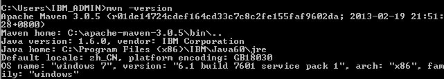

如未显示上图所示的信息，请检查 JDK 环境变量设置，因为 Maven 依赖于 JAVA\_HOME 环境变量。

安装成功后，配置 Maven 仓库地址，找到 Maven 安装目录下 conf/settings.xml 文件，我们之前将 Maven 安装在 c 盘根目录下，所以配置文件在 c:/apache-maven-3.0.5/conf/settings.xml. Maven 仓库默认是放在本地用户的临时文件夹下面的 .m2 文件夹下的 repository 下 :

如果想要自定义仓库路径，如 : c:/maven\_repo 则只需要修改  标签的值即可。

当然 Maven 还支持配置远程仓库和网络代理配置，都可以在 settings.xml 找到相应的配置标签，在这里不做赘述。

##### 图 2\. 配置 Maven 的本地仓库路径

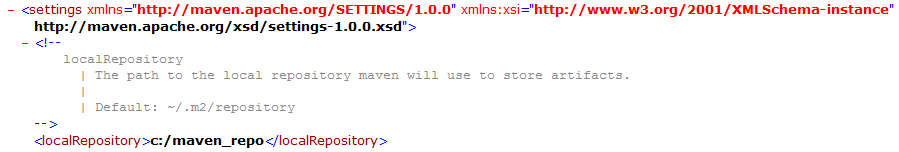

### 安装 eclipse-maven3-plugin 开发插件

通过 eclipse IDE 的 Help –> Install New Software 菜单，添加以下地址为作为软件下载地址，

[http://download.eclipse.org/technology/m2e/releases](http://download.eclipse.org/technology/m2e/releases) ，待 eclipse 找到插件后，选择复选框，然后一路选择 Next 完成安装。安装完成后根据提示重启 eclipse。

##### 图 3\. 在线安装 Maven 的 eclipse 插件

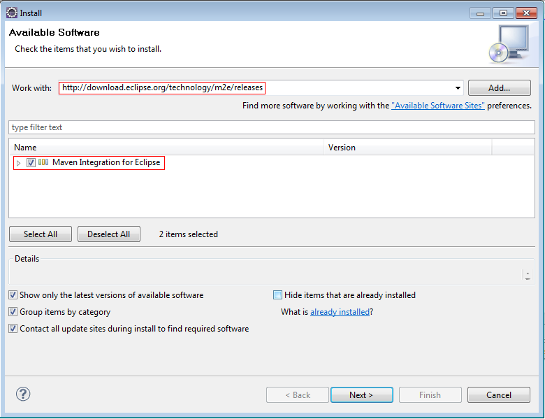

eclipse 重启后，选择 Window->Preferences 菜单，看到如图所示的 Maven 首选项后，表明安装成功。

##### 图 4\. 检查 Maven 插件安装是否成功

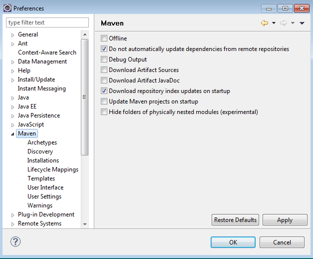

接下来就是要配置 Maven 插件了，选择 Installation，然后单击 Add 按钮添加 Maven 软件安装地址。

##### 图 5\. 在 eclipse 中配置 Maven 插件

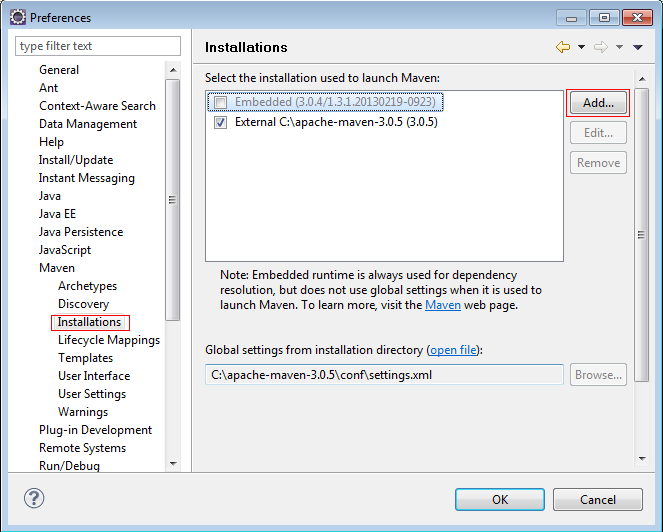

再选择 User Settings, 点击 Browse 按钮选择 Maven 配置文件的路径，并且点击 Reindex 按钮更新配置。

##### 图 6\. Maven 插件的用户设置

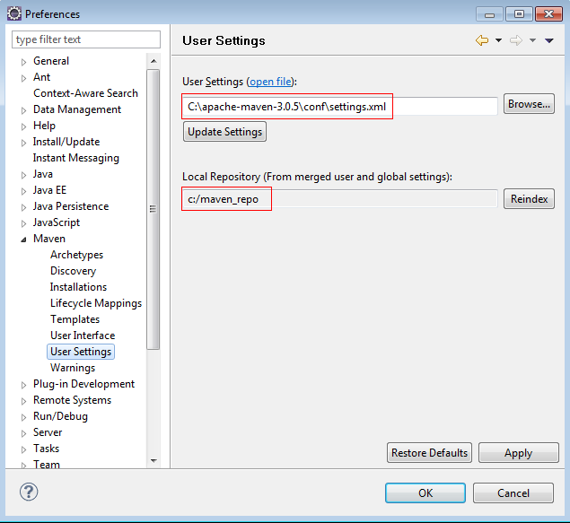

### 安装 Apache ServiceMix 容器。

```
ServiceMix OSGi 容器可以从 http://servicemix.apache.org/downloads.html
下载，目前最新版本是 4.5.2, 本文选择稳定版本 4.4.0. 下载完成后，直接解压即可完成安装。

至此，开发环境搭建过程就完成了。接下来我们将开始 CXF 和 Maven 开发 , 构建和部署 RESTful web services 之旅。

```

Show moreShow more icon

## 开发 RESTful web services

本小节中，我们将以下面背景为需求开发一组包含基本增删改查操作的 RESTFul web services 服务。

某集成网络服务提供商拥有大量的用户，现在需要将部分用户信息处理能力暴露给第三方经过验证和授权的合作伙伴，所以该服务提供商决定开发一个 RESTful web services 程序来满足这部分需求，该程序需要实现的功能是：

- 查询用户
- 增加用户
- 修改用户信息
- 注销一个用户
- 获取某个时间段内注册的用户

### 创建 Maven 工程

通过 File->New-Other.. 菜单，选择 Maven Project

##### 图 7\. 新建 Maven 工程

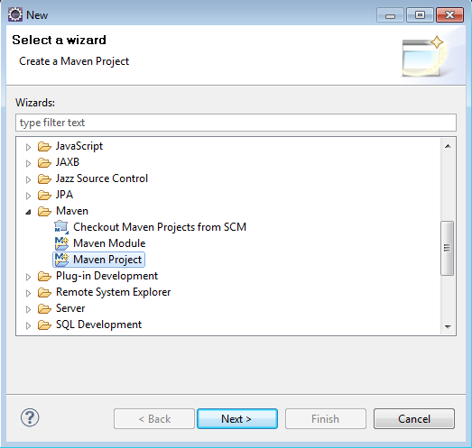

选择 maven-archetype-quikstart 工程类型，这种类型的项目只包含 Maven 工程的基本结构。

##### 图 8\. 选择工程的 Archetype

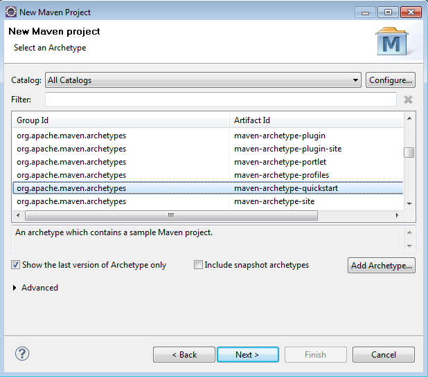

填写工程的 groupId,artifactId,package 等信息，这些信息分别对应了 Maven 的 pom.xml 项目管理文件中的同名标签的信息。groupId 代表 Maven 工程的群组 id，一般实现相似功能的 Maven 工程具有相同的群组 ID。例如，我们可能会开发很多关于用户的 Web Service ，如用户基本信息服务，用户定制服务管理服务，用户交互信息管理服务等，那么这些工程最好都有相同的群组 ID。 artifactId 是用来标识相似功能工程群组中不同的项目。例如，我们实现用户的基本信息管理的项目被命名为为 user-info-service. package 的默认值是 groupId. artifactId, 代表工程根包名称，

一般会做一些调整使之更具实际意义。

##### 图 9\. 填写工程的相关信息

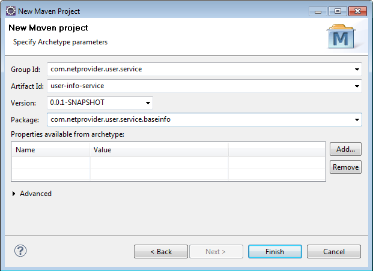

点击 Finish 按钮完成项目创建过程。

创建完成后，将 src/main/java 和 src/test/java 文件夹设置为工程的 source folder

##### 图 10\. 配置工程的 Build Path

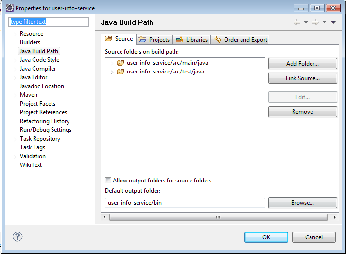

点击 OK，可以看到工程结构如图所示：

##### 图 11\. 工程的目录结构

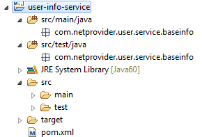

其中 src/main/java 是 java 源文件存放的目录，src/test/java 是测试类存放的地方，一般我们把写的 Junit 单元测试类放在这个目录。pom.xml 是 Maven 项目的管理配置文件，我们对 OSGi bundle 的依赖管理、包管理，以及通过 Maven 插件完成的任务都在这里配置。

### 配置 Maven 工程

由于我们的项目开发需要用到 CXF 和 JSR311 API，所以需要在 pom.xml 加入对这些包的依赖。

代码片段如下：

```
代码 3. 加入 CXF 和 JSR311 jar 包依赖代码示例
<dependencies>
    <dependency>
     <groupId>javax.ws.rs</groupId>
<artifactId>jsr311-api</artifactId>
     <version>1.1.1</version>
    </dependency>
    <dependency>
     <groupId>org.apache.cxf</groupId>
     <artifactId>cxf-rt-frontend-jaxrs</artifactId>
     <version>2.4.4</version>
    </dependency>
</dependencies>

```

Show moreShow more icon

其次还需要修改 packaging 标签对应的值为 bundle，因为默认建好工程后这个值为 jar。这样提示 Maven 需要将工程打包成一个 OSGi Bundle。

```
代码 4. 项目打包类型修改代码示例
       <packaging>bundle</packaging>

```

Show moreShow more icon

最后，我们需要配置基本 OSGi bundle 工程的信息，如 Export Packge 点点、 Import Package、 Private Packge 等信息，熟悉 OSGi 规范的开发者都知道，每一个 OSGi bundle 都含有一个 /META-INF/manifest.mf 文件来描述 bundle 的基本信息。OSGi 容器通过这些信息来控制 bundle 的包访问策略。对于用 Maven 打包的 OSGi 项目，需要在 POM 文件的相应标签内配置这些信息，而这些信息也将会在打包时被写入最终的 manifest.mf 文件。如果您没有或者想了解 OSGi 规范的有关知识，请参考 OSGi 联盟网站 [http://www.osgi.org/](http://www.osgi.org/)。

本例中 OSGi bundle 配置的代码片段如下：

```
代码 5. OSGi bundle 开发基本配置代码示例
<build>
    <plugins>
      <plugin>
         <groupId>org.apache.felix</groupId>
<artifactId>maven-bundle-plugin</artifactId>
         <version>2.2.0</version>
         <extensions>true</extensions>
         <configuration>
         <instructions>
          <Export-Package>com.netprovider.user.service.baseinfo</Export-Package>
          <Private-Package>com.netprovider.user.service.baseinf.*</Private-Package>
           <Import-Package>
             META-INF.cxf,
             META-INF.cxf.osgi,
             javax.xml.bind,
             javax.xml.bind.annotation,
             javax.xml.ws,
             javax.ws.rs.*,
             *
</Import-Package>
          <DynamicImport-Package>*</DynamicImport-Package>
         </instructions>
         </configuration>
       </plugin>
     </plugins>
</build>

```

Show moreShow more icon

通过上述配置我们可以看到，使用 Maven 来管理项目时，对于第三方包的依赖无需再显示引入 jar 包到 classpath，而且通过在 Maven 管理文件中加入相应的依赖，这样做的好处是可以轻松的修改项目所以来的软件包的版本，而不需要在项目里替换 jar 包。

### 开发项目代码

前面我们提到过，JAXB 是 CXF 默认的数据绑定方式，所以本例中我们会使用 JAXB 标签标注创建的 User 类，来定义 User 类和 XML 之间的映射关系。

```
代码 6. User 类源码
@XmlAccessorType(XmlAccessType.PROPERTY)
@XmlRootElement(name = "User")
@XmlType(propOrder = { "userId", "nickname", "gender","registerDate"})
publicclassUser implementsSerializable {

privatestaticfinallongserialVersionUID= 1L;

privateString userId;

privateString nickname;

privateString gender;

privateDate registerDate;

     publicUser(String userId, String nickname, String gender, Date registerDate) {
this.userId = userId;
this.nickname = nickname;
this.gender = gender;
this.registerDate = registerDate;
     }

publicString getUserId() {
returnuserId;
     }

publicvoidsetUserId(String userId) {
this.userId = userId;
     }

publicString getNickname() {
returnnickname;
     }

publicvoidsetNickname(String nickname) {
this.nickname = nickname;
     }

publicString getGender() {
returngender;
     }

publicvoidsetGender(String gender) {
this.gender = gender;
     }
@XmlJavaTypeAdapter(DateConverter.class)
publicDate getRegisterDate() {
returnregisterDate;
     }

publicvoidsetRegisterDate(Date registerDate) {
this.registerDate = registerDate;
     }
@Override
publicString toString() {
return"User [userId=" + userId + ", nickname=" + nickname
             + ", gender=" + gender + ", registerDate =" + registerDate + "]";
     }
}

```

Show moreShow more icon

为了用 XML 映射多个用户，我们定义了 Users 类，Users 类只有一个成员变量，它是一个装有 User 对象的 java.util.List 列表。

```
代码 7. Users 类源码
@XmlRootElement(name = "Users")
publicclassUsers {
     @XmlElement(name = "User")
privateList<User> users;

publicList<User> getUsers() {
returnusers;
     }
publicvoidsetUsers(List<User> users) {
this.users = users;
     }
}

```

Show moreShow more icon

对于注册日期 registerDate 变量的映射，需要做一些必要的处理，我们希望日期被映射为 yyyy-mm-dd 的形 式，上述 User 类中，我们用 @XmlJavaTypeAdapter 标签 注释 registerDate 的 getter 方法， 望告知 JAXB 遇到这个属性的时候， 用 DateConverter 类做处理，DateConverter 类继承自 `javax.xml.bind.  annotation.adapters.XmlAdapter` 类并覆盖重写了 JAXB 的 marshall/unmarshall 方法，对于传入的日期做了 转换处理。具体代码片段如下：

```
代码 8. DateConverter 类源码

publicclassDateConverter extendsXmlAdapter<String, Date> {

privateDateFormat df = newSimpleDateFormat("yyyy-MM-dd");

publicDate unmarshal(String date) throwsException {
    returndf.parse(date);
      }

publicString marshal(Date date) throwsException {
    returndf.format(date);
      }
}

```

Show moreShow more icon

为了简化程序复杂度，程序中用到的用户数据是写死在内存中的五个测试用户数据。测试数据如下：

##### 图 12\. 测试数据

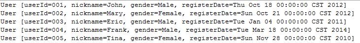

根据上文介绍的需求和 CXF，JAX－RS 的相关知识，我们知道 增删改查方法 分 别对应了 HTTP 协议的 POST,DELETE,PUT,GET 请求，下面我们定义一个 UserService 接口，声明我们要实现的服务方法以及它们对应的 HTTP 方法类型，接受和返回内容的 MIME 类型等，代码如下：

```
代码 9. UserService 类源码
@Produces({ MediaType.APPLICATION_XML})
@Consumes({ MediaType.APPLICATION_XML})
publicinterfaceUserService {
     @GET
@Produces(MediaType.APPLICATION_XML)
     @Path("/searchuser/{userId}")
    User searchUser(@PathParam("userId") String userId);

     @POST
@Consumes(MediaType.APPLICATION_XML)
     @Path("/adduser")
     Response addUser(User user);

     @DELETE
@Consumes(MediaType.APPLICATION_XML)
     @Path("/deleteuser/{userId}")
     Response deleteUser(@PathParam("userId") String userId);

     @PUT
     @Path("/category")
@Consumes(MediaType.APPLICATION_XML)
        Response updateUser(User user);

     @GET
     @Path("/getusers/startdate/{startDate}/enddate/{endDate}")
@Produces({ MediaType.APPLICATION_XML})
       Users getUsers(@PathParam("startDate") String startDate ,
                      @PathParam("endDate") String endDate);
}

```

Show moreShow more icon

定义了服务接口类后，接下来就是实现它了。代码中增删改查方法都调用了 UserDAO 类，该类模拟了数据库的操作，不同的是这里其实是从一个内存中的静态列表中操作数据，具体可以参考附件。

在得到了 User 对象实例后，对于 GET 类型的方法，会直接返回相应的 JAXB 标注过的类，CXF 会使用 JAXB 根据注释解析类属性，完成 User 类实例与 XML 之间的转化。对于 PUT，POST,DELETE 类型的方法，都是先检查是否存在这样的数据，如果不存在，会返回一个提示消息告诉需要操作的数据不存在。具体请参考代码：

```
代码 10. UserServiceImpl 类源码
publicclassUserServiceImpl implementsUserService {

publicUser searchUser(String userId) {
User user = UserDAO.searchUser(userId);
if(user == null) {
ResponseBuilder builder = Response.status(Status.NOT_FOUND);
builder.type("application/xml");
             builder.entity("<errorMsg>User with id:" +
                           userId + " can not be found!</errorMsg>");
thrownewWebApplicationException(builder.build());
} else{
System.out.println("User with id:" + userId + " is found");
returnuser;
         }

     }

publicResponse addUser(User user) {
User userObj = (User) UserDAO.searchUser(user.getUserId());
if(userObj != null) {
ResponseBuilder builder = Response.status(Status.FORBIDDEN);
             builder.type("application/xml");
             builder.entity("<errorMsg>User with id:" + user.getUserId()
                          + " already exists</errorMsg>");
thrownewWebApplicationException(builder.build());
} else{
UserDAO.addUser(user);
returnResponse.ok(user).build();
         }
     }

publicResponse deleteUser(String userId) {
User userObj = (User) UserDAO.searchUser(userId);
if(userObj == null) {
ResponseBuilder builder = Response.status(Status.FORBIDDEN);
             builder.type("application/xml");
             builder.entity("<errorMsg>User with id:" + userId
             + " is not existed, delettion request is rejected</errorMsg>");
thrownewWebApplicationException(builder.build());
} else{
UserDAO.deleteUser(userId);
returnResponse.ok().build();
         }
     }

publicResponse updateUser(User user) {
User userObj = (User) UserDAO.searchUser(user.getUserId());
if(userObj == null) {
ResponseBuilder builder = Response.status(Status.FORBIDDEN);
             builder.type("application/xml");
             builder.entity("<errorMsg>User with id:" + user.getUserId()
               + " is not existed, update request is rejected</errorMsg>");
thrownewWebApplicationException(builder.build());
} else{
UserDAO.updateUser(user);
returnResponse.ok(user).build();
         }
     }

publicUsers getUsers(String startDate, String endDate) {
List<User> userList = newArrayList<User>();
ResponseBuilder builder = Response.status(Status.OK);
         builder.type("application/xml");
try{
userList = UserDAO.getUsersByRegDate(startDate, endDate);
} catch(Exception e) {
             e.printStackTrace();
builder = Response.status(Status.NOT_ACCEPTABLE);
             builder.entity("<errorMsg>" +
               "not accpertable date format for startDate or endDate</errorMsg>");
thrownewWebApplicationException(builder.build());
         }
if(userList.size() < 1) {
builder = Response.status(Status.NOT_FOUND);
             builder.entity("<errorMsg>no user found registered between"
                     +startDate+ " and " + endDate + "</errorMsg>");
thrownewWebApplicationException(builder.build());
} else{
Users users = newUsers();
             users.setUsers(userList);
returnusers;
         }
     }

```

Show moreShow more icon

至此，主要类的代码开发就完成了，现在我们需要利用 Spring 去配置和发布 web services ，CXF 对于 Spring 有很好的集成。 在项目中创建如下 目录结构，因为这样才会在打包后被 Servicemix 容器认识。

##### 图 13\. 添加 Spring 配置文件

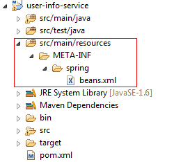

其中 beans.xml 就是 Spring 配置文件，这个文件名称可以随便命名，但必须是 XML 类型。对于熟悉 Spring 的开发人员来说，下面配置很容易看懂，但是 <jax-rs : server> 标签是 CXF 集成了 Spring 后提供的 , `其中会包含 Web services 服务的相对地址，服务的实现类等，具体请参考代码`

```
代码 11. 通过 Spring 配置文件发布 Web services 代码示例

<beans xmlns="http://www.springframework.org/schema/beans"
xmlns:xsi="http://www.w3.org/2001/XMLSchema-instance"xmlns:jaxrs="http://cxf.apache.org/jaxrs"
xsi:schemaLocation="http://www.springframework.org/schema/beans
     http://www.springframework.org/schema/beans/spring-beans-2.5.xsd
     http://cxf.apache.org/jaxrs http://cxf.apache.org/schemas/jaxrs.xsd
     http://camel.apache.org/schema/osgi
     http://camel.apache.org/schema/osgi/camel-osgi.xsd
     http://camel.apache.org/schema/spring
     http://camel.apache.org/schema/spring/camel-spring.xsd
     http://camel.apache.org/schema/cxf
http://camel.apache.org/schema/cxf/camel-cxf.xsd">
<import resource="classpath:META-INF/cxf/cxf.xml"/>
<jaxrs:server id="userRestService"address="/userservices/v1.0">
         <jaxrs:serviceBeans>
<ref bean="userServiceImpl"/>
         </jaxrs:serviceBeans>
     </jaxrs:server>
<bean id="userServiceImpl"class="com.netprovider.user.service.baseinfo.impl.UserServiceImpl">
     </bean>
</beans>

```

Show moreShow more icon

至此，RESTful Web Service 开发和配置工作就完成了。

## 打包和部署

### 打包

Maven 作为本文用到的项目 build 工具，已经作为插件被集成到 eclipse IDE 中，现在是发挥它打包作用的时候了。在 eclipse 中右键单击工程，选择 Run As ->Maven install 开始打包过程。

##### 图 14\. 使用 Maven 打包工程

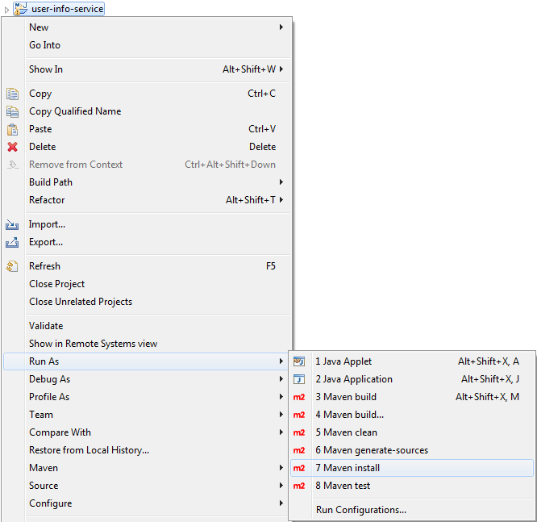

Maven install 操作不仅会完成打包工作，而且还会将该打包后的 bundle(user-info-service-0.0.1-SNAPSHOT.jar) 文件安装到 Maven 本地仓库中。

打包完成后，会在工程的 target 目录下看到打包好的文件。

##### 图 15\. 查看工程打包结果

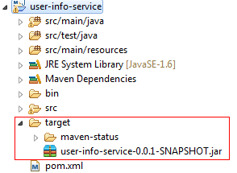

### 部署

ServiceMix 支持热部署，所以我们只需要将打包好的 jar 文件拷贝到 $SERVICEMIX\_HOME /deploy 目录下，然后跑 $SERVICEMIX\_HOME/bin/servicemix.bat 命令启动 ServiceMix 容器即可。

容器启动后在控制台输入 osgi:list 命令，如果看到如下所示信息代表启动 bundle 成功了。

##### 图 16\. 查看 OSGi bundle 部署是否成功

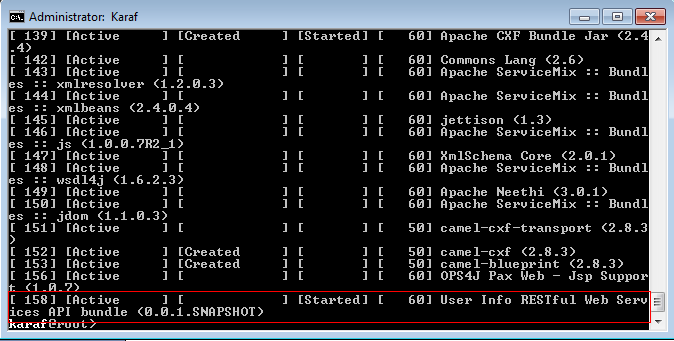

图中第四列代表 Spring 容器的状态，如果没有看到 Started , 请手动重启 : restart 158

其中 158 是 ServiceMix 容器分配给 bundle 的 ID. 运行 restart 命令时请替换成你环境中 bundle 的 ID

bundle 启动后，可以在浏览器中输入 `:http://<your_ip>:8181/cxf` 查看 Web Service 是否已经成功被发布。8181 是 servicemix 的默认端口。 如果看到下图显示的信息，代表服务已经发布成功。

##### 图 17\. 查看 RESTful Web services 是否成功发布

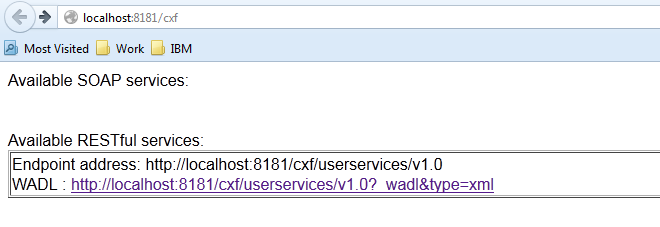

点击此链接就可以看到以下 RESTful Web services 对应的 WADL 描述文件 .

```
代码 12. WADL 描述文件源码

<application xmlns="http://wadl.dev.java.net/2009/02" xmlns:xs="http://www.w3.org/2001/XMLSchema">
<grammars>
<xs:schema xmlns:xs="http://www.w3.org/2001/XMLSchema" attributeFormDefault="unqualified" elementFormDefault="unqualified">
<xs:element name="User" type="user" />
<xs:element name="Users" type="users" />
<xs:complexType name="user">
<xs:sequence>
<xs:element minOccurs="0" name="userId" type="xs:string" />
<xs:element minOccurs="0" name="nickname" type="xs:string" />
<xs:element minOccurs="0" name="gender" type="xs:string" />
<xs:element minOccurs="0" name="registerDate" type="xs:string" />
</xs:sequence>
</xs:complexType>
<xs:complexType name="users">
<xs:sequence>
<xs:element maxOccurs="unbounded" minOccurs="0" ref="User" />
</xs:sequence>
</xs:complexType>
</xs:schema>
</grammars>
<resources base="http://localhost:8181/cxf/userservices/v1.0">
<resource path="/">
<resource path="adduser">
<method name="POST">
<request>
<representation mediaType="application/xml" />
</request>
<response>
<representation mediaType="application/xml" />
</response>
</method>
</resource>
<resource path="deleteuser/{userId}">
<param name="userId" style="template" type="xs:string" />
<method name="DELETE">
<request />
<response>
<representation mediaType="application/xml" />
</response>
</method>
</resource>
<resource path="getusers/startdate/{startDate}/enddate/{endDate}">
<param name="startDate" style="template" type="xs:string" />
<param name="endDate" style="template" type="xs:string" />
<method name="GET">
<request />
<response>
<representation mediaType="application/xml" />
</response>
</method>
</resource>
<resource path="searchuser/{userId}">
<param name="userId" style="template" type="xs:string" />
<method name="GET">
<request />
<response>
<representation mediaType="application/xml" />
</response>
</method>
</resource
<resource path="updateuser">
<method name="PUT">
<request>
<representation mediaType="application/xml" />
</request>
<response>
<representation mediaType="application/xml" />
</response>
</method>
</resource>
</resource>
</resources>
</application>

```

Show moreShow more icon

## 测试服务

Web services 的测试方式很多，如果用软件来测，那么 SOAPUI 和 Apache Jmeter 都是不错的选择。

基于 SOAPUI 和 Jmeter 不仅可以完成功能测试，而且还可以做性能测试，他们都可以启动设定数字的线程来模拟用户请求，并且可以计算请求的相应时间和处理能力。对于这两种工具，本文将不做赘述。

对于 GET 类型的方法，最方便的测试方法是通过浏览器发送请求，这样可以直接在浏览器页面中看到响应结果。例如我们想测试 getUsers 方法，可以在浏览器中通过以下地址测试，响应成功后，页面上会显示在 2010-1-1 到 2013-1-1 之间注册的用户。

##### 图 18\. 利用浏览器测试 GET 方法

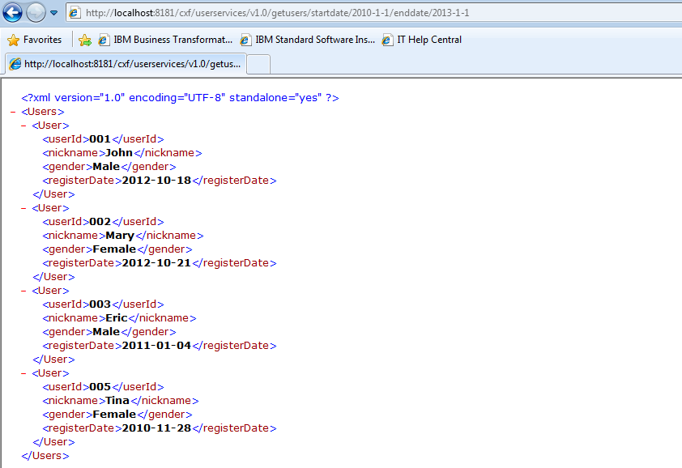

对于其他类型的方法我们将采用 CXF 提供的 Client API 来测试。虽然 Maven 有支持 Junit 运行的插件，但是这里并没有利用 Junit 框架做单元测试。因为本文的重点并不是 Junit 测试用例的编写。下面测试代码中，分别测试了增删改查的方法，可供读者参考。最后测试插入的数据会被删除。

```
public class UserServiceTestClient {

    private static final String SERVICE_URL = "http://localhost:8181/cxf/ userservices/v1.0";
    private static final String MIME_TYPE = "application/xml";
    private static String TEST_USER_ID = null;

    /**
     * @param args
     */
    public static void main(String[] args) {
        testAddUser();
        testGetUsers();
        testUpdateUser();
        testDeleteUser();
    }

    private static void testAddUser() {
        WebClient client = WebClient.create(SERVICE_URL);
        client.path("/adduser").accept(MIME_TYPE).type(MIME_TYPE);
        User user = new User();
        user.setUserId("00" + new Random().nextInt(10000));
        user.setGender("Male");
        user.setNickname("Who am I");
        user.setRegisterDate(new Date());
        User addedUser = client.post(user, User.class);
        System.out.println("added user id:" + addedUser.getUserId());
        assertResult(user.getUserId(),addedUser.getUserId());
        //set TEST_USER_ID to the one added, so that the user
        //which is added for testing can be deleted later
        TEST_USER_ID = addedUser.getUserId();
        System.out.println("Test addUser method successfully");
    }

    private static void testGetUsers() {
              WebClient client = WebClient.create(SERVICE_URL);
           //according to the tested data we insert,during this time period
           //only one person registered
           Users users = client.path("/getusers/startdate/2012-10-17/
                            enddate/2012-10-19")
                        .accept(MIME_TYPE).type(MIME_TYPE).get(Users.class);
           assertResult("1", String.valueOf(users.getUsers().size()));
              System.out.println("Test getUsers method successfully");
    }

    private static void testUpdateUser() {
        WebClient client = WebClient.create(SERVICE_URL);
        User user = new User();
            user.setUserId(TEST_USER_ID);
            user.setGender("Female");
            user.setNickname("Test Nickname");
            user.setRegisterDate(new Date());
            Response response  = client.path("/updateuser")
                       .accept(MIME_TYPE).type(MIME_TYPE).put(user);
        assertResult("200", String.valueOf(response.getStatus()));
            System.out.println("Test updateUser method successfully");
        }

    private static void testDeleteUser() {
        WebClient client = WebClient.create(SERVICE_URL);
            Response response = client.path("/deleteuser/" + TEST_USER_ID)
                             .accept(MIME_TYPE).type(MIME_TYPE).delete();
            assertResult("200", String.valueOf(response.getStatus()));
            System.out.println("Test getUsers method successfully");
    }

    private static void assertResult(String expectedResult , String realResult) {
        if (expectedResult != realResult && !expectedResult.equals(realResult)) {
            throw new RuntimeException("Test failed,excepted result:"
                  + expectedResult + " real returned result:" + realResult);
        }
    }
}

```

Show moreShow more icon

## 结束语

在实际开发中，CXF 还有很多高级特性可以帮助开发人员构建健壮的 web services 服务，本文所介绍的内容只是 CXF 的冰山一角，旨在尽量以通俗易懂的语言帮助读者快速入门。希望读者能通过本文的阅读了解如何通过 Maven 和 CXF 构建 RESTful web services。另外，希望本文中涉及到的关于 ServiceMix 容器和 OSGi 方面的知识能给正在构建 Java 动态模块化系统的技术人员些许启示。

## 下载示例代码

[DavClient.zip](http://www.ibm.com/developerWorks/cn/opensource/os-restfulwebservices/user-info-service.zip)