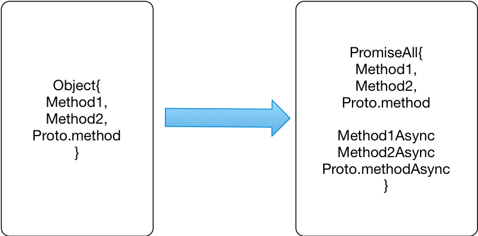
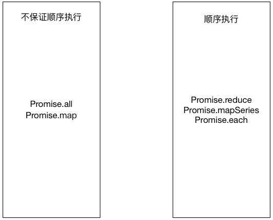

# 使用 Bluebird 开发异步的 JavaScript 程序
Bluebird 实战

**标签:** JavaScript,Web 开发

[原文链接](https://developer.ibm.com/zh/articles/wa-lo-bluebird-develop-asynchronous-javascript/)

虞里杉

发布: 2018-03-14

* * *

## JavaScript 异步编程

JavaScript 是一门单线程语言，被广泛的应用于浏览器端和页面 DOM 元素交互。自从 Node.js 横空出世，JavaScript 的领域由浏览器扩展到服务器端，变成了一种通用的计算机程序设计语言。那么，JavaScript 是怎么实现异步编程的呢？

### Callback 和 Callback 地狱

JavaScript 的异步是用 Callback 函数来实现的。Callback 函数可以接收外部程序传入的参数，但是没办法向外部传值，只能通过下一个 Callback 函数来使用。这使得当逻辑复杂的时候，Callback 嵌套变得很深。在这种情况下，参数互相影响，导致 bug 很多。这种嵌套被称为 Callback 地狱。

### Promise 和 Bluebird

Promise 是 JavaScript 中解决 Callback 地狱的方式，也被 ECMAScript 协会承认，固化为 ES6 语法的一部分。Bluebird 是早期 Promise 的一种实现，它提供了丰富的方法和语法糖，一方面降低了 Promise 的使用难度，一方面扩展了 Promise 的功能。下文中所有的方法来自于 Bluebird api 接口。

## Promise 基础

Promise 是一个承诺，表示一次操作的结果。和一般操作不同的是，Promise 对象不是实时的，而是在未来的某一时刻，会有返回。我们知道，JavaScript 在浏览器中是单线程调用的，但是有时我们又需要异步操作，例如访问文件，或者是调用 ajax。这时候，我们就需要 Promise 了。

以下清单 1 展示了 Promise 创建和使用过程。

- 首先，new Promise 可以传入两个函数，resolve 和 reject 方法。当 Promise 正确调用返回 resolve，并封装返回用户数据；当调用失败时，调用 reject 方法，并封装失败原因。
- 其次，Promise 的返回值只能在链式方法中调用。

##### 清单 1\. 创建 Promise 对象并返回

```
"use strict";
describe("Suite1", function(){
let Promise = require("bluebird");
it("Promise basic function arch", function(){
let promise = new Promise(function(resolve, reject){
let returnBody = true;
return returnBody?resolve(returnBody):reject(returnBody);
});
promise.then(function(data){
expect(data).toEqual(true);
});
});
});

```

Show moreShow more icon

### Promise resolve 和 reject 语法糖

以上创建 Promise 用的是 new 的完整方法。Bluebird 也提供 resolve 和 reject 的语法糖，可以方便的创建一个 Promise 对象，如清单二。

##### 清单 2\. Promise resolve 和 reject 语法糖的应用

```
it("Promise resolve and reject sugar", function(){
let resolvePromise = Promise.resolve(true);
let rejectPromise = Promise.resolve(false);
resolvePromise.then(function(data){
expect(data).toBeTruthy();
})
rejectPromise.then(function(data){
expect(data).toBeFalsy();
})
});

```

Show moreShow more icon

### Then 方法

Then 方法可以说是 Promise 中最基本的方法，它可以接受两个参数，第一个 onFulfilled handler，第二个 onRejected handler。一般来说这两个都是函数，在需要忽略任意一个 handler 的时候，可以用对象来代替。如清单 3 代码。

##### 清单 3\. 忽略 Then 中的完成函数

```
it("Then function with ignore fulFilled handler", function(){
let promise = new Promise(function(resolve, reject){
let returnBody = false;
return returnBody?resolve(returnBody):reject(returnBody);
});
promise.then({},function(error){
expect(error).toEqual(false);
});
});

```

Show moreShow more icon

### Promise 链

需要注意的是 Promise.then 方法返回的也是一个 Promise 对象，它同时也可以被下一个方法承接。类似于清单 4 中的伪代码。

##### 清单 4\. Promise 链式调用

```
Promise.then().then().then()

```

Show moreShow more icon

那么在后面的 then 中接受的对象是什么呢？Promise 中，then 中可以有一个 return 方法，这里的 return 返回的是下一个 then 方法中的参数对象。如清单 5 代码中分别返回了一个对象，和一个函数。Bluebird 会把返回值转化为 Promise 对象供下一个函数调用。

##### 清单 5\. Promise 函数中的返回值

```
it("Promise chain with return function", function(){
let promise = new Promise(function(resolve, reject){
let returnBody = true;
return returnBody?resolve(returnBody):reject(returnBody);
});
promise.then(function(data){
expect(data).toEqual(true);
return {
a:1,
b:2
};
}).then(function(data){
expect(data.a).toEqual(1);
expect(data.b).toEqual(2);
return function(){
return "string";
};
}).then(function(func){
expect(_.isFunction(func)).toBeTruthy();
let string = func();
expect(string).toEqual("string");
});
});

```

Show moreShow more icon

### Spread 方法

spread 方法适用于 Promise 对象返回值是数组的时候。与 then 方法相同，spread 方法返回一个 Promise 对象。如清单 6。

##### 清单 6\. Spread 方法的应用

```
it("Spread function basic without Promise.all", function(){
let promise = new Promise(function(resolve, reject){
let returnBody = [1,2,3];
return returnBody?resolve(returnBody):reject(returnBody);
});
promise.spread(function(data1,data2,data3){
expect(data1).toEqual(1);
expect(data2).toEqual(2);
expect(data3).toEqual(3);
});
});

```

Show moreShow more icon

或者可以用解析方法把参数展开，如清单 7 代码段，这里的 spread 方法和 then 方法的功能相同。

##### 清单 7\. Spread 和 Then 的调用

```
promise.spread(function(...data){
expect(data).toEqual([1,2,3]);
});
promise.then(function(data){
expect(data).toEqual([1,2,3]);
});

```

Show moreShow more icon

### Bind 函数

在 Promise 对象调用的时候，存在一个上下文对象，即 this 对象。一般情况下，我们不能访问到 this 对象，但是 Bind 函数可以帮助我们 bind 一个 this。这在链式调用传递参数的时候非常有用。如清单 8。需要说明的是，this 对象和 then 函数中的返回值没有关系。

##### 清单 8\. Bind 方法的使用

```
it("Bind function", function(){
Promise.bind({a:1}).then(function(){
this.b = 2;
}).then(function(){
this.c = 3;
return 6;
}).then(function(data){
expect(this.a+this.b+this.c).toEqual(data);
});
});

```

Show moreShow more icon

### Promise try 和 method

Promise try 和 Method 都是方便创建 Promise 的方法。我们可以观察到，在 then 的 return 方法中，可以返回一个数值，一个数组，甚至是一个函数，这些都可以被解析成 Promise 对象而被下一次链式调用。

Try 和 Method 同理，可以把含有 error 抛出的或有正常的返回值的函数，转化为 Promise 对象，方便之后调用。它俩的不同点是，try 返回的是 Promise 对象，method 返回的是一个函数，函数调用之后是 Promise 对象。如以下清单 9。

##### 清单 9\. Promise try 和 method 的区别

```
it("Error and method functions", function(){
Promise.try(function(){
throw new Error("this should be error");
}).then({}, function(err){
expect(err).toEqual(new Error("this should be error"));
});
Promise.method(function(){
return "message";
})().then(function(data){//注意这里的 method 函数返回之后要进行调用再执行 then 方法
expect(data).toBe("message");
})
});

```

Show moreShow more icon

### 链式调用中的 Promise 函数

Promise 函数有两种：

- 一种是用来创建 Promise 链的头对象的，例如 resolve 和 reject 方法；
- 另外一种只能在链式调用过程中使用，例如 then，spread 方法。

但是有一种函数，例如 bind，它既能创建头对象，也能在链式过程中调用，既有 Promise.bind()，又有.bind()。Bluebird 提供了大量这样的函数，我们在后面的容器管理中，可以具体看到。

## 异常处理

既然 Promise 只是一个允诺，那么就有失败的可能，在创建 Promise 对象的时候就有一个 reject 函数来表示异常；在 then 函数也有 onRejected handler 的处理。

看清单 10，Promise 的处理包含了 onRejected handler 和 catch 函数，当 then 方法中处理了异常之后，在 catch 中捕获不到异常。

##### 清单 10\. Then 的 onRejected 方法和 catch 函数

```
it("Promise with catch handler", function(){
let promise = new Promise(function(resolve, reject){
let returnBody = false;
return returnBody?resolve(true):reject(false);
});
promise.then({},function(data){
expect(data).toBe(false);
}).catch(function(e){
expect(true).toBe(false);
}).finally(function(){
expect(true).toBeTruthy();
});
});

```

Show moreShow more icon

Then 函数中的 OnRejected 和 catch 函数的区别有：

- 一旦 then 捕获到了异常，catch 函数中就捕获不到异常。
- catch 函数能捕获到这个 Promise chain 中的异常。then 只能捕获单个 Promise 中的异常。
- finally 函数保证在这个 Promise 链执行之后都会被执行，一般用于关闭在 Promise 中的资源。

## 资源管理

我们知道 finally 函数经常用来关闭资源，但是在 Promise 调用复杂时，尤其是多个调用同时进行（例如使用 Promise.all 进行一组调用的时候）。我们不好识别哪些需要关闭，这时候就能用到 Promise.using 函数了。

### Promise.using

我们可以用 disposer 函数把一个 Promise 对象转化成 disposer 对象供 Promise.using 调用。在 disposer 中定义资源关闭逻辑，那么在 Promise.using 调用的过程中，会自动执行 disposer 的资源关闭逻辑。如清单 11，会在 then 方法执行前，打印出 resource closed 字样。

##### 清单 11\. Promise using 资源管理

```
it("Promise using function call", function(){
let f = function(){
return Promise.resolve(true).disposer(function(){
console.log("resource closed");
});
};
Promise.using(f(), function(data){
expect(data).toBeTruthy();
}).then(function(){
console.log("resouce cannot be used");
})
});

```

Show moreShow more icon

## 测试函数

在原型链执行过程中，如果我们要监测 Promise 的返回状态我们可以使用测试函数。Bluebird 提供的测试函数有以下四种。

- IsFulFilled
- IsRejected
- isPending
- isCancelled

配合使用的获得返回结果和进行错误处理的函数有 value 和 reason。如清单 12。

##### 清单 12\. 测试函数样例

```
if(p.isFulFilled()){
console.log(p.value());
}
if(p.isRejected()){
console.log(p.reason());
}

```

Show moreShow more icon

## Promisification

Bluebird 提供了很多方法来帮助我们把现有的库函数由 Callback 的方式，转化为 Promise 的方式，这叫做 Promise 化。最常见的，例如 Node 中默认提供的 fs 文件操作句柄，我们可以通过 Promise.promiseifyAll(fs) 的方式，把 fs 的调用，通过 Promise 返回。

##### 清单 13\. Promise 化 Nodejs 中的 fs

```
"use strict";
describe("Suite3", function(){
let Promise = require("bluebird");
let fs = require("fs");
Promise.promisifyAll(fs);//这里 fs 被改写了，增加了 Async 后缀的方法
it("Collection usage", function(){
fs.readFileAsync('./spec/t2Spec.js', 'utf8').then(function(data){
console.log(data);
});
});
});

```

Show moreShow more icon

需要注意的是，fs 是一个 singleton 对象，可以简单的用 PromiseAll 来封装，调用 fs 的函数时，需要加上一个 Async 的后缀。通过查看 Bluebird 中 Promise 的源码，可以发现 PromiseAll 方法是通过给对象添加方法的方式来封装对象的原有方法。另外，PromisifyAll 的返回值也是加工过的对象。

##### 图 1\. PromiseAll 转化 Object 中原有方法



##### 清单 14\. 使用 PromisifyAll 方法定义对象

```
it("PromisifyAll test", function(){
let obj = {
func1: function(data, callback1, callback2){
callback1(null, data + "1");
callback2("error", data + "2");
}
}
Promise.promisifyAll(obj);
obj.func1Async("alert").then(function(data){
expect(data).toBe("alert1");
}, function(err){
expect(false).toBeTruthy();
});
});

```

Show moreShow more icon

这里我们为了测试 PromisifyAll 的原理，设计了两个 callback 方法。一般来说，异步执行的函数只有一个 callback 方法。

- PromiseAll 中 Then 方法的返回和定义的第一个 callback 方法有关，我们这里是 Callback1。
- Then 中的 fulFilled 和 Reject 函数使用的方法只和 func1 中调用的参数有关系，和 callback1 的实现没有关系。
- Func1 中，函数必须放在数据传参后面，作为尾参数。
- callback 方法中的第一个参数是 error 信息。
- callback1 和 callback2 在 obj 的 func1 中必须按照定义顺序调用，例如先执行 callback2(null,data) 再执行 callback1(null, data) 是不被 Bluebird 允许的。

##### 清单 15\. 使用 PromisifyAll 方法定义原型链

```
it("PromiseAll prototype test", function(){
function test(){
this.ab = "new";
}
test.prototype.ab = function(param, cb){
cb(null, param);
}
let test2 = Promise.promisifyAll(test.prototype);
test2.abAsync("test").then(function(data){
expect(data).toBe("test");
});
});

```

Show moreShow more icon

对于某些库，实现的时候是用原型来封装方法，我们可以使用手动的方式来使方法 Promise 化。这时候需要改写原型的名称，如清单 15 中，用的是 test2 来表示改写后的原型方法。

另外，Promise 默认是在方法上加上 Async 后缀，可以使用 suffix 参数来手动指定后缀名。如清单 16。

##### 清单 16\. 指定 Promisify 中的后缀参数

```
var fs = Promise.promisifyAll(require("fs"), {suffix: "MySuffix"});
fs.readFileMySuffix(...).then(...)

```

Show moreShow more icon

## 容器管理

### Promise.all 和 Promise.join

Promise 容器中，最常见的是 Promise.all 方法，表明当所有的 Promise 对象数组中的 Promise 都完成的时候，返回 Promise 对象。当有一个 Promise 失败的时候，执行 then 的 reject 方法，返回第一个错误的 Promise 对象内容。

##### 清单 17\. Promise all 的使用

```
it("Promise.all usage", function(){
let obj = {
func1: function(data, cb){
if(data>8){
cb("error",data);
}else{
cb(null, data);
}
}
}
Promise.promisifyAll(obj);
let promises = [];
for(let i = 1; i < 10; ++i){
promises.push(obj.func1Async(i));
}
Promise.all(promises).then(function(){
expect(true).toBeFalsy();
}, function(){
expect(true).toBeTruthy();
});
});

```

Show moreShow more icon

和 Promise all 方法一样，join 也是表示当一组数据全部完成时候的返回方法。与 all 不同的是，join 一般适用于静态的一组数据，即已知长度的一组 Promise。

### Promise.any 和 Promise.some

Promise.any 表示有第一个 Promise 成功执行则执行 then 的完成方法。

##### 清单 18\. Promise any 的使用

```
it("Promise.any usage", function(){
let obj = {
func1: function(data, cb){
if(data <= 3){
cb(data, data);
}else{
cb(null, data);
}
}
}
Promise.promisifyAll(obj);
let promises = [];
for(let i = 1; i < 10; ++i){
promises.push(obj.func1Async(i));
}
Promise.any(promises).then(function(data){
expect(data).toBe(4);
}, function(err){
expect(true).toBeFalsy();
});
});

```

Show moreShow more icon

Promise.some 和 any 不同的是，可以指定前几个 Promise 成功执行 then 的完成方法。一般和 spread 配合使用。

##### 清单 19\. Promise some 的使用

```
Promise.some([
ping("ns1.example.com"),
ping("ns2.example.com"),
ping("ns3.example.com"),
ping("ns4.example.com")
], 2).spread(function(first, second) {
console.log(first, second);
});

```

Show moreShow more icon

### Promise.map 和 Promise filter

Promise map 和 filter 可以传入一个迭代器函数并进行处理。和 then 方法相似，不要求在函数中返回 Promise。Bluebird 可以帮助转化 Promise 对象。

如清单 20，map 的迭代器函数中可以获得 map 中的返回值；而 filter 的迭代器中过滤符合条件的 Promise（通过 return 方法返回值判断），在 then 函数中处理。

##### 清单 20\. Promise map 和 filter 使用

```
it("Promise map and filter", function(){
let f1 = Promise.method(function(){
return "f1"
});
let f2 = Promise.method(function(){
return "f2";
});
Promise.map([f1(),f2()], function(data){
console.log(data);//打印出 f1, f2
}).then(function(){
console.log("done");
});
Promise.filter([f1(),f2()], function(data, index){
return index>0;
}).then(function(data){
console.log(data);//打印出[ 'f2' ]
});
});

```

Show moreShow more icon

### 顺序执行

在一组容器中的 Promise 对象执行过程中，像 all 和 map 这样的方法，Promise 对象之间没有要求同步，如果强烈要求 Promise 对象之间的执行顺顺序，可以采用顺序容器，如图 2 中，顺序执行的方法。

##### 图 2\. Promise 中非顺序执行和顺序执行的方法分类



## 结束语

- Bluebird 解决了 callback 地狱的问题，它把 callback 方法的调用，抽象成 Promise 对象之间的链式调用。
- Bluebird 提供了大量创建 Promise 对象的方法。而且能把已有的服务封装成 Promise 对象返回类的服务。使之进行异步调用。
- Bluebird 提供的容器有保证顺序执行的和不保证顺序执行的两种。
- 本文通过对于 Bluebird 的 api 的解读，帮助读者理解 Bluebird 的使用方法。