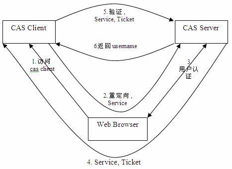
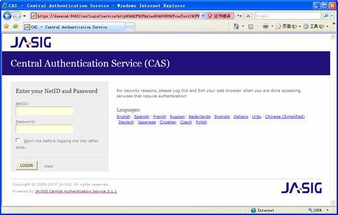
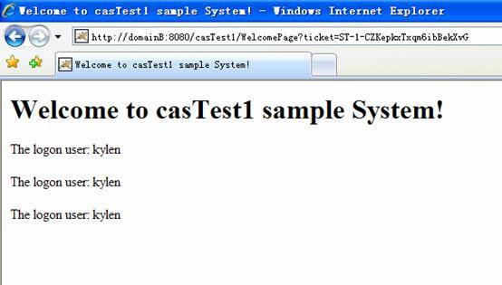
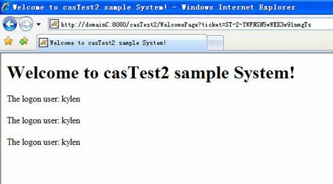

# 使用 CAS 在 Tomcat 中实现单点登录
学习如何使用 CAS 在 Tomcat 中实现单点登录

**标签:** Web 开发

[原文链接](https://developer.ibm.com/zh/articles/os-cn-cas/)

张 涛, 王 秉坤

发布: 2008-04-10

* * *

## CAS 介绍

CAS 是 Yale 大学发起的一个开源项目，旨在为 Web 应用系统提供一种可靠的单点登录方法，CAS 在 2004 年 12 月正式成为 JA-SIG 的一个项目。CAS 具有以下特点：

- 开源的企业级单点登录解决方案。
- CAS Server 为需要独立部署的 Web 应用。
- CAS Client 支持非常多的客户端(这里指单点登录系统中的各个 Web 应用)，包括 Java, .Net, PHP, Perl, Apache, uPortal, Ruby 等。

### CAS 原理和协议

从结构上看，CAS 包含两个部分： CAS Server 和 CAS Client。CAS Server 需要独立部署，主要负责对用户的认证工作；CAS Client 负责处理对客户端受保护资源的访问请求，需要登录时，重定向到 CAS Server。图1 是 CAS 最基本的协议过程：

图 1\. CAS 基础协议


CAS Client 与受保护的客户端应用部署在一起，以 Filter 方式保护受保护的资源。对于访问受保护资源的每个 Web 请求，CAS Client 会分析该请求的 Http 请求中是否包含 Service Ticket，如果没有，则说明当前用户尚未登录，于是将请求重定向到指定好的 CAS Server 登录地址，并传递 Service （也就是要访问的目的资源地址），以便登录成功过后转回该地址。用户在第 3 步中输入认证信息，如果登录成功，CAS Server 随机产生一个相当长度、唯一、不可伪造的 Service Ticket，并缓存以待将来验证，之后系统自动重定向到 Service 所在地址，并为客户端浏览器设置一个 Ticket Granted Cookie（TGC），CAS Client 在拿到 Service 和新产生的 Ticket 过后，在第 5，6 步中与 CAS Server 进行身份合适，以确保 Service Ticket 的合法性。

在该协议中，所有与 CAS 的交互均采用 SSL 协议，确保，ST 和 TGC 的安全性。协议工作过程中会有 2 次重定向的过程，但是 CAS Client 与 CAS Server 之间进行 Ticket 验证的过程对于用户是透明的。

另外，CAS 协议中还提供了 Proxy （代理）模式，以适应更加高级、复杂的应用场景，具体介绍可以参考 CAS 官方网站上的相关文档。

### 准备工作

本文中的例子以 tomcat5.5 为例进行讲解，下载地址：

[http://tomcat.apache.org/download-55.cgi](http://tomcat.apache.org/download-55.cgi)

到 CAS 官方网站下载 CAS Server 和 Client，地址分别为：

- [http://www.ja-sig.org/downloads/cas/cas-server-3.1.1-release.zip](http://www.ja-sig.org/downloads/cas/cas-server-3.1.1-release.zip)
- [http://www.ja-sig.org/downloads/cas-clients/cas-client-java-2.1.1.zip](http://www.ja-sig.org/downloads/cas-clients/cas-client-java-2.1.1.zip)

## 部署 CAS Server

CAS Server 是一套基于 Java 实现的服务，该服务以一个 Java Web Application 单独部署在与 servlet2.3 兼容的 Web 服务器上，另外，由于 Client 与 CAS Server 之间的交互采用 Https 协议，因此部署 CAS Server 的服务器还需要支持 SSL 协议。当 SSL 配置成功过后，像普通 Web 应用一样将 CAS Server 部署在服务器上就能正常运行了，不过，在真正使用之前，还需要扩展验证用户的接口。

在 Tomcat 上部署一个完整的 CAS Server 主要按照以下几个步骤：

1. 配置 Tomcat 使用 Https 协议。

    如果希望 Tomcat 支持 Https，主要的工作是配置 SSL 协议，其配置过程和配置方法可以参考 Tomcat 的相关文档。不过在生成证书的过程中，会有需要用到主机名的地方，CAS 建议不要使用 IP 地址，而要使用机器名或域名。

2. 部署 CAS Server。

    CAS Server 是一个 Web 应用包，将前面下载的 cas-server-3.1.1-release.zip 解开，把其中的 cas-server-webapp-3.1.1.war 拷贝到 tomcat的 webapps 目录，并更名为 cas.war。由于前面已配置好 tomcat 的 https 协议，可以重新启动 tomcat，然后访问：`https://localhost:8443/cas`，如果能出现正常的 CAS 登录页面，则说明 CAS Server 已经部署成功。


虽然 CAS Server 已经部署成功，但这只是一个缺省的实现，在实际使用的时候，还需要根据实际概况做扩展和定制，最主要的是扩展认证 (Authentication) 接口和 CAS Server 的界面。

### 扩展认证接口

CAS Server 负责完成对用户的认证工作，它会处理登录时的用户凭证 (Credentials) 信息，用户名/密码对是最常见的凭证信息。CAS Server 可能需要到数据库检索一条用户帐号信息，也可能在 XML 文件中检索用户名/密码，还可能通过 LDAP Server 获取等，在这种情况下，CAS 提供了一种灵活但统一的接口和实现分离的方式，实际使用中 CAS 采用哪种方式认证是与 CAS 的基本协议分离开的，用户可以根据认证的接口去定制和扩展。

#### 扩展 AuthenticationHandler

CAS 提供扩展认证的核心是 AuthenticationHandler 接口，该接口定义如清单 1 下：

##### 清单 1\. AuthenticationHandler定义

```
public interface AuthenticationHandler {
    /**
     * Method to determine if the credentials supplied are valid.
     * @param credentials The credentials to validate.
     * @return true if valid, return false otherwise.
     * @throws AuthenticationException An AuthenticationException can contain
     * details about why a particular authentication request failed.
     */
    boolean authenticate(Credentials credentials) throws AuthenticationException;
/**
     * Method to check if the handler knows how to handle the credentials
     * provided. It may be a simple check of the Credentials class or something
     * more complicated such as scanning the information contained in the
     * Credentials object.
     * @param credentials The credentials to check.
     * @return true if the handler supports the Credentials, false othewrise.
     */
    boolean supports(Credentials credentials);
}

```

Show moreShow more icon

该接口定义了 2 个需要实现的方法，supports ()方法用于检查所给的包含认证信息的Credentials 是否受当前 AuthenticationHandler 支持；而 authenticate() 方法则担当验证认证信息的任务，这也是需要扩展的主要方法，根据情况与存储合法认证信息的介质进行交互，返回 boolean 类型的值，true 表示验证通过，false 表示验证失败。

CAS3中还提供了对AuthenticationHandler 接口的一些抽象实现，比如，可能需要在执行authenticate() 方法前后执行某些其他操作，那么可以让自己的认证类扩展自清单 2 中的抽象类：

##### 清单 2\. AbstractPreAndPostProcessingAuthenticationHandler定义

```
public abstract class AbstractPreAndPostProcessingAuthenticationHandler
                                           implements AuthenticateHandler{
    protected Log log = LogFactory.getLog(this.getClass());
    protected boolean preAuthenticate(final Credentials credentials) {
        return true;
    }
    protected boolean postAuthenticate(final Credentials credentials,
        final boolean authenticated) {
        return authenticated;
    }
    public final boolean authenticate(final Credentials credentials)
        throws AuthenticationException {
        if (!preAuthenticate(credentials)) {
            return false;
        }
        final boolean authenticated = doAuthentication(credentials);
        return postAuthenticate(credentials, authenticated);
    }
    protected abstract boolean doAuthentication(final Credentials credentials)
throws AuthenticationException;
}

```

Show moreShow more icon

AbstractPreAndPostProcessingAuthenticationHandler 类新定义了 preAuthenticate() 方法和 postAuthenticate() 方法，而实际的认证工作交由 doAuthentication() 方法来执行。因此，如果需要在认证前后执行一些额外的操作，可以分别扩展 preAuthenticate()和 ppstAuthenticate() 方法，而 doAuthentication() 取代 authenticate() 成为了子类必须要实现的方法。

由于实际运用中，最常用的是用户名和密码方式的认证，CAS3 提供了针对该方式的实现，如清单 3 所示：

##### 清单 3\. AbstractUsernamePasswordAuthenticationHandler 定义

```
public abstract class AbstractUsernamePasswordAuthenticationHandler extends
                       AbstractPreAndPostProcessingAuthenticationHandler{
...
protected final boolean doAuthentication(final Credentials credentials)
throws AuthenticationException {
return authenticateUsernamePasswordInternal((UsernamePasswordCredentials) credentials);
}
protected abstract boolean authenticateUsernamePasswordInternal(
        final UsernamePasswordCredentials credentials) throws AuthenticationException;
protected final PasswordEncoder getPasswordEncoder() {
return this.passwordEncoder;
}
public final void setPasswordEncoder(final PasswordEncoder passwordEncoder) {
this.passwordEncoder = passwordEncoder;
    }
...
}

```

Show moreShow more icon

基于用户名密码的认证方式可直接扩展自 AbstractUsernamePasswordAuthenticationHandler，验证用户名密码的具体操作通过实现 authenticateUsernamePasswordInternal() 方法达到，另外，通常情况下密码会是加密过的，setPasswordEncoder() 方法就是用于指定适当的加密器。

从以上清单中可以看到，doAuthentication() 方法的参数是 Credentials 类型，这是包含用户认证信息的一个接口，对于用户名密码类型的认证信息，可以直接使用 UsernamePasswordCredentials，如果需要扩展其他类型的认证信息，需要实现Credentials接口，并且实现相应的 CredentialsToPrincipalResolver 接口，其具体方法可以借鉴 UsernamePasswordCredentials 和 UsernamePasswordCredentialsToPrincipalResolver。

### JDBC 认证方法

用户的认证信息通常保存在数据库中，因此本文就选用这种情况来介绍。将前面下载的 cas-server-3.1.1-release.zip 包解开后，在 modules 目录下可以找到包 cas-server-support-jdbc-3.1.1.jar，其提供了通过 JDBC 连接数据库进行验证的缺省实现，基于该包的支持，我们只需要做一些配置工作即可实现 JDBC 认证。

JDBC 认证方法支持多种数据库，DB2, Oracle, MySql, Microsoft SQL Server 等均可，这里以 DB2 作为例子介绍。并且假设DB2数据库名： CASTest，数据库登录用户名： db2user，数据库登录密码： db2password，用户信息表为： userTable，该表包含用户名和密码的两个数据项分别为 userName 和 password。

#### 第 1 步. 配置 DataStore

打开文件 %CATALINA\_HOME%/webapps/cas/WEB-INF/deployerConfigContext.xml，添加一个新的 bean 标签，对于 DB2，内容如清单 4 所示：

##### 清单 4\. 配置 DataStore

```
<bean id="casDataSource" class="org.apache.commons.dbcp.BasicDataSource">
     <property name="driverClassName">
          <value>com.ibm.db2.jcc.DB2Driver</value>
     </property>
     <property name="url">
          <value>jdbc:db2://9.125.65.134:50000/CASTest</value>
     </property>
     <property name="username">
          <value>db2user</value>
     </property>
     <property name="password">
          <value>db2password</value>
     </property>
</bean>

```

Show moreShow more icon

其中 id 属性为该 DataStore 的标识，在后面配置 AuthenticationHandler 会被引用，另外，需要提供 DataStore 所必需的数据库驱动程序、连接地址、数据库登录用户名以及登录密码。

#### 第 2 步. 配置 AuthenticationHandler

在 cas-server-support-jdbc-3.1.1.jar 包中，提供了 3 个基于 JDBC 的 AuthenticationHandler，分别为 BindModeSearchDatabaseAuthenticationHandler, QueryDatabaseAuthenticationHandler, SearchModeSearchDatabaseAuthenticationHandler。其中 BindModeSearchDatabaseAuthenticationHandler 是用所给的用户名和密码去建立数据库连接，根据连接建立是否成功来判断验证成功与否；QueryDatabaseAuthenticationHandler 通过配置一个 SQL 语句查出密码，与所给密码匹配；SearchModeSearchDatabaseAuthenticationHandler 通过配置存放用户验证信息的表、用户名字段和密码字段，构造查询语句来验证。

使用哪个 AuthenticationHandler，需要在 deployerConfigContext.xml 中设置，默认情况下，CAS 使用一个简单的 username=password 的 AuthenticationHandler，在文件中可以找到如下一行：<bean class=”org.jasig.cas.authentication.handler.support.SimpleTestUsernamePassword

AuthenticationHandler” />，我们可以将其注释掉，换成我们希望的一个 AuthenticationHandler，比如，使用QueryDatabaseAuthenticationHandler 或 SearchModeSearchDatabaseAuthenticationHandler 可以分别选取清单 5 或清单 6 的配置。

##### 清单 5\. 使用 QueryDatabaseAuthenticationHandler

```
<bean class="org.jasig.cas.adaptors.jdbc.QueryDatabaseAuthenticationHandler">
<property name="dataSource" ref=" casDataSource " />
<property name="sql"
       value="select password from userTable where lower(userName) = lower(?)" />
</bean>

```

Show moreShow more icon

##### 清单 6\. 使用 SearchModeSearchDatabaseAuthenticationHandler

```
<bean id="SearchModeSearchDatabaseAuthenticationHandler"
      class="org.jasig.cas.adaptors.jdbc.SearchModeSearchDatabaseAuthenticationHandler"
      abstract="false" singleton="true" lazy-init="default"
                       autowire="default" dependency-check="default">
<property  name="tableUsers">
<value>userTable</value>
</property>
<property name="fieldUser">
<value>userName</value>
</property>
<property name="fieldPassword">
<value>password</value>
</property>
<property name="dataSource" ref=" casDataSource " />
</bean>

```

Show moreShow more icon

另外，由于存放在数据库中的密码通常是加密过的，所以 AuthenticationHandler 在匹配时需要知道使用的加密方法，在 deployerConfigContext.xml 文件中我们可以为具体的 AuthenticationHandler 类配置一个 property，指定加密器类，比如对于 QueryDatabaseAuthenticationHandler，可以修改如清单7所示：

##### 清单 7\. 添加 passwordEncoder

```
<bean class="org.jasig.cas.adaptors.jdbc.QueryDatabaseAuthenticationHandler">
<property name="dataSource" ref=" casDataSource " />
<property name="sql"
           value="select password from userTable where lower(userName) = lower(?)" />
<property  name="passwordEncoder"  ref="myPasswordEncoder"/>
</bean>

```

Show moreShow more icon

其中 myPasswordEncoder 是对清单 8 中设置的实际加密器类的引用：

##### 清单 8\. 指定具体加密器类

```
<bean id="passwordEncoder"
            class="org.jasig.cas.authentication.handler.MyPasswordEncoder"/>

```

Show moreShow more icon

这里 MyPasswordEncoder 是根据实际情况自己定义的加密器，实现 PasswordEncoder 接口及其 encode() 方法。

#### 第 3 步. 部署依赖包

在以上配置完成以后，需要拷贝几个依赖的包到 cas 应用下，包括：

- 将 cas-server-support-jdbc-3.1.1.jar 拷贝到 %CATALINA\_HOME%/webapps/cas/ WEB-INF/lib 目录。
- 数据库驱动，由于这里使用 DB2，将 %DB2\_HOME%/java 目录下的 db2java.zip （更名为 db2java.jar）, db2jcc.jar, db2jcc\_license\_cu.jar 拷贝到 %CATALINA\_HOME%/webapps/cas/WEB-INF/lib 目录。对于其他数据库，同样将相应数据库驱动程序拷贝到该目录。
- DataStore 依赖于 commons-collections-3.2.jar, commons-dbcp-1.2.1.jar, commons-pool-1.3.jar，需要到 apache 网站的 Commons 项目下载以上 3 个包放进 %CATALINA\_HOME%/webapps/cas/WEB-INF/lib 目录。

### 扩展 CAS Server 界面

CAS 提供了 2 套默认的页面，分别为” default ”和” simple ”，分别在目录” cas/WEB-INF/view/jsp/default ”和” cas/WEB-INF/view/jsp/simple ”下。其中 default 是一个稍微复杂一些的页面，使用 CSS，而 simple 则是能让 CAS 正常工作的最简化的页面。

在部署 CAS 之前，我们可能需要定制一套新的 CAS Server 页面，添加一些个性化的内容。最简单的方法就是拷贝一份 default 或 simple 文件到” cas/WEB-INF/view/jsp ”目录下，比如命名为 newUI，接下来是实现和修改必要的页面，有 4 个页面是必须的：

- casConfirmView.jsp: 当用户选择了” warn ”时会看到的确认界面
- casGenericSuccess.jsp: 在用户成功通过认证而没有目的Service时会看到的界面
- casLoginView.jsp: 当需要用户提供认证信息时会出现的界面
- casLogoutView.jsp: 当用户结束 CAS 单点登录系统会话时出现的界面

CAS 的页面采用 Spring 框架编写，对于不熟悉 Spring 的使用者，在修改之前需要熟悉该框架。

页面定制完过后，还需要做一些配置从而让 CAS 找到新的页面，拷贝” cas/WEB-INF/classes/default\_views.properties ”，重命名为” cas/WEB-INF/classes/ newUI\_views.properties ”，并修改其中所有的值到相应新页面。最后是更新” cas/WEB-INF/cas-servlet.xml ”文件中的 viewResolver，将其修改为如清单 9 中的内容。

##### 清单 9\. 指定 CAS 页面

```
<bean id="viewResolver"
     class="org.springframework.web.servlet.view.ResourceBundleViewResolver" p:order="0">
    <property name="basenames">
        <list>
            <value>${cas.viewResolver.basename}</value>
            <value> newUI_views</value>
        </list>
    </property>
</bean>

```

Show moreShow more icon

## 部署客户端应用

单点登录的目的是为了让多个相关联的应用使用相同的登录过程，本文在讲解过程中构造 2个简单的应用，分别以 casTest1 和 casTest2 来作为示例，它们均只有一个页面，显示欢迎信息和当前登录用户名。这 2 个应用使用同一套登录信息，并且只有登录过的用户才能访问，通过本文的配置，实现单点登录，即只需登录一次就可以访问这两个应用。

### 与 CAS Server 建立信任关系

假设 CAS Server 单独部署在一台机器 A，而客户端应用部署在机器 B 上，由于客户端应用与 CAS Server 的通信采用 SSL，因此，需要在 A 与 B 的 JRE 之间建立信任关系。

首先与 A 机器一样，要生成 B 机器上的证书，配置 Tomcat 的 SSL 协议。其次，下载 InstallCert.java，运行 “java InstallCert compA:8443” 命令，并且在接下来出现的询问中输入 1。这样，就将 A 添加到了 B 的 trust store 中。如果多个客户端应用分别部署在不同机器上，那么每个机器都需要与 CAS Server 所在机器建立信任关系。

### 配置 CAS Filter

准备好应用 casTest1 和 casTest2 过后，分别部署在 B 和 C 机器上，由于 casTest1 和casTest2，B 和 C 完全等同，我们以 casTest1 在 B 机器上的配置做介绍，假设 A 和 B 的域名分别为 domainA 和 domainB。

将 cas-client-java-2.1.1.zip 改名为 cas-client-java-2.1.1.jar 并拷贝到 casTest1/WEB-INF/lib目录下，修改 web.xml 文件，添加 CAS Filter，如清单 10 所示：

##### 清单 10\. 添加 CAS Filter

```
<web-app>
...
<filter>
    <filter-name>CAS Filter</filter-name>
    <filter-class>edu.yale.its.tp.cas.client.filter.CASFilter</filter-class>
    <init-param>
      <param-name>edu.yale.its.tp.cas.client.filter.loginUrl</param-name>
      <param-value>https://domainA:8443/cas/login</param-value>
    </init-param>
    <init-param>
      <param-name>edu.yale.its.tp.cas.client.filter.validateUrl</param-name>
      <param-value>https://domainA:8443/cas/serviceValidate</param-value>
    </init-param>
    <init-param>
      <param-name>edu.yale.its.tp.cas.client.filter.serverName</param-name>
      <param-value>domainB:8080</param-value>
    </init-param>
</filter>
<filter-mapping>
    <filter-name>CAS Filter</filter-name>
    <url-pattern>/protected-pattern/*</url-pattern>
</filter-mapping>
...
</web-app>

```

Show moreShow more icon

对于所有访问满足 casTest1/protected-pattern/ 路径的资源时，都要求到 CAS Server 登录，如果需要整个 casTest1 均受保护，可以将 url-pattern 指定为”/\*”。

从清单 10 可以看到，我们可以为 CASFilter 指定一些参数，并且有些是必须的， [表 1\. CASFilter 必需的参数](#表-1-casfilter-必需的参数) 和 [表格 2\. CASFilter 可选参数](#表格-2-casfilter-可选参数) 中分别是必需和可选的参数：

##### 表 1\. CASFilter 必需的参数

参数名作用edu.yale.its.tp.cas.client.filter.loginUrl指定 CAS 提供登录页面的 URLedu.yale.its.tp.cas.client.filter.validateUrl指定 CAS 提供 service ticket 或 proxy ticket 验证服务的 URLedu.yale.its.tp.cas.client.filter.serverName指定客户端的域名和端口，是指客户端应用所在机器而不是 CAS Server 所在机器，该参数或 serviceUrl 至少有一个必须指定edu.yale.its.tp.cas.client.filter.serviceUrl该参数指定过后将覆盖 serverName 参数，成为登录成功过后重定向的目的地址

##### 表 2\. CASFilter 可选参数

参数名作用edu.yale.its.tp.cas.client.filter.proxyCallbackUrl用于当前应用需要作为其他服务的代理(proxy)时获取 Proxy Granting Ticket 的地址edu.yale.its.tp.cas.client.filter.authorizedProxy用于允许当前应用从代理处获取 proxy tickets，该参数接受以空格分隔开的多个 proxy URLs，但实际使用只需要一个成功即可。当指定该参数过后，需要修改 validateUrl 到 proxyValidate，而不再是 serviceValidateedu.yale.its.tp.cas.client.filter.renew如果指定为 true，那么受保护的资源每次被访问时均要求用户重新进行验证，而不管之前是否已经通过edu.yale.its.tp.cas.client.filter.wrapRequest如果指定为 true，那么 CASFilter 将重新包装 HttpRequest,并且使 getRemoteUser() 方法返回当前登录用户的用户名edu.yale.its.tp.cas.client.filter.gateway指定 gateway 属性

### 传递登录用户名

CAS 在登录成功过后，会给浏览器回传 Cookie，设置新的到的 Service Ticket。但客户端应用拥有各自的 Session，我们要怎么在各个应用中获取当前登录用户的用户名呢？CAS Client 的 Filter 已经做好了处理，在登录成功后，就可以直接从 Session 的属性中获取，如清单 11 所示：

##### 清单 11\. 在 Java 中通过 Session 获取登录用户名

```
// 以下两者都可以
session.getAttribute(CASFilter.CAS_FILTER_USER);
session.getAttribute("edu.yale.its.tp.cas.client.filter.user");

```

Show moreShow more icon

在 JSTL 中获取用户名的方法如清单 12 所示：

##### 清单 12\. 通过 JSTL 获取登录用户名

```
<c:out value="${sessionScope[CAS:'edu.yale.its.tp.cas.client.filter.user']}"/>

```

Show moreShow more icon

另外，CAS 提供了一个 CASFilterRequestWrapper 类，该类继承自HttpServletRequestWrapper，主要是重写了 getRemoteUser() 方法，只要在前面配置 CASFilter 的时候为其设置” edu.yale.its.tp.cas.client.filter.wrapRequest ”参数为 true，就可以通过 getRemoteUser（） 方法来获取登录用户名，具体方法如清单 13 所示：

##### 清单 13\. 通过 CASFilterRequestWrapper 获取登录用户名

```
CASFilterRequestWrapper  reqWrapper=new CASFilterRequestWrapper(request);
out.println("The logon user:" + reqWrapper.getRemoteUser());

```

Show moreShow more icon

## 效果

在 casTest1 和 casTest2 中，都有一个简单 Servlet 作为欢迎页面 WelcomPage，且该页面必须登录过后才能访问，页面代码如清单 14 所示：

##### 清单 14\. WelcomePage 页面代码

```
public class WelcomePage extends HttpServlet {
public void doGet(HttpServletRequest request, HttpServletResponse response)
throws IOException, ServletException
{
    response.setContentType("text/html");
    PrintWriter out = response.getWriter();
    out.println("<html>");
    out.println("<head>");
    out.println("<title>Welcome to casTest2 sample System!</title>");
    out.println("</head>");
    out.println("<body>");
    out.println("<h1>Welcome to casTest1 sample System!</h1>");
    CASFilterRequestWrapper  reqWrapper=new CASFilterRequestWrapper(request);
    out.println("<p>The logon user:" + reqWrapper.getRemoteUser() + "</p>");
    HttpSession session=request.getSession();
    out.println("<p>The logon user:" +
                   session.getAttribute(CASFilter.CAS_FILTER_USER)  + "</p>");
    out.println("<p>The logon user:" +
         session.getAttribute("edu.yale.its.tp.cas.client.filter.user") + "</p>");
    out.println("</body>");
    out.println("</html>");
    }
}

```

Show moreShow more icon

在上面所有配置结束过后，分别在 A， B， C上启动 cas， casTest1 和 casTest2，按照下面步骤来访问 casTest1 和 casTest2：

1. 打开浏览器，访问 `http://domainB:8080/casTest1/WelcomePage`，浏览器会弹出安全提示，接受后即转到 CAS 的登录页面，如图 2 所示：

    图 2\. CAS 登录页面
    

2. 登录成功后，再重定向到 casTest1 的 WelcomePage 页面，如 [图 3\. 登录后访问 casTest1 的效果](#图-3-登录后访问-castest1-的效果) 所示：

    图 3\. 登录后访问 casTest1 的效果

    

    可以看到 [图 3\. 登录后访问 casTest1 的效果](#图-3-登录后访问-castest1-的效果) 中地址栏里的地址多出了一个 ticket 参数，这就是 CAS 分配给当前应用的 ST(Service Ticket)。

3. 再在同一个浏览器的地址栏中输入 `http://domainC:8080/casTest2/WelcomePage` ，系统不再提示用户登录，而直接出现如图 4 所示的页面，并且显示在 casTest1 中已经登录过的用户。

    图 4\. 在 casTest1 中登录过后访问 casTest2 的效果

    

4. 重新打开一个浏览器窗口，先输入 `http://domainC:8080/casTest2/WelcomePage`，系统要求登录，在登录成功过后，正确显示 casTest2 的页面。之后再在地址栏重新输入 `http://domainB:8080/casTest1/WelcomePage`，会直接显示 casTest1 的页面而无需再次登录。


## 结束语

本文介绍了 CAS 单点登录解决方案的原理，并结合实例讲解了在 Tomcat 中使用 CAS 的配置、部署方法以及效果。CAS 是作为开源单点登录解决方案的一个不错选择，更多的使用细节可以参考 CAS 官方网站。