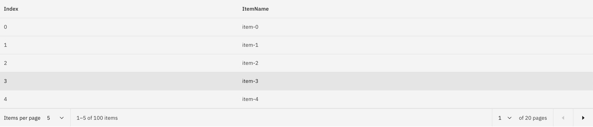
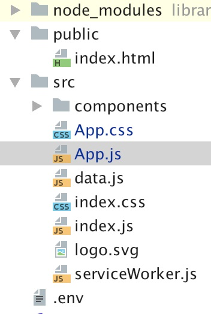

# 使用 Carbon 分页组件实现数据分页
通过示例展示如何使用 Carbon 分页组件

**标签:** JavaScript,Web 开发

[原文链接](https://developer.ibm.com/zh/articles/wa-using-carbon-for-pagination/)

彭 利

发布: 2020-01-13

* * *

## Carbon 简介

Web 组件化和复用是目前所有前端开发人员追求的东西。Carbon 是 IBM 开源的 Web 组件库。将几乎所有常用 Web 功能封装成组件，可以重用和扩展。组件遵循了 IBM 独特的设计标准和风格，提供了统一的界面风格样式，并在此基础上支持了当前流行框架的不同实现, 比如 React、Angular、Vanilla 和 Vue，只要开发者所使用的是这三种框架之一，就可以使用相应的组件。 除此之外, 它还介绍了页面设计思想和设计工具。您还可以在现有的组件上进行扩展来增加额外的功能。

Carbon 提供的 Web 组件，包括下拉列表框（Dropdown），可折叠段落（Accordion），表格、对话框等等（您可以在 [Carbon Design 网站](https://github.com/carbon-design-system/carbon) 上得到所有组件列表），目前广泛应用于 [IBM Cloud](https://cloud.ibm.com/registration?cm_sp=ibmdev-_-developer-articles-_-cloudreg) 和 IBM 云上各种服务的前端窗口。

本文将通过示例展示如何使用 Carbon React 组件库中的分页（Pagination）组件来开发一个简单的分页功能，抛砖引玉，从而带您步入 Carbon 的大门。由于分页展示常常伴随着表格的生成, 所以同时也展示了表格相关的组件的使用。

如果您想了解更多其他组件的使用方式，可以 [在 GitHub 上查看更多 Carbon 文档](https://github.com/carbon-design-system/carbon)。

## Pagination 组件

相信很多前端开发人员使用过 Bootstrap 的分页组件。相对于 Bootstap，Carbon 的分页组件需要更少的代码，更简单容易上手。对比一下，例如：

Bootstrap 分页：

```
<nav aria-label="Page navigation">
<ul class="pagination">
    <li>
      <a href="#" aria-label="Previous">
        <span aria-hidden="true">«</span>
      </a>
    </li>
    <li><a href="#">1</a></li>
    <li><a href="#">2</a></li>
    <li>
      <a href="#" aria-label="Next">
        <span aria-hidden="true">»</span>
      </a>
    </li>
</ul>
</nav>

```

Show moreShow more icon

Carbon 分页：

```
<pagination totalItems=100 … ></pagination>

```

Show moreShow more icon

我们可以看到，Bootsrap 提供的分页组件封装比较简单、粒度不大，需要更多的 HTML 代码去实现。（更多关于 Bootstrap 的分页组件，请参考 [Bootstrap 分页组件](https://v3.bootcss.com/components/#pagination)。）而 Carbon 分页组件封装粒度大、使用简单。对比下来，Carbon 的组件使用更简洁，也更易复用而不用担心代码冲突。

## 示例分页界面

我们先来看看示例分页界面，如图 1 所示:

##### 图 1\. 数据分页的效果图



上图是对 100 条数据进行分页，每页显示 5 条数据，一共有 20 页。您也可以调整每页显示的条目数，或跳到指定的页数，页面将会自动刷新。

下面我们来运行示例并看看如何使用 Carbon 分页组件以及如何调用表格组建来实现这个效果。

## 运行示例

1. 下载 [源代码压缩文件](https://github.com/penzhan8451/carbon-react-sample), 并解压到本地目录. 例如: `/Download/app`。
2. 安装程序所需要的依赖的包，进入解压后的目录 `/Download/app`，并运行：

    `Npm install`

    或者如果您已经安装 yarn 管理器，也可以运行：

    `Yarn`

3. 运行下面命令启动应用：

    `npm start`

    或者运行：

    `yarn start`


React 将自动创建一个本地 HTTP 服务器。启动后的输出结果类似如下:

```
Compiled successfully!

You can now view carbon-react-sample in the browser.

http://localhost:3000/

Note that the development build is not optimized.
To create a production build, use yarn build.

```

Show moreShow more icon

然后按照提示在浏览器中打开给出的链接 `http://localhost:3000/`。

React 应用的目录结构如下所示：

##### 图 2\. 目录结构



下面是目录中相关内容的解释：

- `Public/index.html`: 应用的根节点。整个应用的 HTML 结构体将会挂载到根节点下。
- `src/index.js`：应用启动文件。主要将应用生成的 HTM 元素挂载到根节点。
- `src/data.js`: 生成应用示例数据。
- `src/App.js`: 包含如何使用组件 Pagination 代码。`index.js` 文件会将 `App.js` 生成的 HTM 元素挂载到根元素下。
- `src/App.css` 和 `index.css`: 如果想获得对界面更多的控制，可以在此存放自定义 CSS 样式。
- `src/components`：包含了表格组件的使用示例。在这里我们新创建了一个 React 组件，对 Carbon 表格组件进行了调用。

接下来我们主要关注 `App.js` 和 `src/components/ItemsTable.js` 两个文件。首先，`App.js` 定义了名为 App 的新 React 组件（继承了 `React.Component`），并且将分页需要的参数放到了 `state` 对象中，以此跟踪变量的变化。如果 `state` 中相关的变量改变了，React 将自动刷新页面，显示数据更新后的视图。关于 `state` 对象和视图之间的关系, 请查看 [React](https://reactjs.org/) 网站。

## 使用分页组件

为了使用 Carbon 的分页组件，我们需要导入它和示例数据以及表格组件，如清单 1 所示：

##### 清单 1\. 导入分页组和示例数据以及表格组件

```
import React, { Component } from "react";
import datasource from './data';
import ItemTable from './components/ItemsTable';
import {Pagination} from 'carbon-components-react';
import  'carbon-components/css/carbon-components.css'
import './App.css';

class App extends Component {
constructor(props) {
    super(props);

    this.state = {
      items: datasource(),
      // totalItems: 0,
      currentPageSize: 10,
      firstRowIndex: 0,
    };

}

```

Show moreShow more icon

在 App 组件中定义一个 `state` 对象来存放参数的初始值。其中：

- `Items`：数组，包含了全部示例数据。
- `currentPageSize`：定义了当前每页显示几条数据。
- `firstRowIndex`：定义了翻页时获取数据位置。
- `totalItems`：示例数据的数量，定义在渲染方法（`render`）中。

接下来在 `render` 方法中定义应用视图，并将渲染结果显示在页面上，如清单 2 所示：

##### 清单 2\. 定义应用视图

```
render() {
var rows = this.state.items;
var totalItems = rows.length;
return (
      <>
          <div className={'bx--row'}>
              <div className={'bx--col-lg-12'}>
            <ItemTable rows={rows.slice(this.state.firstRowIndex,
                this.state.firstRowIndex + this.state.currentPageSize)}>
            </ItemTable>
              </div>
          </div>
          <div className={'bx--row'}>
              <div className={'bx--col-lg-12'}>
                <Pagination
                    totalItems={totalItems}
                    backwardText="Previous page"
                    forwardText="Next page"
                    pageSize={this.state.currentPageSize}
                    pageSizes={[5, 10, 25, 100]}
                    itemsPerPageText="Items per page"
                    onChange={({ page, pageSize }) => {
                      if (pageSize !== this.state.currentPageSize) {
                        this.setState({ currentPageSize: pageSize });
                      }
                      this.setState({ firstRowIndex: pageSize * (page - 1) });
                      this.forceUpdate();
                    }}
                />
              </div>
          </div>
      </>
);
}

```

Show moreShow more icon

可以看到在 `render` 方法中采用了分页组件 `<Pagination …></Pagination>` 并传入了相关的动态参数 `firstRowIndex`，`currentPageSize`，`totalItems`。当其中任何一个值发生了变化时，表格视图也将相应的发生变化。

这里说明一下事件响应函数 `onChange` 方法。当点击翻页按钮，或者选择跳入的页面，或者改变每页显示记录数的时候，`onChange` 方法将被触发，重新计算读取数据的起始位置，读取的数量，并且重新渲染页面。

这样一个数据分页就完成了。真正实现分页功能只需要一个 `pagination` 标签就可以达到目的。

## 调用表格组件

我们还看到，由于分页常常伴随着表格的使用。因此在渲染方法中使用了表格组件。为了使代码更清晰，我们来创建一个新的 React 组件 ItemTable 来调用表格组件。

##### 清单 3\. 创建 ItemsTable.js

```
import React from 'react'
import {TableContainer, Table, TableHead, TableRow, TableBody, TableCell} from "carbon-components-react";

const ItemsTable = ({rows}) => {

    const cells = (rows) => {
        return rows.map((r, i) =>{
            return (
            <TableRow key={i}>
                <TableCell>{i}</TableCell>
                <TableCell>{r}</TableCell>
            </TableRow>
            )
        })
    };

return (
      <TableContainer title={""} description={""}>
          <Table className="table table-striped">
              <TableHead>
                  <TableRow>
                      <TableCell key={1}>Index</TableCell>
                      <TableCell key={2}>ItemName</TableCell>
                  </TableRow>
              </TableHead>
              <TableBody>
                  {cells(rows)}
              </TableBody>
          </Table>

      </TableContainer>
)
};

export default ItemsTable;

```

Show moreShow more icon

代码说明：

1. 定义新的组件 ItemsTable（React 组件的定义既可以用 `class` 的方式，也可以用函数方式定义，详细信息请参考 React 文档），参数是数据数组。
2. 在组件的渲染方法 `render` 中，使用了 Carbon 的表格组件。它包括：
    - `TableContainer`：表格容器。
    - `Table`：表格，包含表头，表体和表行。
    - `TableHead`：表头。
    - `TableBody`：表主体部分.
    - `TableRow`：表行。每条数据将会生成一个表行对象。
3. 定义内部方法 Cells。针对每条数据，将会创建一个表行对象。

查看 Carbon 组件文档，可以对表格进行更多定制和控制。

您可能注意到，在所有上面的代码示例中，`render` 返回的结构体都像这样：

```
return (
<div >
    …
</div>
)

```

Show moreShow more icon

这种语法称之为 JSX，一种 JavaScript 的语法糖。JSX 详细信息, 可以查看 [JSX](https://reactjs.org/docs/glossary.html#jsx) 语法说明。

## 下载示例代码

下载本文完整的示例代码：

[获得代码](https://github.com/penzhan8451/carbon-react-sample)

## 结束语

在整个 IBM Cloud 的外观上，您可以处处看到 Carbon 组件使用的影子。在 IBM 内部，新的 Cloud 项目也都采用 Carbon 组件作为 UI 的标准。随着时间的推移，相信有越来越多的开发者加入 Carbon 组件推广的阵营，能更深入理解和使用 Carbon 组件。同时也给 Carbon 的继续前行的方向提供宝贵的意见，无论如何，开发者的需求才是 Carbon 唯一关心的中心、前进的动力。事实上，Carbon GitHub 代码仓库非常非常活跃，有超过 200 多位的贡献者。

希望 Carbon 将来在功能上越来越丰富，使用上越来越简单，使前端开发不再是开发者的拦路虎，而是享受轻易实现漂亮的页面所带来的快乐。