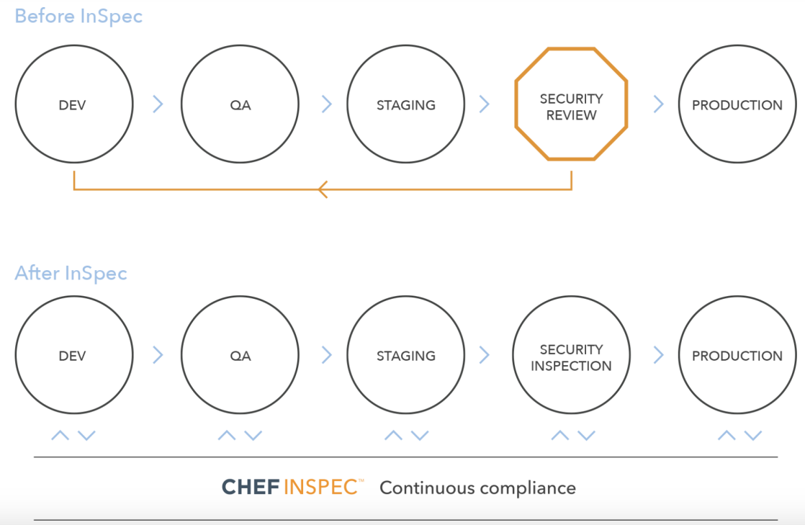
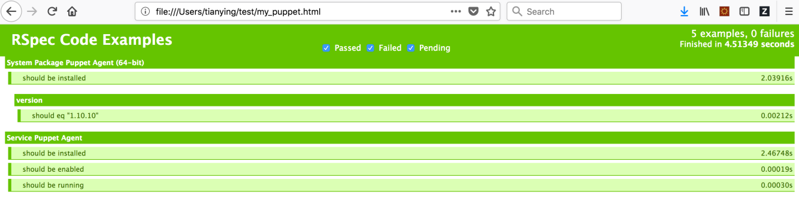

# 使用 Chef Inspec 自动化测试云基础设施合规化
在开发的每个阶段评估合规性，确保尽早捕获问题

**标签:** 云计算

[原文链接](https://developer.ibm.com/zh/articles/cl-lo-automate-testing-cloud-infrastructure-compliance-with-chef-inspec/)

田 颖

发布: 2019-07-24

* * *

## 合规化测试介绍

合规化测试（Compliance Testing）也称为一致性测试，是一种非功能性测试技术，用于验证开发的系统是否满足组织规定的标准。为了确保成果符合要求，有时会在每个组织中建立一个监管机构和合规专家组。该委员会检查开发团队是否符合组织的标准。团队进行分析以检查标准是否得到了适当的执行和实施。监管委员会也同时致力于提高标准，从而提高质量。合规化测试的目的是确定开发和维护过程符合规定的方法；确保开发的每个阶段的可交付成果是否符合标准，程序和指南；评估项目文档以检查完整性和合理性。

## Chef Inspec 介绍

持续自动化厂商 Chef 发布了 Inspec2.0，这是 Chef 新版本的开源工具，该工具能够让 DevOps 与跨功能的应用、基础设施和安全团队以代码和资产的形式表述安全和合规规则，并且在整个软件交付生命周期中纠正合规的问题。

传统的合规化测试通常会放在产品开发的最后阶段；而使用 Chef InSpec，测试团队可以在开发的每个阶段评估合规性，确保尽早捕获问题，并且不会重新出现问题，从而实现更快，更安全的发布。

##### 图 1\. 使用 Chef InSpec 前后对比



InSpec 2.0 提供了对 Amazon Web Services（AWS）和 Microsoft Azure 的云配置支持，该特性能够让用户根据自定义的合规策略，使用 API 来编写针对云资源的合规规则。新版本的工具包含了对三十多种新资源的支持，允许用户为通用的应用和配置文件编写合规规则。它提供了一组强大的预定义资源，降低了使用基本脚本或编程语言实现自动化测试用例的需求。

InSpec 是使用 Ruby 编程语言构建的，可以运行在 Windows 和很多 Linux 分发版本中，也能运行在 Docker 容器上。运行测试的基本 InSpec 工具是开源 chefdk（CHEF 开发工具包）的一部分。 因此，它完全独立于 CHEF 服务器或 CHEF 客户端。从 [https://www.inspec.io/downloads/](https://www.inspec.io/downloads/) 上下载安装即可。

## Inspec Profile

InSpec test 被称为 control，多个 control 可以分组到 profile 中。例如我们要测试目标机器上面的 puppet agent 的配置，首先需要创建一个名叫 `my_puppet` 的 Inspec Profile：

```
$ cd ~/test/
$ inspec init profile my_puppet
Create new profile at /Users/tianying/test/my_puppet
• Create directory libraries
• Create file README.md
• Create directory controls
• Create file controls/example.rb
• Create file inspec.yml

```

Show moreShow more icon

让我们用 `tree` 命令来看一下这个 profile 是如何组织的：

```
$ tree my_puppet/
my_puppet/
├── README.md
├── controls
│   └── example.rb
├── inspec.yml
└── libraries

```

Show moreShow more icon

controls 目录包含实现 InSpec 测试的文件。

inspec.yml 提供当前 profile 的元数据或信息。元数据包括 profile 的描述、作者、版权和版本。

libraries 目录包含资源扩展。资源扩展使用户可以定义自己的资源类型。

## 编写测试用例脚本

例如我们要验证 puppet agent 在目标机器上是否已经安装，并且相应的服务是否已经启动，我们需要在 controls 目录下面新建一个 ruby 文件命名为 test\_puppet.rb，编写如下代码：

```
title 'Check installation of Puppet agent on Windows'

control 'TC-01-puppet-1.0' do
impact 1.0
title 'Confirm Puppet agent package installation'
desc 'Correct Puppet agent package installed'
describe package('Puppet Agent (64-bit)') do
    it { should be_installed }
    its('version') { should eq '1.10.10' }
end
end

control 'TC-01-puppet-2.0' do
impact 1.0
title 'Confirm Puppet agent is running as a service'
desc 'After successful Puppet installation, service is registered and running'
describe service('Puppet Agent') do
    it { should be_installed }
    it { should be_enabled }
    it { should be_running }
end
end

```

Show moreShow more icon

## 运行 Inspec

一般来讲，InSpec 是通过 CLI 来运行的，并且在目标或要监控的目标系统上远程运行。在扫描 Linux 系统时，InSpec 会使用 SSH 协议，在扫描 Windows 系统时，会使用 WinRM 协议。InSpec 不需要在目标系统上安装软件。运行上述代码：

```
$ cd ~/test/
$ inspec exec my_puppet -t winrm://Administrator@10.135.*.* --password '*****'

Profile: InSpec Profile (my_puppet)
Version: 0.1.0
Target:  winrm:// Administrator @http://10.135.*.*:5985/wsman:3389

✔  TC-01-puppet-1.0: Confirm Puppet agent package installation
✔  System Package Puppet Agent (64-bit) should be installed
✔  System Package Puppet Agent (64-bit) version should eq "1.10.10"
✔  TC-01-puppet-2.0: Confirm Puppet agent is running as a service
✔  Service Puppet Agent should be installed
✔  Service Puppet Agent should be enabled
✔  Service Puppet Agent should be running

Profile Summary: 2 successful controls, 0 control failures, 0 controls skipped
Test Summary: 5 successful, 0 failures, 0 skipped

```

Show moreShow more icon

有如下几种方式来运行 Inspec：

##### 表 1\. 运行 Inspec 的不同方式

**执行类别****命令****描述**执行位于本地的 profile进入 profile 所在的目录，然后执行命令：inspec exec my\_puppet用于验证本地机器配置的合规性执行位于 url 的 profileinspec exec [https://github.com/dev-sec/ssh-baseline](https://github.com/dev-sec/ssh-baseline)从 github 获取 profile 来验证本地机器配置的合规性通过 chef supermarketinspec supermarket profiles inspec supermarket exec dev-sec /windows-baseline获取 supermarket 中 profile 的列表，然后运行其中的 profile 来验证本地机器配置的合规性在远程 Linux 机器上运行 profileinspec exec my\_puppet -t ssh://root@10.135. _._ –password **\***用于验证远程 Linux 机器配置的合规性在远程 Windows 机器上运行 profileinspec exec my\_puppet -t winrm://root@10.135. _._ –password **\***用于验证远程 Windows 机器配置的合规性同时执行多个 profileinspec exec my\_puppet [https://github.com/dev-sec/ssh-baseline](https://github.com/dev-sec/ssh-baseline)一个命令执行多个 profile在 CLI Shell 里执行inspec shell inspec> help resource //获取可用的测试资源列表进入 Shell 命令行模式。直接在控制台执行 Inspec 测试命令。

## 动态断言

上面的例子中 puppet agent 的版本我们是硬编码进去的，随着测试用例的增加，这种硬编码方式会导致代码增多而且不利于维护，因此会选择分离测试数据和测试脚本。测试数据可以在单独的文件中去配置。具体做法：

- profile 下面创建一个 files 目录，用来存放测试数据的文件，格式可以是 JSON 或者 YAML。

```
mkdir -p my_puppet/files/

```

Show moreShow more icon

- 创建文件 params.yml，内容如下：

```
version: 1.10.10

```

Show moreShow more icon

- 修改 control 脚本来读取测试数据：

```
puppet_params = yaml(content: inspec.profile.file('params.yml')).params
required_version = puppet_params['version']

control 'TC-01-puppet-1.0' do
impact 1.0
title 'Confirm Puppet agent package installation'
desc 'Correct Puppet agent package installed'
describe package('Puppet Agent (64-bit)') do
    it { should be_installed }
    its('version') { should eq required_version }
end
end

```

Show moreShow more icon

## 测试报告生成

InSpec 的结果可以导出为 JUnit 格式，以便于集成到像 Jenkins 这样的持续交付工具中，集中收集和分析输出；也可以生成 JSON 和 HTML 格式的输出。

HTML 格式输出如下：

##### 图 2 . HTML 格式输出



## 结束语

InSpec 帮助我们统一了合规、安全和 DevOps 团队，改进了审计，减少了员工的工作时间，并且在整个过程中消除了重复的工作和数据。它让这些团队能够更好地控制合规策略，让业务单元更加积极地维护自己的环境。最为关键的是，它允许我们持续地监控合规的审计情况，维持想要的状态并消除节点之间的变更漂移。

## 参考资源

- 访问 [Chef 官网](https://www.chef.io/products/chef-inspec/)，以了解更多关于 Chef Inspec 产品的信息；
- 访问 [Chef Inspec 官网](https://www.inspec.io/)， 以了解 Chef Inspec 的安装，用户手册以及文档；
- 访问 [Cloud Security Automation in Inspec2.0](https://www.infoq.com/news/2018/02/chef-cloud-security-inspec-2.0)，以了解其功能；
- 访问 [Chef Supermarket](https://supermarket.chef.io/tools)，以了解 Inspec 预先定义好的 profile。