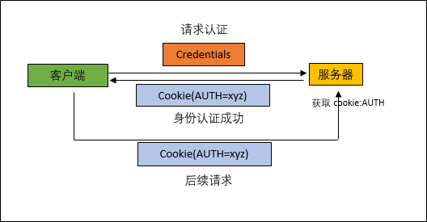
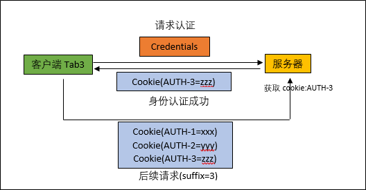

# 使用 Cookie 实现公有云会话跟踪
浏览器中 Tab 级别会话跟踪实践

**标签:** Web 开发

[原文链接](https://developer.ibm.com/zh/articles/wa-session-tracking-using-cookies/)

王 建军

发布: 2018-08-28

* * *

## 问题描述

软件即服务 (Software as a Service) 公有云平台 (如 IBM Cloud) 运营商提供各种各样的服务，用户可以根据自己的需要选择相应的服务。当用户需要某一种服务时，需要登陆服务提供商的网站，创建这一服务的一个实例（instance）来作为服务实体。与此同时，服务提供商会为这个实例创建一个凭证（credential）作为其他 SDK 方式连接的凭证。同一用户可以拥有多个实例来作为不同服务的实体。用户登录以后，客户端存储了服务器端生成的特定 Cookie 做为身份认证。网站认证大多采用单点登录（Single Sign On，简称 SSO）技术，而特定的网站存储在同一浏览器的身份 Cookie 只有一份。如果同一用户在同一个浏览器的多个 Tab 下操作不同的实例，那么服务器端无法区分请求的主体是哪一个实例，从而导致两个实例的操作在服务器端混为一起。

##### 免费试用 IBM Cloud

利用 [IBM Cloud Lite](https://cloud.ibm.com/registration?cm_sp=ibmdev-_-developer-articles-_-cloudreg) 快速轻松地构建您的下一个应用程序。您的免费帐户从不过期，而且您会获得 256 MB 的 Cloud Foundry 运行时内存和包含 Kubernetes 集群的 2 GB 存储空间。 [了解所有细节](https://www.ibm.com/cloud/free/) 并确定如何开始。

## 解决思路

由于 Cookie 在同一浏览器中是共享的，所以服务器端无法通过 Cookie 区分不同 Tab 中的会话。而且，前端页面无法用脚本的方式获取浏览器 Tab 标识。因此，要跟踪 Tab 级别会话，就需要一个能在 Tab 级别跟踪会话的令牌（Token）保存于 Cookie 中。

Cookie 在客户端以键值对（Key-Value）的形式来存储，一个 Cookie 就是一对 Key-Value。通常经过身份验证之后，Web 网站为会话生成一个固定 Key 的 Cookie，并存储在客户端。客户端在发起新的请求时将此 Cookie 一并传送给服务器端用于身份识别。

为了彻底的分离多 Tab 下的会话，在服务器端生成会话的时候，可以为每一个浏览器 Tab 生成一个不同 Key 的 Cookie，并将此 Key 记录在返回的 HTML 页面中。HTML 页面是 Tab 隔离的。此客户端向服务器发起新的请求时，客户端将预存在 HTML 中的 Key 传给服务器端。服务器端获取到客户端传递的 Key 值之后，就可以获取到对应的身份 Cookie。

本文将综合多种会话跟踪技术解决不同 Tab 之间跟踪不同会话的问题。

## 会话跟踪技术

会话跟踪是 Web 应用的基础技术之一。目前主流的会话跟踪技术有以下四种：

1. **URL 重写** ：URL 是互联网统一资源定位符。URL 重写的技术是将一段附加数据添加到 URL 的路径上。通常附加数据包含会话 ID。会话 ID 是服务器端存储特定会话对象的标识。
2. **隐藏表单 域** ：将会话的 ID 存储在表单的隐藏元素中。用户提交表单时，会话的 ID 一起被提交到服务器端。
3. **Cookie** ：Cookie 是以键值对的结构存储在浏览器端的一段文本信息。服务器端可以将特定的信息，例如会话 ID，包含在用户请求的响应中返回给浏览器端。在新的请求中，浏览器会自动携带存储的 Cookie 提交到服务器端。
4. **Session** ：HTTP 协议是无状态的，同一系统的不同资源只允许有对应权限的用户访问。用户登录之后，客户端和服务器端需要维持会话。通常服务器端会提供会话管理的机制，将不同客户的身份信息存储在不同的区域。浏览器向服务器发起请求时，需要提供会话 ID，这样服务器端就可以获取到对应客户端的身份，返回请求的资源。

在本问题的解决方案中同时使用了以上四种技术。

## 实现过程

目前浏览器无法提供区分 Tab 的方法，即无法使用浏览器端接口获取到 Tab 的标识。Web 网站使用 SSO 的技术，服务器在认证用户的身份之后，通常会给客户端返回一个固定 Key 值、用于身份识别的 Cookie (此处涉及到会话跟踪技术三)。在此浏览器后续的请求中，客户端（浏览器）会将此 Cookie 提供给服务器端用于身份识别，如图 1 所示。由此可见，无论是客户端还是服务器端都未曾考虑同一账户多 Tab 下的不同会话的跟踪问题。

##### 图 1\. 固定 Cookie Key 认证过程

解决这个问题首先需要使用不同的 Key 作为身份标识提供给客户端。过去 SSO 产生的 Token 存储在客户端类似于这样的格式 `AUTH=xyz` 。其中 `AUTH` 是 Key， `xyz` 是 Value。由于这是身份认证的信息，Value 一般是加密存储的，防止恶意盗取会话信息。

为了识别不同 Tab 下的会话，新的 Token 存储的方式需要不同的 Key，例如： `AUTH-456784567345=xyz` 。 `AUTH` 是这个身份认证 Cookie 标识的前缀,而数字串 `456784567345` 则是服务器端随机生成的一个 Long 型数字作为后缀，用来区分 Tab 身份。

如果用户在三个 Tab 下对同一个网站登录了不同的身份，那么会出现三个 Token，而过去只有一个。那么在任何一个 Tab 下操作，请求发送到服务器端的时候，客户端都会将此三个 Token 带到请求里，服务器需要知道到底哪一个 Key 才是当前 Tab 的身份信息，如图 2 所示：

##### 图 2\. 可变后缀 Cookie Key 的认证过程

因此，客户端需求在发送请求的时候告诉服务器端身份标识的后缀。完成登录认证的时候，服务器端返回给客户端主页面的时候，服务器端可以将此后缀隐藏在某个子页面中（HTML 代码是 Tab 隔离的，此处涉及到会话跟踪技术二）。代码如： `<input type="hiden" name="auth-suffix" id="suffix" value="" />` 。此子页面一直存在于会话登录中，例如网页的导航栏。大多数的客户端请求有两种，一种是 GET 请求，一类是 POST 请求：

- 对于 GET 请求，需要客户端脚本将请求的 URL 后添加后缀的参数（此处涉及到会话跟踪技术一），例如： `https://www.hostname.com/app?suffix=456784567345`
- 对于 POST 请求，可以将后缀放在 POST 请求的 Parameter 参数里。JQuery 代码： `params={"suffix": "456784567345"}; $.ajax({type:"POST", url:https://hostname/url, data:params, datatype:"json", success:()=>{}});`

如此一来，服务器端就可以获取浏览器某个 Tab 的后缀，近而取得相应的 Cookie 来获取这一 Tab 的身份信息了。

为了提高安全性，此实现方式还需要服务器端实现会话管理（此处涉及到会话跟踪技术四）。

如果会话管理服务器只有一个节点，可以使用简单的 Map 进行管理。Map 的 Key 是 Session ID，Map 的 Value 是 Session 对象。首先，服务器端从浏览器端提交的请求中获取 Cookie 的后缀参数值，进而得到 Cookie 的 Key (固定前缀+后缀)。由于 Cookie 的存储结构也是 Map，服务器端即可获取到对应 Cookie 的 Value。解密之后，得到 Cookie 中存储的服务器端 Session ID。服务器端通过 Session ID 获取到 Session 对象，得到存储在 Session 对象中的用户信息。

如果会话管理服务器是集群的组织结构，那么可以采用支持集群的 Redis 等框架实现服务器会话管理服务。如果读者对 Redis 技术有兴趣，可自行查阅相关文章资料，本文不再详述。

## 结束语

大部分的网站并没有支持 Tab 级会话跟踪。然而这一技术在公有云的普及下，变得越来越重要。虽然用户可以通过启动多浏览器的进程来规避此问题，但是多浏览器的操作也会给用户带来需要切换浏览器和耗费更多的计算机资源的弊端。