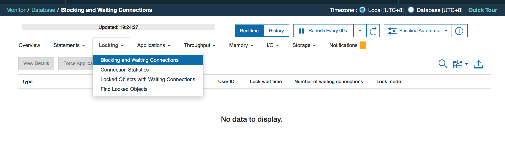
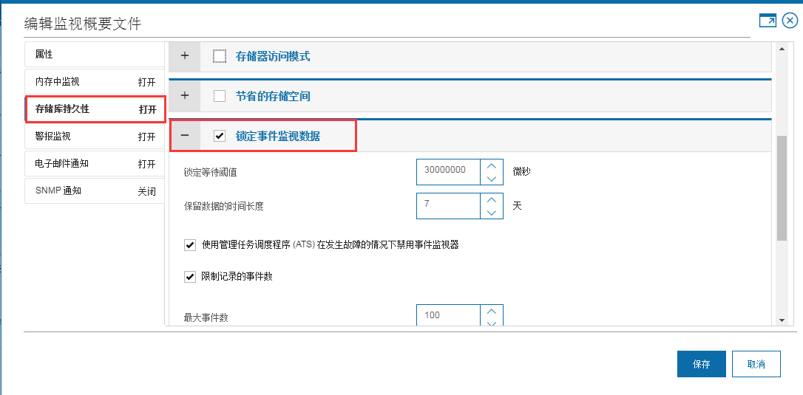
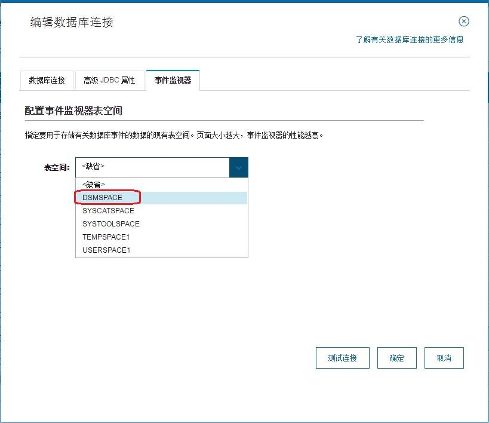
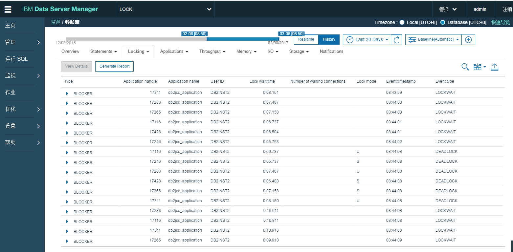
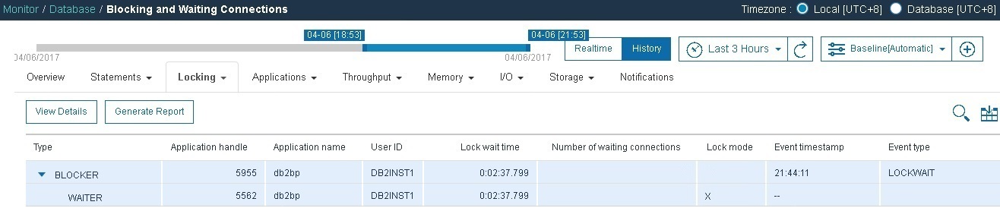

# 使用 Data Server Manager 浏览并分析历史锁定事务
上手 Data Server Manager

**标签:** 分析

[原文链接](https://developer.ibm.com/zh/articles/ba-cn-data-server-manager-lock/)

李 爽, 梁 佩佩

发布: 2017-05-10

* * *

## 锁定事件监视器 (Lock Event Monitor)

为了在多用户并发时保证数据的一致性，数据库管理程序通过锁来实现数据库并发控制。一旦获取了锁 ，在该事务终止把释放锁前 ，其他事务不可以使用被锁定的数据资源。

在实际生成环境中，随着应用程序数量的增多及复杂性的提高，诊断和排除锁定争用情况的工作相当复杂而且耗时。为了简化此任务，DB2 提供了锁定事件监视器 (Lock Event Monitor) 用于自动捕获锁发生时有关锁事件的描述性信息，以帮助快速定位问题。

锁定事件监视器收集 的信息 包括引起锁事件的锁争用中涉及的关键应用程序、锁请求者（指接收到死锁或者锁超时错误，或是锁等待超过指定时间长度的应用程序）以及当前锁拥有者的各种信息。

通过锁定事件监视器收集到的数据，用户可以更好地了解锁定中涉及到的应用程序的综合信息，包括参与语句（和语句文本）的标识和要挂起的锁定的列表，及时的调整锁定表大小以及应用程序能够使用的锁定表空间量。

## 通过 Data Server Manager 分析锁问题

### 锁定视图(Locking)

锁定视图显示了被监控数据中锁冲突相关的所有信息，包括锁等待、死锁、锁超时等事件。使用锁定视图可对因锁等待产生的普遍锁争用而导致的应用程序性能问题进行诊断。

如果应用程序因频繁锁等待而造成运行性能不佳，我们可以强制该应用程序或是取消该应用程序的活动以释放锁定。

在 Data Server Manager (以下简称 DSM) 的数据库选择器中选择需要监控的数据库链接，然后在菜单中选择”监视”->”数据库”-> “锁定”，打开锁定视图。如图 1。

**图** **1\. 锁定视图**



锁定视图提供实时和历史两种模式 ，分别提供了阻塞和等待连接 、连接统计信息 、 具有等待连接的被锁定对象 、 查找被锁定对象等仪表盘。要收集历史锁定数据以诊断锁定问题，必须通过锁定事件监视器实现。

- 阻塞和等待连接

如果有应用程序一直在等待锁定，那么此页面会非常有用。您可以迅速找到阻止这些应用程序的对象，然后取消阻塞连接或强制其立即解除阻塞，或者向下钻取以查看可以帮助实施永久解决方案的详细信息。

查看数据库的所有阻塞连接和所有关联的被阻塞连接的列表。图形显示概述了连接到数据库的应用程序的锁定链。向下钻取到每个连接可对连接应用程序的锁定信息进行故障诊断 。

- 连接统计信息

此页面用于对因普遍锁定争用而导致的性能问题进行诊断。 锁定争用问题通常是因频繁而又短时间的锁定等待导致的。解决此类问题的关键步骤是发现受影响的应用程序。

查看数据库的所有当前或历史连接。向下钻取到每个连接可对连接应用程序的锁定信息进行故障诊断。

- 具有等待连接的被锁定对象（仅实时）

查看当前被锁定且具有等待连接的所有数据库对象。使用此视图可对导致很长锁定等待时间或其他锁定问题的有问题应用程序和 SQL 语句进行故障诊断。

- 查找被锁定对象（仅实时）

按数据库模式名称搜索被锁定数据库对象，以识别当前正持有这些对象的锁定的应用程序。对于每个对象，可以查看锁定度量，包括锁定时间和等待连接。

### 监视概要文件

要收集锁定数据，必须先在数据库的监视概要文件中启用存储库持久性和锁定事件监视数据设置。

DSM 中 ， 通过 ” 设置” -> “监视概要文件” 打开概要文件列表。

如果没有自行指定默认的概要文件，新建的数据库连接会被分配到预置的典型概要文件 (Default\_DB2LUW\_typical) 中。

编辑数据库连接所在的概要文件，切换到 “存储库持久性” (Repository Persistence) ， 然后选中 “锁定事件监视数据” (Locking event monitoring data) 即可打开锁定事件监控器。

##### Figure 1. 图 2. 配置监视概要文件



我们可以通过配置 锁定事件监控器提供的参数来控制锁数据收集的时机以及在存储数据库中保留的时间及数量。

- 锁定等待阈值 (Lock wait threshold) ：

锁定等待阈值指定在监视器记录事件之前应用程序必须等待锁定的时间长度。此参数与数据库配置参数 MON\_LOCKWAIT、MON\_LOCKTIMEOUT、MON\_DEADLOCK 以及 MON\_LW\_THRESH 相关联。

打开锁定事件监控器后，数据库配置参数 MON\_LOCKWAIT、MON\_LOCKTIMEOUT、MON\_DEADLOCK 将被配置为 WITHOUT\_HIST 方式。这意味着当锁定事件发生时，关于锁定事件的数据将被发送到任何活动的锁定事件监视器中，但不会将过去的活动历史记录以及输入值发送到事件监视器。

配置参数 MON\_LW\_THRESH 的值将根据 “锁定等待阈值” 设定的值被重置。 当等待时间超过设定的时间后，锁等待事件发生。

- 保留数据的时间长度 ：

指锁定事件数据在存储库数据库保存的时间。

- 使用管理任务调度程序 (ATS) 在发生故障的情况下禁用事件监视器：

管理任务调度程序能够使数据库服务器自动执行任务。管理任务调度程序独立于数据库管理服务器 (DAS) 进行操作。它包括在 DB2 数据库服务器中并在缺省情况下禁用。要成功执行任务， 用户必须对管理任务调度程序进行设置。

DSM 使用 ATS 实现看门狗机制。如果应用停止运行或者检测不到监控数据库则 ATS 自动启动来停止锁定事件监视器，来起到保护被监测数据库的目的。

- 限制记录的事件数：

指每一轮数据收集时存储到存储数据库中的锁定事件的最大数目，在该轮收集中超过指定数目的锁定事件将被舍弃。

### 创建事件监视器专用表空间

锁定事件监视器创建成功后，与锁定相关的事件数据就会被写入到锁定事件监视器相关的数据库表中，这些数据库表默认被创建在用户数据表空间中。

为了保护用户的数据同时兼顾到性能问题，可以为锁定事件监视器指定专用的数据库表空间。

我们可以在 DSM 的 “运行 SQL” 中运行 清单 1 中的语句创建适用的缓冲池和表空间，然后在页面 “监控” -> “语句历史记录先决条件” 中指定要用于存储有关数据库事件数据的表空间，如图 3。理论上页面大小越大，事件监视器的性能越高。

#### 清单 1\. 设置专门表空间

```

create bufferpool DSMPOOL all DBPARTITIONNUMS size 1000 automatic pagesize 32768;
create database partition group DSMGROUP on all DBPARTITIONNUMS;
create tablespace DSMSPACE in DSMGROUPpagesize 32768 managed by automatic storage
autoresize yes initialsize 100M maxsize 500m bufferpool DSMPOOL;
createTEMPORARY TABLESPACE TEMPSPACE2 PAGESIZE 32K managed byAUTOMATIC STORAGE
EXTENTSIZE 4 bufferpoolDSMPOOL ;

```

Show moreShow more icon

##### Figure 2. 图 3. 为事件监视器指定专用表空间



### 应用场景

DSM 提供了实时和历史两种模式来对数据库进行监控。更多情况下，数据库管理员会定期或者在收到警报后通过历史模式查看系统运行情况。

当一个锁事件发生并被捕捉到后，这个锁的信息就会在历史锁定事件视图中显示。

在 DSM 中 ， 打开 “监视” -> “数据库” ，切换到历史模式，选择 “锁定” -> “阻塞和等待连接” 页面即可进入历史锁定事件视图。

##### Figure 3. 图 4. 历史锁定视图



以下我们将通过一个简单的例子说明如何通过历史锁定视图监测和解决锁问题。

在我们的订购系统中，我们会对订购信息表 order\_list 进行必要的更新，并在一段时间后将订购信息备份到历史表中同时删除订购信息表中的相关信息。

在查看历史锁定视图时，我们发现在过去 3 小时中产生了一个锁等待，锁所有者持有的是排它锁( X )。如图 5。

##### Figure 4. 图 5. 锁等待



选中其中一个锁等待事件，选择 <查看详细>。在详细页面我们可以看到锁定所有者和请求者的详细信息，包括应用程序标识、应用程序名称、应用程序状态、隔离级别、锁定方式、锁定状态、锁定时间、锁定的所有者和请求者所执行的语句等信息。如图 6 所示。

##### Figure 5. 图 6. 锁定详细信息


锁定的所有者和请求者所执行的语句能够帮助我们分析锁定事件的成因。如上图所示，锁定的所有者在表 order\_list 中执行了一个 update 操作，而锁定的请求者则执行了一个 delete 操作。可以看出锁定的对象是表( Table )，请求的锁定方式是 X 锁，这应当是在请求锁升级时导致的锁定等待。

如果这个锁定事件频繁的发生，我们就需要考虑去调整我们的应用。

## 总结

本文介绍了如何在 IBM Data Server Manager 中进行一系列配置，利用 DB2 提供的锁定事件监视器来记录发生的锁事件及相关信息，通过锁定视图中查看并分析历史锁定事件以达到维护数据库系统的目标。

## 参考资源 (resources)

**学习**

- 在 [Knowledge Center](http://www-01.ibm.com/support/knowledgecenter/) 了解 Data Server Manager 的更多信息
- 在 [developerWorks Information Management 专区](http://www.ibm.com/developerworks/cn/data/) ，了解关于信息管理的更多信息，获取技术文档、how-to 文章、培训、下载、产品信息以及其他资源。

**获得产品和技术**

- 下载 [Data Server Manager](http://www.ibm.com/developerworks/downloads/im/dsm/index.html) ，体验 IBM Data Server Manager 强大的功能。
- 使用可以直接从 developerWorks 下载的 [IBM 产品评估试用版软件](http://www.ibm.com/developerworks/cn/downloads/) 构建您的下一个开发项目。
- 可以免费使用的 DB2。请下载 [IBM 软件下载：IBM DB2 Express-C](http://www.ibm.com/developerworks/cn/downloads/im/udbexp/) ，它是 DB2 Express Edition 的免费版，适用于提供了与 DB2 Express Edition 相同的核心数据功能以及用于构建和部署应用程序的坚实基础的社区。

**讨** **论**

- 通过 [“DB2 V10.1 信息中心”](http://pic.dhe.ibm.com/infocenter/db2luw/v10r1/index.jsp) 了解更多关于 DB2 CLI 的介绍。
- 加入 [developerWorks 中文社区](http://www.ibm.com/developerworks/cn/community/)，查看开发人员推动的博客、论坛、组和维基，并与其他 developerWorks 用户交流。