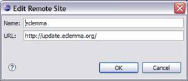
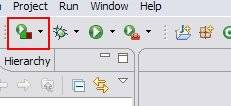
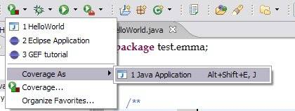
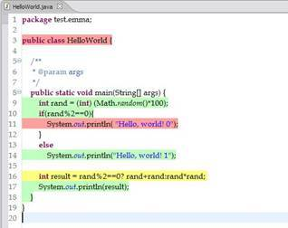
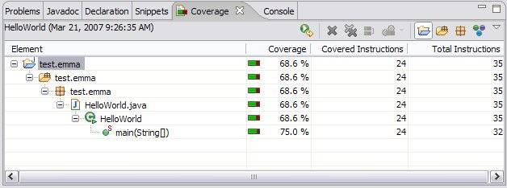
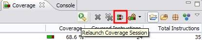
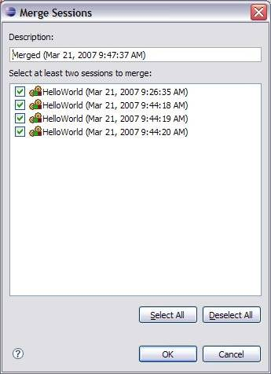
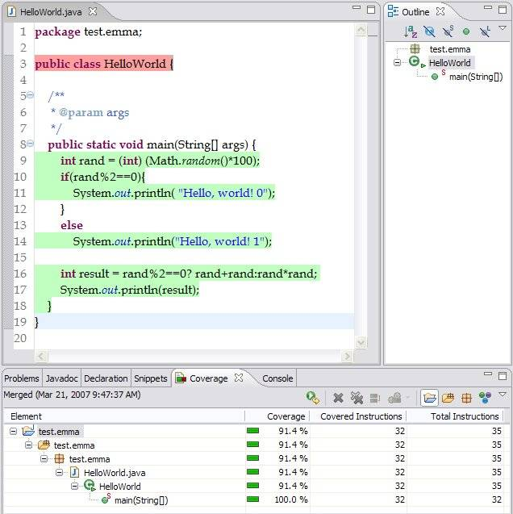
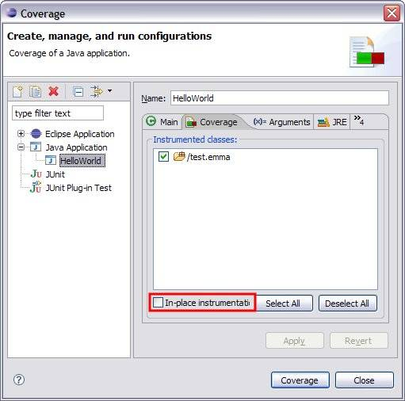

# 使用 EclEmma 进行覆盖测试
对程序运行的结果生成详尽的覆盖测试报告

**标签:** Java

[原文链接](https://developer.ibm.com/zh/articles/j-lo-eclemma/)

甘志

发布: 2007-05-10

* * *

## 介绍

现在 IT 开发人员比以往任何时候都更加关注测试的重要性，没有经过良好测试的代码更容易出问题。在极限编程中，测试驱动开发已经被证明是一种有效提高软件质量的方法。在测试驱动的开发方式中，软件工程师在编写功能代码之前首先编写测试代码，这样能从最开始保证程序代码的正确性，并且能够在程序的每次演进时进行自动的回归测试。测试对于软件产品的成败起着至关重要的作用，在极限编程领域，甚至有人提议任何未经测试的代码都应该自动从发布的产品中删除。作者并不确信这个观点是正确的，但是测试本身的质量确实是一个需要高度关注的问题。测试的覆盖率是测试质量的一个重要指标，我们需要工具来帮助我们进行对软件测试覆盖的考察。

EclEmma 就是这样一个能帮助开发人员考察测试覆盖率的优秀的 Eclipse 开源插件。EclEmma 在覆盖测试领域是如此的优秀，以致于它在过去不久的 2006 年成为了 Eclipse Community Awards Winners 决赛选手。虽然最后 Eclipse Checkstyle Plugin 取得了 Best Open Source Eclipse-based Developer tool 的称号，但我们也可以由此看到 EclEmma 对开发人员的帮助是巨大的（Eclipse Community Award 的具体信息可以参阅参考资源）。

提到 EclEmma 首先就要说到著名的 Java 覆盖测试工具 Emma。Emma 是一个在 SourceForge 上进行的开源项目（参阅参考资源）。从某种程度上说，EclEmma 可以看作是 Emma 的一个图形界面。在本文的 参考文献 中，可以看到专门讲述使用 Emma 的技术文章。

Emma 的作者开发 Emma 之初，程序员已经有了各种各样优秀的开源 Java 开发工具。举例来说，我们有优秀的集成开发环境 Eclipse，有开源的 JDK，有单元测试工具 JUnit，有 Ant 这样的项目管理工具，我们还可以用 CVS 或 SubVersion 来进行源代码版本的维护。当时看来，也许唯一缺少的就是一个开源的覆盖测试工具了。Emma 就是为了填补这项空白而生的。现在的情况已经和 Emma 诞生的时候不一样的。时至今日，我们已经有了不少的覆盖测试工具。例如 Coverlipse 是一个基于 Eclipse 的覆盖测试插件。其他还有 Cobertura，Quilt 和 JCoverage 等。但是 Emma 具有一些非常优秀的特性使得它更适合被广泛的使用。和 Coverlipse 等工具比起来，Emma 是开源的，同时它对应用程序执行速度的影响非常小。

EclEmma 的出现弥补了 Emma 用户一个大的遗憾 —- 缺乏图形界面以及对集成开发环境的支持。将 Eclipse 和 Emma 这两个在各自领域最为优秀的工具结合起来，这就是 EclEmma 为我们提供的。接下来，我们就要在后续章节中和读者朋友一起看看 EclEmma 为开发人员提供了什么。

## 安装 EclEmma 插件

安装 EclEmma 插件的过程和大部分 Eclipse 插件相同，我们既可以通过 Eclipse 标准的 Update 机制来远程安装 EclEmma 插件（ [图 1 添加 EclEmma 更新站点](#图-1-添加-eclemma-更新站点) ），也可以从站点（参阅 参考资源 ）下载 zip 文件并解压到 eclipse 所在的目录中。

##### 图 1 添加 EclEmma 更新站点



不管采用何种方式来安装 EclEmma，安装完成并重新启动 Eclipse 之后，工具栏上应该出现一个新的按钮：

##### 图 2 新增的覆盖测试按钮



## 使用 EclEmma 测试 Java 程序

为了实验 EclEmma 的特性，我们首先在 Eclipse 的 Workspace 中建立一个名称为 test.emma 的新 Java 项目。接下来，我们在其中建立一个 `HelloWorld` 类，其代码如下所示：

##### 清单 1 用于测试 EclEmma 的代码

```
package test.emma;

public class HelloWorld {

    /**
     * @param args
     */
    public static void main(String[] args) {
        int rand = (int) (Math.random()*100);
        if(rand%2==0){
            System.out.println( "Hello, world! 0");
        }
        else
            System.out.println("Hello, world! 1");

        int result = rand%2==0? rand+rand:rand*rand;
        System.out.println(result);
    }
}

```

Show moreShow more icon

接下来，我们通过 EclEmma 运行 `HelloWorld.main()` 函数。

##### 图 3 对 Java 应用程序进行覆盖测试



执行完毕之后，我们正在编辑 HelloWorld.java 的窗口将会变成如下所示：

##### 图 4 进行覆盖测试的结果



在 Java 编辑器中，EclEmma 用不同的色彩标示了源代码的测试情况。其中，绿色的行表示该行代码被完整的执行，红色部分表示该行代码根本没有被执行，而黄色的行表明该行代码部分被执行。黄色的行通常出现在单行代码包含分支的情况，例如 [图 4 进行覆盖测试的结果](#图-4-进行覆盖测试的结果) 中的 16 行就显示为黄色。由于程序中有一个随机确定的分支，因此读者的窗口可能与这里稍有不同（11 行或者 14 行中有且只有一个红色的行）。

除了在源代码编辑窗口直接进行着色之外，EclEmma 还提供了一个单独的视图来统计程序的覆盖测试率。

##### 图 5 察看程序的覆盖测试率



EclEmma 提供的 Coverage 视图能够分层的显示代码的覆盖测试率， [图 5 察看程序的覆盖测试率](#图-5-察看程序的覆盖测试率) 中的信息表明我们对 HelloWorld 的一次运行覆盖了大约 68.6% 的代码。

想在一次运行中覆盖所有的代码通常比较困难，如果能把多次测试的覆盖数据综合起来进行察看，那么我们就能更方便的掌握多次测试的测试效果。EclEmma 提供了这样的功能。现在，让我们重复数次对 HelloWorld 的覆盖测试。我们注意到 Coverage 视图总是显示最新完成的一次覆盖测试。事实上，EclEmma 为我们保存了所有的测试结果。接下来，我们将通过 Coverage 视图的工具按钮来结合多次覆盖测试的结果。

##### 图 6 用于结合多次覆盖测试结果的工具栏按钮



当我们多次运行 Coverage 之后，我们可以单击 [图 6 用于结合多次覆盖测试结果的工具栏按钮](#图-6-用于结合多次覆盖测试结果的工具栏按钮) 所示工具栏按钮。之后，一个对话框将被弹出以供用户选择需要合并的覆盖测试。

##### 图 7 选择需要合并的覆盖测试结果



在合并完成之后，我们可以观察到 Java 编辑器和 Coverage 视图中都显示了合并之后的结果：

##### 图 8 察看合并后的覆盖测试结果



[图 8 察看合并后的覆盖测试结果](#图-8-察看合并后的覆盖测试结果) 中，我们可以看到，通过多次运行覆盖测试，最终我们的代码达到了 91.4% 的测试覆盖率。有趣的是，图中第三行代码被标记为红色，而此行代码实际上是不可执行的。奥妙在于，我们没有生成任何 HelloWorld 类的实例，因此缺省构造函数没有被调用，而 EclEmma 将这个特殊代码的覆盖状态标记在类声明的第一行。

## EclEmma 的高级特性

如果 EclEmma 只能测试 Java Application 的测试覆盖率，那么它相对命令行版本的 Emma 来说，提供的增强就不多了。相反，EclEmma 提供了很多与 Eclipse 紧密结合的功能。它不仅能测试 Java Application，还能计算 JUnit 单元测试，对 Eclipse 插件测试的覆盖率。从 [图 9 EclEmma 的配置页面](#图-9-eclemma-的配置页面) 中我们可以看到 EclEmma 目前支持四种类型的程序。

##### 图 9 EclEmma 的配置页面



为了了解 EclEmma 是如何获得覆盖测试数据的，我们需要先对 Emma 有初步的了解。通常代码覆盖测试工具都需要对被执行的代码进行修改。而 Emma 提供了两种方式来完成这件事。

1. **预插入模式：** 对程序进行测量之前，需要采用 Emma 提供的工具对 class 文件或者 jar 文件进行修改。修改完成之后的代码可以立刻被执行。覆盖测试的结果将会被存放到指定的文件中。
2. **即时插入模式：** 即时插入模式不需要事先对代码进行修改。相反，对代码的修改是通过一个 Emma 定制的 Class loader（类载入器）进行的。这种方式的优点很明显，我们不需要对 class 或者 jar 文件进行任何修改。缺点是我们为了获得测试的结果，需要用 Emma 提供的命令 emmarun 来执行 Java 应用程序。

使用即时插入模式的优点很明显：class 文件和 jar 文件不会被修改。而预插入模式的应用范围更为广泛，对于某些需要嵌入到框架中运行的代码来说（例如 EJB），我们只能使用预插入模式。EclEmma 仅仅使用了 Emma 的预插入模式来工作，不过 EclEmma 缺省会在临时目录中创建 class 文件和 jar 文件的副本来进行修改，因此在 workspace 中 class 和 jar 文件仍然保持原样。虽然听上去很好，但是由于需要修改 classpath 来使用修改过的 class 和 jar 文件，对于不能修改 classpath 的应用（例如 Eclipse RCP 和 JUnit Plugin Test）来说，我们还是只能选择修改 workspace 中的 class 文件和 jar 文件。对于 Java Application 和 JUnit 类型的覆盖测试，我们可以在配置对话框中选中 **“In-place instrumentation”** 项来指定直接修改 Workspace 中的 .class 文件和 .jar 文件。

## 结束语

本文通过一个简单的例子介绍了使用 EclEmma 进行覆盖测试的基本过程。EclEmma 允许软件工程师方便的考察测试的覆盖率，并能将测试结果以直观、简洁的方式展现给开发人员。