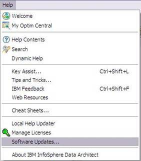
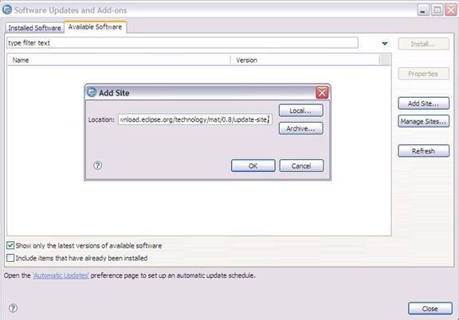
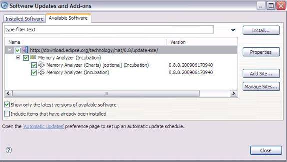
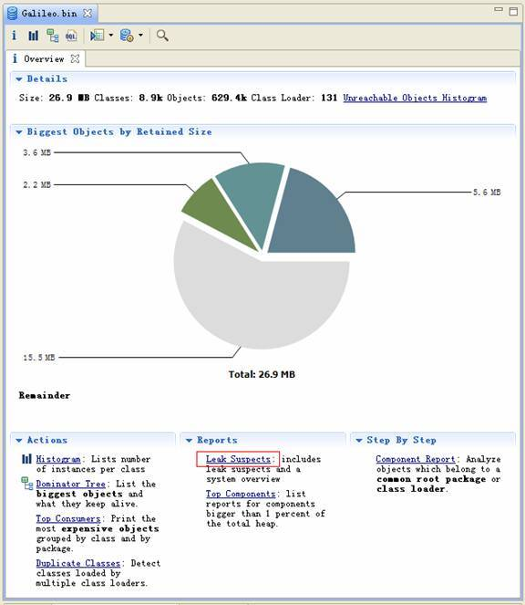
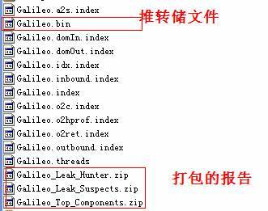
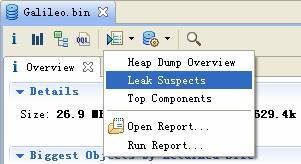
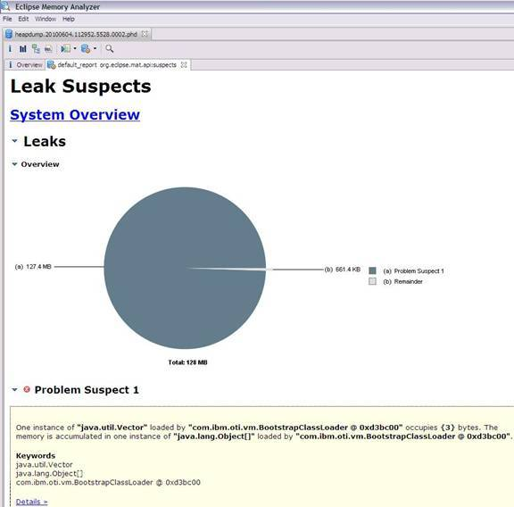
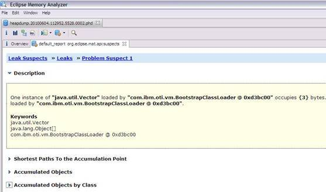
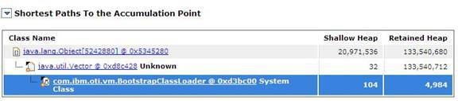
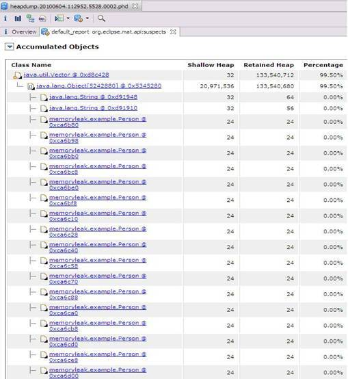

# 使用 Eclipse Memory Analyzer 进行堆转储文件分析
Eclipse Memory Analyzer 上手

**标签:** Java

[原文链接](https://developer.ibm.com/zh/articles/os-cn-ecl-ma/)

仇 璐, 杨 晓峰

发布: 2010-07-22

* * *

## 概述

对于大型 JAVA 应用程序来说，再精细的测试也难以堵住所有的漏洞，即便我们在测试阶段进行了大量卓有成效的工作，很多问题还是会在生产环境下暴露出来，并且很难在测试环境中进行重现。JVM 能够记录下问题发生时系统的部分运行状态，并将其存储在堆转储 (Heap Dump) 文件中，从而为我们分析和诊断问题提供了重要的依据。

通常内存泄露分析被认为是一件很有难度的工作，一般由团队中的资深人士进行。不过，今天我们要介绍的 MAT（Eclipse Memory Analyzer）被认为是一个”傻瓜式”的堆转储文件分析工具，你只需要轻轻点击一下鼠标就可以生成一个专业的分析报告。和其他内存泄露分析工具相比，MAT 的使用非常容易，基本可以实现一键到位，即使是新手也能够很快上手使用。

MAT 的使用是如此容易，你是不是也很有兴趣来亲自感受下呢，那么第一步我们先来安装 MAT。

## 准备环境和测试数据

我们使用的是 Eclipse Memory Analyzer V0.8，Sun JDK 6

### 安装 MAT

和其他插件的安装非常类似，MAT 支持两种安装方式，一种是”单机版”的，也就是说用户不必安装 Eclipse IDE 环境，MAT 作为一个独立的 Eclipse RCP 应用运行；另一种是”集成版”的，也就是说 MAT 也可以作为 Eclipse IDE 的一部分，和现有的开发平台集成。

集成版的安装需要借助 Update Manager。

如图 1 所示，首先通过 Help -> Software Updates… 启动软件更新管理向导。

##### 图 1\. 安装插件第一步



选择”Available Software”然后按如图 2 所示的方式添加 MAT 的更新地址 `http://download.eclipse.org/technology/mat/0.8/update-site/`。

##### 图 2\. 安装插件第二步



如图 3 所示，接下来选择你想要安装的 MAT 的功能点，需要注意的是 Memory Analyzer (Chart) 这个功能是一个可选的安装项目，它主要用来生成相关的报表，不过如果需要用到这个功能，你还需要额外的安装 BIRT Chart Engine。

##### 图 3\. 安装插件第三步



插件安装完毕，你还需要重新启动 Eclipse 的工作平台。

比较而言，单机版的安装方式非常简单，用户只需要下载相应的安装包，然后解压缩即可运行，这也是被普遍采用的一种安装方式。在下面的例子里，我们使用的也是单机版的 MAT。具体的下载要求和地址可参见其产品下载页面： [http://www.eclipse.org/mat/downloads.php](http://www.eclipse.org/mat/downloads.php) 。

另外，如果你需要用 MAT 来分析 IBM JVM 生成的 dump 文件的话，还需要额外安装 IBM Diagnostic Tool Framework ，具体的下载和安装配置步骤请参见： [http://www.ibm.com/developerworks/java/jdk/tools/dtfj.html](http://www.ibm.com/developerworks/java/jdk/tools/dtfj.html) 。

### 配置环境参数

安装完成之后，为了更有效率的使用 MAT，我们还需要做一些配置工作。因为通常而言，分析一个堆转储文件需要消耗很多的堆空间，为了保证分析的效率和性能，在有条件的情况下，我们会建议分配给 MAT 尽可能多的内存资源。你可以采用如下两种方式来分配内存更多的内存资源给 MAT。

一种是修改启动参数 `MemoryAnalyzer.exe -vmargs -Xmx4g`

另一种是编辑文件 `MemoryAnalyzer.ini`，在里面添加类似信息 `-vmargs – Xmx4g`。

至此，MAT 就已经成功地安装配置好了，开始进入实战吧。

### 获得堆转储文件

巧妇难为无米之炊，我们首先需要获得一个堆转储文件。为了方便，本文采用的是 Sun JDK 6。通常来说，只要你设置了如下所示的 JVM 参数：

`-XX:+HeapDumpOnOutOfMemoryError`

JVM 就会在发生内存泄露时抓拍下当时的内存状态，也就是我们想要的堆转储文件。

如果你不想等到发生崩溃性的错误时才获得堆转储文件，也可以通过设置如下 JVM 参数来按需获取堆转储文件。

`-XX:+HeapDumpOnCtrlBreak`

除此之外，还有很多的工具，例如 [JMap](http://java.sun.com/j2se/1.5.0/docs/tooldocs/share/jmap.html) ，JConsole 都可以帮助我们得到一个堆转储文件。本文实例就是使用 JMap 直接获取了 Eclipse Galileo 进程的堆转储文件。您可以使用如下命令：

`JMap -dump:format=b,file=<dumpfile> <pid>`

不过，您需要了解到，不同厂家的 JVM 所生成的堆转储文件在数据存储格式以及数据存储内容上有很多区别， MAT 不是一个万能工具，它并不能处理所有类型的堆存储文件。但是比较主流的厂家和格式，例如 Sun, HP, SAP 所采用的 HPROF 二进制堆存储文件，以及 IBM 的 PHD 堆存储文件等都能被很好的解析（您需要安装额外的插件，请参考 [相关说明](http://www.ibm.com/developerworks/java/jdk/tools/dtfj.html) ，本文不作详细解释）。

万事俱备，接下来，我们就可以开始体验一键式的堆存储分析功能了。

## 生成分析报告

首先，启动前面安装配置好的 Memory Analyzer tool , 然后选择菜单项 File- Open Heap Dump 来加载需要分析的堆转储文件。文件加载完成后，你可以看到如图 4 所示的界面：

##### 图 4\. 概览



通过上面的概览，我们对内存占用情况有了一个总体的了解。先检查一下 MAT 生成的一系列文件。

##### 图 5\. 文件列表



可以看到 MAT 工具提供了一个很贴心的功能，将报告的内容压缩打包到一个 zip 文件，并把它存放到原始堆转储文件的存放目录下，这样如果您需要和同事一起分析这个内存问题的话，只需要把这个小小的 zip 包发给他就可以了，不需要把整个堆文件发给他。并且整个报告是一个 HTML 格式的文件，用浏览器就可以轻松打开。

接下来我们就可以来看看生成的报告都包括什么内容，能不能帮我们找到问题所在吧。您可以点击工具栏上的 Leak Suspects 菜单项来生成内存泄露分析报告，也可以直接点击饼图下方的 Reports->Leak Suspects 链接来生成报告。

##### 图 6\. 工具栏菜单



## 分析三步曲

通常我们都会采用下面的”三步曲”来分析内存泄露问题：

首先，对问题发生时刻的系统内存状态获取一个整体印象。

第二步，找到最有可能导致内存泄露的元凶，通常也就是消耗内存最多的对象

接下来，进一步去查看这个内存消耗大户的具体情况，看看是否有什么异常的行为。

下面将用一个基本的例子来展示如何采用”三步曲”来查看生产的分析报告。

### 查看报告之一：内存消耗的整体状况

##### 图 7\. 内存泄露分析报告



如图 7 所示，在报告上最醒目的就是一张简洁明了的饼图，从图上我们可以清晰地看到一个可疑对象消耗了系统 99% 的内存。

在图的下方还有对这个可疑对象的进一步描述。我们可以看到内存是由 java.util.Vector 的实例消耗的，com.ibm.oti.vm.BootstrapClassLoader 负责这个对象的加载。这段描述非常短，但我相信您已经可以从中找到很多线索了，比如是哪个类占用了绝大多数的内存，它属于哪个组件等等。

接下来，我们应该进一步去分析问题，为什么一个 Vector 会占据了系统 99% 的内存，谁阻止了垃圾回收机制对它的回收。

### 查看报告之二：分析问题的所在

首先我们简单回顾下 JAVA 的内存回收机制，内存空间中垃圾回收的工作由垃圾回收器 (Garbage Collector,GC) 完成的，它的核心思想是：对虚拟机可用内存空间，即堆空间中的对象进行识别，如果对象正在被引用，那么称其为存活对象，反之，如果对象不再被引用，则为垃圾对象，可以回收其占据的空间，用于再分配。

在垃圾回收机制中有一组元素被称为根元素集合，它们是一组被虚拟机直接引用的对象，比如，正在运行的线程对象，系统调用栈里面的对象以及被 system class loader 所加载的那些对象。堆空间中的每个对象都是由一个根元素为起点被层层调用的。因此，一个对象还被某一个存活的根元素所引用，就会被认为是存活对象，不能被回收，进行内存释放。因此，我们可以通过分析一个对象到根元素的引用路径来分析为什么该对象不能被顺利回收。如果说一个对象已经不被任何程序逻辑所需要但是还存在被根元素引用的情况，我们可以说这里存在内存泄露。

现在，让我们开始真正的寻找内存泄露之旅，点击”Details ”链接，可以看到如图 8 所示对可疑对象 1 的详细分析报告。

##### 图 8\. 可疑对象 1 的详细分析报告



1. 我们查看下从 GC 根元素到内存消耗聚集点的最短路径：

##### 图 9\. 从根元素到内存消耗聚集点的最短路径



我们可以很清楚的看到整个引用链，内存聚集点是一个拥有大量对象的集合，如果你对代码比较熟悉的话，相信这些信息应该能给你提供一些找到内存泄露的思路了。

接下来，我们再继续看看，这个对象集合里到底存放了什么，为什么会消耗掉如此多的内存。

##### 图 10\. 内存消耗聚集对象信息



在这张图上，我们可以清楚的看到，这个对象集合中保存了大量 Person 对象的引用，就是它导致的内存泄露。

至此，我们已经拥有了足够的信息去寻找泄露点，回到代码，我们发现，是下面的代码导致了内存泄露 :

##### 清单 1\. 内存泄漏的代码段

```
while (1<2)
{

     Person person = new Person("name","address",i);
     v.add(person);
     person = null;
}

```

Show moreShow more icon

## 结束语

从上面的例子我们可以看到用 MAT 来进行堆转储文件分析，寻找内存泄露非常简单，尤其是对于新手而言，这是一个很好的辅助分析工具。但是，MAT 绝对不仅仅是一个”傻瓜式”内存分析工具，它还提供很多高级功能，比如 MAT 支持用 OQL（Object Query Language）对 heap dump 中的对象进行查询，支持对线程的分析等，有关这些功能的使用可以参考 MAT 的帮助文档。