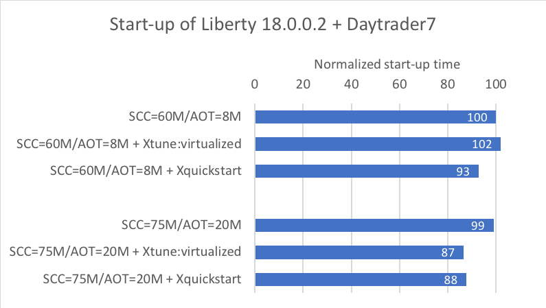

# 使用 Eclipse OpenJ9 优化 JVM 启动
通过共享类缓存、动态 AOT 等技术来优化

**标签:** Eclipse OpenJ9,Java,Java 平台,OpenJDK

[原文链接](https://developer.ibm.com/zh/articles/optimize-jvm-startup-with-eclipse-openjj9/)

Marius Pirvu

发布: 2018-11-30

* * *

应用程序启动时间对各类人群都很重要，其中原因也不尽相同。例如，反复执行编码-编译-测试周期的软件开发人员非常关注启动时间，因为他们希望到达更快地运行新代码的时间点。在软硬件升级或故障导致计划中或计划外的运行中断后，需要快速恢复，这时启动时间也很重要。在云中，如果自动扩展系统需要快速启动应用程序的其他实例来处理负载的临时增长，那么启动时间也至关重要。

在 Eclipse OpenJ9 中，JVM 启动时间被视为首要的性能指标。为此，OpenJ9 修改了启动阶段的内部启发法，以便改善应用程序的启动时间。那么，OpenJ9 如何检测启动阶段呢？尽管具体细节不属于本文的讨论范围，但可以认为 OpenJ9 的阶段检测机制基于以下观察：启动的典型特征是密集的类加载和字节码解释，并伴随持续的 JIT 编译活动。

由于解释是一个非常耗费资源的过程（解释代码通常比原生代码慢 10 倍），所以 OpenJ9 JIT 编译器的目标是尽快减少解释。因此，JIT在此阶段的目标是尽快编译尽可能多的 Java 方法，而不过度关心生成的代码质量。为此，在启动期间，JIT 编译器可以选择：

- 降低方法的优化级别。这些低优化方法的主体可以通过各种机制进行升级，其中最重要的机制是守护计数重新编译 (guarded-counting-recompilation, GCR)。GCR 是一种基于调用计数的重新编译机制，但因为会在启动阶段禁用计数，所以它是“被守护的”。
- 减少解释方法的调用计数。在 OpenJ9 中，编译解释方法的决定基于调用计数机制。虽然从启动角度来看，使用低调用阈值可能很吸引人，但这会导致在解释方法时收集的分析数据质量较差，而对于优化器而言，这些分析数据是实现良好吞吐量所必需的。因此，OpenJ9 仅会在启动阶段使用减少的调用计数。
- 优先处理首次编译请求（将一个方法从解释型转变为原生代码）和消耗资源更少的编译。保持未完成编译请求的队列将作为优先队列来实现，而且 OpenJ9 偏爱那些提供了最佳“价值”的编译。本着这种思路，将具有较高优化级别的重新编译和编译放在队列末尾。

OpenJ9 中旨在改善启动时间的两种主要机制是共享类缓存 (SCC) 和动态提前 (AOT) 编译技术。这些技术直接解决了主要的开销来源。

SCC 是一个内存映射文件，主要存储 3 种数据：

- ROMClasses
- AOT 生成的代码
- 解释器分析器信息

在 OpenJ9 中，Java .class 文件首先被转换为一个名为 ROMClass 的内部表示，其中包含该类的所有不可变数据。从 SCC 加载 ROMClass 要快得多，因为：

- 类的数据是从内存而不是从磁盘抓取的
- 向 ROMClass 的转换和一些验证已经发生

但是注意，并非所有类都可以存储在 SCC 中。主要条件是，用于执行加载的类加载器是 SCC“感知的”。满足此前提条件的最简单方法是，拥有一个扩展 `java.net.URLClassLoader` 的类加载器。要进一步了解 SCC 技术，请查阅 “ [Eclipse OpenJ9 中的类共享](https://www.ibm.com/developerworks/cn/java/j-class-sharing-openj9/index.html)”（IBM Developer，2018 年 7 月）。

动态 AOT 编译是这样一种机制：在某个 JVM 调用中编译的 Java 方法会存储在 SCC 中，并会在后续 JVM 调用中重用。与执行一次 JIT 编译相比，从 SCC 加载经过 AOT 编译的主体要快得多，而且消耗的资源要少得多。启动时间之所以得到明显改善，原因有两个：

- 编译开销显著减少（因此 JIT 编译线程从应用程序线程中窃取的 CPU 周期更少）
- 方法能够更快地从解释状态过渡到编译状态

要注意的一点是，由于需要在 JVM 调用之间共享经过 AOT 编译的主体而造成的技术限制，AOT 编译的代码质量略低于 JIT 编译的质量。OpenJ9 通过以下方法克服了这个缺点：

- 重新编译频繁执行的 AOT 主体
- 将 AOT 生成限制在应用程序的启动阶段

OpenJ9 中的解释器分析器机制收集关于分支偏好（接受或不接受）的分析数据，以及接口调用、虚拟调用、`checkcast` 操作和 `instanceof` 操作的目标。此信息对 JIT 优化器至关重要，但不幸的是，分析数据收集过程的开销较高，这会对启动时间产生负面影响。OpenJ9 采用的解决方案是将收集的分析数据存储在 SCC 中，并在后续运行中使用，同时在后续运行的启动期间关闭解释器分析器。一旦对分析数据的查询太多而一无所获，那么监视（watchdog）机制可能会打开解释器分析器。

## 用户应如何改善启动时间？

尽管 OpenJ9 中默认启用了许多面向启动的启发法，但在某些情况下需要用户输入数据。

### 配置并调优 SCC/AOT

在编写本文时，默认情况下未启用 SCC 和动态 AOT。用户需要指定 `-Xshareclasses` 命令行选项。请参阅 GitHub 上的 `-Xshareclasses` [文档](https://github.com/eclipse/openj9-docs/blob/master/docs/xshareclasses.md) 了解完整的子选项列表。常见的陷阱之一是，对于已连接的应用程序，SCC 的默认大小可能太小。可通过使用以下命令输出 SCC 统计数据并查看 SCC 占用情况来确定此情形：

```lang-java
java -Xshareclasses:name=YourSCCName,printStats

```

Show moreShow more icon

如果输出显示为 “`Cache is 100% full`”，那么使用较大的 SCC 可能会让应用程序受益。在过去的 OpenJ9 版本中，为了通过 `-Xscmx` 选项增加 SCC 的大小，必须销毁现有的 SCC 并创建新的 SCC。从 OpenJ9 v0.9.0 开始，此过程已简化，因为 SCC 定义了一个软性限制和一个硬性限制。当达到软性限制时，SCC 会声明已装满，但可以使用 `-Xshareclasses:adjustsoftmx=<size>` 选项将此大小增加到硬性限制，而不销毁 SCC。

请参阅 GitHub 上的 `-Xscmx` [文档](https://github.com/eclipse/openj9-docs/blob/master/docs/xscmx.md) 了解更多调节 SCC 大小的细节。

对于 AOT 代码大小，OpenJ9 默认情况下不会设置任何显式限制，这意味着 AOT 代码可以存储在 SCC 中，直到它被装满。但是，您必须注意，某些应用程序会使用 `-Xscmaxaot<size>` 选项在内部设置一个 AOT 空间限制。一些典型的示例包括 WebSphere Application Server 和 WebSphere Liberty。如果在这些应用服务器上运行的应用程序特别大，用户可以考虑增加 AOT 空间限制，以便进一步改善启动时间。可使用 `printStats` 选项获取有关 AOT 空间限制和占用情况的统计数据（参阅上面的示例）。

### 使用 `-Xtune:virtualized`

对于 CPU 资源受限的环境，比如通常在云中构建的环境，建议使用此选项。在内部，该选项通过其内联和重新编译决策来让 JIT 编译器变得更加保守（从而节省 CPU 资源），而 GC 模块不那么热衷于扩展堆（从而降低内存占用）。这些更改预计会将 JIT 编译线程耗用的 CPU 资源减少 20-30%，将内存占用提高 3-5%，而代价是较小的 (2-3%) 吞吐量损失。此选项本身对启动时间的影响极小，但与 AOT 结合使用时，可以很好地改善启动时间。原因有两个：

- `-Xtune:virtualized` 会在内部启用 `-Xaot:forceaot` 选项，该选项指示 JIT 编译器绕过其常用的启发法，生成尽可能多的 AOT 代码
- 所有 AOT 编译的优化级别从“冷”（通常在启动期间使用）提升到“暖”

但是，提醒一句：尽管 `-Xtune:virtualized` 与较大的 SCC 结合可以很好地改善应用程序的启动和加载时间，但吞吐量可能会受到影响，如先前所述，AOT 代码质量与 JIT 代码质量不匹配，重新编译机制明显减弱，导致许多 AOT 主体无法重新编译。

### 使用 `-Xquickstart`

在以下情况下推荐使用此选项：

- 在非常短的应用程序中，没有足够的时间来缓冲 JIT 编译的成本
- 在图形/交互式应用程序中，来自 JIT 编译活动的干扰可能让人感到不稳定
- 当用户认为启动时间是最重要的性能指标时

如您所料，`-Xquickstart` 模式下的更改旨在实现快速启动体验。JIT 将完全禁用解释器分析器，将所有首次编译降级为“冷”优化级别，减少方法调用计数，并开启 `-Xaot:forceaot` 模式（如果适用）。注意，虽然禁用解释器分析器从启动角度来看是有利的，但会导致吞吐水平降低（在使用 `-Xquickstart` 时，经常可以看到吞吐量下降达 40%）。

### 影响启动时间的其他设置

对于希望实现进一步改进的用户，还有一个选项可以进一步减少启动时间，尽管减少幅度有限。OpenJ9 中的 Java 堆的默认初始大小为 8MB，通过 `-Xms<size>` 增加此值可以降低 GC 开销，从而改善启动时间。但是，缺点是内存消耗略有增加。例如，在我们的 Liberty+DT7 试验中，我们看到将 `-Xms256M` 添加到命令行后，启动时间减少了 6%，但内存占用增加了 8%。

## 试验结果

面对如此多的选择，您可能会问应该挑选哪一个。为了回答这个问题，我们对 WebSphere Liberty 18.0.0.2 上安装的 [Daytrader7 基准应用程序](https://github.com/wasdev/sample.daytrader7) 运行了一些启动试验，并使用了从 AdoptOpenJDK 下载的带 OpenJ9 build 的 OpenJDK8 OpenJDK8U\_x64\_linux\_openj9\_linuxXL\_2018-09-27-08-47。

**图 1.** 不同 OpenJ9 选项之间的启动时间对比


如图 1 所示，在 `-Xshareclasses` 与 `-Xquickstart` 之间，应优先考虑前者，因为它提供了更大的启动时间改进而对吞吐量的影响非常小（如果有的话）。但在某些情况下，SCC 无法实现其预定目标，例如，由于许多 Java 类是通过一个无法感知 SCC 的类加载器加载的。在这些情况下，可以考虑使用 `-Xquickstart` 作为替代。

**图 2.** SCC/AOT 大小对启动时间的影响



需要注意的是，`-Xquickstart` 可以与 SCC/AOT 结合使用，而且这种组合可以比任何单个组件更大地改进启动时间。如图 2 所示，如果将 `-Xquickstart` 添加到 WebSphere Liberty 所采用的默认 SCC/AOT 设置 (SCC=60MB/AOT=8MB) 中，可以将启动时间再提高 7%。相比之下，添加 `-Xtune:virtualized` 似乎会使应用程序的启动时间延长了 2%。但是，这只是 WebSphere Liberty 中的小 SCC 和 AOT 空间的一个工件：因为在 `-Xtune:virtualized` 下，AOT 代码在“暖”优化级别（而不是“冷”）下编译，编译后的主体更加庞大，超出了 SCC 的容量。如果将 SCC 和 AOT 分别增大到 75MB 和 20MB，我们就可以看到 `-Xtune:virtualized` 的真正潜力，与默认 Liberty 设置相比，这可以将启动时间缩短 13%。

总之，如果启动时间对您至关重要，那么结合使用 `-Xshareclasses` 和 `-Xtune:virtualized` 应该是首先尝试的配置之一。您仅需确保为您的 SCC 和 AOT 空间设置了适当的大小。

本文翻译自： [Optimize JVM start-up with Eclipse OpenJ9](https://developer.ibm.com/articles/optimize-jvm-startup-with-eclipse-openjj9/) （2018-11-30）