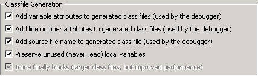
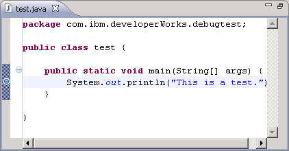
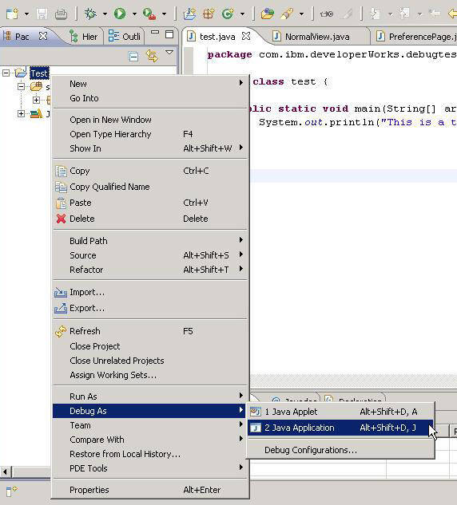
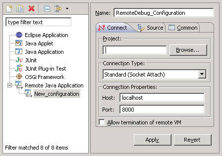
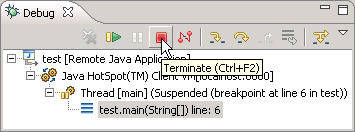
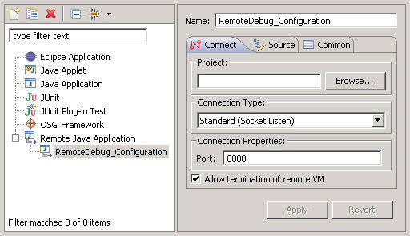

# 使用 Eclipse 远程调试 Java 应用程序
利用 Eclipse IDE 的强大功能远程调试 Java 应用程序

**标签:** Java

[原文链接](https://developer.ibm.com/zh/articles/os-eclipse-javadebug/)

Charles Lu

发布: 2009-01-12

* * *

远程调试对应用程序开发十分有用。例如，为不能托管开发平台的低端机器开发程序，或在专用的机器上（比如服务不能中断的 Web 服务器）调试程序。其他情况包括：运行在内存小或 CUP 性能低的设备上的 Java 应用程序（比如移动设备），或者开发人员想要将应用程序和开发环境分开，等等。

## 先决条件

##### 启动配置类型

_启动配置_ 保存一组用于启动程序的属性。启动配置类型是一种可以在 Eclipse 平台上启动的独特程序。

如果您还没安装该程序，请下载 Eclipse V3.4（Ganymede）。在 Ganymede 中，套接字（socket）监听连接器被添加到 Remote Java Application 启动配置类型。Eclipse 最新的套接字监听连接器允许您打开 Java 调试器，它能够监听特定套接字上的连接。可以从命令行选项打开被调试的程序，并将其连接到调试器。在 Ganymede 发布之前，仅有一个连接套接字的连接器，被调试的程序所在的机器必须是一个与调试器相连的调试主机。由于受到内存和 CPU 不足的限制，要想让移动设备充当主机是不现实的。

为了进行远程调试，必须使用 Java Virtual Machine (JVM) V5.0 或更新版本，比如 IBM® J9 或 Sun Microsystem 的 Java SE Development Kit（JDK）。本文主要讨论远程调试，而不是每个 Eclipse 调试特性的细节。查看 参考资料 获得更多关于使用 Eclipse 进行调试的信息，并且可以找到上面提到的软件。

## JPDA 简介

##### 常用缩写词

- **JDI** Java 调试接口（Java Debug Interface）
- **JDT** Java 开发工具（Java Development Tools）
- **JDWP** Java 调试网络协议（Java Debug Wire Protocol）
- **JPDA** Java 平台调试器架构（Java Platform Debugger Architecture）
- **JVMDI** JVM 调试接口（JVM Debug Interface）
- **JVMTI** JVM 工具接口（JVM Tool Interface）

Sun Microsystem 的 Java Platform Debugger Architecture (JPDA) 技术是一个多层架构，使您能够在各种环境中轻松调试 Java 应用程序。JPDA 由两个接口（分别是 JVM Tool Interface 和 JDI）、一个协议（Java Debug Wire Protocol）和两个用于合并它们的软件组件（后端和前端）组成。它的设计目的是让调试人员在任何环境中都可以进行调试。JPDA 不仅能够用于桌面系统，而且能够在嵌入式系统上很好地工作。

JVM Tool Interface (JVMTI) 规定必须为调试提供 VM（ _编辑注：_ 从 Java V5 开始，将用 JVMTI 代替 Java V1.4 中的 JVMDI）。Java Debug Wire Protocol (JDWP) 描述调试信息的格式，以及在被调试的进程和调试器前端之间传输的请求，调试器前端实现 JDI，比如 Eclipse、Borland JBuilder 等。根据 Sun 的 JPDA 规范，被调试的程序常常称为 _debuggee_ 。JDI 是一个高级的接口，它定义用于远程调试的信息和请求。下面给出了调试器的架构。

##### 清单 1\. Java 平台调试器架构

```
Components                      Debugger Interfaces

                 /    |--------------|
                /     |     VM       |
debuggee -----(      |--------------|  <---- JVMTI - Java VM Tool Interface
                \     |   back-end   |
                 \    |--------------|
                 /           |
comm channel --(            |  <------------ JDWP - Java Debug Wire Protocol
                 \           |
                 /    |--------------|
                /     |  front-end   |
debugger -----(      |--------------|  <---- JDI - Java Debug Interface
                \     |      UI      |
                 \    |--------------|

```

Show moreShow more icon

因此，任何第三方工具和基于 JPDA 的 VM 应该都能协调工作。通过这个客户机-服务器架构，您可以从运行该平台的本地工作站调试 Java 程序，甚至还可以通过网络进行远程调试。

在讨论调试场景之前，我们先了解 JPDA 规范中的两个术语：连接器和传输。连接器是一个 JDI 抽象，用来在调试器应用程序和目标 VM 之间建立连接。传输定义应用程序如何进行访问，以及数据如何在前端和后端之间传输。连接器 “映射” 到可用的传输类型和连接模式。在 Sun 的 JPDA 参考实现中，为 Microsoft® Windows® 提供了两个传输机制：套接字传输和共享内存传输。可用的连接器：

- 连接套接字连接器
- 连接共享内存连接器
- 监听套接字连接器
- 监听共享内存连接器
- 启动命令行连接器

在调试器应用程序和目标 VM 之间建立连接时，有一端将用作服务器并监听连接。随后，另一端将连接到监听器并建立一个连接。通过连接，调试器应用程序或目标 VM 都可以充当服务器。进程之间的通信可以在同一个机器或不同的机器上运行。

要远程调试 Java 程序，难点不是在调试器的前端，而是远程 Java 后端。不幸的是，Eclipse 帮助系统中为这方面提供的信息并不多。事实上，JDI 和 JVMTI 是分别由 Eclipse 和 Java 运行时环境实现的。我们仅需要考虑 JDMP，因为它包含与 JVMTI 和 JDI 进行通信所需的信息。JDWP 包含许多参数，用于为远程 Java 应用程序调用所需的程序。以下是本文用到的一些参数。

- **-Xdebug**: 启用调试特性。

- **-Xrunjdwp:**: 在目标 VM 中加载 JDWP 实现。它通过传输和 JDWP 协议与独立的调试器应用程序通信。下面介绍一些特定的子选项。


从 Java V5 开始，您可以使用 _-agentlib:jdwp_ 选项，而不是 _-Xdebug_ 和 _-Xrunjdwp_ 。但如果连接到 V5 以前的 VM，只能选择 _-Xdebug_ 和 _-Xrunjdwp_ 。下面简单描述 _-Xrunjdwp_ 子选项。

- **transport**: 这里通常使用套接字传输。但是在 Windows 平台上也可以使用共享内存传输。

- **server**: 如果值为 _y_ ，目标应用程序监听将要连接的调试器应用程序。否则，它将连接到特定地址上的调试器应用程序。

- **address**: 这是连接的传输地址。如果服务器为 _n_ ，将尝试连接到该地址上的调试器应用程序。否则，将在这个端口监听连接。

- **suspend**: 如果值为 _y_ ，目标 VM 将暂停，直到调试器应用程序进行连接。


要获得每个调试设置的详细解释，请参考 JPDA 文档（参见 参考资料 ）。

清单 2 是一个示例，显示如何在调试模式下启动 VM 并监听端口 8765 的套接字连接。

##### 清单 2\. 作为调试服务器的目标 VM

```
-Xdebug -Xrunjdwp:transport=dt_socket,server=y,address=8765

```

Show moreShow more icon

清单 3 显示如何使用位于 8000 端口的主机 127.0.0.1 上的套接字连接运行中的调试器应用程序。

##### 清单 3\. 作为调试客户机的目标 VM

```
-Xdebug -Xrunjdwp:transport=dt_socket,address=127.0.0.1:8000

```

Show moreShow more icon

## Eclipse 中的远程调试特性

Eclipse 是一个图形化 Java 调试器前端。JDI 在 org.eclipse.jdt.debug 包中实现。本文不详细讨论 JDI 实现。参见 参考资料 获得关于 Eclipse JDT 和 Java JDI 技术的信息。

我们首先应该知道要使用哪个 Eclipse 连接器。要了解 Eclipse 提供的远程连接类型，您可以转到 Eclipse 菜单并选择 **Run > Debug Configurations…** ，在 `Remote Java Application` 中添加一个启动配置，然后从下拉列表中选择连接器。在 Ganymede 中共有两个连接器：

- Socket Attach
- Socket Listen

对于监听套接字的连接器，Eclipse VM 将是与远程 Java 应用程序连接的主机。对于连接套接字的连接器，目标 VM 将作为主机。这两种连接器对应用程序调试没有影响，用户可以任意选择。但根据经验，需要使用速度更快、更强大的计算机作为 VM 调试主机，因为需要计算的资源很多。

在调试 Java 应用程序之前，需要确保已经为远程应用程序启用所有调试选项。如果选项信息不可用，您将收到一个错误信息，比如 “Debug information is not available” 或 “Unable to install breakpoint due to missing line number”。您可以通过更改 Eclipse 菜单上的 **Window > Preferences > Java > Compiler** 来修改设置。

##### 图 1\. Eclipse 中的调试选项



## 远程调试应用程序

现在，我们已经准备好远程调试应用程序。我们分步执行：

**1\. 使用简单类创建一个 Java 项目**: 我们为调试创建一个简单类。清单 4 给出了示例代码。

##### 清单 4\. 调试示例代码

```
package com.ibm.developerWorks.debugtest;

public class test {

public static void main(String[] args) {
System.out.println("This is a test.");
}
}

```

Show moreShow more icon

**2\. 设置一个断点**: 在代码中设置一个断点。在这个例子中，我们在 `System.out.println("This is a test.");` 这行中设置断点。

##### 图 2\. 在 Eclipse 中设置断点



**3\. 从本地调试应用程序**: 在调试应用程序之前，确保已经为项目启用图 1 中描述的调试选项。从本地调试应用程序是没有必要的，但是这可以确保是否所有调试信息都可用。右键单击 Java 项目，并选择 **Debug As** ，然后选择 **Java Application** （参见图 3）。如果应用程序在断点处停止执行，则表明调试信息正确显示。这时，可以继续使用这些调试特性，比如显示调试堆栈、变量或断点管理等等。

##### 图 3\. 从本地调试应用程序



**4\. 导出 Java 项目**: 我们将使用这个应用程序作为调试目标。右键单击 Java 项目，选择 **Export** ，然后选择 **Java** ，最后选择 **JAR file** 或 **Runnable JAR file** 导出项目。将在指定的位置生成 JAR 文件。注意，如果 Java 源代码与目标应用程序不匹配，调试特性将不能正常工作。

**5\. 手动运行 Java 应用程序**: 打开控制台手动启动应用程序，确保正确配置了 Java 运行时环境。

##### 清单 5\. 调用 Java 应用程序的示例

```
java -jar test.jar

```

Show moreShow more icon

**6\. 远程调试应用程序**: 将 JAR 文件复制到远程计算机或同一台计算机上的适当位置，调用调试服务器，然后为它添加一个客户机。简单的 Java 应用程序就可以充当调试服务器或客户机。您可以在 Eclipse 中选择 **Socket Attach** 或 **Socket Listen** 连接类型，这取决于特定的配置。接下来的两个小节将学习如何将应用程序作为服务器或客户机运行。

### 作为调试服务器的目标 VM

下面这个示例远程调用 Java 应用程序作为调试服务器，并在端口 8000 监听套接字连接。目标 VM 将暂停，直到调试器连接。

##### 清单 6\. Eclipse 连接套接字模式下的 VM 调用示例

```
java -Xdebug -Xrunjdwp:transport=dt_socket,server=y,address="8000" -jar
     test.jar

```

Show moreShow more icon

使用远程启动配置启动 Eclipse，并指定远程应用程序的目标 VM 地址。为此，单击 **Run > Debug Configurations** ，然后在 Eclipse 菜单中双击 **Remote Java Application** 。从最新创建的启动配置中为目标应用程序指定 IP 和端口。为了在同一台机器上运行远程应用程序，仅需将主机 IP 指定为 localhost 或 127.0.0.1。

##### 图 4\. 连接套接字连接的配置



选择 **Allow termination of remote VM** 选项终止在应用程序调试期间连接的 VM。

##### 图 5\. Eclipse 中的 Terminate 按钮



### 作为调试客户机的目标 VM

第二个示例使用一个简单的 Java 应用程序作为调试客户机，并且调试器前端作为调试服务器。Eclipse 使用套接字监听模式连接类型进行监听。必须先启动调试前端来监听特定的端口。图 6 给出一个用于设置监听的示例配置。

##### 图 6\. 监听套接字连接的配置



单击 Eclipse **Debug** 按钮，状态栏将显示消息 “waiting for vm to connect at port 8000…”。看到这个消息后，启动远程应用程序。清单 7 显示了如何将 Java 应用程序作为调试客户机并调用它，然后使用端口 8000 上的主机 127.0.0.1 的套接字将其连接到一个正在运行的调试器应用程序。

##### 清单 7\. Eclipse 监听套接字连接模式中的 VM 调用示例

```
java -Xdebug -Xrunjdwp:transport=dt_socket,address=127.0.0.1:8000,suspend=y
         -jar test.jar

```

Show moreShow more icon

如果一切进行顺利，将会显示一个调试透视图帮助调试应用程序，并且远程 Java 应用程序将正常停止。这类似于步骤 3 中的本地调试（参见图 3）。在这里，您可以使用标准的调试特性，比如设置断点和值、单步执行等。

## 结束语

本文演示如何使用 Eclipse 内置的远程 Java 应用程序配置类型对应用程序执行远程调试。介绍了如何设置 Java 应用程序以调用远程调试，并帮助您理解 Eclipse 提供的连接器。最后，您还学习了如何将这些技术应用到项目中。