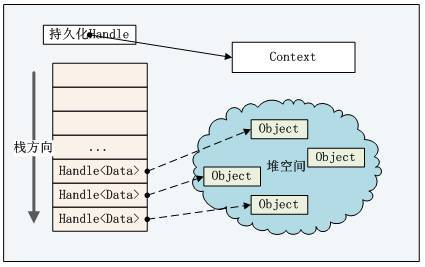

# 使用 Google V8 引擎开发可定制的应用程序
Google V8 引擎使用

**标签:** Node.js

[原文链接](https://developer.ibm.com/zh/articles/os-cn-v8engine/)

邱俊涛

发布: 2012-04-12

* * *

## V8 引擎概览

### V8 引擎简介

Google V8 引擎使用 C++ 代码编写，实现了 ECMAScript 规范的第五版，可以运行在所有的主流

操作系统中，甚至可以运行在移动终端 ( 基于 ARM 的处理器，如 HTC G7 等 )。V8 最早被开发用以嵌入到 Google 的开源浏览器 Chrome 中，但是 V8 是一个可以独立的模块，完全可以嵌入您自己的应用，著名的 Node.js( 一个异步的服务器框架，可以在服务端使用 JavaScript 写出高效的网络服务器 ) 就是基于 V8 引擎的。

和其他 JavaScript 引擎一样，V8 会编译 / 执行 JavaScript 代码，管理内存，负责垃圾回收，与宿主语言的交互等。V8 的垃圾回收器采用了众多技术，使得其运行效率大大提高。通过暴露宿主对象 ( 变量，函数等 ) 到 JavaScript，JavaScript 可以访问宿主环境中的对象，并在脚本中完成对宿主对象的操作。

## V8 引擎基本概念

##### 图 1\. V8 引擎基本概念关系图 ( 根据 Google V8 官方文档 )



### handle

handle 是指向对象的指针，在 V8 中，所有的对象都通过 handle 来引用，handle 主要用于 V8 的垃圾回收机制。

在 V8 中，handle 分为两种：持久化 (Persistent)handle 和本地 (Local)handle，持久化 handle 存放在堆上，而本地 handle 存放在栈上。这个与 C/C++ 中的堆和栈的意义相同 ( 简而言之，堆上的空间需要开发人员自己申请，使用完成之后显式的释放；而栈上的为自动变量，在退出函数 / 方法之后自动被释放 )。持久化 handle 与本地 handle 都是 Handle 的子类。在 V8 中，所有数据访问均需要通过 handle。需要注意的是，使用持久化 handle 之后，需要显式的调用 Dispose() 来通知垃圾回收机制。

### 作用域 (scope)

scope 是 handle 的集合，可以包含若干个 handle，这样就无需将每个 handle 逐次释放，而是直接释放整个 scope。

在使用本地 handle 时，需要声明一个 HandleScope 的实例，scope 是 handle 的容器，使用 scope，则无需依次释放 handle。

```
HandleScope handle_scope;
Local<ObjectTemplate> temp;

```

Show moreShow more icon

### 上下文 (context)

context 是一个执行器环境，使用 context 可以将相互分离的 JavaScript 脚本在同一个 V8 实例中运行，而互不干涉。在运行 JavaScript 脚本是，需要显式的指定 context 对象。

### 数据及模板

由于 C++ 原生数据类型与 JavaScript 中数据类型有很大差异，因此 V8 提供了 Data 类，从 JavaScript 到 C++，从 C++ 到 JavaScrpt 都会用到这个类及其子类，比如：

```
Handle<Value> Add(const Arguments& args){
     int a = args[0]->Uint32Value();
     int b = args[1]->Uint32Value();

     return Integer::New(a+b);
}

```

Show moreShow more icon

Integer 即为 Data 的一个子类。

V8 中，有两个模板 (Template) 类 ( 并非 C++ 中的模板类 )：对象模板 (ObjectTempalte) 和函数模板 (FunctionTemplate)，这两个模板类用以定义 JavaScript 对象和 JavaScript 函数。我们在后续的小节部分将会接触到模板类的实例。通过使用 ObjectTemplate，可以将 C++ 中的对象暴露给脚本环境，类似的，FunctionTemplate 用以将 C++ 函数暴露给脚本环境，以供脚本使用。

初始化 context 是使用 V8 引擎所必需的过程，代码非常简单：

```
Persistent<Context> context = Context::New();

```

Show moreShow more icon

## V8 引擎使用示例

有了上面所述的基本概念之后，我们来看一下一个使用 V8 引擎的应用程序的基本流程：

1. 创建 HandleScope 实例
2. 创建一个持久化的 Context
3. 进入 Context
4. 创建脚本字符串
5. 创建 Script 对象，通过 Script::Compile()
6. 执行脚本对象的 Run 方法
7. 获取 / 处理结果
8. 显式的调用 Context 的 Dispose 方法

### 基本代码模板

##### 清单 1\. 代码模块

```
#include <v8.h>

using namespace v8;

int main(int argc, char *argv[]) {
     // 创建一个句柄作用域 ( 在栈上 )
     HandleScope handle_scope;

     // 创建一个新的上下文对象
     Persistent<Context> context = Context::New();

     // 进入上一步创建的上下文，用于编译执行 helloworld
     Context::Scope context_scope(context);

     // 创建一个字符串对象，值为'Hello, Wrold!', 字符串对象被 JS 引擎
     // 求值后，结果为'Hello, World!'
     Handle<String> source = String::New("'Hello' + ', World!'");

     // 编译字符串对象为脚本对象
     Handle<Script> script = Script::Compile(source);

     // 执行脚本，获取结果
     Handle <Value> result = script->Run();

     // 释放上下文资源
     context.Dispose();

     // 转换结果为字符串
     String::AsciiValue ascii(result);

     printf("%s\n", *ascii);

     return 0;
}

```

Show moreShow more icon

以上代码为一个使用 V8 引擎来运行脚本的基本模板，可以看到，开发人员可以很容易的在自己的代码中嵌入 V8 来处理 JavaScript 脚本。我们在下面小节中详细讨论如何在脚本中访问 C++ 资源。

### 使用 C++ 变量

在 JavaScript 与 V8 间共享变量事实上是非常容易的，基本模板如下：

##### 清单 2\. 共享变量

```
static type xxx;

static Handle<Value> xxxGetter(
     Local<String> name,
     const AccessorInfo& info){

     //code about get xxx
}

static void xxxSetter(
     Local<String> name,
     Local<Value> value,
     const AccessorInfo& info){

     //code about set xxx
}

```

Show moreShow more icon

首先在 C++ 中定义数据，并以约定的方式定义 getter/setter 函数，然后需要将 getter/setter 通过下列机制公开给脚本：

```
global->SetAccessor(String::New("xxx"), xxxGetter, xxxSetter);

```

Show moreShow more icon

其中，global 对象为一个全局对象的模板：

```
Handle<ObjectTemplate> global = ObjectTemplate::New();

```

Show moreShow more icon

下面我们来看一个实例：

##### 清单 3\. 实例 1

```
static char sname[512] = {0};

static Handle<Value> NameGetter(Local<String> name,
         const AccessorInfo& info) {
     return String::New((char*)&sname,strlen((char*)&sname));
}

static void NameSetter(Local<String> name,
         Local<Value> value,
         const AccessorInfo& info) {
     Local<String> str = value->ToString();
     str->WriteAscii((char*)&sname);
}

```

Show moreShow more icon

定义了 NameGetter, NameSetter 之后，在 main 函数中，将其注册在 global 上：

```
// Create a template for the global object.
Handle<ObjectTemplate> global = ObjectTemplate::New();

//public the name variable to script
global->SetAccessor(String::New("name"), NameGetter, NameSetter);

在 C++ 中，将 sname 的值设置为”cpp”：

//set sname to "cpp" in cpp program
strncpy(sname, "cpp", sizeof(sname));

然后在 JavaScript 中访问该变量，并修改：

print(name);

//set the variable `name` to "js"
name='js';
print(name);

```

Show moreShow more icon

运行结果如下：

```
cpp
js

```

Show moreShow more icon

运行脚本，第一个 print 调用会打印在 C++ 代码中设置的 name 变量的值：cpp，然后我们在脚本中修改 name 值为：js，再次调用 print 函数则打印出设置后的值：js。

### 调用 C++ 函数

在 JavaScript 中调用 C++ 函数是脚本化最常见的方式，通过使用 C++ 函数，可以极大程度的增强 JavaScript 脚本的能力，如文件读写，网络 / 数据库访问，图形 / 图像处理等等，而在 V8 中，调用 C++ 函数也非常的方便。

在 C++ 代码中，定义以下原型的函数：

```
Handle<Value> function(constArguments& args){
     //return something
}

```

Show moreShow more icon

然后，再将其公开给脚本：

```
global->Set(String::New("function"),FunctionTemplate::New(function));

```

Show moreShow more icon

同样，我们来看两个示例：

##### 清单 4\. 实例 2

```
Handle<Value> Add(const Arguments& args){
     int a = args[0]->Uint32Value();
     int b = args[1]->Uint32Value();

     return Integer::New(a+b);
}

Handle<Value> Print(const Arguments& args) {
     bool first = true;
     for (int i = 0; i < args.Length(); i++) {
         HandleScope handle_scope;
         if (first) {
             first = false;
         } else {
             printf(" ");
         }
         String::Utf8Value str(args[i]);
         const char* cstr = ToCString(str);
         printf("%s", cstr);
     }
     printf("\n");
     fflush(stdout);
     return Undefined();
}

```

Show moreShow more icon

函数 Add 将两个参数相加，并返回和。函数 Print 接受任意多个参数，然后将参数转换为字符串输出，最后输出换行。

```
global->Set(String::New("print"), FunctionTemplate::New(Print));
global->Set(String::New("add"), FunctionTemplate::New(Add));

```

Show moreShow more icon

我们定义以下脚本：

```
var x = (function(a, b){
     return a + b;
})(12, 7);

print(x);

//invoke function add defined in cpp
var y = add(43, 9);
print(y);

```

Show moreShow more icon

运行结果如下：

```
19
52

```

Show moreShow more icon

### 使用 C++ 类

如果从面向对象的视角来分析，最合理的方式是将 C++ 类公开给 JavaScript，这样可以将 JavaScript 内置的对象数量大大增加，从而尽可能少的使用宿主语言，而更大的利用动态语言的灵活性和扩展性。事实上，C++ 语言概念众多，内容繁复，学习曲线较 JavaScript 远为陡峭。最好的应用场景是：既有脚本语言的灵活性，又有 C/C++ 等系统语言的效率。使用 V8 引擎，可以很方便的将 C++ 类”包装”成可供 JavaScript 使用的资源。

我们这里举一个较为简单的例子，定义一个 Person 类，然后将这个类包装并暴露给 JavaScript 脚本，在脚本中新建 Person 类的对象，使用 Person 对象的方法。

首先，我们在 C++ 中定义好类 Person：

##### 清单 5\. 定义类

```
class Person {
private:
     unsigned int age;
     char name[512];

public:
     Person(unsigned int age, char *name) {
         this->age = age;
         strncpy(this->name, name, sizeof(this->name));
     }

     unsigned int getAge() {
         return this->age;
     }

     void setAge(unsigned int nage) {
         this->age = nage;
     }

     char *getName() {
         return this->name;
     }

     void setName(char *nname) {
         strncpy(this->name, nname, sizeof(this->name));
     }
};

```

Show moreShow more icon

Person 类的结构很简单，只包含两个字段 age 和 name，并定义了各自的 getter/setter. 然后我们来定义构造器的包装：

```
Handle<Value> PersonConstructor(const Arguments& args){
     Handle<Object> object = args.This();
     HandleScope handle_scope;
     int age = args[0]->Uint32Value();

     String::Utf8Value str(args[1]);
     char* name = ToCString(str);

     Person *person = new Person(age, name);
     object->SetInternalField(0, External::New(person));
     return object;
}

```

Show moreShow more icon

从函数原型上可以看出，构造器的包装与上一小节中，函数的包装是一致的，因为构造函数在 V8 看来，也是一个函数。需要注意的是，从 args 中获取参数并转换为合适的类型之后，我们根据此参数来调用 Person 类实际的构造函数，并将其设置在 object 的内部字段中。紧接着，我们需要包装 Person 类的 getter/setter：

```
Handle<Value> PersonGetAge(const Arguments& args){
     Local<Object> self = args.Holder();
     Local<External> wrap = Local<External>::Cast(self->GetInternalField(0));

     void *ptr = wrap->Value();

     return Integer::New(static_cast<Person*>(ptr)->getAge());
}

Handle<Value> PersonSetAge(const Arguments& args)
{
     Local<Object> self = args.Holder();
     Local<External> wrap = Local<External>::Cast(self->GetInternalField(0));

     void* ptr = wrap->Value();

     static_cast<Person*>(ptr)->setAge(args[0]->Uint32Value());
     return Undefined();
}

```

Show moreShow more icon

而 getName 和 setName 的与上例类似。在对函数包装完成之后，需要将 Person 类暴露给脚本环境：

首先，创建一个新的函数模板，将其与字符串”Person”绑定，并放入 global：

```
Handle<FunctionTemplate> person_template = FunctionTemplate::New(PersonConstructor);
person_template->SetClassName(String::New("Person"));
global->Set(String::New("Person"), person_template);

```

Show moreShow more icon

然后定义原型模板：

```
Handle<ObjectTemplate> person_proto = person_template->PrototypeTemplate();

person_proto->Set("getAge", FunctionTemplate::New(PersonGetAge));
person_proto->Set("setAge", FunctionTemplate::New(PersonSetAge));

person_proto->Set("getName", FunctionTemplate::New(PersonGetName));
person_proto->Set("setName", FunctionTemplate::New(PersonSetName));

```

Show moreShow more icon

最后设置实例模板：

```
Handle<ObjectTemplate> person_inst = person_template->InstanceTemplate();
person_inst->SetInternalFieldCount(1);

```

Show moreShow more icon

随后，创建一个用以测试的脚本：

```
//global function to print out detail info of person
function printPerson(person){
    print(person.getAge()+":"+person.getName());
}

//new a person object
var person = new Person(26, "juntao");

//print it out
printPerson(person);

//set new value
person.setAge(28);
person.setName("juntao.qiu");

//print it out
printPerson(person);

```

Show moreShow more icon

运行得到以下结果：

```
26:juntao
28:juntao.qiu

```

Show moreShow more icon

## 简单示例

在这一小节中，我们将编写一个简单的桌面计算器：表达式求值部分通过 V8 引擎来进行，而流程控制部分则放在 C++ 代码中，这样可以将表达式解析等复杂细节绕开。同时，我们还得到了一个额外的好处，用户在脚本中可以自定义函数，从而可以在计算器中定义自己的运算规则。

### 桌上计算器

计算器程序首先进入一个 MainLoop，从标准输入读取一行命令，然后调用 V8 引擎去求值，然后将结果打印到控制台，然后再进入循环：

##### 清单 6\. 桌面计算器示例

```
void MainLoop(Handle<Context> context) {
     while(true) {
         char buffer[1024] = {0};
         printf("$ ");
         char *str = fgets(buffer, sizeof(buffer), stdin);
         if(str == NULL) {
             break;
         }
         HandleScope handle_scope;
         ExecuteString(String::New(str), String::New("calc"), true);
     }
}

```

Show moreShow more icon

在 main 函数中设置全局对象，创建上下文对象，并进入 MainLoop：

```
int main(int argc, char *argv[]){
     HandleScope handle_scope;

     // Create a template for the global object.
     Handle<ObjectTemplate> global = ObjectTemplate::New();

     // Expose the local functions to script
     global->Set(String::New("load"), FunctionTemplate::New(Load));
     global->Set(String::New("print"), FunctionTemplate::New(Print));
     global->Set(String::New("quit"), FunctionTemplate::New(Quit));

     // Create a new execution environment containing the built-in
     // functions
     Handle<Context> context = Context::New(NULL, global);

     // Enter the newly created execution environment.
     Context::Scope context_scope(context);

     // Enter main loop
     MainLoop(context);

     V8::Dispose();

     return 0;
}

```

Show moreShow more icon

在 main 函数中，为脚本提供了三个函数，load 函数用以将用户指定的脚本加载进来，并放入全局的上下文中一边引用，print 函数用以打印结果，而 quit 提供用户退出计算器的功能。

测试一下：

```
$ 1+2
3

$ (10+3)/(9.0-5)
3.25

$ typeof print
function

$ typeof non
undefined

// 自定义函数
$ function add(a, b){return a+b;}
$ add(999, 2323)
3322

// 查看 print 标识符的内容
$ print
function print() { [native code] }

```

Show moreShow more icon

load 函数提供了用户自定义函数的功能，将脚本文件作为一个字符串加载到内存，然后对该字符串编译，求值，并将处理过的脚本对象放入当前 context 中，以便用户使用。

```
Handle<Value> Load(const Arguments& args){
     if(args.Length() != 1){
         return Undefined();
     }

     HandleScope handle_scope;
     String::Utf8Value file(args[0]);

     Handle<String> source = ReadFile(*file);
     ExecuteString(source, String::New(*file), false);

     return Undefined();
}

而 ExecuteString 函数，负责将字符串编译运行：

bool ExecuteString(Handle<String> source,
                   Handle<Value> name,
                   bool print_result)
{
     HandleScope handle_scope;
     TryCatch try_catch;
     Handle<Script> script = Script::Compile(source, name);
     if (script.IsEmpty()) {
         return false;
     } else {
         Handle<Value> result = script->Run();
         if (result.IsEmpty()) {
             return false;
         } else {
             if (print_result && !result->IsUndefined()) {
                 String::Utf8Value str(result);
                 const char* cstr = ToCString(str);
                 printf("%s\n", cstr);
             }
             return true;
         }
     }
}

```

Show moreShow more icon

将下列内容存入一个文本文件，并命令为 calc.js：

```
function sum(){
     var s = 0;
     for(var i = 0; i < arguments.length; i++){
         s += arguments[i];
     }
     return s;
}

function avg(){
     var args = arguments;
     var count = args.length;
     var sum = 0;
     for(var i = 0; i < count; i++){
         sum += args[i];
     }
     return sum/count;
}

```

Show moreShow more icon

然后在计算器中测试：

```
// 此时 sum 符号位定义
$ typeof sum
undefined

// 加载文件，并求值
$ load("calc.js")

// 可以看到，sum 的类型为函数
$ typeof sum
function

$ sum(1,2,3,4,5,6,7,8,9)
45

```

Show moreShow more icon

## 结束语

使用 V8 引擎，可以轻松的将脚本的好处带进 C++ 应用，使得 C++ 应用更具灵活性，扩展性。我们在文中讨论了基本的模板，如何使用 C++ 变量，函数，以及类。最后的实例中给出了一个计算器的原型。由于 V8 的设计原则，开发人员可以快速的将其嵌入到自己的应用中，并且无需太过担心脚本语言的执行效率。

## 下载示例代码

[v8demo.zip](http://www.ibm.com/developerworks/cn/opensource/os-cn-v8engine/v8demo.zip)