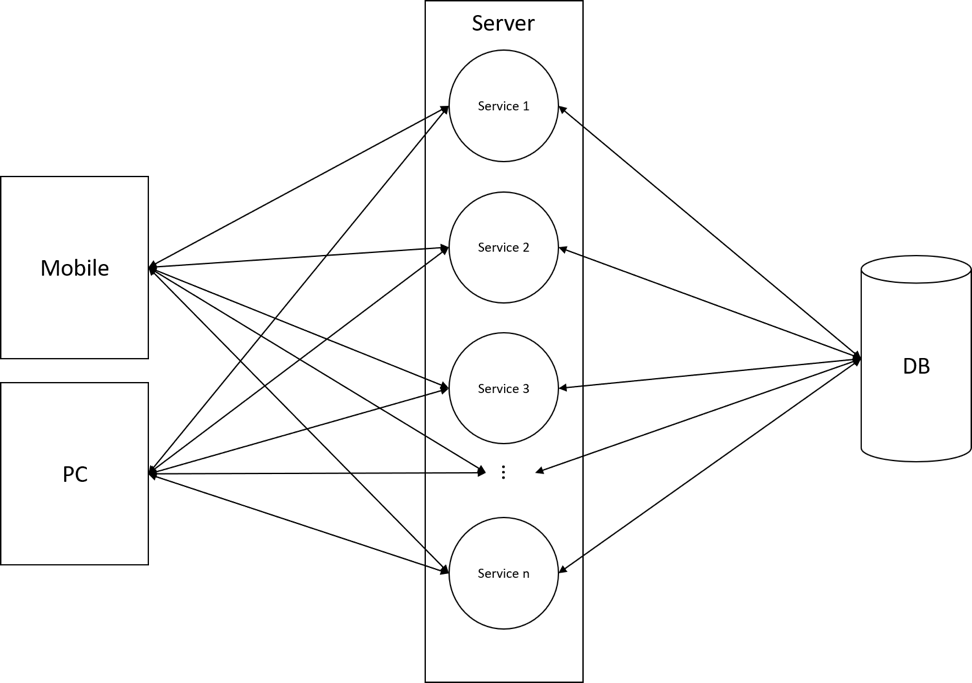
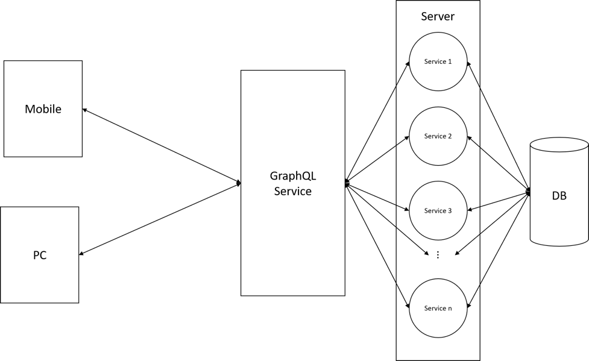
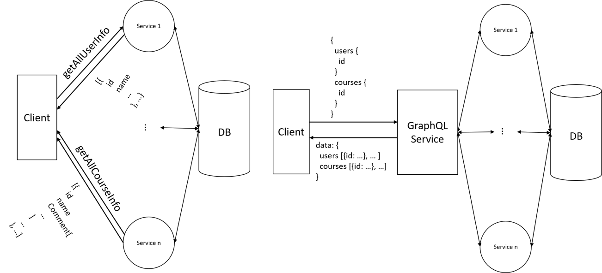
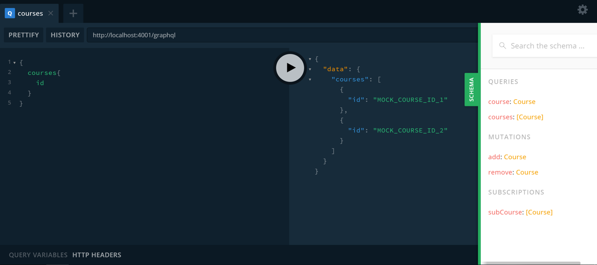

# 使用 GraphQL 定制数据结构
了解什么是 GraphQL、GraphQL 的基础语法以及如何在项目中使用 GraphQL

**标签:** API 管理,DevOps,Web 开发

[原文链接](https://developer.ibm.com/zh/articles/wa-using-graphgl-to-customize-data-structure/)

缪 运泽, 阮 奇, 吴 圣剧

发布: 2019-06-17

* * *

GraphQL 是一种面向 API 的查询语言。通过应用 GraphQL，客户端开发者不必直接与后台 API 接口打交道，而是通过向 GraphQL 声明所需数据结构，从而索取目标数据。GraphQL 的引入能够有效提高客户端的开发效率，使客户端的开发者不再受限于服务器提供的接口，而是能够根据业务需求自由定制需要的数据内容。

GraphQL 现已被较多开发团队所采用，如 Facebook、Twitter、GitHub、Coursera 等。

## GraphQL 介绍

GraphQL 作为查询语言，开发者通过声明其所需要的数据格式，向 GraphQL Service 发起请求并取得对应的数据。在传统的客户端/服务器通信过程中，客户端向服务器发送网络请求，服务器收到请求后执行相应操作并返回数据。下图展示了未引入 GraphQL 的系统结构：



引入 GraphQL 后，客户端不再与服务器直接通信，而是通过 GraphQL Service 获取数据。下图展示了引入 GraphQL 的系统结构：



下图展示了从多个 service 请求特定数据时，引入 GraphQL 的前后对比：



与传统的客户端/服务器通信模式相比，GraphQL 的引入为整个系统增加了一个中间层，屏蔽了前后端的具体数据结构。其主要优势包括以下几点：

1. **定制所需的数据** ：客户端可以定制自己想要的数据结构。通过在请求中声明所需的数据结构，从 GraphQL Service 中获取想要的数据。Service 返回的数据结构将与客户端的请求完全一致，从而减少冗余数据的传输。在不使用 GraphQL 的情况下，返回的数据格式不受客户端控制。
2. **单个请求获取多个资源** ：在 GraphQL 中，客户端不再关心请求的来源，而是直接将需要的资源写入请求字段。在不使用 GraphQL 的情况下，当需要从不同的 Service 取得数据时，客户端开发者需要对不同的 Service 发起请求。
3. **结构即文档** ：GraphQL 具有友好的调试界面，开发者可直接在该界面中查询 GraphQL 提供的服务。这种数据结构即文档的显示方式，使开发者能够方便快捷地查找所需要的数据类型。
4. **订阅功能** ：GraphQL 提供订阅功能，使得客户端能够监听数据变化，让 GraphQL Service 能够主动将变动的数据推送至客户端，实时在界面上进行显示。

## GraphQL 语法简介

GraphQL 拥有一套自己的语法规则，对用户所使用的具体开发语言并不做限制。

### GraphQL 的基本类型

GraphQL 中预定义了以下几类基本类型：

- Int: 有符号的 32 位整数，如 1, -3 等。
- Float: 有符号的双精度浮点值，如 1.234 等。
- String: 字符串，如 `hello world` 等。
- Boolean: true/false。
- ID: 一个唯一标识符，如对象中的 key 等。其序列化方式与 String 相同，但定义为 ID 时通常表示该类型不需要具备可读性，如一串哈希值等。

### 在 GraphQL 中自定义类型

用户可以利用这些基本类型定义自己在项目中实际需要的类型，定义规则与 JSON 类似:

```
type TypeName {
KEY: TYPE[DECORATE]
...
}

```

Show moreShow more icon

大括号中的各行遵循 `KEY:TYPE` 的模式，其中 KEY 为该类型所包含的键，可以为任意字符串； `TYPE` 为 `KEY` 的类型，可以是 GraphQL 中预定义类型中的任意一种，也可以是用户定义好的其他自定义类型。假设我们需要定义一个课程类型 Course，该类型包含课程 ID(id) 和课程名称 (name) 等信息，我们可进行如下定义：

```
type Course {
id: ID
name:  String
}

```

Show moreShow more icon

假设我们的 Course 还包含一条评论信息 comment (Comment 是一个预先定义好的类型，包含 ID 类型的 id 和 String 类型的 content)，我们可以进行如下定义:

```
type Course {
id: ID
name: String
comment: Comment
...
}

```

Show moreShow more icon

另外，我们还可用中括号 `[]` 或感叹号 `!` 修饰 TYPE，表明该 key 的类型是非空或数组。假设 Course 中的 id 不可为空，且每个 Course 含有多条评论信息，则我们可将 Course 的定义修改为:

```
type Course {
id: ID!
name: String
comment: [Comment]
}

```

Show moreShow more icon

### GraphQL 的基本操作

GraphQL 的主要操作包括查询 (Query)、变更 (Mutation) 和订阅 (Subscription)。客户端通过 Query 从 Service 获取数据，通过 Mutation 向 Service 发起变更操作(增删改)，通过 Subscription 向 Service 发起订阅请求并建立套接字链接，监听相关数据的变更。

#### 查询 (Query)

假设 Service 已提供获取全部课程的操作 courses 及通过 id 获取 course 的操作 `course(String id)` 。需要获取所有课程的 id 及对应的评论时，对应的请求可写作：

```
query getCourses{
courses {
      id
    comment {
      content
      }
}
}

```

Show moreShow more icon

其中 `query` 为关键字(可省略)，表明该操作为 `query` 操作。 `getCourses` 为操作名称(可省略)，由开发自定义。

需要根据课程 id 获取某个课程的名字时，对应的请求可写作：

```
query getCourse{
course (id: "COURSEID") {
    name
}
}

```

Show moreShow more icon

从以上 Query 操作中可以看出，在发起请求时，我们可以根据实际的需要请求数据，Service 会根据请求返回对应的 Course 信息，而非将 Course 的所有信息全部返回。另外需要注意的是，在 GraphQL 中，任何请求字段的根节点必须是 GraphQL 预定义的基本类型。也就是说，在请求中需明确指明所需的字段。下面是一个获取某 course 中 comment 内容的错误写法：

```
query getCourse{
course (id: "COURSEID") {
    comment
}
}

```

Show moreShow more icon

当我们需要 comment 的相关信息时，需在请求中指明具体的字段 (如 id, content 等)。仅仅列出 comment 字段，GraphQL Service 无法判断我们需要的具体字段内容。

另外，在 `query` 中，我们还能同时请求其他 Service 提供的数据。假设除了课程信息外，我们还想在同一个请求中获取所有用户的信息，可以写作：

```
query getAll {
courses : {... }
users: {... }
}

```

Show moreShow more icon

#### 变更 (Mutation)

假设 Service 已提供增加课程的操作 `add (Course course)` ，修改课程的操作 `update (String id, Course course)` ，移除课程的操作 `remove (String id)` ， 对应的客户端请求可写作：

```
mutation opertaionCourse{
add(...) / update(...) / remove(...)
}

```

Show moreShow more icon

其中 `mutation` 表明该操作是一个变更操作， `opertaionCourse` 为操作名，可由用户自定义。大括号中的 add/update/remove 为具体操作，之后的小括号用于传递操作的参数。需要注意的是， `mutation` 在此处不可省略。另外，当一个 `mutation` 包含多个操作时候，这些操作将并行执行:

```
mutation updateAndRemove {
update (...)
remove (...)
}

```

Show moreShow more icon

以上 `mutation` 操作将先执行更新动作，再执行删除动作。

对于 query 中的多个操作和 mutation 中的多个操作，我们可以分别理解为 `Promise.all[oper1, oper2,...]` 和 `new Promise(oper1).then((res) => oper2...)` 。

#### 订阅 (Subscription)

假设 Service 已提供订阅所有课程信息的操作，客户端想要保持监听，对应的请求可写作：

```
subscription subCourse{
    courses {
      id
    comment {
      content
    }
}
}

```

Show moreShow more icon

与 Mutation 类似，Subscription 表明该操作为订阅操作， `subCourse` 为操作名，由用户自定义。 `subCourse` 操作将持续监听所有 course 的 id 和对应评论的内容。当监听的信息更新时，服务端会自动将更新后的全部信息(这里的全部信息指的是 `subCourse` 中指明的，所有课程的 id 和对应评论的内容，而非仅发生更新的部分)发送至客户端。

## 通过 Apollo 快速搭建 GraphQL 开发环境

前面的内容介绍了 GraphQL 的语法和基本操作，本节将介绍如何建立一个完整的 GraphQL 实例。GraphQL 并未对开发语言进行要求，开发者可以根据实际需求选择开发语言。在这里，我们采用 JavaScript 进行开发。

GraphQL 的官网对如何构建简单的 GraphQL Service 提供了简单的代码段。但在实际开发过程中，借助现有的 GraphQL 框架，能够帮住我们更快更好的完成开发。

当前业内流行的框架包括 Apollo 和 Relay。其中 Relay 由 Facebook 官方开发，是 Facebook 自从开始使用 GraphQL 后逐步衍生出来的工具。其对性能进行了大量优化，并尽可能的降低了网络流量。但 Relay 曲线的学习陡峭对新人并不友好。

Apollo 是一个由社区驱动开发，易于理解，灵活且功能强大的 GraphQL 框架。Apollo 具有开箱即用，订阅支持等多个功能。其强大的社区支持和平缓的学习曲线对新手非常友好。

下面采用 Apollo 作为开发框架，介绍如何通过 Apollo 搭建一套完整的 GraphQL 的服务端和客户端。

**_搭建 GraphQL 的服务端_**

1. 新建 `graphql-service`, 进入文件夹，执行 `npm init -y`
2. 通过 `npm` 安装需要的依赖:


    ```
            npm install graphql express apollo-server apollo-server-express graphql-subscriptions

    ```


    Show moreShow more icon

3. 新建文件 `index.js`:


    ```
        const http = require('http');
        const express = require('express');
        const { ApolloServer } = require('apollo-server-express');
        const { gql } = require('apollo-server');
        const { PubSub, withFilter } = require("graphql-subscriptions");
        const pubsub = new PubSub();

        let typeDefs =...;
        let resolvers =...;

        const server = new ApolloServer({
          typeDefs,
          resolvers,
          subscriptions: {
            path: '/subscription'
          },
          playground: true
        });

        const app = express();

        server.applyMiddleware({ app });

        const httpServer = http.createServer(app);
        server.installSubscriptionHandlers(httpServer);

        httpServer.listen({ port: 4001 }, () => {
          console.log(`Server ready`);
        });

    ```


    Show moreShow more icon


下面介绍一下以上代码中的关键部分：

- `const pubsub = new PubSub()` ：定义了一个产生事件的工厂，我们将通过这个变量实现订阅功能，其具体使用方法会在稍后说明。
- 构建 ApolloServer 的参数： `typeDefs` 、 `resolvers` 、 `subscription` 和 `playground` ，其中：

    - `typeDef` ：为 GraphQL 中的声明部分，包括自定义类型的声明和 server 支持的各类操作的声明，其主要内容为：


        ```
                typeDefs = gql`
                  type Comment {
                  id: ID!
                  content: String
                }
                type Course {
                  id: ID!
                  name: String
                  comment: [Comment]
                }
                type Query {
                  course: Course
                  courses: [Course]
                }
                type Mutation {
                  add: Course
                  remove: Course
                }
                type Subscription {
                  subCourse: [Course]
                }

        ```


        Show moreShow more icon

    - `resolvers` 为 `typeDefs` 中声明的各个操作的定义，其主要内容为：


        ```
                {
                Query: {
                  course: () => ({
                    id: 'MOCK_COURSE_ID_1',
                    name: 'MOCK_COURSE_NAME_1',
                    comment: [{
                      id: 'MOCK_COMMENT_ID_1',
                      content: 'MOCK_COMMENT_CONTENT_1'
                    }, {
                      id: 'MOCK_COMMENT_ID_2',
                      content: 'MOCK_COMMENT_CONTENT_2'
                    }]
                  }),
                  courses: () => [{
                    id: 'MOCK_COURSE_ID_1',
                    name: 'MOCK_COURSE_NAME_1',
                    comment: [{
                      id: 'MOCK_COMMENT_ID_1',
                      content: 'MOCK_COMMENT_CONTENT_1'
                    }, {
                      id: 'MOCK_COMMENT_ID_2',
                      content: 'MOCK_COMMENT_CONTENT_2'
                    }]
                  }, {
                    id: 'MOCK_COURSE_ID_2',
                    name: 'MOCK_COURSE_NAME_2',
                    comment: [{
                      id: 'MOCK_COMMENT_ID_2_1',
                      content: 'MOCK_COMMENT_CONTENT_2_1'
                    }]
                  }]
                },
                Mutation: {
                  add: () => {},
                  remove: () => {
                    pubsub.publish('ALL_COURSES', {
                      subCourse: [{
                        id: 'MOCK_COURSE_ID_1',
                        name: 'MOCK_COURSE_NAME_1',
                        comment: [{
                          id: 'MOCK_COMMENT_ID_2',
                          content: 'MOCK_COMMENT_CONTENT_2'
                        }]
                      }]
                    });
                    return {
                      id: 'MOCK_COURSE_ID_2',
                      name: 'MOCK_COURSE_NAME_2',
                      comment: [{
                        id: 'MOCK_COMMENT_ID_2_1',
                        content: 'MOCK_COMMENT_CONTENT_2_1'
                      }]
                    }
                  }
                },
                Subscription: {
                  subCourse: {
                    subscribe: () => pubsub.asyncIterator('ALL_COURSES')
                  }
                }
              };

        ```


        Show moreShow more icon

    - `subscription` ：用于设置订阅路径。
    - `playground` ：设为 `true` ，用于开启 GraphQL 调试的浏览器 IDE。
- `server.installSubscriptionHandlers(httpServer)` ：为现有的 server 增加订阅功能。

由以上代码可以看出， `resolvers` 实际上是一个对象，其包含 Query、Mutation 和 Subscription，他们所包含的内容与 `typeDefs` 中声明的各个方法一一对应，是各声明的具体实现。

在 `resolvers` 中，需要注意的是 Mutation 中的变更操作 `remove` 和 Subscription 的订阅定义 `subCourse` 。在 Mutation 的 `remove` 方法中，我们返回了一个 `Course` 对象。该对象为当客户端调用该方法时获得的值。除此之外，我们还在 `remove` 方法中调用了方法 `pubsub.publish(EVENT_NAME, DATA)` 。该方法将在 server 中广播一个名为 `EVENT_NAME`,值为 `DATA` 的事件。在 Subscription 中的 `subCourse` 是一个 key 为 `subscribe`, value 为 `() => pubsub.asyncIterator('ALL_COURSES')` 的对象。其表明 `subCourse` 会监听广播中 `EVENT_NAME` 为 `ALL_COURSES` 的事件。捕获到该事件时，server 会将事件 DATA 中 key 为 `subCourse` 的数据推送至客户端。

执行 `node index.js` ，在控制台中看到 `Server ready` 表明 GraphQL Server 已成功运行。打开浏览器，在地址栏输入 `http://localhost:4001/graphql` 即可进入 GraphQL 自带的 IDE 调试界面。如下图（GraphQL 自带的 IDE 界面截图）所示，用户可以在左边栏输入查询/变更/订阅等操作，输入完成后点击中间的开始按钮，GraphQL 返回的数据将在右边栏显示。



另外，用户还可以在屏幕最右边的 SCHEMA 中查看 GraphQL 提供的所有操作及自定义的各种类型。

**_搭建 GraphQL 的客户端_**

Apollo 客户端能够支持 React、React Native、Vue、Angular 等多种框架，这里我们选择 React 作为实例。

搭建 GraphQL 的服务端的步骤如下：

1. 利用 React 官方提供的库 `create-react-app` 直接创建工程，在命令输入:


    ```
            create-react-app graphql-client

    ```


    Show moreShow more icon

2. 进入 `graphql-client` 目录，执行 `npm install` 安装依赖。

3. 安装 GraphQL 相关依赖:


    ```
            npm install apollo react-apollo graphql-tag apollo-boost

    ```


    Show moreShow more icon

    _注意：Apollo 提供了两种包含 `ApolloClient` 的库，分别为 `apollo-boost` 和 `apollo-client`。其区别在于 `apollo-boost` 暴露的 `ApolloClient` 已对 Client 做好大多配置 `apollo-client` 暴露的 `ApolloClient` 灵活度更高，可配置性更强。方便起见，我们在这采用 `apollo-boost` 提供的 `ApolloClient` 。_

4. 编辑文件 `App.js` ：


    ```
        import...

        import { ApolloProvider, Query } from 'react-apollo';
        import gql from 'graphql-tag';
        import ApolloClient from 'apollo-boost';

        const client = new ApolloClient({
          uri: "http://localhost:4001/graphql"
        });

        function App() {
          return (
            <ApolloProvider client={client}>
              <Query query={
                gql`{
                courses {
                  id
                }
              }`
              >
                {({data}) => {
                  if(data) {
                    console.log(data)
                  }
                  return null
                }}
              </Query>
            <div className="App">
             ...
            </div>
            </ApolloProvider>
          );
        }

        export default App;

    ```


    Show moreShow more icon


在 `App.js` 中，我们新建了一个 `ApolloClient`，设置其请求地址，然后通过 `ApolloProvide` 传入该 client。这样，在应用的其他组件中，当要执行 Query/Mutation/Subscription 操作时，从库 `react-apollo` 中引入对应标签，并传入对应的 `gql` 语句(写法可参照之前的章节 – [GraphQL 语法简介](#graphql-语法简介))即可。

执行 `npm start` 启动应用，应用成功运行后会自动在浏览器中打开页面 `localhost: 3000`。在浏览器的控制台中，将看到打印出的从 GraphQL Server 中获取的 courses 信息。

## GraphQL 最佳经验

GraphQL 的实践经验主要包括 **完整原则，敏捷原则** 和 **操作原则** 。具体可参看 GraphQL 的官方网站中 GraphQL 开发原则 ( [https://principles.graphql.cn/](https://principles.graphql.cn/))，此处不再赘述。

## 结束语

GraphQL 的引入能够解耦前后端的开发，在提高开发效率的同时也提供了强大友好的调试界面。但是，并不是所有的场景都适合使用 GraphQL：在已有项目中引入 GraphQL 时，我们需要考虑迁移成本；在整个项目复杂度低，业务场景简单的情况下，没有引入 GraphQL 的必要；在开发过程中，开发者需要根据实际需求，综合考虑是否需要将其引入。