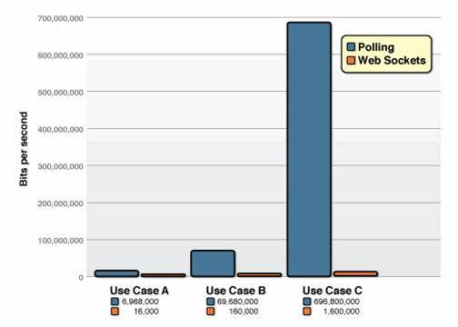
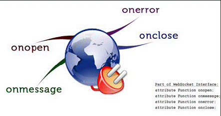
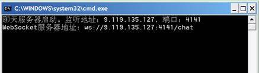
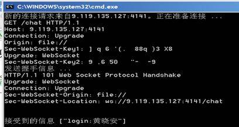
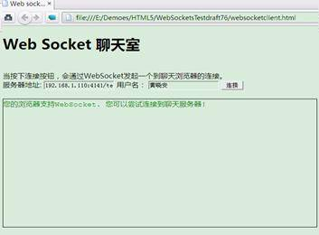
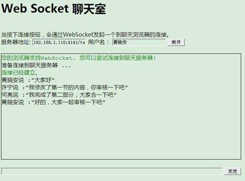

# 使用 HTML5 WebSocket 构建实时 Web 应用
HTML5 WebSocket 简介和实战演练

**标签:** Web 开发

[原文链接](https://developer.ibm.com/zh/articles/1112-huangxa-websocket/)

黄晓安, 何亮, 许宁

发布: 2011-12-15

* * *

作为下一代的 Web 标准，HTML5 拥有许多引人注目的新特性，如 Canvas、本地存储、多媒体编程接口、WebSocket 等等。这其中有”Web 的 TCP ”之称的 WebSocket 格外吸引开发人员的注意。WebSocket 的出现使得浏览器提供对 Socket 的支持成为可能，从而在浏览器和服务器之间提供了一个基于 TCP 连接的双向通道。Web 开发人员可以非常方便地使用 WebSocket 构建实时 web 应用，开发人员的手中从此又多了一柄神兵利器。本文首先介绍 HTML5 WebSocket 的基本概念以及这个规范试图解决的问题，然后介绍 WebSocket 的基本原理和编程接口。接下来会通过一个简单案例来示范怎样实现一个 WebSocket 应用，并且展示 WebSocket 如何在功能强大和编程简单易用上达到的完美统一。最后介绍了目前主流浏览器对 WebSocket 支持的状况、局限性以及未来的展望。

## 实时 Web 应用的窘境

Web 应用的信息交互过程通常是客户端通过浏览器发出一个请求，服务器端接收和审核完请求后进行处理并返回结果给客户端，然后客户端浏览器将信息呈现出来，这种机制对于信息变化不是特别频繁的应用尚能相安无事，但是对于那些实时要求比较高的应用来说，比如说在线游戏、在线证券、设备监控、新闻在线播报、RSS 订阅推送等等，当客户端浏览器准备呈现这些信息的时候，这些信息在服务器端可能已经过时了。所以保持客户端和服务器端的信息同步是实时 Web 应用的关键要素，对 Web 开发人员来说也是一个难题。在 WebSocket 规范出来之前，开发人员想实现这些实时的 Web 应用，不得不采用一些折衷的方案，其中最常用的就是轮询 (Polling) 和 Comet 技术，而 Comet 技术实际上是轮询技术的改进，又可细分为两种实现方式，一种是长轮询机制，一种称为流技术。下面我们简单介绍一下这几种技术：

**轮询**

这是最早的一种实现实时 Web 应用的方案。客户端以一定的时间间隔向服务端发出请求，以频繁请求的方式来保持客户端和服务器端的同步。这种同步方案的最大问题是，当客户端以固定频率向服务器发起请求的时候，服务器端的数据可能并没有更新，这样会带来很多无谓的网络传输，所以这是一种非常低效的实时方案。

**长轮询**

长轮询是对定时轮询的改进和提高，目地是为了降低无效的网络传输。当服务器端没有数据更新的时候，连接会保持一段时间周期直到数据或状态改变或者时间过期，通过这种机制来减少无效的客户端和服务器间的交互。当然，如果服务端的数据变更非常频繁的话，这种机制和定时轮询比较起来没有本质上的性能的提高。

**流**

流技术方案通常就是在客户端的页面使用一个隐藏的窗口向服务端发出一个长连接的请求。服务器端接到这个请求后作出回应并不断更新连接状态以保证客户端和服务器端的连接不过期。通过这种机制可以将服务器端的信息源源不断地推向客户端。这种机制在用户体验上有一点问题，需要针对不同的浏览器设计不同的方案来改进用户体验，同时这种机制在并发比较大的情况下，对服务器端的资源是一个极大的考验。

综合这几种方案，您会发现这些目前我们所使用的所谓的实时技术并不是真正的实时技术，它们只是在用 Ajax 方式来模拟实时的效果，在每次客户端和服务器端交互的时候都是一次 HTTP 的请求和应答的过程，而每一次的 HTTP 请求和应答都带有完整的 HTTP 头信息，这就增加了每次传输的数据量，而且这些方案中客户端和服务器端的编程实现都比较复杂，在实际的应用中，为了模拟比较真实的实时效果，开发人员往往需要构造两个 HTTP 连接来模拟客户端和服务器之间的双向通讯，一个连接用来处理客户端到服务器端的数据传输，一个连接用来处理服务器端到客户端的数据传输，这不可避免地增加了编程实现的复杂度，也增加了服务器端的负载，制约了应用系统的扩展性。

## WebSocket 的拯救

HTML5 WebSocket 设计出来的目的就是要取代轮询和 Comet 技术，使客户端浏览器具备像 C/S 架构下桌面系统的实时通讯能力。 浏览器通过 JavaScript 向服务器发出建立 WebSocket 连接的请求，连接建立以后，客户端和服务器端就可以通过 TCP 连接直接交换数据。因为 WebSocket 连接本质上就是一个 TCP 连接，所以在数据传输的稳定性和数据传输量的大小方面，和轮询以及 Comet 技术比较，具有很大的性能优势。Websocket.org 网站对传统的轮询方式和 WebSocket 调用方式作了一个详细的测试和比较，将一个简单的 Web 应用分别用轮询方式和 WebSocket 方式来实现，在这里引用一下他们的测试结果图：

##### 图 1\. 轮询和 WebSocket 实现方式的网络负载对比图



通过这张图可以清楚的看出，在流量和负载增大的情况下，WebSocket 方案相比传统的 Ajax 轮询方案有极大的性能优势。这也是为什么我们认为 WebSocket 是未来实时 Web 应用的首选方案的原因。

## WebSocket 规范

WebSocket 协议本质上是一个基于 TCP 的协议。为了建立一个 WebSocket 连接，客户端浏览器首先要向服务器发起一个 HTTP 请求，这个请求和通常的 HTTP 请求不同，包含了一些附加头信息，其中附加头信息 **”Upgrade: WebSocket”** 表明这是一个申请协议升级的 HTTP 请求，服务器端解析这些附加的头信息然后产生应答信息返回给客户端，客户端和服务器端的 WebSocket 连接就建立起来了，双方就可以通过这个连接通道自由的传递信息，并且这个连接会持续存在直到客户端或者服务器端的某一方主动的关闭连接。

下面我们来详细介绍一下 WebSocket 规范，由于这个规范目前还是处于草案阶段，版本的变化比较快，我们选择 **draft-hixie-thewebsocketprotocol-76** 版本来描述 WebSocket 协议。因为这个版本目前在一些主流的浏览器上比如 Chrome,、FireFox、Opera 上都得到比较好的支持，您如果参照的是新一些的版本话，内容可能会略有差别。

一个典型的 WebSocket 发起请求和得到响应的例子看起来如下：

##### 清单 1\. WebSocket 握手协议

```
客户端到服务端：
GET /demo HTTP/1.1
Host: example.com
Connection: Upgrade
Sec-WebSocket-Key2: 12998 5 Y3 1 .P00
Upgrade: WebSocket
Sec-WebSocket-Key1: 4@1 46546xW%0l 1 5
Origin: http://example.com
[8-byte security key]

服务端到客户端：
HTTP/1.1 101 WebSocket Protocol Handshake
Upgrade: WebSocket
Connection: Upgrade
WebSocket-Origin: http://example.com
WebSocket-Location: ws://example.com/demo
[16-byte hash response]

```

Show moreShow more icon

这些请求和通常的 HTTP 请求很相似，但是其中有些内容是和 WebSocket 协议密切相关的。我们需要简单介绍一下这些请求和应答信息，”Upgrade:WebSocket”表示这是一个特殊的 HTTP 请求，请求的目的就是要将客户端和服务器端的通讯协议从 HTTP 协议升级到 WebSocket 协议。从客户端到服务器端请求的信息里包含有”Sec-WebSocket-Key1”、”Sec-WebSocket-Key2”和”[8-byte securitykey]”这样的头信息。这是客户端浏览器需要向服务器端提供的握手信息，服务器端解析这些头信息，并在握手的过程中依据这些信息生成一个 16 位的安全密钥并返回给客户端，以表明服务器端获取了客户端的请求，同意创建 WebSocket 连接。一旦连接建立，客户端和服务器端就可以通过这个通道双向传输数据了。

在实际的开发过程中，为了使用 WebSocket 接口构建 Web 应用，我们首先需要构建一个实现了 WebSocket 规范的服务器，服务器端的实现不受平台和开发语言的限制，只需要遵从 WebSocket 规范即可，目前已经出现了一些比较成熟的 WebSocket 服务器端实现，比如：

- Kaazing WebSocket Gateway — 一个 Java 实现的 WebSocket Server
- mod\_pywebsocket — 一个 Python 实现的 WebSocket Server
- Netty —一个 Java 实现的网络框架其中包括了对 WebSocket 的支持
- node.js —一个 Server 端的 JavaScript 框架提供了对 WebSocket 的支持

如果以上的 WebSocket 服务端实现还不能满足您的业务需求的话，开发人员完全可以根据 WebSocket 规范自己实现一个服务器。在”WebSocket 实战”这一节，我们将使用 Microsoft .NET 平台上的 C# 语言来打造一个简单的 WebSocket 服务器，继而构建一个简单的实时聊天系统。

## WebSocket JavaScript 接口

上一节介绍了 WebSocket 规范，其中主要介绍了 WebSocket 的握手协议。握手协议通常是我们在构建 WebSocket 服务器端的实现和提供浏览器的 WebSocket 支持时需要考虑的问题，而针对 Web 开发人员的 WebSocket JavaScript 客户端接口是非常简单的，以下是 WebSocket JavaScript 接口的定义：

##### 清单 2\. WebSocket JavaScript 定义

```
[Constructor(in DOMString url, in optional DOMString protocol)]
interface WebSocket {
readonly attribute DOMString URL;
        // ready state
const unsigned short CONNECTING = 0;
const unsigned short OPEN = 1;
const unsigned short CLOSED = 2;
readonly attribute unsigned short readyState;
readonly attribute unsigned long bufferedAmount;
//networking
attribute Function onopen;
attribute Function onmessage;
attribute Function onclose;
boolean send(in DOMString data);
void close();
};
WebSocket implements EventTarget;

```

Show moreShow more icon

其中 URL 属性代表 WebSocket 服务器的网络地址，协议通常是”ws”,send 方法就是发送数据到服务器端，close 方法就是关闭连接。除了这些方法，还有一些很重要的事件：onopen，onmessage，onerror 以及 onclose。我们借用 **Nettuts** 网站上的一张图来形象的展示一下 WebSocket 接口：

##### 图 2\. WebSocket JavaScript 接口



下面是一段简单的 JavaScript 代码展示了怎样建立 WebSocket 连接和获取数据：

##### 清单 3\. 建立 WebSocket 连接的实例 JavaScript 代码

```
var  wsServer = 'ws://localhost:8888/Demo';
var  websocket = new WebSocket(wsServer);
websocket.onopen = function (evt) { onOpen(evt) };
websocket.onclose = function (evt) { onClose(evt) };
websocket.onmessage = function (evt) { onMessage(evt) };
websocket.onerror = function (evt) { onError(evt) };
function onOpen(evt) {
console.log("Connected to WebSocket server.");
}
function onClose(evt) {
console.log("Disconnected");
}
function onMessage(evt) {
console.log('Retrieved data from server: ' + evt.data);
}
function onError(evt) {
console.log('Error occured: ' + evt.data);
}

```

Show moreShow more icon

## 浏览器支持

下面是主流浏览器对 HTML5 WebSocket 的支持情况：

浏览器支持情况ChromeSupported in version 4+FirefoxSupported in version 4+Internet ExplorerSupported in version 10+OperaSupported in version 10+SafariSupported in version 5+

## WebSocket 实战

这一节里我们用一个案例来演示怎么使用 WebSocket 构建一个实时的 Web 应用。这是一个简单的实时多人聊天系统，包括客户端和服务端的实现。客户端通过浏览器向聊天服务器发起请求，服务器端解析客户端发出的握手请求并产生应答信息返回给客户端，从而在客户端和服务器之间建立连接通道。服务器支持广播功能，每个聊天用户发送的信息会实时的发送给所有的用户，当用户退出聊天室时，服务器端需要清理相应用户的连接信息，避免资源的泄漏。以下我们分别从服务器端和客户端来演示这个 Web 聊天系统的实现，在实现方式上我们采用了 C# 语言来实现 WebSocket 服务器，而客户端是一个运行在浏览器里的 HTML 文件。

### WebSocket 服务器端实现

这个聊天服务器的实现和基于套接字的网络应用程序非常类似，首先是服务器端要启动一个套接字监听来自客户端的连接请求，关键的区别在于 WebSocket 服务器需要解析客户端的 WebSocket 握手信息，并根据 WebSocket 规范的要求产生相应的应答信息。一旦 WebSocket 连接通道建立以后，客户端和服务器端的交互就和普通的套接字网络应用程序是一样的了。所以在下面的关于 WebSocket 服务器端实现的描述中，我们主要阐述 WebSocket 服务器怎样处理 WebSocket 握手信息，至于 WebSocket 监听端口的建立，套接字信息流的读取和写入，都是一些常用的套接字编程的方式，我们就不多做解释了，您可以自行参阅本文的附件源代码文件。

在描述 WebSocket 规范时提到，一个典型的 WebSocket Upgrade 信息如下所示：

```
GET /demo HTTP/1.1
Host: example.com
Connection: Upgrade
Sec-WebSocket-Key2: 12998 5 Y3 1 .P00
Upgrade: WebSocket
Sec-WebSocket-Key1: 4@1 46546xW%0l 1 5
Origin: http://example.com
[8-byte security key]

```

Show moreShow more icon

其中 Sec-WebSocket-Key1，Sec-WebSocket-Key2 和 [8-byte security key] 这几个头信息是 WebSocket 服务器用来生成应答信息的来源，依据 **draft-hixie-thewebsocketprotocol-76** 草案的定义，WebSocket 服务器基于以下的算法来产生正确的应答信息：

1. 逐个字符读取 Sec-WebSocket-Key1 头信息中的值，将数值型字符连接到一起放到一个临时字符串里，同时统计所有空格的数量；
2. 将在第 1 步里生成的数字字符串转换成一个整型数字，然后除以第 1 步里统计出来的空格数量，将得到的浮点数转换成整数型；
3. 将第 2 步里生成的整型值转换为符合网络传输的网络字节数组；
4. 对 Sec-WebSocket-Key2 头信息同样进行第 1 到第 3 步的操作，得到另外一个网络字节数组；
5. 将 [8-byte security key] 和在第 3，第 4 步里生成的网络字节数组合并成一个 16 字节的数组；
6. 对第 5 步生成的字节数组使用 MD5 算法生成一个哈希值，这个哈希值就作为安全密钥返回给客户端，以表明服务器端获取了客户端的请求，同意创建 WebSocket 连接

至此，客户端和服务器的 WebSocket 握手就完成了，WebSocket 通道也建立起来了。下面首先介绍一下服务器端实现是如何根据用户传递的握手信息来生成网络字节数组的。.NET 平台提供了很方便的对字符串，数值以及数组操作的函数，所以生成字节数组的方法还是非常简单明了的，代码如下：

##### 清单 4\. 生成网络字节数组的代码

```
private byte[] 　 BuildServerPartialKey(string clientKey)
{
      string partialServerKey = "";
     byte[] currentKey;
     int spacesNum = 0;
     char[] keyChars = clientKey.ToCharArray();
     foreach (char currentChar in keyChars)
     {
         if (char.IsDigit(currentChar)) partialServerKey += currentChar;
        if (char.IsWhiteSpace(currentChar)) spacesNum++;
     }
     try
     {
              currentKey = BitConverter.GetBytes((int)(Int64.Parse(partialServerKey)
/ spacesNum));
        if (BitConverter.IsLittleEndian) Array.Reverse(currentKey);
     }
     catch
     {
        if (currentKey!= null) Array.Clear(currentKey, 0, currentKey.Length);
     }
     return currentKey;
}

```

Show moreShow more icon

得到网络字节数组以后，服务器端生成 16 位安全密钥的方法如下所示：

##### 清单 5\. 生成 16 位安全密钥的代码

```
private byte[] BuildCompleteServerKey(byte[] serverKey1, byte[] serverKey2,
byte[] last8Bytes)
{
     byte[] concatenatedKeys = new byte[16];
    Array.Copy(serverKey1, 0, concatenatedKeys, 0, 4);
    Array.Copy(serverKey2, 0, concatenatedKeys, 4, 4);
    Array.Copy(last8Bytes, 0, concatenatedKeys, 8, 8);
    System.Security.Cryptography.MD5 MD5Service =
System.Security.Cryptography.MD5.Create();
return MD5Service.ComputeHash(concatenatedKeys);
}

```

Show moreShow more icon

整个实现是非常简单明了的，就是将生成的网络字节数组和客户端提交的头信息里的 [8-byte security key] 合并成一个 16 位字节数组并用 MD5 算法加密，然后将生成的安全密钥作为应答信息返回给客户端，双方的 WebSocekt 连接通道就建立起来了。实现了 WebSocket 握手信息的处理逻辑，一个具有基本功能的 WebSocket 服务器就完成了。整个 WebSocket 服务器由两个核心类构成，一个是 WebSocketServer，另外一个是 SocketConnection，出于篇幅的考虑，我们不介绍每个类的属性和方法了，文章的附件会给出详细的源代码，有兴趣的读者可以参考。

服务器刚启动时的画面如下：

##### 图 3\. WebSocket 服务器刚启动的画面



客户端可以依据这个信息填写聊天服务器的连接地址，当有客户端连接到聊天服务器上时，服务器会打印出客户端和服务器的握手信息，每个客户的聊天信息也会显示在服务器的界面上，运行中的聊天服务器的界面如下：

##### 图 4\. 有客户端连接到 WebSocket 服务器的



以上我们简单描述了实现一个 WebSocket 服务器的最基本的要素，下一节我们会描述客户端的实现。

### 客户端实现

客户端的实现相对于服务器端的实现来说要简单得多了，我们只需要发挥想象去设计 HTML 用户界面，然后呼叫 WebSocket JavaScript 接口来和 WebSocket 服务器端来交互就可以了。当然别忘了使用一个支持 HTML5 和 WebSocket 的浏览器，在笔者写这篇文章的时候使用的浏览器是 Firefox。客户端的页面结构是非常简洁的，初始运行界面如下：

##### 图 5\. 聊天室客户端初始页面



当页面初次加载的时候，首先会检测当前的浏览器是否支持 WebSocket 并给出相应的提示信息。用户按下连接按钮时，页面会初始化一个到聊天服务器的 WebSocekt 连接，初始化成功以后，页面会加载对应的 WebSocket 事件处理函数，客户端 JavaScript 代码如下所示：

##### 清单 6\. 初始化客户端 WebSocket 对象的代码

```
function ToggleConnectionClicked() {
          if (SocketCreated && (ws.readyState == 0 || ws.readyState == 1)) {
                ws.close();
            } else {
                Log("准备连接到聊天服务器 ...");
                try {
                 ws =
                 new WebSocket("ws://" + document.getElementById("Connection").value);
                  SocketCreated = true;
                } catch (ex) {
                  Log(ex, "ERROR");
                  return;
                }
                document.getElementById("ToggleConnection").innerHTML = "断开";
                ws.onopen = WSonOpen;
                ws.onmessage = WSonMessage;
                ws.onclose = WSonClose;
                ws.onerror = WSonError;
            }
        };

        function WSonOpen() {
            Log("连接已经建立。", "OK");
            $("#SendDataContainer").show("slow");
        };

        function WSonMessage(event) {
            Log(event.data);
        };

        function WSonClose() {
            Log("连接关闭。", "ERROR");
            document.getElementById("ToggleConnection").innerHTML = "连接";
            $("#SendDataContainer").hide("slow");
        };

        function WSonError() {
            Log("WebSocket错误。", "ERROR");
        };

```

Show moreShow more icon

当用户按下发送按钮，客户端会调用WebSocket对象向服务器发送信息，并且这个消息会广播给所有的用户，实现代码如下所示：

```
function SendDataClicked()
{
            if (document.getElementById("DataToSend").value != "") {
                ws.send(document.getElementById("txtName").value + "说 :\"" +
document.getElementById("DataToSend").value + "\"");
                document.getElementById("DataToSend").value = "";
            }
        };

```

Show moreShow more icon

如果有多个用户登录到聊天服务器，客户端页面的运行效果如下所示：

##### 图 6\. 聊天客户端运行页面



至此我们已经完成了一个完整的 WebSocket 客户端实现，用户可以体验一下这个聊天室的简单和快捷，完全不用考虑页面的刷新和繁琐的 Ajax 调用，享受桌面程序的用户体验。WebSocket 的强大和易用可见一斑，您完全可以在这个基础上加入更多的功能，设计更加漂亮的用户界面，切身体验 WebSocket 的震撼力。完整的客户端代码请参阅附件提供的源代码。

## WebSocket 的局限性

WebSocket 的优点已经列举得很多了，但是作为一个正在演变中的 Web 规范，我们也要看到目前用 Websocket 构建应用程序的一些风险。首先，WebSocket 规范目前还处于草案阶段，也就是它的规范和 API 还是有变动的可能，另外的一个风险就是微软的 IE 作为占市场份额最大的浏览器，和其他的主流浏览器相比，对 HTML5 的支持是比较差的，这是我们在构建企业级的 Web 应用的时候必须要考虑的一个问题。

## 结束语

本文介绍了 HTML5 WebSocket 的横空出世以及它尝试解决的的问题，然后介绍了 WebSocket 规范和 WebSocket 接口，以及和传统的实时技术相比在性能上的优势，并且演示了怎样使用 WebSocket 构建一个实时的 Web 应用，最后我们介绍了当前的主流浏览器对 HTML5 的支持情况和 WebSocket 的局限性。不过，我们应该看到，尽管 HTML5 WebSocket 目前还有一些局限性，但是已经是大势所趋，微软也明确表达了未来对 HTML5 的支持，而且这些支持我们可以在 Windows 8 和 IE10 里看到，我们也在各种移动设备，平板电脑上看到了 HTML5 和 WebSocket 的身影。WebSocket 将会成为未来开发实时 Web 应用的生力军应该是毫无悬念的了，作为 Web 开发人员，关注 HTML5，关注 WebSocket 也应该提上日程了，否则我们在新一轮的软件革新的浪潮中只能做壁上观了。

## 下载示例代码

[new-source.zip](http://www.ibm.com/developerworks/cn/web/1112_huangxa_websocket/new-source.zip)