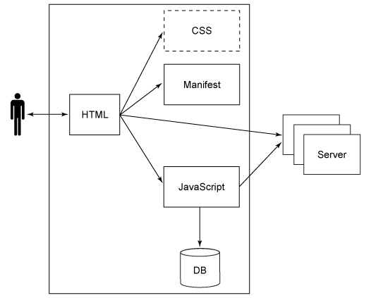
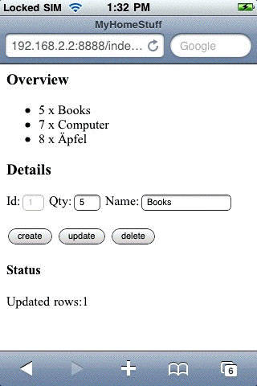
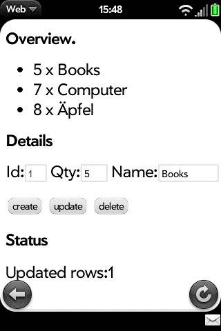

# 使用 HTML5 创建移动设备上的离线 Web 应用程序
即使没有连接到网络，也可以保持生产力

**标签:** Web 开发,移动开发

[原文链接](https://developer.ibm.com/zh/articles/wa-offlineweb/)

Dietmar Krueger

发布: 2011-01-10

* * *

## 简介

在移动应用程序中使用 Web 开发的趋势逐渐增强。然而，间歇性网络可用性对于使用 Web 技术作为云基础架构一部分是一个巨大障碍。传统的 Web 应用程序没有网络就无法工作。解决方案之一是使用 HTML5 标准的两个特性（参阅右侧资源部分）：

- 离线 Web 应用程序
- 客户端数据存储

用户可在移动设备上使用云功能，使用部署在本地数据库上的应用程序来工作，当再次上线时与云的其他部分共享数据。

在本文中，将学习典型使用场景的技术细节。将用一个简单的库存管理应用程序原型来演示 HTML5 技术。

[下载](http://public.dhe.ibm.com/software/dw/web/wa-offlineweb/OfflineWebAppSrc.zip) 本文示例应用程序源代码。

## 概览

图 1 是示例应用程序架构主要部件概览。

##### 图 1\. 离线 Web 应用程序核心元素



- **HTML 页面**: HTML 页面，作为应用程序核心，起到模型作用。它包含要显示的数据以及（默认）提交信息。页面的 HTML 元素是按 HTML Document Object Model (DOM) 树层级组织的。用户发起的事件产生一个传统的请求-响应循环，其中有页面加载和执行相关 JavaScript 函数。

值得注意的是，本应用程序包含一个单独的 HTML 页面，无需通过请求-响应循环加载更多 HTML 页面。所有动作都在一个页面上。

- **JavaScript**: JavaScript 元素包含应用程序控制器函数。HTML 元素通过事件处理器绑定到 JavaScript 函数。JavaScript 能通过用所有用户界面（UI）元素访问应用程序的 HTML DOM 树，并将其用作运算的数据输入。处理结果可以通过修改 HTML 页面显示给用户。
- **层叠样式表**: 层叠样式表（CSS）描述 HTML 页面如何提交。此处省略视图任务以简化方案。对于这一阶段扩展，只使用 HTML 元素的默认提交行为。

对于移动设备，有各种 JavaScript/CSS 库和框架来发布与 Web 应用程序接近的用户体验（例如，用于 iPhone 的 iUi）。请查看 参考资料 获取更多信息。尽管需要增加用户接受度，但本方法有着平台依赖性的劣势。

- **数据库**: HTML5 标准引入本地数据库存储。它是在 Apple® Safari 浏览器目前版本中实现的。浏览器提供嵌入式数据库，即 SQLite，它可以通过处理 SQL 查询从 JavaScript 访问。应用程序模型的业务数据存储在这里。
- **清单**: 清单文件是离线 Web 应用程序的强制性部署描述符组件。它只是简单列举需要加载的文件。

## 示例应用程序

本节概述示例应用程序 MyHomeStuff。它是一个简单的库存管理应用程序，可以用于追踪所拥有的物资。 图 2 显示的是 iPhone 上的应用程序。

##### 图 2\. iPhone 视图



为简单起见，此处省略服务器段的数据同步。图 3 显示的是 Palm Pre Web 浏览器上的 MyHomeStuff 库存管理应用程序。

##### 图 3\. Palm Pre 视图



屏幕上半段是所有输入项目（书籍、电脑等）的概览。

当用户在清单中选择某一项目，其明细（Id、Quantity、Name）在表单中部显示。使用 Update 按钮可改变所选项目的明细。使用 Delete 按钮还可从应用程序中删除所选项目。在表单中输入项目的数量和名称并选择 Create 按钮可创建新项目。

应用程序状态显示在屏幕下半段。

### HTML 细节

HTML 页面包含声明、原标记，这些用于移动优化显示、对外部文件（manifest、JavaScript、css）是引用、以及组成应用程序基本结构必需的 HTML 元素。清单 1 显示了其代码。

##### 清单 1\. HTML 代码

```
<!DOCTYPE HTML>
                <html manifest="MyHomeStuff.manifest">
                <head>
                <meta name="viewport" content="width=device-width;
                initial-scale=1.0; maximum-scale=1.0; user-scalable=0;">
                <title>MyHomeStuff</title>
                <script type="text/javascript" src="MyHomeStuff.js" ></script>
                </head>
                <body onload="onInit()">
                <h3>Overview</h3>
        <ul id="itemData" ></ul>
    <h3>Details</h3>
        <form name="itemForm">
            <label for="id">Id: </label>
            <input type="text" name="id" id="id" size=2 disabled="true"/>
            <label for="amount">Amount: </label>
            <input type="text" name="amount" id="amount" size = 3/>
            <label for="name">Name: </label>
            <input type="text" name="name" id="name" size=16 /> <br>
            <br>
            <input type="button" name="create" value="create"
                onclick="onCreate()" />
            <input type="button" name="update" value="update"
                onclick="onUpdate()" />
            <input type="button" name="delete" value="delete"
        </form>
    <h4>Status</h4>
        <div id="status"></div>
</body>
</html>

```

Show moreShow more icon

HTML 元素的事件处理属性指定当页面初始加载（ `onload` ）及点击按钮元素（ `onclick` ）时执行哪些 JavaScript 函数。

离线 Web 应用程序的 HTML 页面以 `<!DOCTYPE HTML>` 标记开始。通过 `<html manifest="MyHomeStuff.manifest">` 标记中的清单属性来引用清单。

如上所述，清单指定需要加载到缓存中的文件。本应用程序包含一个 HTML 文件和一个 JavaScript 文件。引用清单的 HTML 文件自动包含在应用程序缓存中。清单只包含以下部分：

##### 清单 2\. Manifest 文件

```
CACHE MANIFEST

MyHomeStuff.js

```

Show moreShow more icon

### JavaScript 细节

JavaScript 代码包含三个主要部分：

- 初始化函数
- db (crud) 和视图更新函数
- 一些小的工具函数

第一段包含初始化应用程序的事件处理函数（ `onload`) 和数据库初始化，如清单 3 所示。

##### 清单 3\. JavaScript 初始化代码

```
function onInit(){
    try {
        if (!window.openDatabase) {
            updateStatus("Error: DB not supported");
        }
        else {
            initDB();
            createTables();
            queryAndUpdateOverview();
        }
    }
    catch (e) {
        if (e == 2) {
            updateStatus("Error: Invalid database version.");
        }
        else {
            updateStatus("Error: Unknown error " + e + ".");
        }
        return;
    }
}

function initDB(){
    var shortName = 'stuffDB';
    var version = '1.0';
    var displayName = 'MyStuffDB';
    var maxSize = 65536; // in bytes
    localDB = window.openDatabase(shortName, version, displayName, maxSize);
}

```

Show moreShow more icon

以上代码中：

- `onInit` 函数首先检查是否存在强制 `openDatabase` 函数，如果没有，则说明浏览器不支持本地数据库。
- `initDB` 函数打开 HTML5 浏览器的数据库。
- 成功打开数据库后，执行创建数据库表的 SQL DDL。最后，调用查询现有记录和用数据更新 HTML 页面的函数。

第二段 JavaScript 中每个函数都有一部分用于 DB 访问和显示逻辑。这种逻辑合并是 Model 1 架构的一个特征，这是开发简单 Web 应用程序最轻松的方法。对于真实场景，对 Model View Controller (MVC) 部分进行清晰分离的架构要相对合适一点。

要构造示例概要清单，从事件处理函数中调用 `queryAndUpdate` 函数。清单 4 显示了代码。

##### 清单 4\. JavaScript 概览代码

```
function queryAndUpdateOverview(){

    //remove old table rows
    var dataRows = document.getElementById("itemData").getElementsByClassName("data");
    while (dataRows.length > 0) {
        row = dataRows[0];
        document.getElementById("itemData").removeChild(row);
    };

    //read db data and create new table rows
    var query = "SELECT * FROM items;";
    try {
        localDB.transaction(function(transaction){

            transaction.executeSql(query, [], function(transaction, results){
                for (var i = 0; i < results.rows.length; i++) {

                    var row = results.rows.item(i);
                    var li = document.createElement("li");
                    li.setAttribute("id", row['id']);
                    li.setAttribute("class", "data");
                    li.setAttribute("onclick", "onSelect(this)");

                    var liText =
                        document.createTextNode(row['amount'] + " x "+ row['name']);
                    li.appendChild(liText);

                    document.getElementById("itemData").appendChild(li);
                }
            }, function(transaction, error){
                updateStatus("Error: " + error.code + "<br>Message: " + error.message);
            });
        });
    }
    catch (e) {
        updateStatus("Error: Unable to select data from the db " + e + ".");
    }
}

```

Show moreShow more icon

以上代码中：

- DOM 树中移除了旧代码。
- 执行了选择所有数据集的查询。
- 对于结果中的每个数据集，创建了 HTML 清单元素并添加到列表中。
- 事件处理函数， `onSelect` ，添加到每个列表元素以在点击时响应。

这一段函数还包含用于按钮条和 `onUpdate`、`onDelete`、 `onCreate` 和 `onSelect` 列表的事件处理函数。清单 5 显示了 `onUpdate` 代码。（ `onCreate` 和 `onDelete` 具有相同的结构，此处不再显示；可以 [下载](http://public.dhe.ibm.com/software/dw/web/wa-offlineweb/OfflineWebAppSrc.zip) 示例应用程序的所有源代码。）

##### 清单 5\. JavaScript 更新代码

```
function onUpdate(){
    var id = document.itemForm.id.value;
    var amount = document.itemForm.amount.value;
    var name = document.itemForm.name.value;
    if (amount == "" || name == "") {
        updateStatus("'Amount' and 'Name' are required fields!");
    }
    else {
        var query = "update items set amount=?, name=? where id=?;";
        try {
            localDB.transaction(function(transaction){
                transaction.executeSql(query, [amount, name, id],
                function(transaction, results){
                    if (!results.rowsAffected) {
                        updateStatus("Error: No rows affected");
                    }
                    else {
                        updateForm("", "", "");
                        updateStatus("Updated rows:"
                            + results.rowsAffected);
                        queryAndUpdateOverview();
                    }
                }, errorHandler);
            });
        }
        catch (e) {
            updateStatus("Error: Unable to perform an UPDATE " + e + ".");
        }
    }
}

```

Show moreShow more icon

以上代码中：

- 读取和验证表单的字段值。
- 如果值有效，则执行更新查询。
- 查询结果在更新后的 HTML 页面中显示。

当用户选取列表元素后执行 `onSelect` 函数。将用该元素的数据填充明细表单，代码如清单 6。

##### 清单 6\. JavaScript 选择代码

```
function onSelect(htmlLIElement){
    var id = htmlLIElement.getAttribute("id");
    query = "SELECT * FROM items where id=?;";
    try {
        localDB.transaction(function(transaction){

            transaction.executeSql(query, [id], function(transaction, results){

                var row = results.rows.item(0);

                updateForm(row['id'], row['amount'], row['name']);

            }, function(transaction, error){
                updateStatus("Error: " + error.code + "<br>Message: " + error.message);
            });
        });
    }
    catch (e) {
        updateStatus("Error: Unable to select data from the db " + e + ".");
    }
}

```

Show moreShow more icon

以上代码中：

- 确定被选元素的 ID。
- 执行一个 “选择-查询”。
- 调用用读取的数据集更新明细表的函数。

最后的工具函数的 JavaScript 部分开始是数据处理函数，它们只作为查询的参数。

##### 清单 7\. JavaScript 处理函数代码

```
errorHandler = function(transaction, error){
    updateStatus("Error: " + error.message);
    return true;
}

nullDataHandler = function(transaction, results){
}

```

Show moreShow more icon

为避免冗余，工具函数将填充细节表单（ `updateForm` ）的字段和状态消息（ `updateStatus` ），如下所示。

##### 清单 8\. JavaScript 工具代码

```
function updateForm(id, amount, name){
    document.itemForm.id.value = id;
    document.itemForm.amount.value = amount;
    document.itemForm.name.value = name;
}

function updateStatus(status){
    document.getElementById('status').innerHTML = status;
}

```

Show moreShow more icon

## 部署

iPhone 3GS 和 Palm Pre 用于在真实的 HTML5 移动设备上运行本例。目前的 Safari 浏览器也能正常运行。

可以从将应用程序文件 [下载](http://public.dhe.ibm.com/software/dw/web/wa-offlineweb/OfflineWebAppSrc.zip) 并部署到 HTTP 服务器中。服务器中必须以 `text/cache-manifest` Mime 类型提供清单文件。在 iPhone 中打开应用程序后，保存书签并转换到离线操作模式。当选择书签后，程序将打开并可以在没有联网的情况下工作。

## 结束语

本文的重点是从技术角度了解离线 Web 应用程序。用一个简单的库存管理应用程序原型演示了 HTML5 技术，其中还包含本地部署的应用程序和本地数据库。

本文翻译自： [Create offline Web applications on mobile devices with HTML5](https://developer.ibm.com/articles/wa-offlineweb/)（2010-05-18）