# 使用 IBM App Connect 和 IBM API Connect 进行应用集成
快速整合多个应用并包装生成 Rest APIs

**标签:** API 管理,IBM API Connect,IBM App Connect,云计算

[原文链接](https://developer.ibm.com/zh/articles/cl-lo-application-integration-using-app-connect/)

杨 晓蓓, 卢 江

发布: 2018-07-25

* * *

## 概述

很多公司在发展过程中，会根据自身的业务需求开发多个针对不用应用场景的 SaaS 应用程序，而这些应用一方面有可能会调用其他的第三方产品应用，另一方面这些应用可能会遍布在不同的地方（云端或者线下系统）。这些应用之间势必会面临流程冗余，数据冗余, 难以整合，难以互相调用的问题，这个时候对多个相对独立的应用进行整合就势在必行了。

很多第三方产品应用都会提供 Rest APIs，但是其 API 数据模型的定义往往比较复杂，而且调用过程会比较麻烦。这里我们会使用 IBM App Connect 来快速封装第三方产品的 Rest APIs，返回自定义的简单数据模型。当 API 逐渐增多以后，API 的管理就变的日益困难，IBM API Connect 就是基于这个目的而产生的，它使得多个 API 在单个集成产品服务中执行其所有的生命周期步骤成为可能。

本系列分为两篇文章，将会通过一个较为复杂的场景来给大家详细介绍如何使用 IBM App Connect 来快速整合多个应用并包装生成 Rest APIs，进而介绍如何使用 IBM API Connect 对生成的 API 进行配置管理，最后使用一个流程编排工具（IBM BPM on Cloud）来向大家演示如何对 API Connect 暴露出来的 API 进行调用和流程编排。

## 相关产品和工具简介

1. IBM App Connect

    IBM App Connect 专门针对将最简单的 SaaS（软件即服务）应用程序中的业务数据整合到一个复杂的系统之中。它使得连接各个跨环境的应用及数据变得更为简单，快速和安全。它提供了非常广泛的集成方式：事件、微服务、API，并且为整个业务提供了一个简单的集成工具。因为 IBM App Connect 可以部署到任意地方，云端或者线下系统，所以您可以很灵活的设计集成方案而不会受到地理位置的限制。

2. IBM API Connect

    IBM API Connect 是一款基于 API 的管理方案，借助它可以执行 API 生命周期中的所有步骤以及贯穿在整个 API 生命周期的操作（创建、运行、管理和加密 API）。

3. AsaNa

    AsaNa 是一个集邮件、办公、文档、沟通于一体的任务管理平台。

4. Slack

    Slack 是一款目前很流行的团队协作工具，它将各种碎片化的沟通和协作集中到了一起，也整合了各种各样的工具和服务。


## 需要做的准备工作

1. IBM Cloud 帐户。如果您还没有 IBM Cloud 帐户，可以先注册一个 [免费试用](https://cocl.us/IBM_CLOUD_GCG) 帐户
2. [AsaNa](https://asana.com/) 账户。
3. [Slack](https://slack.com/signin) 账户。

## 应用场景描述

假设一个员工提交了一个购买物品的请求，该请求需要经过提交采购专员的批复。在本文中我们需要实现的具体逻辑是，如果采购专员批准了一个采购需求，就会在 AsaNa 里面创建一个任务，同时会在 Slack 里发送购买请求已被审批通过的提醒。如果采购专员没有批准采购请求，就会在 Slack 里面发送一条该请求被拒绝的通知。

## 应用场景实现方案描述

我们将会使用 IBM APP Connect、IBM API Connect 和 IBM BPM on Cloud 来实现上述的场景。首先我们会使用 IBM App Connect 来创建流程 API，去实现一个任务数据模型，并且来创建和编排数据驱动的 Rest API，进而使用 IBM API Connect 对该 API 进行管理。然后我们会采用流程编排工具（本系统采用的是 IBM BPM on Cloud）采用调用外部 service 的方式调用封装之后的 API，并对相应的业务流程进行编排。

## 第 1 步：使用 App Connect 的 Flow API 来封装 AsaNa 的 Rest API

我们需要创建一个 API，然后在第三方的应用 AsaNa 中生成一个任务。

首先我们登陆 IBM Cloud 控制台以后，选择目录中的 App Connect，点击创建一个新的 App Connect 服务。服务生成后，点击 “Launch App Connect” 去启动服务实例。

在点击按钮 New 的时候可以看到两个选项：

- Event-driven flow：使用内置的连接应用来组装流程，监听事件来源，并在定义的事件发生时运行流程。
- Flow for an API：定义数据模型，并组装服务流程，将服务流程公开为一个 API 供其他应用调用。

因为在我们的场景中，并不存在事件驱动，而主要是人工的异步调用，因此我们选择 Flow for an API 来实现我们的异步调用场景。如图 1 所示。

##### 图 1.在 App Connect 控制台创建流程

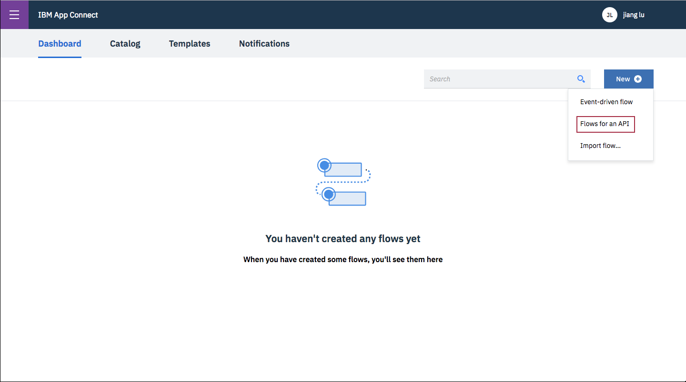

接下来我们需要定义 API 的请求数据格式。在我们的场景中，我们会去请求第三方应用 AsaNa 的 API 来生成一个任务（Task）。由于 AsaNa 的 “create task” 这个 API 的数据模型定义较为复杂，有很多数据项，而当前我们的场景只需要包装一个简单数据模型即可，所以我们将采用 App Connect 提供的简便方式。它可以让我们定制自己的数据模型，只添加自己需要的数据项，进而再和 AsaNa 的数据项做映射即可。

点击 Define 进入定义页面，输入当前模型的名字 “Task”，然后点击按钮 “Create model” 去创建数据模型。

数据模型创建成功后，当前定义页面中需要定义数据，我们可以采用多种方式来定义数据，可以用手动输入字段的方式来定义数据，也可以从 App Connect 内置的应用中提取可用的数据作为模型字段。

在这里我们选择了 App Connect 内置的 AsaNa 应用来提取字段，点击链接 “Select properties from application…”。请注意，如果是第一次使用 App Connect，则需要先完成”连接应用”的操作，选择 “Connect to Application”。如图 2 所示。

##### 图 2.在数据模型中定义数据

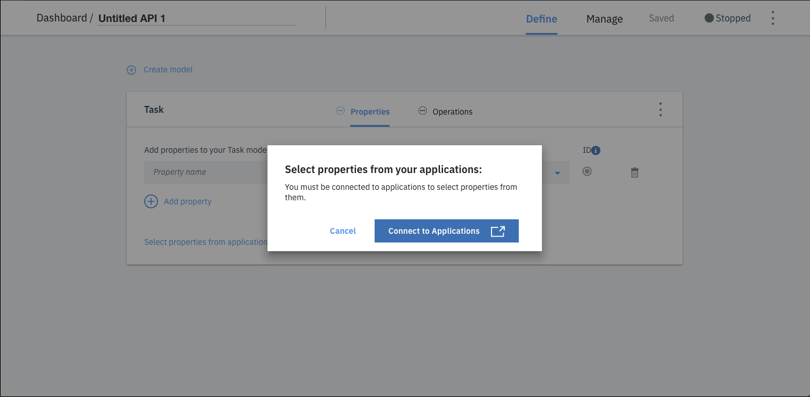

然后点击 Catalog，选择 “Applications” 进行配置，在出现的应用列表里，选择 AsaNa。点击 “Connect”，并输入自己已有的 AsaNa 账户进行连接认证。如图 3 所示。

##### 图 3.针对 AsaNa 账户进行认证连接

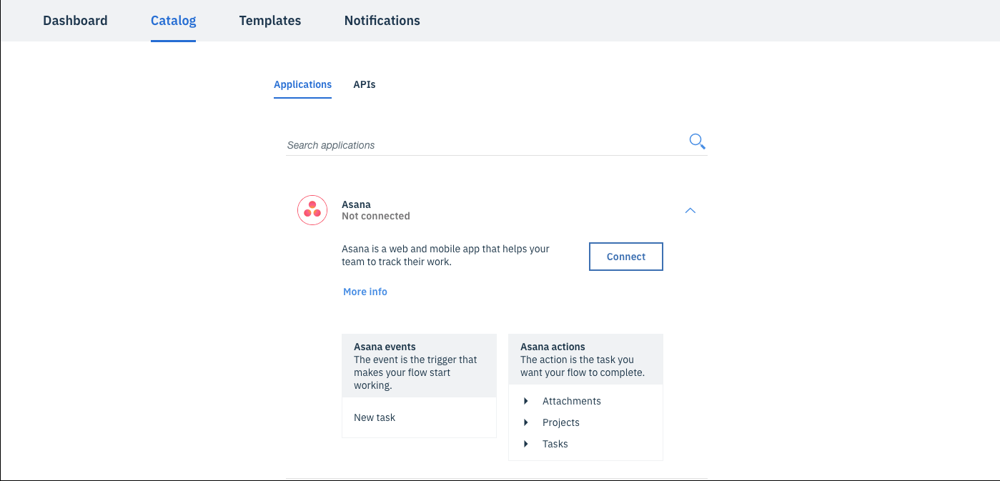

这个步骤的目的是在 App Connect 中存储自己的 AsaNa 的认证信息，并且授权 App Connect 可以去连接外部应用，该步骤只需要做一次，其他的流程就可以复用该认证的连接。同样的，我们对 Slack 应用也需要类似的步骤来事先完成认证。在本文不再赘述。

接下来点击 “select properties from your applications:”，我们在 AsaNa 的操作属性中选择需要的属性作为自己的模型字段。如图 4 所示。

##### 图 4.选取 AsaNa 来提取操作属性

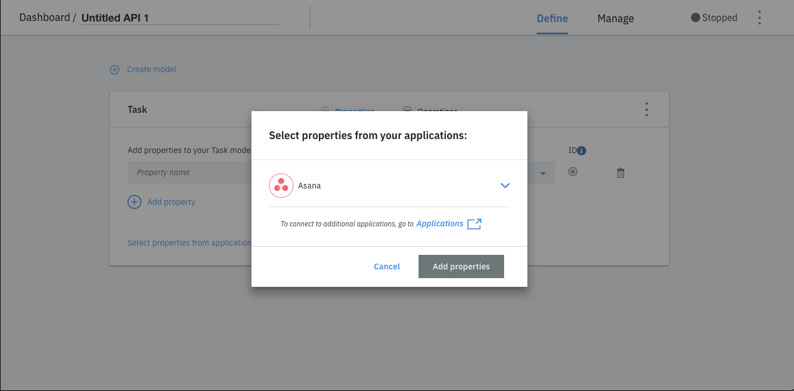

点击 “Add properties” 进入添加属性页面。首先我们要选择 AsaNa 的模型 Tasks，可以看到 AsaNa 本身的字段非常多，而我们只需要选取我们感兴趣的字段作为模型属性。本文中，我们只选择了 “Name” 属性。如图 5 所示。

##### 图 5\. 选取 AsaNa 的属性


然后点击 “Add properties”，因为我们需要再增加一个 approve 字段用来表示采购专员是否批准了请求。在这里，Name 作为必须指定的字段被标记为 “ID”。如图 6 所示。

##### 图 6\. 添加新的属性

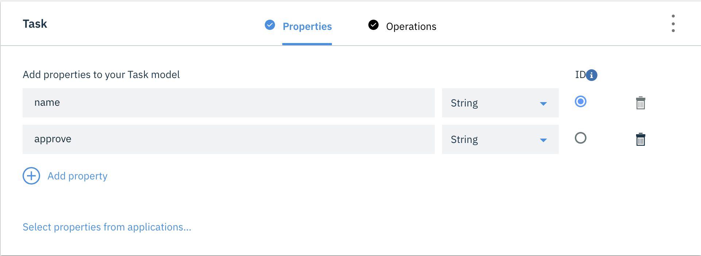

点击 “save” 保存所有的新创建的属性。

## 第 2 步：使用 App Connect 来编排 Rest API

点击 “Operations” 进入到流程编辑页面，点击 “Implement flow” 来编辑流程。一个基本的流程图，包含了一个请求和一个响应步骤，以及一个加号 (+)，我们可以在该流中添加更多操作。点击（+），将之前已经做过认证连接的 AsaNa 和 Slack 应用分别添加到该流程中。如图 7 所示。

##### 图 7\. 编辑添加流程

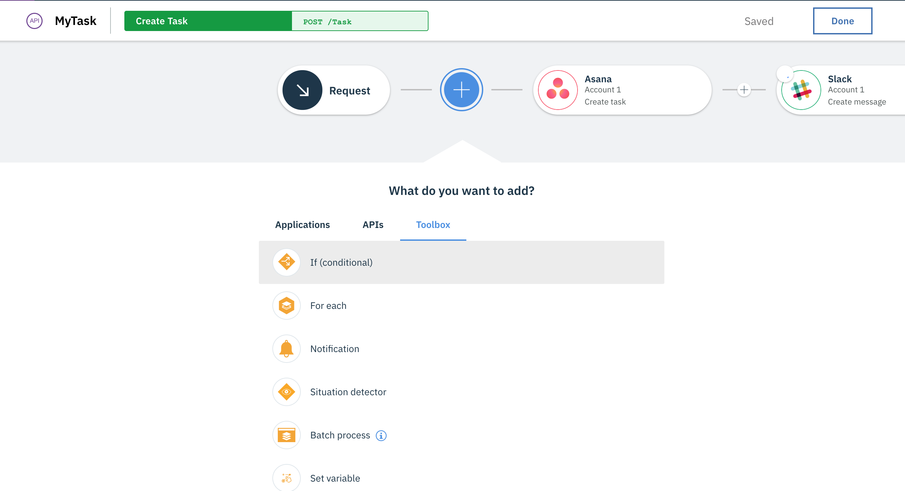

当前的流程只是一个顺序流程，但是实际场景中会包含很多的判断逻辑，所以接下来我们将添加一个 Toolbox->If(condition)来做逻辑编排。我们需要实现的逻辑是：

#### 清单 1\. 流程编排逻辑示例

```
if approve==”True”:
    create a task in Asana
    post a "success” message in slack
else:
    post a "reject” message in slack

```

Show moreShow more icon

针对逻辑创建其对应的分支，首先进行 If(condition)的配置，设置 approve is true。如图 8 所示。

##### 图 8\. 创建逻辑对应的分支

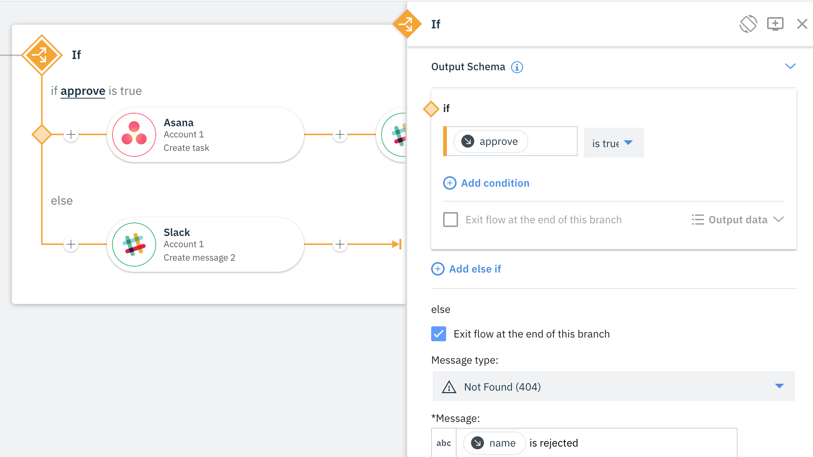

注意我们为 else 分支选择了 “Exit flow at the end of this branch” 以确保在分支的结尾处该流程会自动退出，同时定义了当前分支所回复的消息为 “ is rejected”。

接下来我们为流程中的每个节点进行配置。

首先针对 If 分支中的 AsaNa 节点进行相关配置，如图 9 所示。

生成当前任务的必要参数有两个，一个是 “Project”，即指定在哪个项目里生成任务。App Connect 会自动为我们提取连接账户的所有已有 Project 进行选择，本文中我们选择 “MyTest”。另一个必要参数是 Task Name，我们将为它匹配选择之前定义的数据模型 Task 中的 name 字段。

##### 图 9\. 对 If 分支中的 AsaNa 节点进行配置

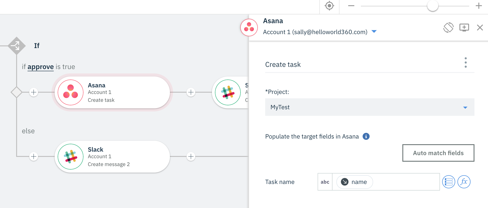

下面进行 If 分支中的 Slack 节点的配置。

同 AsaNa 节点类似，App Connect 自动提取了连接账户所有可选的 Slack 通道，我们选择一个作消息发布的管道，并且定义消息的格式。在这里我们简单选择 AsaNa 执行完的输出并连接若干说明字段，在 “Text” 中输入 “ is created”。如图 10 所示。

##### 图 10\. 对 If 分支中的 Slack 节点进行配置

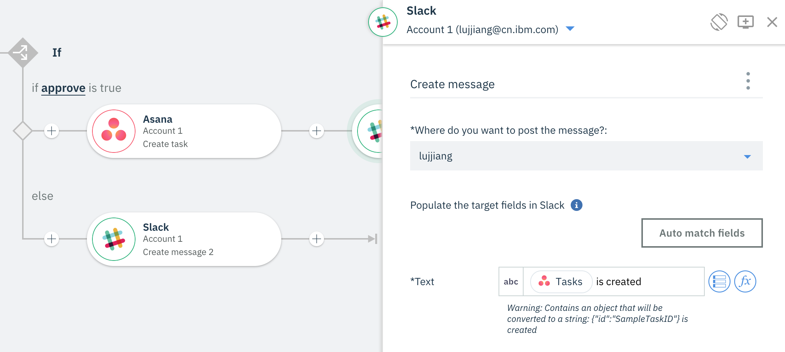

最后是 else 分支的 Slack 节点配置，该配置与 If 分支 Slack 配置基本类似，我们选择 AsaNa 执行完的输出并连接若干说明字段，在 “Text” 中输入 “ is created”。如图 11 所示。

##### 图 11\. 对 else 分支中的 Slack 节点进行配置

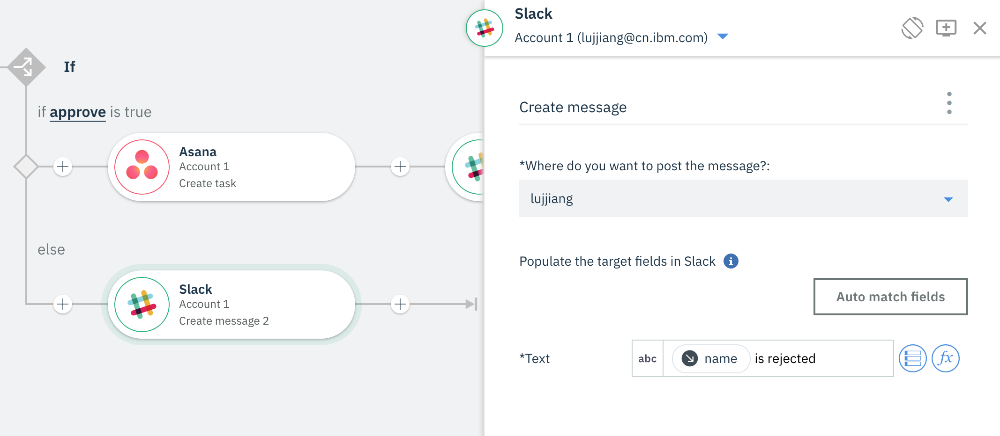

到目前为止，App Connect 里的所有编排工作就都做完了。最后我们只需要启动这个 API，以便其他应用可以调用到它即可。

## 第 3 步：使用 API Connect 对 APP Connect 封装的 Rest API 进行管理

首先访问 IBM Cloud 控制台，点击目录中的 “API Connect” 去创建一个新的 API Connect 服务实例。因为 APP Connect 封装的 API 需要通过 API Connect 来进行管理，所以在 APP Connect 页面中点击 Manage 进入管理界面，选择 “Open in API Connect” 来导入这个 API 定义到 API Connect 中，因为之前已经创建了一个新的 API Connect 服务实例，所以当前的 APP Connect 可以自动发现这个 API Connect 实例，并且自动导入 API 定义到 API Connect 中。

然后 APP Connect 会自动发现 API Connect 实例，并且自动导入 API 定义到 API Connect 中。如图 12 所示。

##### 图 12\. 自动导入 API Connect 实例

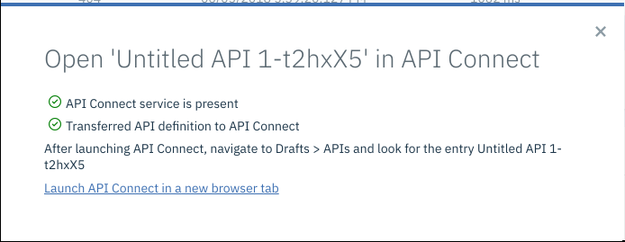

API 导入完成后，我们点击 “Launch API Connect in a new browser tab” 的链接，打开 API Connect 的控制台，会发现在 Drafts -> API 页面中，一个同名的 API 被创建出来了。

下面点击该 API 的名字链接进入到 API Connect 的 API 编辑页面，然后将名字修改为可读性强的名字，如：”MyTask”。如图 13 所示。

##### 图 13\. 对 API 进行编辑

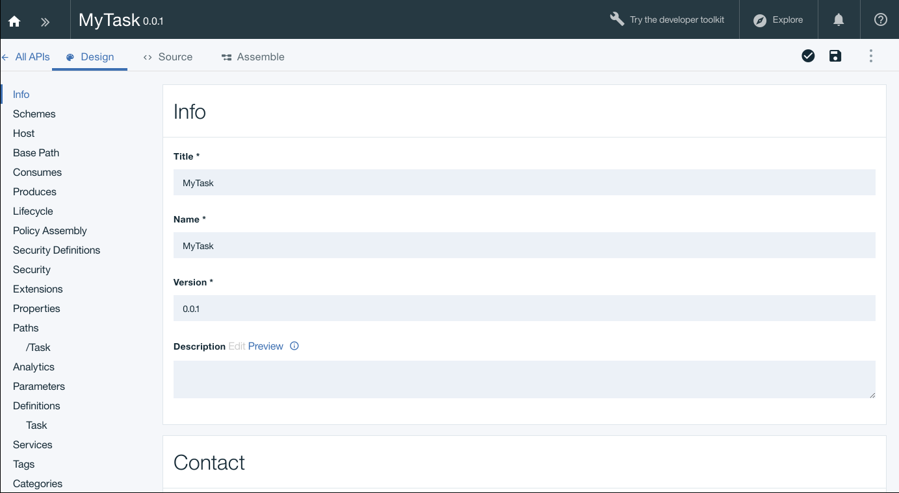

点击目录中的 Security 进入安全配置页面中，在该页面中我们发现默认的安全定义是 Client\_id（API Key），这个是由 App Connect 的安全定义导入而生成的。

但是由于下一篇文章中使用到的流程编排工具（IBM BPM on Cloud）调用外部 Rest API 服务时支持的是 basic authentication，而它对上面 API Key 的安全认证方式并不支持，因此在本文中为了生成 IBM BPM on Cloud 所兼容的安全定义，我们需要先删除 Client\_id，然后点击右上角的加号，选择 “Basic” 去增加 Basic-Auth 的安全定义，输入当前安全定义的名字，如 “basic-Auth”，然后保存。如图 14 所示。

##### 图 14\. 创建 Basic 类型的安全定义

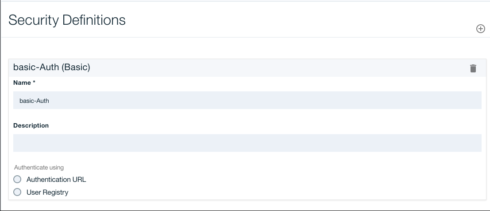

完成以上全部的简单配置后，下面我们会对这个 Rest API 进行测试以确保当前 Rest API 可以正常被调用。

## 第 4 步：完成 API 的启动和调试

在当前 API 的控制台中，点击右上角的功能菜单，选择 “Generate a default product” 去为当前 API 生成一个默认的 product，并且发布到 sandbox 的这个 catalog 里。如图 15 所示。

##### 图 15\. 生成默认产品

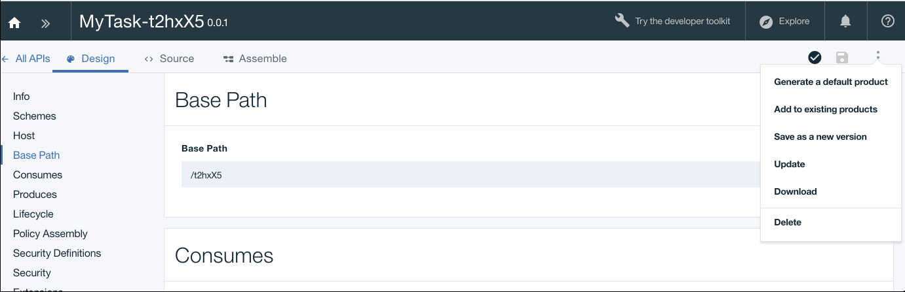

当 default product 生成以后，依次点击 “Explore”->”sandbox”->”Task”，会展示出不同的请求方式下的示例。点击 “Try it” 来测试这个 Rest API。如图 16 所示。

##### 图 16\. 测试 API

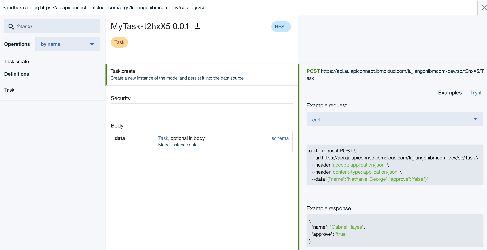

如果调用成功，则执行结果就会正常返回。然后我们需要记录下在真实调用中的 Request 的 URL 的字段，我们将会在下一篇文章中使用到。如图 17 所示。

##### 图 17\. API 调用返回结果

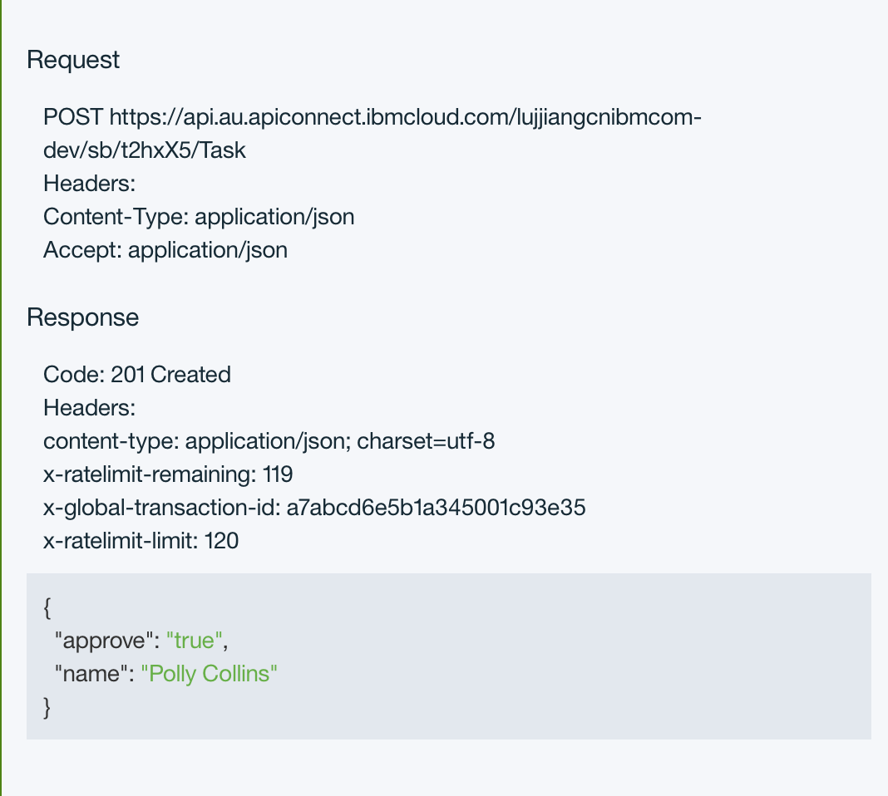

## 第 5 步：为流程编排工作接入 Rest API 的预准备

因为下一篇文章中我们需要通过流程编排工具（IBM BPM on Cloud）中创建一个外部服务，从而调用封装好的 Rest API, 而外部服务中定义了操作、操作相关的输入和输出数据，以及一个包含关于如何连接到主机服务器信息的服务器配置。在本文教程中，服务器定义包含了 IBM App Connect 中的 API 的连接细节（URL、端口、凭证等）。当然在运行时，我们也可以在流程经历各种环境（比如测试、暂存和生产）时更改这些细节，管理员可以在运行时更改服务器定义，比如在端点 URL 不同的情况下。

我们需要在 API Connect 中下载我们编排后的 API 的 swagger 文件 。下载完毕后我们在该 swagger 文件中增加

Host 字段，并修改 host 和 basePath 和上一步中 Request 的 URL 保持一致。

## 结束语

本文主要介绍了如何通过 IBM App Connect 去快速整合多个相对独立的 app，甚至外部的第三方 app，并且快速封装成对应的 Rest API。然后借助 IBM API Connect 向大家展示了快速管理 API, 并通过一个相对复杂的应用实例向大家展示了整个整合封装和管理的过程，以及该过程中涉及到的各个详细配置。在本文的基础上，客户可以使用流程编排工具来进行业务的流程编排以及调用本文中封装好的 Rest API。

## 参考资源

- 访问 [IBM Cloud](https://cocl.us/IBM_CLOUD_GCG) 了解具体 IBM Cloud 提供的服务和功能
- 访问 [IBM Cloud Forum](https://developer.ibm.com/answers?community=bluemix) ，在论坛中讨论 IBM Cloud 相关的问题
- 访问 [IBM Cloud 专栏](http://www.ibm.com/developerworks/cn/cloud/bluemix/) ，在这里您可以获得最新最实用的 IBM Cloud 资讯和技术资源。
- 访问 [IBM App Connect](https://developer.ibm.com/integration/docs/app-connect/?cm_mc_uid=70323089749215267774414&cm_mc_sid_50200000=78223151529045760969) 文档了解 IBM App Connect 具体的功能和操作