# 使用 IBM BPM on Cloud 进行流程编排和 API 调用
使得多个 API 在单个集成产品服务中执行其所有的生命周期步骤成为可能

**标签:** API 管理,IBM API Connect,IBM App Connect,云计算

[原文链接](https://developer.ibm.com/zh/articles/cl-lo-application-integration-using-app-connect2/)

杨 晓蓓, 卢 江, 赵 斐

发布: 2018-11-07

* * *

## 概述

在 [“云端业务整合，第一部分”](http://www.ibm.com/developerworks/cn/cloud/library/cl-lo-application-integration-using-app-connect/index.html) 中，我们使用 IBM App Connect 来快速整合多个相对独立的应用，包括外部的第三方应用，并快速封装生成对应的 Rest API，然后借助了 IBM API Connect 对 API 进行配置以及快速管理。应用这种解决方案，企业就可以对已有或正在开发的针对不同应用场景的 SaaS 应用程序进行整合。在整合过程中使用 IBM App Connect 来快速封住第三方产品的 Rest APIs，对第三方产品复杂的 API 数据模型进行简化，提供简单的数据模型。IBM API Connect 与生俱来的 API 管理能力，使得多个 API 在单个集成产品服务中执行其所有的生命周期步骤成为可能。

整合不同产品的目标是为了进行云端业务整合，以帮助企业优化现有的业务流程或拓展新的业务场景。因此，暴露出可以调用的 Rest APIs 仅仅是云端业务整合的第一步。在本文接下来的内容中，我们会使用 IBM 的另一个产品 IBM BPM on Cloud 对前文中暴露出来的 API 进行调用和流程编排。本文所描述的业务场景可以进行扩展以完成企业业务场景的具体需要。

**免费试用 IBM Cloud**

利用 [IBM Cloud Lite](https://cocl.us/IBM_CLOUD_GCG) 快速轻松地构建您的下一个应用程序。您的免费帐户从不过期，而且您会获得 256 MB 的 Cloud Foundry 运行时内存和包含 Kubernetes 集群的 2 GB 存储空间。

## 相关产品和工具简介

1. IBM App Connect

    IBM App Connect 专门针对将最简单的 SaaS（软件即服务）应用程序中的业务数据整合到一个复杂的系统之中。具体介绍请参照 [“云端业务整合，第一部分”](http://www.ibm.com/developerworks/cn/cloud/library/cl-lo-application-integration-using-app-connect/index.html) 。

2. IBM API Connect

    IBM API Connect 是一款基于 API 的管理方案。具体介绍请参照 [“云端业务整合，第一部分”](http://www.ibm.com/developerworks/cn/cloud/library/cl-lo-application-integration-using-app-connect/index.html) 。

3. IBM BPM on Cloud

    IBM® Business Process Manager 支持流程负责人和业务用户直接参与业务流程改进工作。这个功能齐全的消费性平台包括用于流程设计与执行的工具和运行时组件，并提供用于监控和优化工作的功能。该平台支持移动设备，具有跨产品版本的案例管理功能，使用单个流程服务器或联合拓扑支持业务。

    而 IBM BPM on Cloud 是基于 IBM® Business Process Manager 之上，提供了一个”平台即服务”的方式去开发和管理客户的业务流程，用户可以不用创建和维护底层的 IT 架构，而只需要关注于快速构建和部署流程应用方案即可。IBM BPM on Cloud 是一个基于云的，用于开发、测试、运行、监控、优化业务流程的业务流程管理平台。

4. AsaNa

    AsaNa 是一个集邮件、办公、文档、沟通于一体的任务管理平台。

5. Slack

    Slack 是一款目前很流行的团队协作工具，它将各种碎片化的沟通和协作集中到了一起，也整合了各种各样的工具和服务。


## 需要做的准备工作

IBM BPM on Cloud 帐户。如果您还没有 IBM Cloud 帐户，可以先获取一个 [免费试用](https://www.ibm.com/support/knowledgecenter/en/SS964W/com.ibm.wbpm.cloud.man.doc/topics/tbpm_manclo_adduser.html) 帐户。

## 应用场景描述

本文设计的应用场景为员工购买审批流程。假设一个员工提交了一个购买物品的请求，该请求需要经过提交采购专员的批复。在本文中我们需要实现的具体逻辑是，如果采购专员批准了一个采购需求，就会在 AsaNa 里面创建一个任务，同时会在 Slack 里发送购买请求已被审批通过的提醒。如果采购专员没有批准采购请求，就会在 Slack 里面发送一条该请求被拒绝的通知。

### 实现方案描述

在上一篇文章中我们使用了 App Connect 整合了 AsaNa 及 Slack 并创建了可供后续场景使用的任务数据模型，并且来创建和编排数据驱动的 Rest API。本文中我们选取了流程编排工具 IBM BPM on Cloud 采用调用外部 service 的方式调用封装之后的 API，并对相应的业务流程进行编排，以完成员工审批流程的具体实现。

## 第 1 步： 使用 IBM BPM on Cloud 接入 Rest API，做流程编排

首先如果要从 IBM BPM on Cloud 中连接到其他任何的 API，必须先在 IBM BPM on Cloud 中创建一个 [外部服务](https://www.ibm.com/support/knowledgecenter/SSFPJS_8.6.0/com.ibm.wbpm.wle.editor.doc/topics/textsrvovr.html) 。该外部服务定义了操作、操作相关的输入和输出数据、以及一个包含了关于如何连接到主机服务器信息的服务器配置。在本教程中，该服务器的配置定义中包含了 IBM App Connect 上的相关 API 的连接细节（如 URL、端口、凭证等），有了这些连接信息，两者才能创建有效的连接。当然在实际运行的时候，我们还可以在流程经历各种环境（比如测试、暂存和生产）时再去更改这些细节。管理员可以在运行时更改服务器的配置定义 – 比如在端点 URL 不同的情况下。

下面在切换到 IBM BPM on Cloud 产品之前，我们先打开 [“云端业务整合，第一部分”](http://www.ibm.com/developerworks/cn/cloud/library/cl-lo-application-integration-using-app-connect/index.html) 中在 IBM API Connect 中下载我们编排后的 API 所对应的 swagger 文件 。在该文件中，我们增加一个 host 字段，并修改 host 和 basePath 和上面 Request 的 URL 保持一致。

##### 图 1\. 修改编排后的 API 所对应的 swagger 文件

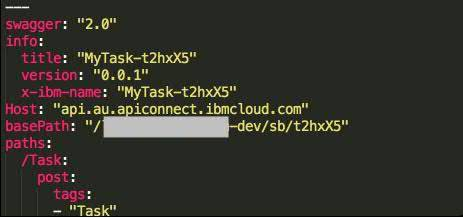

## 第 2 步： 在 IBM BPM on Cloud 中用外服服务和服务流的方式对 API 进行集成

接下来，我们登录到 IBM BPM on Cloud 的控制台界面，首先打开 Process Center，在当前界面中创建一个新的流程应用，然后点击该流程后面的 “Open in Designer”，在 Process Designer 中打开该流程进行编辑。

##### 图 2\. 创建新的流程应用


下面点击 “Services”，选择 “New”->”Externel Service” 去生成一个新的外部服务。

##### 图 3\. 创建新的流程应用

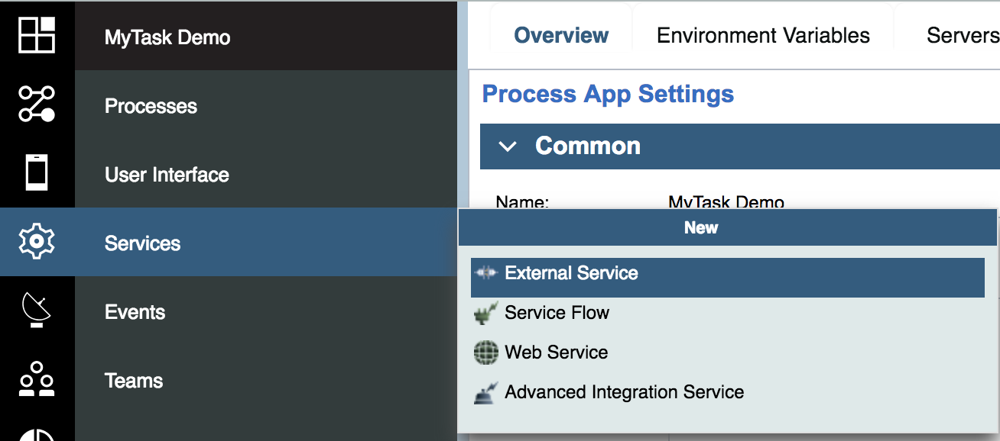

接着选择 “Java, REST or Web service” 来发现并调用之前我们封装好的 Rest API。

##### 图 4\. 选择外部服务类型

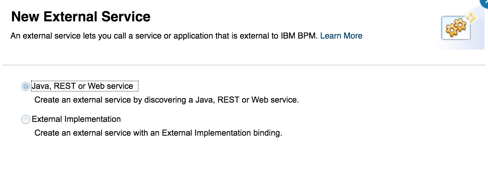

在下列 File name 中选择在第一步中修改后的 swagger 文件。

##### 图 5\. 选择 API 对应的 swagger 文件

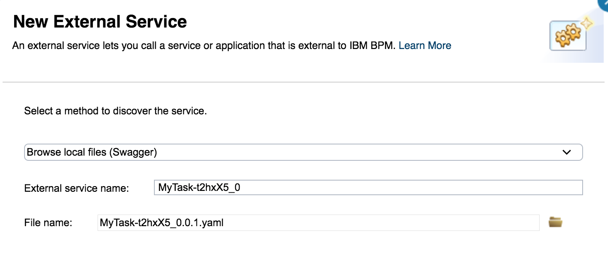

在 “Operation Name” 中选择默认的选项 “Task.create”。

##### 图 6\. 选择 Operation Name

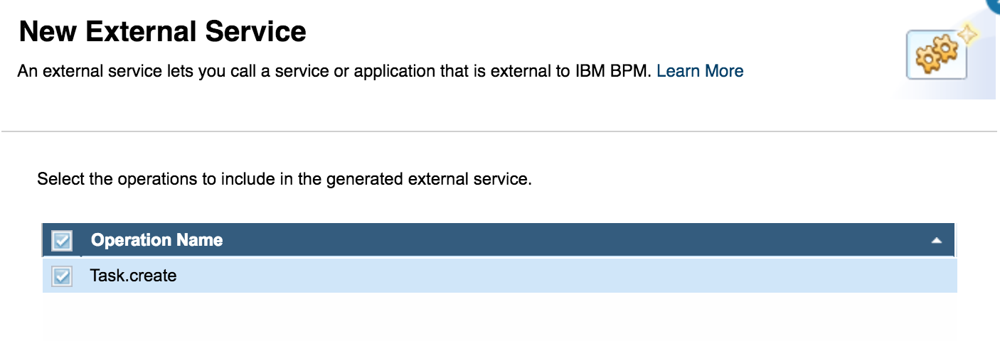

下面选择 “Create a new server” 来创建一个新的服务器并且制定一个名字。

需要注意的是，在这一步中服务器用于表示服务器所对应的配置信息，而不是真正的创建一个新的 BPM 服务器。这更象是一个包含了这个特定外部服务的凭证和 URL 的绑定定义。该名称源于一个事实：早期的绑定凭证会提交给外部”服务器”，比如 IBM Operational Decision Manager (ODM) 和 Content Management。IBM BPM on Cloud 预先填充了一个基于您的外部服务名称的名称。通过这个服务器概念，您可以根据不同环境执行各种不同的设置，例如：将开发、测试和生产环境的 API URL 和凭证分开。在 IBM App Connect 中管理不同的 API 实现版本是另一个 IBM API Connect 可以提供帮助的领域。您可以控制将每个版本路由到哪些 API 实现，还可以控制谁能访问每个实现。

##### 图 7\. 创建新的服务器定义

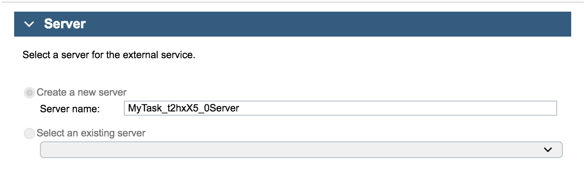

如果需要在 IBM BPM on Cloud 中查看您的外部服务所对应的定义，可以点击展开 Operations、Input 和 Output，相关的具体定义会展示出来。IBM BPM on Cloud 会自动创建 Business Object 工件，这些工件与 API 所对应的 swagger 文件中定义的 JSON 结构相对应。

选择外部服务的顶级名称，并单击 Binding。如下图所示。

##### 图 8\. 绑定外部服务

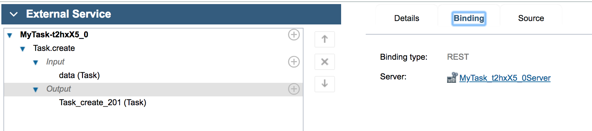

由于我们在 API Connect 没有定义启动安全定义，因此我们在当前服务器的认证 “Authentication” 这里暂时先选择 None。

##### 图 9\. 设置不选择安全认证

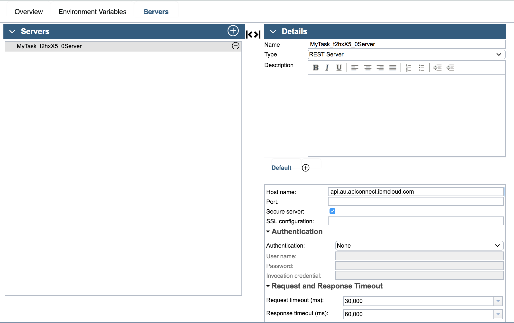

我们的场景中需要调用在 [“云端业务整合，第一部分”](http://www.ibm.com/developerworks/cn/cloud/library/cl-lo-application-integration-using-app-connect/index.html) 中暴露的 Rest APIs 来完成审批流程。之前的操作我们将 Rest APIs 的描述文件 Swagger 对接到了 IBM BPM on Cloud 中，并为其创建了一个外部服务。接下来我们需要创建一个服务流来实现具体的业务场景。在服务流里我们将集成这个外部的服务。选择 Services->New->Service Flow。

##### 图 10\. 创建新的服务流

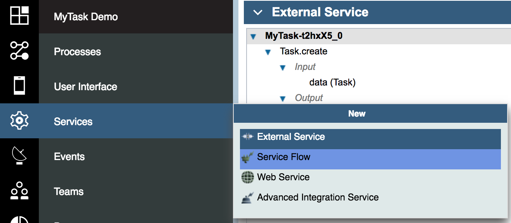

##### 图 11\. 指定服务流的名字

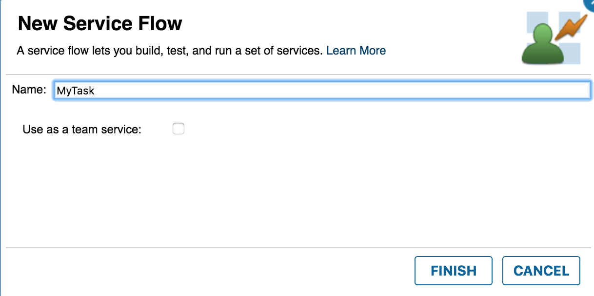

增加一个脚本任务，并将开始节点连接到这个任务，再从这个任务连接到结束节点以完成一个完整的业务流程。

##### 图 12\. 增加新的脚本服务

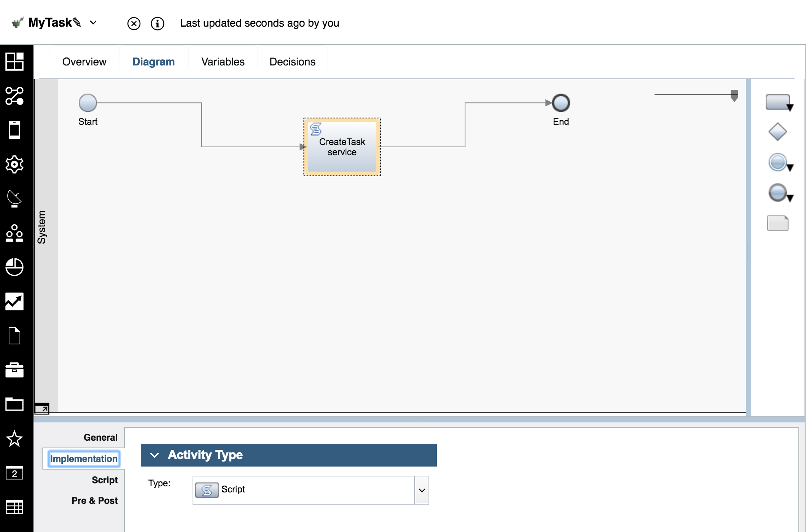

下面在脚本任务中实现代码如下所示。

##### 清单 1\. 脚本流程代码

```
var request = new BPMRESTRequest();
request.externalServiceName = "MyTask-t2hxX5_0_2";
request.operationName="Task.create";
request.httpHeaders =  {"Content-Type": "application/json",
                        "Accept": "application/json"};
if (tw.local.input1.approve){
request.parameters = {"data":{"name": tw.local.input1.name,
                      "approve" : "true"}};
}
else {
request.parameters = {"data":{"name": tw.local.input1.name,
                      "approve" : "false"}};
}
request.requestTimeout = 2000;
request.responseTimeout = 7200;
var response = tw.system.invokeREST(request);
tw.local.output = response.content;

```

Show moreShow more icon

## 第 3 步：在 IBM BPM on Cloud 中进行流程编排

上面我们完成了外部服务的创建以及服务流程的创建，当前的服务流里没有与人操作的环节。再来回顾一下我们预设的场景，假设一个员工提交了一个购买物品的请求，该请求需要经过提交采购专员的批复，对于采购员的不同批复完成不同的分支操作。因此，在后面的章节中，我们将实现一个人工流程来采购员批复的流程。首先我们增加一个人工流程。选择 Services->New->Client-Side Human Service。增加一个 coach 节点来实现简单的人工页面调用，并增加一个服务节点来调用第 2 步的服务流，如下图所示进行连接。

##### 图 13\. 增加一个 coach 节点和服务节点

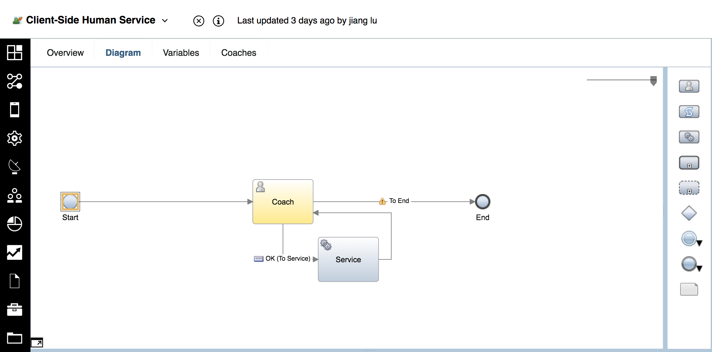

##### 图 14\. 选择调用之前创建的服务流

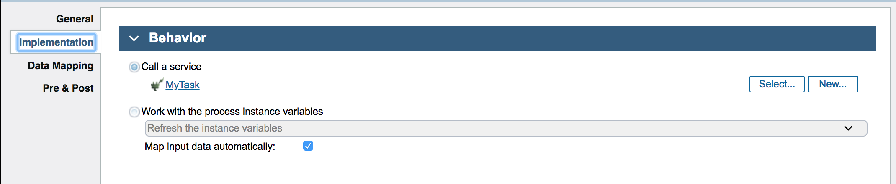

下面在人工流的 Variables 选项卡上，展开 “Input” 输入变量。服务节点调用之前创建的服务流程。然后将从第一步的 Swagger 里引入的 Rest API 的数据类型绑定到变量上。

##### 图 15\. 设置输入变量

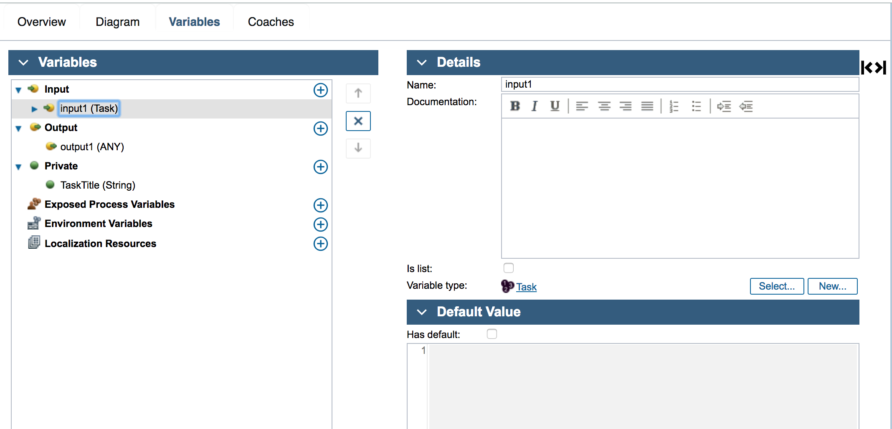

选择 Coaches 选项卡，进行最简单的页面编辑，我们选择 Variables 菜单，将定义的数据 input1 直接拖拽到 Coach 中，形成一个输入框和单选框。输入框模拟场景中员工提交的购买物品的请求，单选框模拟采购员的审判结果。

##### 图 16\. 编辑 Coach 界面

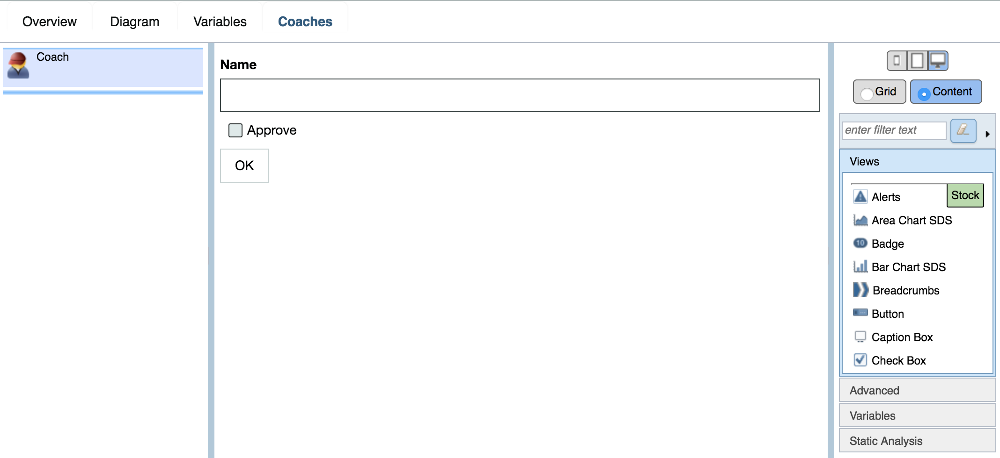

## 第 4 步：测试运行流程并观察运行效果

我们快速回顾一下在 [“云端业务整合，第一部分”](http://www.ibm.com/developerworks/cn/cloud/library/cl-lo-application-integration-using-app-connect/index.html) 中，我们在 IBM App Connect 中实现的业务逻辑：

```
if approve=="True":
    create a task in Asana
    post a "success" message in slack
else:
    post a "reject" message in slack

```

Show moreShow more icon

首先，我们测试 If 分支。点击测试人工流程。单击 debug，在出现的页面中输入任务名，并选择 “Approve”。单击 “OK” 按钮。

##### 图 17\. 测试人工流程

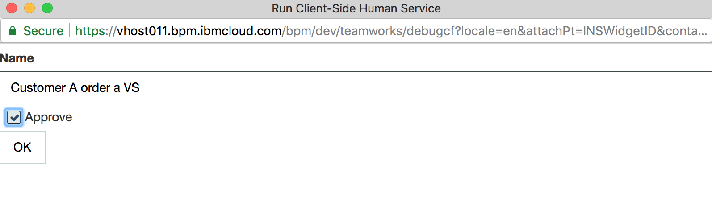

期望的结果是在 Asana 中的 MyTest 项目中生成一个任务，并且在 Slack 里发布一条消息。结果如下图所示。

##### 图 18\. IF 分支测试结果

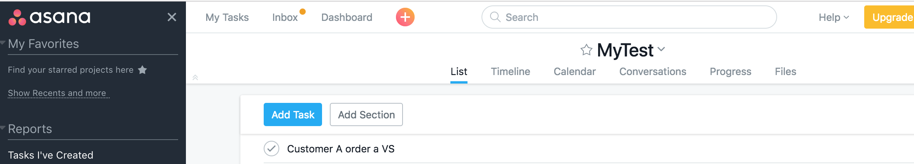

接下来，我们测试 else 路径。再次启动，不选择 “Approve”。

结果如图所示，Slack 中显示审批被拒绝的信息。

##### 图 19\. Else 分支测试结果

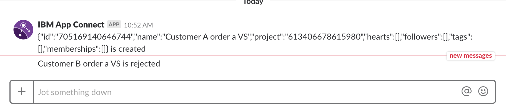

## 第 5 步：增加安全认证

在 [“云端业务整合，第一部分”](http://www.ibm.com/developerworks/cn/cloud/library/cl-lo-application-integration-using-app-connect/index.html) 中，我们提到，为了兼容 IBM BPM on Cloud 的安全定义，我们在从 IBM API Connect 导出 BPM 所使用 swagger 文件之前，先删除了 client\_id 的认证方式，并且 IBM API Connect 和 IBM BPM on Cloud 的服务器定义中都没有启用任何的安全认证。

在真实的客户场景视线中，我们是需要对 API 进行安全保护的。现在我们看一下如何在 API Connect 增加安全认证。

在 IBM API Connect 中点击 Security Definitions 中选择 client\_id（API Key）。

##### 图 20\. Security Definitions 定义

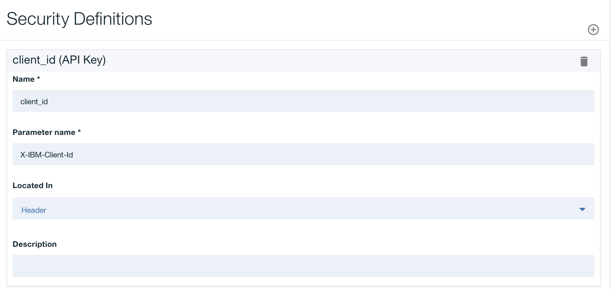

然后创建 client\_secret(API Key)。

##### 图 21\. Client\_secret 创建定义

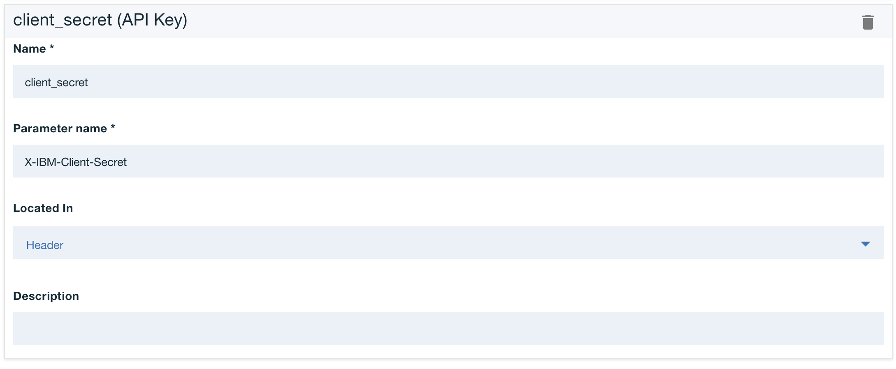

最后勾选 client\_id 和 client\_secret 两项来完成安全定义。

##### 图 22\. Security 安全定义

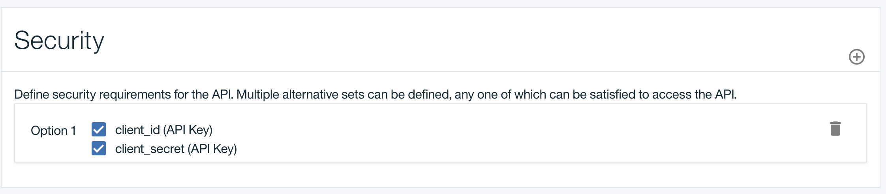

相应的，我们还需要在 IBM BPM on Cloud 中针对流程应用配置中服务器的定义进行修改。

点击服务器的 “Details” 标签，展开 “Authentication” 的定义，输入自定义的用户名和密码。

##### 图 23\. BPM 中进行安全定义

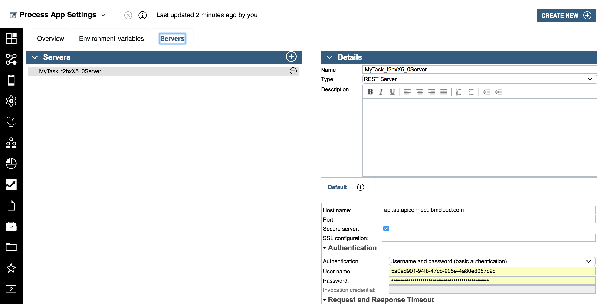

这样，我们就对 Rest API 增加了安全认证，并且在 IBM BPM on Cloud 中应用了这个安全认证策略。

本系列的两篇文章向大家介绍了如何通过 IBM App Connect 去快速整合多个相对独立的 app，甚至外部的第三方 app，并且快速封装成对应的 Rest API。然后借助 IBM API Connect 向大家展示了快速管理 API，并通过一个相对复杂的应用实例向大家展示了整个整合封装和管理的过程，以及该过程中涉及到的各个详细配置。在此基础上，客户可以使用流程编排工具来进行业务的流程编排以及调用文中封装好的 Rest API。最后使用一个流程编排工具（IBM BPM on Cloud）来向大家演示如何对 API Connect 暴露出来的 API 进行调用和流程编排。

## 参考资源

- 访问 [IBM Cloud](https://cocl.us/IBM_CLOUD_GCG) 了解具体 IBM Cloud 提供的服务和功能。
- 访问 [IBM Cloud Forum](https://developer.ibm.com/answers?community=bluemix) ，在论坛中讨论 IBM Cloud 相关的问题。
- 访问 [IBM Cloud 专栏](http://www.ibm.com/developerworks/cn/cloud/bluemix/) ，在这里您可以获得最新最实用的 IBM Cloud 资讯和技术资源。
- 访问 [IBM App Connect](https://developer.ibm.com/integration/docs/app-connect/?cm_mc_uid=70323089749215267774414&cm_mc_sid_50200000=78223151529045760969) 文档了解 IBM App Connect 具体的功能和操作。
- 访问 [IBM BPM on Cloud](https://www.ibm.com/support/knowledgecenter/en/SS964W/com.ibm.wbpm.cloud.man.doc/kc-homepage-manclo.html) 文档来了解更多的 BPM 相关的功能和特性。