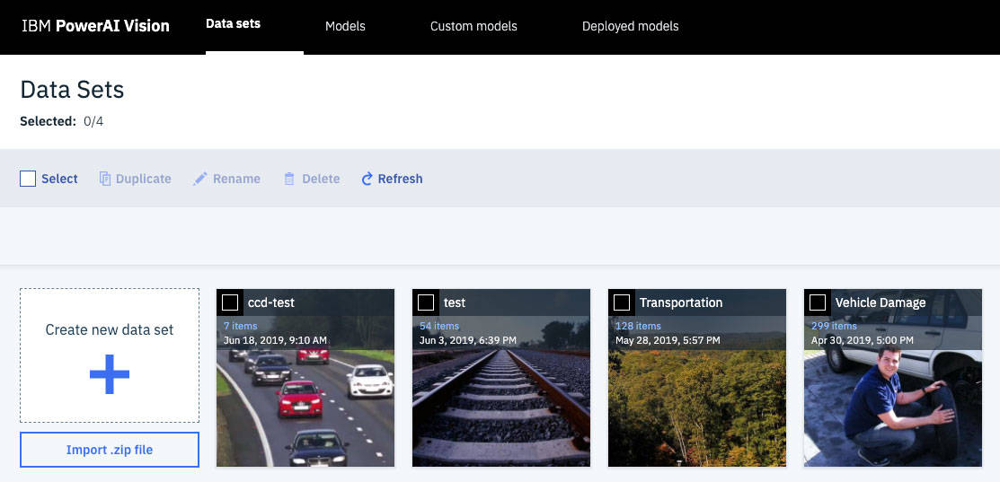
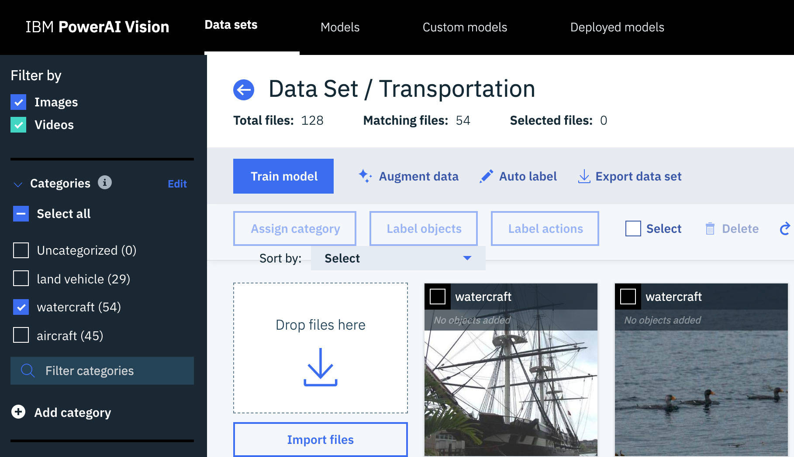
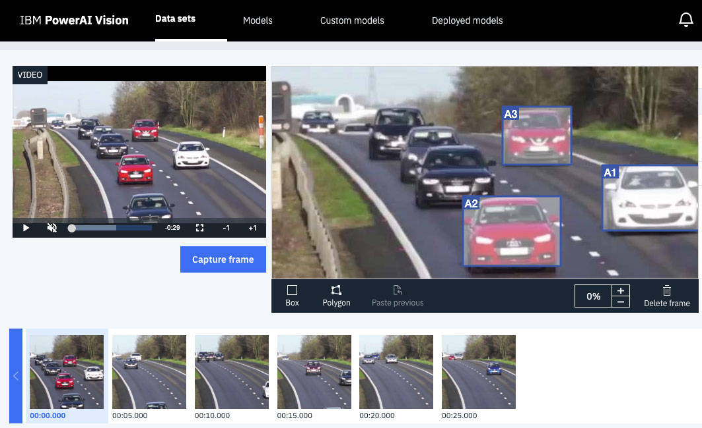
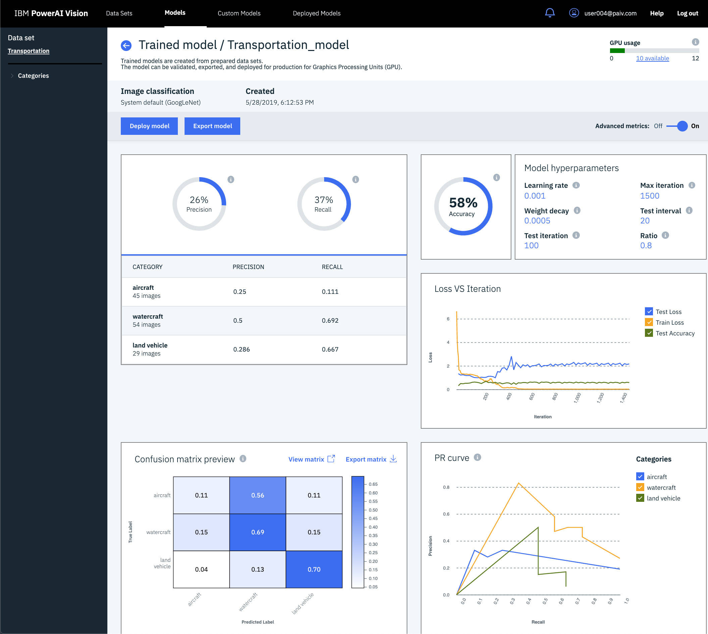
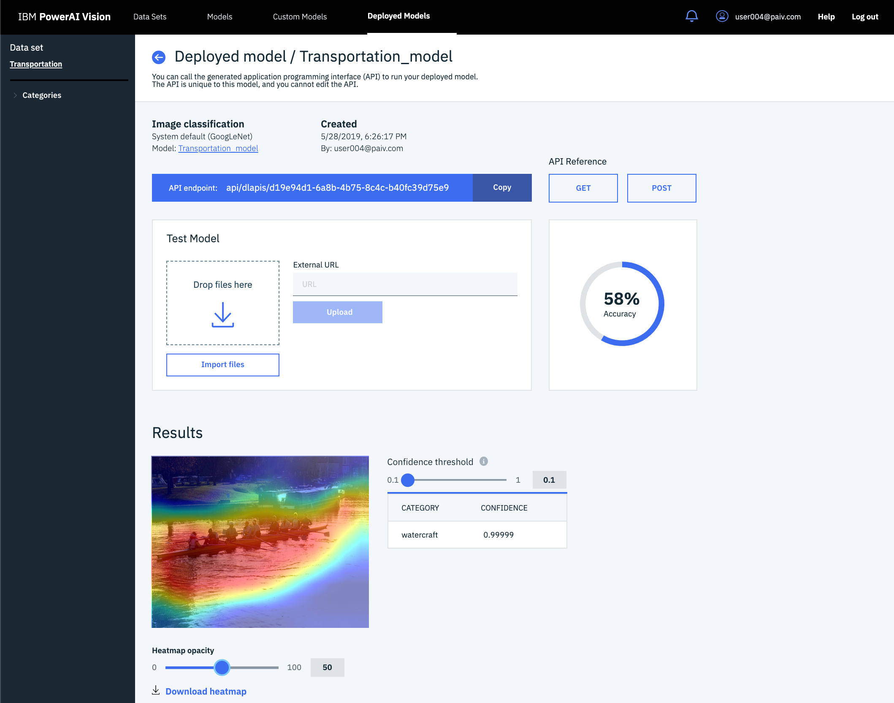

# 使用 IBM Maximo Visual Inspection 的计算机视觉简介
使用 IBM Maximo Visual Inspection 的计算机视觉简介

**标签:** IBM Maximo,IBM Maximo Visual Inspection,人工智能,深度学习,视觉识别

[原文链接](https://developer.ibm.com/zh/articles/introduction-powerai-vision/)

[Mark Sturdevant](https://developer.ibm.com/zh/profiles/mark.sturdevant)

发布: 2020-11-03

* * *

**本文已纳入 [IBM Maximo Visual Inspection 入门](https://developer.ibm.com/zh/series/learning-path-powerai-vision) 学习路径**。

级别主题类型100[计算机视觉简介](https://developer.ibm.com/zh/articles/introduction-computer-vision)文章**101****[IBM Maximo Visual Inspection 简介](https://developer.ibm.com/zh/articles/introduction-powerai-vision)**文章201[构建并部署 IBM Maximo Visual Inspection 模型并在 iOS 应用中使用](https://developer.ibm.com/zh/tutorials/build-and-deploy-a-powerai-vision-model-and-use-it-in-ios/)教程202[通过对象检测定位并统计物体](https://developer.ibm.com/zh/patterns/locate-and-count-items-with-object-detection/)Code Pattern203[使用 OpenCV 和深度学习对视频中的对象进行跟踪](https://developer.ibm.com/zh/patterns/detect-track-and-count-cars-in-a-video/)Code Pattern301[验证计算机视觉深度学习模型](https://developer.ibm.com/zh/patterns/validate-deep-learning-models/)Code pattern302[使用 IBM Maximo Visual Inspection 针对 AI 项目开发分析仪表板](https://developer.ibm.com/zh/patterns/develop-analytical-dashboards-for-ai-projects-with-powerai-vision)Code Pattern303[自动化视觉识别模型训练](https://developer.ibm.com/zh/patterns/upload-datasets-for-training-models-in-ibm-visual-insights/)Code Pattern304[在仪表板中加载 IBM Maximo Visual Inspection 推断结果](https://developer.ibm.com/zh/patterns/generate-dashboards-of-insights-from-inferred-results)Code Pattern305[构建对象检测模型以从汽车图像中识别车牌](https://developer.ibm.com/zh/patterns/custom-inference-script-for-reading-license-plates-of-cars)Code Pattern306[自动化视频分析](https://developer.ibm.com/zh/patterns/derive-insights-from-asset-on-a-transmission-tower/)Code Pattern307[通过 AI 对实时摄像头流和视频收集洞察](https://developer.ibm.com/zh/patterns/glean-insights-with-ai-on-live-camera-streams-and-videos/)Code Pattern

## 概述

IBM Maximo Visual Inspection 可帮助为与计算机视觉相关的深度学习模型提供强大的端到端工作流支持。这款企业级软件提供了一个完整的生态系统，可以标记原始数据集，以用于训练、创建和部署基于深度学习的模型。Maximo Visual Inspection 旨在让不具备深度学习技术技能的主题专家也能够训练用于 AI 应用程序的模型。它可以帮助训练高度精确的模型，使其能够对图像进行分类并检测图像和视频中的对象。

Maximo Visual Inspection 是基于开源框架构建的，用于对容器进行建模和管理以提供高度可用的框架，从而提供应用程序生命周期支持、集中式管理和监控以及 IBM 支持。

## 学习目标

在本学习路径的第一篇文章 [计算机视觉简介](https://developer.ibm.com/zh/articles/introduction-computer-vision) 中，我简要地介绍了计算机视觉以及如何在应用程序中使用计算机视觉。

现在，我将介绍如何使用 Maximo Visual Inspection 提供的易于使用的 UI 来帮助您创建自定义模型，部署该模型以提供 API 端点，并在应用程序中使用该模型。我将讨论如何完成以下任务：

- 创建数据集
- 指定用于图像分类的类别
- 标记用于对象检测的对象
- 训练模型
- 测试模型
- 在应用程序中使用模型

### 访问 Maximo Visual Inspection

您可以下载 Maximo Visual Inspection 的 [90 天试用版](https://epwt-www.mybluemix.net/software/support/trial/cst/programwebsite.wss?siteId=584&tabId=1162&w=1&cm_sp=dw-bluemix-_-linuxonpower-_-devcenter&cm_mc_uid=85085445965215595603615&cm_mc_sid_50200000=49913341562867498269)。

## 创建数据集

首先，您将要创建一个数据集。利用数据集，您可以根据自己的图像集来训练自定义模型。要创建新数据集，可在 **Data sets** 选项卡中单击 **Create a new data set**，然后为其命名。



在获得一个空数据集后，可通过 UI 来添加图像、视频以及图像的 ZIP 文件。可以通过拖放操作或文件选择器来轻松完成此操作。

## 指定用于图像分类的类别

如果要创建 _图像分类_ 模型，则必须指定用于训练的图像类别。

使用 **\+ Add category** 来创建类别，然后使用 **Assign category** 为选定图像指定类别。可以批量执行此操作，具体方法如下：导入某一类别图像的 ZIP 文件，为所有新的“未分类”图像指定该类别，然后针对下一个 ZIP 文件和下一个类别重复此过程。



上传完所有图像并指定类别后，可以通过单击 **Train model** 来开始训练模型。

## 标记用于对象检测的对象

如果要创建 _对象检测_ 模型，则必须标记图像中的对象。

在数据集页面中，可以选择要标记对象在内的图像或视频。如果您正在使用视频，则会出现 **Capture frame** 按钮。在捕获帧之后，您会在图像轮播中看到这些帧。然后，标记图像中的对象，在每个对象周围绘制一个框或多边形。



标记完图像后，返回到数据集页面并单击 **Train model** 来开始训练过程。

## 训练模型

准备好数据集（如上所述）之后，只需要按一下按钮就可以根据数据集训练自定义模型。也可以使用一些其他选项，例如，选择基本模型或自定义迭代次数，但是通常情况下，您可以坐下来观察一下图表，了解模型如何随着不断迭代而改进。您可以等到训练结束，或者选择在损失值停止减小后立即停止训练。

训练停止后，Maximo Visual Inspection 将向您提供一份摘要。下图中显示的结果包括图像分类模型的训练结果。本示例显示的模型还不太准确。这些图表显示的是整体准确性，并且按类别进行了细分，旨在帮助您了解可以从哪些方面改进数据集以优化模型。



现在，您可以部署模型并使用其他图像进一步测试模型，或在应用程序中使用模型。

## 测试模型

部署了模型后，可以使用 Maximo Visual Inspection UI 对其执行更多测试。在下面的图像分类模型测试中，首先导入了一个图像文件以进行测试，然后显示了一些有趣的结果。除了包含类别和置信度的基本结果外，还可以使用热图叠加来显示图像的哪个部分对结果的影响最大。



当您需要优化数据集时，热图指示器可能会对您很有帮助。在前面的示例中，河上的船只被识别为船只图片，但是此模型还倾向于只要图片中包含水就推断它包含船只。

## 在应用程序中使用自定义模型

### API

使用您自己的自定义模型，从应用程序代码中调用 [IBM Maximo Visual Inspection API](https://public.dhe.ibm.com/systems/power/docs/powerai/powerai-vision-api.html) 以集成 _推理_ 功能。此外，该 API 还提供了一个编程接口，用于完成很多也能在 UI 中完成的任务（例如，创建数据集、训练模型和部署）。可通过任何编程语言轻松使用 REST API。

### Python 代码示例

以下 Python 代码片段（摘自 [使用 OpenCV 和深度学习对视频中的对象进行跟踪](https://developer.ibm.com/zh/patterns/detect-track-and-count-cars-in-a-video/) Code Pattern）显示了用于将 JPEG 文件发送到 API 端点 URL 的单行 Post 调用。然后，对 JSON 结果进行格式化并打印该结果。

```lang-python
s = requests.Session()

def detect_objects(filename):

    with open(filename, 'rb') as f:
        # WARNING! verify=False is here to allow an untrusted cert!
        r = s.post(POWER_AI_VISION_API_URL,
                   files={'files': (filename, f)},
                   verify=False)

    return r.status_code, json.loads(r.text)

rc, jsonresp = detect_objects('frames/frame_00100.jpg')

print("rc = %d" % rc)
print("jsonresp: %s" % jsonresp)
if 'classified' in jsonresp:
    print("Got back %d objects" % len(jsonresp['classified']))
print(json.dumps(jsonresp, indent=2))

```

Show moreShow more icon

### Node.js 代码样本

[通过对象检测定位物品并统计数量](https://developer.ibm.com/zh/patterns/locate-and-count-items-with-object-detection/) Code Pattern 使用了 Node.js 服务器。以下代码片段显示了如何通过 Node.js 服务器将其 Web UI 输入（可能是移动设备的相机输入或文件选择器）中的图像以管道方式传递到 API 端点 URL，并将结果发送回 Web UI。

```lang-javascript
app.post('/uploadpic', function(req, result) {
if (!poweraiVisionWebApiUrl) {
    console.log(MISSING_ENV);
    result.send({data: JSON.stringify({error: MISSING_ENV})});
} else {
    req.pipe(request.post({
      url: poweraiVisionWebApiUrl,
      agentOptions: {
        rejectUnauthorized: false,
      }}, function(err, resp, body) {
      if (err) {
        console.log(err);
      }
      console.log(body);
      result.send({data: body});
    }));
}
});

```

Show moreShow more icon

## 结束语

本文是 [IBM Maximo Visual Inspection 入门](https://developer.ibm.com/zh/series/learning-path-powerai-vision) 学习路径的第二部分。继续完成此学习路径，通过实践教程和示例代码来提高您自己的技能水平。

在此学习路径的其余部分中，我们将使用 Maximo Visual Inspection 并将计算机视觉集成到各种应用程序中，例如：

- 将图像分类集成到 iOS 应用程序中
- 将对象检测集成到 Node.js 应用程序中
- 将视频中的对象检测和跟踪与 Python Jupyter Notebook 集成
- 用于持续模型测试的验证方法

这些应用程序都包含示例数据集，但也提供了开源代码，并且可定制为与使用自己数据集进行训练的自定义模型配合使用。您可随时将这些应用程序用于学习、巩固和创新等目的。要继续学习，可阅读下一个教程： [构建和部署 IBM Maximo Visual Inspection 模型并在 iOS 应用程序中使用](https://developer.ibm.com/zh/tutorials/build-and-deploy-a-powerai-vision-model-and-use-it-in-ios/)。

> 注意：要使用 Maximo Visual Inspection 软件的功能，您必须具备企业级 P9 处理器的处理能力。 [学术界和其他非数据研究员](https://medium.com/@atitdp/bringing-computer-vision-training-to-non-data-scientists-in-academia-9f3e2b981c82) 也可以使用另一种经济有效的方法，即在 [Raptor Computing System](https://www.raptorcs.com/POWERAI/) (RCS) Talos II Development System 上部署 Maximo Visual Inspection。

本文翻译自： [Introduction to computer vision using IBM Maximo Visual Inspection](https://developer.ibm.com/articles/introduction-powerai-vision/)（2020-06-16）